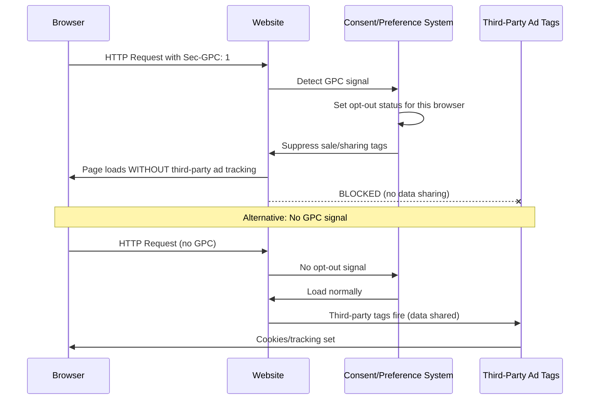

# CCPA/CPRA & US State Privacy Laws

**Topic:** California Consumer Privacy Act (CCPA), California Privacy Rights Act (CPRA), and US State Privacy Laws  
**Laws:** CCPA (Cal. Civ. Code §1798.100-199.100); CPRA (Prop 24, 2020); Virginia CDPA; Colorado CPA; Connecticut CTDPA; Texas TDPSA; other state laws  
**Enforcement:** California Privacy Protection Agency (CPPA); State Attorneys General  
**Domain:** US consumer privacy; data broker regulation; advertising/targeted marketing  
**Audience:** Privacy counsel, compliance officers, marketing teams, product managers, software engineers (US market)  
**Prerequisites:** Basic understanding of US legal system (federal vs. state); personal information concepts

---

## Chapter 1 — Historical Context & Origin Story

### 1.1 Timeline

| Year | Milestone |
|------|-----------|
| 1974 | US Privacy Act (federal government agencies only) |
| 1996 | HIPAA (healthcare data protection) |
| 1998 | COPPA (children's online privacy) |
| 1999 | GLBA (financial data) — Gramm-Leach-Bliley Act |
| 2003 | CAN-SPAM Act (email marketing) |
| 2018 | **CCPA signed** (AB 375, June 2018); California Consumer Privacy Act |
| 2020 | CCPA effective (January 1, 2020); CPRA passed (Proposition 24, November 2020) |
| 2021 | Virginia CDPA signed (March 2021); Colorado CPA signed (July 2021) |
| 2022 | Connecticut CTDPA; Utah UCPA; CPRA AG regulations finalized |
| 2023 | **CPRA enforcement begins** (July 2023); CPPA established; Texas TDPSA; Oregon OCPA; Montana; Iowa; Indiana; Tennessee |
| 2024 | 19+ states have comprehensive privacy laws; ADPPA (federal) still stalled in Congress; more state laws taking effect |

### 1.2 US Privacy Landscape: Sectoral vs. Comprehensive

| Approach | Scope | Examples |
|:--------:|:-----:|---------|
| **Sectoral (federal)** | Specific industries/data types | HIPAA (health); GLBA (finance); COPPA (children); FERPA (education) |
| **Comprehensive (state)** | All personal information of state residents | CCPA/CPRA; Virginia CDPA; Colorado CPA; Connecticut CTDPA |
| **Federal comprehensive** | All US consumers (proposed, not enacted) | ADPPA (American Data Privacy and Protection Act) — stalled since 2022 |

**Key difference from EU:** No single comprehensive US federal privacy law (as of 2024). Result: patchwork of state laws creating compliance complexity.

---

## Chapter 2 — CCPA/CPRA Architecture

### 2.1 CCPA vs. CPRA Comparison

| Feature | CCPA (2018, eff. 2020) | CPRA (2020, eff. Jan 2023; enforced July 2023) |
|:-------:|:---:|:---:|
| **Scope threshold** | >$25M revenue; OR >50K consumers; OR >50% revenue from selling data | >$25M revenue; OR 100K+ consumers/households; OR >50% revenue from selling/sharing |
| **Consumer rights** | Know; Delete; Opt-out of sale; Non-discrimination | + Correct; Limit use of sensitive PI; Opt-out of sharing (cross-context behavioral advertising) |
| **Sensitive data** | Not defined separately | Defined: SSN; financial; geolocation; racial/ethnic; biometric; health; sex life; union membership; private communications; genetic; personal beliefs + child data |
| **Enforcement** | AG only | **CPPA** (California Privacy Protection Agency) — dedicated agency + AG |
| **Cure period** | 30-day cure period before AG action | Eliminated (no cure period under CPPA enforcement) |
| **Service providers** | Basic restrictions | Expanded: contractors distinguished; downstream limitations on PI use |
| **Data minimization** | Not required | Required: collection/use/retention must be "reasonably necessary and proportionate" |
| **Retention limits** | Not required | Required: disclose retention periods; don't retain longer than necessary |
| **Risk assessment** | Not required | Required for high-risk processing (similar to DPIA) |
| **Cybersecurity audit** | Not required | Required for businesses with significant risk to consumer privacy |
| **Automated decision-making** | Not addressed | Right to opt-out of automated decision-making technology; right to information about logic |

### 2.2 Key Definitions

| Term | CCPA/CPRA Definition |
|:----:|---|
| **Personal Information (PI)** | Information that identifies, relates to, describes, is reasonably capable of being associated with a particular consumer or household |
| **Consumer** | California resident (natural person; not business) |
| **Business** | For-profit entity doing business in CA that meets thresholds (revenue/data volume) |
| **Service Provider** | Entity processing PI on behalf of business; contractual restrictions on use |
| **Contractor** | (CPRA) Entity given access to PI through written contract; doesn't process on behalf |
| **Sale** | Selling, renting, releasing, disclosing, making available PI for monetary OR other valuable consideration |
| **Share** | (CPRA) Making available PI for cross-context behavioral advertising (even without monetary exchange) |
| **Sensitive Personal Information** | (CPRA) SSN; driver's license; financial accounts; geolocation; racial/ethnic; communications content; genetic; biometric; health; sex life; union membership |

---

## Chapter 3 — Consumer Rights Deep Dive

### 3.1 CCPA/CPRA Rights

```mermaid
graph TB
    subgraph "CCPA/CPRA Consumer Rights"
        R_KNOW[Right to Know<br/>§1798.100, .110<br/>━━━━━━━━━<br/>What PI is collected<br/>Sources, purposes<br/>Categories shared/sold<br/>Specific pieces of PI]
        
        R_DELETE[Right to Delete<br/>§1798.105<br/>━━━━━━━━━<br/>Request deletion of PI<br/>Notify service providers<br/>Exceptions apply<br/>(legal obligation; transaction)]
        
        R_OPTOUT[Right to Opt-Out<br/>§1798.120<br/>━━━━━━━━━<br/>Opt-out of SALE of PI<br/>CPRA: + opt-out of SHARING<br/>"Do Not Sell/Share My PI" link]
        
        R_CORRECT[Right to Correct<br/>§1798.106 (CPRA)<br/>━━━━━━━━━<br/>Correct inaccurate PI<br/>Business must make<br/>commercially reasonable efforts]
        
        R_LIMIT[Right to Limit<br/>§1798.121 (CPRA)<br/>━━━━━━━━━<br/>Limit USE and DISCLOSURE<br/>of sensitive PI to what is<br/>necessary for service]
        
        R_NONDISCRIM[Non-Discrimination<br/>§1798.125<br/>━━━━━━━━━<br/>Cannot discriminate for<br/>exercising privacy rights<br/>(price; quality; level)]
    end
```

### 3.2 Response Requirements

| Right | Response Deadline | Verification Required | Fee |
|:-----:|:-----------------:|:---:|:---:|
| Right to Know (categories) | 45 days (extendable by 45) | Yes (reasonable) | Free |
| Right to Know (specific pieces) | 45 days (extendable by 45) | Yes (heightened — must verify identity) | Free |
| Right to Delete | 45 days (extendable by 45) | Yes (reasonable) | Free |
| Right to Correct | 45 days (extendable by 45) | Yes (reasonable) | Free |
| Right to Opt-Out | Must process ASAP; max 15 business days | Minimal (don't require account creation) | Free |
| Right to Limit (Sensitive PI) | Must process ASAP | Minimal | Free |

### 3.3 Opt-Out Mechanisms

| Mechanism | Requirement |
|:---------:|-------------|
| **"Do Not Sell or Share My Personal Information"** link | Clear, conspicuous link on homepage (CPRA: combined "Do Not Sell or Share My Personal Information" link) |
| **Global Privacy Control (GPC)** | Must honor browser-level GPC signal as valid opt-out of sale/sharing (CPRA regulations) |
| **"Limit the Use of My Sensitive Personal Information"** link | Required if using/disclosing sensitive PI beyond necessary for service |
| **Opt-out preference signal** | Must honor universal opt-out mechanisms (technical signals like GPC) |

---

## Chapter 4 — US State Privacy Laws Comparison

### 4.1 Comprehensive State Laws (as of 2024)

| State | Law | Effective | Threshold | Enforcement |
|:-----:|:---:|:---------:|:---------:|:-----------:|
| **California** | CCPA/CPRA | 2020/2023 | $25M rev; 100K consumers; 50% data revenue | CPPA + AG |
| **Virginia** | CDPA | Jan 2023 | 100K consumers; OR 25K + 50% data revenue | AG only |
| **Colorado** | CPA | Jul 2023 | 100K consumers; OR 25K + data revenue | AG only |
| **Connecticut** | CTDPA | Jul 2023 | 100K consumers; OR 25K + 25% data revenue | AG only |
| **Utah** | UCPA | Dec 2023 | $25M rev + 100K consumers; OR 25K + 50% | AG only |
| **Texas** | TDPSA | Jul 2024 | No revenue threshold; conducts business in TX | AG only |
| **Oregon** | OCPA | Jul 2024 | 100K consumers; OR 25K + 25% data revenue | AG only |
| **Montana** | MCDPA | Oct 2024 | 50K consumers (adjusted for population) | AG only |
| **Iowa** | ICDPA | Jan 2025 | 100K consumers; OR 25K + 50% data revenue | AG only |
| **Indiana** | INCDPA | Jan 2026 | 100K consumers; OR 25K + 50% data revenue | AG only |
| **Tennessee** | TIPA | Jul 2025 | $25M rev + 175K consumers; OR 25K + 50% | AG only |

### 4.2 State Laws Feature Comparison

| Feature | CA (CPRA) | VA (CDPA) | CO (CPA) | CT (CTDPA) | TX (TDPSA) |
|:-------:|:---------:|:---------:|:---------:|:----------:|:----------:|
| **Private right of action** | Limited (data breaches only) | No | No | No | No |
| **Right to know** | ✓ | ✓ (access) | ✓ (access) | ✓ (access) | ✓ |
| **Right to delete** | ✓ | ✓ | ✓ | ✓ | ✓ |
| **Right to correct** | ✓ | ✓ | ✓ | ✓ | ✓ |
| **Right to portability** | ✓ | ✓ | ✓ | ✓ | ✓ |
| **Opt-out of sale** | ✓ | ✓ | ✓ | ✓ | ✓ |
| **Opt-out of targeted advertising** | ✓ (sharing) | ✓ | ✓ | ✓ | ✓ |
| **Opt-out of profiling** | ✓ (ADMT) | ✓ | ✓ | ✓ | ✓ |
| **Sensitive data consent** | Opt-out (limit use) | Opt-in | Opt-in | Opt-in | Opt-in |
| **Data minimization** | ✓ (CPRA) | ✓ | ✓ | ✓ | ✓ |
| **Cure period** | None | 30 days (sunsets 2025) | 60 days (sunsets 2025) | 60 days (sunsets Dec 2024) | 30 days |
| **Universal opt-out signal** | ✓ (mandatory) | ✓ (Jan 2025) | ✓ (Jul 2024) | ✓ | Not specified |

---

## Chapter 5 — Implementation Guide

### 5.1 Multi-State Compliance Strategy

```mermaid
graph TB
    subgraph "US Multi-State Privacy Compliance Architecture"
        subgraph "Determine Applicability"
            THRESHOLD[Threshold Analysis<br/>• Revenue per state<br/>• Consumer count per state<br/>• Data revenue percentage<br/>• Entity type (for-profit?)]
        end
        
        subgraph "Implement Core (baseline)"
            NOTICE[Privacy Notice<br/>• Comprehensive disclosure<br/>• Right-to-know categories<br/>• Sale/sharing disclosure<br/>• Sensitive PI disclosure<br/>• Retention periods (CPRA)]
            
            RIGHTS_ENG[Rights Engine<br/>• Intake: web form; toll-free #<br/>• Verification<br/>• Response (45 days)<br/>• Opt-out processing]
            
            OPTOUT[Opt-Out Infrastructure<br/>• "Do Not Sell/Share" link<br/>• GPC signal recognition<br/>• Cookie/tag management<br/>• Vendor signal propagation]
        end
        
        subgraph "State-Specific Overlays"
            CA_OVER[California Overlay<br/>• CPPA registration<br/>• Risk assessments<br/>• Cybersecurity audit<br/>• Sensitive PI limit link]
            VA_CO[VA/CO/CT Overlay<br/>• Opt-in for sensitive<br/>• DPA equivalent<br/>• Cure period handling<br/>• Appeal process]
        end
    end
    
    THRESHOLD --> NOTICE
    THRESHOLD --> RIGHTS_ENG
    THRESHOLD --> OPTOUT
    NOTICE --> CA_OVER
    NOTICE --> VA_CO
```

### 5.2 "Do Not Sell or Share" Implementation

| Component | Implementation |
|:---------:|----------------|
| **Homepage link** | Clearly visible; above fold or in persistent footer; labeled "Do Not Sell or Share My Personal Information" |
| **Opt-out page** | Simple form; no account required; no excessive steps; process within 15 business days |
| **GPC signal** | Detect `Sec-GPC: 1` header or `navigator.globalPrivacyControl`; treat as opt-out for that browser/device |
| **Downstream propagation** | Notify all third parties to whom PI was sold/shared in past 90 days; contractual requirement for third parties to comply |
| **Cookie/tag management** | On opt-out: disable third-party tracking pixels; advertising cookies; cross-context behavioral advertising tags |
| **Re-consent** | Cannot ask consumer to re-consent for 12 months after opt-out |

### 5.3 Verification Standards (AG Regulations)

| Request Type | Verification Level | Methods |
|:---:|:---:|---|
| **Know (categories only)** | Reasonable | Match 2+ data points (email + name; email + account #) |
| **Know (specific pieces)** | Heightened | Match 3+ data points + signed declaration under penalty of perjury |
| **Delete** | Reasonable → Heightened (depending on sensitivity) | 2-3 data points; may require re-confirmation from consumer |
| **Opt-out** | Minimal | Do not require account creation; basic device/browser identification sufficient |
| **Authorized agent** | Agent verification + consumer verification | Signed permission; power of attorney; consumer confirms to business |

---

## Chapter 6 — Enforcement & Penalties

### 6.1 CCPA/CPRA Penalties

| Violation Type | Fine | Enforcer |
|:-:|:---:|:---:|
| Unintentional violation | Up to $2,500 per violation | CPPA or AG |
| Intentional violation | Up to $7,500 per violation | CPPA or AG |
| Violation involving minor (under 16) | Up to $7,500 per violation | CPPA or AG |
| Data breach (private action) | $100-$750 per consumer per incident (or actual damages) | Consumer (private right of action) |

### 6.2 Notable Enforcement Actions

| Company | Year | Fine/Settlement | Violation |
|:-------:|:----:|:---:|---|
| Sephora | 2022 | $1.2M | Failed to honor GPC opt-out signal; failed to disclose sale of PI; failed to cure within 30 days |
| DoorDash | 2023 | Settlement | Sold customer PI without notice/opt-out |
| Google (CPPA) | 2024 | Under investigation | Location data; consent practices |
| Multiple (AG sweep) | 2023 | Various | AG sent cure notices to 100+ businesses not honoring GPC signals |

### 6.3 Private Right of Action (§1798.150)

| Requirement | Detail |
|:-----------:|--------|
| **Trigger** | Data BREACH (not general privacy violation) |
| **Data types** | Nonencrypted/nonredacted PI: name + SSN; driver's license; financial account; medical; health insurance |
| **Damages** | $100-$750 per consumer per incident; OR actual damages (whichever greater) |
| **Pre-suit** | 30-day written notice to business (business can cure if no prior notice) |
| **Class actions** | Allowed — creates significant financial exposure for large breaches |

---

## Chapter 7 — Comparison: CCPA/CPRA vs. GDPR

| Aspect | CCPA/CPRA | GDPR |
|:------:|:---------:|:----:|
| **Approach** | Consumer RIGHTS (opt-out; you can process unless consumer objects) | LEGAL BASIS (cannot process without lawful basis; default = no processing) |
| **Default** | Processing allowed (consumer opts out) | Processing NOT allowed (must have basis) |
| **Scope trigger** | Revenue/data volume thresholds | Any entity processing EU data (no size threshold) |
| **Consent model** | Opt-out (except sensitive PI under CPRA) | Opt-in (consent must be affirmative) |
| **"Sale" concept** | Central (broad definition includes ads) | Not a specific concept (sharing = processing requiring basis) |
| **Sensitive data** | Opt-out of secondary use (CPRA) | Opt-in only (Art. 9; explicit consent) |
| **Enforcement** | AG + CPPA + private action (breach) | Independent DPAs + individuals (broader) |
| **Fines** | Per-violation ($2,500-$7,500) | Percentage of revenue (up to 4%) |
| **Data minimization** | CPRA adds (proportionate) | Core principle from day 1 (Art. 5(1)(c)) |
| **DPO** | Not required | Required (certain cases) |
| **Breach notification** | To consumers "in most expedient time" | 72 hours to DPA; "without undue delay" to individuals |

---

## Chapter 8 — Architecture Diagrams

### 8.1 CCPA/CPRA Compliance System Architecture

```mermaid
graph TB
    subgraph "CCPA/CPRA Compliance Architecture"
        subgraph "Consumer-Facing"
            NOTICE_P[Privacy Policy<br/>• Categories of PI collected<br/>• Purposes<br/>• Categories sold/shared<br/>• Rights description<br/>• Retention periods (CPRA)]
            DNS_LINK["Do Not Sell/Share" Link<br/>• Homepage placement<br/>• Simple opt-out form<br/>• GPC signal handling]
            LIMIT_LINK["Limit Sensitive PI" Link<br/>• Sensitive PI categories used<br/>• Limit to service necessity]
            RIGHTS_P[Rights Portal<br/>• Submit requests (know/delete/correct)<br/>• Toll-free number (alt)<br/>• Status tracking<br/>• Verification flow]
        end
        
        subgraph "Backend Systems"
            CONSENT_DB[Consent/Preference Store<br/>• Opt-out status per consumer<br/>• GPC signal records<br/>• Sensitive PI preferences<br/>• 12-month no-reask rule]
            DATA_MAP[Data Inventory<br/>• PI categories collected<br/>• Sources<br/>• Service providers<br/>• Third parties receiving<br/>• Retention schedules]
            VENDOR_MGT[Vendor Management<br/>• Service provider agreements<br/>• Contractor agreements<br/>• Opt-out signal propagation<br/>• Annual audits]
        end
        
        subgraph "Advertising/Data Sharing"
            TAG_MGT[Tag Management<br/>• Block on opt-out<br/>• GPC-aware loading<br/>• Category mapping<br/>• Audit logging]
        end
    end
    
    DNS_LINK --> CONSENT_DB
    RIGHTS_P --> DATA_MAP
    CONSENT_DB --> TAG_MGT
    CONSENT_DB --> VENDOR_MGT
```

### 8.2 Global Privacy Control (GPC) Flow



---

## Chapter 9 — Case Studies

### 9.1 Sephora — First Major CCPA Enforcement ($1.2M)

| Aspect | Detail |
|--------|--------|
| **Company** | Sephora (beauty retailer; Proposition 65 cosmetics) |
| **Violations** | (1) Failed to disclose in privacy policy that it was SELLING consumer PI. (2) Failed to honor GPC opt-out signals. (3) Failed to provide "Do Not Sell" opt-out mechanisms. (4) After AG's cure notice: failed to cure within 30 days. |
| **How "sale" occurred** | Sephora shared customer browsing data, purchase history, and device identifiers with third-party analytics and advertising companies → received "other valuable consideration" (services/insights in return) = "sale" under CCPA |
| **Settlement** | $1.2M fine; required: (a) disclose sale of PI in privacy policy; (b) provide mechanisms to opt-out including GPC; (c) conform service provider agreements; (d) provide reports to AG on compliance |
| **Industry impact** | Signal to ALL businesses: (1) sharing data with ad-tech IS a "sale." (2) GPC MUST be honored. (3) AG is actively enforcing. (4) "We didn't know it was a sale" is not a defense. |

### 9.2 Multi-State Compliance — E-Commerce Company

| Aspect | Detail |
|--------|--------|
| **Company** | National e-commerce retailer; 5M customers across all 50 states; online + mobile app |
| **Challenge** | Subject to: CCPA/CPRA (CA); CDPA (VA); CPA (CO); CTDPA (CT); TDPSA (TX); UCPA (UT); plus 10+ other state laws taking effect 2024-2025 |
| **Strategy** | "Highest watermark" approach: comply with MOST restrictive state (California/CPRA) as baseline; add state-specific requirements as overlays |
| **Implementation** | (1) **Single privacy policy** with state-specific sections. (2) **Universal opt-out** (GPC + "Do Not Sell/Share" link) applied to all states. (3) **Sensitive data**: opt-in consent for all states (CPRA uses opt-out; VA/CO/CT use opt-in → opt-in satisfies all). (4) **Rights engine**: single portal; 45-day response (CA); geolocation-aware for state-specific rights. (5) **Data minimization**: applied globally (CPRA requirement; good practice for all). (6) **Vendor agreements**: single template covering all state law requirements (SP/contractor restrictions). |
| **Outcome** | One compliance program serves all states. Marginal cost per new state law: minimal (review requirements; confirm coverage). No enforcement actions. Consumer trust improved (proactive privacy stance). |

---

## Chapter 10 — Future Evolution

| Trend | Timeline | Impact |
|-------|----------|--------|
| **Federal privacy law (ADPPA)** | Uncertain (2025+?) | If enacted: could preempt state laws (simplified compliance); or create floor with state additions |
| **More state laws** | 2024-2026 | 25+ states expected to have comprehensive privacy laws by 2026; increasing compliance complexity without federal law |
| **CPRA rulemaking** | Ongoing (2024+) | CPPA regulations on: automated decision-making; cybersecurity audits; risk assessments; dark patterns |
| **GPC/universal opt-out** | Now (expanding) | More states mandating GPC recognition; W3C standardization; browser-native implementation |
| **AI/automated decisions** | 2024-2026 | CPRA ADMT regulations; right to opt-out of automated profiling; transparency requirements |
| **Children's privacy** | 2024-2025 | California Age-Appropriate Design Code; COPPA 2.0 discussions; child data as high-risk |
| **Data broker regulation** | 2024+ | California DELETE Act (2024): universal data broker deletion mechanism; Vermont/Oregon data broker registries |
| **Private right of action expansion** | 2025+ | Some states considering expanding beyond breach-only (Washington proposed broader private action) |

---

## Chapter 11 — Interview Questions & Career Guide

### Tier 1: Entry-Level

**Q1:** What is the difference between "sale" and "sharing" of personal information under CPRA?

**A:**

| Concept | Definition | Key Trigger |
|:-------:|:---|:---:|
| **Sale (§1798.140(ad))** | Selling, renting, releasing, disclosing, making available PI to another business for **monetary or other valuable consideration** | Monetary OR other value received (e.g., free analytics service in exchange for data) |
| **Sharing (§1798.140(ah))** | Making available PI to a third party for **cross-context behavioral advertising** | Purpose = targeted advertising across contexts (even without monetary exchange) |

**Why "sharing" was added (CPRA):** Under original CCPA, companies argued sharing data with ad-tech for behavioral advertising wasn't a "sale" because they received no direct payment. CPRA closed this loophole by adding "sharing" specifically for cross-context behavioral advertising (regardless of whether money changes hands).

**Consumer right:** "Do Not Sell or Share My Personal Information" — single opt-out covers BOTH.

### Tier 2: Mid-Level

**Q2:** Your company receives a consumer "Right to Delete" request. Describe the process, including exceptions you would evaluate.

**A:**

**Process:**

| Step | Action |
|:----:|--------|
| 1 | **Receive** request via designated channel (web form; toll-free; email) |
| 2 | **Verify identity** (match 2+ data points: email + name + account number) |
| 3 | **Acknowledge** receipt; inform of 45-day timeline |
| 4 | **Search** all systems for consumer's PI (structured + unstructured; including backups within policy) |
| 5 | **Evaluate exceptions** (see below) — can retain data covered by exception |
| 6 | **Delete** all PI not covered by exception; permanently remove from active systems |
| 7 | **Notify service providers** — direct them to delete consumer's PI from their systems |
| 8 | **Respond** to consumer: confirm deletion; list any exceptions applied (and why) |
| 9 | **Document** actions taken; retain audit record (not the PI itself) |

**Exceptions (§1798.105(d)):** May retain PI if needed to:
- Complete the transaction for which PI was collected
- Detect security incidents; protect against fraud
- Debug/identify errors
- Exercise free speech (First Amendment)
- Comply with legal obligation (tax records; employment law)
- Internal uses reasonably aligned with consumer expectations
- Comply with law enforcement legal process

### Tier 3: Senior

**Q3:** Design a technical architecture for honoring Global Privacy Control (GPC) signals across a complex ad-tech ecosystem with 50+ third-party vendors.

**A:**

**Architecture:**

| Layer | Component | Implementation |
|:-----:|:---------:|----------------|
| **Detection** | GPC Signal Detector | (1) Server-side: check `Sec-GPC: 1` HTTP header on every request. (2) Client-side: check `navigator.globalPrivacyControl === true`. (3) Persist decision in first-party cookie/local storage for session consistency. |
| **Decision** | Privacy Decision Engine | (1) GPC detected → consumer has opted out of sale/sharing. (2) Check: is consumer California resident? Virginia? Colorado? (geolocation/account state). (3) Apply: if ANY applicable state mandates GPC → enforce opt-out. (4) Conservative approach: honor for ALL users regardless of state (simplifies compliance; future-proof). |
| **Enforcement** | Tag Management System (TMS) | (1) Categorize all 50+ tags: "necessary" (analytics: first-party only); "advertising" (cross-context); "sale" (data broker). (2) On GPC opt-out: BLOCK all "advertising" and "sale" category tags from loading. (3) Allow only "necessary" tags (first-party analytics without cross-context sharing). (4) Server-side enforcement: API calls to vendors suppressed (not just client-side tag blocking). |
| **Propagation** | Vendor Signal Propagation | (1) For vendor APIs (server-to-server): include opt-out signal in API calls (e.g., `do_not_sell=true` parameter). (2) For real-time bidding: pass "restricted" signal in bid request (IAB TCF equivalent). (3) IAB USPrivacy string: set `1YY-` (opted out of sale). (4) Contractual: vendor agreements require honoring opt-out signals received. |
| **Verification** | Compliance Monitoring | (1) Automated scanning: use privacy monitoring tool (e.g., Evidon/OneTrust Scanner) to verify no tracking fires after opt-out. (2) Quarterly audits: sample requests with GPC → verify network traffic shows no third-party data sharing. (3) Vendor attestation: annual confirmation from vendors that they honor signals. |
| **Audit** | Record-Keeping | (1) Log: GPC signal received (timestamp; consumer identifier; response). (2) Log: tags blocked/allowed per request. (3) Retention: sufficient for regulatory inquiry (3+ years). |

---

## Chapter 12 — Cheat Sheet & Quick Reference

```
═══════════════════════════════════════════
CCPA/CPRA & US STATE LAWS — QUICK REFERENCE
═══════════════════════════════════════════

CCPA/CPRA SCOPE (meet ANY threshold):
  • Annual gross revenue >$25M
  • Buy/sell/share PI of 100K+ consumers/households
  • >50% annual revenue from selling/sharing PI

═══════════════════════════════════════════
CONSUMER RIGHTS (CPRA):
  1. Right to Know (what PI; sources; purposes; recipients)
  2. Right to Delete (exceptions: legal; security; transaction)
  3. Right to Correct (inaccurate PI)
  4. Right to Opt-Out of Sale/Sharing
  5. Right to Limit Sensitive PI Use
  6. Right to Non-Discrimination
  7. Right re: Automated Decision-Making (CPRA regs)

  Response deadline: 45 days (extendable by 45)
  Opt-out: process within 15 business days

═══════════════════════════════════════════
"SALE" vs. "SHARING":
  Sale: PI disclosed for monetary OR other valuable consideration
  Sharing: PI made available for cross-context behavioral advertising
  Both require: "Do Not Sell or Share My PI" opt-out link

═══════════════════════════════════════════
GPC (Global Privacy Control):
  • Browser signal: Sec-GPC: 1 header
  • JS: navigator.globalPrivacyControl
  • MUST honor as valid opt-out (CA, CO, CT, MT)
  • Apply to sale AND sharing

═══════════════════════════════════════════
FINES:
  Unintentional: $2,500/violation
  Intentional: $7,500/violation
  Minor (under 16): $7,500/violation
  Data breach (private): $100-$750/consumer/incident

═══════════════════════════════════════════
SERVICE PROVIDER vs. THIRD PARTY:
  Service Provider: processes PI ON BEHALF; contractual limits
  Third Party: receives PI (sale/sharing); independent purposes
  Contractor (CPRA): given access; written contract; not on behalf

═══════════════════════════════════════════
KEY LINKS REQUIRED ON WEBSITE:
  ✓ "Do Not Sell or Share My Personal Information"
  ✓ "Limit the Use of My Sensitive Personal Information" (if applicable)
  ✓ Privacy Policy (comprehensive; updated annually)
  ✓ Rights request method (web form or toll-free #)

═══════════════════════════════════════════
MULTI-STATE STRATEGY:
  Baseline: comply with CPRA (most restrictive)
  Sensitive data: use opt-in (satisfies VA/CO/CT/TX)
  GPC: honor universally (future-proof)
  Rights: single portal; geolocation-aware
  Vendors: unified agreements covering all states

═══════════════════════════════════════════
CPRA NEW REQUIREMENTS:
  • Data minimization (proportionate collection)
  • Retention period disclosure
  • Risk assessments (high-risk processing)
  • Cybersecurity audits (significant risk)
  • No cure period (CPPA enforcement)
  • CPPA (dedicated enforcement agency)
```

---

*End of Document — 02_CCPA_CPRA_US_State_Laws.md*
