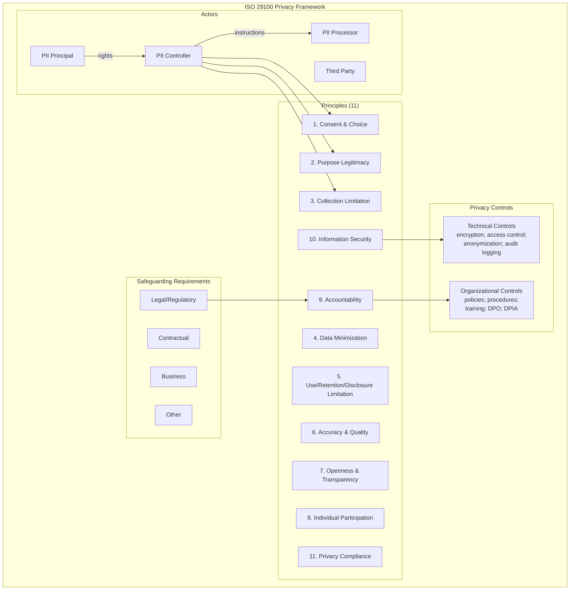
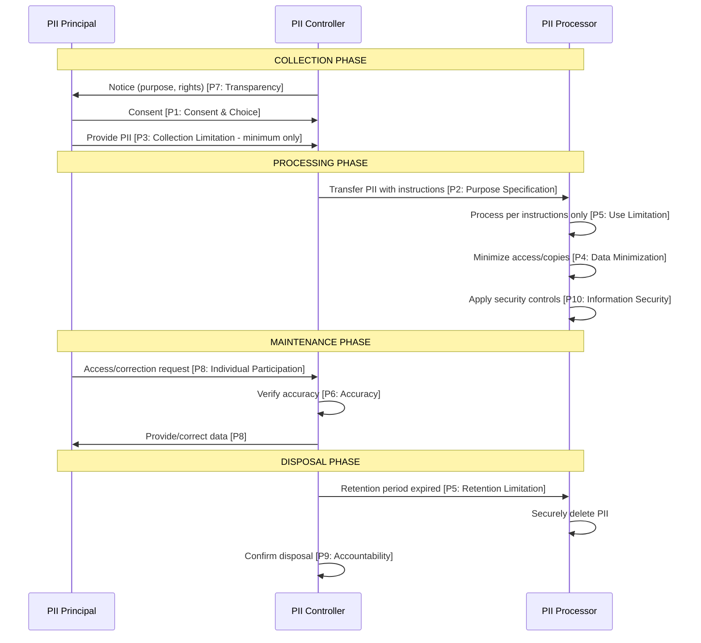

# ISO/IEC 29100 — Privacy Framework

**Topic:** ISO/IEC 29100:2011 (AMD 1:2018) — Information Technology — Security Techniques — Privacy Framework  
**Standard:** ISO/IEC 29100:2011 + AMD1:2018  
**SDO:** ISO/IEC JTC 1/SC 27  
**Domain:** Privacy principles; privacy architecture; PII processing terminology  
**Audience:** Privacy architects, system designers, policy makers, DPOs, security professionals  
**Prerequisites:** Basic privacy concepts; familiarity with information systems; understanding of data flows

---

## Chapter 1 — Historical Context & Origin Story

### 1.1 Timeline

| Year | Milestone |
|------|-----------|
| 1980 | OECD Privacy Guidelines (8 principles — foundational for global privacy) |
| 1995 | EU Data Protection Directive 95/46/EC |
| 2004 | APEC Privacy Framework (9 principles) |
| 2009 | ISO/IEC 29100 project initiated (SC 27 WG 5) |
| 2011 | **ISO/IEC 29100:2011 published** — Privacy Framework |
| 2013 | Referenced by ISO/IEC 27018 (cloud PII), ISO/IEC 29134 (PIA), ISO/IEC 29151 |
| 2016 | EU GDPR adopted (references many 29100 concepts) |
| 2017 | ISO/IEC 29100 under review for amendment |
| 2018 | **AMD1:2018 published** — adds definitions for "biometric data," "sensitive PII," aligns with GDPR concepts |
| 2019 | Referenced as terminology source for ISO/IEC 27701:2019 |
| 2024 | Under systematic review; potential revision to address AI privacy; remains active normative reference |

### 1.2 Purpose and Role

| Role | Description |
|:----:|-------------|
| **Foundational vocabulary** | Provides common privacy terminology used across ALL ISO/IEC privacy standards (PII, PII principal, PII controller, PII processor) |
| **Privacy principles** | Defines 11 privacy principles (expanded from OECD 8); referenced by 27701, 27018, 29134, 29151 |
| **Framework (not certifiable)** | Provides GUIDANCE framework, not a management system (not directly certifiable, unlike 27701) |
| **Architecture reference** | Defines actors, interactions, and privacy safeguarding requirements for system design |
| **Cross-standard foundation** | All ISO/IEC privacy standards reference 29100 for definitions and principles |

---

## Chapter 2 — Standard Architecture

### 2.1 Document Structure

| Clause | Title | Content |
|:------:|:------|---------|
| 1 | Scope | Privacy framework for ICT systems processing PII |
| 2 | Normative references | ISO/IEC 27000 |
| 3 | Terms and definitions | 28 defined terms (foundational privacy vocabulary) |
| 4 | Symbols and abbreviated terms | PII; PIA; ICT |
| 5 | **Basic elements of the privacy framework** | Actors; roles; interactions; recognizing PII; privacy requirements; policies |
| 6 | **Privacy principles** | 11 privacy principles with detailed guidance |
| Annex A | Correspondence with other standards | Mapping to OECD Guidelines; APEC Framework; EU Directive |

### 2.2 Key Definitions (Clause 3)

| Term | Definition |
|:----:|------------|
| **PII (Personally Identifiable Information)** | Any information that (a) can be used to establish a link between the information and the natural person to whom it relates, or (b) is or might be directly or indirectly linked to a natural person |
| **PII Principal** | Natural person to whom the PII relates (= "data subject" in GDPR) |
| **PII Controller** | Privacy stakeholder that determines the purposes and means for processing PII (= "controller" in GDPR) |
| **PII Processor** | Privacy stakeholder that processes PII on behalf of and according to instructions of a PII controller (= "processor" in GDPR) |
| **Privacy safeguarding requirements** | Set of requirements that an organization has to take into account when processing PII with respect to the privacy protection of PII |
| **Privacy risk** | Effect of uncertainty on privacy including potential effects on PII principals |
| **Sensitive PII** (AMD1:2018) | PII where misuse could have severe consequences for the PII principal (e.g., medical; genetic; biometric; financial; criminal record) |
| **Biometric data** (AMD1:2018) | PII resulting from specific technical processing of physical, physiological, or behavioral characteristics of a natural person |
| **Consent** | PII principal's freely given, specific, informed agreement to the processing of their PII |
| **Third party** | Privacy stakeholder other than the PII controller, PII processor, or PII principal |

---

## Chapter 3 — Privacy Principles (Clause 6) — Deep Dive

### 3.1 The 11 Privacy Principles

| # | Principle | Description |
|:-:|:----------|:------------|
| 1 | **Consent and choice** | PII principal's consent for PII processing; ability to choose level of participation |
| 2 | **Purpose legitimacy and specification** | Processing purposes must be compliant with applicable law; specified BEFORE or at time of collection |
| 3 | **Collection limitation** | PII collected limited to what is necessary for specified purposes |
| 4 | **Data minimization** | Minimize PII processed; minimize number of people with access; where possible, de-identify |
| 5 | **Use, retention and disclosure limitation** | Use limited to stated purposes; retain only as long as necessary; disclose only as specified |
| 6 | **Accuracy and quality** | PII should be accurate, complete, up-to-date; proportionate to purposes |
| 7 | **Openness, transparency and notice** | Clear, easily accessible information about policies, procedures, and practices regarding PII |
| 8 | **Individual participation and access** | PII principals can access, review, correct, and where appropriate, have PII deleted |
| 9 | **Accountability** | PII controller accountable for PII processing; demonstrate compliance |
| 10 | **Information security** | Protect PII with appropriate controls (confidentiality, integrity, availability) |
| 11 | **Privacy compliance** | Verify and demonstrate that processing meets privacy and data protection requirements |

### 3.2 Principle Mapping to Other Frameworks

| ISO 29100 Principle | OECD (1980) | GDPR (2016) Art. 5 | APEC (2004) |
|:---:|:---:|:---:|:---:|
| 1. Consent and choice | — | Art. 6(1)(a), 7 (Consent) | III. Choice |
| 2. Purpose legitimacy | Purpose specification | Art. 5(1)(b) (Purpose limitation) | II. Notice |
| 3. Collection limitation | Collection limitation | Art. 5(1)(c) (Data minimisation) | IV. Collection limitation |
| 4. Data minimization | — (implicit) | Art. 5(1)(c) (Data minimisation) | IV. Collection limitation |
| 5. Use/retention/disclosure | Use limitation | Art. 5(1)(b),(e) (Purpose; Storage limitation) | V. Uses of PI |
| 6. Accuracy and quality | Data quality | Art. 5(1)(d) (Accuracy) | VI. Integrity |
| 7. Openness/transparency | Openness | Art. 5(1)(a) (Transparency) | II. Notice |
| 8. Individual participation | Individual participation | Art. 15-22 (Data subject rights) | VII. Access and correction |
| 9. Accountability | Accountability | Art. 5(2) (Accountability) | IX. Accountability |
| 10. Information security | Security safeguards | Art. 5(1)(f) (Integrity/confidentiality) | VIII. Security safeguards |
| 11. Privacy compliance | — | Art. 5(2) + supervisory authority | IX. Accountability |

### 3.3 Expanded Principle Detail

| Principle | Key Requirements (from ISO 29100) |
|:---:|---|
| **Consent and choice** | (a) Present choice to PII principal when applicable. (b) Obtain opt-in consent for sensitive PII. (c) PII principal can withdraw consent. (d) Inform consequences of not providing consent. (e) Provide mechanism to exercise choice. |
| **Purpose legitimacy** | (a) Ensure processing complies with applicable law. (b) Communicate purposes BEFORE collection. (c) Only process for stated purposes unless new consent. (d) Document purposes for audit. |
| **Collection limitation** | (a) Limit to minimum necessary for stated purposes. (b) Obtain PII from PII principal directly where feasible. (c) Inform principal if obtained from third party. |
| **Data minimization** | (a) Minimize PII processed to what is adequate and relevant. (b) De-identify where full identification not needed. (c) Delete/de-identify when purpose fulfilled. (d) Limit access to minimum number of persons. |
| **Use/retention/disclosure** | (a) Limit use to stated purposes. (b) Retain only as long as necessary. (c) Disclose only when authorized by law, consent, or contract. (d) Dispose securely when no longer needed. |
| **Information security** | (a) Apply controls proportionate to risk (likelihood × impact). (b) Protect CIA (confidentiality, integrity, availability). (c) Protect against unauthorized access, destruction, disclosure. (d) Use encryption, access controls, logging, etc. |

---

## Chapter 4 — Framework Elements: Actors & Interactions

### 4.1 Privacy Actors

```mermaid
graph TB
    subgraph "ISO 29100 Privacy Actors and Interactions"
        PP[PII Principal<br/>━━━━━━━━━<br/>Natural person<br/>whose PII is processed<br/>= GDPR "data subject"]
        
        PC[PII Controller<br/>━━━━━━━━━<br/>Determines purposes<br/>and means of processing<br/>= GDPR "controller"]
        
        PROC[PII Processor<br/>━━━━━━━━━<br/>Processes PII on behalf<br/>of and according to<br/>instructions of controller<br/>= GDPR "processor"]
        
        TP[Third Party<br/>━━━━━━━━━<br/>Other stakeholder<br/>Not controller/processor<br/>May receive PII<br/>under legal basis]
    end
    
    PP -->|"provides PII<br/>gives consent<br/>exercises rights"| PC
    PC -->|"instructs processing<br/>defines purpose/means"| PROC
    PC -->|"may disclose PII<br/>(with legal basis)"| TP
    PROC -->|"processes PII<br/>returns results"| PC
    PC -->|"provides notice<br/>enables rights<br/>ensures accuracy"| PP
```

### 4.2 Recognizing PII (Clause 5.2)

| Type | Examples | Method of Identification |
|:----:|----------|-------------------------|
| **Directly identifying** | Full name; photo; national ID number; email address | Can be linked to individual WITHOUT additional information |
| **Indirectly identifying** | IP address; device ID; location data; browsing history; cookie identifier | Can be linked to individual WITH additional information or contextual data |
| **Linked** | Medical records WITH patient name; HR file WITH employee ID | PII because it IS associated with identified person |
| **Linkable** | Anonymous survey + demographics + zip code | May become PII if combined with other data enabling re-identification |

### 4.3 Privacy Safeguarding Requirements (Clause 5.5)

| Category | Requirement |
|:--------:|-------------|
| **Legal/regulatory** | Applicable privacy laws; sector-specific regulations; international requirements |
| **Contractual** | Obligations to PII principals (privacy policies); obligations in contracts (DPAs; customer agreements) |
| **Business** | Business-driven privacy requirements (competitive advantage; customer trust; brand) |
| **Other** | Industry codes of conduct; self-regulatory frameworks; organizational policies |

---

## Chapter 5 — Implementation: Applying ISO 29100 Principles

### 5.1 Principle-to-Implementation Mapping

| Principle | Implementation Actions |
|:---:|---|
| **1. Consent & choice** | Consent management platform; granular opt-in/opt-out; withdrawal mechanism; records of consent |
| **2. Purpose specification** | Privacy notice (published before/at collection); ROPA (record of processing activities); purpose limitation checks in code |
| **3. Collection limitation** | Form field review (remove unnecessary fields); data flow audit; input validation (don't accept more than needed) |
| **4. Data minimization** | Pseudonymization at ingestion; role-based access (principle of least privilege); data masking in non-production; automated de-identification |
| **5. Use/retention/disclosure** | Retention schedule (automated deletion); purpose-bound access policies; disclosure logging; DPA with processors |
| **6. Accuracy** | Self-service data update portals; periodic data quality checks; automated validation (email; address); correction request workflow |
| **7. Transparency** | Layered privacy notice; just-in-time notifications; cookie banners; data usage dashboards |
| **8. Individual participation** | Self-service portal (view/download/delete); automated DSR fulfillment; identity verification; audit trail |
| **9. Accountability** | DPO appointment; DPIA process; compliance documentation; audit program; training records |
| **10. Information security** | Encryption (at rest + transit); access controls; monitoring; incident response; penetration testing |
| **11. Privacy compliance** | Internal audits; external certifications (ISO 27701); privacy metrics; regulatory mapping; gap assessments |

### 5.2 Privacy-by-Design Using ISO 29100

| Design Phase | Principle Application |
|:---:|---|
| **Requirements** | Identify PII processed; determine purpose; select legal basis; define retention; document in requirements spec |
| **Architecture** | Minimize data flows; pseudonymize early; separate identifiers from data; access control architecture |
| **Development** | Input validation (collect minimum); encryption libraries; logging (audit trail without logging PII); secure APIs |
| **Testing** | Use synthetic/anonymized data in test environments; privacy test cases (verify purpose limitation; access controls) |
| **Deployment** | Consent gate before first collection; privacy notice displayed; GPC/opt-out signals honored |
| **Operations** | Retention automation (delete on schedule); DSR response workflow; breach detection and response |
| **Decommission** | Secure data disposal; certificate of destruction; notify processors to delete; archive retention evidence |

---

## Chapter 6 — ISO 29100 in the Standards Ecosystem

### 6.1 Relationship Map

| Standard | How It Uses ISO 29100 |
|:--------:|---|
| **ISO/IEC 27701:2019** | References 29100 for ALL privacy definitions (PII, controller, processor, principal); uses principles as foundation |
| **ISO/IEC 27018:2019** | Cloud PII protection; references 29100 principles; applies to PII processor (cloud service provider) |
| **ISO/IEC 29134:2023** | Privacy Impact Assessment (PIA); methodology references 29100 principles as assessment criteria |
| **ISO/IEC 29151:2017** | Code of practice for PII protection; implements 29100 principles as operational controls |
| **ISO/IEC 27550:2019** | Privacy engineering (system lifecycle); references 29100 for privacy requirements |
| **ISO/IEC 20889:2018** | Privacy-enhancing data de-identification techniques; implements principle 4 (data minimization) |

### 6.2 How 29100 Vocabulary Feeds Other Standards

```mermaid
graph TB
    subgraph "ISO 29100 as Vocabulary Foundation"
        V29100[ISO/IEC 29100<br/>━━━━━━━━━<br/>DEFINITIONS:<br/>PII, PII Principal<br/>PII Controller<br/>PII Processor<br/>Consent, Privacy Risk<br/>━━━━━━━━━<br/>PRINCIPLES (11)]
        
        ISO27701[ISO 27701<br/>PIMS]
        ISO27018[ISO 27018<br/>Cloud PII]
        ISO29134[ISO 29134<br/>PIA]
        ISO29151[ISO 29151<br/>PII Code of Practice]
        ISO27550[ISO 27550<br/>Privacy Engineering]
    end
    
    V29100 -->|"terms + principles"| ISO27701
    V29100 -->|"terms + principles"| ISO27018
    V29100 -->|"terms + principles"| ISO29134
    V29100 -->|"terms + principles"| ISO29151
    V29100 -->|"terms + principles"| ISO27550
```

---

## Chapter 7 — Comparison: Privacy Frameworks

| Criterion | ISO/IEC 29100 | OECD Guidelines | APEC Framework | NIST Privacy Framework | EU GDPR |
|:---------:|:---:|:---:|:---:|:---:|:---:|
| **Year** | 2011 (amd 2018) | 1980 (rev 2013) | 2004 (rev 2015) | 2020 | 2016 (eff. 2018) |
| **Type** | Standard (framework) | Intergovernmental recommendation | Regional framework | Voluntary framework | Legislation (law) |
| **Principles** | 11 | 8 | 9 | 5 functions (not principles per se) | 7 (Art. 5) |
| **Certifiable** | No (guidance only) | No | Yes (CBPR) | No | Via approved mechanisms |
| **Scope** | ICT systems processing PII | All personal data sectors | Commercial sector (APEC) | Organizations (US focus) | All processing of personal data (EU) |
| **Legal force** | None (voluntary) | Soft law (influential) | Voluntary (binding if CBPR) | None | Binding law (with fines) |
| **Unique contribution** | Common vocabulary for ISO privacy standards; 11 principles | Foundational principles (global influence) | Cross-border transfer mechanism (CBPR) | Risk-based; outcome-focused; bridges security-privacy | Directly enforceable rights; extraterritorial |

---

## Chapter 8 — Architecture Diagrams

### 8.1 ISO 29100 Privacy Framework Conceptual Model



### 8.2 PII Lifecycle Based on ISO 29100 Principles



---

## Chapter 9 — Case Studies

### 9.1 Applying ISO 29100 Principles in System Design

| Aspect | Detail |
|--------|--------|
| **Scenario** | Design of a patient health portal (hospital; EU-based; GDPR applies) |
| **Design decision** | Use ISO 29100 principles as design checklist |
| **Application** | |

| Principle | Design Decision |
|:---:|---|
| **P1: Consent** | Granular consent: treatment (legal obligation; no consent needed); research (explicit opt-in); marketing (separate opt-in). Withdrawal = one-click. |
| **P2: Purpose** | Three distinct purposes declared: (1) patient care; (2) clinical research (anonymized); (3) service improvement. Each tracked separately in system. |
| **P3: Collection limitation** | Registration form: only medically necessary fields. No "nice to have" fields. Optional fields clearly marked. |
| **P4: Minimization** | Research database receives ONLY pseudonymized data. Key held separately. Access to identifiable data: clinical staff only. |
| **P5: Retention** | Patient records: per legal requirement (15 years). Research data: project duration + 5 years (then delete). Marketing consent: until withdrawn. Audit logs: 6 years. |
| **P6: Accuracy** | Patient self-service: update contact info, allergies, medications. Automatic prompts every 12 months to verify. Clinical staff updates flagged for patient confirmation. |
| **P7: Transparency** | Layered privacy notice: short summary on registration; full policy linked; just-in-time notices before each new data use. Access log visible to patient (who accessed their record). |
| **P8: Access/participation** | Patient portal: download full record (FHIR format); request deletion of optional data; restrict access to specific departments; view audit trail. |
| **P9: Accountability** | DPO designated; DPIA conducted before go-live; annual privacy audit; compliance dashboard for management; processor agreements with all third parties. |
| **P10: Security** | TLS 1.3 (transit); AES-256 (at rest); MFA for clinicians; RBAC with department-level granularity; SIEM monitoring; annual penetration test. |
| **P11: Compliance** | GDPR Art. 30 register; ISO 27701 certification planned; quarterly compliance reviews; DPA relationship with supervisory authority. |

### 9.2 ISO 29100 for Multi-Jurisdictional Compliance Mapping

| Aspect | Detail |
|--------|--------|
| **Organization** | Global technology company; 30 countries; 50M+ users |
| **Challenge** | Must comply with GDPR (EU), CCPA (US-CA), LGPD (Brazil), APPI (Japan), PIPL (China) — each has different terminology and requirements |
| **Solution** | Use ISO 29100 as "common language" layer. Map each regulation's requirements to 29100 principles. Implement controls at PRINCIPLE level (not regulation level). |
| **Mapping approach** | For each regulation → map to 29100 principle → identify MOST RESTRICTIVE interpretation → implement that. Result: one implementation satisfying all. |
| **Example** | Retention (Principle 5): GDPR says "no longer than necessary"; LGPD says "until purpose achieved"; PIPL says "shortest period necessary." Implementation: shortest demonstrably necessary period + documented justification = satisfies all three. |
| **Outcome** | Single privacy program; documented compliance to 5+ laws via one framework; audit preparation reduced 60% (one evidence set; multiple mappings). |

---

## Chapter 10 — Future Evolution

| Trend | Timeline | Impact on ISO 29100 |
|-------|----------|---------------------|
| **Revision/update** | 2024-2026 | Potential new edition addressing AI, IoT, biometric privacy; additional principles or expanded guidance |
| **AI-specific principles** | 2025+ | New principle or expanded guidance: algorithmic transparency; automated decision-making; training data privacy |
| **Children's privacy** | 2024-2026 | Enhanced guidance for child PII; age verification; parental consent mechanisms |
| **Harmonization with NIST** | 2025+ | Mapping to NIST Privacy Framework functions; mutual referencing |
| **Quantum impact** | 2027+ | Information security principle updated for post-quantum cryptography requirements |
| **Decentralized identity** | 2025-2028 | Self-sovereign identity concepts; how principals control PII without centralized controller |

---

## Chapter 11 — Interview Questions & Career Guide

### Tier 1: Entry-Level

**Q1:** List the 11 privacy principles of ISO/IEC 29100 and explain how they extend the OECD's 8 principles.

**A:**

The 11 ISO 29100 principles:
1. Consent and choice
2. Purpose legitimacy and specification
3. Collection limitation
4. Data minimization
5. Use, retention and disclosure limitation
6. Accuracy and quality
7. Openness, transparency and notice
8. Individual participation and access
9. Accountability
10. Information security
11. Privacy compliance

**Extensions beyond OECD's 8:**

| OECD Principle | ISO 29100 Evolution |
|:---:|---|
| Collection limitation | Split into: Collection limitation (P3) + Data minimization (P4) — adds proactive de-identification requirement |
| — | NEW: Privacy compliance (P11) — formal verification of compliance; goes beyond accountability |
| — | Consent and choice elevated to FIRST principle (P1) — OECD didn't have explicit consent principle |
| Use limitation | Expanded: Use, RETENTION, and disclosure limitation (P5) — explicitly covers retention |

### Tier 2: Mid-Level

**Q2:** Explain the distinction between "PII controller" and "PII processor" in ISO 29100, and provide a real-world scenario where the roles might overlap or be unclear.

**A:**

| Aspect | PII Controller | PII Processor |
|:------:|:-:|:-:|
| **Decides** | Purposes AND means of processing | Neither (follows instructions) |
| **Responsibility** | Primary accountability for privacy compliance | Compliance with controller's instructions + own security obligations |
| **Relationship to principal** | Direct (provides notice; handles rights) | Indirect (via controller) |
| **ISO 29100 obligations** | ALL 11 principles apply directly | Security (P10); purpose limitation (P5); minimization (P4) under instruction |

**Unclear scenario: Cloud email provider for enterprise**
- Company A (enterprise) uses Cloud Provider B for employee email.
- For EMAIL CONTENT: Company A = controller (decides purpose: business communication). Provider B = processor (stores/delivers per A's instructions).
- For SERVICE METADATA (e.g., performance analytics; spam filtering improvement): Provider B may be CONTROLLER (it determines the purpose of using metadata to improve its own service).
- This dual-role scenario is common in cloud services and must be clearly documented in contractual agreements.

### Tier 3: Senior

**Q3:** Design a privacy architecture for an IoT smart home platform using ISO 29100 principles as your design framework. Address the challenge that IoT devices collect continuous, pervasive data.

**A:**

| Principle | IoT Challenge | Architecture Solution |
|:---:|:---|:---|
| **P1: Consent** | Devices collect continuously; no screen for consent UI | (1) Consent at device setup (companion app). (2) Granular: per-device; per-data-type; per-purpose. (3) Easy withdrawal (app toggle; physical switch on device). (4) "Active collection" LED indicator on device. |
| **P3: Collection limitation** | Sensors can collect everything continuously | (1) Edge processing: voice wake-word detection ON-DEVICE (only transmit after wake-word). (2) Motion sensor: only detect "occupied/unoccupied" (not full video). (3) Aggregate locally; transmit summaries (not raw). |
| **P4: Data minimization** | Raw sensor data is excessive | (1) On-device aggregation (5-minute averages, not per-second). (2) Differential privacy: add noise before cloud upload. (3) Federated learning: train models locally; upload only gradients. (4) Pseudonymize device-to-user mapping at gateway. |
| **P5: Retention** | Cloud could store forever | (1) Tiered retention: raw (7 days); aggregated (90 days); anonymized (indefinite). (2) Automated deletion pipelines. (3) User-visible retention dashboard. (4) Right-to-delete: triggers cascade to all processing stages. |
| **P7: Transparency** | Complex data flows; multiple purposes | (1) Data flow diagram in app (visual; per-device). (2) Real-time: "Your thermostat sent X bytes to Y server for Z purpose." (3) Notification on new data use (firmware update adding collection). |
| **P8: Participation** | User can't easily "see" what device collected | (1) Full data download (JSON export). (2) Visual timeline of all data collected per device. (3) Delete by time range; by data type; by device. (4) "Pause" collection per device. |
| **P10: Security** | Constrained devices; limited CPU/memory | (1) TLS 1.3 with hardware security module. (2) Mutual authentication (device ↔ cloud). (3) Signed firmware updates. (4) Network segmentation (IoT VLAN). (5) Zero-trust: each device authenticates independently. |

---

## Chapter 12 — Cheat Sheet & Quick Reference

```
═══════════════════════════════════════════
ISO/IEC 29100 — QUICK REFERENCE
═══════════════════════════════════════════

WHAT IS IT:
  Privacy FRAMEWORK (not management system)
  Provides: vocabulary + 11 principles + actor model
  Foundation for ALL ISO privacy standards
  NOT CERTIFIABLE (but underpins ISO 27701 which IS)

═══════════════════════════════════════════
11 PRIVACY PRINCIPLES:
  1. Consent and choice
  2. Purpose legitimacy and specification
  3. Collection limitation
  4. Data minimization
  5. Use, retention and disclosure limitation
  6. Accuracy and quality
  7. Openness, transparency and notice
  8. Individual participation and access
  9. Accountability
  10. Information security
  11. Privacy compliance

═══════════════════════════════════════════
KEY ACTORS:
  PII Principal = data subject (GDPR)
  PII Controller = controller (GDPR)
  PII Processor = processor (GDPR)
  Third Party = recipient; not controller/processor

═══════════════════════════════════════════
PII RECOGNITION:
  Directly identifying: name; photo; national ID
  Indirectly identifying: IP; device ID; location
  Linked: record already associated with person
  Linkable: could identify if combined with other data

═══════════════════════════════════════════
PRIVACY SAFEGUARDING REQUIREMENTS:
  • Legal/regulatory
  • Contractual
  • Business-driven
  • Other (codes of conduct; industry standards)

═══════════════════════════════════════════
STANDARDS THAT REFERENCE ISO 29100:
  ISO 27701 (PIMS) — uses terms + principles
  ISO 27018 (cloud PII) — uses terms + principles
  ISO 29134 (PIA) — assessment against principles
  ISO 29151 (PII code of practice) — implements principles
  ISO 27550 (privacy engineering) — system lifecycle

═══════════════════════════════════════════
MAPPING TO GDPR ARTICLES:
  P1 (Consent) → Art. 6(1)(a), 7
  P2 (Purpose) → Art. 5(1)(b)
  P3+P4 (Minimization) → Art. 5(1)(c)
  P5 (Use/Retention) → Art. 5(1)(b),(e)
  P6 (Accuracy) → Art. 5(1)(d)
  P7 (Transparency) → Art. 5(1)(a), 12-14
  P8 (Participation) → Art. 15-22
  P9 (Accountability) → Art. 5(2), 24
  P10 (Security) → Art. 5(1)(f), 32
  P11 (Compliance) → Art. 5(2), 58

═══════════════════════════════════════════
USE CASES:
  • Common vocabulary for privacy program
  • Design checklist (Privacy by Design)
  • Gap analysis framework
  • Multi-regulation compliance mapping
  • Training curriculum structure
  • Audit criteria (principle-by-principle)
```

---

*End of Document — 04_ISO_29100_Privacy_Framework.md*
