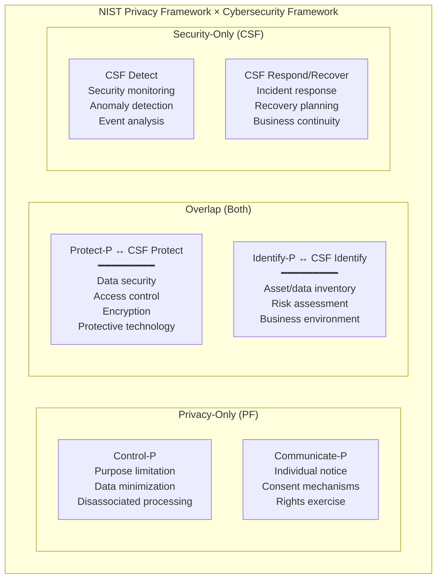

# NIST Privacy Framework 1.0

**Topic:** NIST Privacy Framework: A Tool for Improving Privacy through Enterprise Risk Management  
**Version:** 1.0 (January 2020)  
**Organization:** National Institute of Standards and Technology (NIST), US Department of Commerce  
**Related:** NIST SP 800-188 (De-Identification); NIST IR 8062 (Privacy Engineering); NIST SP 800-122 (PII Confidentiality)  
**Domain:** Enterprise privacy risk management; privacy engineering; organizational privacy programs  
**Audience:** Privacy officers, CISOs, risk managers, product managers, engineers, organizational leadership  
**Prerequisites:** Basic understanding of risk management; familiarity with NIST Cybersecurity Framework (CSF) helpful but not required

---

## Chapter 1 — Historical Context & Origin Story

### 1.1 Timeline

| Year | Milestone |
|------|-----------|
| 2014 | NIST Cybersecurity Framework (CSF) 1.0 published — becomes widely adopted |
| 2016 | NIST begins exploring privacy engineering (IR 8062 published) |
| 2017 | NIST holds workshops on privacy framework need; GDPR approaching |
| 2018 | NIST Privacy Framework development begins; public comment periods |
| 2019 | Multiple drafts; extensive stakeholder engagement (industry, academia, government, civil society) |
| 2020 | **NIST Privacy Framework 1.0 published** (January 16, 2020) |
| 2020 | NIST SP 800-188 (De-Identification of Government Datasets) |
| 2023 | NIST CSF 2.0 development — alignment discussions with Privacy Framework |
| 2024 | NIST CSF 2.0 published; Privacy Framework 1.1 discussions; NIST AI RMF crosswalk |

### 1.2 Design Philosophy

| Principle | Description |
|:---------:|-------------|
| **Voluntary** | Not a regulation; a TOOL for organizations to manage privacy risk |
| **Outcome-based** | Specifies WHAT to achieve, not HOW (technology/implementation neutral) |
| **Risk-based** | Organizations determine their own risk appetite; prioritize accordingly |
| **Flexible** | Applicable to any organization size, sector, or jurisdiction |
| **Compatible** | Works WITH (not replaces) privacy laws (GDPR, CCPA, etc.) and standards (ISO 29100, 27701) |
| **Relationship to CSF** | Parallel structure; overlapping where cybersecurity and privacy intersect; distinct where they diverge |

---

## Chapter 2 — Framework Architecture

### 2.1 Three Components

| Component | Purpose | Description |
|:---------:|:-------:|-------------|
| **Core** | WHAT activities and outcomes | Taxonomy of privacy protection activities organized into Functions → Categories → Subcategories |
| **Profiles** | WHERE you are / WHERE you want to be | Selection of Functions/Categories/Subcategories based on business needs, risk appetite, regulatory requirements |
| **Implementation Tiers** | HOW sophisticated your approach | Maturity levels (1-4) describing rigor of privacy risk management practices |

### 2.2 Core Structure: 5 Functions

| Function | Code | Purpose | Parallel to CSF? |
|:--------:|:----:|---------|:---:|
| **Identify-P** | ID-P | Understanding privacy risks from data processing | Partially (CSF Identify) |
| **Govern-P** | GV-P | Governance structure for managing privacy risk | Partially (CSF Govern in 2.0) |
| **Control-P** | CT-P | Managing data with sufficient granularity | Privacy-specific (NO CSF parallel) |
| **Communicate-P** | CM-P | Ensuring individuals understand data processing and exercising rights | Privacy-specific (NO CSF parallel) |
| **Protect-P** | PR-P | Developing and implementing safeguards | Direct (CSF Protect) |

### 2.3 Functions → Categories → Subcategories

| Function | Categories | Example Subcategories |
|:--------:|:----------:|---|
| **Identify-P** | Inventory and Mapping (ID.IM-P); Business Environment (ID.BE-P); Risk Assessment (ID.RA-P); Data Processing Ecosystem (ID.DE-P) | ID.IM-P1: Systems processing data inventoried; ID.RA-P3: Potential problematic data actions identified |
| **Govern-P** | Governance Policies (GV.PO-P); Risk Management Strategy (GV.RM-P); Awareness/Training (GV.AT-P); Monitoring/Review (GV.MT-P) | GV.PO-P1: Organizational privacy values and policies established; GV.RM-P1: Risk management processes established |
| **Control-P** | Data Processing Management (CT.DM-P); Data Processing Awareness (CT.DP-P); Disassociated Processing (CT.DS-P) | CT.DM-P1: Data processed only for identified purposes; CT.DS-P1: Data processed to limit observability |
| **Communicate-P** | Communication Policies (CM.PO-P); Data Processing Awareness (CM.AW-P) | CM.AW-P1: Mechanisms exist for individuals to know about data processing; CM.AW-P4: Mechanisms for individual consent |
| **Protect-P** | Data Protection Policies (PR.PO-P); Identity Management (PR.AC-P); Data Security (PR.DS-P); Maintenance (PR.MA-P); Protective Technology (PR.PT-P) | PR.DS-P1: Data-at-rest protected; PR.AC-P1: Identities and credentials managed |

---

## Chapter 3 — Technical Deep Dive

### 3.1 Relationship Between Privacy and Cybersecurity

```mermaid
graph TB
    subgraph "Privacy ↔ Cybersecurity Relationship"
        subgraph "Privacy Risk"
            PRIV_ONLY[Privacy-Only Risks<br/>━━━━━━━━━<br/>• Excessive data collection<br/>• Processing beyond consent<br/>• Insufficient transparency<br/>• Lack of individual rights<br/>• Function creep<br/>• Surveillance<br/>NO security breach needed]
        end
        
        subgraph "Overlap"
            OVERLAP_R[Privacy + Security Risks<br/>━━━━━━━━━<br/>• Data breach exposing PII<br/>• Unauthorized access to data<br/>• Insider threat (privacy violation + security incident)<br/>Security failure → Privacy harm]
        end
        
        subgraph "Security Risk"
            SEC_ONLY[Security-Only Risks<br/>━━━━━━━━━<br/>• DDoS (availability)<br/>• Ransomware (non-PII systems)<br/>• IP theft (trade secrets)<br/>• Infrastructure compromise<br/>NO privacy impact]
        end
    end
```

**Key insight:** The Privacy Framework addresses risks that CANNOT be managed by cybersecurity alone. A perfectly secure system can still create privacy harms (e.g., lawfully collected excessive data, fully encrypted but used for unauthorized profiling).

### 3.2 Problematic Data Actions (Core Concept)

| Problematic Data Action | Description | Example |
|:-:|---|---|
| **Appropriation** | Data used in ways beyond individual's expectations | Health data collected for treatment → sold to advertisers |
| **Distortion** | Inaccurate data representation of individual | Incorrect credit score due to data error; affects individual |
| **Induced disclosure** | Pressure to reveal data beyond reasonable expectation | App requiring location access for simple calculator function |
| **Insecurity** | Inadequate protection leading to unauthorized access | Data breach due to poor encryption |
| **Re-identification** | Anonymized data linked back to individuals | Research dataset de-anonymized via auxiliary data |
| **Stigmatization** | Data revealing attributes leading to discrimination | Medical condition visible to employer via data inference |
| **Surveillance** | Pervasive observation/monitoring beyond expectation | Employee monitoring every keystroke; constant location tracking |
| **Unanticipated revelation** | Data analysis revealing unexpected personal info | Shopping patterns revealing pregnancy before individual knows |
| **Unwarranted restriction** | Data used to unjustly limit access/opportunities | Credit algorithm blocking individual from services unfairly |

### 3.3 Implementation Tiers

| Tier | Label | Description |
|:----:|:-----:|-------------|
| **1** | Partial | Privacy risk management ad hoc; limited awareness; reactive |
| **2** | Risk Informed | Risk management practices exist but not organization-wide; awareness growing; some process formalization |
| **3** | Repeatable | Risk management policies formalized; consistently implemented across organization; proactive approach; regularly updated |
| **4** | Adaptive | Organization adapts practices based on lessons learned; predictive capabilities; continuous improvement; privacy is part of organizational culture and all decisions |

---

## Chapter 4 — Implementation Guide

### 4.1 Using Profiles for Gap Analysis

| Step | Activity | Output |
|:----:|----------|--------|
| **1** | **Create Current Profile** | Assess which subcategories organization currently achieves → "Current Profile" |
| **2** | **Create Target Profile** | Based on regulatory requirements + business objectives + risk appetite → "Target Profile" |
| **3** | **Gap Analysis** | Compare Current vs. Target → identify gaps (subcategories in Target but not in Current) |
| **4** | **Prioritize** | Rank gaps by: risk (likelihood × impact to individuals); regulatory requirement; business priority |
| **5** | **Action Plan** | For each gap: define control/action; assign owner; timeline; resources; metrics |
| **6** | **Implement** | Execute action plan; track progress |
| **7** | **Reassess** | Periodically recreate Current Profile; compare to Target; repeat |

### 4.2 Mapping to Regulations

| NIST PF Function | GDPR Mapping | CCPA/CPRA Mapping | ISO 27701 Mapping |
|:---:|:---:|:---:|:---:|
| **Identify-P** | Art. 30 (Records); Art. 35 (DPIA) | §1798.100 (disclosure requirements) | Clause 5 (context); A.7.2.8 (records) |
| **Govern-P** | Art. 24 (controller responsibility); Art. 37 (DPO) | §1798.185 (regulations compliance) | Clause 5 (leadership; policy) |
| **Control-P** | Art. 5(1)(b) (purpose limitation); Art. 5(1)(c) (minimization); Art. 25 (PbD) | §1798.100(b) (purpose limitation); CPRA data minimization | A.7.4 (PbD); A.7.2 (collection) |
| **Communicate-P** | Art. 12-14 (transparency); Art. 15-22 (rights) | §1798.100-135 (consumer rights); notice at collection | A.7.3 (obligations to principals) |
| **Protect-P** | Art. 32 (security of processing) | §1798.150 (security obligation for private action) | ISO 27001 controls (inherited) |

### 4.3 Integration with NIST CSF

| Approach | When to Use |
|:--------:|-------------|
| **Integrated program** | Organization wants unified security + privacy risk management; single governance structure |
| **Parallel programs** | Security and privacy teams separate; need to maintain distinct programs but identify overlaps |
| **Privacy-first** | Organization starting privacy program; security already mature; extend with privacy-specific functions |
| **Crosswalk method** | Map CSF subcategories to PF subcategories; identify: overlap (both cover); CSF-only; PF-only |

**Overlap areas (managed by BOTH):**
- Protect-P ↔ CSF Protect (data security; access control)
- Identify-P (inventory) ↔ CSF Identify (asset management)

**Privacy-only areas (PF adds to CSF):**
- Control-P (data processing management; purpose limitation; disassociated processing)
- Communicate-P (individual notice; consent; rights mechanisms)

---

## Chapter 5 — NIST Supporting Publications

### 5.1 NIST SP 800-188 — De-Identification of Government Datasets

| Aspect | Detail |
|:------:|--------|
| **Purpose** | Guidance for de-identifying government datasets for public release |
| **Key concepts** | De-identification ≠ anonymization (may be re-identifiable with effort); adequacy depends on release type |
| **Release types** | Public release (highest de-identification needed); restricted release (moderate); controlled environment (lowest) |
| **Techniques** | Suppression; generalization; noise addition; swapping; synthetic data |
| **Risk model** | Motivated intruder test; assess re-identification probability given available auxiliary data |

### 5.2 NIST IR 8062 — Introduction to Privacy Engineering

| Concept | Description |
|:-------:|-------------|
| **Privacy engineering objectives** | Predictability; Manageability; Disassociability |
| **Predictability** | Enabling reliable assumptions about whether and how PII is processed |
| **Manageability** | Providing capability for granular administration of PII (consent; access; correction; deletion) |
| **Disassociability** | Enabling processing without associating data with specific individuals or devices (anonymization; pseudonymization; aggregation) |

### 5.3 NIST SP 800-122 — Guide to Protecting PII Confidentiality

| Topic | Guidance |
|:-----:|---------|
| **PII identification** | Context-dependent determination; same data may/may not be PII depending on context |
| **Confidentiality impact** | Low; Moderate; High — based on: harm type; number affected; sensitivity |
| **Safeguards** | Operational (policy; training); privacy-specific (minimization; de-identification); security (encryption; access) |

---

## Chapter 6 — Ecosystem & Tooling

### 6.1 NIST Privacy Framework Resources

| Resource | Purpose |
|:--------:|---------|
| **NIST PF website** | Official framework document; crosswalks; FAQs; implementation resources |
| **CSF-PF Crosswalk** | Official mapping between Cybersecurity Framework and Privacy Framework subcategories |
| **NIST PRAM** (Privacy Risk Assessment Methodology) | Methodology for assessing privacy risk using problematic data actions |
| **NIST Privacy Engineering Collaboration Space** | Tools; use cases; implementation examples |

### 6.2 Tools Supporting NIST PF Implementation

| Category | Tools | Use Case |
|:--------:|:-----:|----------|
| **GRC/Compliance** | OneTrust, TrustArc, NIST CSF Tool | Profile creation; gap analysis; control mapping |
| **Privacy Engineering** | Privacy by Design toolkit; threat modeling tools | Implementing Control-P subcategories |
| **Data Discovery** | BigID, Varonis, Microsoft Purview | Identify-P (inventory and mapping) |
| **Consent/Rights** | OneTrust CMP, Transcend, DataGrail | Communicate-P (individual mechanisms) |
| **De-identification** | ARX, sdcMicro, Google DP library | Control-P (disassociated processing) |

---

## Chapter 7 — Comparison with Other Frameworks

| Criterion | NIST Privacy Framework | NIST CSF | ISO 27701 | GDPR | FIPPs |
|:---------:|:---:|:---:|:---:|:---:|:---:|
| **Type** | Voluntary framework | Voluntary framework | Certifiable standard | Law (regulation) | Principles |
| **Focus** | Privacy risk management | Cybersecurity risk | Privacy management system | Legal compliance | Fair information practices |
| **Structure** | 5 Functions; Categories; Subcategories | 6 Functions (CSF 2.0); Categories; Subcategories | Clauses 5-8; Annexes A/B | Articles (chapters) | 5-8 principles |
| **Prescriptive** | Low (outcome-based) | Low (outcome-based) | High (specific controls) | High (specific requirements) | Low (high-level) |
| **Certifiable** | No | No (but CSF assessments exist) | Yes (accredited audit) | Via approved mechanisms | No |
| **Maturity model** | Yes (Tiers 1-4) | Yes (Tiers 1-4) | No (binary: certified or not) | No | No |
| **Risk approach** | Risk to individuals (problematic data actions) | Risk to organization (cyber threats) | Risk to PII principals | Risk to rights/freedoms (DPIA) | Conceptual |
| **Geography** | US-centric (globally applicable) | US-centric (globally adopted) | Global (ISO) | EU (extraterritorial) | US origin |

---

## Chapter 8 — Architecture Diagrams

### 8.1 NIST Privacy Framework Core Structure

```mermaid
graph TB
    subgraph "NIST Privacy Framework Core"
        subgraph "IDENTIFY-P"
            IDP[ID-P<br/>━━━━━━━━━<br/>Inventory & Mapping<br/>Business Environment<br/>Risk Assessment<br/>Data Processing Ecosystem]
        end
        
        subgraph "GOVERN-P"
            GVP[GV-P<br/>━━━━━━━━━<br/>Governance Policies<br/>Risk Management Strategy<br/>Awareness & Training<br/>Monitoring & Review]
        end
        
        subgraph "CONTROL-P"
            CTP[CT-P<br/>━━━━━━━━━<br/>Data Processing Mgmt<br/>Data Processing Awareness<br/>Disassociated Processing]
        end
        
        subgraph "COMMUNICATE-P"
            CMP[CM-P<br/>━━━━━━━━━<br/>Communication Policies<br/>Data Processing Awareness<br/>(to individuals)]
        end
        
        subgraph "PROTECT-P"
            PRP[PR-P<br/>━━━━━━━━━<br/>Data Protection Policies<br/>Identity Management<br/>Data Security<br/>Maintenance<br/>Protective Technology]
        end
    end
    
    IDP --> GVP --> CTP --> CMP --> PRP
```

### 8.2 Profile-Based Gap Analysis

```mermaid
graph LR
    subgraph "Profile-Based Approach"
        CP[Current Profile<br/>━━━━━━━━━<br/>What subcategories<br/>we achieve TODAY<br/>(assessment)]
        
        GAP[Gap Analysis<br/>━━━━━━━━━<br/>Compare Current<br/>vs Target<br/>Prioritize gaps<br/>by risk + regulation]
        
        TP[Target Profile<br/>━━━━━━━━━<br/>What subcategories<br/>we NEED to achieve<br/>(regulatory + business)]
        
        AP[Action Plan<br/>━━━━━━━━━<br/>Controls to implement<br/>Resources needed<br/>Timeline<br/>Metrics]
    end
    
    CP --> GAP
    TP --> GAP
    GAP --> AP
```

### 8.3 NIST PF × CSF Relationship



---

## Chapter 9 — Case Studies

### 9.1 Federal Agency: Adopting NIST Privacy Framework

| Aspect | Detail |
|--------|--------|
| **Organization** | US federal agency; 10,000+ employees; processes citizen data (benefits; tax; identity) |
| **Regulatory context** | Privacy Act of 1974; OMB Circular A-130; FISMA; Section 208 of E-Government Act (PIAs) |
| **Motivation** | (1) Existing privacy program fragmented across departments. (2) OMB requires risk-based privacy program. (3) Already using NIST CSF for security → natural extension to Privacy Framework. |
| **Implementation** | |

| Phase | Actions |
|:-----:|---------|
| **Current Profile** | Assessed against all PF subcategories. Findings: strong on Protect-P (inherits from CSF); weak on Control-P (data minimization ad hoc) and Communicate-P (notice mechanisms outdated) |
| **Target Profile** | Based on: Privacy Act requirements; OMB A-130 Appendix II; agency risk appetite. Added: all Control-P subcategories; all Communicate-P subcategories; enhanced Identify-P (full data inventory) |
| **Gap Analysis** | 12 critical gaps identified. Top 3: (1) No comprehensive data inventory (ID.IM-P). (2) No mechanism for individuals to access/correct data (CM.AW-P). (3) Data retained beyond necessity (CT.DM-P). |
| **Action Plan** | (1) Data inventory project (6 months; dedicated team). (2) Citizen self-service portal for data access (12 months). (3) Automated retention policy enforcement (9 months). |
| **Tier Progression** | Before: Tier 1 (Partial) for privacy. Target: Tier 3 (Repeatable) within 24 months. Achieved Tier 2 at 12 months. |

### 9.2 Technology Company: Integrated CSF + PF Program

| Aspect | Detail |
|--------|--------|
| **Organization** | SaaS company; B2B + B2C; 500 employees; processes customer and end-user data; US + EU operations |
| **Challenge** | (1) CISO manages security (CSF-based); CPO manages privacy (ad hoc). (2) Overlap creates confusion (who owns data security?). (3) Need unified risk management approach. |
| **Solution** | Integrate NIST CSF and NIST Privacy Framework into single program. |
| **Architecture** | Unified risk register: each risk tagged as "security," "privacy," or "both." Shared functions (Identify; Protect) managed jointly. Privacy-specific functions (Control-P; Communicate-P) owned by privacy team. Security-specific functions (Detect; Respond) owned by security team. |
| **Outcome** | (1) Eliminated 30% duplication in controls (shared access management; data security). (2) Clear ownership model. (3) Unified reporting to board (single risk dashboard). (4) Faster incident response (privacy-relevant security incidents immediately escalated to CPO). |

---

## Chapter 10 — Future Evolution

| Trend | Timeline | Impact |
|-------|----------|--------|
| **NIST PF 1.1** | 2024-2025 | Alignment with CSF 2.0 structure; expanded AI/ML privacy considerations; enhanced international mapping |
| **AI privacy integration** | 2024-2026 | Crosswalk with NIST AI RMF; new subcategories for: training data privacy; model memorization; inference attacks |
| **International harmonization** | 2025+ | Formal mappings to: ISO 27701; EU GDPR; APEC CBPR; enabling global adoption beyond US |
| **Sector-specific profiles** | 2024-2026 | Pre-built profiles for: healthcare (HIPAA+); financial (GLBA+); education (FERPA+); government |
| **Automated assessment** | 2025+ | Tools for continuous profile assessment; real-time gap monitoring; automated control verification |
| **Children's privacy** | 2025+ | Enhanced subcategories for: age verification; parental consent; child data special protections |

---

## Chapter 11 — Interview Questions & Career Guide

### Tier 1: Entry-Level

**Q1:** What are the 5 functions of the NIST Privacy Framework and how do they differ from the NIST CSF functions?

**A:**

| NIST Privacy Framework | Purpose | CSF Equivalent |
|:---:|---|:---:|
| **Identify-P** | Understand privacy risks from data processing | CSF Identify (partially) |
| **Govern-P** | Governance structure for privacy risk management | CSF Govern (CSF 2.0) |
| **Control-P** | Manage data with granularity (minimization; purpose limitation; disassociation) | **NONE** — Privacy-specific |
| **Communicate-P** | Ensure individuals understand processing and can exercise rights | **NONE** — Privacy-specific |
| **Protect-P** | Implement data protection safeguards | CSF Protect (directly) |

**Key difference:** CSF focuses on protecting ORGANIZATIONAL assets from EXTERNAL threats. PF focuses on managing PRIVACY RISK TO INDIVIDUALS from the organization's own data processing activities. Control-P and Communicate-P have NO security equivalent because they address risks from AUTHORIZED processing (not unauthorized access).

### Tier 2: Mid-Level

**Q2:** Explain the concept of "problematic data actions" in the NIST Privacy Framework and how they inform privacy risk assessment.

**A:**

Problematic data actions are the PRIVACY EQUIVALENT of cybersecurity threats. In security, we assess threats (hackers, malware). In privacy, we assess problematic data actions that AUTHORIZED processing might cause.

**Risk formula:**

$$\text{Privacy Risk} = \text{Likelihood}(\text{Problematic Data Action}) \times \text{Impact}(\text{to Individual})$$

| Problematic Data Action | Example | Risk Assessment Approach |
|:---:|---|---|
| Surveillance | Employee location tracking 24/7 | L: High (continuous). I: High (chilling effect on behavior). Risk: HIGH |
| Unanticipated revelation | Purchase data → infer health condition | L: Medium (depends on analysis). I: High (sensitive information revealed). Risk: HIGH |
| Appropriation | Ad targeting using health search data | L: High (ad-tech business model). I: Medium (creepy but not directly harmful). Risk: MEDIUM-HIGH |
| Distortion | ML model produces inaccurate credit score | L: Medium (depends on data quality). I: High (denied credit/housing). Risk: HIGH |
| Re-identification | Research dataset linked to individuals | L: Low-Medium (depends on anonymization). I: High (full profile exposed). Risk: MEDIUM |

**Usage in framework:** Organizations identify which problematic data actions their processing might cause → assess risk → implement controls (primarily through Control-P and Communicate-P) to reduce likelihood or impact.

### Tier 3: Senior

**Q3:** Design a NIST Privacy Framework implementation for a company launching an AI-powered recommendation engine that processes behavioral data from 10M users.

**A:**

| Function | Category | Implementation |
|:---:|:---:|---|
| **Identify-P** | Inventory | Data inventory: clickstream; purchase history; viewing time; search queries; device info; inferred preferences. Data flows: client → CDN → processing → ML training → inference → ad serving → reporting. |
| | Risk Assessment | Problematic data actions identified: (1) Surveillance (continuous behavioral monitoring). (2) Unanticipated revelation (inferring sensitive attributes: health, politics, sexuality from behavior). (3) Appropriation (using data for ad targeting beyond user expectation). (4) Filter bubble/manipulation (influencing behavior through personalization). |
| **Govern-P** | Policies | (1) Privacy review board for ML models. (2) Purpose limitation policy: behavioral data used ONLY for recommendations + explicitly consented uses. (3) Bias and fairness review. (4) Retention: behavioral data max 90 days raw; 1 year aggregated; model updated continuously (no raw data in model). |
| | Risk Strategy | Risk appetite defined: NO sensitive attribute inference; NO political manipulation; LIMITED behavioral profiling (category-level, not individual-level targeting). |
| **Control-P** | Data Processing Mgmt | (1) Purpose limitation enforced in pipeline (tag data with purpose; enforce at query layer). (2) Minimization: use behavioral CATEGORIES not raw events for recommendations. (3) Retention: auto-delete raw events at 90 days. |
| | Disassociated Processing | (1) Differential privacy in training (ε=1.0; per-user contribution bounded). (2) Federated learning where feasible (model updates on-device; no raw data to server). (3) K-anonymity (k≥50) for any user segment used in reporting. (4) No individual-level profiles stored; only cohort-level preferences. |
| **Communicate-P** | Individual Awareness | (1) Clear notice: "We observe X behaviors to recommend Y." (2) Inferred interest dashboard: user sees what system inferred about them. (3) Opt-out: (a) opt out of personalization entirely; (b) opt out of specific categories; (c) delete behavioral history. (4) Explanation: "Why was this recommended?" (simplified SHAP/LIME explanation). |
| **Protect-P** | Data Security | (1) Encryption at rest (AES-256) and in transit (TLS 1.3). (2) Access controls: behavioral data accessible only by ML pipeline (no human access without privacy review). (3) Audit logging: all access to behavioral data logged. (4) Model output monitoring: detect if model leaks individual data in recommendations. |

---

## Chapter 12 — Cheat Sheet & Quick Reference

```
═══════════════════════════════════════════
NIST PRIVACY FRAMEWORK 1.0 — QUICK REFERENCE
═══════════════════════════════════════════

5 FUNCTIONS:
  ID-P: Identify-P — understand privacy risks
  GV-P: Govern-P — governance for privacy risk mgmt
  CT-P: Control-P — manage data granularly ★ PRIVACY-ONLY
  CM-P: Communicate-P — individual awareness/rights ★ PRIVACY-ONLY
  PR-P: Protect-P — data protection safeguards

═══════════════════════════════════════════
THREE COMPONENTS:
  Core: what to do (Functions → Categories → Subcategories)
  Profiles: where you are / where you want to be
  Tiers: how mature (1-Partial → 4-Adaptive)

═══════════════════════════════════════════
IMPLEMENTATION TIERS:
  Tier 1: Partial (ad hoc; reactive)
  Tier 2: Risk Informed (some practices; not org-wide)
  Tier 3: Repeatable (formalized; consistent; proactive)
  Tier 4: Adaptive (learns; predictive; cultural)

═══════════════════════════════════════════
KEY CONCEPT — PROBLEMATIC DATA ACTIONS:
  • Appropriation (beyond expectations)
  • Distortion (inaccurate representation)
  • Induced disclosure (pressure to reveal)
  • Insecurity (inadequate protection)
  • Re-identification (anonymized → identified)
  • Stigmatization (discrimination via data)
  • Surveillance (pervasive monitoring)
  • Unanticipated revelation (unexpected inference)
  • Unwarranted restriction (unjust limitations)

═══════════════════════════════════════════
PRIVACY vs. SECURITY (KEY DISTINCTION):
  Security: protects FROM unauthorized access
  Privacy: manages risk FROM authorized processing
  
  Secure ≠ Private:
    System can be perfectly secure AND still violate privacy
    (e.g., encrypted database of excessively collected data)

═══════════════════════════════════════════
PROFILE GAP ANALYSIS:
  1. Assess current state → Current Profile
  2. Define requirements → Target Profile
  3. Compare → identify gaps
  4. Prioritize by risk + regulation
  5. Action plan → implement → reassess

═══════════════════════════════════════════
CSF ↔ PF RELATIONSHIP:
  Overlap: Protect-P ≈ CSF Protect
  Overlap: Identify-P ≈ CSF Identify (partially)
  PF-only: Control-P (no CSF parallel)
  PF-only: Communicate-P (no CSF parallel)
  CSF-only: Detect, Respond, Recover

═══════════════════════════════════════════
SUPPORTING NIST PUBLICATIONS:
  SP 800-188: De-Identification guidance
  IR 8062: Privacy Engineering objectives
         (Predictability; Manageability; Disassociability)
  SP 800-122: PII Confidentiality guide
  AI RMF: AI risk management (crosswalk with PF)

═══════════════════════════════════════════
REGULATORY MAPPING:
  PF is TOOL, not law. Maps TO laws:
  Identify-P → GDPR Art. 30, 35; CCPA disclosure
  Govern-P → GDPR Art. 24, 37; governance requirements
  Control-P → GDPR Art. 5, 25; CCPA purpose limitation
  Communicate-P → GDPR Art. 12-22; CCPA rights
  Protect-P → GDPR Art. 32; CCPA security
```

---

*End of Document — 05_NIST_Privacy_Framework.md*
