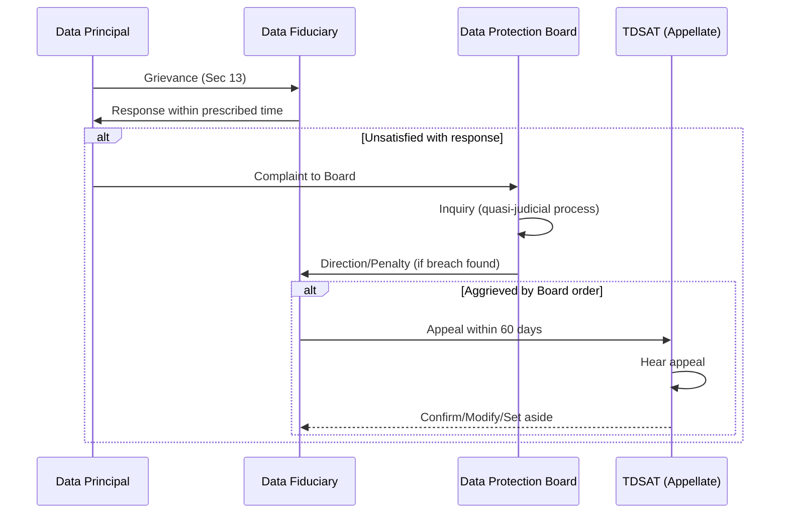

# India DPDPA — Digital Personal Data Protection Act 2023

**Topic:** Digital Personal Data Protection Act, 2023 (DPDPA)  
**Law:** Act No. 22 of 2023; assented August 11, 2023  
**Enforcement Authority:** Data Protection Board of India (DPB)  
**Status:** Enacted; rules under development (2024); phased implementation expected  
**Domain:** Digital personal data protection; India; consent-based framework  
**Audience:** DPOs, compliance officers, technology companies operating in India, Indian enterprises  
**Prerequisites:** Basic privacy concepts; understanding of India's IT Act 2000; awareness of GDPR (for comparison)

---

## Chapter 1 — Historical Context & Origin Story

### 1.1 Timeline

| Year | Milestone |
|------|-----------|
| 2000 | IT Act 2000 (basic provisions on data protection; Section 43A + IT Rules 2011) |
| 2011 | IT (Reasonable Security Practices) Rules — first data protection rules for "sensitive personal data" |
| 2017 | **Puttaswamy judgment** — Supreme Court declares RIGHT TO PRIVACY as fundamental right (Art. 21) |
| 2018 | Justice B.N. Srikrishna Committee submits draft Personal Data Protection Bill 2018 |
| 2019 | Personal Data Protection Bill 2019 introduced in Lok Sabha; referred to Joint Parliamentary Committee (JPC) |
| 2021 | JPC submits report with 81 amendments; renamed "Data Protection Bill 2021" |
| 2022 | Government WITHDRAWS 2019 Bill (August 2022) — to re-draft |
| 2022 | **Digital Personal Data Protection Bill 2022** (draft for public comment; November 2022) |
| 2023 | DPDP Bill 2023 introduced (August 3); passed Lok Sabha (August 7); Rajya Sabha (August 9); **assented August 11, 2023** |
| 2024 | Rules under development by MeitY (Ministry of Electronics and IT); DPB establishment in progress; phased enforcement expected |

### 1.2 Key Design Choices

| Choice | Description |
|:------:|-------------|
| **Digital only** | Applies to "digital personal data" (processed digitally; or non-digital data subsequently digitized). Does NOT cover offline-only data. |
| **Consent-centric** | Consent is primary legal basis; "certain legitimate uses" as exception (narrower than GDPR's 6 bases) |
| **Simplified language** | Written in plain English; ~30 pages (vs. GDPR ~88 pages); fewer provisions but broad delegation to rules |
| **Heavy delegation** | Many specifics delegated to "rules" prescribed by Central Government (not yet published as of 2024) |
| **Board (not Commission)** | Data Protection BOARD (adjudicatory; not regulatory advisory like EU DPAs) — quasi-judicial |
| **No right to compensation** | No explicit private right of action for compensation in DPDPA (civil court route remains via general law) |
| **Significant Data Fiduciary** | Enhanced obligations for certain entities (similar to GDPR's "large-scale processing" concept) |

---

## Chapter 2 — DPDPA Architecture & Structure

### 2.1 Document Structure

| Section | Content |
|:-------:|---------|
| 1-3 | Preliminary (short title; definitions; application) |
| 4 | Obligations of Data Fiduciary |
| 5-9 | **Consent** (ground; manner; items; withdrawal; deemed) |
| 10 | **Certain Legitimate Uses** (non-consent processing) |
| 11-14 | **Rights of Data Principal** |
| 15-17 | **Duties of Data Principal** |
| 18-21 | **Special Provisions** (children; Significant Data Fiduciary; government exemptions) |
| 22-27 | **Data Protection Board of India** (establishment; powers; adjudication) |
| 28-30 | **Appeals** (Telecom Disputes Settlement Appellate Tribunal — TDSAT) |
| 31-33 | **Penalties** |
| 34-37 | **Miscellaneous** (blocking; government exemptions; voluntary undertaking; rule-making) |
| Schedule | Penalties table |

### 2.2 Key Definitions (Section 2)

| Term | Definition |
|:----:|------------|
| **Data Principal** | Individual to whom personal data relates; for children: parent/lawful guardian |
| **Data Fiduciary** | Person who alone or with others determines purpose and means of processing |
| **Data Processor** | Person who processes data on behalf of Data Fiduciary |
| **Consent Manager** | Person registered with Board who enables Data Principal to manage consent (give/withdraw/review) |
| **Digital Personal Data** | Personal data in digital form (collected digitally or digitized from non-digital) |
| **Personal Data** | Any data about an individual who is identifiable by or in relation to such data |
| **Processing** | Wholly or partly automated operation on digital personal data (collection; storage; use; sharing; erasure) |
| **Significant Data Fiduciary** | Data Fiduciary notified by Central Government based on: volume/sensitivity of data; risk to rights; impact on sovereignty; risk to electoral democracy; security of state |

### 2.3 Territorial Application (Section 3)

| Scenario | Applies? |
|:--------:|:--------:|
| Processing digital personal data within India | ✓ Yes |
| Processing outside India IF related to offering goods/services to Data Principals in India | ✓ Yes (extraterritorial) |
| Processing by Indian government entities | ✓ Yes (with exemptions) |
| Non-digital personal data (paper records; never digitized) | ✗ No |
| Personal data processed before DPDPA commencement | Rules may specify transition |

---

## Chapter 3 — Consent Framework (Sections 5-9)

### 3.1 Consent Requirements

| Aspect | Requirement |
|:------:|-------------|
| **Standard** | Free; specific; informed; unconditional; unambiguous; clear affirmative action |
| **Language** | Notice must be in English or any language in Eighth Schedule of Constitution (22 languages; e.g., Hindi, Tamil, Telugu, Bengali, Marathi, etc.) |
| **Granularity** | Specific to each purpose; cannot bundle (must be possible to give consent for some purposes and not others) |
| **Notice content** | (a) Personal data to be collected; (b) purpose of processing; (c) manner of exercising rights; (d) manner of making complaint to Board |
| **Withdrawal** | Data Principal may withdraw at any time; ease of withdrawal must be comparable to ease of giving consent; withdrawal does not affect prior lawful processing |
| **Validity** | Consent given before DPDPA → deemed valid IF it met the standard (free; specific; informed; unconditional) — else must re-obtain |

### 3.2 Consent Manager (Section 9)

| Aspect | Detail |
|:------:|--------|
| **What** | Registered entity that acts as intermediary for consent management |
| **Function** | Enables Data Principal to: give consent; manage consent; withdraw consent; review consents given |
| **Registration** | Must be registered with DPB (conditions per rules) |
| **Interoperability** | Intended to create ecosystem of consent managers (similar to "Account Aggregator" model in financial sector) |
| **Accountability** | Consent Manager accountable to Data Principal; must be accessible; transparent |

### 3.3 Certain Legitimate Uses (Section 10) — Processing WITHOUT Consent

| Legitimate Use | Description |
|:-:|---|
| **(a) Specified purpose** | Data Principal voluntarily provided data for a specified purpose (and has not withdrawn) |
| **(b) State functions** | Government: subsidy/benefit/service/certificate/license/permit issuance |
| **(c) Legal obligation** | Compliance with any law (court order; legal mandate) |
| **(d) Medical emergency** | Response to medical emergency involving threat to life/health |
| **(e) Employment** | Employment purposes (employer as fiduciary; employee as principal); or safeguarding employer from loss/liability |
| **(f) Public interest** | Prescribed purposes (sovereignty; security; public order) — rules will specify |

---

## Chapter 4 — Rights of Data Principal (Sections 11-14)

### 4.1 Rights Catalog

| Right | Section | Description |
|:-----:|:-------:|-------------|
| **Right to information** | 11(1) | Summary of personal data processed; processing activities; identity of other fiduciaries/processors to whom data shared; any other information prescribed |
| **Right to correction/erasure** | 12 | Correct inaccurate/misleading data; complete incomplete data; erase data no longer necessary for purpose (unless retention required by law) |
| **Right to grievance redressal** | 13 | Data Fiduciary must have grievance redressal mechanism; response within prescribed time; if unsatisfied → complaint to DPB |
| **Right to nominate** | 14 | Nominate any person to exercise rights on behalf in case of death or incapacity |

### 4.2 Comparison with GDPR Rights

| Right | DPDPA | GDPR |
|:-----:|:-----:|:----:|
| Right to access/information | ✓ (Section 11) | ✓ (Art. 15) |
| Right to correction | ✓ (Section 12) | ✓ (Art. 16) |
| Right to erasure | ✓ (Section 12) | ✓ (Art. 17) |
| Right to data portability | ✗ Not explicit | ✓ (Art. 20) |
| Right to restriction of processing | ✗ Not in DPDPA | ✓ (Art. 18) |
| Right to object | ✗ Not explicit | ✓ (Art. 21) |
| Right re: automated decisions | ✗ Not in DPDPA | ✓ (Art. 22) |
| Right to grievance | ✓ (Section 13) | Via DPA complaint (Art. 77) |
| Right to nominate (death/incapacity) | ✓ (Section 14) | Not explicit in GDPR |

**Notable gaps:** No explicit data portability; no right to restrict processing; no right to object; no automated decision-making rights. These may be addressed in rules or future amendments.

---

## Chapter 5 — Duties of Data Principal (Sections 15-17)

### 5.1 Data Principal Duties (Unique Feature)

| Duty | Section | Description |
|:----:|:-------:|-------------|
| **Comply with laws** | 15(a) | Comply with applicable laws when exercising rights |
| **Not file false complaints** | 15(b) | Must not register false/frivolous grievance or complaint with Fiduciary or Board |
| **Not furnish false information** | 15(c) | Must not furnish false/suppress material information when exercising right to correction/erasure |
| **Not impersonate** | 15(d) | Must not impersonate another person when providing personal data |
| **Penalty for breach of duty** | 16 | Up to ₹10,000 for each instance of breach of duty |

**Note:** This is unique to DPDPA — no equivalent "duties of data subjects" in GDPR. Reflects concern about misuse of rights (false complaints; gaming the system).

---

## Chapter 6 — Significant Data Fiduciary (Section 10)

### 6.1 Designation & Additional Obligations

| Aspect | Detail |
|:------:|--------|
| **Designation by** | Central Government (notification) |
| **Criteria** | Volume and sensitivity of data processed; risk to rights of Data Principals; potential impact on sovereignty/integrity; risk to electoral democracy; security of state; public order |
| **Examples (likely)** | Large tech platforms; social media; e-commerce giants; financial institutions; telecom operators; healthcare chains |

### 6.2 Additional Obligations (Section 10(2))

| Obligation | Detail |
|:-----------:|--------|
| **Appoint DPO** | Must appoint Data Protection Officer (based in India; point of contact for grievances and Board communication) |
| **Independent Data Auditor** | Must appoint independent auditor to evaluate compliance; auditor reports to Board |
| **Periodic Data Protection Impact Assessment** | DPIA to assess and mitigate risks to Data Principals |
| **Periodic audit** | Regular compliance audit (per rules) |
| **Other prescribed measures** | As may be prescribed by rules |

---

## Chapter 7 — Children's Data (Section 9)

### 7.1 Special Provisions

| Requirement | Detail |
|:-----------:|--------|
| **Age** | Child = person who has not completed 18 years |
| **Verifiable consent** | Must obtain verifiable consent of parent/lawful guardian before processing |
| **Prohibited activities** | (a) Processing that is likely to cause detrimental effect on well-being of child. (b) Tracking/behavioral monitoring of children. (c) Targeted advertising directed at children |
| **Exemption** | Central Government may exempt certain Data Fiduciaries (e.g., healthcare; education) from obtaining parental consent where processing is in best interest of child |
| **Age of child** | 18 years (higher than many jurisdictions; EU allows 13-16; US COPPA is 13) |

---

## Chapter 8 — Penalties (Schedule)

### 8.1 Penalty Schedule

| Breach | Maximum Penalty |
|:------:|:---:|
| **Non-fulfillment of obligations relating to children** | ₹200 crore (~$24M USD) |
| **Failure to take reasonable security safeguards to prevent data breach** | ₹250 crore (~$30M USD) |
| **Non-fulfillment of obligation for data breach notification** | ₹200 crore (~$24M USD) |
| **Non-fulfillment of additional obligations by Significant Data Fiduciary** | ₹150 crore (~$18M USD) |
| **Non-compliance with other provisions** | ₹50 crore (~$6M USD) |
| **Breach of duty by Data Principal** | ₹10,000 per instance |

### 8.2 Penalty Comparison

| Jurisdiction | Maximum Penalty | Basis |
|:---:|:---:|:---:|
| **DPDPA (India)** | ₹250 crore (~$30M USD) per instance | Fixed cap per violation type |
| **GDPR (EU)** | 4% global revenue or €20M (whichever higher) | Percentage of revenue (no cap for large companies) |
| **PIPL (China)** | 5% annual revenue or ¥50M | Percentage of revenue |
| **CCPA/CPRA (US)** | $7,500 per violation | Per-violation |
| **LGPD (Brazil)** | 2% Brazil revenue; max R$50M | Percentage of Brazil revenue |

**Key difference:** DPDPA uses FIXED CAPS (not percentage of revenue). For very large companies, ₹250 crore may be modest relative to revenue. For smaller companies, it could be devastating.

---

## Chapter 9 — Architecture Diagrams

### 9.1 DPDPA Compliance Architecture

```mermaid
graph TB
    subgraph "DPDPA Compliance Framework"
        subgraph "Consent Layer"
            NOTICE[Notice to Data Principal<br/>━━━━━━━━━<br/>• In scheduled language<br/>• Data collected<br/>• Purpose<br/>• How to exercise rights<br/>• How to complain to Board]
            CONSENT_D[Consent Collection<br/>━━━━━━━━━<br/>• Free; specific; informed<br/>• Clear affirmative action<br/>• Granular (per purpose)<br/>• Recordable; provable]
            CM[Consent Manager<br/>━━━━━━━━━<br/>• Registered with Board<br/>• Dashboard for principals<br/>• Give/withdraw/review consent<br/>• Interoperable]
        end
        
        subgraph "Fiduciary Obligations"
            SECURITY_D[Reasonable Security<br/>━━━━━━━━━<br/>• Technical safeguards<br/>• Organizational measures<br/>• Breach prevention<br/>• Penalty: ₹250 crore]
            BREACH_D[Breach Notification<br/>━━━━━━━━━<br/>• To Board (timeframe per rules)<br/>• To affected Data Principals<br/>• Describe nature + mitigation<br/>• Penalty: ₹200 crore]
            RIGHTS_D[Rights Fulfillment<br/>━━━━━━━━━<br/>• Information (Sec 11)<br/>• Correction/Erasure (Sec 12)<br/>• Grievance mechanism (Sec 13)<br/>• Nomination (Sec 14)]
        end
        
        subgraph "Significant Data Fiduciary (additional)"
            DPO_D[DPO (India-based)<br/>━━━━━━━━━<br/>• Point of contact<br/>• Board interface<br/>• Grievance liaison]
            DPIA_D[DPIA<br/>━━━━━━━━━<br/>• Assess risks to principals<br/>• Periodic<br/>• Mitigation measures]
            AUDIT_D[Independent Data Auditor<br/>━━━━━━━━━<br/>• Evaluate compliance<br/>• Report to Board<br/>• Periodic (per rules)]
        end
    end
```

### 9.2 Grievance → Board → Appeal Flow



---

## Chapter 10 — Case Studies

### 10.1 Indian Technology Company: DPDPA Preparation

| Aspect | Detail |
|--------|--------|
| **Company** | Indian SaaS company; 10M Indian users; processing data in India + US cloud servers; B2C mobile app |
| **Pre-DPDPA state** | Minimal compliance (IT Act Section 43A + 2011 Rules; privacy policy existed but basic) |
| **Preparation actions** | |

| Workstream | Actions |
|:---:|---|
| **Data mapping** | Inventoried all personal data processed; classified by purpose; identified retention periods; mapped data flows (India → US servers) |
| **Consent redesign** | Before: single "I agree" checkbox for entire privacy policy. After: granular consent per purpose (a) core service delivery (legitimate use — Sec 10(a)); (b) analytics (consent); (c) marketing (consent); (d) third-party sharing (consent). Each individually selectable. |
| **Notice** | Redesigned to include: EXACT data collected (listed); EACH purpose; HOW to exercise rights (link to form); HOW to complain to Board. Provided in: English + Hindi + 4 regional languages (app user base distribution). |
| **Consent Manager readiness** | Evaluating integration with Consent Manager framework (once registered entities available); preparing APIs for consent signal exchange. |
| **Children** | Age gate: ask age at registration. If <18: require parental consent (verify via OTP to parent's registered number). Disable: personalized recommendations; targeted advertising; behavioral tracking for child accounts. |
| **Grievance mechanism** | Implemented: in-app grievance submission; SLA for response (target: 15 days); escalation path; tracking dashboard for Data Principal. |
| **Cross-border** | Data in US: monitoring rules on cross-border transfers (Sec 16 — Government may restrict/notify countries where transfer not permitted). Preparing for potential data localization requirements. |
| **Security** | Enhanced: encryption (at rest + transit); access controls; vulnerability management; breach detection (SIEM); incident response plan with Board notification procedure. |

### 10.2 Multinational (Likely Significant Data Fiduciary)

| Aspect | Detail |
|--------|--------|
| **Company** | Global social media platform; 200M+ Indian users; processing massive volumes of personal data; likely to be designated "Significant Data Fiduciary" |
| **Additional preparations** | |

| Obligation | Implementation |
|:---:|---|
| **DPO appointment** | Must be India-based. Appointed senior privacy professional in India office. Published contact on platform + informed Board. |
| **Independent Data Auditor** | Engaged Big 4 firm's India practice for annual DPDPA compliance audit. Scope: consent practices; security safeguards; rights fulfillment; children's data processing. |
| **DPIA** | Conducted for: (a) recommendation algorithm (impacts content exposure); (b) advertising targeting (uses personal data extensively); (c) facial recognition features (if any); (d) cross-border data sharing with parent company. |
| **Algorithmic transparency** | Prepared for potential rules on automated decision-making (although DPDPA itself doesn't have Art. 22 equivalent, rules may add). Documented algorithm logic for Board inquiry. |
| **Children (strict)** | India defines child as <18. Impact: massive user base segment cannot receive targeted ads; behavioral monitoring disabled; parental consent required. Implementation: age verification; parental consent flow; separate data handling pipeline for minor accounts. |

---

## Chapter 11 — Interview Questions & Career Guide

### Tier 1: Entry-Level

**Q1:** What is the difference between a "Data Fiduciary" and a "Data Processor" under DPDPA?

**A:**

| Aspect | Data Fiduciary | Data Processor |
|:------:|:---:|:---:|
| **Definition** | Determines PURPOSE and MEANS of processing | Processes on BEHALF of Fiduciary |
| **GDPR equivalent** | Controller | Processor |
| **Primary obligations** | Notice; consent; security; breach notification; rights fulfillment; retention limitation | Process per Fiduciary's instructions; security measures; assist with rights |
| **Accountability to Board** | Directly accountable; penalties apply | Not directly subject to Board penalties (Fiduciary bears responsibility) |
| **Contract** | Must have valid contract with processor | Must comply with contractual terms |
| **Example** | E-commerce company collecting customer data | Cloud hosting provider storing data on behalf of e-commerce company |

**Key insight:** Under DPDPA, the Data Fiduciary bears PRIMARY responsibility. Even if a processor causes a breach, the fiduciary faces the penalty (up to ₹250 crore). This incentivizes fiduciaries to carefully select and monitor processors.

### Tier 2: Mid-Level

**Q2:** Explain the "Certain Legitimate Uses" under Section 10 and how they compare to GDPR's legal bases.

**A:**

| DPDPA Legitimate Use (Sec 10) | Closest GDPR Basis | Key Difference |
|:---:|:---:|---|
| (a) Voluntarily provided + specified purpose | Art. 6(1)(b) Contract (partially) | DPDPA: broader — any voluntary provision (not just contract). But narrower: only for "specified purpose" at time of provision |
| (b) State: subsidy/benefit/service | Art. 6(1)(e) Public interest | DPDPA: specifically enumerated government functions |
| (c) Legal obligation | Art. 6(1)(c) Legal obligation | Same concept |
| (d) Medical emergency | Art. 6(1)(d) Vital interests | DPDPA: explicitly limited to medical emergency |
| (e) Employment | Art. 6(1)(b) Contract | DPDPA: specific to employer-employee relationship |
| (f) Public interest (prescribed) | Art. 6(1)(e) Public interest | DPDPA: to be specified in rules |
| — | **Art. 6(1)(f) Legitimate interest** | **NOT IN DPDPA** — no equivalent; significant gap |

**Impact of missing legitimate interest:** Activities that GDPR-compliant companies justify via legitimate interest (fraud prevention; network security; direct marketing to existing customers; analytics for service improvement) have NO direct basis in DPDPA unless they fit within "voluntarily provided for specified purpose" or are covered by future rules.

### Tier 3: Senior

**Q3:** Design a consent architecture for an Indian fintech app that must comply with DPDPA, integrating Consent Manager interoperability and handling the transition from pre-DPDPA consent.

**A:**

| Layer | Design |
|:---:|---|
| **Consent taxonomy** | Define distinct consent purposes: (1) Account opening + KYC (legitimate use — Sec 10(c): legal obligation under RBI regulations). (2) Transaction processing (legitimate use — Sec 10(a): voluntarily provided for specified purpose). (3) Credit scoring (consent required: processing beyond minimum necessary). (4) Marketing communications (consent). (5) Third-party data sharing with partners (consent). (6) Analytics for product improvement (consent). |
| **Consent UX** | (a) At registration: notice in user's language (detect from device locale; offer 8+ languages). (b) Purposes 1-2: inform but no consent checkbox needed (legitimate use). (c) Purposes 3-6: individual toggles; default OFF; clear explanation per toggle. (d) "Accept all" button available but NOT pre-selected. (e) "Manage consent" accessible from settings at any time. |
| **Consent Manager integration** | (a) Expose consent signals via standardized API (when Consent Manager framework operational). (b) Accept consent decisions from registered Consent Managers. (c) Sync consent state: if user revokes via Consent Manager → immediately reflected in app. (d) Technical: OAuth-like consent token exchange with Consent Manager. |
| **Consent record** | For each consent: timestamp; purpose; version of notice shown; language; channel (app/web); duration of validity; IP/device (for verification). Store immutably (append-only log). Available for Board audit. |
| **Pre-DPDPA transition** | (a) Audit existing consents: were they "free; specific; informed; unconditional"? (b) Old single-checkbox consent: does NOT meet DPDPA standard → must re-obtain. (c) Strategy: upon first app open post-DPDPA: show updated notice + granular consent flow. If user does not re-consent: can only process under legitimate uses (Sec 10); must stop consent-dependent processing (marketing; sharing; credit scoring based on consent). |
| **Withdrawal** | (a) Withdrawal must be as easy as giving consent (Sec 6(4)). (b) Single tap per purpose in settings. (c) Immediate effect: stop processing for that purpose (within reasonable technical time). (d) Notify downstream processors within 24 hours to cease processing for withdrawn purpose. |
| **Children** | (a) If age <18 detected (DOB at KYC): flag account as minor. (b) Block: targeted marketing; behavioral tracking; credit products (regulatory anyway). (c) Require parental consent: verify parent identity via Aadhaar-based e-KYC or video verification. |

---

## Chapter 12 — Cheat Sheet & Quick Reference

```
═══════════════════════════════════════════
INDIA DPDPA 2023 — QUICK REFERENCE
═══════════════════════════════════════════

LAW: Digital Personal Data Protection Act, 2023
ASSENTED: August 11, 2023
RULES: Under development (MeitY; expected 2024-2025)
AUTHORITY: Data Protection Board of India (DPB)
APPEAL: TDSAT (Telecom Disputes Settlement Appellate Tribunal)

═══════════════════════════════════════════
SCOPE:
  • Digital personal data processed in India
  • Outside India if offering goods/services to Indians
  • Does NOT cover non-digital (paper-only) data
  • Does NOT apply to personal/domestic processing

═══════════════════════════════════════════
KEY ROLES:
  Data Principal = individual (data subject)
  Data Fiduciary = controller (determines purpose/means)
  Data Processor = processor (acts on behalf)
  Consent Manager = intermediary for consent management
  Significant Data Fiduciary = high-risk fiduciary (govt-notified)

═══════════════════════════════════════════
CONSENT (PRIMARY BASIS):
  Standard: free; specific; informed; unconditional;
           unambiguous; clear affirmative action
  Notice: in English or any Eighth Schedule language
  Granular: per purpose (cannot bundle)
  Withdrawal: easy; comparable to giving consent
  
  Legitimate Uses (without consent):
    (a) Voluntarily provided for specified purpose
    (b) Government: subsidy/benefit/service
    (c) Legal obligation
    (d) Medical emergency
    (e) Employment purposes
    (f) Public interest (per rules)
  
  ★ NO LEGITIMATE INTEREST BASIS ★

═══════════════════════════════════════════
RIGHTS (Sec 11-14):
  • Right to information about processing
  • Right to correction and erasure
  • Right to grievance redressal
  • Right to nominate (death/incapacity)
  
  NOT included: portability; restriction; objection; automated decisions

═══════════════════════════════════════════
DUTIES OF DATA PRINCIPAL (Sec 15):
  • Must not file false complaints
  • Must not furnish false information
  • Must not impersonate
  • Penalty: ₹10,000 per instance

═══════════════════════════════════════════
CHILDREN (under 18):
  • Verifiable parental/guardian consent required
  • NO tracking/behavioral monitoring
  • NO targeted advertising
  • Processing must not cause detrimental effect

═══════════════════════════════════════════
SIGNIFICANT DATA FIDUCIARY (additional):
  • Appoint DPO (India-based)
  • Independent Data Auditor
  • Periodic DPIA
  • Periodic compliance audit

═══════════════════════════════════════════
PENALTIES (SCHEDULE):
  Security safeguard failure: ₹250 crore (~$30M)
  Children data breach: ₹200 crore (~$24M)
  Breach notification failure: ₹200 crore (~$24M)
  Significant DF non-compliance: ₹150 crore (~$18M)
  Other provisions: ₹50 crore (~$6M)
  Data Principal duty breach: ₹10,000/instance
  
  Fixed caps (NOT percentage of revenue)

═══════════════════════════════════════════
CROSS-BORDER:
  Section 16: Government MAY restrict transfers to
  notified countries/territories (blacklist approach)
  
  Default: transfers PERMITTED unless restricted
  (Different from GDPR/PIPL whitelist approach)
  
  Rules will specify restricted countries (if any)

═══════════════════════════════════════════
KEY DIFFERENCES FROM GDPR:
  • Digital data only (not all personal data)
  • Consent-centric (no legitimate interest)
  • Duties on Data Principals (unique)
  • Board (quasi-judicial) not commission
  • No data portability right (currently)
  • No automated decision-making right
  • Child = under 18 (vs. 13-16 in EU)
  • Fixed penalty caps (not % revenue)
  • Heavy delegation to rules (flexibility)
  • No DPO for all (only Significant DF)
  • Consent Manager framework (unique)
```

---

*End of Document — 09_India_DPDPA.md*
