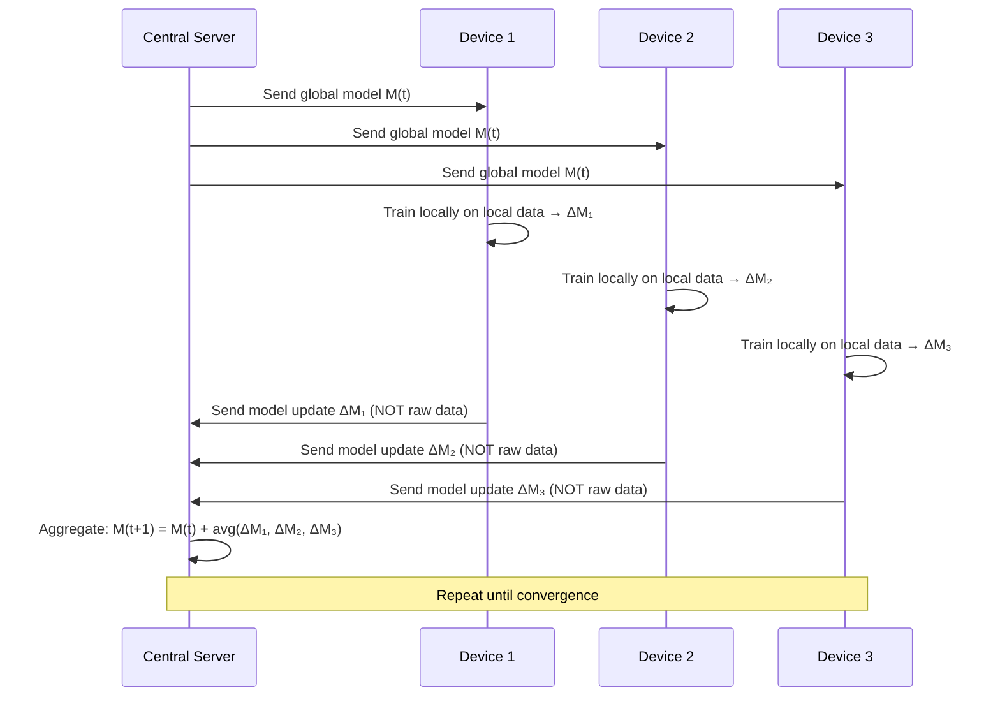
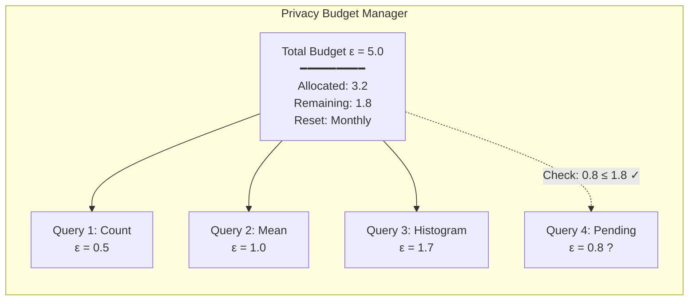

# Privacy Engineering — Privacy by Design & Privacy-Enhancing Technologies

**Topic:** Privacy Engineering; Privacy by Design (PbD); Data Minimization; Anonymization; Privacy-Enhancing Technologies (PETs)  
**Frameworks:** Ann Cavoukian's 7 Foundational Principles; ISO 31700 (Privacy by Design); NIST IR 8062  
**Domain:** Technical privacy; data engineering; applied cryptography; statistical disclosure control  
**Audience:** Privacy engineers, data scientists, security architects, software engineers, DPOs with technical background  
**Prerequisites:** Basic cryptography; statistics fundamentals; software engineering; familiarity with GDPR/privacy regulations

---

## Chapter 1 — Historical Context & Origin Story

### 1.1 Timeline

| Year | Milestone |
|------|-----------|
| 1973 | US HEW Advisory Committee: Fair Information Practice Principles (FIPPs) |
| 1980 | OECD Privacy Guidelines (8 principles) |
| 1995 | EU Directive 95/46/EC; "data protection by design" concept emerges |
| 1995 | Sweeney: re-identification of Massachusetts governor from "anonymized" data |
| 1997 | Sweeney formalizes k-anonymity |
| **2009** | **Ann Cavoukian publishes "Privacy by Design: The 7 Foundational Principles"** |
| 2006 | Machanavajjhala et al.: l-diversity |
| 2007 | Li, Li, Venkatasubramanian: t-closeness |
| 2006 | Dwork: differential privacy (foundational paper) |
| 2014 | Apple adopts differential privacy (iOS usage data) |
| 2016 | Google RAPPOR (Randomized Aggregatable Privacy-Preserving Ordinal Response) |
| 2017 | Federated Learning paper (McMahan et al., Google) |
| 2018 | GDPR Art. 25: "Data protection by design and by default" — legally mandated |
| 2020 | US Census Bureau: differential privacy for 2020 Census |
| 2022 | ISO 31700: Privacy by Design for consumer goods and services |
| 2023 | EU Data Act; AI Act — PETs as compliance enablers |

### 1.2 From Principle to Engineering Discipline

Privacy engineering evolved from:
1. **Legal principles** (FIPPs; OECD Guidelines) → abstract requirements
2. **Design philosophy** (Cavoukian's PbD) → organizational approach
3. **Mathematical foundations** (differential privacy; secure computation) → provable guarantees
4. **Engineering practice** (privacy-preserving systems; PETs) → implementable solutions

---

## Chapter 2 — Privacy by Design: 7 Foundational Principles

### 2.1 Ann Cavoukian's Framework

| # | Principle | Description | Engineering Translation |
|:-:|:---------:|-------------|------------------------|
| 1 | **Proactive not Reactive; Preventative not Remedial** | Anticipate and prevent privacy-invasive events before they happen | Threat modeling for privacy; privacy risk assessments during design; automated PII detection in pipelines |
| 2 | **Privacy as the Default Setting** | No action required by individual to protect privacy; built-in automatically | Default: minimal data collection; opt-IN (not opt-out); data retention = shortest necessary; access = least privilege |
| 3 | **Privacy Embedded into Design** | Not a bolt-on; integral component of core functionality | Privacy requirements in user stories; privacy patterns in architecture; data flow diagrams with privacy annotations |
| 4 | **Full Functionality — Positive-Sum, not Zero-Sum** | Privacy AND functionality (not privacy OR security) | Techniques that enable analytics without exposing individuals (differential privacy; federated learning; synthetic data) |
| 5 | **End-to-End Security — Full Lifecycle Protection** | Data protected from collection through deletion | Encryption at rest + transit; secure deletion; lifecycle management; key rotation; secure backup/recovery |
| 6 | **Visibility and Transparency — Keep it Open** | Operations remain visible and transparent to individuals and providers | Audit logs; privacy dashboards; algorithmic explanations; consent receipts; open documentation |
| 7 | **Respect for User Privacy — Keep it User-Centric** | Individual interests paramount; strong defaults; appropriate notice; empowerment | User-facing privacy controls; granular consent; data portability; deletion tools; privacy-respecting UX |

### 2.2 ISO 31700 (2023): Privacy by Design Standard

| Aspect | Detail |
|:------:|--------|
| **Title** | Consumer protection — Privacy by design for consumer goods and services |
| **Scope** | Requirements for embedding privacy in design of consumer-facing products |
| **Parts** | Part 1: High-level requirements (30 requirements). Part 2: Use cases |
| **Key additions** | Communication to consumers; lifecycle management; PIA integration; third-party management; breach preparedness |
| **Relationship** | Complements ISO 27701 (PIMS); references GDPR Art. 25 |

---

## Chapter 3 — Data Minimization Techniques

### 3.1 Minimization Spectrum


### 3.2 Techniques

| Technique | Description | Re-identification Risk | Utility |
|:---------:|-------------|:---:|:---:|
| **Suppression** | Remove entire attribute or records | Low | Low |
| **Generalization** | Replace specific values with ranges (age 34 → 30-39) | Medium | Medium |
| **Pseudonymization** | Replace identifiers with tokens (reversible with key) | Medium-High | High |
| **Masking** | Hide portion of value (email: j***@gmail.com) | Medium | Medium |
| **Perturbation** | Add random noise to values | Low-Medium | Medium-High |
| **Swapping** | Exchange values between records | Medium | Medium |
| **Aggregation** | Report only group statistics | Low | Low-Medium |
| **Tokenization** | Replace with random token (non-reversible without vault) | Low | Medium |
| **Anonymization** | Irreversibly render data non-identifiable | Very Low | Varies |
| **Synthetic data** | Generate new data preserving statistical properties | Very Low | High |

### 3.3 Pseudonymization vs Anonymization

| Aspect | Pseudonymization | Anonymization |
|:------:|:---:|:---:|
| **Reversibility** | Reversible (with key/mapping) | Irreversible |
| **GDPR status** | Still personal data (Art. 4(5)) | NOT personal data (Recital 26) |
| **Legal basis** | Still required for processing | No GDPR obligations |
| **Use case** | Internal analysis; key-coded research | Open data publication; statistics |
| **Re-identification** | Possible (by data controller with key) | Should be impossible (by anyone) |
| **WP29/EDPB guidance** | Pseudonymous data = personal data | Must resist: singling out; linkability; inference |

---

## Chapter 4 — Statistical Disclosure Control

### 4.1 k-Anonymity (Sweeney, 2002)

**Definition:** A dataset satisfies k-anonymity if every combination of quasi-identifiers appears in at least k records.

**Quasi-identifiers:** Attributes that, in combination, could re-identify an individual (e.g., ZIP code + gender + date of birth).

| Property | Description |
|:--------:|-------------|
| **Guarantee** | Any individual cannot be distinguished from at least k-1 others in the dataset |
| **Technique** | Generalization (hierarchies) + suppression |
| **Example** | If k=5, every combination of {ZIP, gender, age-range} appears in ≥5 records |

**Formula:** For quasi-identifier attributes $Q = \{q_1, q_2, \ldots, q_d\}$, a table $T$ satisfies k-anonymity if:

$$\forall t \in T, |\{t' \in T : t'[Q] = t[Q]\}| \geq k$$

**Limitations:**
- Homogeneity attack: if all k records share same sensitive value → trivial inference
- Background knowledge attack: attacker knows additional info

### 4.2 l-Diversity (Machanavajjhala et al., 2006)

**Definition:** An equivalence class (group of k-anonymous records) has l-diversity if there are at least l "well-represented" values for the sensitive attribute.

$$\text{For each equivalence class } E: |S(E)| \geq l$$

Where $S(E)$ = distinct sensitive values in equivalence class $E$.

| Variant | Definition |
|:-------:|------------|
| **Distinct l-diversity** | At least l distinct sensitive values per class |
| **Entropy l-diversity** | $-\sum_{s \in S} p(s) \log(p(s)) \geq \log(l)$ |
| **Recursive (c,l)-diversity** | Most frequent value cannot be too frequent relative to least frequent |

**Limitation:** Skewness attack (if overall distribution is skewed, even l-diversity reveals information).

### 4.3 t-Closeness (Li, Li, Venkatasubramanian, 2007)

**Definition:** An equivalence class has t-closeness if the distribution of sensitive values within the class differs from the overall distribution by no more than threshold t.

$$D(P_E, P_T) \leq t$$

Where $D$ is Earth Mover's Distance (EMD), $P_E$ is distribution in equivalence class, $P_T$ is overall distribution.

| Advantage | Description |
|:---------:|-------------|
| Resists skewness attack | By bounding distance from global distribution |
| Semantic privacy | Considers the semantic meaning of attribute values |

---

## Chapter 5 — Differential Privacy

### 5.1 Definition (Dwork, 2006)

A randomized algorithm $\mathcal{M}$ satisfies $\epsilon$-differential privacy if for all datasets $D_1$ and $D_2$ differing in at most one record, and for all sets $S$ of possible outputs:

$$\Pr[\mathcal{M}(D_1) \in S] \leq e^\epsilon \cdot \Pr[\mathcal{M}(D_2) \in S]$$

**Intuition:** The output of the algorithm is (almost) the same whether or not any individual's data is included. An individual's participation has bounded impact on what anyone can learn.

### 5.2 Key Parameters

| Parameter | Meaning | Typical Values |
|:---------:|---------|:-:|
| $\epsilon$ (epsilon) | **Privacy loss budget** — smaller = more private; larger = more accurate | 0.1 (very private) to 10 (less private); commonly 1-3 |
| $\delta$ | Probability of privacy guarantee failing; for $(\epsilon, \delta)$-DP | Typically $< 1/n$ where $n$ = dataset size |
| **Sensitivity** ($\Delta f$) | Maximum change in query output when one record changes | Depends on query function |

### 5.3 Mechanisms

| Mechanism | Description | Best For |
|:---------:|-------------|:--------:|
| **Laplace** | Add noise from Laplace distribution: $\text{Lap}(\Delta f / \epsilon)$ | Numeric queries |
| **Gaussian** | Add noise from Gaussian distribution (for $(\epsilon,\delta)$-DP) | Numeric queries; composition |
| **Exponential** | Select output from set with probability proportional to utility | Categorical outputs; selection |
| **Randomized Response** | Each person randomly tells truth or lies (local DP) | Surveys; local DP |

### 5.4 Laplace Mechanism

For a function $f: \mathcal{D} \rightarrow \mathbb{R}^k$ with sensitivity $\Delta f = \max_{D_1, D_2} \|f(D_1) - f(D_2)\|_1$:

$$\mathcal{M}(D) = f(D) + (Y_1, Y_2, \ldots, Y_k)$$

Where each $Y_i$ is drawn independently from $\text{Lap}(\Delta f / \epsilon)$.

### 5.5 Composition Theorems

| Theorem | Statement |
|:-------:|-----------|
| **Sequential** | If $\mathcal{M}_1$ is $\epsilon_1$-DP and $\mathcal{M}_2$ is $\epsilon_2$-DP, then their combination is $(\epsilon_1 + \epsilon_2)$-DP |
| **Parallel** | If mechanisms operate on disjoint subsets of data, privacy cost does NOT accumulate |
| **Advanced** | For $k$ mechanisms each $\epsilon$-DP: total is $O(\sqrt{k} \cdot \epsilon)$ (tight for Gaussian) |

### 5.6 Local vs. Central Differential Privacy

| Aspect | Local DP | Central DP |
|:------:|:--------:|:----------:|
| **Trust model** | No trusted curator; noise added BEFORE data leaves device | Trusted curator holds raw data; adds noise to outputs |
| **Accuracy** | Lower (each individual adds noise → more total noise) | Higher (one noise addition to aggregate) |
| **Example** | Apple (iOS keyboard usage); Google RAPPOR | US Census 2020; internal analytics |
| **Privacy guarantee** | Stronger (data never leaves device in clear) | Requires trust in curator |
| **Noise magnitude** | $O(1/\epsilon)$ per person | $O(\sqrt{n}/\epsilon)$ for $n$ people (aggregate) |

### 5.7 Real-World Deployments

| Organization | Use Case | Model | $\epsilon$ Value |
|:---:|---|:---:|:---:|
| **Apple** | Emoji usage; Safari suggestions; Health data | Local DP | 2-8 (per day) |
| **Google** | Chrome settings; Android statistics (RAPPOR) | Local DP | ~2 (per collection) |
| **US Census** | 2020 Decennial Census (TopDown Algorithm) | Central DP | ~19.61 (total person-level) |
| **Microsoft** | Telemetry (Windows; Office usage) | Local DP | Various |
| **LinkedIn** | Ads measurement | Central DP | 1-5 |

---

## Chapter 6 — Privacy-Enhancing Technologies (PETs)

### 6.1 PET Taxonomy

```mermaid
graph TB
    subgraph "Privacy-Enhancing Technologies"
        subgraph "Data Transformation"
            ANON[Anonymization<br/>k-anonymity; l-diversity]
            SYN[Synthetic Data<br/>GANs; statistical models]
            DP[Differential Privacy<br/>Noise addition]
        end
        
        subgraph "Computation on Encrypted Data"
            HE[Homomorphic Encryption<br/>Compute on ciphertext]
            MPC[Secure Multi-Party Computation<br/>Joint computation without revealing inputs]
            TEE[Trusted Execution Environments<br/>Hardware enclaves (SGX; TrustZone)]
        end
        
        subgraph "Distributed/Decentralized"
            FL[Federated Learning<br/>Model trained without centralizing data]
            DC[Decentralized Identity<br/>Self-sovereign identity; DIDs]
            ZKP[Zero-Knowledge Proofs<br/>Prove statement without revealing data]
        end
        
        subgraph "Access & Policy"
            ABAC[Attribute-Based Access<br/>Fine-grained access control]
            PE[Policy Enforcement<br/>Automated compliance]
            CT[Consent Technology<br/>Machine-readable consent]
        end
    end
```

### 6.2 Homomorphic Encryption (HE)

| Type | Operations | Performance | Examples |
|:----:|:----------:|:-----------:|:--------:|
| **Partially HE** | Either + or × (not both) | Fast | RSA (×); Paillier (+); ElGamal (×) |
| **Somewhat HE (SHE)** | Limited + and × (bounded depth) | Moderate | BGN |
| **Fully HE (FHE)** | Arbitrary + and × (any circuit) | Very slow (1000-1,000,000× overhead) | BGV; BFV; CKKS; TFHE |

**Key property:** $E(a) \oplus E(b) = E(a + b)$ and $E(a) \otimes E(b) = E(a \times b)$

| Library | Scheme | Language | Maintainer |
|:-------:|:------:|:--------:|:----------:|
| Microsoft SEAL | BFV; CKKS | C++ | Microsoft Research |
| OpenFHE | BGV; BFV; CKKS; TFHE | C++ | Duality Technologies |
| TFHE-rs | TFHE | Rust | Zama |
| HElib | BGV; CKKS | C++ | IBM |
| Lattigo | BFV; CKKS | Go | EPFL |

### 6.3 Secure Multi-Party Computation (MPC/SMPC)

**Problem:** $n$ parties each hold private input $x_i$. They want to compute $f(x_1, x_2, \ldots, x_n)$ without any party learning another's input.

| Protocol Family | Description | Parties | Threat Model |
|:---:|---|:---:|:---:|
| **Garbled Circuits** (Yao) | One party garbles circuit; other evaluates | 2 | Semi-honest |
| **Secret Sharing** (Shamir; GMW) | Data split among parties; computation on shares | n | Semi-honest / Malicious |
| **Oblivious Transfer** | One of n messages transferred without sender knowing which | 2 | Various |

**Use cases:** Salary benchmarking (compare without revealing individual salaries); joint fraud detection (banks compute without sharing customer data); private set intersection (match records without revealing non-matches).

### 6.4 Zero-Knowledge Proofs (ZKP)

**Definition:** A proof system where a prover convinces a verifier that a statement is true WITHOUT revealing any information beyond the truth of the statement.

| Property | Description |
|:--------:|-------------|
| **Completeness** | If statement is true, honest prover convinces verifier |
| **Soundness** | If statement is false, no prover can convince verifier (except with negligible probability) |
| **Zero-knowledge** | Verifier learns nothing beyond truth of statement |

| Type | Description | Use Case |
|:----:|-------------|:--------:|
| **Interactive** | Multiple rounds of communication between prover and verifier | Authentication |
| **Non-interactive (NIZK)** | Single message from prover to verifier (using Fiat-Shamir or CRS) | Blockchain; credentials |
| **zk-SNARK** | Succinct Non-interactive ARgument of Knowledge (short proofs; fast verification) | Zcash; Ethereum scaling |
| **zk-STARK** | Scalable Transparent ARgument of Knowledge (no trusted setup; post-quantum) | StarkNet; integrity proofs |

**Privacy applications:** Age verification (prove age ≥ 18 without revealing DOB); credential verification (prove membership without revealing identity); range proofs (prove salary in range without revealing amount).

### 6.5 Trusted Execution Environments (TEE)

| Technology | Provider | Description |
|:---:|:---:|---|
| **Intel SGX** | Intel | Secure enclaves in processor; encrypted memory; attestation |
| **ARM TrustZone** | ARM | Secure world / normal world separation; mobile devices |
| **AMD SEV** | AMD | Encrypted VM memory; prevents hypervisor snooping |
| **AWS Nitro Enclaves** | AWS | Isolated compute environments within EC2 |
| **Azure Confidential Computing** | Microsoft | SGX/SEV-based confidential VMs |

**Limitation:** Side-channel attacks (Spectre; Meltdown; SGAxe; Plundervolt); requires trust in hardware vendor.

### 6.6 Federated Learning

**Concept:** Train machine learning model across multiple devices/organizations WITHOUT centralizing data.



| Variant | Description | Example |
|:-------:|-------------|:-------:|
| **Cross-device** | Many small devices (phones) | Google Keyboard (Gboard) next-word prediction |
| **Cross-silo** | Few large organizations | Hospital collaboration (medical imaging) |

**Privacy enhancements for FL:**
- **+ Differential Privacy:** Add noise to model updates before sending to server
- **+ Secure Aggregation:** Server cannot see individual updates (only aggregate)
- **+ Homomorphic Encryption:** Encrypt updates; server aggregates encrypted updates

---

## Chapter 7 — Implementation Guide

### 7.1 Privacy Engineering Process

| Phase | Activities | Outputs |
|:-----:|-----------|---------|
| **1. Requirements** | Privacy impact assessment; data flow mapping; threat modeling for privacy | Privacy requirements; data inventory; risk register |
| **2. Design** | Select PETs; apply PbD principles; choose minimization techniques; define retention | Privacy architecture; data lifecycle design; PET selection rationale |
| **3. Build** | Implement consent management; encryption; access controls; anonymization pipelines; differential privacy mechanisms | Working system with privacy controls |
| **4. Test** | Re-identification testing; privacy unit tests; penetration testing for data leakage; compliance validation | Test results; residual risk assessment |
| **5. Deploy** | Privacy monitoring; consent dashboards; data deletion automation; breach detection | Operational privacy controls |
| **6. Monitor** | Audit logs; compliance reporting; privacy metrics; user complaints tracking | Ongoing assurance; improvement actions |

### 7.2 Data Flow Mapping Template

| Data Element | Source | Purpose | Legal Basis | Storage | Retention | Recipients | Transfer | Minimization Applied |
|:---:|:---:|:---:|:---:|:---:|:---:|:---:|:---:|:---:|
| Email | User registration | Account auth | Contract | Encrypted DB | Account lifetime + 30 days | None | N/A (same region) | — |
| Location | App (GPS) | Route navigation | Consent | Memory only | Session duration | Map provider | Cross-border (US) | Truncate to 3 decimal places |
| Purchase history | Payment gateway | Order fulfillment | Contract | Encrypted DB | 7 years (tax) | Tax authority | N/A | Aggregate after 2 years |

### 7.3 Technology Selection Matrix

| Requirement | Recommended PET | Trade-off |
|:-----------:|:---:|---|
| Analytics without individual data | Differential privacy | Accuracy loss (proportional to privacy level) |
| ML training without data centralization | Federated learning | Communication overhead; model accuracy (non-IID data) |
| Third-party computation on sensitive data | Homomorphic encryption | 1000×+ performance overhead |
| Multi-org collaboration without data sharing | Secure MPC | Communication complexity; latency |
| Prove attribute without revealing data | Zero-knowledge proofs | Computational cost; proof size |
| Process data without trusting cloud | TEE (SGX/SEV) | Hardware dependency; side-channel risks |
| Publish dataset for research | k-anonymity + l-diversity OR synthetic data | Utility loss; synthetic may not capture edge cases |
| Real-time data sharing with privacy | Tokenization + access control | Key management complexity |

---

## Chapter 8 — Architecture Diagrams

### 8.1 Privacy-Preserving Data Pipeline

```mermaid
graph TB
    subgraph "Data Ingestion"
        SRC[Data Sources<br/>━━━━━━━━━<br/>• User inputs<br/>• IoT sensors<br/>• Third-party APIs<br/>• Server logs]
        CLASSIFY[Data Classification<br/>━━━━━━━━━<br/>• PII detection (NER/regex)<br/>• Sensitivity tagging<br/>• Category assignment<br/>• Auto-labeling]
    end
    
    subgraph "Privacy Processing Layer"
        CONSENT_CHECK[Consent Verification<br/>━━━━━━━━━<br/>• Purpose check<br/>• Valid consent?<br/>• Legitimate use?<br/>• Gate: proceed/reject]
        MINIMIZE[Minimization Engine<br/>━━━━━━━━━<br/>• Suppress unnecessary fields<br/>• Generalize (age → range)<br/>• Truncate (GPS precision)<br/>• Pseudonymize identifiers]
        ENCRYPT[Encryption Layer<br/>━━━━━━━━━<br/>• At-rest encryption<br/>• Field-level encryption<br/>• Key management (HSM)<br/>• Tokenization vault]
    end
    
    subgraph "Processing & Analytics"
        DP_ENGINE[DP Analytics Engine<br/>━━━━━━━━━<br/>• Privacy budget tracking<br/>• Laplace/Gaussian noise<br/>• Composition accounting<br/>• Query auditing]
        FL_ENGINE[Federated Learning<br/>━━━━━━━━━<br/>• Model distribution<br/>• Secure aggregation<br/>• Local training<br/>• Gradient clipping]
        SYNTH[Synthetic Data Generator<br/>━━━━━━━━━<br/>• Statistical properties<br/>• Privacy validation<br/>• Utility testing<br/>• Distribution matching]
    end
    
    subgraph "Output & Access"
        ACCESS[Access Control<br/>━━━━━━━━━<br/>• Role-based (RBAC)<br/>• Purpose-based (PBAC)<br/>• Attribute-based (ABAC)<br/>• Audit logging]
        LIFECYCLE[Lifecycle Management<br/>━━━━━━━━━<br/>• Retention enforcement<br/>• Automated deletion<br/>• Right to erasure<br/>• Backup purging]
    end
    
    SRC --> CLASSIFY
    CLASSIFY --> CONSENT_CHECK
    CONSENT_CHECK --> MINIMIZE
    MINIMIZE --> ENCRYPT
    ENCRYPT --> DP_ENGINE
    ENCRYPT --> FL_ENGINE
    ENCRYPT --> SYNTH
    DP_ENGINE --> ACCESS
    FL_ENGINE --> ACCESS
    SYNTH --> ACCESS
    ACCESS --> LIFECYCLE
```

### 8.2 Differential Privacy Budget Architecture



---

## Chapter 9 — Case Studies

### 9.1 Apple: Local Differential Privacy at Scale

| Aspect | Detail |
|--------|--------|
| **System** | iOS/macOS telemetry collection |
| **Problem** | Need usage statistics (popular emoji; website crashes; keyboard autocorrect data) without identifying individuals |
| **Solution** | Local differential privacy: noise added ON DEVICE before data sent to Apple |
| **Mechanism** | Combination of: (a) randomized response (binary data); (b) hash functions + noise (frequency estimation); (c) CMS (Count Mean Sketch) |
| **Privacy parameters** | ε = 2 per data type per day; ε = 8 per day total (accumulates over types) |
| **Scale** | Hundreds of millions of devices; trillions of data points |
| **Transparency** | Published academic paper (2017); described mechanism in detail |
| **Criticism** | Some researchers argued ε values too high for meaningful local DP (debate on appropriate ε) |

### 9.2 US Census 2020: Central Differential Privacy

| Aspect | Detail |
|--------|--------|
| **System** | TopDown Algorithm for 2020 Decennial Census disclosure avoidance |
| **Problem** | Census data published at very granular levels (block); reconstruction attacks demonstrated feasibility of re-identifying respondents from "anonymized" census tables |
| **Previous method** | Swapping (exchanging records between geographic areas); not provably private |
| **Solution** | Central differential privacy: add noise to all published statistics; formal privacy guarantee |
| **Mechanism** | Geometric mechanism (discrete Laplace); top-down allocation from national → state → county → tract → block group → block |
| **Privacy parameter** | ε ≈ 19.61 for person-level data (total across all publications) |
| **Controversy** | (a) Redistricting: small-area noise affects political redistricting. (b) Small populations: rural/tribal areas with few residents → noisy counts may be misleading. (c) Comparison: previous "swapping" method had no formal guarantee but produced more familiar outputs |
| **Outcome** | Deployed despite controversy; established precedent for government adoption of DP |

### 9.3 Healthcare: Federated Learning for Medical Imaging

| Aspect | Detail |
|--------|--------|
| **Project** | Multi-hospital collaboration for brain tumor segmentation (Intel + Penn Medicine, 2020-2022) |
| **Problem** | Need large training dataset for AI diagnostic model; hospitals cannot share patient imaging data (HIPAA; GDPR; institutional policies) |
| **Solution** | Federated Learning: each hospital trains locally on own data; shares only model weight updates |
| **Architecture** | Cross-silo FL; 71 institutions across 6 continents; Intel OpenFL framework |
| **Result** | Federated model: 99% of performance of centrally-trained model (which would be impossible due to data sharing restrictions) |
| **Privacy enhancement** | Differential privacy added to model updates; secure aggregation |
| **Impact** | Demonstrated FL viability for real medical AI; no patient data left institutional boundaries |

---

## Chapter 10 — Future Evolution & Industry Trends

### 10.1 Emerging Trends

| Trend | Description | Timeline |
|:-----:|-------------|:--------:|
| **Confidential Computing** | Hardware-based privacy (TEEs becoming mainstream in cloud) | 2024-2027 |
| **Privacy-Preserving AI** | DP + FL + MPC as standard for AI/ML training | 2024-2028 |
| **Synthetic Data as Default** | Development/testing environments use only synthetic data | 2024-2026 |
| **Post-Quantum Privacy** | Lattice-based HE schemes (already quantum-resistant); transitioning other PETs | 2025-2030 |
| **Decentralized Identity** | Self-sovereign identity; verifiable credentials with ZKP (W3C DIDs) | 2024-2028 |
| **Automated Compliance** | Policy-as-code; automated PIA; continuous privacy monitoring | 2024-2026 |
| **Privacy Labels/Nutrition Facts** | Standardized privacy disclosures (Apple App Store labels; Google Data Safety) | Ongoing |
| **PET Standardization** | ISO/IEC standards for DP, FL, MPC operational deployment | 2025-2028 |

### 10.2 Open Research Problems

| Problem | Description |
|:-------:|-------------|
| **Optimal ε** | No consensus on "right" epsilon value; context-dependent; no universal standard |
| **Utility-Privacy Trade-off** | Fundamental tension; better mechanisms needed for small datasets |
| **FHE Performance** | Still 1000×+ overhead; practical only for specific workloads |
| **FL + Non-IID Data** | Federated learning accuracy degrades with heterogeneous data distributions |
| **Composition Tightness** | Better composition theorems for real-world query patterns |
| **Privacy Auditing** | How to verify a system actually achieves its claimed DP guarantee |
| **Intersection of Laws** | Multiple privacy laws applying simultaneously; conflicting requirements |

---

## Chapter 11 — Interview Questions & Career Guide

### Tier 1: Entry-Level

**Q1:** What is the difference between pseudonymization and anonymization? When does GDPR still apply?

**A:** Pseudonymization replaces identifiers with tokens/codes that can be reversed with a key. The data is still considered personal data under GDPR (Art. 4(5)) because re-identification is possible. Anonymization renders data permanently non-identifiable — GDPR does NOT apply to truly anonymous data (Recital 26). The EDPB/WP29 test for anonymization: data must resist (1) singling out, (2) linkability, and (3) inference attacks.

### Tier 2: Mid-Level

**Q2:** You need to publish a dataset for academic research. The dataset contains medical records with age, ZIP code, gender, diagnosis. Design a disclosure control strategy.

**A:**

| Step | Action | Rationale |
|:----:|--------|-----------|
| 1 | Remove direct identifiers | Name; SSN; phone; email → suppress entirely |
| 2 | Identify quasi-identifiers | {Age, ZIP, Gender} → combination can re-identify (Sweeney attack) |
| 3 | Apply k-anonymity (k=5) | Generalize: age → 5-year ranges; ZIP → first 3 digits; gender retained. Ensure each combination appears ≥5 times |
| 4 | Verify l-diversity (l=3) | Each equivalence class has ≥3 distinct diagnoses (prevent homogeneity attack) |
| 5 | Consider t-closeness | If diagnosis distribution within groups deviates significantly from overall → apply t-closeness (t=0.2) |
| 6 | Alternatively: DP | Apply differential privacy to query interface rather than releasing raw anonymized data |
| 7 | Re-identification risk test | Attempt linkage attacks on output; measure re-identification rate; target <5% |
| 8 | Document | Record methodology; parameters; residual risk; purpose limitation for recipients |

### Tier 3: Senior/Architect

**Q3:** Design a privacy-preserving analytics system for a ride-sharing company that needs: (a) trip demand forecasting by area, (b) driver performance metrics, (c) pricing optimization, while minimizing personal data exposure.

**A:**

| Component | Privacy Design |
|:---------:|----------------|
| **(a) Demand Forecasting** | **Differential Privacy + Aggregation.** (1) Aggregate trip requests by H3 hexagonal grid (resolution 7; ~5km²). (2) Apply Laplace mechanism (ε=1.0 per hourly report). (3) Never report cells with <10 trips (suppress → avoid identifying individual routes). (4) Budget: ε_daily = 24 (24 hourly reports × 1.0). Reset monthly with fresh budget. Result: area-level demand patterns without individual trip traceability. |
| **(b) Driver Metrics** | **Federated Analytics + Pseudonymization.** (1) Driver app computes metrics locally (average speed; ride completion rate; rating). (2) Federated aggregation: send only aggregate statistics per driver tier (not per driver). (3) Individual driver metrics: pseudonymized driver ID (rotated quarterly); stored only for dispute period (90 days); access restricted to HR. (4) No real-time location tracking beyond active ride (location data deleted after trip completion + 72h). |
| **(c) Pricing Optimization** | **Synthetic Data + Secure Computation.** (1) Train pricing models on SYNTHETIC trip data (generated from real distribution with DP guarantees; ε=3.0). (2) Real-time pricing: model runs on aggregate demand signals (from (a)); no individual trip data input. (3) A/B testing: use secure MPC — pricing engine and analytics engine jointly compute metrics without pricing engine seeing individual ride details or analytics engine seeing pricing decisions for specific riders. |
| **Infrastructure** | (1) Consent Manager: riders and drivers manage consent per purpose. (2) Data lifecycle: ride data → anonymized (trip duration, distance, area; no start/end exact coordinates) after 30 days for analytics. (3) Right to erasure: pseudonymization key deletion = effective erasure from analytics pipeline. (4) TEE for route matching (match rider with nearby driver without revealing rider destination to all drivers). |

---

## Chapter 12 — Cheat Sheet & Quick Reference

```
═══════════════════════════════════════════
PRIVACY ENGINEERING — QUICK REFERENCE
═══════════════════════════════════════════

PRIVACY BY DESIGN (7 PRINCIPLES):
  1. Proactive not reactive
  2. Privacy as default
  3. Embedded into design
  4. Positive-sum (not zero-sum)
  5. End-to-end security (full lifecycle)
  6. Visibility and transparency
  7. Respect for user privacy (user-centric)

═══════════════════════════════════════════
DISCLOSURE CONTROL:
  k-anonymity: each QI combo appears in ≥k records
  l-diversity: ≥l distinct sensitive values per group
  t-closeness: distribution within group ≈ overall (≤t EMD)

  Hierarchy: k-anonymity < l-diversity < t-closeness

═══════════════════════════════════════════
DIFFERENTIAL PRIVACY:
  ε-DP: Pr[M(D₁)∈S] ≤ e^ε · Pr[M(D₂)∈S]
  
  Smaller ε → more privacy, less accuracy
  ε < 1: very strong privacy
  ε = 1-3: moderate (common in practice)
  ε > 10: weak privacy
  
  Mechanisms:
    Laplace: numeric; add Lap(Δf/ε) noise
    Gaussian: numeric; (ε,δ)-DP
    Exponential: categorical selection
    Randomized Response: local DP (per-person)
  
  Composition: ε₁ + ε₂ (sequential); no accumulation (parallel)

═══════════════════════════════════════════
PET SELECTION:
  Need                          → PET
  ─────────────────────────────────────────
  Analytics w/o individual data → Differential Privacy
  ML w/o centralizing data      → Federated Learning
  Compute on encrypted data     → Homomorphic Encryption
  Multi-org joint computation   → Secure MPC
  Prove fact w/o revealing data → Zero-Knowledge Proofs
  Untrusted cloud processing    → TEE (SGX/SEV)
  Safe dataset publication      → k-anonymity + Synthetic Data
  Age/credential verification   → ZKP + Verifiable Credentials

═══════════════════════════════════════════
ANONYMIZATION vs PSEUDONYMIZATION:
  Pseudonymization:
    • Reversible (with key)
    • Still personal data under GDPR
    • Use for: internal processing; research with re-linkage need
  
  Anonymization:
    • Irreversible
    • NOT personal data (GDPR does not apply)
    • Must resist: singling out; linkability; inference
    • Use for: open data; public statistics

═══════════════════════════════════════════
FEDERATED LEARNING VARIANTS:
  Cross-device: many small devices (phones; IoT)
  Cross-silo: few large institutions (hospitals; banks)
  
  Enhancements: +DP (noisy updates); +SecAgg (encrypted aggregation)

═══════════════════════════════════════════
KEY FORMULAS:
  Laplace noise: Lap(Δf/ε); Δf = sensitivity of query
  Sensitivity: Δf = max|f(D₁) - f(D₂)| for neighboring D₁,D₂
  Count query sensitivity: always 1
  Sum query sensitivity: max possible value
  Mean query sensitivity: max_value / n (for fixed n)
```

---

*End of Document — 10_Privacy_Engineering.md*
