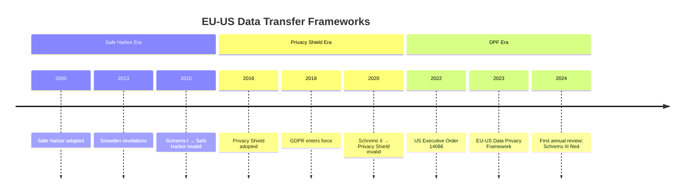
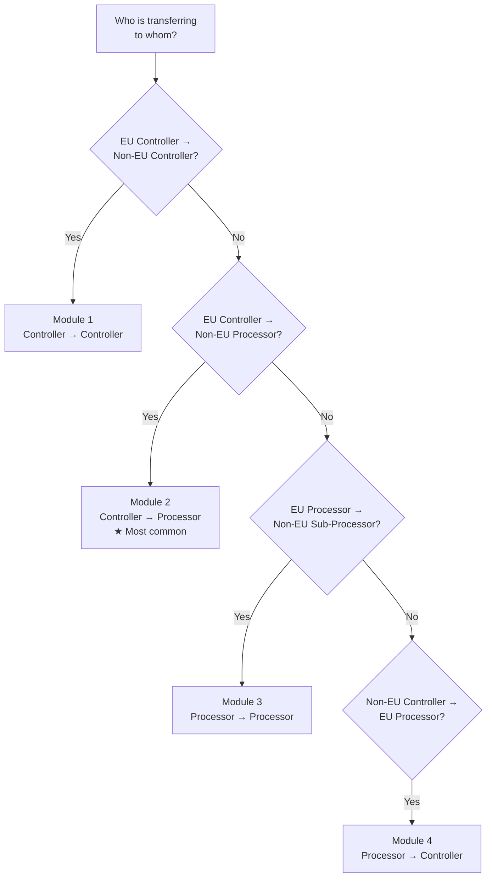

# Cross-Border Data Transfers — Mechanisms, Frameworks & Compliance

**Topic:** International data transfers; cross-border data flow mechanisms; adequacy; safeguards  
**Key Frameworks:** GDPR Chapter V; SCCs (2021); BCRs; EU-US DPF; APEC CBPR; Schrems I & II  
**Domain:** International privacy law; data sovereignty; transfer mechanisms  
**Audience:** Privacy lawyers, DPOs, compliance officers, global IT architects, multinational enterprises  
**Prerequisites:** Understanding of GDPR fundamentals; awareness of multiple privacy jurisdictions; basic legal concepts

---

## Chapter 1 — Historical Context & Origin Story

### 1.1 Timeline

| Year | Milestone |
|------|-----------|
| 1980 | OECD Guidelines: "Transborder Data Flows" principle (free flow with safeguards) |
| 1995 | EU Directive 95/46/EC Art. 25-26: transfer only to "adequate" countries; derogations |
| 2000 | **EU-US Safe Harbor** — self-certification framework for US companies |
| 2001-2015 | EU issues adequacy decisions for: Switzerland; Canada; Argentina; Israel; New Zealand; Uruguay; Japan (later); etc. |
| 2004 | EU adopts first set of Standard Contractual Clauses (Controller-to-Controller) |
| 2010 | EU updates SCCs (Controller-to-Processor; 2010/87/EU) |
| 2011 | APEC Cross-Border Privacy Rules (CBPR) system established |
| **2015** | **Schrems I** (CJEU C-362/14): Safe Harbor INVALIDATED — US mass surveillance incompatible with EU fundamental rights |
| 2016 | **EU-US Privacy Shield** replaces Safe Harbor (additional safeguards; Ombudsperson) |
| 2018 | GDPR enters force (Chapter V: modernized transfer rules; Art. 44-49) |
| **2020** | **Schrems II** (CJEU C-311/18): Privacy Shield INVALIDATED; SCCs valid but require case-by-case Transfer Impact Assessment (TIA) |
| 2020 | EDPB Recommendations 01/2020: supplementary measures for transfers |
| 2021 | **New SCCs adopted** (Commission Implementing Decision 2021/914) — modular approach (4 modules) |
| 2021 | UK adopts International Data Transfer Agreement (IDTA) + UK Addendum to EU SCCs |
| 2022 | EU-US negotiations on new framework (Executive Order 14086) |
| **2023** | **EU-US Data Privacy Framework (DPF)** — adequacy decision adopted (July 10, 2023) |
| 2023 | EDPB updates guidance on transfers; first reviews of DPF |
| 2024 | DPF under review (annual review per adequacy decision); Schrems III challenge filed (noyb) |

### 1.2 The Fundamental Tension

| Force | Description |
|:-----:|-------------|
| **Free flow of data** | Global economy requires data transfers; cloud computing; multinational operations |
| **Data sovereignty** | Countries want control over their citizens' data; national security concerns |
| **Fundamental rights** | EU: data protection as fundamental right (Charter Art. 7, 8); must be protected regardless of where data goes |
| **Surveillance** | Government access to personal data (intelligence; law enforcement) — core issue in Schrems cases |

---

## Chapter 2 — GDPR Transfer Framework (Chapter V)

### 2.1 Article Structure

| Article | Topic |
|:-------:|-------|
| 44 | General principle: transfers only with adequate protection |
| 45 | **Adequacy decisions** (Commission determines third country adequate) |
| 46 | **Appropriate safeguards** (SCCs; BCRs; codes of conduct; certification) |
| 47 | **Binding Corporate Rules** (BCRs) |
| 48 | Transfers not authorized by Union law (blocking foreign court orders) |
| 49 | **Derogations** (specific situations allowing transfers without adequacy/safeguards) |

### 2.2 Transfer Hierarchy

```mermaid
graph TD
    START[Need to Transfer Data<br/>Outside EEA?] --> CHECK_ADE{Adequacy<br/>Decision?<br/>Art. 45}
    
    CHECK_ADE -->|Yes| TRANSFER_OK[Transfer Permitted<br/>✓ No additional measures needed]
    CHECK_ADE -->|No| CHECK_SAFE{Appropriate<br/>Safeguards?<br/>Art. 46}
    
    CHECK_SAFE -->|SCCs| TIA{Transfer Impact<br/>Assessment<br/>Schrems II}
    CHECK_SAFE -->|BCRs| TIA
    CHECK_SAFE -->|Codes/Certs| TIA
    
    TIA -->|Laws adequate +<br/>measures sufficient| TRANSFER_OK
    TIA -->|Risks identified| SUPP[Supplementary<br/>Measures<br/>EDPB Rec.]
    SUPP -->|Effective| TRANSFER_OK
    SUPP -->|Cannot mitigate| NO_TRANSFER[Cannot Transfer<br/>✗ Must suspend/not initiate]
    
    CHECK_SAFE -->|No safeguard available| DEROG{Derogation?<br/>Art. 49}
    DEROG -->|Yes (narrow)| TRANSFER_OK
    DEROG -->|No| NO_TRANSFER
```

---

## Chapter 3 — Adequacy Decisions (Art. 45)

### 3.1 Current Adequacy Decisions (as of 2024)

| Country/Territory | Decision Year | Notes |
|:-----------------:|:---:|-------|
| Andorra | 2010 | |
| Argentina | 2003 | |
| Canada | 2001 | Commercial organizations under PIPEDA only |
| Faroe Islands | 2010 | |
| Guernsey | 2003 | |
| Isle of Man | 2004 | |
| Israel | 2011 | |
| Japan | 2019 | Mutual recognition with EU (supplementary rules) |
| Jersey | 2008 | |
| New Zealand | 2013 | |
| Republic of Korea | 2022 | Under PIPA (with supplementary rules) |
| Switzerland | 2000 | |
| United Kingdom | 2021 | Post-Brexit; 4-year sunset (review 2025) |
| Uruguay | 2012 | |
| **United States** | **2023** | **EU-US Data Privacy Framework (DPF) only** — limited to DPF-certified organizations |

### 3.2 Adequacy Assessment Criteria (Art. 45(2))

| Factor | Description |
|:------:|-------------|
| **Rule of law** | Respect for human rights; general/sectoral legislation (incl. public security; defence; criminal law) |
| **Independent supervisory authority** | Effective functioning; adequate enforcement powers |
| **International commitments** | Conventions; multilateral agreements (esp. re: data protection) |
| **Government access** | Laws on access by public authorities (national security; law enforcement); limitations; oversight; redress |

### 3.3 EU-US Data Privacy Framework (2023)

| Aspect | Detail |
|:------:|--------|
| **Legal basis** | Adequacy decision C(2023)4745; based on US Executive Order 14086 (Oct 2022) |
| **Scope** | US organizations self-certified under DPF via DoC (Department of Commerce) |
| **Key innovations** | (1) Data Protection Review Court (DPRC) — independent; binding; for EU individuals. (2) Proportionality/necessity requirements on US intelligence. (3) Annual review mechanism |
| **Predecessor** | Replaces invalidated Privacy Shield (2016-2020) and Safe Harbor (2000-2015) |
| **Challenge** | noyb filed Schrems III (challenging DPF); CJEU review expected 2025-2027 |
| **UK equivalent** | UK Extension to DPF (UK-US Data Bridge; 2023) |

---

## Chapter 4 — Standard Contractual Clauses (SCCs)

### 4.1 New SCCs (2021) — Modular Structure

| Module | From → To | Use Case |
|:------:|:---------:|----------|
| **Module 1** | Controller → Controller | EU company shares personal data with non-EU company (both determine purposes) |
| **Module 2** | Controller → Processor | EU company engages non-EU company to process data on its behalf (most common for cloud/SaaS) |
| **Module 3** | Processor → Processor | EU processor sub-contracts to non-EU sub-processor |
| **Module 4** | Processor → Controller | Non-EU company engages EU processor; data returns to non-EU controller |

### 4.2 Key Clauses

| Clause | Content |
|:------:|---------|
| **Clause 14** | Local laws assessment — data importer must assess whether local laws (esp. government access) affect compliance with clauses |
| **Clause 15** | Obligations in case of government access — notify data exporter (if legally possible); challenge requests; provide minimum necessary |
| **Clause 16** | Non-compliance — notify exporter if unable to comply; exporter may suspend transfer |
| **Docking clause** | Additional parties can accede to existing SCCs (multi-party arrangement without re-executing) |
| **Annex I** | List of parties; description of transfer; competent supervisory authority |
| **Annex II** | Technical and organizational measures (TOMs) |
| **Annex III** | List of sub-processors (Module 2 & 3) |

### 4.3 SCC Implementation Requirements Post-Schrems II

| Step | Action |
|:----:|--------|
| 1 | **Know your transfers** — map all transfers to third countries |
| 2 | **Identify transfer tool** — SCCs (likely); verify correct module |
| 3 | **Assess third-country law** — Transfer Impact Assessment (TIA) |
| 4 | **Implement supplementary measures** (if needed) — technical; contractual; organizational |
| 5 | **Document** — record assessment; rationale; measures adopted |
| 6 | **Monitor** — reassess if laws change; ongoing obligation |

---

## Chapter 5 — Binding Corporate Rules (BCRs)

### 5.1 Overview

| Aspect | Detail |
|:------:|--------|
| **What** | Internal data protection policies for multinational corporate groups governing intra-group transfers |
| **Approval** | Approved by lead supervisory authority (after cooperation procedure with other concerned SAs) |
| **Types** | BCR-C (controller); BCR-P (processor) |
| **Benefit** | One-time approval covers all intra-group transfers worldwide; no need for individual SCCs between group entities |
| **Cost** | Expensive and time-consuming to develop/approve (12-24 months; significant legal costs) |
| **Who uses** | Large multinationals (>500 BCR sets approved globally) |

### 5.2 BCR Requirements (Art. 47(2))

| Element | Description |
|:-------:|-------------|
| **Structure/contact** | Group structure; each member bound; entity responsible for compliance |
| **Data processing details** | Categories of data; types of processing; purposes; affected data subjects |
| **Binding nature** | Legally binding internally + enforceable by data subjects (third-party beneficiary rights) |
| **Data protection principles** | Purpose limitation; minimization; accuracy; storage limitation; security; lawful basis |
| **Rights** | Data subjects can exercise GDPR rights against any group entity |
| **Liability** | BCR entity established in EU accepts liability for breaches by non-EU entities |
| **Training** | Staff training on BCR obligations |
| **Audit** | Compliance auditing mechanisms |
| **Complaints** | Complaint handling; cooperation with SAs |
| **Mechanism for changes** | How BCRs are updated; notification to SA |

### 5.3 BCR vs SCCs

| Aspect | BCRs | SCCs |
|:------:|:----:|:----:|
| **Scope** | Intra-group transfers only | Any transfer (group + third-party) |
| **Approval** | SA approval required (12-24 months) | No prior approval (self-executing) |
| **Cost** | High (€100K-500K+ in legal/consulting) | Low (template; fill in annexes) |
| **Flexibility** | Covers entire group; one framework | Per-relationship; each transfer |
| **Customization** | Tailored to group operations | Standard template (limited customization) |
| **Third-party beneficiary rights** | Required (for data subjects) | Built into clauses |
| **Post-Schrems II** | Still need TIA (but BCR internal governance may be supplementary measure) | Need TIA + supplementary measures |
| **Best for** | Large multinationals; complex global operations | All organizations; esp. vendor relationships |

---

## Chapter 6 — Transfer Impact Assessment (TIA)

### 6.1 TIA Process (Post-Schrems II)

| Step | Action | Detail |
|:----:|--------|--------|
| 1 | **Identify transfer** | Specific data; destination country; transfer mechanism (SCC/BCR) |
| 2 | **Assess third-country law** | Legislation on government access (national security; law enforcement); applicable to data importer? |
| 3 | **Assess practical enforcement** | Is the law actually applied? Government access requests in practice? |
| 4 | **Evaluate effectiveness of safeguards** | Do SCCs/BCRs provide "essentially equivalent" protection to EU law given local laws? |
| 5 | **Supplementary measures (if needed)** | Technical/contractual/organizational measures to close gaps |
| 6 | **Decision** | (a) Transfer with existing safeguards. (b) Transfer with supplementary measures. (c) Cannot transfer (suspend) |
| 7 | **Document and review** | Record assessment; reassess periodically; monitor legal developments |

### 6.2 Supplementary Measures (EDPB Recommendations 01/2020)

| Type | Examples |
|:----:|---------|
| **Technical** | End-to-end encryption (importer has no key); pseudonymization (mapping stays in EU); split processing; transport encryption with EU key management |
| **Contractual** | Transparency obligations (notify re: government requests); audit rights; obligation to challenge access requests; warrant canary |
| **Organizational** | Internal policies re: government access; governance framework; training; documentation of access requests received |

### 6.3 Country Risk Considerations

| Country | Key Concern | Relevant Law |
|:---:|---|---|
| **United States** | FISA 702 (foreign intelligence surveillance); EO 12333 (bulk collection); NSL (national security letters) | FISA §702; EO 14086 (reforms); CLOUD Act |
| **China** | National Security Law; Cybersecurity Law; state access without independent oversight; Data Security Law export restrictions | CSL Art. 37; NSL Art. 7 |
| **Russia** | Data localization requirement; SORM (surveillance); FSB access | Federal Law 242-FZ; Yarovaya Law |
| **India** | IT Act §69 (decryption orders); pending DPDPA transfer rules; no independent oversight for intelligence access | IT Act 2000 §69; DPDPA §16 |
| **Australia** | Access and Assistance Act 2018 (encryption weakening); Five Eyes | Telecommunications Act; AA Act |
| **UK** | Investigatory Powers Act 2016 (bulk powers); adequate post-Brexit BUT under review (2025) | IPA 2016 |

---

## Chapter 7 — Schrems I & II Deep Dive

### 7.1 Schrems I (CJEU C-362/14; October 6, 2015)

| Aspect | Detail |
|:------:|--------|
| **Plaintiff** | Maximilian Schrems (Austrian privacy activist) vs. Irish DPC |
| **Target** | EU-US Safe Harbor (Commission Decision 2000/520/EC) |
| **Trigger** | Snowden revelations (2013): NSA mass surveillance programs (PRISM; Upstream) accessing EU citizens' data held by US companies |
| **Holding** | Safe Harbor INVALID. Reasons: (1) US authorities could access data without limitations/safeguards/oversight proportionate to EU standards. (2) Safe Harbor did not provide effective judicial protection for EU individuals. (3) Commission's adequacy finding interfered with Charter Art. 7 (private life); Art. 8 (data protection); Art. 47 (effective remedy) |
| **Impact** | Immediate: ~4,000+ companies lost transfer mechanism overnight. Scramble to SCCs. EU-US negotiations → Privacy Shield (2016) |

### 7.2 Schrems II (CJEU C-311/18; July 16, 2020)

| Aspect | Detail |
|:------:|--------|
| **Plaintiff** | Schrems vs. Irish DPC (re: Facebook Ireland → Facebook Inc. transfer) |
| **Targets** | (1) EU-US Privacy Shield. (2) SCCs (Commission Decision 2010/87/EU) |
| **Holdings** | |

| Holding | Detail |
|:-------:|--------|
| **Privacy Shield invalid** | Same deficiencies as Safe Harbor: US surveillance laws (FISA 702; EO 12333) not limited to what is "strictly necessary"; no effective redress for EU individuals (Ombudsperson not sufficiently independent or binding) |
| **SCCs remain valid IN PRINCIPLE** | But: |
| **Case-by-case assessment required** | Data exporter (+ importer) MUST assess whether third-country law allows importer to comply with SCC obligations |
| **Supplementary measures** | If assessment reveals inadequacy → must implement supplementary measures (technical; contractual; organizational) to ensure "essentially equivalent" protection |
| **SA obligation to suspend** | If SCCs + supplementary measures cannot ensure adequate protection → supervisory authority MUST suspend transfer |
| **No grace period** | Immediately effective (no transition period for Privacy Shield) |

### 7.3 Impact Analysis

| Stakeholder | Impact |
|:-----------:|--------|
| **US transfers** | Massive uncertainty; companies scrambled for alternatives (SCCs + TIA; data localization; DPF later) |
| **Cloud services** | EU-hosted processing expanded; customer encryption (BYOK); regional data residency offerings |
| **Other countries** | Raised awareness of government access laws globally; affected transfers to China, India, Russia |
| **SCCs** | Became primary mechanism; but burdened with TIA obligation; new SCCs (2021) added assessment clauses |
| **Privacy Shield participants** | Lost legal basis overnight; must rely on SCCs + TIA OR await DPF (2023) |

---

## Chapter 8 — APEC CBPR & Other Regional Mechanisms

### 8.1 APEC Cross-Border Privacy Rules (CBPR)

| Aspect | Detail |
|:------:|--------|
| **Established** | 2011 by APEC (Asia-Pacific Economic Cooperation) |
| **Participants** | US; Japan; South Korea; Canada; Australia; Singapore; Chinese Taipei; Philippines; Mexico (growing) |
| **Model** | Voluntary self-certification; accountability-based |
| **Mechanism** | Organization certified by Accountability Agent (e.g., TRUSTe/BBB) against CBPR requirements |
| **Scope** | Cross-border flows between CBPR-participating economies |
| **Principles** | Based on APEC Privacy Framework (2004/2015): collection limitation; notice; uses; security; access; accountability |
| **Enforcement** | Through domestic privacy enforcement authorities + Accountability Agent |
| **PRP** | Privacy Recognition for Processors (companion system for processors) |

### 8.2 Global CBPR Forum (2022+)

| Aspect | Detail |
|:------:|--------|
| **What** | Successor to APEC CBPR; independent of APEC (broader membership) |
| **Goal** | Establish global baseline for cross-border data flow certification |
| **Members** | US; Canada; Japan; Korea; Singapore; Taiwan; Philippines; Bermuda; others joining |
| **Relationship to EU** | Potential bridge between CBPR and GDPR (interoperability discussions) |

### 8.3 Other Mechanisms

| Mechanism | Region | Description |
|:---------:|:------:|-------------|
| **African Union Convention (Malabo)** | Africa | 2014; not yet in force (insufficient ratifications); modeled partly on GDPR |
| **ASEAN Framework** | Southeast Asia | 2016 ASEAN Framework on Personal Data Protection; Model Contractual Clauses (2021) |
| **Council of Europe 108+** | Europe+ | Convention 108 (1981); modernized as 108+ (2018); open to non-European states |
| **Ibero-American Network** | Latin America | Data protection network; mutual recognition; standards |
| **DEPA** | Digital Economy Partnership Agreement | Singapore; NZ; Chile; Korea — data flow provisions with privacy protection |

---

## Chapter 9 — Architecture Diagrams

### 9.1 Global Transfer Decision Framework

```mermaid
graph TB
    subgraph "EU Data Exporter Decision Tree"
        Q1[Is recipient in<br/>EEA/adequate country?] -->|Yes| OK1[✓ Transfer freely<br/>No additional measures]
        Q1 -->|No| Q2[Transfer mechanism<br/>available?]
        
        Q2 -->|SCCs| TIA1[Conduct TIA:<br/>Local laws compatible?]
        Q2 -->|BCRs| TIA1
        Q2 -->|Code of Conduct/Cert| TIA1
        
        TIA1 -->|Yes - adequate| OK2[✓ Transfer with<br/>safeguard mechanism]
        TIA1 -->|Concerns identified| SUPP1[Apply supplementary<br/>measures]
        
        SUPP1 -->|Technical: E2E encryption<br/>Pseudonymization<br/>Split processing| EVAL[Re-evaluate:<br/>effective?]
        SUPP1 -->|Contractual: transparency<br/>challenge obligations<br/>audit rights| EVAL
        SUPP1 -->|Organizational: policies<br/>governance; training| EVAL
        
        EVAL -->|Yes| OK3[✓ Transfer with<br/>measures documented]
        EVAL -->|No| Q3[Art. 49 derogation<br/>applicable?]
        
        Q3 -->|Explicit consent<br/>Contract necessity<br/>Public interest<br/>Vital interests<br/>Legal claims| OK4[✓ Transfer under<br/>derogation (narrow)]
        Q3 -->|No derogation| STOP[✗ CANNOT TRANSFER<br/>Suspend/relocate processing]
    end
```

### 9.2 Schrems Timeline



### 9.3 SCC Module Selection



---

## Chapter 10 — China Cross-Border Transfer Mechanisms

### 10.1 PIPL Transfer Framework (Art. 38)

| Mechanism | Description | Threshold |
|:---------:|-------------|:---------:|
| **CAC Security Assessment** | Government-conducted assessment by Cyberspace Administration of China | Mandatory for: CII operators; >1M persons' data; cumulative transfers >100K persons (or >10K sensitive) |
| **Standard Contract** | PRC Standard Contract filed with provincial CAC | Below security assessment thresholds |
| **Certification** | Professional institution certifies compliance | Intra-group transfers; per regulations |
| **Other** | Per regulations (future mechanisms) | TBD |

### 10.2 CAC Security Assessment

| Aspect | Detail |
|:------:|--------|
| **Trigger** | Critical information infrastructure operators; large-scale transfers (see thresholds above) |
| **Assessor** | National CAC (central government) |
| **Duration** | 45 working days (extendable by 15) |
| **Validity** | 2 years (must reassess after) |
| **Factors assessed** | Legality; necessity; recipient country's legal environment; recipient's security capabilities; risk of leakage/damage |
| **Outcome** | Pass/Fail; binding; transfer cannot proceed without pass |

---

## Chapter 11 — Interview Questions & Career Guide

### Tier 1: Entry-Level

**Q1:** What are the three main mechanisms for transferring personal data from the EU to a third country under GDPR?

**A:**

| Mechanism | Article | Description |
|:---------:|:-------:|-------------|
| **Adequacy decision** | Art. 45 | European Commission determines third country provides "essentially equivalent" protection; transfers proceed freely |
| **Appropriate safeguards** | Art. 46 | SCCs; BCRs; codes of conduct; certification mechanisms — provide contractual/organizational guarantees |
| **Derogations** | Art. 49 | Narrow exceptions: explicit consent (informed of risks); contract necessity; public interest; vital interests; legal claims; limited transfers from register |

### Tier 2: Mid-Level

**Q2:** After Schrems II, your company uses AWS (US) for hosting EU customer data. Walk through the TIA process.

**A:**

| Step | Assessment | Finding |
|:----:|-----------|---------|
| 1 | **Identify transfer** | EU customer data → AWS US data centers. Categories: name; email; usage data; payment. Transfer mechanism: SCCs (Module 2: Controller → Processor) |
| 2 | **US law assessment** | FISA 702: allows NSA to compel "electronic communication service providers" to provide foreign intelligence data. Does it apply to AWS? YES — AWS is an ECS provider. EO 12333: bulk collection (no warrant); applies to data in transit/accessible to US intelligence |
| 3 | **AWS as target** | AWS publishes transparency reports; receives FISA orders; has challenged some orders. But legally cannot refuse valid FISA 702 directive |
| 4 | **Post-EO 14086 assessment** | EO 14086 (2022): proportionality + necessity constraints on signals intelligence; Data Protection Review Court (DPRC) for EU complaints. DPF adequacy decision (2023) covers DPF-certified companies |
| 5 | **Is AWS DPF-certified?** | CHECK: if AWS is DPF-certified → adequacy decision applies; no SCC/TIA needed for DPF-scope transfers. IF certified: transfer OK under DPF |
| 6 | **If NOT DPF or want belt+suspenders** | Supplementary measures: (a) AWS EU-hosted regions (data at rest stays in EU; but US access still legally possible under CLOUD Act). (b) Customer-managed encryption keys (BYOK; AWS cannot decrypt without customer key). (c) Contractual: AWS commits to challenge overbroad government requests; notify customer (if legal). (d) Consider: process in EU with EU-only access; eliminate US transfer entirely |
| 7 | **Decision** | For most scenarios: DPF + SCCs + encryption (BYOK) + EU region = acceptable. Document TIA; reassess if DPF invalidated (Schrems III) |

### Tier 3: Senior

**Q3:** Design a cross-border data transfer architecture for a global pharmaceutical company with HQ in Germany, clinical trial sites in US/Japan/India/Brazil, and a CRO (Contract Research Organization) in China. Must comply with GDPR, PIPL, LGPD simultaneously.

**A:**

| Flow | Mechanism | Supplementary Measures |
|:----:|:---------:|------------------------|
| **Germany → US (clinical sites)** | DPF (if CRO DPF-certified) OR SCCs Module 2 | BYOK encryption; pseudonymized trial data (key stays in EU); contractual FISA notification |
| **Germany → Japan** | Adequacy decision (2019) | No additional measures needed; Japan supplementary rules apply |
| **Germany → India** | SCCs Module 2 (no adequacy) | TIA: assess IT Act §69 (decryption orders); risk = moderate. Measures: pseudonymization (trial subject IDs only; no direct identifiers to India site); encrypted transit; contractual challenge obligation |
| **Germany → Brazil (LGPD)** | SCCs Module 1 (controller-controller for clinical site) | Brazil has no EU adequacy; LGPD SCCs also apply (Brazil → EU = acceptable; but EU → Brazil needs EU SCCs). LGPD Art. 33: transfer allowed with SCCs or consent or contract necessity |
| **Germany → China (CRO)** | SCCs Module 2 + PIPL compliance | PIPL Art. 38: if >100K persons' data → CAC security assessment required (CRO handles large trial data). EU side: SCC + heavy supplementary measures (E2E encryption; pseudonymization; data minimization — send only what CRO strictly needs; contractual prohibition on Chinese law disclosure without EU consent) |
| **China outbound** | CAC security assessment (if threshold met) OR PRC Standard Contract | CRO must complete security assessment/standard contract filing for any results returned to EU/Germany |
| **Brazil → Germany** | LGPD Art. 33 mechanism (SCCs or adequacy) | LGPD: EU generally considered adequate de facto; ANPD SCCs recommended |

**Architecture:**

| Component | Design |
|:---------:|--------|
| **Central data hub** | Germany (EU); all raw personal data resides here |
| **Trial sites** | Receive ONLY pseudonymized datasets (subject ID → randomized code; no name/DOB); key retained in Germany |
| **China CRO** | Receives aggregated/anonymized results only OR minimum necessary pseudonymized records with E2E encryption (CRO has no decryption key for identifiers) |
| **Analytics** | Performed in EU on full dataset; only aggregated statistical outputs shared globally |
| **Consent** | Trial subjects consent includes: informed consent for cross-border transfers to listed countries; specific risks explained (GDPR Art. 49(1)(a) as additional derogation layer for clinical trials; Recital 112: clinical trials in public interest) |
| **Breach response** | Global protocol: notify German DPA (Hessian HBDI or relevant) within 72h; notify affected subjects; coordinate with local authorities (CNIL in France if French subjects; etc.) |

---

## Chapter 12 — Cheat Sheet & Quick Reference

```
═══════════════════════════════════════════
CROSS-BORDER TRANSFERS — QUICK REFERENCE
═══════════════════════════════════════════

GDPR TRANSFER HIERARCHY (Art. 44-49):
  1. Adequacy decision (Art. 45) → free flow
  2. Appropriate safeguards (Art. 46):
     • SCCs (most common)
     • BCRs (intra-group)
     • Codes of conduct / certification
  3. Derogations (Art. 49) → narrow; case-by-case

═══════════════════════════════════════════
ADEQUATE COUNTRIES (2024):
  Andorra; Argentina; Canada (PIPEDA);
  Faroe Islands; Guernsey; Isle of Man;
  Israel; Japan; Jersey; New Zealand;
  Republic of Korea; Switzerland;
  United Kingdom; Uruguay;
  USA (DPF-certified organizations only)

═══════════════════════════════════════════
SCCs (2021) — 4 MODULES:
  Module 1: Controller → Controller
  Module 2: Controller → Processor ★ MOST COMMON
  Module 3: Processor → Sub-processor
  Module 4: Processor → Controller

═══════════════════════════════════════════
POST-SCHREMS II OBLIGATIONS:
  ① Map all transfers
  ② Identify mechanism (SCC/BCR)
  ③ Conduct TIA (assess local law)
  ④ Implement supplementary measures (if needed)
  ⑤ Document everything
  ⑥ Monitor + reassess

═══════════════════════════════════════════
SUPPLEMENTARY MEASURES (EDPB):
  Technical: E2E encryption; pseudonymization;
            split processing; BYOK
  Contractual: transparency; challenge obligations;
              audit rights; warrant canary
  Organizational: policies; training; governance

═══════════════════════════════════════════
SCHREMS TIMELINE:
  2015 → Schrems I: Safe Harbor INVALID
  2020 → Schrems II: Privacy Shield INVALID;
         SCCs valid but need TIA
  2023 → DPF adopted (third attempt)
  2024 → Schrems III filed (challenging DPF)

═══════════════════════════════════════════
EU-US DPF (2023):
  • Self-certification via DoC
  • US EO 14086: proportionality + necessity
  • Data Protection Review Court (DPRC)
  • Annual EU-US review
  • IF DPF-certified → adequacy applies
  • IF NOT certified → still need SCCs + TIA

═══════════════════════════════════════════
BCRs vs SCCs:
  BCRs: intra-group; SA approval; 12-24 months;
        expensive; comprehensive; one framework
  SCCs: any transfer; self-executing; cheap;
        per-relationship; template-based

═══════════════════════════════════════════
CHINA (PIPL Art. 38):
  >1M persons OR CII → CAC Security Assessment
  Below threshold → Standard Contract (file w/ CAC)
  Intra-group → Certification possible
  Assessment validity: 2 years

═══════════════════════════════════════════
ART. 49 DEROGATIONS (USE SPARINGLY):
  (a) Explicit consent (informed of risks)
  (b) Contract necessity (with data subject)
  (c) Contract in interest of data subject
  (d) Public interest
  (e) Legal claims
  (f) Vital interests
  (g) Public register (limited)
  ★ Not for systematic/large-scale transfers
```

---

*End of Document — 11_Cross_Border_Transfers.md*
