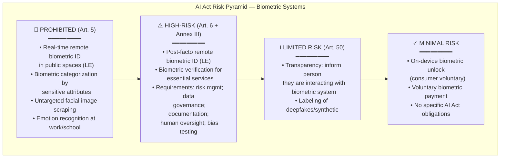

# Biometric & Special Category Data — Processing, Protection & Regulation

**Topic:** Biometric data; special category data processing; facial recognition; EU AI Act prohibitions; workplace biometrics  
**Key Regulations:** GDPR Art. 9; EU AI Act; Illinois BIPA; ISO/IEC 30136; EDPB Guidelines  
**Domain:** Biometric privacy; special category data; AI regulation; facial recognition governance  
**Audience:** DPOs, biometric system engineers, AI/ML practitioners, HR professionals, legal counsel  
**Prerequisites:** GDPR fundamentals; understanding of machine learning; basic knowledge of biometric systems

---

## Chapter 1 — Historical Context & Origin Story

### 1.1 Timeline

| Year | Milestone |
|------|-----------|
| 1858 | First systematic use of fingerprints (Sir William Herschel; British India) |
| 1960s | First automated fingerprint identification systems (FBI; AFIS) |
| 1993 | DARPA FERET program (Face Recognition Technology) — early facial recognition research |
| 2001 | Super Bowl XXXV: facial recognition used on attendees (Tampa; public backlash) |
| 2008 | **Illinois BIPA** enacted (Biometric Information Privacy Act) — first US biometric-specific law |
| 2013 | Apple Touch ID (fingerprint) on iPhone 5s — mass consumer biometrics |
| 2016 | GDPR adopted — Art. 9 defines "biometric data" as special category |
| 2017 | Apple Face ID (iPhone X) — facial recognition mainstream |
| 2018 | GDPR enters force; biometric data gets highest protection tier |
| 2019 | San Francisco bans government use of facial recognition |
| 2019 | Clearview AI controversy (scraping billions of photos; selling to law enforcement) |
| 2020 | EDPB Guidelines 3/2019 on video surveillance (including facial recognition) |
| 2020 | EU proposes AI Act (first comprehensive AI regulation; includes biometric provisions) |
| 2021 | BIPA: Illinois Supreme Court — Rosenbach v. Six Flags (no need to show actual harm for standing) |
| 2022 | Clearview AI fined by multiple EU DPAs (€20M Italy; €9M UK; €20M Greece; €20M France) |
| 2023 | EU AI Act agreed (trilogue); facial recognition prohibitions in "unacceptable risk" tier |
| 2024 | **EU AI Act enters force** (August 1, 2024); phased implementation; biometric provisions among first to apply |
| 2024 | BIPA damages: multiple multi-million dollar settlements (Facebook $650M; Google $100M; TikTok $92M) |

### 1.2 Defining Biometric Data

| Source | Definition |
|:------:|------------|
| **GDPR Art. 4(14)** | "Personal data resulting from specific technical processing relating to the physical, physiological or behavioural characteristics of a natural person, which allow or confirm the unique identification of that natural person, such as facial images or dactyloscopic data" |
| **ISO/IEC 2382-37** | "Biometric data: data that represents biometric characteristics of a biometric data subject and is used as part of a recognition process" |
| **Illinois BIPA** | "Biometric identifier: retina or iris scan, fingerprint, voiceprint, or scan of hand or face geometry" (excludes: writing samples; signatures; photographs; physical descriptions; demographic data) |

---

## Chapter 2 — GDPR Special Category Data Framework (Art. 9)

### 2.1 Special Categories (Art. 9(1))

| Category | Examples |
|:--------:|---------|
| Racial or ethnic origin | Skin color data; ethnic group membership |
| Political opinions | Party membership; political activity |
| Religious or philosophical beliefs | Church membership; atheist organization |
| Trade union membership | Union registration; activity |
| **Genetic data** | DNA sequences; genetic test results |
| **Biometric data (for identification)** | Fingerprint templates; facial recognition vectors; iris scans; voiceprints |
| Health data | Medical records; disability status; health app data |
| Sex life or sexual orientation | Dating preferences; sexual health information |

### 2.2 General Prohibition + Exceptions (Art. 9(2))

**Default rule:** Processing of special category data is PROHIBITED (Art. 9(1)).

| Exception | Art. 9(2) | Description |
|:---------:|:---------:|-------------|
| **Explicit consent** | (a) | Data subject explicitly consented (higher bar than "regular" consent) |
| **Employment/social security** | (b) | Necessary for employment obligations (authorized by law) |
| **Vital interests** | (c) | Protect vital interests where subject physically/legally incapable of consenting |
| **Legitimate activities** | (d) | Processing by non-profit bodies (political; philosophical; religious; trade union) regarding members |
| **Manifestly public** | (e) | Data subject has manifestly made data public |
| **Legal claims** | (f) | Establishment, exercise, or defence of legal claims |
| **Substantial public interest** | (g) | Based on Union or Member State law; proportionate; safeguards |
| **Health/social care** | (h) | Preventive/occupational medicine; health/social care; per professional secrecy |
| **Public health** | (i) | Public interest in public health (epidemics; quality/safety standards) |
| **Archiving/research** | (j) | Archiving in public interest; scientific/historical research; statistics (with safeguards) |

### 2.3 When Biometric Data Triggers Art. 9

| Scenario | Art. 9 applies? | Rationale |
|:--------:|:---:|-----------|
| Facial recognition for building access | ✓ Yes | Biometric data processed for IDENTIFICATION |
| Storing facial image (photograph) for HR badge | ✗ Generally No | Photo stored but not processed through biometric algorithms for identification |
| Fingerprint for phone unlock (on-device only) | Depends | If template never leaves device and is not used by controller for identification → may not apply. If employer mandates device unlock for work → may apply |
| Voice recording for customer service | ✗ No | Voice recorded but NOT processed to identify via biometric characteristics |
| Voiceprint used to authenticate caller | ✓ Yes | Behavioral biometric processed for identification/authentication |
| Typing pattern (keystroke dynamics) | ✓ Yes (if for ID) | Behavioral biometric for identification → Art. 9 |
| Gait recognition (CCTV) | ✓ Yes | Physical biometric for identification |

**Critical distinction:** Art. 9 applies when biometric data is processed **"for the purpose of uniquely identifying"** a natural person. If the same physical data (e.g., a photo) is NOT processed through identification algorithms, it may remain "ordinary" personal data under Art. 6.

---

## Chapter 3 — Biometric Technologies Deep Dive

### 3.1 Biometric Modalities

| Modality | Type | Template Size | FAR* | FRR* | Spoofability |
|:--------:|:----:|:---:|:---:|:---:|:---:|
| **Fingerprint** | Physiological | 256-1024 bytes | 0.001% | 0.1% | Medium (silicone; gummy) |
| **Face (2D)** | Physiological | 512-2048 bytes | 0.1-1% | 1-5% | High (photo; video) |
| **Face (3D/depth)** | Physiological | 2-4 KB | 0.001% | 0.1% | Low (structured light) |
| **Iris** | Physiological | 256-512 bytes | 0.0001% | 0.2% | Low (high-res image hard) |
| **Voice** | Behavioral | 1-4 KB | 1-2% | 5-10% | Medium (deepfake) |
| **Keystroke dynamics** | Behavioral | 1-2 KB | 2-5% | 5-10% | High (replay) |
| **Vein pattern** | Physiological | 512-1024 bytes | 0.001% | 0.01% | Very Low (internal) |
| **Gait** | Behavioral | 2-8 KB | 5-10% | 10-15% | Medium |
| **DNA** | Physiological | Variable | ~0% | ~0% | Very Low (but slow) |

*FAR = False Acceptance Rate; FRR = False Rejection Rate (typical operational values)

### 3.2 Biometric System Architecture

```mermaid
graph LR
    subgraph "Enrollment"
        CAPTURE_E[Biometric Capture<br/>━━━━━━━━━<br/>• Sensor (camera/scanner)<br/>• Quality check<br/>• Liveness detection] --> EXTRACT_E[Feature Extraction<br/>━━━━━━━━━<br/>• Algorithm processing<br/>• Template generation<br/>• Quality score]
        EXTRACT_E --> STORE_E[Template Storage<br/>━━━━━━━━━<br/>• Encrypted template<br/>• Associated identity<br/>• Metadata]
    end
    
    subgraph "Verification/Identification"
        CAPTURE_V[Biometric Capture<br/>(Live)] --> EXTRACT_V[Feature Extraction<br/>(Live template)]
        EXTRACT_V --> MATCH[Matching Engine<br/>━━━━━━━━━<br/>• 1:1 (verification)<br/>• 1:N (identification)<br/>• Score threshold]
        STORE_E -.-> MATCH
        MATCH --> DECISION[Decision<br/>━━━━━━━━━<br/>• Accept / Reject<br/>• Confidence score<br/>• Audit log]
    end
```

### 3.3 Verification vs. Identification

| Aspect | Verification (1:1) | Identification (1:N) |
|:------:|:---:|:---:|
| **Question** | "Is this person who they claim to be?" | "Who is this person?" |
| **Process** | Compare live template against ONE stored template | Compare live template against ALL stored templates (database) |
| **Example** | Fingerprint unlock (you claim to be phone owner) | Facial recognition in crowd (no claim; system identifies) |
| **Privacy risk** | Lower (voluntary; cooperating subject) | Higher (often without knowledge; mass surveillance potential) |
| **GDPR impact** | Art. 9 applies (but consent easier) | Art. 9 applies (consent harder; often impossible for surveillance) |
| **EU AI Act** | Permitted (with safeguards) | Restricted/Prohibited (real-time public spaces) |

---

## Chapter 4 — EU AI Act: Biometric Provisions

### 4.1 Risk Classification for Biometric AI Systems

| Risk Level | Biometric Application | Rules |
|:----------:|----------------------|-------|
| **UNACCEPTABLE (Banned)** | Real-time remote biometric identification in publicly accessible spaces (by law enforcement) — with narrow exceptions | Prohibited (Art. 5) |
| **UNACCEPTABLE (Banned)** | Biometric categorization by sensitive attributes (race; political opinion; sexual orientation; religion) | Prohibited (Art. 5) |
| **UNACCEPTABLE (Banned)** | Untargeted scraping of facial images from internet/CCTV for facial recognition databases | Prohibited (Art. 5) |
| **UNACCEPTABLE (Banned)** | Emotion recognition in workplace and educational settings | Prohibited (Art. 5) |
| **HIGH-RISK** | Remote biometric identification (post-fact/retrospective) by law enforcement | Permitted with strict safeguards (Art. 6; Annex III) |
| **HIGH-RISK** | Biometric verification systems used for access to essential services | Art. 6 + Annex III requirements |
| **HIGH-RISK** | Biometric categorization (non-sensitive attributes) | High-risk if deployed in listed use cases |

### 4.2 Exceptions to Real-Time Ban (Art. 5 — Very Narrow)

| Exception | Conditions |
|:---------:|-----------|
| **Targeted search for victims** | Missing children; trafficking victims; exploitation victims |
| **Imminent terrorist threat** | Genuine, present, foreseeable terrorist threat (specific) |
| **Serious crime suspect** | Targeted search for suspect/person convicted of specified serious crime (max sentence ≥4 years) |

**Additional safeguards for exceptions:**
- Prior judicial authorization (or urgent → authorization within 48h)
- Temporal and geographic limitation
- Not for blanket/indiscriminate surveillance
- DPA notification
- Fundamental rights impact assessment

### 4.3 High-Risk Biometric System Requirements

| Requirement | Description |
|:-----------:|-------------|
| **Risk management system** | Ongoing; identify/mitigate risks; residual risk assessment |
| **Data governance** | Training data: relevant; representative; free from errors; complete. Bias testing required |
| **Technical documentation** | Detailed description of system; intended purpose; accuracy metrics; known limitations |
| **Record-keeping** | Automatic logging of system operation; decisions; for audit |
| **Transparency** | Instructions for use; capabilities; limitations disclosed to deployer |
| **Human oversight** | Human-in-the-loop or human-on-the-loop (override capability) |
| **Accuracy, robustness, cybersecurity** | Appropriate levels; tested; resistant to adversarial attacks |
| **Bias testing** | Across demographic groups; disaggregated metrics (by age; gender; ethnicity) |

---

## Chapter 5 — Illinois BIPA & US Biometric Laws

### 5.1 Illinois BIPA (740 ILCS 14)

| Aspect | Detail |
|:------:|--------|
| **Enacted** | 2008 (first US biometric privacy law) |
| **Scope** | Private entities; biometric identifiers (retina; iris; fingerprint; voiceprint; hand/face geometry) |
| **Excludes** | Government; financial institutions (Gramm-Leach-Bliley); HIPAA-covered entities |

| Requirement | Section | Detail |
|:-----------:|:-------:|--------|
| **Written policy** | §15(a) | Published retention schedule and destruction guidelines |
| **Written consent** | §15(b) | Written informed consent before collecting biometric data; disclosure of purpose and retention period |
| **No sale/profit** | §15(c) | Cannot sell, lease, trade, or profit from biometric data |
| **No disclosure** | §15(d) | Cannot disclose without consent (exceptions: legal obligation; law enforcement with warrant) |
| **Security** | §15(e) | Reasonable standard of care; at least as protective as other confidential/sensitive information |

### 5.2 BIPA Private Right of Action (§20)

| Violation Type | Damages |
|:-:|:-:|
| **Negligent** | $1,000 per violation OR actual damages (whichever greater) + attorneys' fees |
| **Intentional/reckless** | $5,000 per violation OR actual damages (whichever greater) + attorneys' fees |

### 5.3 Landmark BIPA Litigation

| Case | Year | Outcome | Significance |
|:----:|:----:|---------|:---:|
| **Rosenbach v. Six Flags** | 2019 (IL SC) | No need to show actual injury/harm for standing | Opened floodgate of BIPA litigation |
| **Facebook (In re FB Biometric)** | 2021 (settlement) | **$650 million** settlement (tag suggestions feature) | Largest biometric privacy settlement |
| **Google (Rivera v. Google)** | 2022 (settlement) | **$100 million** (Google Photos face grouping) | Second-largest |
| **TikTok** | 2022 (settlement) | **$92 million** (biometric data collection) | |
| **Clearview AI** | 2022 (settlement) | $2M class action; injunction (cannot sell to most private entities in US) | |
| **Cothron v. White Castle** | 2023 (IL SC) | Separate violation EACH TIME biometric data is scanned (not just first collection) | Exponential damage multiplication |

### 5.4 Other US Biometric Laws

| Jurisdiction | Law | Key Difference from BIPA |
|:---:|:---:|---|
| **Texas** | CUBI (Capture or Use of Biometric Identifier) | AG enforcement only (no private right of action); $25K/violation |
| **Washington** | HB 1493 | No private right of action; narrower; notice requirement only |
| **New York City** | Local Law 3 (2021) | Commercial establishments: notice required (conspicuous signage); no private right of action |
| **Colorado** | CPA (includes biometric as sensitive) | Opt-in consent for sensitive data (including biometric); state AG enforcement |
| **California** | CCPA/CPRA (biometric as sensitive PI) | Opt-out for sale/sharing; opt-in for sensitive PI use beyond necessary |
| **Maryland** | Facial Recognition in Schools (2021) | Prohibits facial recognition in schools |
| **Portland, OR** | Ordinance (2020) | Ban on private sector use of facial recognition in places of public accommodation |

---

## Chapter 6 — ISO/IEC 30136 & Biometric Template Protection

### 6.1 ISO/IEC 30136:2018 — Performance Testing of Biometric Template Protection Schemes

| Aspect | Detail |
|:------:|--------|
| **Title** | Information technology — Performance testing of biometric template protection schemes |
| **Purpose** | Methodology for evaluating performance of biometric template protection (BTP) schemes |
| **Scope** | Accuracy; security; renewability of protected templates |

### 6.2 Biometric Template Protection Techniques

| Technique | Description | Property |
|:---------:|-------------|:--------:|
| **Cancelable biometrics** | Apply non-invertible transformation to template; if compromised → generate new template with different transformation | Renewability |
| **Biometric cryptosystem (fuzzy vault)** | Lock cryptographic key with biometric; key released only with correct biometric match | Key binding |
| **Fuzzy commitment** | Combine biometric with error-correcting code; verify via syndrome | Irreversibility |
| **Secure sketch** | Public "sketch" that helps recover secret from noisy biometric reading | Helper data |
| **Homomorphic encryption** | Matching performed on encrypted templates (never decrypted) | Computation privacy |

### 6.3 Related Standards

| Standard | Topic |
|:--------:|-------|
| **ISO/IEC 24745:2022** | Biometric information protection (BIP) — requirements and guidelines |
| **ISO/IEC 19795 series** | Biometric performance testing and reporting |
| **ISO/IEC 30107 series** | Presentation attack detection (anti-spoofing) |
| **ISO/IEC 39794 series** | Extensible biometric data interchange formats |
| **ISO/IEC 29794 series** | Biometric sample quality |

---

## Chapter 7 — Workplace Biometrics

### 7.1 EDPB Guidance on Workplace Biometrics

| Principle | Application |
|:---------:|-------------|
| **Necessity** | Biometric access control only where security risk justifies it (not for general office entry where badge/PIN suffices) |
| **Proportionality** | Facial recognition for cafeteria payment → disproportionate. Fingerprint for nuclear facility → proportionate |
| **Consent (problematic)** | Employee consent generally NOT freely given (power imbalance; EDPB Opinion). Cannot rely on Art. 9(2)(a) consent alone |
| **Alternative legal basis** | Art. 9(2)(b): employment law obligation (if national law specifically authorizes biometric workplace controls). Art. 9(2)(g): substantial public interest (per national law) |
| **Data minimization** | Template on card/device (not central database). 1:1 verification (not 1:N identification). Minimum retention |
| **DPIA required** | Systematic monitoring of employees using biometric data → DPIA mandatory (Art. 35(3)(b)) |

### 7.2 Workforce Implementation Guide

| Consideration | Guidance |
|:---:|---|
| **Legitimate purpose** | Security of restricted areas; time & attendance (if legally mandated); access to sensitive systems |
| **Alternatives considered** | Document why non-biometric alternatives (PIN; badge; 2FA) are insufficient |
| **Legal basis** | Identify specific national law authorizing workplace biometric (varies: France: CNIL guidance; Germany: §26 BDSG; UK: employment contract + LIA) |
| **DPIA** | Mandatory; document: necessity; proportionality; risk mitigation; alternatives rejected |
| **Employee information** | Detailed notice: what biometric collected; why; how stored; retention; rights; DPO contact |
| **Storage** | Template on employee device/card preferred over central server. If central: encryption; access control; segregation |
| **Retention** | Delete immediately upon employment termination; or when no longer needed for purpose |
| **Opt-out** | Provide non-biometric alternative (badge; PIN) for employees who object (where legally feasible) |
| **Template** | Store template only (not raw biometric image where possible); irreversible where feasible |
| **International transfers** | If biometric templates sent to central system in another country → full transfer mechanism required |

---

## Chapter 8 — Architecture Diagrams

### 8.1 Privacy-Preserving Biometric System Architecture

```mermaid
graph TB
    subgraph "Privacy-Preserving Biometric Access Control"
        subgraph "Enrollment (One-time)"
            E_CAPTURE[Biometric Capture<br/>━━━━━━━━━<br/>• Fingerprint sensor<br/>• Liveness detection<br/>• Quality assessment]
            E_EXTRACT[Feature Extraction<br/>━━━━━━━━━<br/>• Template generation<br/>• Cancelable transform<br/>• NO raw image stored]
            E_STORE[Secure Storage<br/>━━━━━━━━━<br/>• Encrypted template<br/>• On smart card (preferred)<br/>• OR encrypted central DB<br/>• HSM key management]
        end
        
        subgraph "Verification (Each access)"
            V_CAPTURE[Live Capture<br/>━━━━━━━━━<br/>• Same sensor type<br/>• Liveness check<br/>• Anti-spoofing]
            V_EXTRACT[Live Template<br/>━━━━━━━━━<br/>• Same algorithm<br/>• Same transform<br/>• Ephemeral (deleted after match)]
            V_MATCH[Matching<br/>━━━━━━━━━<br/>• 1:1 verification<br/>• Threshold comparison<br/>• Decision: Accept/Reject]
            V_LOG[Audit Log<br/>━━━━━━━━━<br/>• Timestamp<br/>• Decision (Y/N)<br/>• Location<br/>• NO template in log]
        end
        
        subgraph "Privacy Controls"
            CONSENT[Art. 9 Legal Basis<br/>━━━━━━━━━<br/>• Employment law<br/>• Explicit consent<br/>• Public interest]
            DPIA[DPIA<br/>━━━━━━━━━<br/>• Necessity proven<br/>• Alternatives rejected<br/>• Proportionality]
            RIGHTS[Data Subject Rights<br/>━━━━━━━━━<br/>• Access (info only)<br/>• Deletion (enrollment)<br/>• Non-biometric alternative]
        end
    end
    
    E_CAPTURE --> E_EXTRACT --> E_STORE
    V_CAPTURE --> V_EXTRACT --> V_MATCH
    E_STORE -.->|retrieve for comparison| V_MATCH
    V_MATCH --> V_LOG
```

### 8.2 EU AI Act Biometric Classification



---

## Chapter 9 — Case Studies

### 9.1 Clearview AI: Global Enforcement Actions

| Aspect | Detail |
|--------|--------|
| **Company** | Clearview AI (US startup; founded 2017) |
| **Product** | Facial recognition search engine; database of 30B+ facial images scraped from internet (social media; news; public sources) |
| **Users** | Sold to law enforcement agencies (US; worldwide); some private entities |
| **Privacy violations** | (1) Processing biometric data without consent (Art. 9). (2) No legal basis (Art. 6). (3) No transparency (Art. 14 — subjects never informed). (4) Unlawful scraping. (5) No data retention limits. (6) Cross-border transfer without safeguards |

| DPA | Fine | Year | Key Order |
|:---:|:----:|:----:|-----------|
| **Italy (Garante)** | €20 million | 2022 | Delete all Italian residents' data; prohibited from future processing |
| **UK (ICO)** | £7.5 million (~€9M) | 2022 | Stop processing UK residents' data; delete all data held |
| **France (CNIL)** | €20 million | 2022 | Stop collecting; delete French residents' data |
| **Greece (HDPA)** | €20 million | 2022 | Prohibited from processing Greek residents' data |
| **Australia (OAIC)** | Order to cease | 2021 | Breach of Australian Privacy Act; cease collection from Australians |

**Lessons:**
- Scraping publicly available images does NOT create consent for biometric processing
- "Public" photos ≠ consent for facial recognition template extraction
- Multiple jurisdictions can enforce simultaneously (cumulative fines)
- Biometric data regulations have extraterritorial effect

### 9.2 Workplace Facial Recognition: Swedish School DPA Case

| Aspect | Detail |
|--------|--------|
| **Who** | Swedish school using facial recognition for student attendance |
| **System** | Camera-based facial recognition; automated attendance marking; pilot with 22 students |
| **DPA finding** | Swedish DPA (IMY) fined school SEK 200,000 (~€20,000) |
| **Violations** | (1) Consent invalid (power imbalance: student cannot freely refuse school system). (2) Failed DPIA (insufficient). (3) Disproportionate: simpler alternatives exist (manual roll-call; badge). (4) Special category data (Art. 9) processed without valid exception. (5) Even with consent → not freely given (educational context) |
| **Significance** | First fine for facial recognition in education in EU; established that consent from students is generally not "free" (similar to employment context) |

### 9.3 Facebook Tag Suggestions ($650M BIPA Settlement)

| Aspect | Detail |
|--------|--------|
| **System** | Facebook "Tag Suggestions": analyzed uploaded photos; identified faces; suggested tags using facial recognition |
| **BIPA violation** | (1) No written informed consent before collecting face geometry (§15(b)). (2) No published data retention/destruction policy (§15(a)). (3) Collected biometric identifiers of millions of Illinois users without compliance |
| **Class** | 1.6 million Illinois Facebook users |
| **Settlement** | $650 million (2021); each class member received ~$397 |
| **Behavioral change** | Facebook (Meta) disabled Face Recognition system entirely (November 2021); deleted >1 billion facial recognition templates |
| **Significance** | Largest BIPA settlement; demonstrated massive financial exposure; led Meta to abandon facial recognition entirely for Facebook |

---

## Chapter 10 — Future Evolution & Trends

### 10.1 Emerging Developments

| Trend | Description | Timeline |
|:-----:|-------------|:--------:|
| **Decentralized biometric identity** | Self-sovereign identity + biometrics; user controls template; verifiable credentials without central database | 2024-2028 |
| **On-device processing** | All biometric matching on user device; no server-side storage; Apple/Google model expanding | Ongoing |
| **Multimodal biometrics** | Combine multiple modalities (face + voice + behavioral) for higher accuracy with lower individual-modality quality | 2024-2026 |
| **Deepfake detection** | AI-based liveness/deepfake detection as mandatory component of biometric systems | 2024-2027 |
| **EU AI Act enforcement** | First prohibited AI practices enforced (Feb 2025); high-risk requirements (Aug 2026) | 2025-2026 |
| **Global facial recognition bans** | More jurisdictions restricting/banning (especially real-time public surveillance) | 2024-2030 |
| **Privacy-preserving biometrics** | Fully homomorphic encryption for matching; zero-knowledge proof of identity; cancelable biometrics by default | 2025-2030 |
| **BIPA reform/spread** | More US states adopting biometric-specific laws; potential federal law | 2024-2027 |
| **Behavioral biometrics** | Continuous authentication (typing; mouse; gait); always-on monitoring → new privacy challenges | Ongoing |
| **Neurotechnology** | Brain-computer interfaces creating "neural data" → calls for cognitive privacy rights | 2025-2035 |

---

## Chapter 11 — Interview Questions & Career Guide

### Tier 1: Entry-Level

**Q1:** Under GDPR, when does processing a facial image constitute "biometric data" under Art. 9?

**A:** A facial image becomes biometric data under Art. 9 ONLY when it is processed through **specific technical processing** (facial recognition algorithms) that allows or confirms **unique identification**. A photograph stored in an HR file for visual identification by humans is NOT biometric data under Art. 9. But the SAME photograph processed through facial recognition software to generate a mathematical template (faceprint) for automated identification IS biometric data. The trigger is the **purpose and technical processing**, not the raw image itself.

| Scenario | Art. 9 biometric data? |
|:--------:|:---:|
| Photo in HR file (badge) | No |
| Photo processed by facial recognition to unlock door | Yes |
| Photo uploaded to social media (no recognition) | No |
| Same photo analyzed by platform's face detection/tagging algorithm | Yes |

### Tier 2: Mid-Level

**Q2:** Your company wants to implement fingerprint access control for its data center. Walk through the GDPR compliance requirements.

**A:**

| Step | Action | Detail |
|:----:|--------|--------|
| 1 | **Identify legal basis under Art. 9(2)** | Options: (a) Explicit consent — problematic if employees cannot refuse (power imbalance; EDPB). (b) Employment/social security law (Art. 9(2)(b)) — check national law: does it specifically authorize biometric workplace controls? (Germany: §26 BDSG may support for security-critical areas. France: CNIL authorization framework). (c) Substantial public interest (Art. 9(2)(g)) — if protecting critical infrastructure (per national law) |
| 2 | **DPIA (mandatory)** | Art. 35: systematic monitoring of employees using biometric = automatic DPIA trigger. Document: why fingerprint (not badge/PIN); security requirements justifying biometric; proportionality assessment; risk mitigation |
| 3 | **Necessity & proportionality** | Why is fingerprint NECESSARY? Data center contains highly sensitive client data; badge cloning is demonstrated risk; PIN sharing observed; regulatory requirement for strong access control (e.g., PCI-DSS physical security). Why proportionate? Limited to data center (not general office); minimal: 1:1 verification only; template on badge (not central DB) |
| 4 | **Technical measures** | (a) Store template on smart card (employee holds); no central biometric database. (b) If central: encrypted; HSM-protected keys; access controls. (c) Liveness detection (anti-spoofing). (d) Automatic deletion on termination. (e) No raw fingerprint image stored (template only) |
| 5 | **Employee notification** | Art. 13 notice: what biometric collected; purpose; legal basis; retention; rights; DPO contact; right to lodge complaint with DPA |
| 6 | **Alternative offered** | For employees who object: provide non-biometric alternative (security escort + badge + PIN) where feasible — shows respect for autonomy |
| 7 | **Records of processing** | Art. 30 entry: biometric data processing; categories of subjects (data center staff); retention (employment duration + 30 days); security measures |
| 8 | **Vendor management** | If biometric system vendor processes templates (cloud matching) → Art. 28 processor agreement; transfer assessment if non-EU vendor |

### Tier 3: Senior

**Q3:** Design a biometric authentication system for a banking app that must comply with GDPR (Art. 9), PSD2 SCA requirements, and anticipate EU AI Act high-risk classification. Include template protection.

**A:**

| Layer | Design | Compliance Mapping |
|:-----:|--------|:---:|
| **Legal basis** | Art. 9(2)(a): explicit consent at enrollment (clear: "I consent to my [fingerprint/face] being used for app authentication; template stored encrypted on this device only; I can revoke and use PIN instead"). PLUS Art. 6(1)(c): legal obligation (PSD2 mandates SCA for payment authentication) | GDPR Art. 9; Art. 6 |
| **Architecture: on-device** | All biometric processing on user device (Secure Enclave / TEE). Template NEVER leaves device. Server receives only yes/no authentication result (cryptographically signed by device secure element) | Data minimization; Art. 25 DPbD |
| **Template protection** | (a) Cancelable biometrics: non-invertible transformation applied to template. If device compromised → revoke + re-enroll with new transformation parameters. (b) Key binding: biometric unlocks device-local cryptographic key (FIDO2/WebAuthn model); biometric template protects private key in secure enclave | ISO/IEC 24745; 30136 |
| **Anti-spoofing** | (a) Liveness detection (passive + active): 3D depth map (Face ID); skin conductivity (fingerprint). (b) Presentation Attack Detection (PAD) per ISO/IEC 30107. (c) AI model for deepfake/replay detection → this model is HIGH-RISK under AI Act (biometric verification for financial services) | ISO 30107; AI Act Annex III |
| **AI Act compliance** | Since biometric verification for banking = high-risk: (a) Risk management system (document risks: false acceptance → unauthorized access; false rejection → user lockout; bias → demographic groups less accurate). (b) Data governance: training data representative across demographics (age; skin tone; gender). (c) Bias testing: disaggregated FAR/FRR across demographic groups; threshold ≤ 2× variation. (d) Human oversight: fallback to human-assisted verification if repeated failures. (e) Technical documentation: model architecture; training data description; accuracy metrics per group. (f) Logging: authentication attempts (success/fail); no biometric template in logs | EU AI Act Art. 6-15 |
| **PSD2 SCA** | Biometric = "inherence" factor (one of: knowledge; possession; inherence). Combined with possession (the device itself) → two factors satisfied. Must demonstrate: independence of factors; dynamic linking (for payments); session limits | PSD2 Art. 4(30); RTS on SCA |
| **Fallback** | Always provide non-biometric alternative: PIN + device (two factors without biometric). User can disable biometric at any time. If disabled: only cryptographic authentication (FIDO2 without biometric unlock) | Art. 7(3) consent withdrawal |
| **Retention** | Template exists only while enrolled feature is active. Revocation = immediate template deletion from secure enclave. No server-side biometric data at any time. | Art. 5(1)(e) storage limitation |
| **DPIA** | Conducted for: (a) systematic biometric processing of large user base. (b) Risk: template compromise (mitigated by on-device + cancelable). (c) Risk: demographic bias (mitigated by testing + fallback). (d) Residual risk: acceptable (on-device; user-controlled; alternative available) | Art. 35 |

---

## Chapter 12 — Cheat Sheet & Quick Reference

```
═══════════════════════════════════════════
BIOMETRIC & SPECIAL CATEGORY DATA
═══════════════════════════════════════════

GDPR ART. 9 SPECIAL CATEGORIES:
  • Racial/ethnic origin
  • Political opinions
  • Religious/philosophical beliefs
  • Trade union membership
  • Genetic data
  • BIOMETRIC DATA (for identification)
  • Health data
  • Sex life / sexual orientation
  
  DEFAULT: PROHIBITED (Art. 9(1))
  EXCEPTIONS: Art. 9(2)(a)-(j)

═══════════════════════════════════════════
WHEN IS BIOMETRIC DATA "SPECIAL CATEGORY"?
  ★ Only when processed for PURPOSE of
    uniquely IDENTIFYING a natural person
  
  Photo in HR file → NOT Art. 9
  Photo through facial recognition algo → IS Art. 9
  Fingerprint for building access → IS Art. 9
  Voice call recording (no voiceprint) → NOT Art. 9

═══════════════════════════════════════════
KEY ART. 9(2) EXCEPTIONS FOR BIOMETRICS:
  (a) Explicit consent (problematic at work!)
  (b) Employment law (national law must authorize)
  (g) Substantial public interest (per national law)
  
  ★ Employee consent ≠ freely given (EDPB)
  ★ Always need DPIA for workplace biometrics

═══════════════════════════════════════════
EU AI ACT — BIOMETRIC RULES:
  BANNED:
    • Real-time remote biometric ID (public spaces; LE)
    • Biometric categorization (sensitive attributes)
    • Untargeted facial image scraping
    • Emotion recognition (workplace/school)
  
  HIGH-RISK:
    • Post-facto remote biometric ID (LE)
    • Biometric verification (essential services)
    • Requirements: risk mgmt; bias testing;
      human oversight; documentation; logging

═══════════════════════════════════════════
ILLINOIS BIPA (US):
  • Written consent BEFORE collection
  • Published retention/destruction policy
  • No sale/profit from biometric data
  • Private right of action:
    $1,000/negligent; $5,000/intentional per violation
  • Cothron: each SCAN = separate violation
  • Major settlements: Facebook $650M; Google $100M

═══════════════════════════════════════════
BIOMETRIC BEST PRACTICES:
  ✓ On-device template storage (not central DB)
  ✓ 1:1 verification (not 1:N identification)
  ✓ Cancelable/renewable templates
  ✓ Liveness detection (anti-spoofing)
  ✓ Non-biometric alternative always available
  ✓ Delete template immediately on termination
  ✓ DPIA before implementation
  ✓ Bias testing across demographics
  ✗ Never store raw biometric images
  ✗ Never use without valid Art. 9 exception
  ✗ Never rely solely on employee "consent"

═══════════════════════════════════════════
TEMPLATE PROTECTION (ISO/IEC 24745; 30136):
  • Cancelable biometrics (transform + renew)
  • Biometric cryptosystem (fuzzy vault)
  • Homomorphic matching (encrypted comparison)
  • On-device secure enclave (TEE/SE)

═══════════════════════════════════════════
CLEARVIEW AI LESSONS:
  • Public photos ≠ consent for biometric use
  • Scraping for biometric DB → illegal (EU; AU; UK)
  • Multiple jurisdictions: cumulative fines
  • Total fines: €60M+ (IT; FR; GR; UK combined)

═══════════════════════════════════════════
METRICS:
  FAR = False Acceptance Rate (letting wrong person in)
  FRR = False Rejection Rate (blocking right person)
  EER = Equal Error Rate (FAR = FRR point)
  Lower EER = better biometric system
  
  Bias metric: max(FAR_group)/min(FAR_group) < 2×
              across demographic groups
```

---

*End of Document — 12_Biometric_Special_Category.md*
