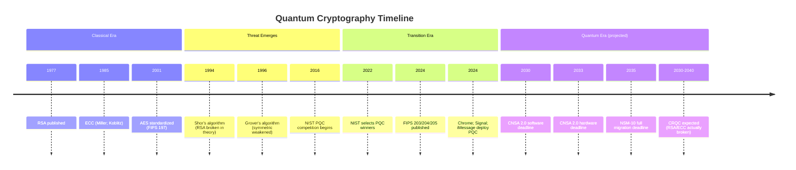

# Quantum Computing & Post-Quantum Cryptography — Landscape Overview

**Topic:** Quantum computing threat landscape; post-quantum cryptography (PQC) standardization; quantum-safe transition  
**Standards:** NIST FIPS 203/204/205; ETSI QKD; ISO 23837; CNSA 2.0; NSM-10  
**Domain:** Cryptography; quantum information science; cybersecurity  
**Audience:** Security architects, cryptographers, CISO/CTO, standards body participants, embedded systems engineers  
**Prerequisites:** Classical cryptography fundamentals (RSA, ECC, AES); basic linear algebra; understanding of PKI

---

## Chapter 1 — Historical Context & Origin Story

### 1.1 Timeline: From Quantum Theory to Cryptographic Revolution

| Year | Milestone |
|------|-----------|
| 1935 | Einstein-Podolsky-Rosen (EPR) paper — quantum entanglement concept |
| 1964 | Bell's theorem — entanglement is real (cannot be explained classically) |
| 1981 | Feynman proposes quantum computers to simulate quantum systems |
| 1984 | **BB84 protocol** (Bennett & Brassard) — first Quantum Key Distribution protocol |
| 1985 | Deutsch proposes universal quantum computer model |
| **1994** | **Shor's algorithm** — factors integers in polynomial time → BREAKS RSA, ECC, DH |
| 1996 | Grover's algorithm — quadratic speedup for search → weakens AES-128 |
| 1997 | First experimental QKD over optical fiber (23 km; Geneva) |
| 2001 | IBM: Shor's algorithm on 7-qubit quantum computer (factors 15) |
| 2007 | D-Wave: first commercial "quantum computer" (quantum annealing) |
| 2016 | **NIST PQC competition launched** (69 submissions from 25 countries) |
| 2017 | China: Micius satellite — intercontinental QKD (7,600 km) |
| 2019 | Google "quantum supremacy" claim (Sycamore, 53 qubits; random circuit sampling) |
| 2020 | IBM Quantum: 65-qubit Hummingbird; Honeywell: 10-qubit trapped-ion |
| 2022 | **NIST selects PQC winners:** CRYSTALS-Kyber (KEM); CRYSTALS-Dilithium + FALCON + SPHINCS+ (signatures) |
| 2022 | **US NSM-10:** Federal agencies must migrate to PQC by 2035 |
| 2022 | **NSA CNSA 2.0:** PQC for national security systems by 2030-2033 |
| 2023 | IBM: 1,121-qubit Condor processor; NIST FIPS drafts for public comment |
| **2024** | **NIST FIPS 203/204/205 published** (August 13, 2024) — final PQC standards |
| 2024 | Active migration: Chrome (hybrid ML-KEM+X25519); Signal (PQXDH); iMessage (PQ3) |
| 2025 | FIPS 206 (FN-DSA/FALCON) expected; EU Quantum Flagship milestones |

### 1.2 The Quantum Threat Model

| Threat | Algorithm | Impact | Timeline |
|:------:|:---------:|--------|:--------:|
| **Break asymmetric crypto** | Shor's algorithm | RSA, ECC, DH, DSA — ALL broken in polynomial time | CRQC* needed (est. 2030-2040) |
| **Weaken symmetric crypto** | Grover's algorithm | AES-128 → ~64-bit security; AES-256 → ~128-bit | Mitigation: double key size |
| **Harvest Now, Decrypt Later (HNDL)** | — | Adversaries collect encrypted traffic NOW; decrypt with future quantum computer | **Happening TODAY** |

*CRQC = Cryptographically Relevant Quantum Computer (estimated: 4,000+ logical qubits for RSA-2048)

---

## Chapter 2 — Landscape Architecture

### 2.1 The Post-Quantum Ecosystem

```mermaid
graph TB
    subgraph "Quantum Threat"
        SHOR[Shor's Algorithm<br/>Breaks: RSA; ECC; DH; DSA]
        GROVER[Grover's Algorithm<br/>Weakens: AES-128; SHA-256]
        HNDL[Harvest Now<br/>Decrypt Later]
    end
    
    subgraph "Post-Quantum Defense"
        subgraph "NIST PQC Standards (2024)"
            FIPS203[FIPS 203: ML-KEM<br/>Key Encapsulation<br/>(Kyber-based)]
            FIPS204[FIPS 204: ML-DSA<br/>Digital Signatures<br/>(Dilithium-based)]
            FIPS205[FIPS 205: SLH-DSA<br/>Hash-Based Signatures<br/>(SPHINCS+-based)]
            FIPS206[FIPS 206: FN-DSA<br/>Compact Signatures<br/>(FALCON-based; 2025)]
        end
        
        subgraph "Quantum Key Distribution"
            QKD[ETSI QKD Standards<br/>ISO/IEC 23837<br/>Physics-based security]
        end
        
        subgraph "Quantum Random"
            QRNG[QRNG Standards<br/>True quantum randomness<br/>ETSI TS 104 000]
        end
    end
    
    subgraph "Migration"
        AGILITY[Crypto Agility<br/>Algorithm negotiation<br/>Hot-swap capability]
        HYBRID[Hybrid Schemes<br/>Classical + PQC<br/>Transition period]
        MIGRATE[Migration Programs<br/>NSM-10; CNSA 2.0<br/>NIST NCCoE playbooks]
    end
    
    SHOR --> FIPS203
    SHOR --> FIPS204
    SHOR --> FIPS205
    GROVER --> QRNG
    HNDL --> MIGRATE
```

### 2.2 Mathematical Foundations of PQC

| Problem Family | Hard Problem | Used By | Best Classical Attack | Best Quantum Attack |
|:-:|---|:---:|:---:|:---:|
| **Lattice** | Learning With Errors (LWE); Module-LWE; Ring-LWE | ML-KEM; ML-DSA; FN-DSA | Exponential ($2^{O(n)}$) | Sub-exponential (best known; not polynomial) |
| **Hash-based** | Collision resistance; pre-image resistance of hash functions | SLH-DSA | $O(2^{n/2})$ collision; $O(2^n)$ preimage | $O(2^{n/3})$ collision (Grover); still exponential |
| **Code-based** | Decoding random linear codes (Syndrome Decoding Problem) | Classic McEliece (NIST alternate) | Exponential (best: ISD algorithms) | Not significantly faster than classical |
| **Multivariate** | Solving system of multivariate polynomial equations over finite field | — (Round 3 candidates eliminated) | Exponential | Not significantly faster |
| **Isogeny** | Finding isogenies between supersingular elliptic curves | SIKE (BROKEN 2022) | Exponential (before 2022 attack) | N/A — broken classically |

### 2.3 NIST PQC Security Levels

| Level | Classical Equivalent | Quantum Equivalent | Description |
|:-----:|:---:|:---:|---|
| **1** | AES-128 | NIST block cipher search (Grover) | All attacks at least as hard as brute-forcing AES-128 key |
| **2** | SHA-256 collision | Quantum collision search | At least as hard as finding SHA-256 collision |
| **3** | AES-192 | Grover search for AES-192 | At least as hard as brute-forcing AES-192 |
| **4** | SHA-384 collision | Quantum SHA-384 collision | At least as hard as SHA-384 collision |
| **5** | AES-256 | Grover search for AES-256 | At least as hard as brute-forcing AES-256 |

---

## Chapter 3 — NIST PQC Standards Summary

### 3.1 FIPS 203: ML-KEM (Module-Lattice Key Encapsulation Mechanism)

| Aspect | Detail |
|:------:|--------|
| **Basis** | CRYSTALS-Kyber (winner of NIST PQC KEM category) |
| **Problem** | Module Learning With Errors (MLWE) |
| **Purpose** | Key encapsulation (replaces RSA key exchange; ECDH) |
| **Modes** | ML-KEM-512 (Level 1); ML-KEM-768 (Level 3); ML-KEM-1024 (Level 5) |

| Parameter | ML-KEM-512 | ML-KEM-768 | ML-KEM-1024 |
|:---------:|:---:|:---:|:---:|
| Public key | 800 bytes | 1,184 bytes | 1,568 bytes |
| Ciphertext | 768 bytes | 1,088 bytes | 1,568 bytes |
| Shared secret | 32 bytes | 32 bytes | 32 bytes |
| Security level | 1 | 3 | 5 |

### 3.2 FIPS 204: ML-DSA (Module-Lattice Digital Signature Algorithm)

| Aspect | Detail |
|:------:|--------|
| **Basis** | CRYSTALS-Dilithium |
| **Problem** | Module Learning With Errors (MLWE) + Module Short Integer Solution (MSIS) |
| **Purpose** | Digital signatures (replaces RSA-PSS; ECDSA; EdDSA) |
| **Modes** | ML-DSA-44 (Level 2); ML-DSA-65 (Level 3); ML-DSA-87 (Level 5) |

| Parameter | ML-DSA-44 | ML-DSA-65 | ML-DSA-87 |
|:---------:|:---:|:---:|:---:|
| Public key | 1,312 bytes | 1,952 bytes | 2,592 bytes |
| Signature | 2,420 bytes | 3,293 bytes | 4,595 bytes |
| Security level | 2 | 3 | 5 |

### 3.3 FIPS 205: SLH-DSA (Stateless Hash-Based Digital Signature Algorithm)

| Aspect | Detail |
|:------:|--------|
| **Basis** | SPHINCS+ |
| **Problem** | Hash function security (minimal assumptions; conservative) |
| **Purpose** | Backup signature scheme (if lattice assumptions broken) |
| **Advantage** | Security relies ONLY on hash function properties (well-understood; decades of analysis) |
| **Trade-off** | Larger signatures; slower signing/verification than ML-DSA |

### 3.4 Size Comparison: Classical vs. PQC

| Algorithm | Public Key | Signature/Ciphertext | Use Case |
|:---------:|:---:|:---:|:---:|
| RSA-2048 | 256 B | 256 B | Legacy key exchange/signature |
| ECDSA P-256 | 64 B | 64 B | Current signature standard |
| X25519 | 32 B | 32 B (shared) | Current key exchange |
| **ML-KEM-768** | **1,184 B** | **1,088 B** | **PQC key exchange** |
| **ML-DSA-65** | **1,952 B** | **3,293 B** | **PQC signature** |
| **SLH-DSA-128f** | **32 B** | **17,088 B** | **PQC conservative signature** |

---

## Chapter 4 — Implementation Landscape

### 4.1 Current Deployments (2024)

| Organization | Implementation | Status |
|:---:|---|:---:|
| **Google Chrome** | Hybrid ML-KEM-768 + X25519 for TLS (key exchange) | Production (default since Chrome 124) |
| **Apple iMessage** | PQ3 protocol (ML-KEM + ratcheting; post-compromise security) | Production (iOS 17.4+) |
| **Signal** | PQXDH (ML-KEM-768 + X25519 hybrid key exchange) | Production (2023) |
| **Cloudflare** | Hybrid PQC for TLS; experimental ML-KEM deployment | Production |
| **AWS** | s2n-tls PQC support; KMS PQ-TLS option | Available |
| **Microsoft** | SymCrypt PQC library; Azure hybrid PQC testing | Preview/testing |
| **OpenSSH 9.x** | Hybrid ML-KEM-768 + X25519 for key exchange | Production |
| **WireGuard** | Rosenpass (PQC extension for WireGuard) | Experimental |

### 4.2 Library Ecosystem

| Library | Language | PQC Algorithms | Maturity |
|:-------:|:--------:|:---:|:---:|
| **liboqs** (Open Quantum Safe) | C | All NIST winners + candidates | Production-ready |
| **pqcrypto** | Rust | ML-KEM; ML-DSA; SLH-DSA | Active |
| **CIRCL** (Cloudflare) | Go | ML-KEM; ML-DSA | Production |
| **BouncyCastle** | Java/C# | ML-KEM; ML-DSA; SLH-DSA | Production |
| **wolfSSL** | C | ML-KEM; ML-DSA | Production (embedded) |
| **PQClean** | C (reference) | All NIST PQC | Reference implementations |
| **AWS-LC** | C | ML-KEM (FIPS-validated path) | Production |
| **SymCrypt** (Microsoft) | C | ML-KEM; ML-DSA | Production |

---

## Chapter 5 — Migration & Crypto Agility

### 5.1 Migration Timeline (US Government — NSM-10 + CNSA 2.0)

| Milestone | Deadline | Requirement |
|:---------:|:--------:|-------------|
| **Inventory** | 2023-2024 | Complete inventory of cryptographic assets (algorithms; protocols; key sizes) |
| **Prioritize** | 2024-2025 | Prioritize systems for migration (highest risk: long-lived data; signatures; PKI) |
| **Plan** | 2025-2026 | Develop migration plans per system |
| **Deploy PQC (software)** | 2025-2030 | Deploy ML-KEM; ML-DSA in software-based systems |
| **Deploy PQC (firmware/hardware)** | 2028-2033 | Firmware updates; hardware crypto accelerators |
| **Fully PQC** | 2030-2035 | All national security systems quantum-resistant |

### 5.2 CNSA 2.0 Algorithm Requirements (NSA)

| Use Case | Required Algorithm | Timeline |
|:--------:|:---:|:---:|
| **Symmetric encryption** | AES-256 | Immediate (already required) |
| **Hashing** | SHA-384 or SHA-512 | Immediate |
| **Key establishment** | ML-KEM-1024 | By 2030 (software); by 2033 (hardware) |
| **Digital signature** | ML-DSA-87 or SLH-DSA (Level 5) | By 2030 (software); by 2033 (hardware) |
| **Key exchange (ephemeral)** | ML-KEM-1024 | By 2030 |
| **Code signing** | ML-DSA-87 | By 2028 |

---

## Chapter 6 — Quantum Key Distribution (QKD)

### 6.1 QKD Concept

| Aspect | Detail |
|:------:|--------|
| **Principle** | Quantum mechanics guarantees: measuring a quantum state disturbs it. Eavesdropping is DETECTABLE. |
| **Security basis** | Laws of physics (not computational hardness) — information-theoretic security |
| **Output** | Shared secret key between two parties (then used with AES/OTP) |
| **Limitation** | Requires dedicated quantum channel (fiber or satellite); distance-limited (100-400 km per link); trusted nodes for long distance |
| **Standards** | ETSI GS QKD series; ISO/IEC 23837; ITU-T Y.3800 |

### 6.2 BB84 Protocol (Bennett-Brassard, 1984)

| Step | Description |
|:----:|-------------|
| 1 | Alice prepares photons in random states (4 states: 2 bases × 2 values) |
| 2 | Alice sends photons over quantum channel |
| 3 | Bob measures each photon in randomly chosen basis |
| 4 | Alice and Bob publicly compare bases (NOT values) over classical channel |
| 5 | Keep only results where bases matched (~50% of bits) |
| 6 | Error estimation: sample subset; if error rate > threshold → eavesdropper detected; abort |
| 7 | Privacy amplification: distill shorter, perfectly secret key |

---

## Chapter 7 — Comparison of PQC Approaches

| Approach | Security Basis | Key Size | Signature Size | Performance | Maturity | Risk |
|:--------:|:---:|:---:|:---:|:---:|:---:|:---:|
| **Lattice (ML-KEM/ML-DSA)** | MLWE/MSIS hardness | Medium (~1-2 KB) | Medium (~2-5 KB) | Fast | NIST standardized (2024) | Novel; lattice assumptions |
| **Hash-based (SLH-DSA)** | Hash function security | Small (32-64 B) | Large (8-50 KB) | Slow signing | NIST standardized (2024) | Very low (minimal assumptions) |
| **Code-based (McEliece)** | Syndrome decoding | Very large (~1 MB) | Small (~100 B) | Fast | 40+ years; NIST Round 4 | Low (well-studied); size issue |
| **QKD** | Laws of physics | N/A (key generated) | N/A | Limited by distance | Deployed (fiber networks) | Infrastructure cost; distance |
| **Hybrid (classical + PQC)** | Both must be broken | Combined | Combined | Sum of both | Widely deployed in TLS | Transitional (not permanent) |

---

## Chapter 8 — Architecture Diagrams

### 8.1 PQC Migration Decision Tree

```mermaid
graph TD
    START[System Uses<br/>Cryptography?] --> TYPE{What type?}
    
    TYPE -->|Key Exchange<br/>RSA/DH/ECDH| KEM[Replace with ML-KEM<br/>FIPS 203<br/>Hybrid during transition]
    TYPE -->|Digital Signature<br/>RSA/ECDSA/EdDSA| SIG{Performance<br/>requirements?}
    TYPE -->|Symmetric Only<br/>AES/ChaCha| SYM[Increase to AES-256<br/>Already quantum-safe!]
    TYPE -->|Hashing<br/>SHA-256| HASH[Use SHA-384/512<br/>for security margin]
    
    SIG -->|Speed priority| MLDSA[ML-DSA (FIPS 204)<br/>Fast; medium signatures]
    SIG -->|Size priority<br/>bandwidth constrained| FNDSA[FN-DSA (FIPS 206; 2025)<br/>Compact signatures]
    SIG -->|Max security<br/>conservative| SLHDSA[SLH-DSA (FIPS 205)<br/>Hash-only assumptions]
    
    KEM --> PLAN[Migration Plan:<br/>1. Inventory<br/>2. Prioritize<br/>3. Test hybrid<br/>4. Deploy PQC<br/>5. Remove classical]
    MLDSA --> PLAN
    FNDSA --> PLAN
    SLHDSA --> PLAN
    SYM --> DONE[Already Quantum-Safe ✓]
    HASH --> DONE
```

### 8.2 Quantum Threat vs Defense Timeline



---

## Chapter 9 — Case Studies

### 9.1 Signal: PQXDH Protocol

| Aspect | Detail |
|--------|--------|
| **When** | September 2023 |
| **What** | Signal upgraded to PQXDH (Post-Quantum Extended Diffie-Hellman) |
| **Mechanism** | Hybrid: ML-KEM-768 + X25519. Both must be broken to compromise key exchange |
| **Why hybrid** | If ML-KEM has undiscovered weakness → X25519 still protects (against classical). If quantum computer → ML-KEM protects |
| **Impact** | Billions of messages protected against "harvest now, decrypt later" |
| **Key insight** | First major messaging app to deploy PQC; established hybrid as best practice for transition |

### 9.2 Harvest Now, Decrypt Later: Intelligence Context

| Aspect | Detail |
|--------|--------|
| **Threat** | Nation-state adversaries intercepting and storing encrypted communications today |
| **Target data** | Diplomatic cables; military communications; trade secrets; health records; financial data |
| **Data shelf life** | Some data valuable for 20-30+ years (government secrets; personal health; financial) |
| **Timeline** | If CRQC arrives by 2035, data encrypted today with RSA/ECC is at risk |
| **Who** | Multiple intelligence agencies reported to be conducting HNDL programs |
| **Mitigation** | Deploy PQC NOW for data with long confidentiality requirements; don't wait for CRQC |
| **Priority** | Data requiring confidentiality beyond 2035 → migrate to PQC immediately |

---

## Chapter 10 — Future Evolution

| Trend | Description | Timeline |
|:-----:|-------------|:--------:|
| **CRQC development** | Cryptographically-relevant quantum computer; estimated 4,000+ logical qubits | 2030-2040 (uncertain) |
| **Error correction advances** | Surface codes; topological qubits; reducing overhead from millions of physical qubits | 2025-2035 |
| **FIPS 206 (FN-DSA/FALCON)** | Compact signatures; complementing ML-DSA | 2025 |
| **NIST additional algorithms** | Round 4 candidates (code-based KEM; new signatures) | 2025-2027 |
| **Full TLS 1.3 PQC** | All TLS connections using PQC by default (browsers; servers) | 2026-2028 |
| **PQC in IoT/embedded** | Constrained devices; hardware acceleration; lightweight PQC modes | 2025-2030 |
| **Quantum internet** | Entanglement distribution networks; QKD backbone | 2030-2040 |
| **Crypto agility standard** | Formal standards for algorithm negotiation and hot-swap | 2025-2027 |

---

## Chapter 11 — Interview Questions & Career Guide

### Tier 1: Entry-Level

**Q1:** Why does Shor's algorithm threaten RSA but not AES?

**A:** Shor's algorithm efficiently solves the integer factorization problem and the discrete logarithm problem in polynomial time on a quantum computer. RSA's security relies on factoring large integers (product of two primes); ECC relies on discrete log over elliptic curves. Both become easy for a quantum computer. AES is a SYMMETRIC cipher — its security relies on brute-force search complexity. Grover's algorithm provides only a quadratic speedup (not polynomial-time solution), reducing AES-128 to ~64-bit security and AES-256 to ~128-bit security. Doubling the key size (AES-256) provides quantum-resistant symmetric encryption.

### Tier 2: Mid-Level

**Q2:** Explain the hybrid key exchange approach in TLS and why it's necessary during the PQC transition.

**A:** Hybrid key exchange combines a classical algorithm (e.g., X25519/ECDH) with a PQC algorithm (e.g., ML-KEM-768) in the same TLS handshake. The shared secret is derived from BOTH:
- $K_{shared} = KDF(K_{classical} || K_{pqc})$

Both algorithms must be broken to compromise the session key. This provides:
1. **Quantum protection** — ML-KEM protects against future quantum computer (X25519 alone cannot)
2. **Classical safety net** — X25519 protects if ML-KEM has undiscovered vulnerability (new algorithms have less analysis history)
3. **Transition period** — Organizations can deploy PQC without risking regression if lattice assumptions weaken
4. **Backward compatibility** — Servers not supporting PQC can fall back to classical-only

### Tier 3: Senior

**Q3:** You are CISO of a financial services firm. Design a 3-year PQC migration strategy covering: TLS, code signing, PKI, and HSMs.

**A:** See doc 09 (PQC Migration Playbook) for the full framework. Key elements: cryptographic inventory → risk-prioritized migration plan → hybrid deployment → PQC-native → decommission classical.

---

## Chapter 12 — Cheat Sheet & Quick Reference

```
═══════════════════════════════════════════
QUANTUM & POST-QUANTUM — QUICK REFERENCE
═══════════════════════════════════════════

QUANTUM THREAT:
  Shor's algorithm → breaks RSA, ECC, DH, DSA
  Grover's algorithm → weakens AES-128 → use AES-256
  HNDL: harvest now, decrypt later → migrate NOW

═══════════════════════════════════════════
NIST PQC STANDARDS (August 2024):
  FIPS 203: ML-KEM (Kyber) → key exchange
  FIPS 204: ML-DSA (Dilithium) → signatures
  FIPS 205: SLH-DSA (SPHINCS+) → backup signatures
  FIPS 206: FN-DSA (FALCON) → compact sigs (2025)

═══════════════════════════════════════════
ALGORITHM SELECTION:
  Key exchange → ML-KEM-768 (Level 3) or ML-KEM-1024 (Level 5)
  Signatures (general) → ML-DSA-65 (Level 3)
  Signatures (conservative) → SLH-DSA
  Signatures (compact) → FN-DSA (when available)
  Symmetric → AES-256 (already quantum-safe)
  Hash → SHA-384 / SHA-512

═══════════════════════════════════════════
KEY SIZES (ML-KEM-768 vs X25519):
  X25519 public key: 32 bytes
  ML-KEM-768 public key: 1,184 bytes (~37× larger)
  ML-KEM-768 ciphertext: 1,088 bytes
  Shared secret: 32 bytes (same)

═══════════════════════════════════════════
MIGRATION DEADLINES:
  CNSA 2.0 (NSA):
    Software PQC: by 2030
    Hardware PQC: by 2033
  NSM-10 (US Federal):
    Full migration: by 2035
  
  Priority: HNDL-vulnerable data FIRST

═══════════════════════════════════════════
HYBRID = Classical + PQC (both combined)
  TLS: X25519 + ML-KEM-768
  SSH: X25519 + ML-KEM-768
  Signal: PQXDH (X25519 + ML-KEM)
  Rationale: defense-in-depth during transition

═══════════════════════════════════════════
MATH FOUNDATIONS:
  Lattice: LWE/MLWE → ML-KEM, ML-DSA, FN-DSA
  Hash: collision/preimage resistance → SLH-DSA
  Code: syndrome decoding → Classic McEliece
  Isogeny: BROKEN (SIKE broken 2022; do NOT use)

═══════════════════════════════════════════
QKD (Quantum Key Distribution):
  Security: laws of physics (not computational)
  Protocol: BB84 (most common)
  Limitation: distance (~100-400 km/link); dedicated fiber
  Standards: ETSI QKD series; ISO 23837; ITU-T Y.3800

═══════════════════════════════════════════
CATEGORY 24 DOCUMENTS:
  00 Overview (this doc)
  01 Shor/Grover quantum threat
  02 FIPS 203 ML-KEM
  03 FIPS 204 ML-DSA
  04 FIPS 205 SLH-DSA
  05 Crypto agility & migration
  06 QKD (ETSI/ISO standards)
  07 QRNG standards
  08 Hybrid certificates & TLS
  09 PQC migration playbook
  10 Quantum hardware benchmarks
  11 Government PQC programs
  12 PQC for embedded systems
```

---

*End of Document — 00_Quantum_PostQuantum_Overview.md*
