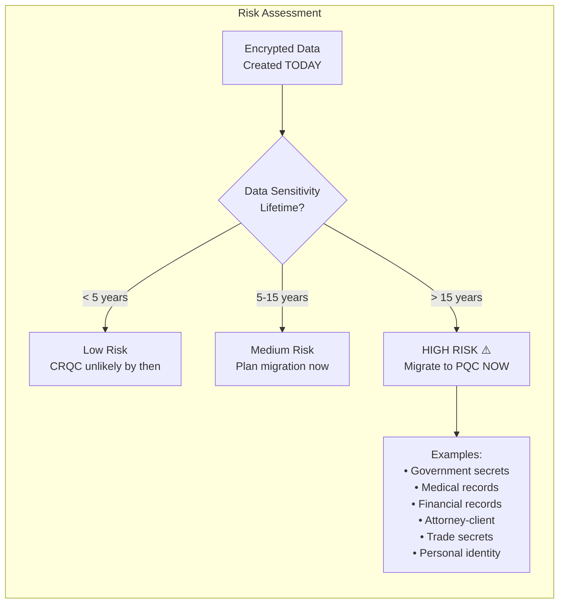
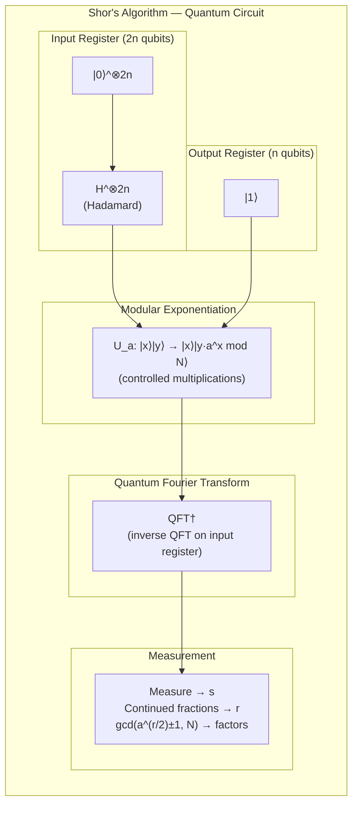
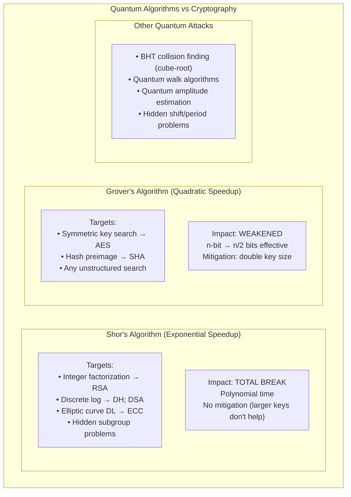

# Shor's & Grover's Algorithms — The Quantum Threat to Modern Cryptography

**Topic:** Quantum algorithms threatening classical cryptography; Shor's algorithm; Grover's algorithm; computational complexity  
**Key Papers:** Shor (1994); Grover (1996); NIST SP 800-131A Rev2  
**Domain:** Quantum computing; cryptanalysis; complexity theory  
**Audience:** Cryptographers, security architects, quantum computing researchers, CSOs planning migration  
**Prerequisites:** Number theory (modular arithmetic; prime factorization); basic quantum mechanics (qubits; superposition; entanglement); computational complexity (P, NP, BQP)

---

## Chapter 1 — Historical Context & Origin Story

### 1.1 Timeline

| Year | Milestone |
|------|-----------|
| 1976 | Diffie-Hellman key exchange (security: discrete log problem) |
| 1977 | RSA published (security: integer factorization) |
| 1982 | Feynman: quantum systems cannot be efficiently simulated classically |
| 1985 | Deutsch: universal quantum computer concept |
| 1992 | Deutsch-Jozsa algorithm (exponential quantum speedup for specific problem) |
| 1993 | Simon's algorithm (exponential speedup; period-finding precursor) |
| **1994** | **Peter Shor publishes quantum factoring algorithm** — polynomial time for factoring + discrete log |
| **1996** | **Lov Grover publishes quantum search algorithm** — quadratic speedup for unstructured search |
| 1996 | Bennett et al.: optimality of Grover's algorithm (cannot do better for unstructured search) |
| 2001 | IBM demonstrates Shor's algorithm: factors 15 = 3 × 5 on 7-qubit computer |
| 2012 | Factor 21 = 3 × 7 using photonic quantum computer |
| 2019 | Google "quantum supremacy" — 53 qubits (random circuit; not cryptographic) |
| 2022 | Estimated: need ~4,000 logical qubits (millions physical) to break RSA-2048 |
| 2023 | IBM 1,121 physical qubits; still far from cryptographic relevance |
| 2024 | Research: error correction advances; path to logical qubits shortening |

### 1.2 Computational Complexity Context

| Class | Description | Example |
|:-----:|-------------|:-------:|
| **P** | Solvable in polynomial time (classical) | Sorting; matrix multiplication |
| **NP** | Verifiable in polynomial time; may not be solvable efficiently | SAT; graph coloring |
| **BPP** | Solvable with bounded error probability (classical randomized) | Primality testing |
| **BQP** | Solvable by quantum computer in polynomial time | Factoring (Shor); quantum simulation |
| **QMA** | Quantum analog of NP | Local Hamiltonian problem |

**Key relationship:** Factoring is in BQP (polynomial for quantum) but believed NOT in P (exponential for classical). This gap is what makes Shor's algorithm devastating for cryptography.

---

## Chapter 2 — Shor's Algorithm: Architecture & Mechanics

### 2.1 Problem Statement

**Integer Factorization:** Given $N = p \times q$ (product of two large primes), find $p$ and $q$.

- RSA-2048: $N$ is 2048 bits (617 decimal digits)
- Best classical: General Number Field Sieve: $O(e^{1.9 (\ln N)^{1/3} (\ln \ln N)^{2/3}})$ — sub-exponential but intractable for large $N$
- **Shor's quantum:** $O((\log N)^2 (\log \log N) (\log \log \log N))$ — polynomial!

### 2.2 Algorithm Overview

Shor's algorithm reduces factoring to **order-finding** (period-finding), which a quantum computer solves efficiently using the **Quantum Fourier Transform (QFT)**.

| Step | Classical/Quantum | Description |
|:----:|:-:|-------------|
| 1 | Classical | Choose random $a$ where $1 < a < N$ and $\gcd(a, N) = 1$ |
| 2 | **Quantum** | Find ORDER $r$ such that $a^r \equiv 1 \pmod{N}$ (period of $f(x) = a^x \mod N$) |
| 3 | Classical | If $r$ is even: compute $\gcd(a^{r/2} - 1, N)$ and $\gcd(a^{r/2} + 1, N)$ |
| 4 | Classical | These GCDs give factors of $N$ (with high probability) |

### 2.3 Quantum Period-Finding (The Hard Part)

```mermaid
graph LR
    subgraph "Quantum Circuit for Period-Finding"
        H[Hadamard Gates<br/>Create superposition<br/>|0⟩ → (|0⟩+|1⟩)/√2] --> MOD[Modular Exponentiation<br/>Compute a^x mod N<br/>in superposition]
        MOD --> QFT[Quantum Fourier Transform<br/>Extract period information<br/>from phase]
        QFT --> MEAS[Measurement<br/>Get s/r approximation<br/>Continued fractions → r]
    end
```

| Component | Purpose | Complexity |
|:---------:|---------|:----------:|
| **Hadamard gates** | Put input register in superposition of all $x$ values (0 to $2^n - 1$) | $O(n)$ gates |
| **Modular exponentiation** | Compute $a^x \mod N$ for all $x$ simultaneously (quantum parallelism) | $O(n^2 \log n)$ gates |
| **Quantum Fourier Transform** | Converts periodic structure into measurable frequency (period $r$) | $O(n^2)$ gates |
| **Measurement + classical post** | Extract $r$ from measurement via continued fraction expansion | Classical polynomial |

### 2.4 Why It Breaks RSA

| Classical Approach | Time | Feasibility |
|:--:|:--:|:--:|
| Trial division | $O(\sqrt{N})$ | Impossible for 2048-bit $N$ |
| General Number Field Sieve | $O(e^{1.9 n^{1/3}})$ where $n = \log N$ | Infeasible for RSA-2048 (est. $2^{112}$ operations) |
| **Shor's quantum** | $O(n^2 \log n \log \log n)$ where $n = \log N$ | **Polynomial! ~4,000 logical qubits** |

### 2.5 What Shor's Breaks

| Algorithm | Hard Problem | Shor's Attack |
|:---------:|:---:|:---:|
| **RSA** | Integer factorization | Factor $N = pq$ → recover private key |
| **Diffie-Hellman** | Discrete logarithm (mod $p$) | Find $x$ in $g^x \equiv h \pmod{p}$ |
| **ECDSA/ECDH** | Elliptic curve discrete log | Find $k$ in $Q = kP$ on elliptic curve |
| **DSA** | Discrete log (subgroup) | Same as DH |
| **ElGamal** | Discrete log | Find private key from public |

### 2.6 Resource Estimates for Cryptographically Relevant Quantum Computer

| Target | Logical Qubits | Physical Qubits (est.) | T-gates | Time (est.) |
|:------:|:---:|:---:|:---:|:---:|
| RSA-2048 | ~4,000 | 4-20 million | $10^{12}$ | Hours to days |
| RSA-4096 | ~8,000 | 10-40 million | $10^{13}$ | Days |
| ECC P-256 | ~2,330 | 2-10 million | $10^{11}$ | Hours |
| ECC P-384 | ~3,500 | 5-15 million | $10^{12}$ | Hours |

**Current state (2024):** IBM has 1,121 physical qubits; error rates ~0.1-1%. Need millions of physical qubits with much lower error rates. Gap: 3-4 orders of magnitude in qubit count + significant error correction overhead.

---

## Chapter 3 — Grover's Algorithm: Quantum Search

### 3.1 Problem Statement

**Unstructured Search:** Given a function $f: \{0,1\}^n \rightarrow \{0,1\}$ with exactly one input $x_0$ where $f(x_0) = 1$, find $x_0$.

- Classical: must check ~$N/2$ inputs on average ($N = 2^n$) → $O(N)$
- **Grover's quantum:** $O(\sqrt{N})$ — quadratic speedup

### 3.2 Algorithm Mechanics

| Step | Description |
|:----:|-------------|
| 1 | Initialize $n$ qubits to uniform superposition: $\|s\rangle = \frac{1}{\sqrt{N}} \sum_{x=0}^{N-1} \|x\rangle$ |
| 2 | **Repeat** $\approx \frac{\pi}{4}\sqrt{N}$ times: |
| 2a | Apply **Oracle** $O$: flip sign of target state: $\|x_0\rangle \rightarrow -\|x_0\rangle$ |
| 2b | Apply **Diffusion** operator: reflect about mean amplitude (amplify target; suppress others) |
| 3 | Measure → get $x_0$ with high probability |

### 3.3 Geometric Interpretation

The algorithm rotates the state vector in a 2D plane (target vs. non-target) by angle $2\theta$ per iteration, where $\sin\theta = 1/\sqrt{N}$. After $\sim \frac{\pi}{4}\sqrt{N}$ rotations, state aligns with target.

### 3.4 Impact on Symmetric Cryptography

| Algorithm | Classical Security | Post-Grover Security | Mitigation |
|:---------:|:---:|:---:|:---:|
| **AES-128** | 128 bits | ~64 bits ⚠️ | Use AES-256 |
| **AES-192** | 192 bits | ~96 bits | Use AES-256 |
| **AES-256** | 256 bits | ~128 bits ✓ | Already quantum-safe |
| **SHA-256 (preimage)** | 256 bits | ~128 bits ✓ | Already adequate |
| **SHA-256 (collision)** | 128 bits | ~85 bits (BHT) | Use SHA-384/512 |
| **SHA-512** | 256 bits (collision) | ~170 bits ✓ | Already quantum-safe |
| **3DES (112-bit)** | 112 bits | ~56 bits ⚠️ | Deprecated anyway |
| **ChaCha20 (256-bit)** | 256 bits | ~128 bits ✓ | Already quantum-safe |

**Key insight:** For symmetric cryptography, simply DOUBLING the key size provides quantum resistance. No new algorithm needed — just AES-256 instead of AES-128.

### 3.5 Impact on Hash Functions (Collision Finding)

For collision finding, the BHT (Brassard-Høyer-Tapp) algorithm gives:
- Classical birthday attack: $O(2^{n/2})$
- Quantum BHT: $O(2^{n/3})$

| Hash | Classical Collision | Quantum Collision | Status |
|:----:|:---:|:---:|:---:|
| SHA-256 | $2^{128}$ | $\sim 2^{85}$ | Marginal (still very hard) |
| SHA-384 | $2^{192}$ | $\sim 2^{128}$ | Quantum-safe ✓ |
| SHA-512 | $2^{256}$ | $\sim 2^{170}$ | Quantum-safe ✓ |
| SHA3-256 | $2^{128}$ | $\sim 2^{85}$ | Marginal |
| SHA3-384 | $2^{192}$ | $\sim 2^{128}$ | Quantum-safe ✓ |

### 3.6 Limitations of Grover's Algorithm

| Limitation | Detail |
|:----------:|--------|
| **Optimality** | Proven optimal for unstructured search (cannot do better than $O(\sqrt{N})$) |
| **Structured problems** | Many crypto algorithms have structure; Grover applies to brute-force but not structure-exploiting attacks |
| **Parallelization** | Grover's speedup does NOT parallelize well across multiple quantum processors (unlike classical brute-force which parallelizes linearly) |
| **Oracle cost** | Each Grover iteration requires implementing the function as a quantum circuit (expensive for complex functions like AES) |
| **Error correction** | Real quantum computers have errors; each iteration accumulates errors |

---

## Chapter 4 — Combined Threat Analysis

### 4.1 Algorithm-by-Algorithm Impact Assessment

| Cryptographic Algorithm | Shor Impact | Grover Impact | Overall Status | Mitigation |
|:-:|:---:|:---:|:---:|:---:|
| **RSA-2048** | BROKEN (poly-time) | N/A | ✗ BROKEN | Replace with ML-KEM/ML-DSA |
| **RSA-4096** | BROKEN (poly-time) | N/A | ✗ BROKEN | Replace (larger key doesn't help vs Shor) |
| **ECDSA P-256** | BROKEN (discrete log) | N/A | ✗ BROKEN | Replace with ML-DSA |
| **ECDH X25519** | BROKEN (discrete log) | N/A | ✗ BROKEN | Replace with ML-KEM |
| **Ed25519** | BROKEN (discrete log) | N/A | ✗ BROKEN | Replace with ML-DSA |
| **DH-2048** | BROKEN (discrete log) | N/A | ✗ BROKEN | Replace with ML-KEM |
| **AES-128** | N/A | Weakened to ~64 bits | ⚠️ WEAKENED | Use AES-256 |
| **AES-256** | N/A | Weakened to ~128 bits | ✓ SAFE | No change needed |
| **SHA-256** | N/A | Collision ~85 bits | ⚠️ MARGINAL | Use SHA-384+ for long-term |
| **SHA-384/512** | N/A | Still >128 bits | ✓ SAFE | No change needed |
| **HMAC-SHA-256** | N/A | Key recovery ~128 bits | ✓ SAFE | No change needed |

### 4.2 "Harvest Now, Decrypt Later" Risk Assessment



### 4.3 HNDL Priority Matrix

| Data Type | Required Confidentiality Duration | HNDL Risk | Action |
|:---------:|:---:|:---:|:---:|
| Top Secret government | 75+ years | CRITICAL | Migrate immediately |
| Secret government | 25+ years | HIGH | Migrate by 2025 |
| Health records | Lifetime (~50+ years) | HIGH | Migrate by 2026 |
| Financial records | 7-30 years | MEDIUM-HIGH | Migrate by 2027 |
| Trade secrets | Variable (could be decades) | HIGH | Migrate by 2025 |
| Session keys (ephemeral) | Minutes-hours | LOW | Hybrid for defense-in-depth |
| Email (personal) | 5-20 years | MEDIUM | Migrate by 2028 |
| IoT telemetry | Days-months | LOW | Schedule for 2028+ |

---

## Chapter 5 — Quantum Resource Estimation

### 5.1 Qubit Requirements for Attacking Cryptographic Primitives

| Target | Algorithm | Logical Qubits | T-gate Count | Circuit Depth | Estimated Time |
|:------:|:---------:|:---:|:---:|:---:|:---:|
| RSA-2048 | Shor (optimized) | 4,098 | ~$10^{12}$ | ~$10^{10}$ | 8 hours (optimistic) |
| RSA-3072 | Shor | ~6,000 | ~$10^{13}$ | ~$10^{11}$ | Days |
| ECC P-256 | Shor (ECDLP) | 2,330 | ~$10^{11}$ | ~$10^9$ | Hours |
| ECC P-384 | Shor (ECDLP) | 3,484 | ~$10^{12}$ | ~$10^{10}$ | Hours-days |
| AES-128 (Grover) | Grover | 2,953 | ~$10^{40}$ | ~$10^{38}$ | **Centuries** |
| AES-256 (Grover) | Grover | 6,681 | ~$10^{77}$ | ~$10^{75}$ | **Heat death of universe** |

**Critical insight:** Grover on AES-256 is THEORETICALLY possible but PRACTICALLY infeasible — the circuit depth makes it unrealistic even with a perfect quantum computer. The quadratic speedup is important conceptually but AES-256 remains practically safe even post-quantum.

### 5.2 Current vs. Required Quantum Hardware

| Metric | Current (2024) | Required for RSA-2048 | Gap Factor |
|:------:|:---:|:---:|:---:|
| Physical qubits | ~1,121 (IBM Condor) | 4-20 million | 4,000-18,000× |
| Gate fidelity (2-qubit) | ~99.5% | >99.99% | ~10× better |
| Coherence time | ~100 μs (superconducting) | Hours | ~10,000× |
| Logical qubits (error-corrected) | 0-5 (experimental) | 4,098 | ~1,000× |
| T-gate rate | ~$10^3$/sec | ~$10^9$/sec | ~1,000,000× |

---

## Chapter 6 — Comparison: Quantum vs. Classical Attacks

| Attack | Type | Best Classical | Best Quantum | Speedup Factor |
|:------:|:----:|:---:|:---:|:---:|
| Factor 2048-bit integer | Shor vs GNFS | $2^{112}$ operations | ~$4 \times 10^9$ operations (polynomial) | Exponential |
| ECDLP on P-256 | Shor vs Pollard's rho | $2^{128}$ operations | ~$10^8$ operations (polynomial) | Exponential |
| Brute-force AES-128 | Grover vs exhaustive | $2^{128}$ | $2^{64}$ | Quadratic |
| Brute-force AES-256 | Grover vs exhaustive | $2^{256}$ | $2^{128}$ | Quadratic |
| SHA-256 collision | BHT vs birthday | $2^{128}$ | $2^{85}$ | Cube-root |
| SHA-256 preimage | Grover vs exhaustive | $2^{256}$ | $2^{128}$ | Quadratic |

---

## Chapter 7 — Architecture Diagrams

### 7.1 Shor's Algorithm Circuit



### 7.2 Grover's Algorithm Iterations

```mermaid
graph TD
    subgraph "Grover's Algorithm"
        INIT[Initialize: H^⊗n |0⟩^⊗n<br/>= uniform superposition |s⟩] --> LOOP
        
        subgraph LOOP["Repeat π/4 · √N times"]
            ORACLE[Oracle O_f:<br/>flip phase of target |x₀⟩<br/>|x₀⟩ → -|x₀⟩] --> DIFF[Diffusion D:<br/>reflect about mean<br/>2|s⟩⟨s| - I<br/>amplifies target amplitude]
            DIFF --> CHECK{More<br/>iterations?}
            CHECK -->|Yes| ORACLE
        end
        
        CHECK -->|No| MEASURE[Measure<br/>→ x₀ with probability ≥ 1/2]
    end
```

### 7.3 Quantum Threat Landscape



---

## Chapter 8 — Practical Implications & Timeline Analysis

### 8.1 When Will Shor's Algorithm Be Practical?

| Factor | Optimistic Estimate | Pessimistic Estimate | Most Likely |
|:------:|:---:|:---:|:---:|
| **CRQC arrival** | 2030 | 2050+ | 2035-2040 |
| **Based on** | Rapid error correction advances; new qubit technologies (topological) | Current decoherence problems persist; scaling proves harder than expected | Steady progress; breakthroughs in error correction by late 2020s |
| **Implication** | Data encrypted today may be at risk within 6-16 years | Long-term data still has margin | Migrate high-value data NOW; complete migration by 2030 |

### 8.2 Mosca's Theorem (Migration Urgency)

If:
- $x$ = shelf life of data (years it needs to remain secret)
- $y$ = time to migrate systems to PQC
- $z$ = time until CRQC exists

Then: **If $x + y > z$, you must START migration NOW.**

| Scenario | $x$ (shelf life) | $y$ (migration time) | $x + y$ | If $z = 15$ years | Urgency |
|:--------:|:---:|:---:|:---:|:---:|:---:|
| Government secrets | 50 years | 5 years | 55 | 55 > 15 → OVERDUE | CRITICAL |
| Healthcare records | 30 years | 3 years | 33 | 33 > 15 → OVERDUE | HIGH |
| Financial systems | 7 years | 5 years | 12 | 12 < 15 → OK (barely) | MEDIUM |
| E-commerce session | 1 hour | 2 years | ~2 | 2 < 15 → OK | LOW (but do it for HNDL) |

---

## Chapter 9 — Case Studies

### 9.1 IBM Quantum Factoring Experiments

| Year | Team | Number Factored | Qubits Used | Method |
|:----:|:----:|:---:|:---:|:---:|
| 2001 | IBM | 15 = 3 × 5 | 7 (NMR) | Full Shor's |
| 2012 | U. Bristol | 21 = 3 × 7 | Photonic | Compiled Shor's |
| 2014 | Various | 56,153 | 4 (optimization) | Compiled/hybrid |
| 2019 | IBM | 35 = 5 × 7 | 4 (variational) | VQE-based (not true Shor's) |
| 2023 | Various claims | Small numbers | <20 qubits | Various approaches |

**Gap analysis:** Largest number factored using "true" Shor's: 21 (2012). RSA-2048 is a 617-digit number. The gap between demonstration and cryptographic relevance remains enormous — but this does NOT mean we can wait (HNDL threat; migration takes years).

### 9.2 Google Quantum Supremacy (2019)

| Aspect | Detail |
|--------|--------|
| **Claim** | Sycamore (53 qubits) performed random circuit sampling in 200 seconds; estimated 10,000 years classically |
| **Significance** | First demonstration that quantum computer outperforms classical for SOME task |
| **Cryptographic relevance** | NONE — random circuit sampling has no cryptographic application |
| **IBM response** | Argued classical could do it in 2.5 days (not 10,000 years) with enough storage |
| **Key takeaway** | Quantum computers are real and advancing; but current devices are NISQ (Noisy Intermediate-Scale Quantum) — far from CRQC |

---

## Chapter 10 — Future Evolution

| Trend | Description | Timeline |
|:-----:|-------------|:--------:|
| **Error correction advances** | Surface codes; color codes; topological qubits; lower overhead | 2025-2030 |
| **Logical qubit milestones** | First fault-tolerant logical qubits operating below threshold | 2025-2027 |
| **1 million physical qubits** | Required scale for CRQC | 2030-2040 |
| **Alternative quantum approaches** | Photonic; trapped ion; neutral atom; topological (Microsoft) | 2025-2035 |
| **Quantum advantage for optimization** | Before CRQC: quantum useful for simulation/optimization (not crypto-breaking) | 2025-2030 |
| **NIST additional PQC** | Continued standardization; additional algorithms | 2025-2030 |
| **Quantum-resistant blockchain** | Migration of Bitcoin/Ethereum signature schemes | 2025-2030 |
| **New quantum attacks** | Potential new algorithms (beyond Shor/Grover) targeting specific crypto | Ongoing research |

---

## Chapter 11 — Interview Questions & Career Guide

### Tier 1: Entry-Level

**Q1:** What is the fundamental difference between Shor's and Grover's algorithms in terms of cryptographic impact?

**A:** Shor's algorithm provides an **exponential** speedup for structured problems (factoring; discrete log) — it COMPLETELY BREAKS asymmetric cryptography (RSA, ECC, DH) in polynomial time. No amount of key size increase helps. Grover's algorithm provides only a **quadratic** speedup for unstructured search — it WEAKENS symmetric cryptography (AES; SHA) by halving the effective security level. The mitigation for Grover is simple: double the key size (AES-256 instead of AES-128). There is no mitigation for Shor within classical cryptography — entirely new mathematical foundations are needed (lattice; hash-based; code-based).

### Tier 2: Mid-Level

**Q2:** Explain why increasing RSA key size does NOT provide quantum resistance, while increasing AES key size does.

**A:** RSA security relies on the computational HARDNESS of integer factorization. Classically, larger keys make factoring exponentially harder (doubling key bits → exponentially more work). But Shor's algorithm solves factoring in TIME POLYNOMIAL in key length: $O(n^2 \log n)$ where $n$ = key bits. Doubling key size from 2048 to 4096 merely doubles Shor's runtime — still polynomial, still feasible.

AES security relies on brute-force search through the key space ($2^n$ possibilities). Grover's provides only quadratic speedup: $\sqrt{2^n} = 2^{n/2}$. For AES-256, Grover reduces security to $2^{128}$ — still computationally infeasible. Furthermore, Grover requires $O(\sqrt{N})$ sequential quantum operations which cannot be parallelized effectively, making even the theoretical attack on AES-256 practically impossible.

### Tier 3: Senior

**Q3:** You're estimating when your organization must begin PQC migration. Apply Mosca's theorem to your PKI infrastructure (5-year cert lifetimes; 3-year migration estimate; protecting data with 20-year confidentiality requirements).

**A:**
- $x$ = 20 years (data confidentiality requirement)
- $y$ = 3 years (migration time for PKI: inventory → test → pilot → rollout → decommission legacy)
- $x + y$ = 23 years
- If CRQC expected by 2035 (11 years from 2024): $z = 11$
- $x + y = 23 > 11 = z$ → **ALREADY OVERDUE**
- Even with optimistic $z = 20$ (CRQC by 2044): $23 > 20$ → still must start NOW

**PKI-specific considerations:**
- Certificate lifetimes: 5-year root CAs → current root cert (issued 2024) valid until 2029; if CRQC arrives by 2035, signatures on certs issued under classical PKI can be forged; relying parties trusting those certs are at risk
- Long-lived signatures: Code signing; document signing; legal signatures — must verify for decades; need PQC or hash-based signatures NOW for long-lived signing
- Hybrid certificates: Deploy dual-algorithm certs during transition (classical + PQC); compliant with both current and future verification requirements
- HSM migration: Hardware Security Modules must support PQC algorithms; current HSMs may need firmware updates or replacement; 18-24 month procurement cycle

---

## Chapter 12 — Cheat Sheet & Quick Reference

```
═══════════════════════════════════════════
SHOR'S & GROVER'S — QUICK REFERENCE
═══════════════════════════════════════════

SHOR'S ALGORITHM (1994):
  What: Factors integers; solves discrete log
  Speedup: EXPONENTIAL (polynomial time)
  Breaks: RSA, DH, ECDH, ECDSA, DSA, EdDSA
  Mitigation: NONE (must replace algorithms entirely)
  → Use: ML-KEM; ML-DSA; SLH-DSA

═══════════════════════════════════════════
GROVER'S ALGORITHM (1996):
  What: Searches unstructured space
  Speedup: QUADRATIC (√N instead of N)
  Weakens: AES-128 → 64-bit; SHA-256 collision → 85-bit
  Mitigation: DOUBLE key size
  → Use: AES-256 (quantum-safe); SHA-384/512

═══════════════════════════════════════════
IMPACT TABLE:
  RSA-2048      → BROKEN (Shor) → use ML-KEM
  ECDSA P-256   → BROKEN (Shor) → use ML-DSA
  AES-128       → WEAKENED (Grover) → use AES-256
  AES-256       → SAFE ✓ (128-bit post-quantum)
  SHA-384       → SAFE ✓ (128-bit post-quantum collision)
  SHA-512       → SAFE ✓

═══════════════════════════════════════════
RESOURCE REQUIREMENTS (RSA-2048):
  Logical qubits needed: ~4,098
  Physical qubits needed: 4-20 million
  Current max (2024): 1,121 physical (IBM Condor)
  Gap: ~4,000-18,000×
  
  Estimated CRQC: 2030-2040 (uncertain)

═══════════════════════════════════════════
MOSCA'S THEOREM:
  x = data lifetime (years needing secrecy)
  y = migration time (years to deploy PQC)
  z = years until CRQC
  
  IF x + y > z → START MIGRATION NOW
  
  Example: 20yr data + 3yr migration = 23
  If CRQC in 15 years: 23 > 15 → OVERDUE

═══════════════════════════════════════════
HNDL PRIORITY:
  CRITICAL: Government secrets; military; intelligence
  HIGH: Healthcare; legal; trade secrets; long-lived PKI
  MEDIUM: Financial (7yr); personal records
  LOW: Ephemeral sessions; IoT telemetry
  
  ★ HNDL is happening NOW — adversaries collecting
    encrypted data today for future quantum decryption

═══════════════════════════════════════════
KEY INSIGHT:
  Shor's: larger key = barely slower (polynomial)
  Grover's: larger key = exponentially harder (quadratic)
  
  RSA-4096 does NOT save you from quantum
  AES-256 DOES save you from quantum
```

---

*End of Document — 01_Shor_Grover_Quantum_Threat.md*
