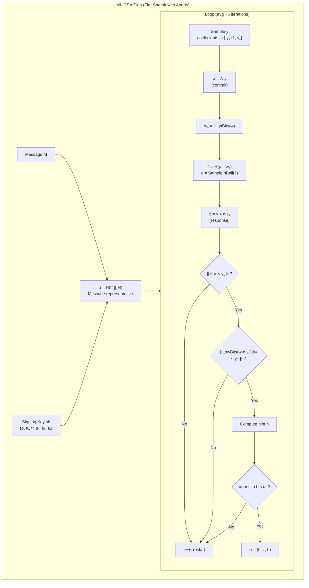
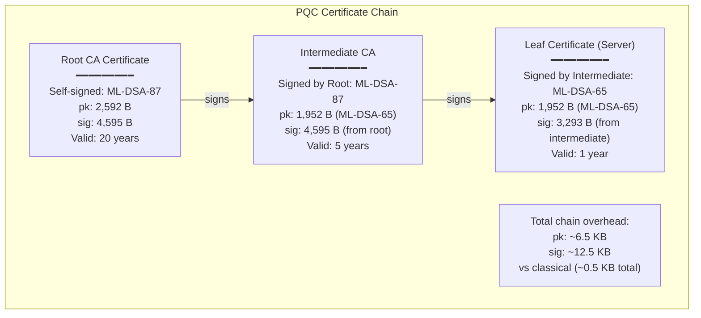

# NIST FIPS 204 — ML-DSA (Module-Lattice Digital Signature Algorithm)

**Standard:** FIPS 204 (August 13, 2024)  
**Title:** Module-Lattice-Based Digital Signature Standard  
**Based on:** CRYSTALS-Dilithium (NIST PQC signature winner)  
**SDO:** National Institute of Standards and Technology (NIST)  
**Domain:** Post-quantum digital signatures; code signing; certificate authentication  
**Audience:** Cryptographic engineers, PKI architects, firmware signing teams, protocol designers  
**Prerequisites:** Linear algebra; polynomial rings; lattice problems (SIS/LWE); digital signature concepts (EUF-CMA)

---

## Chapter 1 — Historical Context & Origin Story

### 1.1 Timeline

| Year | Milestone |
|------|-----------|
| 1996 | Ajtai: lattice-based one-way functions (theoretical foundation) |
| 2008 | Lyubashevsky: "Fiat-Shamir with Aborts" — practical lattice signature framework |
| 2012 | Module-SIS/Module-LWE problems formalized |
| 2016 | NIST PQC Competition Call for Proposals |
| 2017 | CRYSTALS-Dilithium submitted (team: Ducas, Kiltz, Lepoint, Lyubashevsky, Schwabe, Seiler, Stehlé) |
| 2019 | Dilithium advances to Round 2 |
| 2020 | Dilithium advances to Round 3 (finalist) |
| 2022 | **NIST selects Dilithium** as primary digital signature standard |
| 2023 | FIPS 204 draft (name changed: Dilithium → ML-DSA) |
| **2024** | **FIPS 204 published** (August 13, 2024) — ML-DSA official |
| 2024 | Integration into X.509; CMS; TLS certificate verification |

### 1.2 Design Philosophy

| Principle | Implementation |
|:---------:|----------------|
| **Conservative security** | Based on Module-LWE + Module-SIS (structured but well-studied lattice problems) |
| **Implementation safety** | Designed for constant-time implementation; rejection sampling avoids secret-dependent branching |
| **Balanced parameters** | Good trade-off between key size, signature size, and speed |
| **Minimal assumptions** | Security relies only on hardness of MLWE/MSIS in module lattices |

---

## Chapter 2 — Mathematical Foundation

### 2.1 Underlying Hard Problems

**Module Short Integer Solution (MSIS):**
Given $\mathbf{A} \in R_q^{k \times l}$, find short vector $\mathbf{z} \in R^l$ such that $\mathbf{A} \cdot \mathbf{z} = \mathbf{0} \pmod{q}$ with $\|\mathbf{z}\| \leq \beta$.

**Module Learning With Errors (MLWE):**
Given $(\mathbf{A}, \mathbf{t} = \mathbf{A} \cdot \mathbf{s} + \mathbf{e})$ where $\mathbf{s}, \mathbf{e}$ have small coefficients, find $\mathbf{s}$ or distinguish from random.

### 2.2 Ring and Module Structure

| Parameter | Value | Description |
|:---------:|:-----:|-------------|
| $R$ | $\mathbb{Z}[x]/(x^{256}+1)$ | Polynomial ring |
| $R_q$ | $\mathbb{Z}_q[x]/(x^{256}+1)$ | Ring modulo $q$ |
| $q$ | 8,380,417 | Modulus ($q \equiv 1 \pmod{512}$; NTT-friendly) |
| $n$ | 256 | Polynomial degree |
| Module rank $(k, l)$ | (4,4), (6,5), (8,7) | Determines security level |

### 2.3 Signature Scheme Structure (Fiat-Shamir with Aborts)

The scheme follows the **Fiat-Shamir with Aborts** paradigm:
1. **Commit:** Generate random masking vector $\mathbf{y}$; compute commitment $\mathbf{w} = \mathbf{A} \cdot \mathbf{y}$
2. **Challenge:** Hash commitment + message → challenge $c$ (short polynomial)
3. **Response:** Compute $\mathbf{z} = \mathbf{y} + c \cdot \mathbf{s}$
4. **Abort check:** If $\mathbf{z}$ is too large (leaks info about $\mathbf{s}$) → REJECT and restart

The "abort" mechanism ensures the signature distribution is independent of the secret key (avoids information leakage through rejection sampling).

---

## Chapter 3 — Algorithm Specification

### 3.1 Operations

| Operation | Input | Output |
|:---------:|-------|--------|
| **KeyGen** | — | $(pk, sk)$ — public key + signing key |
| **Sign** | Signing key $sk$, message $M$ | Signature $\sigma$ |
| **Verify** | Public key $pk$, message $M$, signature $\sigma$ | Accept/Reject |

### 3.2 Key Generation (ML-DSA.KeyGen)

| Step | Operation |
|:----:|-----------|
| 1 | Generate random seed $\xi \leftarrow \{0,1\}^{256}$ |
| 2 | $(\rho, \rho', K) = H(\xi)$ — expand seed into three components |
| 3 | Generate $\hat{\mathbf{A}} \in R_q^{k \times l}$ from $\rho$ (public matrix; NTT domain) |
| 4 | Sample secret vectors $\mathbf{s}_1 \in R^l$ and $\mathbf{s}_2 \in R^k$ with coefficients in $[-\eta, \eta]$ |
| 5 | Compute $\mathbf{t} = \mathbf{A} \cdot \mathbf{s}_1 + \mathbf{s}_2$ |
| 6 | Split $\mathbf{t}$ into high bits $\mathbf{t}_1$ and low bits $\mathbf{t}_0$: $\mathbf{t} = \mathbf{t}_1 \cdot 2^d + \mathbf{t}_0$ |
| 7 | $pk = (\rho, \mathbf{t}_1)$ — public key |
| 8 | $sk = (\rho, K, tr, \mathbf{s}_1, \mathbf{s}_2, \mathbf{t}_0)$ where $tr = H(pk)$ |

### 3.3 Signing (ML-DSA.Sign)

| Step | Operation |
|:----:|-----------|
| 1 | Compute $\mu = H(tr \| M)$ — message representative |
| 2 | Initialize counter $\kappa = 0$ |
| 3 | **Loop** (rejection sampling): |
| 3a | Sample masking vector $\mathbf{y}$ with coefficients in $[-\gamma_1+1, \gamma_1]$ using $\rho'$ and $\kappa$ |
| 3b | Compute $\mathbf{w} = \mathbf{A} \cdot \mathbf{y}$ |
| 3c | Compute high bits $\mathbf{w}_1 = \text{HighBits}(\mathbf{w})$ |
| 3d | Compute challenge: $\tilde{c} = H(\mu \| \mathbf{w}_1)$; $c = \text{SampleInBall}(\tilde{c})$ (sparse polynomial; $\tau$ non-zero coefficients ∈ {-1,+1}) |
| 3e | Compute response: $\mathbf{z} = \mathbf{y} + c \cdot \mathbf{s}_1$ |
| 3f | Compute hint check: $\mathbf{r}_0 = \text{LowBits}(\mathbf{w} - c \cdot \mathbf{s}_2)$ |
| 3g | **Rejection test 1:** If $\|\mathbf{z}\|_\infty \geq \gamma_1 - \beta$ → increment $\kappa$; RESTART |
| 3h | **Rejection test 2:** If $\|\mathbf{r}_0\|_\infty \geq \gamma_2 - \beta$ → RESTART |
| 3i | Compute hint $\mathbf{h}$ (encodes difference in high bits) |
| 3j | **Rejection test 3:** If number of 1s in $\mathbf{h} > \omega$ → RESTART |
| 4 | Output $\sigma = (\tilde{c}, \mathbf{z}, \mathbf{h})$ |

**Expected repetitions:** ~4-7 iterations on average before accepting (constant-time implementations pad to fixed number of iterations).

### 3.4 Verification (ML-DSA.Verify)

| Step | Operation |
|:----:|-----------|
| 1 | Compute $\mu = H(tr \| M)$ where $tr = H(pk)$ |
| 2 | Recover challenge polynomial $c$ from $\tilde{c}$ |
| 3 | Compute $\mathbf{w}' = \mathbf{A} \cdot \mathbf{z} - c \cdot \mathbf{t}_1 \cdot 2^d$ |
| 4 | Use hint $\mathbf{h}$ to recover $\mathbf{w}_1'$ from $\mathbf{w}'$ |
| 5 | Recompute $\tilde{c}' = H(\mu \| \mathbf{w}_1')$ |
| 6 | **Accept** if: $\tilde{c}' = \tilde{c}$ AND $\|\mathbf{z}\|_\infty < \gamma_1 - \beta$ |

---

## Chapter 4 — Parameter Sets

### 4.1 ML-DSA Parameters

| Parameter | ML-DSA-44 | ML-DSA-65 | ML-DSA-87 |
|:---------:|:---:|:---:|:---:|
| NIST Security Level | 2 (~AES-128/SHA-256) | 3 (~AES-192) | 5 (~AES-256) |
| $(k, l)$ | (4, 4) | (6, 5) | (8, 7) |
| $q$ | 8,380,417 | 8,380,417 | 8,380,417 |
| $\eta$ | 2 | 4 | 2 |
| $\gamma_1$ | $2^{17}$ | $2^{19}$ | $2^{19}$ |
| $\gamma_2$ | $(q-1)/88$ | $(q-1)/32$ | $(q-1)/32$ |
| $\tau$ | 39 | 49 | 60 |
| $\omega$ | 80 | 55 | 75 |
| $d$ | 13 | 13 | 13 |
| **Public key** | **1,312 bytes** | **1,952 bytes** | **2,592 bytes** |
| **Signing key** | **2,560 bytes** | **4,032 bytes** | **4,896 bytes** |
| **Signature** | **2,420 bytes** | **3,293 bytes** | **4,595 bytes** |

### 4.2 Comparison with Classical Signature Algorithms

| Algorithm | Public Key | Signature | Security | Signing Speed | Verification Speed |
|:---------:|:---:|:---:|:---:|:---:|:---:|
| Ed25519 | 32 B | 64 B | ~128-bit classical | ~68 μs | ~25 μs |
| ECDSA P-256 | 64 B | 64 B | ~128-bit classical | ~100 μs | ~100 μs |
| RSA-2048 | 256 B | 256 B | ~112-bit classical | ~2 ms | ~50 μs |
| **ML-DSA-44** | **1,312 B** | **2,420 B** | Level 2 (PQ) | ~150 μs | ~50 μs |
| **ML-DSA-65** | **1,952 B** | **3,293 B** | Level 3 (PQ) | ~250 μs | ~80 μs |
| **ML-DSA-87** | **2,592 B** | **4,595 B** | Level 5 (PQ) | ~400 μs | ~120 μs |

### 4.3 Performance Characteristics

| Metric | ML-DSA-65 | Ed25519 | Ratio |
|:------:|:---:|:---:|:---:|
| Public key | 1,952 B | 32 B | 61× |
| Signature | 3,293 B | 64 B | 51× |
| KeyGen | ~100 μs | ~30 μs | 3× slower |
| Sign | ~250 μs | ~68 μs | 4× slower |
| Verify | ~80 μs | ~25 μs | 3× slower |
| Combined pk+sig | 5,245 B | 96 B | 55× |

---

## Chapter 5 — Security Analysis

### 5.1 Security Properties

| Property | Description |
|:--------:|-------------|
| **EUF-CMA** | Existential Unforgeability under Chosen Message Attack (standard signature security) |
| **SUF-CMA** | Strong Unforgeability (cannot create new signature for previously signed message) |
| **Deterministic** | Signing is deterministic (given same key + message → same signature); avoids bad RNG issues |
| **Hedged** | Optional: can add randomness for side-channel resistance (hedged mode) |

### 5.2 Known Attack Complexities

| Attack Type | ML-DSA-44 | ML-DSA-65 | ML-DSA-87 |
|:-----------:|:---:|:---:|:---:|
| Forgery (classical; best known) | ~$2^{128}$ | ~$2^{182}$ | ~$2^{252}$ |
| Forgery (quantum; best known) | ~$2^{116}$ | ~$2^{165}$ | ~$2^{229}$ |
| Key recovery (classical) | ~$2^{128}$ | ~$2^{182}$ | ~$2^{252}$ |
| Key recovery (quantum) | ~$2^{116}$ | ~$2^{165}$ | ~$2^{229}$ |

### 5.3 Side-Channel Resilience

| Aspect | Design Choice |
|:------:|---------------|
| **Rejection sampling** | Masks secret key in signing loop; signature distribution independent of sk |
| **Constant-time NTT** | No secret-dependent branches; no variable-time modular reductions |
| **Deterministic signing** | Eliminates nonce-reuse attacks (cf. Sony PS3 ECDSA nonce failure) |
| **Hedged signing** | Optional randomness ($\rho' = H(K \| \text{rnd} \| \mu)$) for additional fault-attack resistance |
| **Masking** | Higher-order masking schemes available for sensitive implementations (smart cards; HSMs) |

---

## Chapter 6 — Implementation Guide

### 6.1 Use Cases

| Use Case | Recommended Parameter Set | Rationale |
|:--------:|:---:|---|
| TLS 1.3 server certificates | ML-DSA-65 | Balance of security and handshake size |
| Code signing (OS updates; firmware) | ML-DSA-87 | Long-lived signatures; highest security |
| Document signing (legal; contracts) | ML-DSA-65 or ML-DSA-87 | Long verification lifetime |
| Email (S/MIME) | ML-DSA-44 | Bandwidth-constrained; embedded in email |
| IoT device attestation | ML-DSA-44 | Constrained resources |
| Root CA certificate | ML-DSA-87 | Maximum security for trust anchor |
| Certificate transparency logs | ML-DSA-44 | High volume; size matters |

### 6.2 X.509 Certificate Integration

| Aspect | Detail |
|:------:|--------|
| **OID** | id-ML-DSA-44: 2.16.840.1.101.3.4.3.17; id-ML-DSA-65: ...3.18; id-ML-DSA-87: ...3.19 |
| **SubjectPublicKeyInfo** | algorithm = ML-DSA OID; subjectPublicKey = ML-DSA public key bytes |
| **Signature** | algorithm = ML-DSA OID; signatureValue = ML-DSA signature bytes |
| **Certificate size impact** | Root cert: ~2.6 KB pk + ~4.6 KB sig = ~7.2 KB for ML-DSA-87 (vs ~0.3 KB for Ed25519) |
| **Chain impact** | 3-cert chain: ~15-20 KB additional overhead (mostly signatures) |

### 6.3 Hybrid Certificates (Transition Period)

| Approach | Description |
|:--------:|-------------|
| **Dual-algorithm cert** | Certificate contains BOTH classical (ECDSA) + PQC (ML-DSA) public keys and signatures |
| **Composite signature** | Single OID for combined (ECDSA + ML-DSA) signature; both must verify |
| **Catalyst approach** | Two separate certificates (one classical; one PQC); server sends both; client uses whichever it supports |
| **Non-composite hybrid** | Certificate signed by classical CA + PQC CA separately (chain stapling) |

### 6.4 Code Example (BouncyCastle — Java)

```java
import org.bouncycastle.pqc.jcajce.provider.BouncyCastlePQCProvider;
import org.bouncycastle.pqc.jcajce.spec.MLDSAParameterSpec;

Security.addProvider(new BouncyCastlePQCProvider());

// Key Generation
KeyPairGenerator kpg = KeyPairGenerator.getInstance("ML-DSA");
kpg.initialize(MLDSAParameterSpec.ml_dsa_65);
KeyPair kp = kpg.generateKeyPair();

// Signing
Signature signer = Signature.getInstance("ML-DSA");
signer.initSign(kp.getPrivate());
signer.update(message);
byte[] signature = signer.sign();

// Verification
Signature verifier = Signature.getInstance("ML-DSA");
verifier.initVerify(kp.getPublic());
verifier.update(message);
boolean valid = verifier.verify(signature);
```

---

## Chapter 7 — Comparison with Other PQC Signatures

| Algorithm | Basis | Public Key | Signature | Sign Speed | Verify Speed | Status |
|:---------:|:-----:|:---:|:---:|:---:|:---:|:---:|
| **ML-DSA-65** | Lattice (MLWE/MSIS) | 1,952 B | 3,293 B | Medium | Fast | **FIPS 204** |
| **SLH-DSA-128f** | Hash-based | 32 B | 17,088 B | Slow | Medium | **FIPS 205** |
| **SLH-DSA-128s** | Hash-based | 32 B | 7,856 B | Very slow | Medium | **FIPS 205** |
| **FN-DSA-512** | Lattice (NTRU) | 897 B | 666 B | Medium | Fast | FIPS 206 (2025) |
| **FN-DSA-1024** | Lattice (NTRU) | 1,793 B | 1,280 B | Medium | Fast | FIPS 206 (2025) |
| XMSS (hash; stateful) | Hash tree | 64 B | 2,500 B | Medium | Fast | NIST SP 800-208 |
| LMS (hash; stateful) | Hash chain | 60 B | 4,652 B | Medium | Fast | NIST SP 800-208 |

### Key Trade-offs

| Need | Best Choice | Rationale |
|:----:|:-----------:|-----------|
| Smallest pk+sig combined | FN-DSA-512 (~1,563 B) | Best for bandwidth-constrained (IoT; embedded) |
| Smallest public key | SLH-DSA (32 B) or XMSS (64 B) | When public key stored long-term; signature transmitted rarely |
| Fastest verification | ML-DSA-65 or FN-DSA | Protocol performance (TLS handshake) |
| Most conservative security | SLH-DSA | Relies only on hash functions; minimal assumptions |
| Stateless + moderate size | ML-DSA-65 | General-purpose default |
| Long-lived signing (code signing CA) | ML-DSA-87 or SLH-DSA | Highest security for decades-valid signatures |

---

## Chapter 8 — Architecture Diagrams

### 8.1 ML-DSA Signing Process



### 8.2 ML-DSA in PKI Chain



---

## Chapter 9 — Case Studies

### 9.1 NIST NCCoE: PQC Migration for Code Signing

| Aspect | Detail |
|--------|--------|
| **Project** | NIST SP 1800-38C: Migration to PQC — Code Signing use case |
| **Challenge** | OS updates, firmware, drivers signed with RSA/ECDSA; signatures must verify for 10+ years |
| **Solution** | Dual-sign with ML-DSA-87 + ECDSA P-384 during transition; pure ML-DSA after transition |
| **Key insight** | Code signing is HIGHEST priority for PQC migration because: (a) signatures are long-lived (years/decades); (b) an attacker with quantum computer could forge a code signing cert and distribute malware that appears legitimate; (c) boot chain verification relies on signature integrity |
| **Approach** | Phase 1: add ML-DSA signature alongside existing ECDSA (dual-sign; larger package). Phase 2: verify ML-DSA preferentially where supported. Phase 3: remove ECDSA after ecosystem transition. |

### 9.2 Certificate Transparency Log Impact

| Aspect | Detail |
|--------|--------|
| **Problem** | CT logs store every issued certificate. With PQC, each cert is ~5-8 KB larger → massive storage increase |
| **Scale** | ~8 billion certificates in CT logs (2024). If all PQC: +40-60 TB of additional storage |
| **Mitigation** | (a) Use ML-DSA-44 for leaf certs (smaller; still Level 2). (b) Compress signatures in CT proofs. (c) Use hash-based references instead of full cert storage. (d) FN-DSA (FIPS 206) will help with smaller signatures when available |
| **Timeline** | CT ecosystem PQC migration planning: 2025-2027 |

---

## Chapter 10 — Future Evolution

| Trend | Description | Timeline |
|:-----:|-------------|:--------:|
| **FIPS 206 (FN-DSA)** | FALCON-based; much smaller signatures (666-1280 B); complementing ML-DSA | 2025 |
| **Composite signatures** | Standardized hybrid format (IETF draft-ounsworth-pq-composite-sigs) | 2025-2026 |
| **ML-DSA in TLS certs** | Widespread deployment in web PKI certificates | 2026-2028 |
| **HSM support** | Hardware Security Module vendors implementing ML-DSA (FIPS 140-3 validated) | 2025-2026 |
| **Formal verification** | Mechanized proofs of ML-DSA implementations (high-assurance) | 2025-2027 |
| **Threshold signatures** | Multi-party ML-DSA signing (t-of-n threshold; for distributed key management) | 2025-2028 |
| **Batch verification** | Verify multiple ML-DSA signatures faster than individually | 2025-2026 |

---

## Chapter 11 — Interview Questions & Career Guide

### Tier 1: Entry-Level

**Q1:** What is the difference between a KEM (ML-KEM) and a digital signature (ML-DSA)?

**A:** ML-KEM is for key ENCAPSULATION — two parties establish a shared secret for symmetric encryption (used in TLS key exchange; replaces ECDH). ML-DSA is for digital SIGNATURES — one party signs a message; anyone with the public key can verify authenticity and integrity (used for certificates; code signing; authentication). Different security goals: KEM provides confidentiality of the shared secret; DSA provides authenticity/integrity/non-repudiation.

### Tier 2: Mid-Level

**Q2:** Explain "Fiat-Shamir with Aborts" and why ML-DSA requires rejection sampling during signing.

**A:** In a basic Fiat-Shamir lattice signature, the response is $\mathbf{z} = \mathbf{y} + c \cdot \mathbf{s}$. The distribution of $\mathbf{z}$ depends on the secret key $\mathbf{s}$ — an attacker collecting many signatures could statistically recover $\mathbf{s}$ from the distribution of $\mathbf{z}$ values. "Aborts" fix this: the signer checks if $\mathbf{z}$ would leak information about $\mathbf{s}$ (by checking norm bounds). If it does, the signer ABORTS and restarts with fresh randomness $\mathbf{y}$. This rejection sampling ensures the published signatures follow a distribution that is INDEPENDENT of the secret key (proving security via "rejection sampling lemma"). The cost: signing requires ~4-7 attempts on average, making it ~4-7× slower than a non-aborting scheme.

### Tier 3: Senior

**Q3:** You need to integrate ML-DSA into an existing enterprise PKI that issues 50,000 certificates/day. Address: CA HSM requirements, certificate size impact on OCSP/CRL, and backward compatibility with legacy clients.

**A:**

| Concern | Solution |
|:-------:|---------|
| **HSM** | Current: most HSMs don't yet support ML-DSA in hardware. Strategy: (a) Short-term: software-based ML-DSA signing module (isolated; access-controlled; not ideal for CA root key). (b) Medium-term: HSM firmware update (Thales Luna 7+; Entrust nShield; target 2025-2026). (c) Requirement: FIPS 140-3 Level 3 validated ML-DSA implementation in HSM. (d) Root key ceremony: generate ML-DSA-87 root key in HSM with PQC firmware; air-gapped |
| **Certificate size** | ML-DSA-65 cert: ~5.2 KB (pk 1952 + sig 3293 + overhead). At 50K certs/day: +260 MB/day vs classical (~50 MB/day). OCSP responses: +3.3 KB per response (signature). CRL: if CRL signed with ML-DSA-87: +4.6 KB for CRL signature (one signature total; acceptable). OCSP stapling: larger stapled response in TLS → needs testing with CDNs/load balancers |
| **Backward compatibility** | Issue DUAL certificates: (a) Classical cert (ECDSA P-384) for legacy clients. (b) PQC cert (ML-DSA-65) for PQC-capable clients. Server selects based on client's advertised signature_algorithms in TLS ClientHello. OR use composite certificates (single cert; both algorithms); requires client support. Timeline: phase out classical-only in 3-5 years as ecosystem migrates |
| **CT logs** | Each dual-issued cert → 2 CT log entries. At 50K/day: 100K log entries → acceptable. Monitor CT log infrastructure for PQC readiness |
| **Revocation** | OCSP signed with ML-DSA: responder must support PQC signing. Deploy PQC OCSP responder alongside classical. Short-lived certs (ACME; 90-day) reduce revocation dependency |

---

## Chapter 12 — Cheat Sheet & Quick Reference

```
═══════════════════════════════════════════
FIPS 204: ML-DSA — QUICK REFERENCE
═══════════════════════════════════════════

STANDARD: NIST FIPS 204 (August 13, 2024)
BASIS: CRYSTALS-Dilithium
PROBLEM: Module-SIS + Module-LWE
PURPOSE: Digital signatures (replaces RSA/ECDSA/EdDSA)
SECURITY: EUF-CMA (existential unforgeability)
PARADIGM: Fiat-Shamir with Aborts

═══════════════════════════════════════════
PARAMETER SETS:
  ML-DSA-44: pk=1312B sig=2420B Level 2
  ML-DSA-65: pk=1952B sig=3293B Level 3 ★ DEFAULT
  ML-DSA-87: pk=2592B sig=4595B Level 5

  All: q=8,380,417; n=256

═══════════════════════════════════════════
OPERATIONS:
  KeyGen: → (pk, sk)  [~100 μs for ML-DSA-65]
  Sign: sk + msg → σ  [~250 μs; rejection sampling]
  Verify: pk + msg + σ → accept/reject [~80 μs]

═══════════════════════════════════════════
vs CLASSICAL:
  Ed25519: pk=32B sig=64B
  ML-DSA-65: pk=1952B sig=3293B
  Size increase: ~55× in total bytes

═══════════════════════════════════════════
USE CASE RECOMMENDATIONS:
  TLS server cert → ML-DSA-65
  Code signing → ML-DSA-87
  Root CA → ML-DSA-87
  Email (S/MIME) → ML-DSA-44
  IoT attestation → ML-DSA-44
  High-security → ML-DSA-87

═══════════════════════════════════════════
SIGNING CHARACTERISTICS:
  Deterministic (same key+msg → same sig)
  Rejection sampling: ~5 iterations average
  No nonce-reuse vulnerability (unlike ECDSA)
  Optional hedged mode (+ randomness)

═══════════════════════════════════════════
X.509 INTEGRATION:
  OIDs: 2.16.840.1.101.3.4.3.17/18/19
  Cert size: ~5-8 KB (vs ~1 KB classical)
  Chain (3 certs): ~15-20 KB additional overhead
  Hybrid: dual-cert or composite cert

═══════════════════════════════════════════
CNSA 2.0:
  Code signing: ML-DSA-87 by 2028
  All signatures: ML-DSA-87 by 2030-2033

═══════════════════════════════════════════
KEY DESIGN FEATURES:
  • Rejection sampling → hides secret key
  • NTT → fast polynomial multiplication
  • Hint → reduces verifier computation
  • Compression → smaller signatures
  • Implicit hash → domain separation
```

---

*End of Document — 03_NIST_FIPS_204_ML_DSA.md*
