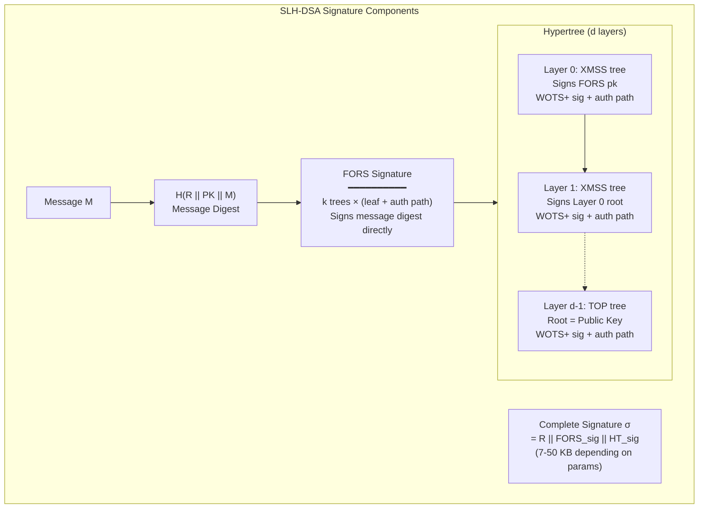
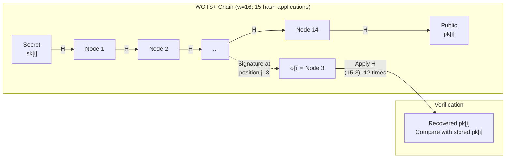
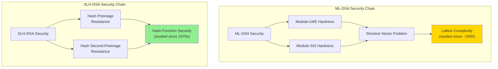

# NIST FIPS 205 — SLH-DSA (Stateless Hash-Based Digital Signature Algorithm)

**Standard:** FIPS 205 (August 13, 2024)  
**Title:** Stateless Hash-Based Digital Signature Standard  
**Based on:** SPHINCS+ (NIST PQC signature selection)  
**SDO:** National Institute of Standards and Technology (NIST)  
**Domain:** Post-quantum digital signatures; conservative/backup signature scheme  
**Audience:** Cryptographic engineers, security architects, PKI designers, hardware security professionals  
**Prerequisites:** Hash function properties (collision resistance; preimage resistance); Merkle tree structures; understanding of digital signature security models

---

## Chapter 1 — Historical Context & Origin Story

### 1.1 Timeline

| Year | Milestone |
|------|-----------|
| 1979 | Lamport: one-time signature (OTS) from hash functions |
| 1979 | Merkle: tree-based signatures (combining many OTS) |
| 2011 | XMSS: eXtended Merkle Signature Scheme (stateful; practical) |
| 2014 | SPHINCS: first practical STATELESS hash-based signature |
| 2016 | NIST PQC Competition Call for Proposals |
| 2017 | SPHINCS+ submitted (improved SPHINCS with optimized parameters) |
| 2019 | SPHINCS+ advances to Round 2 |
| 2020 | SPHINCS+ advances to Round 3 (finalist alongside Dilithium; Falcon) |
| 2022 | **NIST selects SPHINCS+** as conservative/backup signature standard |
| 2023 | FIPS 205 draft (name: SPHINCS+ → SLH-DSA) |
| **2024** | **FIPS 205 published** (August 13, 2024) — SLH-DSA official |

### 1.2 Why SLH-DSA Was Standardized (Alongside ML-DSA)

| Reason | Explanation |
|:------:|-------------|
| **Minimal assumptions** | Security relies ONLY on hash function properties (preimage resistance; second-preimage resistance). No algebraic structure (no lattices; no number theory) |
| **Hedge against lattice breaks** | If Module-LWE/Module-SIS is broken (unexpected advance in lattice cryptanalysis), SLH-DSA remains secure |
| **Decades of study** | Hash-based signatures have been studied since 1979; extremely well-understood security |
| **Stateless** | Unlike XMSS/LMS (SP 800-208), SLH-DSA does NOT require maintaining a counter — simpler deployment |
| **Diversity** | NIST's "defense in depth" — not all signatures rely on the same mathematical problem |

### 1.3 Stateful vs. Stateless Hash-Based Signatures

| Property | XMSS/LMS (SP 800-208) | SLH-DSA (FIPS 205) |
|:--------:|:---:|:---:|
| State management | MUST track leaf index (never reuse) | **No state needed** |
| Risk | Reusing index → catastrophic key compromise | No reuse risk |
| Signature size | ~2.5 KB | ~7-50 KB (larger) |
| Performance | Fast sign/verify | Slower signing |
| Deployment complexity | High (state synchronization; backup) | **Low** (drop-in replacement) |
| Use case | Firmware update signing (controlled environment) | General-purpose (backup scheme) |

---

## Chapter 2 — Architecture & Structure

### 2.1 Building Blocks

SLH-DSA constructs signatures from three layers of hash-based primitives:

| Component | Role | Description |
|:---------:|:----:|-------------|
| **WOTS+** | One-Time Signature | Winternitz OTS: signs a single message; used at leaf level |
| **XMSS** | Few-Time Signature (Merkle tree) | Binary hash tree of WOTS+ key pairs; authenticates one WOTS+ leaf |
| **Hypertree** | Multi-layer XMSS | Stack of XMSS trees; top tree signs index for bottom tree |
| **FORS** | Few-Time Signature (Forest) | Forest of Random Subsets; signs the message directly |

### 2.2 Hypertree Structure

```
Level d-1:  [XMSS tree] ← top-level tree; root = public key
                |
Level d-2:  [XMSS tree] [XMSS tree] ...
                |
              ...
Level 0:    [XMSS tree] [XMSS tree] [XMSS tree] ...
                |
            [FORS trees] ← signs the actual message hash
```

- **Total tree height:** $h$ (e.g., $h = 63$ or $h = 66$)
- **Number of layers:** $d$ (e.g., $d = 7$ or $d = 12$)
- **Tree height per layer:** $h/d$
- **Capacity:** $2^h$ signatures before keys should be replaced

### 2.3 Signing Overview

1. **Hash** the message → digest
2. **FORS** signs the digest (few-time signature; generates FORS signature + authentication path)
3. **Hypertree** authenticates the FORS key used (chain of XMSS trees from leaf to root)
4. **Signature** = FORS signature + hypertree authentication path

---

## Chapter 3 — Technical Deep Dive

### 3.1 WOTS+ (Winternitz One-Time Signature Plus)

| Parameter | Description |
|:---------:|-------------|
| $w$ | Winternitz parameter (typically $w = 16$); trade-off: larger $w$ → smaller signature but slower |
| $n$ | Security parameter (hash output length in bytes; 16, 24, or 32) |
| $len$ | Number of hash chains: $len_1 + len_2$ where $len_1 = \lceil 8n / \log_2 w \rceil$; $len_2 = \lceil (\log_2(len_1(w-1)) + 1) / \log_2 w \rceil + 1$ |

**Signing:** For each chunk of message, compute partial hash chain. Verification: complete the hash chain to the public key.

**Security:** ONE-TIME only. If same WOTS+ key signs two different messages → key can be forged. SLH-DSA ensures each WOTS+ key is used at most once via the hypertree addressing scheme.

### 3.2 FORS (Forest of Random Subsets)

| Parameter | Description |
|:---------:|-------------|
| $k$ | Number of trees in the forest (e.g., $k = 14, 22, 33, 35$) |
| $a$ | Height of each tree in the forest (e.g., $a = 12, 14, 6, 9$) |
| Leaves per tree | $2^a$ (secret random values) |
| Total secret values | $k \cdot 2^a$ |

**Signing:** Message hash split into $k$ parts of $a$ bits each. For each part $i$, reveal the leaf at index $m_i$ in tree $i$ plus its authentication path.

**Few-time property:** FORS can sign a limited number of messages before security degrades. The hypertree ensures each FORS instance is used very few times.

### 3.3 Hash Functions Used

| Hash Instantiation | Based on | SLH-DSA Variant |
|:-:|:-:|:-:|
| **SHAKE-256** | SHA-3 (Keccak) | SLH-DSA-SHAKE-* |
| **SHA-256** | SHA-2 | SLH-DSA-SHA2-* |

Both provide equivalent security; SHA-256 variants may be faster on hardware with SHA-2 acceleration (Intel SHA-NI; ARM Crypto Extensions).

### 3.4 Addressing Scheme (ADRS)

SLH-DSA uses a 32-byte address structure to ensure domain separation between all hash calls:

| Field | Purpose |
|:-----:|---------|
| Layer address | Which hypertree layer |
| Tree address | Which tree within the layer |
| Type | WOTS+ / FORS / tree hash / message compression |
| Key pair address | Which key pair within the tree |
| Chain address | Which hash chain (WOTS+) |
| Hash address | Position within the chain |

This prevents related-key or multi-target attacks across the hash tree structure.

---

## Chapter 4 — Parameter Sets

### 4.1 SLH-DSA Parameter Sets

SLH-DSA defines 12 parameter sets: 6 security levels × 2 modes (fast vs. small):

| Parameter Set | Security Level | Mode | $n$ | $h$ | $d$ | Pub Key | Signature |
|:-------------:|:---:|:---:|:---:|:---:|:---:|:---:|:---:|
| SLH-DSA-128s | 1 | Small | 16 | 63 | 7 | 32 B | **7,856 B** |
| SLH-DSA-128f | 1 | Fast | 16 | 66 | 22 | 32 B | **17,088 B** |
| SLH-DSA-192s | 3 | Small | 24 | 63 | 7 | 48 B | **16,224 B** |
| SLH-DSA-192f | 3 | Fast | 24 | 66 | 22 | 48 B | **35,664 B** |
| SLH-DSA-256s | 5 | Small | 32 | 64 | 8 | 64 B | **29,792 B** |
| SLH-DSA-256f | 5 | Fast | 32 | 68 | 17 | 64 B | **49,856 B** |

### 4.2 Fast vs. Small Trade-off

| Mode | Signing Speed | Signature Size | Use Case |
|:----:|:---:|:---:|---|
| **Fast (-f)** | ~10× faster signing | ~2× larger signature | Interactive signing (online); frequent signatures |
| **Small (-s)** | ~10× slower signing | ~2× smaller signature | Bandwidth-constrained; storage-limited; archival |

### 4.3 Comparison with ML-DSA and Classical

| Algorithm | Public Key | Signature | Total (pk+sig) | Security |
|:---------:|:---:|:---:|:---:|:---:|
| Ed25519 | 32 B | 64 B | 96 B | ~128-bit classical |
| RSA-3072 | 384 B | 384 B | 768 B | ~128-bit classical |
| **ML-DSA-44** | **1,312 B** | **2,420 B** | **3,732 B** | Level 2 (PQ) |
| **SLH-DSA-128s** | **32 B** | **7,856 B** | **7,888 B** | Level 1 (PQ) |
| **SLH-DSA-128f** | **32 B** | **17,088 B** | **17,120 B** | Level 1 (PQ) |
| **SLH-DSA-256s** | **64 B** | **29,792 B** | **29,856 B** | Level 5 (PQ) |

**Key insight:** SLH-DSA has the SMALLEST public key (32-64 B) but LARGEST signatures (7-50 KB). ML-DSA has the best balance.

### 4.4 Performance Benchmarks

| Operation | SLH-DSA-128f | SLH-DSA-128s | ML-DSA-44 | Ed25519 |
|:---------:|:---:|:---:|:---:|:---:|
| KeyGen | ~3 ms | ~3 ms | ~60 μs | ~30 μs |
| Sign | ~10 ms | ~150 ms | ~150 μs | ~68 μs |
| Verify | ~1 ms | ~3 ms | ~50 μs | ~25 μs |

---

## Chapter 5 — Security Analysis

### 5.1 Security Properties

| Property | Guarantee |
|:--------:|-----------|
| **EUF-CMA** | Existential Unforgeability under Chosen Message Attack |
| **Minimal assumptions** | Security relies ONLY on: (1) preimage resistance; (2) second-preimage resistance; (3) undetectability (PRF-like behavior) of the underlying hash |
| **Post-quantum** | No known quantum speedup against hash function preimage resistance (Grover gives only $\sqrt{}$ speedup; accounted for in parameters) |
| **Multi-target resistance** | Addressing scheme prevents multi-target preimage attacks |

### 5.2 Security Reduction Chain

$$\text{SLH-DSA security} \leftarrow \text{Hypertree} \leftarrow \text{XMSS} \leftarrow \text{WOTS+} \leftarrow \text{Hash preimage resistance}$$

The security proof is TIGHT — no significant security loss in the reduction. This means:
- If SHAKE-256 has $2^{128}$ preimage resistance → SLH-DSA-128 provides $2^{128}$ signature security
- No "polynomial loss" that plagues lattice-based reductions

### 5.3 Why "Conservative"

| Aspect | Lattice-based (ML-DSA) | Hash-based (SLH-DSA) |
|:------:|:---:|:---:|
| Mathematical problem | Module-LWE + Module-SIS (relatively recent; ~2005) | Hash preimage resistance (studied since 1970s) |
| Algebraic structure | Rich structure (rings; modules); potential hidden attacks | **No algebraic structure** — pure hash computations |
| Quantum threat | Believed hard for quantum; no proof | Provably reduces to hash security; Grover's gives only square-root speedup (accounted for) |
| Risk of break | Small but non-zero (lattice cryptanalysis advancing) | **Extremely low** — would require breaking SHA-2/SHA-3 |
| Speed vs. security | Better performance | Slower but more conservative |

---

## Chapter 6 — Implementation Guide

### 6.1 Recommended Use Cases

| Use Case | Recommended Variant | Rationale |
|:--------:|:---:|---|
| **Root CA (long-lived trust anchor)** | SLH-DSA-256s | Most conservative; root cert rarely transmitted; small signature acceptable for infrequent use |
| **Code signing (archival)** | SLH-DSA-192s or SLH-DSA-256s | Signatures verified for decades; security paramount over size |
| **Backup scheme (hedge)** | SLH-DSA-128f alongside ML-DSA | If lattice breaks emerge, SLH-DSA remains valid |
| **Firmware signing (IoT)** | SLH-DSA-128s | Signing is infrequent; small signature preferred for flash storage |
| **Document signing (legal/notarial)** | SLH-DSA-256s | Decades-long validity; conservative security |

### 6.2 When to Use SLH-DSA vs. ML-DSA

| Choose SLH-DSA when... | Choose ML-DSA when... |
|---|---|
| Maximum security assurance required | Performance matters (TLS; high-volume) |
| Signature frequency is low | Signatures are frequent (millions/day) |
| Hedging against lattice algorithm breaks | Bandwidth-constrained (smaller combined pk+sig) |
| Regulatory requirement for hash-only crypto | General-purpose default |
| Archival/long-lived signatures (30+ years) | Interactive protocols (handshakes) |

### 6.3 Implementation Considerations

| Consideration | Detail |
|:-------------:|--------|
| **Stack usage** | SLH-DSA signing requires significant stack space for Merkle trees (~50-200 KB). On constrained devices, careful memory management needed |
| **Signing time variability** | Signing time varies based on message (different tree paths). For constant-time guarantee: always traverse full tree (slower but side-channel resistant) |
| **Parallelism** | Tree computations are highly parallelizable. WOTS+ chains within a tree can be computed independently → good for multi-core/FPGA |
| **Hash acceleration** | SHA-NI (x86) or ARM SHA-2 extensions provide 3-5× speedup. SHAKE variants benefit from Keccak hardware acceleration |
| **Deterministic vs. randomized** | SLH-DSA supports both. Randomized: add randomness to message hash → better fault resistance. Deterministic: reproducible signatures |

### 6.4 Code Example (liboqs — Python)

```python
import oqs

# Key Generation
signer = oqs.Signature("SLH-DSA-SHAKE-128f")
public_key = signer.generate_keypair()
secret_key = signer.export_secret_key()

# Signing
message = b"Critical firmware update v2.1.0"
signature = signer.sign(message)
print(f"Signature size: {len(signature)} bytes")  # ~17,088 bytes

# Verification
verifier = oqs.Signature("SLH-DSA-SHAKE-128f")
is_valid = verifier.verify(message, signature, public_key)
print(f"Valid: {is_valid}")  # True
```

---

## Chapter 7 — Comparison with Other Hash-Based Schemes

| Scheme | Stateful? | Standard | Signature | Public Key | Sign Speed | Security Basis |
|:------:|:---------:|:--------:|:---------:|:----------:|:----------:|:--------------:|
| **SLH-DSA-128f** | **No** | **FIPS 205** | **17,088 B** | **32 B** | 10 ms | Hash preimage |
| **SLH-DSA-128s** | **No** | **FIPS 205** | **7,856 B** | **32 B** | 150 ms | Hash preimage |
| XMSS | Yes | NIST SP 800-208 | ~2,500 B | 64 B | 2 ms | Hash preimage |
| LMS | Yes | NIST SP 800-208 | ~4,652 B | 60 B | 1 ms | Hash preimage |
| XMSS-MT | Yes | SP 800-208 | ~5,000 B | 64 B | 3 ms | Hash preimage |
| Gravity-SPHINCS | No | Academic | ~25,000 B | 32 B | 50 ms | Hash preimage |

### Key Trade-offs

| Priority | Best Choice |
|:--------:|:-----------:|
| Smallest signature (hash-based) | XMSS (~2.5 KB) — but STATEFUL |
| No state management | **SLH-DSA** (stateless) |
| Fastest signing (hash-based) | LMS (~1 ms) — but STATEFUL |
| Most conservative + stateless | **SLH-DSA-256s** |
| Balance (size + stateless) | SLH-DSA-128s (7.8 KB) |

---

## Chapter 8 — Architecture Diagrams

### 8.1 SLH-DSA Signature Structure



### 8.2 WOTS+ Hash Chain



### 8.3 Security Assumption Comparison



---

## Chapter 9 — Case Studies

### 9.1 Root of Trust: SLH-DSA for Firmware Boot Chain

| Aspect | Detail |
|--------|--------|
| **Scenario** | Embedded device manufacturer needs quantum-safe secure boot. Device lifetime: 15+ years. Cannot be updated after deployment. |
| **Why SLH-DSA** | (1) Firmware signing is INFREQUENT (factory + updates). Slow signing acceptable. (2) Verification on device: ~1-3 ms is acceptable for boot. (3) Most conservative security — cannot risk lattice break during 15-year lifetime. (4) Stateless — no counter management in HSM |
| **Parameters** | SLH-DSA-SHA2-128s: 7,856 B signature per firmware image. Public key (32 B) burned into device OTP/ROM |
| **Trade-off** | Firmware image grows by ~8 KB (acceptable; firmware typically 1-16 MB). Boot verification adds ~3 ms (acceptable; device boots once) |
| **Alternative rejected** | ML-DSA-65: smaller signature (3,293 B) but relies on lattice hardness. For a device that cannot be updated if lattice breaks in 2035, SLH-DSA is safer hedge |

### 9.2 CNSA 2.0 Root CA Migration

| Aspect | Detail |
|--------|--------|
| **Context** | NSA CNSA 2.0 (Sept 2022) specifies: "Software/firmware signing: SLH-DSA by 2025" for National Security Systems |
| **Challenge** | Root CA certificates are valid 20-30 years. If lattice-based signatures are broken, entire PKI collapses |
| **Strategy** | Deploy SLH-DSA-256s for Root CA (most conservative). Use ML-DSA-87 for intermediate/leaf certs (better performance for high-volume signing). Root signs intermediates: only ~100 signatures over CA lifetime; slow signing acceptable |
| **Size budget** | Root cert with SLH-DSA-256s: pk (64 B) + self-sig (29,792 B) ≈ 30 KB. Acceptable — root cert is rarely transmitted (pinned; distributed out-of-band) |

---

## Chapter 10 — Future Evolution

| Trend | Description | Timeline |
|:-----:|-------------|:--------:|
| **Hardware acceleration** | Dedicated SHA-3/SHA-2 engines optimized for SLH-DSA tree traversal | 2025-2027 |
| **Smaller signatures** | Research: SPHINCS-α (improved parameters); Gravity-SPHINCS+ optimizations | 2025+ |
| **Hybrid deployment** | SLH-DSA + ML-DSA composite signatures (belt-and-suspenders) | 2024-2026 |
| **IoT integration** | Lightweight SLH-DSA variants for constrained devices; selective tree computation | 2025-2028 |
| **Formal verification** | Machine-checked proofs of SLH-DSA implementations (Jasmin; Coq; F*) | 2025-2027 |
| **Batch verification** | Amortizing tree computation across multiple signature verifications | 2025-2026 |
| **GPU/FPGA signing** | Parallel tree computation for faster signing (10-100× speedup possible) | 2025-2027 |

---

## Chapter 11 — Interview Questions & Career Guide

### Tier 1: Entry-Level

**Q1:** Why does NIST standardize both ML-DSA (FIPS 204) and SLH-DSA (FIPS 205)? Aren't two signature standards redundant?

**A:** They serve complementary roles. ML-DSA is the PRIMARY standard — fast, moderate sizes, good for high-volume use (TLS, email). SLH-DSA is the CONSERVATIVE BACKUP — it relies only on hash function security (no lattice assumptions). If a breakthrough in lattice cryptanalysis breaks ML-DSA, SLH-DSA remains secure because its security reduces to a different, much older assumption (hash preimage resistance). This is NIST's defense-in-depth strategy: algorithm diversity ensures the entire PQC ecosystem doesn't collapse from a single mathematical breakthrough.

### Tier 2: Mid-Level

**Q2:** Explain the trade-off between SLH-DSA "fast" (-f) and "small" (-s) parameter sets. When would you choose each?

**A:** The fast variants use more XMSS tree layers ($d$ = 17-22 vs. 7-8 for small). More layers = shallower trees per layer = fewer hash computations per signing operation = faster signing. But each layer adds one WOTS+ signature + authentication path to the total signature → larger signature.

- **Choose -f (fast):** When signing frequency is high or signing latency matters (interactive code signing during CI/CD; OCSP response signing). Acceptable: larger signatures (~17-50 KB). SLH-DSA-128f: 10 ms sign; 17 KB sig.
- **Choose -s (small):** When bandwidth/storage is constrained or signing is infrequent (root CA; firmware signing; archival documents; constrained IoT flash). Acceptable: slower signing (~150 ms). SLH-DSA-128s: 150 ms sign; 7.8 KB sig.
- **Verification:** -f variants verify slightly faster than -s (fewer deep tree traversals per layer).

### Tier 3: Senior

**Q3:** Design a PKI architecture that remains secure even if lattice-based cryptography (ML-DSA) is broken by 2030. Consider: certificate chain design, CA hierarchy, cross-signing, and performance constraints.

**A:**

| Layer | Algorithm | Rationale |
|:-----:|:---------:|-----------|
| **Root CA** | SLH-DSA-256s | Trust anchor; signs ~50 certs over lifetime; 150 ms signing acceptable; 29 KB signature in root cert is acceptable (rarely transmitted; typically pinned) |
| **Intermediate CA** | SLH-DSA-192f (or dual: ML-DSA-87 + SLH-DSA-192f) | Signs ~10K certs/year; 10 ms/sign is acceptable; signature in intermediate cert: 35 KB (transmitted in TLS but only per-session setup) |
| **Leaf certs** | ML-DSA-65 (primary) + SLH-DSA-128f (backup) | Dual-signed: leaf cert carries both signatures. Client verifies ML-DSA first (fast). If ML-DSA declared broken: emergency transition — clients verify SLH-DSA signature instead |
| **Cross-signing** | Root CA cross-signs an ML-DSA-87 intermediate | Allows ML-DSA chain for performance-sensitive paths while SLH-DSA chain exists as fallback |

**Performance budget (TLS handshake; 3-cert chain):**
- Pure SLH-DSA chain: ~80 KB cert chain (pk + sig overhead). Impact: additional RTT for large certificates. Mitigation: use certificate compression (RFC 8879); session resumption; split across TCP segments.
- Hybrid chain: ~25 KB cert chain (SLH-DSA root + ML-DSA leaf/intermediate). Best balance.

**Emergency plan if lattice breaks:**
1. CAs immediately stop issuing ML-DSA-only certs
2. Revoke ML-DSA-only intermediates
3. Clients switch to verifying SLH-DSA signatures (already present in dual-signed certs)
4. New certs issued with SLH-DSA-only (or await FN-DSA — different lattice approach)
5. Timeline: if lattice break announced → migrate within 90 days (certs are short-lived via ACME)

---

## Chapter 12 — Cheat Sheet & Quick Reference

```
═══════════════════════════════════════════
FIPS 205: SLH-DSA — QUICK REFERENCE
═══════════════════════════════════════════

STANDARD: NIST FIPS 205 (August 13, 2024)
BASIS: SPHINCS+ (hash-based stateless signature)
SECURITY: Relies ONLY on hash function properties
PURPOSE: Conservative/backup digital signature
ROLE: Hedge against lattice algorithm breaks

═══════════════════════════════════════════
KEY INSIGHT:
  • Smallest public keys (32-64 bytes)
  • LARGEST signatures (7-50 KB)
  • SLOWEST signing (~10-150 ms)
  • MOST CONSERVATIVE security assumption
  • STATELESS (no counter to manage)

═══════════════════════════════════════════
PARAMETER SETS (12 total):
  
  Level 1 (128-bit):
    SLH-DSA-128s: pk=32B  sig=7,856B   [small]
    SLH-DSA-128f: pk=32B  sig=17,088B  [fast]
  
  Level 3 (192-bit):
    SLH-DSA-192s: pk=48B  sig=16,224B  [small]
    SLH-DSA-192f: pk=48B  sig=35,664B  [fast]
  
  Level 5 (256-bit):
    SLH-DSA-256s: pk=64B  sig=29,792B  [small]
    SLH-DSA-256f: pk=64B  sig=49,856B  [fast]

═══════════════════════════════════════════
HASH INSTANTIATIONS:
  SLH-DSA-SHAKE-*: uses SHAKE-256 (SHA-3 family)
  SLH-DSA-SHA2-*: uses SHA-256 (hardware-accelerated)

═══════════════════════════════════════════
BUILDING BLOCKS:
  WOTS+ → One-Time Signature (hash chains)
  FORS → Few-Time Signature (forest of trees)
  XMSS → Merkle tree of WOTS+ keys
  Hypertree → Multi-layer stack of XMSS trees

═══════════════════════════════════════════
vs ML-DSA (FIPS 204):
  ML-DSA-65: pk=1952B sig=3293B sign=250μs
  SLH-DSA-128f: pk=32B sig=17088B sign=10ms
  
  ML-DSA: better performance + size balance
  SLH-DSA: more conservative; hedge; backup

═══════════════════════════════════════════
WHEN TO USE SLH-DSA:
  ✓ Root CA (long-lived trust anchor)
  ✓ Firmware/code signing (infrequent; archival)
  ✓ Hedge against lattice breaks
  ✓ Regulatory (CNSA 2.0 backup requirement)
  ✓ Ultra-conservative environments
  
  ✗ NOT for: TLS (too large/slow)
  ✗ NOT for: high-volume signing
  ✗ NOT for: bandwidth-constrained real-time

═══════════════════════════════════════════
CNSA 2.0 (NSA):
  Software signing: SLH-DSA by 2025
  Firmware signing: SLH-DSA by 2025
  (Alongside ML-DSA for general use)

═══════════════════════════════════════════
STATEFUL vs STATELESS:
  XMSS/LMS (SP 800-208): stateful; smaller sigs
    → Risk: reuse index = catastrophic break
  SLH-DSA (FIPS 205): STATELESS; larger sigs
    → No counter management needed
    → Drop-in replacement; simpler deployment
```

---

*End of Document — 04_NIST_FIPS_205_SLH_DSA.md*
