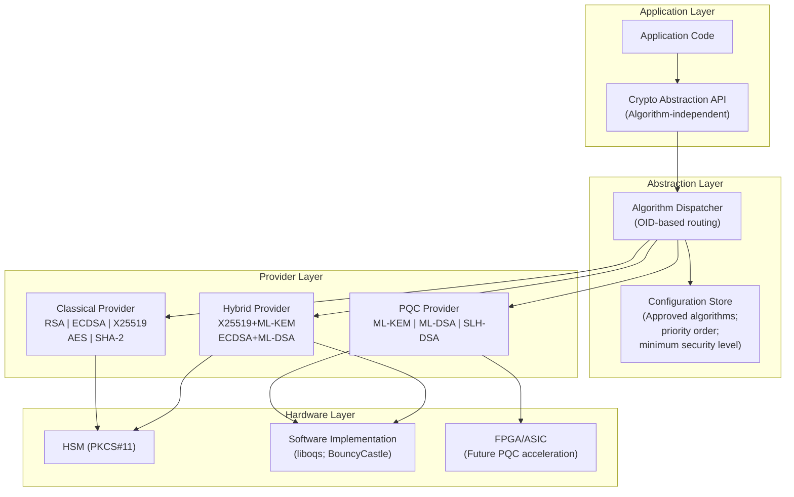
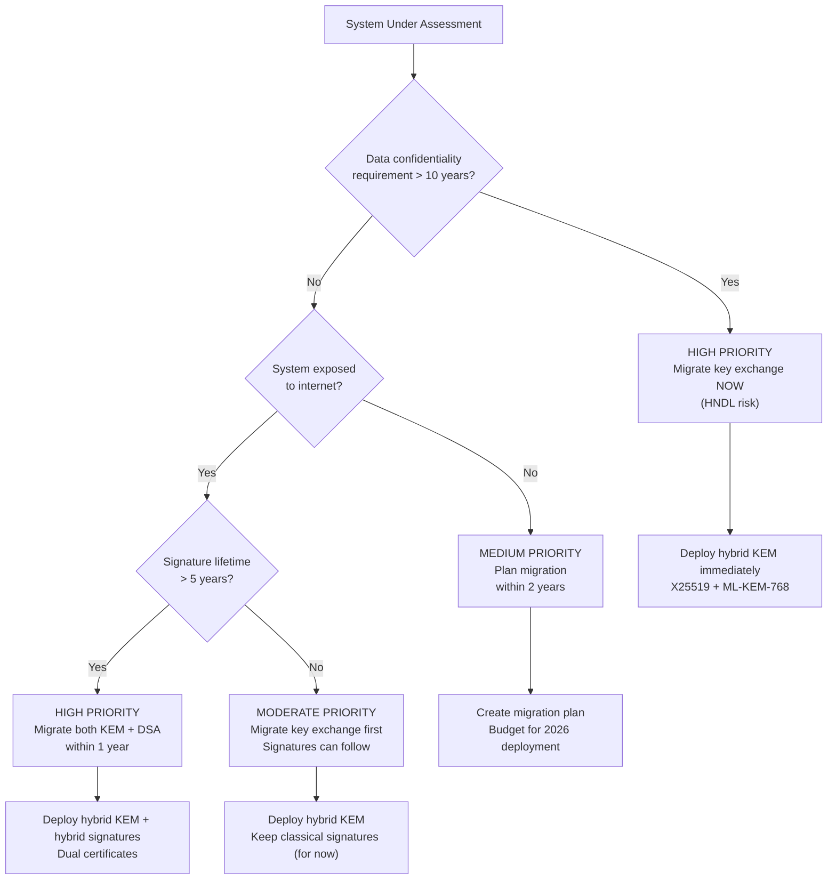

# Crypto Agility & Migration Frameworks

**Standard/Framework:** IETF RFC 8446 (TLS 1.3) | IETF LAMPS WG | NIST NCCoE Migration Playbooks | NIST SP 1800-38  
**Title:** Cryptographic Agility — Standards, Frameworks, and Migration Strategies  
**Domain:** Cryptographic migration; algorithm negotiation; protocol flexibility; enterprise security architecture  
**Audience:** Security architects, CISOs, protocol engineers, PKI administrators, enterprise IT leaders  
**Prerequisites:** PKI concepts; TLS/SSH/IPsec; X.509 certificates; understanding of PQC algorithms (ML-KEM; ML-DSA; SLH-DSA)

---

## Chapter 1 — Historical Context & Origin Story

### 1.1 What is Cryptographic Agility?

**Definition:** The ability of a system to switch cryptographic algorithms, key sizes, and protocols without requiring re-architecture of the entire system.

**Key insight:** Every cryptographic algorithm has a finite lifetime. History proves algorithms get broken, deprecated, or superseded:

| Year | Algorithm Event | Impact |
|------|-----------------|--------|
| 2004 | MD5 collision found (Wang et al.) | MD5 abandoned for signatures |
| 2005 | SHA-1 theoretical collision | 10-year deprecation process began |
| 2008 | Debian weak keys (RNG bug) | Mass key revocation |
| 2014 | POODLE (SSLv3 broken) | Protocol downgrade attacks |
| 2015 | Logjam (512-bit DH export) | Weak parameter deprecation |
| 2017 | SHA-1 practical collision (SHAttered) | Final SHA-1 death for certificates |
| 2020 | RSA-2048 approaching deprecation timeline | CNSA: move to ECC/PQC |
| 2022 | SIKE broken (isogeny-based PQC candidate) | PQC algorithm can fail too |
| 2024 | PQC standards published (FIPS 203/204/205) | Largest migration in crypto history begins |

### 1.2 The Quantum Migration Imperative

$$\text{HNDL Risk} = P(\text{data intercepted today}) \times P(\text{quantum computer available in } t \text{ years}) \times V(\text{data value at time } t)$$

**Harvest Now, Decrypt Later (HNDL):** Adversaries collect encrypted traffic today, intending to decrypt once quantum computers are available. Data with long confidentiality requirements (government secrets; health records; trade secrets) is already at risk.

### 1.3 Standards Driving Crypto Agility

| Organization | Standard/Document | Focus |
|:------------:|:-:|---|
| **NIST** | SP 1800-38 (draft) | PQC migration playbook for enterprises |
| **NIST NCCoE** | Migration to PQC project | Practical guidance (TLS; code signing; SSH; PKI) |
| **IETF** | RFC 8446 (TLS 1.3) | Algorithm negotiation framework |
| **IETF LAMPS WG** | Multiple drafts | X.509/CMS integration with PQC |
| **IETF TLS WG** | Hybrid key exchange drafts | PQC integration into TLS |
| **NSA** | CNSA 2.0 (2022) | Federal migration timeline |
| **CISA/NSA/NIST** | Joint Advisory (2022) | PQC preparation guidance |
| **OMB** | M-23-02 (2022) | US government PQC readiness mandate |

---

## Chapter 2 — Principles of Crypto Agility

### 2.1 Core Principles

| Principle | Description | Implementation |
|:---------:|-------------|:---:|
| **Algorithm independence** | Application logic does NOT hardcode specific algorithms | Use algorithm identifiers (OIDs; named groups) |
| **Negotiation** | Parties agree on algorithms dynamically at connection time | TLS cipher suites; SSH kex algorithms |
| **Pluggability** | Cryptographic modules can be replaced without application changes | PKCS#11; CNG; JCA/JCE interfaces |
| **Versioning** | Protocols support version negotiation | TLS 1.2 → 1.3; IKEv2 transforms |
| **Discovery** | Systems can discover peer capabilities before committing | ClientHello extensions; SSH algorithm lists |
| **Graceful degradation** | If preferred algorithm unavailable, fall back safely (not insecurely) | Priority-ordered algorithm lists; minimum acceptable security |

### 2.2 Architectural Patterns for Crypto Agility

| Pattern | Description | Example |
|:-------:|-------------|---------|
| **Abstraction layer** | Crypto operations behind an interface; swap implementations | OpenSSL provider model; JCA Security.addProvider() |
| **Configuration-driven** | Algorithm selection via config (not compiled in) | TLS cipher string; SSH config file |
| **Protocol negotiation** | Built-in algorithm agreement | TLS 1.3 supported_groups extension |
| **OID-based dispatch** | Algorithm identified by OID in certificates/messages | X.509: 2.16.840.1.101.3.4.3.17 = ML-DSA-44 |
| **Hybrid/composite** | Use TWO algorithms simultaneously; both must be broken | X25519+ML-KEM-768; ECDSA+ML-DSA |
| **Crypto catalog** | Centralized registry of approved algorithms (enterprise-wide) | Internal policy engine; hardware inventory |

---

## Chapter 3 — TLS 1.3 Algorithm Negotiation (RFC 8446)

### 3.1 How TLS 1.3 Enables Crypto Agility

TLS 1.3 separates algorithm selection into independent axes:

| Axis | Extension/Mechanism | Algorithms |
|:----:|:---:|---|
| **Key Exchange** | supported_groups (extension) | X25519; P-256; P-384; X25519+ML-KEM-768; ML-KEM-768 |
| **Authentication** | signature_algorithms (extension) | RSA-PSS; ECDSA; Ed25519; ML-DSA-65; ML-DSA-87 |
| **Symmetric** | cipher_suites (hello) | AES-128-GCM; AES-256-GCM; ChaCha20-Poly1305 |
| **Hash** | Implicit in cipher suite | SHA-256; SHA-384 |

### 3.2 PQC Key Exchange in TLS 1.3

| Named Group | Code Point | Key Share Size | Status |
|:-----------:|:---:|:---:|:---:|
| x25519_mlkem768 | 0x6399 | 1,184 + 32 = 1,216 B (client); 1,088 + 32 = 1,120 B (server) | Chrome/Firefox/Cloudflare (2024) |
| mlkem768 | TBD | 1,184 B / 1,088 B | Future (pure PQC) |
| x25519 | 0x001D | 32 B / 32 B | Current default |
| secp256r1 | 0x0017 | 65 B / 65 B | Legacy |

### 3.3 PQC Signature Algorithms in TLS 1.3

| SignatureScheme | Value | Certificate Signature | Status |
|:-:|:---:|---|---|
| mldsa44 | TBD | ML-DSA-44 (Level 2) | Draft |
| mldsa65 | TBD | ML-DSA-65 (Level 3) | Draft |
| mldsa87 | TBD | ML-DSA-87 (Level 5) | Draft |
| ecdsa_secp256r1_sha256 | 0x0403 | ECDSA P-256 | Current |
| ed25519 | 0x0807 | Ed25519 | Current |

### 3.4 Negotiation Flow

```
ClientHello:
  supported_groups: [x25519_mlkem768, x25519, secp256r1]
  signature_algorithms: [mldsa65, ecdsa_secp256r1_sha256, ed25519]
  key_share: [x25519_mlkem768: <1216 bytes>, x25519: <32 bytes>]

ServerHello:
  selected_group: x25519_mlkem768
  key_share: [x25519_mlkem768: <1120 bytes>]

Server Certificate:
  signature_algorithm: mldsa65 (or ecdsa if server has no PQC cert)
```

---

## Chapter 4 — IETF LAMPS Working Group (X.509 & CMS)

### 4.1 PQC in X.509 Certificates

| Draft/RFC | Title | Content |
|:---------:|:-----:|---------|
| draft-ietf-lamps-dilithium-certificates | ML-DSA in X.509 | OIDs; encoding; SubjectPublicKeyInfo format for ML-DSA |
| draft-ietf-lamps-kyber-certificates | ML-KEM in X.509 | ML-KEM public key in certificates (for key transport) |
| draft-ietf-lamps-pq-composite-sigs | Composite ML-DSA/Traditional | Combined (ECDSA + ML-DSA) signatures; single OID |
| draft-ietf-lamps-pq-composite-kem | Composite ML-KEM/Traditional | Combined (ECDH + ML-KEM) key encapsulation |
| draft-ietf-lamps-cms-sphincs-plus | SLH-DSA in CMS | SLH-DSA for Cryptographic Message Syntax |

### 4.2 Algorithm Object Identifiers (OIDs)

| Algorithm | OID | Use |
|:---------:|:---:|:---:|
| ML-DSA-44 | 2.16.840.1.101.3.4.3.17 | Digital signature (Level 2) |
| ML-DSA-65 | 2.16.840.1.101.3.4.3.18 | Digital signature (Level 3) |
| ML-DSA-87 | 2.16.840.1.101.3.4.3.19 | Digital signature (Level 5) |
| ML-KEM-512 | 2.16.840.1.101.3.4.4.1 | Key encapsulation (Level 1) |
| ML-KEM-768 | 2.16.840.1.101.3.4.4.2 | Key encapsulation (Level 3) |
| ML-KEM-1024 | 2.16.840.1.101.3.4.4.3 | Key encapsulation (Level 5) |
| SLH-DSA-SHA2-128s | 2.16.840.1.101.3.4.3.20 | Hash-based signature |
| SLH-DSA-SHAKE-128f | 2.16.840.1.101.3.4.3.21 | Hash-based signature |

### 4.3 Hybrid/Composite Certificate Approaches

| Approach | IETF Draft | Description | Pros | Cons |
|:--------:|:---:|---|---|---|
| **Composite** | draft-ounsworth-pq-composite-sigs | Single cert; single OID for combined algorithm | Clean; atomic; one cert to manage | New OID per combination; client must support composite |
| **Multiple signatures** | draft-truskovsky-lamps-pq-hybrid-x509 | Cert has multiple signature fields | Backward-compatible (ignore PQC sig) | Complex parsing; larger cert |
| **Related certificates** | draft-bonnell-lamps-chameleon-certs | Two certs (classical + PQC) linked by extension | Maximum backward compatibility | Two certs to issue/manage/revoke |
| **Delegated credentials** | RFC 9345 + PQC extension | Short-lived PQC credential signed by classical cert | Deploy PQC without CA changes | Requires server support; short lifetime |

---

## Chapter 5 — Enterprise Migration Framework

### 5.1 NIST NCCoE Migration Methodology

| Phase | Name | Activities | Duration (typical) |
|:-----:|:----:|------------|:------------------:|
| 1 | **Discovery** | Cryptographic inventory; identify all algorithms, keys, certificates, protocols in use | 3-6 months |
| 2 | **Assessment** | Risk analysis; prioritize systems by: data sensitivity × exposure × crypto lifetime | 2-4 months |
| 3 | **Planning** | Migration roadmap; vendor engagement; budget; testing strategy | 3-6 months |
| 4 | **Testing** | Lab validation; interoperability testing; performance benchmarking | 3-6 months |
| 5 | **Pilot** | Limited production deployment; hybrid mode; monitoring | 3-6 months |
| 6 | **Deployment** | Production rollout; phased migration; legacy deprecation | 12-36 months |
| 7 | **Verification** | Audit; compliance validation; residual risk assessment | Ongoing |

### 5.2 Cryptographic Inventory

| Asset Type | What to Catalog | Example |
|:----------:|:---:|---|
| **TLS endpoints** | Protocol version; cipher suites; certificate algorithms | Apache/Nginx config; cloud LB |
| **Certificates** | Algorithm; key size; validity; CA hierarchy | X.509 certs in all keystores |
| **VPN/IPsec** | IKE transforms; ESP algorithms; DH groups | StrongSwan; Cisco ASA config |
| **SSH** | Key exchange algorithms; host key types | OpenSSH config; authorized_keys |
| **Code signing** | Signing algorithm; key management; HSM | Windows Authenticode; Android APK |
| **Data at rest** | Encryption algorithm; key wrapping; KMS | AES-256-GCM keys in AWS KMS |
| **Hardware** | HSM models; TPM versions; smart cards | Thales Luna; YubiKey |
| **Custom applications** | Embedded crypto libraries; hardcoded algorithms | OpenSSL calls; Bouncy Castle usage |
| **Third-party** | SaaS/PaaS crypto capabilities; vendor PQC roadmaps | Cloud provider timeline |

### 5.3 Priority Matrix

| Risk Factor | Weight | Scoring |
|:-----------:|:------:|---------|
| Data sensitivity | 30% | Public(1) → Confidential(3) → Top Secret(5) |
| Cryptographic lifetime | 25% | <1 year(1) → 5 years(3) → 20+ years(5) |
| Exposure to HNDL | 20% | Internal only(1) → Internet-facing(3) → State-actor target(5) |
| Migration complexity | 15% | Config change(1) → Library update(3) → Protocol redesign(5) |
| Regulatory requirement | 10% | None(1) → Industry(3) → Government mandate(5) |

**Priority score:** $\sum(\text{weight}_i \times \text{score}_i)$ → rank systems for migration order.

---

## Chapter 6 — Hybrid Cryptography Strategies

### 6.1 Hybrid Approaches

| Strategy | Description | Security Guarantee |
|:--------:|-------------|:---:|
| **Concatenation (KEM)** | $K = \text{KDF}(K_{\text{classical}} \| K_{\text{PQC}})$ | Secure if EITHER algorithm is secure |
| **Nested encryption** | $E_{\text{PQC}}(E_{\text{classical}}(\text{plaintext}))$ | Secure if EITHER is secure |
| **Composite signature** | Both ECDSA + ML-DSA must verify | Secure if EITHER cannot be forged |
| **Dual certificate** | Two separate certs; client uses preferred | Migration flexibility |
| **Key combiner (XOR)** | $K = K_{\text{classical}} \oplus K_{\text{PQC}}$ | Secure if EITHER is secure |

### 6.2 Hybrid Key Exchange Combiners

| Combiner | Formula | Standard |
|:--------:|:-------:|:--------:|
| **Concatenation + KDF** | $K = \text{HKDF}(K_1 \| K_2, \text{context})$ | TLS 1.3 hybrid drafts |
| **XOR** | $K = K_1 \oplus K_2$ | Some academic proposals |
| **Dual PRF** | $K = \text{PRF}(K_1, K_2) \oplus \text{PRF}(K_2, K_1)$ | Signal PQXDH |
| **IKM concatenation** | $K = \text{Extract}(K_1 \| K_2)$ | HPKE hybrid |

### 6.3 Hybrid Deployment Timeline

```
2024-2025: Hybrid (classical + PQC) — "belt and suspenders"
  - X25519 + ML-KEM-768 for key exchange
  - ECDSA + ML-DSA-65 for signatures (composite or dual-cert)
  
2026-2028: PQC-preferred with classical fallback
  - ML-KEM-768 primary; X25519 fallback for legacy clients
  - ML-DSA-65 primary; ECDSA fallback
  
2029-2033: Pure PQC (CNSA 2.0 deadline)
  - ML-KEM-1024 / ML-KEM-768 only
  - ML-DSA-87 / ML-DSA-65 only
  - Classical algorithms deprecated/removed
```

---

## Chapter 7 — Migration by Protocol

### 7.1 TLS Migration Path

| Phase | Action | Impact |
|:-----:|--------|--------|
| 1 | Add PQC named groups to server config | No client impact; advertised if client supports |
| 2 | Deploy hybrid key exchange (X25519+ML-KEM-768) | +~2 KB per handshake; negligible latency |
| 3 | Issue ML-DSA certificates (alongside ECDSA) | Server selects cert based on client's signature_algorithms |
| 4 | Deprecate ECDH-only key exchange | Require PQC-capable clients |
| 5 | Deprecate ECDSA-only certificates | Pure PQC authentication |

### 7.2 SSH Migration Path

| Phase | Action | Config Example |
|:-----:|--------|--------|
| 1 | Update OpenSSH (≥9.0) | Install latest OpenSSH server/client |
| 2 | Enable hybrid key exchange | `KexAlgorithms sntrup761x25519-sha512@openssh.com` |
| 3 | Generate PQC host keys | Future: ML-DSA host keys |
| 4 | Disable classical-only kex | Remove `curve25519-sha256` from allowed list |

### 7.3 Code Signing Migration Path

| Phase | Action | Consideration |
|:-----:|--------|--------|
| 1 | Inventory all signing keys and algorithms | Identify RSA-2048; ECDSA P-256 signers |
| 2 | Dual-sign (classical + PQC) | Packages carry both signatures; verifiers check whichever they support |
| 3 | Update verification chains | OS/package managers: add PQC verification path |
| 4 | Deprecate classical signatures | Only PQC signatures accepted |

### 7.4 IPsec/IKEv2 Migration Path

| Phase | Action | Standard |
|:-----:|--------|:--------:|
| 1 | Add PQC key exchange transform | RFC 9370 (Multiple Key Exchanges in IKEv2) |
| 2 | Hybrid: classical DH + PQC KEM | Both contribute to shared secret |
| 3 | Update IKE authentication | ML-DSA signatures for IKE_AUTH |
| 4 | Deprecate DH-only transforms | Require PQC contribution |

---

## Chapter 8 — Architecture Diagrams

### 8.1 Crypto Agility Architecture



### 8.2 Enterprise Migration Decision Tree



---

## Chapter 9 — Case Studies

### 9.1 Cloudflare: PQC Migration at Scale

| Aspect | Detail |
|--------|--------|
| **Scale** | ~20% of all web traffic; millions of domains |
| **Timeline** | Oct 2022: experimental PQC support. 2024: default hybrid for all traffic |
| **Approach** | Server-side: advertise X25519+ML-KEM-768 to all clients. Client compatibility: if client sends PQC key share → use it; otherwise fall back to X25519 |
| **Challenges** | (1) Middlebox incompatibility: some enterprise proxies rejected oversized ClientHello → workaround: GREASE; ClientHello fragmentation. (2) Performance: +1-2 KB per handshake; CPU impact: <1% increase (NTT is fast). (3) Certificate size: PQC certs not yet deployed (waiting for CA ecosystem) |
| **Result** | Millions of connections/second using PQC; no measurable user-facing impact |
| **Lesson** | Key exchange migration is LOW-RISK and HIGH-IMPACT — should be done FIRST |

### 9.2 US Federal Government (OMB M-23-02)

| Aspect | Detail |
|--------|--------|
| **Mandate** | Office of Management and Budget Memo M-23-02 (Nov 2022): all federal agencies must submit cryptographic inventory + migration plan |
| **Requirements** | (1) Complete crypto inventory by May 2023. (2) Identify priority systems. (3) Submit migration timeline to OMB. (4) Test PQC implementations |
| **Challenges** | (1) Agencies have 10,000+ systems; many with unknown crypto dependencies. (2) Legacy systems (COBOL; mainframe) with hardcoded algorithms. (3) Supply chain: vendor readiness varies widely. (4) Budget: estimated $5-15B across federal government |
| **CISA guidance** | "Start with key exchange (HNDL risk). Then authentication. Then data at rest." |
| **Lesson** | Cryptographic inventory is the hardest step — most organizations don't know what algorithms they use |

---

## Chapter 10 — Future Evolution

| Trend | Description | Timeline |
|:-----:|-------------|:--------:|
| **Automated crypto discovery** | Tools that scan networks/code/configs to inventory all cryptographic usage automatically | 2024-2026 |
| **Crypto policy engines** | Centralized systems that enforce algorithm choices across all services (auto-reject non-compliant) | 2025-2027 |
| **CBOM (Crypto Bill of Materials)** | Standardized format (like SBOM for crypto); list algorithms used in every software package | 2025-2026 |
| **Algorithm sunset automation** | Automated rollout of algorithm deprecation (OCSP; CRL; automated cert rotation) | 2025-2028 |
| **Multi-algorithm PKI** | CAs issuing certs with multiple algorithm options; clients select best | 2025-2027 |
| **Zero-trust + PQC** | Combining zero-trust architecture principles with PQC deployment | 2025-2028 |
| **Post-hybrid era** | Moving from hybrid to pure-PQC as confidence grows | 2028-2033 |

---

## Chapter 11 — Interview Questions & Career Guide

### Tier 1: Entry-Level

**Q1:** What is crypto agility and why is it important for PQC migration?

**A:** Crypto agility is the design principle that allows systems to switch cryptographic algorithms without re-architecting the system. It's critical for PQC migration because: (1) We need to transition from RSA/ECDH/ECDSA to ML-KEM/ML-DSA, which requires changing algorithms in TLS, certificates, signing, and encryption. (2) If systems hardcode specific algorithms (e.g., `RSA-2048` in code), migration requires rewriting and redeploying. (3) With crypto agility (config-driven; abstraction layers; algorithm negotiation), migration becomes a configuration change, not a code rewrite. (4) Also critical because PQC algorithms themselves might need updating — e.g., SIKE was broken after being a NIST finalist; systems must handle algorithm deprecation gracefully.

### Tier 2: Mid-Level

**Q2:** You discover your organization uses RSA-2048 for TLS server certificates, ECDSA P-256 for code signing, and 3DES for legacy file encryption. Prioritize the PQC migration and explain your reasoning.

**A:**

| Priority | System | Reason | Action |
|:--------:|:------:|--------|--------|
| **1 (Critical)** | TLS key exchange | HNDL risk: traffic intercepted today can be decrypted by future quantum computer. Key exchange confidentiality is retroactively broken. RSA key transport and ECDH key exchange both vulnerable | Deploy X25519+ML-KEM-768 hybrid immediately |
| **2 (High)** | Code signing | Signatures must remain valid for years. If RSA is broken, attacker can forge signed updates → supply chain attack. But NOT retroactive (can't "harvest" past signatures) | Dual-sign with ML-DSA-87 + existing algorithm |
| **3 (Medium)** | TLS authentication (certs) | Server cert ECDSA signatures only protect current session authentication. Forward-secure if key exchange is PQC-protected. Less urgent than key exchange | Issue hybrid certs (ECDSA + ML-DSA) when CA supports |
| **4 (Low)** | 3DES file encryption | Already broken classically (Sweet32 attack on 64-bit blocks). Replace with AES-256-GCM regardless of PQC. Symmetric crypto (AES-256) is already quantum-safe (Grover: 128-bit effective → still secure) | Replace 3DES with AES-256-GCM (not PQC-related; just good hygiene) |

### Tier 3: Senior

**Q3:** Design a crypto-agile architecture for a multinational bank with 500+ services, 10,000+ TLS endpoints, 50 HSMs, and regulatory requirements across US (CNSA 2.0), EU (ENISA guidance), and APAC (MAS TRM). Address organizational; technical; and timeline challenges.

**A:**

**Organizational architecture:**
- Create a **Cryptographic Center of Excellence (CCoE)**: 5-8 specialists who own crypto policy, inventory, and migration coordination
- Establish **Crypto Policy Engine**: centralized system that defines approved algorithms per classification tier (public; internal; confidential; restricted)
- Define **migration phases** aligned with regulatory deadlines: CNSA 2.0 (US NSS by 2033); ENISA (EU no specific date yet but actively publishing PQC guidance); MAS TRM (Singapore; follows NIST timeline)

**Technical architecture:**
```
┌─────────────────────────────────────────────┐
│           Crypto Abstraction Layer           │
│  ┌─────────┐ ┌──────────┐ ┌─────────────┐  │
│  │  mTLS   │ │  KMS API │ │ Signing API │  │
│  │ Sidecar │ │          │ │             │  │
│  └────┬────┘ └────┬─────┘ └──────┬──────┘  │
│       │            │              │          │
│  ┌────┴────────────┴──────────────┴──────┐  │
│  │     Policy Engine (approved algos;    │  │
│  │     min key sizes; sunset dates)      │  │
│  └────┬────────────┬──────────────┬──────┘  │
│       │            │              │          │
│  ┌────┴────┐ ┌─────┴────┐ ┌──────┴──────┐  │
│  │Classical│ │   PQC    │ │   Hybrid    │  │
│  │Provider │ │ Provider │ │  Provider   │  │
│  └────┬────┘ └─────┬────┘ └──────┬──────┘  │
│       └────────┬────┴──────┬──────┘         │
│           ┌────┴───────────┴───────┐        │
│           │  HSM Fleet (PKCS#11)   │        │
│           │  + Software Fallback   │        │
│           └────────────────────────┘        │
└─────────────────────────────────────────────┘
```

**HSM strategy:**
- 50 HSMs (likely Thales Luna or nCipher): check firmware PQC readiness with vendor. Most will need firmware upgrade (2025-2026). Budget: ~$5K-50K per HSM for PQC-capable firmware.
- Interim: software PQC for ephemeral key exchange (HSM not needed). HSM for long-lived signing keys: plan hardware upgrade cycle.
- Dual-HSM setup during transition: classical HSM + PQC-capable HSM.

**Timeline:**
| Phase | Deadline | Action |
|:-----:|:--------:|--------|
| Q1 2025 | Discovery | Automated crypto inventory scan (all 10K endpoints; all keystores) |
| Q2 2025 | Risk assessment | Priority matrix; regulatory mapping |
| Q3 2025 | Pilot | Hybrid TLS on 50 internal services |
| Q4 2025 | External pilot | Hybrid TLS on customer-facing tier-2 services |
| 2026 | Production | Hybrid TLS on all external endpoints |
| 2027 | Code signing | Dual-sign all software releases |
| 2028 | HSM upgrade | PQC-capable HSMs for signing keys |
| 2030 | Compliance | All systems compliant with CNSA 2.0 |

---

## Chapter 12 — Cheat Sheet & Quick Reference

```
═══════════════════════════════════════════
CRYPTO AGILITY & MIGRATION — QUICK REFERENCE
═══════════════════════════════════════════

DEFINITION: Ability to switch algorithms without
  re-architecting the system.

═══════════════════════════════════════════
MIGRATION PRIORITY ORDER:
  1. Key exchange (HNDL risk; retroactive break)
  2. Long-lived signatures (code signing; certs)
  3. Authentication signatures (session certs)
  4. Symmetric (AES-256 already safe; Grover)

═══════════════════════════════════════════
HYBRID STRATEGY:
  K = KDF(K_classical || K_pqc)
  Secure if EITHER algorithm is secure
  
  TLS: X25519 + ML-KEM-768
  SSH: sntrup761x25519-sha512
  Signal: X25519 + ML-KEM-768 (PQXDH)

═══════════════════════════════════════════
IETF WORKING GROUPS:
  LAMPS WG: X.509/CMS PQC integration
  TLS WG: Hybrid key exchange drafts
  OPENPGP WG: PQC in OpenPGP
  PQUIP WG: PQC interoperability

═══════════════════════════════════════════
NIST GUIDANCE:
  SP 1800-38: Migration playbook (draft)
  NCCoE: Practical use-case guidance
  IR 8413: Status report on PQC
  CNSA 2.0: Federal timeline

═══════════════════════════════════════════
TIMELINE (CNSA 2.0):
  2025: Software/firmware signing → PQC
  2026: Web browsers/servers → PQC
  2030: All key exchange → PQC
  2033: All national security systems → PQC

═══════════════════════════════════════════
CRYPTO INVENTORY CHECKLIST:
  □ TLS endpoints (protocol; ciphers; certs)
  □ SSH (kex algorithms; host keys)
  □ VPN/IPsec (transforms; DH groups)
  □ Code signing (algorithms; key storage)
  □ PKI (CA algorithms; cert lifetimes)
  □ Data at rest (encryption; key wrapping)
  □ HSMs (models; firmware versions; PQC-ready?)
  □ Third-party/SaaS (vendor PQC roadmap)
  □ Custom applications (embedded crypto libs)

═══════════════════════════════════════════
DESIGN PRINCIPLES:
  • Algorithm independence (OID-driven)
  • Protocol negotiation (TLS supported_groups)
  • Configuration-driven (not compiled in)
  • Abstraction layers (PKCS#11; JCA; CNG)
  • Hybrid by default during transition
  • Graceful degradation (never fail-open)

═══════════════════════════════════════════
KEY OIDS (PQC):
  ML-DSA-44: 2.16.840.1.101.3.4.3.17
  ML-DSA-65: 2.16.840.1.101.3.4.3.18
  ML-DSA-87: 2.16.840.1.101.3.4.3.19
  ML-KEM-512: 2.16.840.1.101.3.4.4.1
  ML-KEM-768: 2.16.840.1.101.3.4.4.2
  ML-KEM-1024: 2.16.840.1.101.3.4.4.3
```

---

*End of Document — 05_Crypto_Agility_Migration.md*
