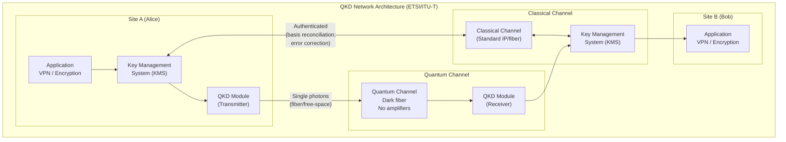
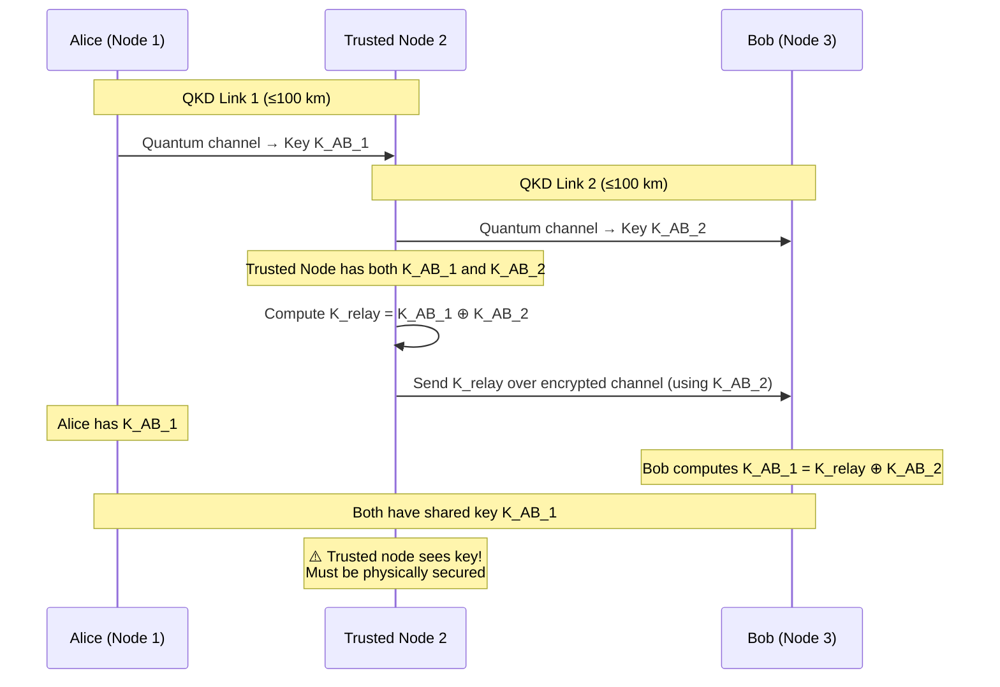
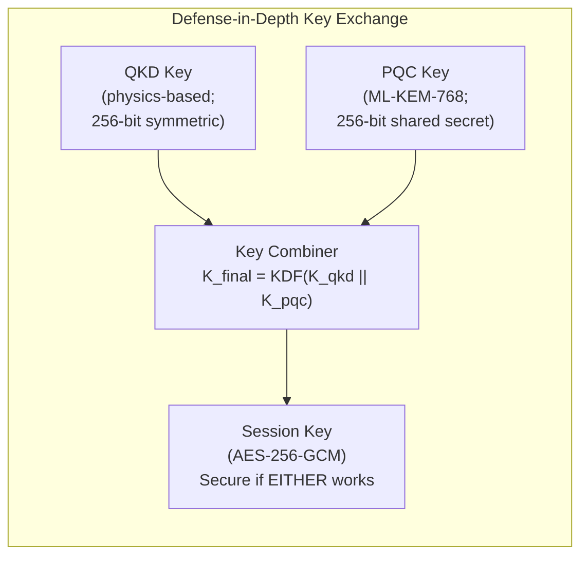

# Quantum Key Distribution (QKD) — ETSI & ISO Standards

**Standards:** ETSI GS QKD 001-015 Series | ISO/IEC 23837:2023 | ITU-T Y.3800 | ITU-T X.1714  
**Title:** Quantum Key Distribution Standards, Protocols, and Deployment Frameworks  
**SDOs:** ETSI ISG-QKD; ISO/IEC JTC 1/SC 27; ITU-T SG13/SG17  
**Domain:** Quantum-safe key exchange; physical-layer security; quantum networking  
**Audience:** Network security architects, quantum communication engineers, telco planners, government security officials  
**Prerequisites:** Quantum mechanics basics (superposition; measurement; no-cloning theorem); optical communication; key management; symmetric encryption (OTP/AES)

---

## Chapter 1 — Historical Context & Origin Story

### 1.1 Timeline

| Year | Milestone |
|------|-----------|
| 1984 | **BB84 protocol** published (Bennett & Brassard) — first QKD protocol |
| 1991 | E91 protocol (Ekert) — entanglement-based QKD |
| 1992 | B92 protocol (Bennett) — simplified 2-state QKD |
| 2000 | First commercial QKD system (MagiQ Technologies) |
| 2004 | First bank-to-bank QKD link (Vienna; id Quantique) |
| 2007 | DARPA Quantum Network (BBN) — 10-node QKD network |
| 2010 | Tokyo QKD Network (NICT) — multi-node metropolitan |
| 2013 | ETSI ISG-QKD established (Industry Specification Group) |
| 2014 | ETSI GS QKD 002: QKD use cases |
| 2016 | China launches Micius satellite (first quantum satellite; 1200 km QKD) |
| 2017 | **Beijing-Shanghai quantum link** (2,000 km; 32 trusted nodes) |
| 2018 | ETSI GS QKD 004: Application interface (API) |
| 2020 | EU EuroQCI initiative launched (European Quantum Communication Infrastructure) |
| 2023 | ISO/IEC 23837:2023 published (QKD security requirements) |
| 2024 | ITU-T Y.3800-series framework published; EuroQCI testbeds operational |

### 1.2 Fundamental Principle

**Quantum Key Distribution** distributes symmetric keys between two parties (Alice & Bob) using quantum physics properties:

| Principle | How QKD Uses It |
|:---------:|:---:|
| **No-cloning theorem** | An eavesdropper (Eve) cannot copy an unknown quantum state without disturbing it |
| **Measurement disturbs state** | Any interception of qubits introduces detectable errors |
| **Information-theoretic security** | Security proven from physics (not computational assumptions) — secure even against quantum computers |

**Key distinction:** QKD ≠ quantum computing. QKD uses quantum COMMUNICATION (single photons) to exchange keys. The keys are then used with classical symmetric encryption (AES/OTP).

---

## Chapter 2 — QKD Protocols

### 2.1 BB84 (Bennett-Brassard 1984)

| Step | Alice (Sender) | Bob (Receiver) | Eve (Eavesdropper) |
|:----:|:---:|:---:|:---:|
| 1 | Generates random bits and random bases (rectilinear ⊕ or diagonal ⊗) | — | — |
| 2 | Encodes each bit as a polarized single photon | — | — |
| 3 | — | Measures each photon in random basis (⊕ or ⊗) | If intercepts: measures in random basis → disturbs state |
| 4 | Publicly announces bases used (NOT bit values) | Announces bases used | Knows bases but damage already done |
| 5 | Both DISCARD bits where bases didn't match (~50% discarded) | Same | — |
| 6 | Compare subset of remaining bits (QBER check) | Same | If QBER > threshold (~11%) → Eve detected; abort |
| 7 | Apply error correction + privacy amplification → Final shared key | Same | Cannot reconstruct key |

**Quantum Bit Error Rate (QBER):** If Eve intercepts (measure-resend attack), she introduces ~25% error rate. Threshold for abort: typically 11% (accounts for channel noise).

### 2.2 E91 (Ekert 1991) — Entanglement-Based

| Aspect | Description |
|:------:|-------------|
| **Mechanism** | Source generates entangled photon pairs (Bell states). Alice gets one; Bob gets other |
| **Security basis** | Bell inequality violation proves no local hidden variable → no eavesdropper has pre-determined values |
| **Advantage** | Source can be untrusted (even in Eve's hands); security from non-local correlations |
| **Test** | CHSH inequality: $S = |E(a,b) - E(a,b') + E(a',b) + E(a',b')| \leq 2$ classically; quantum allows $S \leq 2\sqrt{2}$ |

### 2.3 Continuous-Variable QKD (CV-QKD)

| Aspect | Detail |
|:------:|--------|
| **Encoding** | Information in amplitude/phase quadratures of coherent laser pulses (not single photons) |
| **Detection** | Homodyne/heterodyne detection (standard telecom detectors; no single-photon detectors needed) |
| **Advantage** | Compatible with standard telecom infrastructure; lower cost; room-temperature detectors |
| **Limitation** | Shorter range than DV-QKD (~50-80 km without trusted nodes) |
| **Protocols** | GG02 (Grosshans-Grangier 2002); no-switching protocol |

### 2.4 Protocol Comparison

| Protocol | Encoding | Detection | Range | Key Rate | Hardware |
|:--------:|:--------:|:---------:|:-----:|:--------:|:--------:|
| BB84 | Discrete (polarization) | Single-photon detectors (SPD) | ~100-300 km | ~kbps-Mbps | Expensive SPDs |
| E91 | Entanglement | SPD | ~100 km (fiber) | ~kbps | Entangled source + SPD |
| CV-QKD | Continuous (coherent states) | Homodyne | ~50-80 km | ~Mbps | Standard telecom |
| DPS (Differential Phase Shift) | Phase | SPD | ~100 km | ~kbps | Simpler setup |
| MDI-QKD | Measurement-Device-Independent | SPD (untrusted) | ~400 km | ~bps-kbps | Removes detector side-channels |

---

## Chapter 3 — ETSI QKD Standards Series

### 3.1 ETSI ISG-QKD Document Catalog

| Document | Title | Status | Content |
|:--------:|:-----:|:------:|---------|
| **GS QKD 002** | Use Cases | Published (2010; rev 2019) | Application scenarios; threat models |
| **GS QKD 003** | Components and Internal Interfaces | Published (2010) | QKD system internal architecture |
| **GS QKD 004** | Application Interface | Published (2020) | REST API for key delivery to applications |
| **GS QKD 005** | Security Proofs | Published (2010) | Framework for security proof methodology |
| **GS QKD 007** | Vocabulary | Published (2018) | Terminology definitions |
| **GS QKD 008** | QKD Module Security Specification | Published (2010) | Hardware module security requirements |
| **GS QKD 011** | Component Characterization | Published (2016) | Photon source; detector; channel specifications |
| **GS QKD 012** | Device and Communication Channel Parameters | Published (2019) | Optical parameters; fiber specs |
| **GS QKD 014** | Protocol and Data Format | Published (2019) | Key management protocol; data structures |
| **GS QKD 015** | Control Interface | Published (2022) | Network management; monitoring |
| **GS QKD 018** | Orchestration Interface | Draft (2024) | SDN integration; multi-vendor orchestration |

### 3.2 ETSI GS QKD 004 — Application Interface (Key Delivery API)

This standard defines how applications REQUEST and RECEIVE quantum-distributed keys:

| Endpoint | Method | Parameters | Returns |
|:--------:|:------:|:----------:|:-------:|
| `/api/v1/keys/{slave_SAE_ID}/enc_keys` | GET | `number`; `size` | Key IDs + key material |
| `/api/v1/keys/{slave_SAE_ID}/dec_keys` | GET | `key_IDs` | Key material for specific IDs |
| `/api/v1/keys/{slave_SAE_ID}/status` | GET | — | Key store status; available keys; QBER |

**Architecture:**
```
Application (Alice) ↔ QKD Module A ↔ [Quantum Channel] ↔ QKD Module B ↔ Application (Bob)
      ↕                                                                        ↕
  KMS Interface (ETSI 004 API)                                    KMS Interface (ETSI 004 API)
```

### 3.3 ETSI GS QKD 014 — Protocol and Data Format

| Component | Specification |
|:---------:|---------------|
| Key format | 256-bit symmetric keys (default); configurable size |
| Key ID | UUID (128-bit; globally unique identifier per key) |
| Metadata | Timestamp; QBER; key source; quality indicator |
| Transport | REST/JSON over authenticated TLS (classical channel) |
| Key lifecycle | Generated → Stored → Delivered → Used → Destroyed |

---

## Chapter 4 — ISO/IEC 23837:2023 — QKD Security Requirements

### 4.1 Standard Structure

| Part | Title | Focus |
|:----:|:-----:|-------|
| **Part 1** | General requirements | Security framework; threat model; evaluation criteria |
| **Part 2** | Test and evaluation methods | Conformance testing; side-channel evaluation |

### 4.2 Security Requirements (Part 1)

| Category | Requirements |
|:--------:|--------------|
| **Quantum channel** | Single-photon source characterization; photon number splitting (PNS) resistance; wavelength; timing |
| **Classical channel** | Authenticated classical communication; integrity protection |
| **Key management** | Secure key storage; key lifecycle; key derivation |
| **Side channels** | Detector blinding resistance; Trojan-horse attack protection; backflash protection |
| **Implementation** | Random number quality (QRNG); privacy amplification completeness |
| **Physical security** | Tamper evidence; environmental monitoring |

### 4.3 Known QKD Attacks (Addressed by Standards)

| Attack | Description | Standard Mitigation |
|:------:|-------------|:---:|
| **Photon Number Splitting (PNS)** | Eve splits multi-photon pulses; measures one copy | Decoy states (vacuum + weak pulses); monitor count rate |
| **Detector blinding** | Eve blinds SPDs with bright light; controls detection outcomes | Detector monitoring; random detection basis verification |
| **Trojan horse** | Eve sends light into Alice's device to probe internal state | Optical isolators; watchdog detectors; power monitoring |
| **Time-shift** | Eve exploits detector timing differences | Detector efficiency mismatch correction; random timing |
| **Intercept-resend** | Eve measures and resends (introduces QBER) | QBER monitoring; abort if above threshold (~11%) |
| **Man-in-the-middle** | Eve impersonates both parties on classical channel | Pre-shared authentication; out-of-band identity verification |

---

## Chapter 5 — ITU-T Standards

### 5.1 ITU-T Y.3800 Series — Quantum Key Distribution Networks

| Document | Title | Content |
|:--------:|:-----:|---------|
| **Y.3800** | Framework for QKD networks | Architecture; functional elements; reference points |
| **Y.3801** | Functional requirements for QKDN | Node functions; key relay; routing |
| **Y.3802** | QKD network control and management | SDN-based control plane; monitoring |
| **Y.3803** | Key management for QKDN | Key lifecycle; supply; demand matching |
| **Y.3804** | Network model for QKDN | Topology; interconnection; interworking with classical |

### 5.2 ITU-T X.1714 — Security Framework for QKD

| Aspect | Specification |
|:------:|---------------|
| **Threat analysis** | Comprehensive threat model for QKD networks |
| **Security services** | Confidentiality; authentication; integrity; non-repudiation (via QKD-derived keys) |
| **Trust model** | Trusted node model; partially-trusted model; device-independent model |
| **Key relay** | Secure key relay through trusted intermediate nodes |
| **Interoperability** | QKD network interconnection security requirements |

### 5.3 QKD Network Architecture (ITU-T Y.3800)

| Layer | Function | Components |
|:-----:|:--------:|------------|
| **Application layer** | Key consumption; encryption; application logic | VPN; voice encryption; database encryption |
| **Key management layer** | Key lifecycle; key relay; routing; supply/demand | Key Management System (KMS) |
| **Quantum layer** | Quantum key generation; point-to-point QKD | QKD transmitter/receiver modules |
| **Classical layer** | Authentication; error correction; privacy amplification | Classical optical/IP channels |

---

## Chapter 6 — QKD Network Deployments

### 6.1 Major Deployments Worldwide

| Deployment | Country | Length | Nodes | Year | Technology |
|:----------:|:-------:|:------:|:-----:|:----:|:----------:|
| **Beijing-Shanghai backbone** | China | 2,000 km | 32 trusted nodes | 2017 | BB84; decoy state |
| **Micius satellite link** | China/Austria | 7,600 km (satellite) | Ground stations | 2017 | Satellite QKD (BB84) |
| **Tokyo QKD Network** | Japan | Metropolitan (~100 km) | 6 nodes | 2010/2015 | Multiple protocols |
| **EuroQCI** | EU (27 states) | Pan-European | Planned: all capitals | 2020-2027 | Fiber + satellite |
| **UK Quantum Network** | UK | ~125 km (Bristol-Cambridge) | 8 nodes | 2018-2022 | CV-QKD; DV-QKD |
| **SwissQuantum** | Switzerland | 67 km | 3 nodes (Geneva) | 2009-2011 | id Quantique BB84 |
| **SECOQC** | Austria/EU | Metropolitan (Vienna) | 6 nodes | 2008 | Multi-protocol |
| **South Korea (SK Telecom)** | South Korea | ~200 km | Multiple | 2016-2021 | Commercial QKD |

### 6.2 China's Quantum Network

| Aspect | Detail |
|--------|--------|
| **Scale** | World's largest: 2,000 km backbone + 4,600 km total network (2024) |
| **Beijing-Shanghai** | 32 trusted relay nodes; fiber-optic; BB84 with decoy states |
| **Satellite** | Micius (Mozi) satellite: 500 km orbit; demonstrated 1,200 km ground-to-ground via satellite relay |
| **Applications** | Government communications; banking (ICBC; CEB); power grid control |
| **Key rate** | ~kbps per link (sufficient for AES key refresh) |
| **Trusted nodes** | Limitation: intermediate nodes see keys in plaintext → physical security critical |
| **Future** | Twin-field QKD (500+ km without trusted nodes); quantum repeaters (~2030) |

### 6.3 EuroQCI (European Quantum Communication Infrastructure)

| Aspect | Detail |
|--------|--------|
| **Scope** | All 27 EU member states + EEA; fiber ground segment + satellite (EAGLE-1; SAGA) |
| **Timeline** | Phase 1 (2020-2024): testbeds; national pilots. Phase 2 (2025-2027): pan-European integration |
| **Satellites** | EAGLE-1 (ESA/SES): 2025 launch; low-Earth orbit QKD demo. SAGA: 2027 launch; operational |
| **Use cases** | Government secure communications; critical infrastructure; diplomatic channels |
| **Funding** | €1B+ (Digital Europe Programme; Connecting Europe Facility; Horizon Europe) |
| **Architecture** | Hybrid: fiber metropolitan/backbone + satellite inter-city links |

---

## Chapter 7 — QKD vs. PQC Comparison

| Aspect | QKD | PQC (ML-KEM/ML-DSA) |
|:------:|:---:|:---:|
| **Security basis** | Physics (quantum mechanics) | Mathematics (lattice problems) |
| **Security type** | Information-theoretic (unconditional) | Computational (assumes problem hardness) |
| **Infrastructure** | Requires quantum channel (fiber/satellite; specialized hardware) | Works on existing infrastructure (software) |
| **Cost** | Very high ($100K-$1M per link) | Low (software update) |
| **Range** | ~100-300 km (fiber); unlimited with satellite | Unlimited (standard internet) |
| **Scalability** | Limited (point-to-point; requires trusted nodes for distance) | Highly scalable (any IP network) |
| **Deployment** | Niche (government; military; critical infrastructure) | Universal (all internet communications) |
| **Key type** | Symmetric keys only (for AES/OTP) | Asymmetric (signatures; key exchange) |
| **Authentication** | Requires pre-shared secret OR PQC for initial authentication | Self-contained (public key infrastructure) |
| **Maturity** | Commercial products exist; limited deployment | Standardized 2024; mass deployment beginning |

### When to Use QKD vs. PQC

| Use Case | Recommendation |
|:--------:|:--------------:|
| General internet (TLS; SSH; email) | **PQC** (scalable; cost-effective) |
| Government top-secret links | **QKD + PQC** (defense in depth) |
| Financial inter-bank backbone | **QKD** (highest assurance for fixed links) |
| Military command-and-control | **QKD + PQC** (multiple security layers) |
| IoT / consumer devices | **PQC** (QKD impractical for constrained devices) |
| Submarine cable (inter-continental) | **PQC** (QKD range limitation; no trusted undersea nodes) |
| Metropolitan government network | **QKD** (within range; high-value) |

---

## Chapter 8 — Architecture Diagrams

### 8.1 QKD Network Architecture



### 8.2 Trusted Node Key Relay



### 8.3 QKD + PQC Hybrid Architecture



---

## Chapter 9 — Case Studies

### 9.1 ICBC (Industrial and Commercial Bank of China) — QKD for Banking

| Aspect | Detail |
|--------|--------|
| **Deployment** | QKD link between ICBC data centers in Shanghai (~60 km) |
| **Purpose** | Secure inter-data-center key exchange for transaction encryption |
| **Technology** | id Quantique QKD system; BB84 with decoy states |
| **Key rate** | ~10 kbps (sufficient to refresh AES keys every few seconds) |
| **Application** | Keys used for AES-256 encryption of inter-DC database replication |
| **Justification** | Banking regulations require highest-assurance encryption; quantum-safe from day one |
| **Challenge** | Key rate insufficient for encrypting ALL traffic directly; QKD provides KEY REFRESH, not bulk encryption |
| **Solution** | QKD generates AES keys; classical encryption with QKD-derived keys protects the data |

### 9.2 South Korean Government Network (SK Telecom)

| Aspect | Detail |
|--------|--------|
| **Deployment** | National quantum-secured government backbone (2022) |
| **Coverage** | 48 government agencies; ~200 km backbone |
| **Technology** | Korean-made QKD systems + id Quantique |
| **Integration** | Integrated with existing government VPN infrastructure |
| **Key management** | Centralized quantum KMS with ETSI QKD 004 API |
| **Lesson** | Demonstrated that QKD can integrate with existing government IT without replacing entire infrastructure; QKD provides KEY LAYER, applications unchanged |

---

## Chapter 10 — Future Evolution

| Trend | Description | Timeline |
|:-----:|-------------|:--------:|
| **Quantum repeaters** | Overcome distance limitation without trusted nodes (entanglement swapping; quantum memory) | 2028-2035 |
| **Twin-field QKD** | 500+ km without repeaters (phase-matching; sending-or-not-sending protocol) | 2024-2027 |
| **Satellite QKD constellation** | LEO/MEO constellations for global quantum key distribution | 2025-2030 |
| **QKD-as-a-Service** | Cloud-like offering: rent quantum-secured links (telcos providing QKD) | 2025-2028 |
| **Chip-scale QKD** | Integrated photonic QKD on silicon chips (smaller; cheaper; mass-produced) | 2026-2030 |
| **Device-independent QKD** | Security without trusting the QKD hardware (Bell test in every session) | 2028-2035 |
| **QKD + 5G/6G** | Integration of QKD key distribution with mobile network security | 2026-2030 |
| **Standardization convergence** | ETSI + ISO + ITU-T unified framework for global interoperability | 2025-2027 |

---

## Chapter 11 — Interview Questions & Career Guide

### Tier 1: Entry-Level

**Q1:** What is QKD and how does it differ from PQC?

**A:** QKD (Quantum Key Distribution) uses quantum physics (single photons; no-cloning theorem) to distribute symmetric encryption keys between two parties. Any eavesdropping is physically detectable. Security is information-theoretic (proven from laws of physics). PQC (Post-Quantum Cryptography) uses mathematical algorithms (lattice problems) that are believed to be hard for quantum computers. Security is computational (relies on problem hardness assumptions). Key differences: (1) QKD needs special hardware (quantum channel); PQC is software-only. (2) QKD produces symmetric keys only; PQC provides asymmetric operations (signatures; key exchange). (3) QKD is point-to-point (~100 km range); PQC works over any network distance. (4) QKD gives unconditional security; PQC security could theoretically be broken by unknown algorithm advances.

### Tier 2: Mid-Level

**Q2:** Explain the trusted node problem in QKD networks and potential solutions.

**A:** QKD works point-to-point over limited distance (~100-300 km in fiber; signal loss increases with distance → key rate drops to zero). For longer distances, QKD networks use "trusted relay nodes": Node A shares key K1 with trusted node T; T shares key K2 with Node B; T relays by XORing or encrypting. **Problem:** The trusted node has access to the key in plaintext. If compromised (physically or via insider), all keys through that node are exposed. China's 2,000 km backbone has 32 trusted nodes — each is a security-critical point.

**Solutions:**
- **Twin-Field QKD:** Extends to 500+ km without intermediate trusted nodes (demonstrated 2022-2024; phase-matching protocols)
- **Quantum repeaters:** Use quantum memory + entanglement swapping to extend distance without trusting intermediate nodes. Theoretically unlimited distance. Status: lab demonstrations only; practical deployment ~2030+
- **Satellite QKD:** Bypass fiber distance limits via space; satellite is the "trusted node" (must be physically secured, but under launch-party control)
- **MDI-QKD (Measurement-Device-Independent):** Removes trust requirement from the measurement device (middle node measures but cannot learn the key)

### Tier 3: Senior

**Q3:** Design a quantum-secured metropolitan network for a financial district (10 banks; 30 km diameter; 10 Gbps data; millisecond latency requirements). Include cost model, key consumption, and fallback strategy.

**A:**

| Parameter | Design |
|:---------:|--------|
| **Topology** | Hub-and-spoke: central quantum exchange node + 10 QKD links (one per bank). Each link: dedicated dark fiber pair (quantum channel) + classical fiber pair. Hub location: carrier-neutral data center in financial district center |
| **QKD technology** | CV-QKD (Toshiba or id Quantique Clavis systems): suitable for metropolitan range (30 km max); uses standard telecom components; lower cost than DV-QKD |
| **Key rate** | ~100 kbps per link (CV-QKD at 30 km distance). Sufficient for: AES-256 key refresh every 2.56 ms per link ($100,000 / 256 = 390$ keys/sec × 256 bits/key = 100 kbps) |
| **Key consumption model** | 10 Gbps data × AES-256 key per 1 MB frame = 10,000 keys/sec. QKD provides 390 keys/sec → key buffer + less frequent rekeying (every 256 MB → 390 keys/sec sufficient for ~100 Gbps with hourly rekey) |
| **Encryption** | AES-256-GCM with QKD-derived keys. Key stored in HSM; refreshed by QKD module continuously |
| **Classical fallback** | If QKD link fails: fall back to PQC (ML-KEM-768) key exchange. Automatic failover; alert security team. QKD outage does NOT stop communications — just degrades to PQC-level security |
| **High availability** | Dual QKD systems per link (primary + backup). Ring topology backup: if hub fails, banks can establish peer-to-peer QKD over secondary fiber routes |
| **Cost model** | QKD system per endpoint: ~$150K. Dark fiber per link (~15 km avg): ~$50K/year. Hub infrastructure: ~$500K. Total CAPEX: ~$2M. Annual OPEX: ~$800K. Per-bank: ~$200K initial + $80K/year |
| **Compliance** | Meets: ISO/IEC 23837 (QKD security); ETSI GS QKD 004 (API); PCI-DSS 4.0 (key management); local financial regulations |
| **Timeline** | Design: 3 months. Fiber provisioning: 6 months. Installation: 3 months. Testing: 3 months. Production: month 15 |

---

## Chapter 12 — Cheat Sheet & Quick Reference

```
═══════════════════════════════════════════
QKD STANDARDS — QUICK REFERENCE
═══════════════════════════════════════════

WHAT: Quantum Key Distribution — uses physics
  to distribute symmetric encryption keys.
  
SECURITY: Information-theoretic (unconditional)
  — secure even against quantum computers.

═══════════════════════════════════════════
KEY STANDARDS:
  ETSI GS QKD 002: Use cases
  ETSI GS QKD 004: Application interface (API)
  ETSI GS QKD 014: Protocol & data format
  ETSI GS QKD 015: Control interface
  ISO/IEC 23837: Security requirements
  ITU-T Y.3800: Network framework
  ITU-T X.1714: Security framework

═══════════════════════════════════════════
PROTOCOLS:
  BB84: Prepare-and-measure (polarization)
  E91: Entanglement-based (Bell test)
  B92: Simplified 2-state
  CV-QKD: Continuous-variable (coherent states)
  MDI-QKD: Measurement-device-independent
  TF-QKD: Twin-field (500+ km)

═══════════════════════════════════════════
TYPICAL PARAMETERS:
  Range: 50-300 km (fiber); 1000+ km (satellite)
  Key rate: ~kbps to ~Mbps (distance-dependent)
  QBER threshold: ~11% (abort if exceeded)
  Output: 256-bit symmetric keys (for AES/OTP)

═══════════════════════════════════════════
KEY ATTACKS & MITIGATIONS:
  PNS (multi-photon) → Decoy states
  Detector blinding → Monitoring; random detection
  Trojan horse → Optical isolators
  Intercept-resend → QBER monitoring
  MITM (classical) → Pre-shared auth / PQC

═══════════════════════════════════════════
DEPLOYMENTS:
  China: 2,000 km backbone + Micius satellite
  EU: EuroQCI (27 states; fiber + satellite)
  Japan: Tokyo QKD Network
  South Korea: Gov backbone (SK Telecom)
  UK: Quantum Network Hub

═══════════════════════════════════════════
QKD vs PQC:
  QKD: Physics-based; special hardware; P2P;
       limited range; symmetric keys only;
       unconditional security.
  PQC: Math-based; software; scalable;
       any distance; asymmetric ops;
       computational security.
  
  USE BOTH for defense-in-depth on critical links.

═══════════════════════════════════════════
LIMITATIONS:
  • Distance (~100-300 km fiber without repeater)
  • Trusted nodes see keys (security gap)
  • Low key rate (kbps; not for bulk encryption)
  • High cost ($100K-$1M per link)
  • Point-to-point only (not broadcast/multicast)
  • Cannot do signatures (symmetric keys only)
```

---

*End of Document — 06_QKD_ETSI_ISO_Standards.md*
