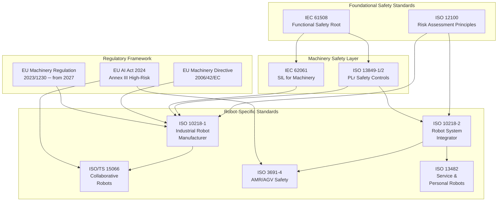
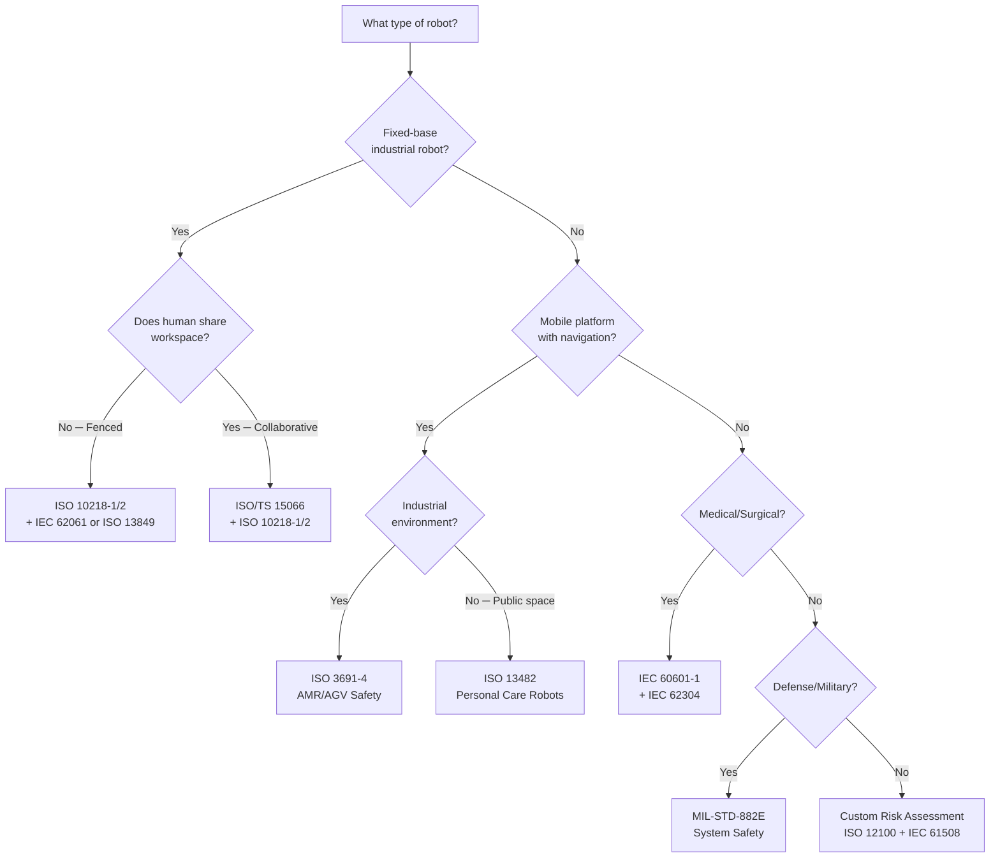
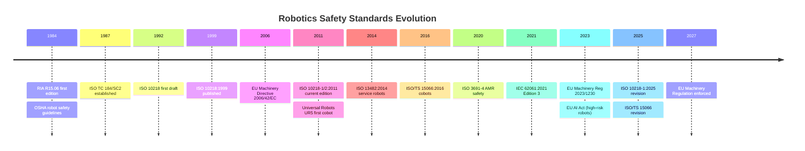
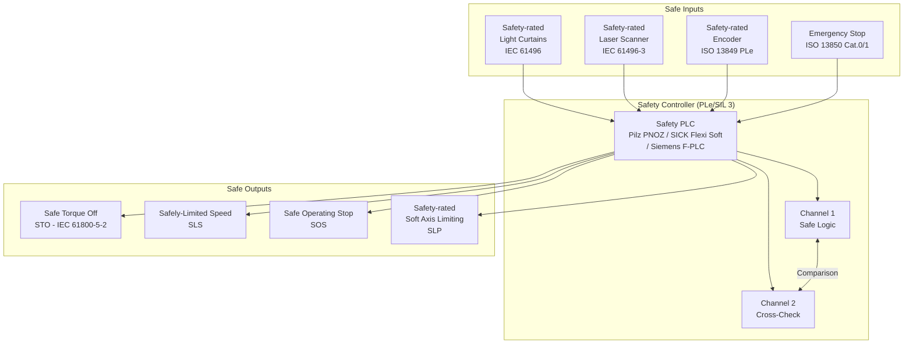

# Robotics Safety & Collaborative Systems — Standards Overview

**Category:** 25 — Robotics Safety & Collaborative Systems  
**Document:** 00 — Standards Landscape Overview  
**Scope:** Full landscape of robotics safety standards across industrial, collaborative, mobile, and service robots  
**Key Standards:** ISO 10218, ISO/TS 15066, ISO 13849, IEC 62061, ISO 3691-4, ISO 13482  
**Audience:** Robotics safety engineers, system integrators, cobot developers, AMR fleet architects  
**Prerequisites:** Functional safety fundamentals (IEC 61508 / ISO 13849)

---

## Chapter 1 — Why Robotics Safety Standards Exist

### 1.1 The Human Cost of Robot-Related Incidents

Since the first industrial robot deployment in 1961, robots have caused fatalities, serious injuries, and near-misses that fundamentally shaped the safety landscape:

| Year | Incident | Fatalities | Impact |
|------|----------|-----------|--------|
| 1979 | Robert Williams at Ford Flat Rock | 1 | First robot fatality; triggered OSHA investigations |
| 1981 | Kenji Urada at Kawasaki (Japan) | 1 | Robot arm pushed worker into grinding machine |
| 2001 | ABB robot collision (UK) | 0 (serious injury) | Triggered HSE intervention in UK manufacturing |
| 2015 | Volkswagen Baunatal (Germany) | 1 | Worker crushed by robot installing metal plate |
| 2018 | Amazon warehouse robots | 0 (24 injuries) | High-density AMR safety zone failures |
| 2023 | Amazon BQN1 facility (NJ) | 0 (severe injury) | Robot hit worker who entered active zone |
| 2024 | Tesla Optimus development incident | 0 (reported) | Highlighted humanoid robot standard gaps |

**Global statistics (2020-2025):**
- ~2,700 robot-related injuries per year in USA alone (OSHA data)
- 36 robot-related fatalities in EU since 2010 (Eurostat)
- AMR incidents increasing 40% year-over-year as deployments scale

### 1.2 Standards Ecosystem Architecture

### 1.3 Standard Selection Decision Tree

---

## Chapter 2 — Complete Robotics Standards Universe

### 2.1 Master Standards Table

| Standard | Full Title | Year | Scope | Robot Types | SDO |
|----------|-----------|------|-------|-------------|-----|
| ISO 10218-1 | Robots — Industrial safety: Robot (manufacturer) | 2011/2025 | Robot arm hardware safety | Industrial fixed | ISO TC 299 |
| ISO 10218-2 | Robots — Industrial safety: Robot system (integrator) | 2011/2025 | Cell design, integration | Industrial systems | ISO TC 299 |
| ISO/TS 15066 | Collaborative robots — Safety requirements | 2016 | Human-robot collaboration | Cobots | ISO TC 299 |
| ISO 13849-1 | Safety of machinery — SRP/CS PLr | 2023 | Safety control systems | All machinery | ISO TC 199 |
| ISO 13849-2 | Safety of machinery — Validation | 2012 | Validation procedures | All machinery | ISO TC 199 |
| IEC 62061 | Safety of machinery — SRECS SIL | 2021 | Electrical safety systems | All machinery | IEC TC 44 |
| ISO 12100 | Safety of machinery — Risk assessment | 2010 | Risk assessment principles | All machinery | ISO TC 199 |
| ISO 3691-4 | Industrial trucks — Driverless trucks | 2020 | AMR/AGV navigation safety | AMR, AGV | ISO TC 110 |
| ISO 13482 | Personal care robots — Safety | 2014 | Service/personal robots | Type A, B, C | ISO TC 299 |
| ISO 9283 | Performance criteria | 1998 | Robot positioning accuracy | Industrial | ISO TC 299 |
| ANSI/RIA R15.06 | Robot safety (USA) | 2012 | US harmonized standard | Industrial | RIA/ANSI |
| ANSI/RIA R15.606 | Collaborative robots (USA) | 2016 | US cobot safety | Cobots (USA) | RIA/ANSI |
| ISO/TR 20218-1 | End-effectors for collaborative robots | 2018 | Gripper safety | Cobot tools | ISO TC 299 |
| UL 3300 | Safety for robotic equipment | 2022 | US-specific mobile robot | AMR (USA) | UL |
| VDI 2510 | AGV system guidelines | 2005+ | German AGV engineering | AGV/AMR | VDI |

### 2.2 Regulatory Framework Table

| Regulation | Region | Scope | Effective | Impact on Robots |
|-----------|--------|-------|-----------|-----------------|
| EU Machinery Directive 2006/42/EC | EU/EEA | CE marking for machines | Current | Requires ISO 10218 conformity |
| EU Machinery Regulation 2023/1230 | EU/EEA | Replaces Directive | Jan 2027 | AI-based machinery requirements added |
| EU AI Act 2024 | EU/EEA | AI system regulation | Aug 2024+ | Autonomous robots = high-risk AI (Annex III) |
| OSHA 29 CFR 1910.217 | USA | Mechanical power presses | Current | Robot safety in manufacturing |
| UK PUWER 1998 | UK | Work equipment safety | Current | Robot maintenance & use requirements |
| ANSI/RIA R15.06 | USA | Robot safety national standard | 2012 | OSHA-recognized consensus standard |

### 2.3 Standards Development Timeline

---

## Chapter 3 — Robot Classification by Safety Standard

### 3.1 Classification Matrix

| Robot Type | Example | Primary Standard | Secondary Standards | Safety Level |
|-----------|---------|-----------------|--------------------| -------------|
| Traditional Industrial | FANUC M-20iD, ABB IRB 6700 | ISO 10218-1/2 | IEC 62061, ISO 13849 | SIL 2-3 / PLd-PLe |
| Collaborative (Cobot) | UR10e, KUKA LBR iiwa | ISO/TS 15066 | ISO 10218-1/2, ISO 13849 | PLd (typically) |
| AMR (Warehouse) | Locus Robotics, Amazon Proteus | ISO 3691-4 | ISO 13849, UL 3300 | PLc-PLd |
| AGV (Guided) | Dematic, Swisslog | ISO 3691-4 | ANSI B56.5 | PLc-PLd |
| Service Robot | SoftBank Pepper | ISO 13482 Type A | ISO 12100 | Case-specific |
| Personal Carrier | Toyota i-REAL | ISO 13482 Type C | ISO 12100 | Case-specific |
| Surgical Robot | Intuitive da Vinci | IEC 60601-1 | IEC 62304, ISO 13482 | Class III medical |
| Agricultural | John Deere autonomous | ISO 25119 | ISO 10218, ISO 3691-4 | AgPL a-d |
| Military/Defense | PackBot, Spot (military) | MIL-STD-882E | IEC 61508 | MIL-specific HRI |
| Humanoid (emerging) | Tesla Optimus, Figure 01 | No specific standard yet | ISO 12100, ISO 10218 concept | TBD |

### 3.2 Collaborative vs. Non-Collaborative Criteria

A robot system is **collaborative** when:
1. Robot and human share workspace **simultaneously**
2. At least one of four ISO/TS 15066 collaborative modes is active
3. Risk assessment demonstrates tolerable residual risk for human contact

**Collaborative operation modes (ISO/TS 15066):**

| Mode | Abbreviation | Description | Typical Use Case |
|------|-------------|-------------|-----------------|
| Safety-Rated Monitored Stop | SRMS | Robot stops when human enters; resumes when clear | Shared workspace, sequential tasks |
| Hand Guiding | HG | Human physically guides robot; force sensing active | Teaching, manual positioning |
| Speed and Separation Monitoring | SSM | Robot speed adapts to human proximity | Dynamic shared workspace |
| Power and Force Limiting | PFL | Contact allowed within biomechanical limits | Close collaboration, assembly |

---

## Chapter 4 — Functional Safety Architecture for Robots

### 4.1 SIL vs PLr Mapping

| ISO 13849 PLr | IEC 62061 SIL | PFH [1/h] Range | Typical Robot Application |
|---------------|---------------|-----------------|--------------------------|
| PLa | — | ≥ 10⁻⁵ to < 10⁻⁴ | Non-critical: status indication |
| PLb | — | ≥ 3×10⁻⁶ to < 10⁻⁵ | Low-risk: speed display |
| PLc | SIL 1 | ≥ 10⁻⁶ to < 3×10⁻⁶ | Medium: AMR collision avoidance |
| PLd | SIL 2 | ≥ 10⁻⁷ to < 10⁻⁶ | High: cobot force limiting |
| PLe | SIL 3 | ≥ 10⁻⁸ to < 10⁻⁷ | Very high: safety-rated stop |

### 4.2 Safety Control System Architecture

### 4.3 Key Safety Functions for Robots

| Safety Function | Standard Reference | PLr Typical | Description |
|----------------|-------------------|-------------|-------------|
| Emergency Stop | ISO 13850, ISO 10218-1 Cl.5.5 | PLd/PLe | Category 0 or 1 stop |
| Protective Stop | ISO 10218-1 Cl.5.4 | PLd | Category 1 or 2 stop, restartable |
| Safe Torque Off (STO) | IEC 61800-5-2 | PLe/SIL 3 | Remove motor torque |
| Safely-Limited Speed (SLS) | IEC 61800-5-2 | PLd/SIL 2 | Monitor max speed |
| Safe Operating Stop (SOS) | IEC 61800-5-2 | PLd | Monitor standstill (torque on) |
| Safely-Limited Position (SLP) | IEC 61800-5-2 | PLd | Monitor axis limits |
| Speed & Separation Monitoring | ISO/TS 15066 | PLd | Dynamic distance monitoring |
| Power & Force Limiting | ISO/TS 15066 | PLd | Contact force limiting |
| Protective Field Monitoring | ISO 3691-4 | PLd | AMR zone detection |

---

## Chapter 5 — EMC & Environmental Standards

### 5.1 EMC Requirements

| Standard | Scope | Test Type | Robot Application |
|----------|-------|-----------|-------------------|
| IEC 61000-6-2 | Industrial immunity | Radiated/conducted immunity | Robot controller |
| IEC 61000-6-4 | Industrial emissions | Radiated/conducted emissions | Robot in factory |
| IEC 61000-4-2 | ESD | Contact/Air discharge | Teach pendant, HMI |
| IEC 61000-4-3 | RF field | 80-1000 MHz immunity | Safety sensors |
| IEC 61000-4-4 | Fast transients (EFT) | Burst on power/signal | Motor drives |
| IEC 61000-4-5 | Surge | ±2 kV power, ±1 kV signal | Power supply unit |
| IEC 61000-4-6 | Conducted RF | 150 kHz–80 MHz | Communication buses |

### 5.2 Environmental Testing (Robot Systems)

| Standard | Test | Typical Spec for Robot |
|----------|------|----------------------|
| IEC 60068-2-1 | Cold | Operating: -10°C; Storage: -25°C |
| IEC 60068-2-2 | Dry heat | Operating: +45°C; Storage: +55°C |
| IEC 60068-2-14 | Temperature change | 5°C/min rate of change |
| IEC 60068-2-6 | Vibration (sinusoidal) | 10–150 Hz, 2g (mounted controller) |
| IEC 60068-2-27 | Shock | 15g, 11ms half-sine |
| IEC 60529 | IP rating | IP54 (robot arm); IP67 (wash-down) |

---

## Chapter 6 — Certification & Market Access

### 6.1 CE Marking Path for Robots

### 6.2 Certification Bodies

| Body | Region | Scope | Typical Cost |
|------|--------|-------|------|
| TÜV SÜD | EU/Global | ISO 10218, ISO 13849, CE | €20K–€80K |
| TÜV Rheinland | EU/Global | Full machinery certification | €25K–€90K |
| UL (Underwriters Lab) | USA/Global | UL 3300, ANSI/RIA R15.06 | $15K–$60K |
| PILZ | EU | Safety concept review, CE | €15K–€50K |
| SICK Safety Services | EU | Safety system validation | €10K–€40K |
| Bureau Veritas | Global | Machinery Directive CE | €20K–€70K |
| CSA Group | Canada/USA | CSA Z434, UL 1740 | $15K–$50K |

---

## Chapter 7 — Future Trends (2025–2030)

### 7.1 Emerging Standards

| Development | Timeline | Impact |
|-------------|----------|--------|
| ISO 10218-1:2025 revision | 2025 | AMR integration; higher-payload cobots |
| ISO/TS 15066 revision | 2025-2026 | New biomechanical data; whole-body contact |
| EU Machinery Regulation 2023/1230 | Enforcement 2027 | AI machinery; digital documentation |
| EU AI Act + robots | 2025-2027 | Autonomous robots as high-risk AI systems |
| ISO AWI 21789 | 2026-2028 | AI-based machine safety (under development) |
| ANSI/RIA R15.08 | 2025 | Mobile industrial robots (USA revision) |
| Humanoid robot standard | 2027+ | No standard yet; Tesla Optimus, Figure driving need |

### 7.2 Technology-Driven Gaps

1. **Foundation models in robots**: LLMs/VLMs controlling motion — no safety certification path exists
2. **Humanoid robots**: Full-body contact scenarios not covered by ISO/TS 15066 body-region table
3. **Swarm robotics**: Multi-robot coordination safety — ISO 3691-4 addresses single units only
4. **Cloud-based control**: Latency-critical safety functions over network (5G/TSN) — no standard
5. **Predictive maintenance AI**: Using ML to predict failure vs. deterministic SIL/PLr

---

## Chapter 8 — Quick Reference Card

### Key Numbers to Remember

| Parameter | Value | Source |
|-----------|-------|--------|
| Max quasi-static force (hand) | 140 N | ISO/TS 15066 Annex A |
| Max transient force (hand) | 280 N | ISO/TS 15066 Annex A |
| Max quasi-static pressure (hand) | 190 N/cm² | ISO/TS 15066 Annex A |
| Robot stopping category 0 | Immediate power removal | IEC 60204-1 |
| Robot stopping category 1 | Controlled stop, then power off | IEC 60204-1 |
| Robot stopping category 2 | Controlled stop, power on (SOS) | IEC 60204-1 |
| PLe PFH range | < 10⁻⁷ per hour | ISO 13849-1 |
| SIL 3 PFH range | ≥ 10⁻⁸ to < 10⁻⁷ | IEC 62061 |
| AMR protective field reaction | < 100ms typically | ISO 3691-4 concept |
| MTTFD for PLe Category 4 | ≥ 30 years each channel | ISO 13849-1 |

---

*Document Version: 1.0 | Last Updated: May 2026 | Author: Technology Standards Team*
