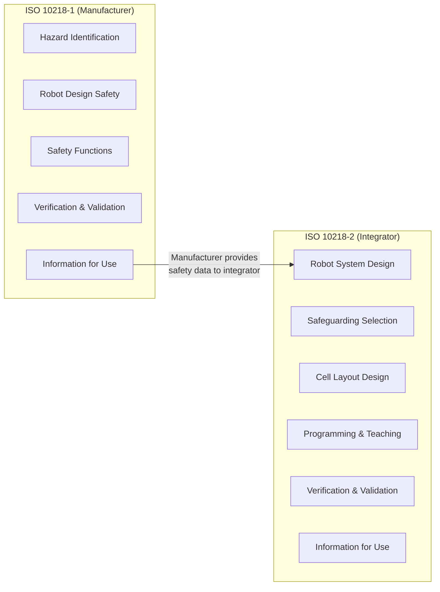
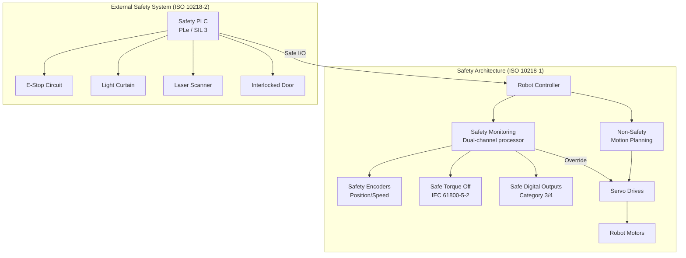

# ISO 10218 — Industrial Robot Safety (Parts 1 & 2)

**Category:** 25 — Robotics Safety  
**Standard ID:** ISO 10218-1:2011 / ISO 10218-2:2011 (revision 2025 in progress)  
**Governing Body:** ISO TC 299 — Robotics  
**Status:** Active (Edition 2: 2011); Edition 3 under development (target 2025)  
**Applies To:** Industrial robot manufacturers (Part 1) and robot system integrators (Part 2)  
**Last Updated in this Guide:** 2026

---

## Chapter 1 — Historical Context & Origin Story

### 1.1 Why This Standard Was Created

The need for ISO 10218 was driven directly by fatalities:

- **1979 — Robert Williams** at Ford Motor Company's Flat Rock, Michigan plant became the first human killed by an industrial robot. A robot arm struck him while retrieving parts from a storage rack. No safety fence, no presence detection.
- **1981 — Kenji Urada** at Kawasaki Heavy Industries (Japan) was pushed into a grinding machine by a malfunctioning robot arm during maintenance.
- By the mid-1980s, OSHA recorded dozens of serious robot-related injuries annually.

**Pre-standard era:**
- Robots operated without systematic safety analysis
- Ad-hoc fencing with no standardized distances or detection methods
- No clear division of responsibility between robot manufacturer and system integrator
- Manual lockout/tagout was the only formal safety procedure

### 1.2 Timeline of Revisions

| Version | Year | Key Changes |
|---------|------|-------------|
| RIA R15.06-1986 | 1986 | First US robot safety standard (ANSI) |
| ISO 10218:1992 | 1992 | First ISO international robot safety standard |
| ISO 10218-1:2006 | 2006 | Split into Part 1 (manufacturer) and Part 2 (integrator concept) |
| ISO 10218-1:2011 | 2011 | Current edition; collaborative operation clause; three-position enabling |
| ISO 10218-2:2011 | 2011 | Current edition; robot system/cell integration requirements |
| ISO 10218-1:2025 (draft) | 2025 | Adds AMR, higher-payload cobots, AI machinery references |

### 1.3 Key Stakeholders

| Organization | Role in Standard Development |
|-------------|------------------------------|
| KUKA | Robot manufacturer input; European market perspective |
| FANUC | Japanese manufacturing automation perspective |
| ABB | Large industrial robot fleet operations expertise |
| Universal Robots | Collaborative robot manufacturer; ISO/TS 15066 liaison |
| Pilz GmbH | Safety system provider; implementation expertise |
| TÜV SÜD / Rheinland | Certification body perspective |
| SICK AG | Safety sensor manufacturer input |
| ISO TC 299 | Technical committee for robotics |

---

## Chapter 2 — Standard Architecture & Structure

### 2.1 Two-Part Structure



### 2.2 Part 1 — Robots (Manufacturer Obligations)

**Clause Structure:**

| Clause | Title | Content |
|--------|-------|---------|
| 4 | Hazard identification | Sources of robot hazards (mechanical, electrical, thermal) |
| 5 | Safety requirements & protective measures | Core technical requirements |
| 5.2 | Robot stopping functions | Emergency stop, protective stop |
| 5.3 | Speed control | Speed monitoring, reduced speed mode (≤250 mm/s) |
| 5.4 | Collaborative operation | Requirements for 4 modes (references ISO/TS 15066) |
| 5.5 | Singularity protection | Joint limits, workspace boundaries |
| 5.6 | Axis limiting | Safety-rated soft axis and space limiting |
| 5.7 | Robot drive power | Power limitation, enable switch requirements |
| 5.8 | Pendant design | Three-position enabling device, emergency stop |
| 6 | Verification & validation | Test methods, documentation |
| 7 | Information for use | User manual, safety data sheet |

### 2.3 Part 2 — Robot Systems (Integrator Obligations)

**Clause Structure:**

| Clause | Title | Content |
|--------|-------|---------|
| 4 | Hazard identification | System-level hazards (beyond single robot) |
| 5 | Safety requirements | Cell design, access prevention |
| 5.2 | Robot installation | Mounting, services, environment |
| 5.3 | Safeguard design | Perimeter, interlocking, presence sensing |
| 5.4 | Robot programs & end-effectors | Tool safety, workpiece handling |
| 5.5 | Collaborative operations | System-level cobot integration |
| 5.6 | Control interface | Safety PLC integration, muting, bypassing |
| 6 | Verification & validation | System-level testing |
| 7 | Information for use | Operating instructions, maintenance schedule |

### 2.4 Scope Boundaries

**IN SCOPE:**
- Industrial manipulator robots (articulated, SCARA, delta, cartesian)
- Collaborative robot hardware and safety functions
- Robot controllers and teach pendants
- End-effectors (when attached to robot system)
- Robot system/cell design and integration

**EXPLICITLY OUT OF SCOPE:**
- Non-industrial robots (covered by ISO 13482 for service/personal care)
- Mobile robots / AMRs (covered by ISO 3691-4)
- Military robots (MIL-STD-882E)
- Surgical robots (IEC 60601 series)
- Toy robots (EN 71)

---

## Chapter 3 — Technical Deep Dive

### 3.1 Robot Stopping Functions

ISO 10218-1 Clause 5.5 defines stopping functions aligned with IEC 60204-1:

| Stop Category | Behavior | Power State | Use Case |
|--------------|----------|-------------|----------|
| Category 0 | Immediate removal of power to actuators | Power OFF | Emergency stop (E-stop) |
| Category 1 | Controlled deceleration, then power off | Power OFF after stop | Protective stop (inertia management) |
| Category 2 | Controlled deceleration, power remains | Power ON (monitored) | Collaborative pause, SOS condition |

**Emergency Stop Requirements (ISO 10218-1 Cl. 5.5.2):**
- Must be Category 0 or Category 1
- Red/yellow mushroom-head pushbutton (IEC 60947-5-5)
- Must override all other controls
- Self-latching (manual reset required)
- Hardwired (not software-only)

### 3.2 Safety-Rated Functions

| Function | Abbreviation | ISO 10218-1 Reference | Required PLr |
|----------|-------------|----------------------|--------------|
| Emergency Stop | E-Stop | Cl. 5.5.2 | PLd minimum |
| Protective Stop | P-Stop | Cl. 5.5.3 | PLd minimum |
| Safety-rated monitored stop | SRMS | Cl. 5.4.2 | PLd |
| Safety-rated soft axis limiting | SLP | Cl. 5.6 | PLd |
| Safety-rated speed monitoring | SLS | Cl. 5.3 | PLd |
| Enabling device (3-position) | — | Cl. 5.8.3 | PLc minimum |
| Safety-rated space limiting | — | Cl. 5.6.2 | PLd |

### 3.3 Three-Position Enabling Device

The teach pendant must have a three-position enabling device:

```
Position 1 (released):     Robot cannot move (safe state)
Position 2 (mid-press):    Robot enabled for manual operation (T1/T2 mode)
Position 3 (fully pressed): Robot cannot move (panic reaction = safe state)
```

**Critical design requirement:** Transition from position 2→3 (panic squeeze) MUST trigger a Category 0 or Category 1 stop. This is a PLe-level safety function.

### 3.4 Operating Modes

| Mode | Speed Limit | Personnel Access | Safeguards |
|------|------------|-----------------|------------|
| T1 (Manual reduced speed) | ≤ 250 mm/s | Operator in cell | Enabling device required |
| T2 (Manual high speed) | Full speed | Special authorization | Enabling device + special key |
| Automatic | Full speed | No access permitted | Perimeter safeguarding active |
| Collaborative | Per ISO/TS 15066 | Human in workspace | SRMS / SSM / PFL / HG |

### 3.5 Safeguarding Methods (Part 2)

| Method | Standard | Application | Minimum PLr |
|--------|----------|-------------|-------------|
| Fixed guards (fences) | ISO 14120 | Permanent barrier | N/A (physical) |
| Interlocked guards | ISO 14119 | Access doors with lock | PLd-PLe |
| Light curtains | IEC 61496-1/2 | Finger/hand/body detection | Type 2-4 (SIL 1-3) |
| Safety laser scanners | IEC 61496-3 | Area monitoring (floor) | Type 3 (SIL 2) |
| Pressure-sensitive mats | IEC 61496-4 | Floor sensing | Type 1-3 |
| Safety-rated vision | IEC 62998 (draft) | Camera-based detection | Under development |
| Two-hand control | ISO 13851 | Operator at station | PLc |

### 3.6 Minimum Safeguarding Distances

Per ISO 13855, minimum distance for safeguards:

**Formula: S = (K × T) + C**

Where:
- **S** = minimum distance [mm]
- **K** = approach speed (1600 mm/s for body, 2000 mm/s for hand)
- **T** = total response time [s] (sensor + controller + robot stopping)
- **C** = additional distance for detection capability [mm]

**Example calculation:**
```
Light curtain (body detection):
K = 1600 mm/s
T = 0.050s (sensor) + 0.020s (PLC) + 0.200s (robot stop) = 0.270s
C = 850 mm (per ISO 13855 Table 1 for ≤40mm resolution)

S = (1600 × 0.270) + 850 = 432 + 850 = 1,282 mm minimum
```

---

## Chapter 4 — Implementation Guide

### 4.1 Robot Controller Safety Architecture



### 4.2 Robot Selection for Safety Compliance

| Robot | Manufacturer | Safety Certification | Max Payload | PLr Achieved |
|-------|-------------|---------------------|-------------|--------------|
| FANUC CRX-10iA | FANUC | ISO 10218-1, ISO/TS 15066 | 10 kg | PLd Cat 3 |
| UR10e | Universal Robots | ISO 10218-1, ISO/TS 15066 | 12.5 kg | PLd Cat 3 |
| KUKA LBR iiwa | KUKA | ISO 10218-1, ISO/TS 15066 | 14 kg | PLd Cat 3 |
| ABB YuMi (IRB 14000) | ABB | ISO 10218-1, ISO/TS 15066 | 0.5 kg | PLd Cat 3 |
| ABB GoFa CRB 15000 | ABB | ISO 10218-1, ISO/TS 15066 | 5 kg | PLd Cat 3 |
| FANUC M-20iD/25 | FANUC | ISO 10218-1 (industrial) | 25 kg | PLe Cat 4 |
| ABB IRB 6700 | ABB | ISO 10218-1 (industrial) | 150-300 kg | PLe Cat 4 |

### 4.3 CE Marking Documentation Package

For ISO 10218-2 compliance (integrator), the technical file must contain:

1. **Risk Assessment** (ISO 12100)
   - Hazard identification worksheet
   - Risk estimation (severity × probability × avoidance)
   - Risk reduction measures applied
   - Residual risk statement

2. **Safety Concept Document**
   - Safety function list (SF-001, SF-002, etc.)
   - PLr/SIL allocation per function
   - Safety architecture block diagram
   - SISTEMA calculation files

3. **Electrical Schematics**
   - Safety circuit diagrams
   - Emergency stop circuit routing
   - Safety I/O wiring

4. **Validation Report**
   - Stopping time measurements
   - Stopping distance measurements
   - Force/pressure measurements (if collaborative)
   - Safety function test protocols

5. **EU Declaration of Conformity**
   - Applicable directives
   - Harmonized standards applied
   - Notified Body (if required)

---

## Chapter 5 — Certification & Audit

### 5.1 Common Audit Findings

| Finding | Clause | Frequency | Impact |
|---------|--------|-----------|--------|
| Stopping time not measured | 5.5 | Very Common | Cannot calculate safeguarding distance |
| T2 mode accessible without key | 5.3 | Common | Unauthorized high-speed access |
| Enabling device cable too long | 5.8 | Common | Operator positioned outside safe zone |
| Space limiting not configured | 5.6 | Common | Robot can reach beyond intended workspace |
| Insufficient information for user | 7 | Very Common | Manual missing safety function description |
| Protective stop not Cat 1 | 5.5.3 | Occasional | Uncontrolled motion during stop |
| No residual risk documented | 5.1 | Common | Incomplete risk assessment |

### 5.2 Typical Audit Questions

**For Robot Manufacturer (Part 1):**
1. "Show me the safety function list and achieved PLr for each function."
2. "What is the measured stopping time at maximum speed and maximum payload?"
3. "How is the three-position enabling device fail-safe designed?"
4. "What diagnostic coverage is implemented for the safety encoder?"
5. "How do you handle single-fault tolerance in the safety monitoring hardware?"

**For System Integrator (Part 2):**
1. "Show me the risk assessment with residual risk statement."
2. "What safeguarding distance calculation was used and what assumptions for approach speed?"
3. "How is the safety PLC connected to the robot controller safety I/O?"
4. "What is the muting logic for material entry points?"
5. "How do you prevent defeat of interlocked guards?"

---

## Chapter 6 — Comparison with Related Standards

| Feature | ISO 10218 | ANSI/RIA R15.06 | ISO/TS 15066 | ISO 3691-4 |
|---------|-----------|-----------------|--------------|------------|
| Scope | Industrial robots | Industrial robots (USA) | Collaborative robots | Mobile robots/AMR |
| PLr allocation | References ISO 13849 | References ISO 13849 | References ISO 13849 | References ISO 13849 |
| Collaborative modes | Clause 5.4 (brief) | Clause (brief) | Full 4-mode detail | Not applicable |
| Force limits | References TS 15066 | References TS 15066 | Annex A biomechanical | Not applicable |
| Mobile robots | Out of scope | Out of scope | Out of scope | Primary scope |
| CE marking basis | Yes (Machinery Dir.) | Not directly (US) | Supports CE | Yes (Machinery Dir.) |
| Stopping functions | Cat 0/1/2 defined | Cat 0/1/2 aligned | Cat 2 focus | Cat 0/1 + field stop |

---

## Chapter 7 — Interview Questions

### Tier 1: Entry-Level (0-3 years)
1. What is the difference between ISO 10218 Part 1 and Part 2?
2. Name the three robot stopping categories and their power states.
3. What is the three-position enabling device and why is it important?
4. What is the maximum speed in T1 mode?
5. What is the formula for minimum safeguarding distance?

### Tier 2: Mid-Level (3-8 years)
1. How do you calculate the total system response time for a safeguarding distance calculation?
2. Explain the relationship between ISO 10218, ISO 13849, and IEC 62061.
3. When would you use a light curtain vs. a safety laser scanner?
4. What documentation is required in the technical file for CE marking?
5. How does mode selection (T1/T2/Auto) affect safeguarding requirements?

### Tier 3: Senior/Lead (8-15 years)
1. How would you design a hybrid cell with both collaborative and high-speed industrial zones?
2. Explain the transition from EU Machinery Directive to Machinery Regulation and its impact on existing installations.
3. How do you validate safety-rated soft axis limiting across the robot workspace?
4. What is your approach to residual risk assessment when ISO/TS 15066 force limits are close to threshold?
5. How do you handle multi-robot cell safety architecture with shared stop zones?

### Tier 4: Principal/Distinguished (15+ years)
1. How should ISO 10218 evolve to address AI-controlled robot motion planning?
2. What safety architecture would you propose for humanoid robots not covered by current standards?
3. How do you balance productivity vs. safety in high-mix/low-volume collaborative cells?
4. Discuss the implications of EU AI Act Annex III classification on robot system CE marking.
5. How would you design a safety case for a Level 3 autonomous mobile manipulator in a public space?

---

*Document Version: 1.0 | Last Updated: May 2026 | Author: Technology Standards Team*
