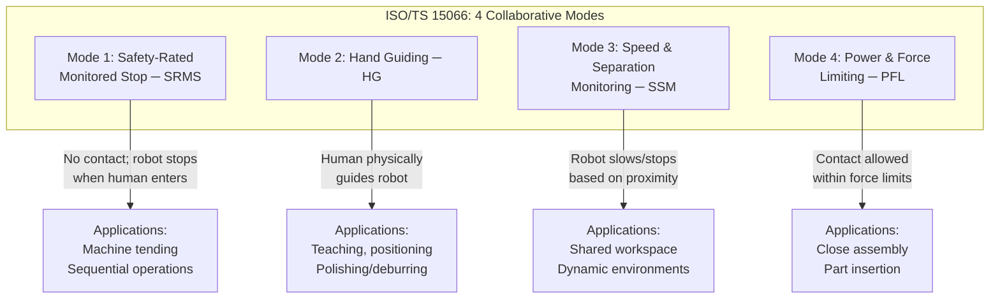
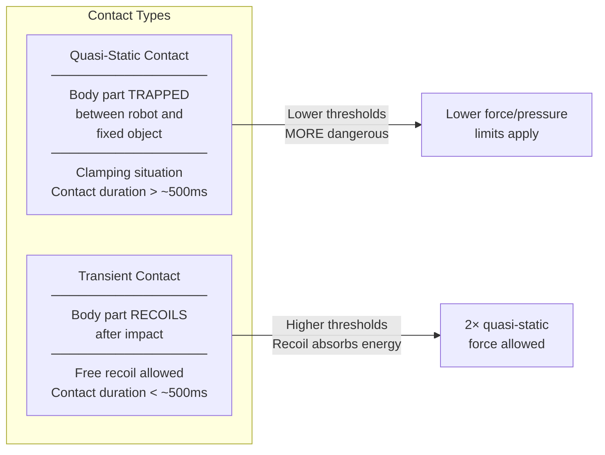
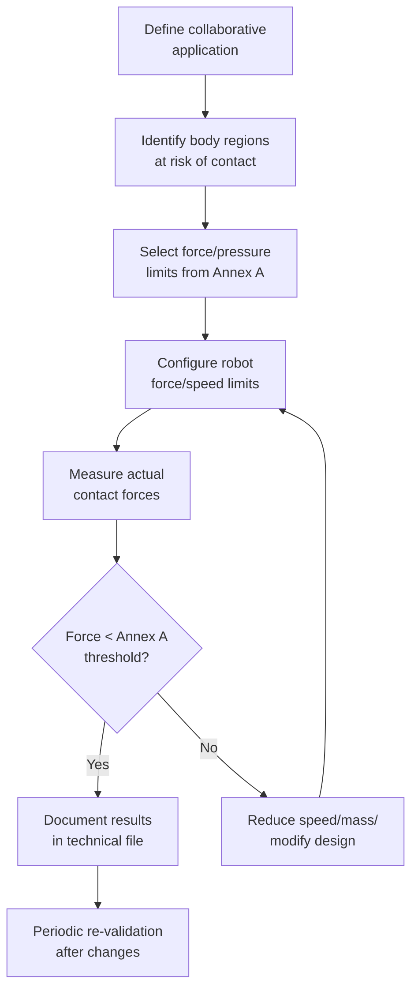
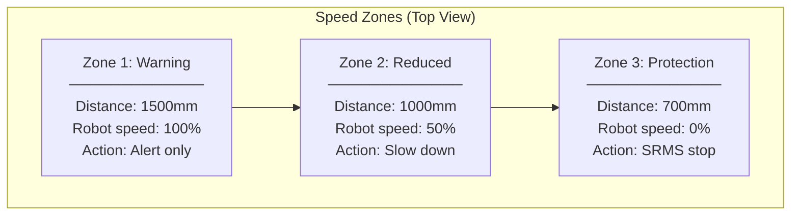

# ISO/TS 15066 — Collaborative Robots Safety Requirements

**Category:** 25 — Robotics Safety  
**Standard ID:** ISO/TS 15066:2016  
**Governing Body:** ISO TC 299 — Robotics  
**Status:** Active (Technical Specification); revision in progress (2025-2026)  
**Applies To:** Collaborative robot manufacturers, integrators, end-users  
**Last Updated in this Guide:** 2026

---

## Chapter 1 — Historical Context & Origin Story

### 1.1 Why This Standard Was Created

ISO 10218:2011 introduced the concept of collaborative operation (Clause 5.4) but lacked the technical detail for implementation. Engineers needed:
- **Quantified force/pressure limits** for human-robot contact
- **Specific methodologies** for each collaborative mode
- **Biomechanical data** defining pain/injury thresholds per body region
- **Measurement methods** for validation

The cobot market exploded from 2010 onwards (Universal Robots UR5 in 2008, KUKA LBR iiwa in 2013) but had no consensus on "how much force is acceptable?"

### 1.2 Key Driving Factors

| Factor | Detail |
|--------|--------|
| Market demand | SMEs wanting flexible automation without fencing |
| Technology | Torque sensors + compliant actuators enabling force control |
| Productivity | 50% floor space reduction without fences |
| Research | University of Mainz biomechanical studies (2010-2014) |
| Regulatory gap | Insurers and certification bodies demanding quantified limits |

---

## Chapter 2 — The Four Collaborative Operation Modes

### 2.1 Mode Overview



### 2.2 Mode 1: Safety-Rated Monitored Stop (SRMS)

**Principle:** Robot comes to a complete stop before human enters collaborative workspace. Robot does NOT move while human is present.

**Requirements:**
- Safety-rated stop function (SOS per IEC 61800-5-2)
- Monitoring of standstill condition (PLd minimum)
- Presence detection to identify when human is in workspace
- Robot can resume automatically when workspace is clear (no manual reset)

**Key distinction from Emergency Stop:**
- SRMS is Category 2 stop (power remains, position monitored)
- E-Stop is Category 0/1 (power removed)
- SRMS is resumable without operator intervention

### 2.3 Mode 2: Hand Guiding (HG)

**Principle:** Human directly guides robot by grasping guiding device. Robot provides force/position feedback.

**Requirements:**
- Dedicated guiding device (handle) on end-effector or tool flange
- Emergency stop within immediate reach of operator
- Safety-rated speed limitation during guiding
- Force-feedback (gravity compensation, path recording)
- When guiding device released: safety-rated monitored stop

**Applications:** Path teaching, collaborative polishing, human-in-the-loop operations.

### 2.4 Mode 3: Speed and Separation Monitoring (SSM)

**Principle:** Robot continuously monitors distance to nearest human and adjusts speed to maintain minimum protective separation distance.

**Minimum Protective Separation Distance Formula:**

$$S_p(t_0) = S_h + S_r + S_s + C + Z_d + Z_r$$

Where:
- $S_h$ = human contribution to distance (speed × time)
- $S_r$ = robot stopping distance
- $S_s$ = robot response time contribution
- $C$ = intrusion distance (sensor detection capability)
- $Z_d$ = position uncertainty of human detection
- $Z_r$ = position uncertainty of robot

**Speed reduction logic:**
```
If distance(human, robot) < Sp:
    reduce robot speed (or stop)
If distance(human, robot) ≥ Sp:
    robot may operate at higher speed (up to full)
```

**Sensor Technologies:**
- Safety-rated laser scanners (IEC 61496-3): floor plane monitoring
- Safety-rated 3D cameras (IEC 62998 draft): volumetric monitoring  
- Safety-rated radar: emerging for SSM applications

### 2.5 Mode 4: Power and Force Limiting (PFL)

**Principle:** Robot design and control ensure that contact forces/pressures between robot and human remain below injury thresholds defined in Annex A.

**Requirements:**
- Robot capable of measuring or limiting contact forces
- Contact detection and reaction (typically < 10ms)
- Validated force/pressure values per body region
- Distinction between **quasi-static** and **transient** contact

---

## Chapter 3 — Biomechanical Threshold Table (Annex A)

### 3.1 The Complete Table

This is the most critical data in ISO/TS 15066. These values define the maximum allowable force and pressure during human-robot contact:

| Body Region | Quasi-Static Force [N] | Quasi-Static Pressure [N/cm²] | Transient Force [N] | Transient Pressure [N/cm²] |
|-------------|----------------------|------------------------------|--------------------|-----------------------------|
| Skull / forehead | 130 | 130 | 260 | 260 |
| Face | 65 | 110 | 130 | 220 |
| Neck (front) | 150 | 190 | 300 | 380 |
| Neck (side/back) | 150 | 190 | 300 | 380 |
| Back/shoulders | 210 | 170 | 420 | 340 |
| Chest | 140 | 140 | 280 | 280 |
| Abdomen | 110 | 110 | 220 | 220 |
| Pelvis | 180 | 180 | 360 | 360 |
| Upper arm / elbow | 150 | 190 | 300 | 380 |
| Forearm / wrist | 160 | 220 | 320 | 440 |
| Hand / fingers | 140 | 190 | 280 | 380 |
| Thigh / knee | 220 | 180 | 440 | 360 |
| Lower leg | 130 | 170 | 260 | 340 |

### 3.2 Quasi-Static vs. Transient Contact



**Key insight:** Transient limits are approximately **2× the quasi-static limits** because the human body can recoil and absorb impact energy. Quasi-static (clamping) is far more dangerous because energy accumulates.

### 3.3 Measurement Methods

**Force/Torque measurement instruments:**
- ATI Industrial Automation force/torque sensors
- HBM force transducers
- PRMS (Power and Force Limiting Measurement System) per ISO/TS 15066 Clause 5.5

**Measurement setup:**
```
Test apparatus:
├── Spring-damper system (simulates human body compliance)
│   ├── Spring constant: per body region (75-150 N/mm)
│   └── Effective mass: per body region (0.6-75 kg)
├── Force measurement: ≥1000 Hz sampling rate
├── Contact surface: specified area per body region
└── Recording: peak force, quasi-static force, pressure calculation
```

---

## Chapter 4 — Implementation by Robot Manufacturer

### 4.1 How Major Cobots Implement PFL

| Robot | Force Sensing Method | Max TCP Force (setting) | Reaction Time | Body Region Default |
|-------|---------------------|----------------------|---------------|-------------------|
| UR10e | Joint current monitoring + ext. F/T | 100-250 N configurable | < 10ms | Hand/arm defaults |
| KUKA LBR iiwa | Joint torque sensors (7 axes) | Per-joint limits | < 5ms | Full body mapping |
| ABB YuMi | Dual-arm current monitoring | 150 N collision detect | < 20ms | Hand/finger |
| FANUC CRX-10iA | Joint torque sensors | Configurable per mode | < 8ms | UR-style defaults |
| ABB GoFa CRB 15000 | Smart sensor skin + torque | 110-140 N configurable | < 10ms | Hand/arm |
| Doosan M1013 | 6 joint torque sensors | Configurable | < 10ms | Full body |

### 4.2 Validation Process



### 4.3 Effective Mass Calculation

For PFL mode, the energy transferred during collision depends on effective mass:

$$E = \frac{1}{2} \cdot m_{eff} \cdot v^2$$

Where effective mass includes:
- Robot arm moving mass at contact configuration
- Payload mass
- End-effector mass

**Design strategies to reduce effective mass:**
1. Use lightweight end-effectors (carbon fiber, 3D printed)
2. Limit speed in high-payload configurations
3. Position contact point far from base (lower effective mass at extended reach)
4. Use compliant covers/padding (reduces peak pressure)

---

## Chapter 5 — Speed and Separation Monitoring Detail

### 5.1 Protective Separation Distance Calculation

**Complete formula (ISO/TS 15066 Clause 5.4.3):**

$$S_p(t_0) = v_H \cdot (T_R + T_S) + v_R \cdot T_R + C + Z_s + Z_r + B$$

| Parameter | Symbol | Typical Value | Source |
|-----------|--------|---------------|--------|
| Human walking speed | $v_H$ | 1.6 m/s (per ISO 13855) | Worst case approach |
| Robot TCP speed | $v_R$ | Application dependent | Robot controller |
| Reaction time (sensor) | $T_R$ | 40-100 ms | Sensor datasheet |
| Stopping time (robot) | $T_S$ | 100-500 ms | Robot brake spec |
| Intrusion distance | $C$ | Sensor resolution dependent | IEC 61496 |
| Sensor uncertainty | $Z_s$ | ±50 mm typical | Sensor calibration |
| Robot position uncertainty | $Z_r$ | ±10 mm | Encoder accuracy |
| Robot braking distance | $B$ | Speed × $T_S$ | Measured |

### 5.2 Practical Example

```
Application: UR10e with safety laser scanner
─────────────────────────────────────────────
v_H = 1.6 m/s (human)
v_R = 1.0 m/s (robot max in collaborative)
T_R = 0.062s (SICK microScan3 reaction time)
T_S = 0.150s (UR10e stopping at 1 m/s)
C = 0.085m (62mm resolution + body allowance)
Z_s = 0.050m (scanner uncertainty)
Z_r = 0.010m (UR encoder uncertainty)
B = v_R × T_S = 1.0 × 0.150 = 0.150m

Sp = 1.6 × (0.062 + 0.150) + 1.0 × 0.062 + 0.085 + 0.050 + 0.010 + 0.150
   = 1.6 × 0.212 + 0.062 + 0.295
   = 0.339 + 0.062 + 0.295
   = 0.696m ≈ 700mm minimum separation
```

### 5.3 Zone-Based SSM Implementation



---

## Chapter 6 — Practical Application Examples

### 6.1 Assembly Application (PFL Mode)

**Scenario:** Human and cobot assemble automotive components together.

| Parameter | Value | Justification |
|-----------|-------|---------------|
| Body regions at risk | Hand, forearm | Operator reaches into shared space |
| Max quasi-static force | 140 N (hand) | Annex A, Table A.2 |
| Max transient force | 280 N (hand) | Annex A, Table A.2 |
| Robot TCP speed | 250 mm/s | Balance productivity vs. impact energy |
| Payload | 3 kg | Part weight + gripper |
| Effective mass | 5.2 kg | Robot config + payload |
| Padding on gripper | 10mm foam | Reduces peak pressure |

### 6.2 Machine Tending Application (SRMS Mode)

**Scenario:** Cobot loads/unloads CNC machine; operator approaches to inspect parts.

| Parameter | Value | Justification |
|-----------|-------|---------------|
| Collaborative mode | SRMS (Mode 1) | No contact intended; operator may enter zone |
| Detection | Safety laser scanner (floor) | SICK microScan3 Pro |
| Stop PLr | PLd, Category 2 | Robot holds position, monitored |
| Restart | Automatic when zone clear | ISO/TS 15066 Cl. 5.4.2 |
| Non-collaborative speed | 1000 mm/s | When workspace is clear |

---

## Chapter 7 — Comparison with Alternative Approaches

| Aspect | ISO/TS 15066 (PFL) | Traditional Fencing | Force-Limited by Design |
|--------|---------------------|--------------------|-----------------------|
| Human contact | Allowed (within limits) | Prevented entirely | Allowed (inherent limit) |
| Productivity | High (shared workspace) | High (full speed, no sharing) | Medium (low mass/speed) |
| Floor space | Minimal (no fence) | Large (2m+ clearance) | Minimal |
| Flexibility | High (reconfigurable) | Low (fixed infrastructure) | High |
| Max payload | Limited by force equation | Unlimited | Very limited (< 2kg) |
| Validation effort | Significant (force testing) | Lower (distance calc) | Lower (inherent safety) |
| Cost | Robot + sensors | Robot + fencing + interlock | Specialized cobot hardware |

---

## Chapter 8 — Known Gaps & Future Evolution

### 8.1 Current Limitations of Annex A

1. **Limited body region data:** Thresholds based on studies of ~100 subjects; limited age/gender diversity
2. **Single-point contact assumption:** Distributed contact (e.g., arm against robot surface) not well-addressed
3. **Repetitive contact:** Annex A assumes single-event impact; repeated low-force contacts not studied
4. **Payload shape:** Sharp edges vs. rounded surfaces — pressure depends on geometry, not fully addressed
5. **Dynamic populations:** Values for typical adults; no specific data for elderly, children, or people with medical conditions

### 8.2 Upcoming Revision (2025-2026)

Expected changes in ISO/TS 15066 revision:
- Extended biomechanical data from larger study populations
- Whole-body contact scenarios (humanoid robots)
- Higher payload collaborative operations (>25 kg)
- Integration with EU AI Act requirements for autonomous behavior
- Updated sensor technology requirements (3D safety cameras)
- Harmonization with IEC 62998 (safety-rated camera detection)

---

## Chapter 9 — Interview Questions

### Tier 1: Entry-Level
1. Name the four collaborative operation modes in ISO/TS 15066.
2. What is the difference between quasi-static and transient contact?
3. What is the maximum quasi-static force allowed for the hand/fingers?
4. Why are transient limits approximately 2× the quasi-static limits?

### Tier 2: Mid-Level
1. Calculate the minimum protective separation distance for a specific SSM scenario.
2. How do you select which body region to use from Annex A for a given application?
3. What measurement equipment and setup is required to validate PFL compliance?
4. Explain the effective mass concept and how it affects allowable TCP speed.

### Tier 3: Senior/Lead
1. How do you handle a scenario where multiple body regions may be contacted simultaneously?
2. Discuss the limitations of current biomechanical data and how you address uncertainty.
3. Design a hybrid cell using PFL for close work and SSM for transit paths.
4. How do you validate force limits across the entire robot workspace (not just test points)?

### Tier 4: Principal
1. What changes would you propose to Annex A for humanoid robot applications?
2. How should ISO/TS 15066 evolve to address AI-predicted human motion in SSM?
3. Discuss the gap between EN ISO 13849 PLd and the actual safety integrity needed for PFL.
4. How do you reconcile ISO/TS 15066 with EU AI Act requirements for self-learning cobots?

---

*Document Version: 1.0 | Last Updated: May 2026 | Author: Technology Standards Team*
