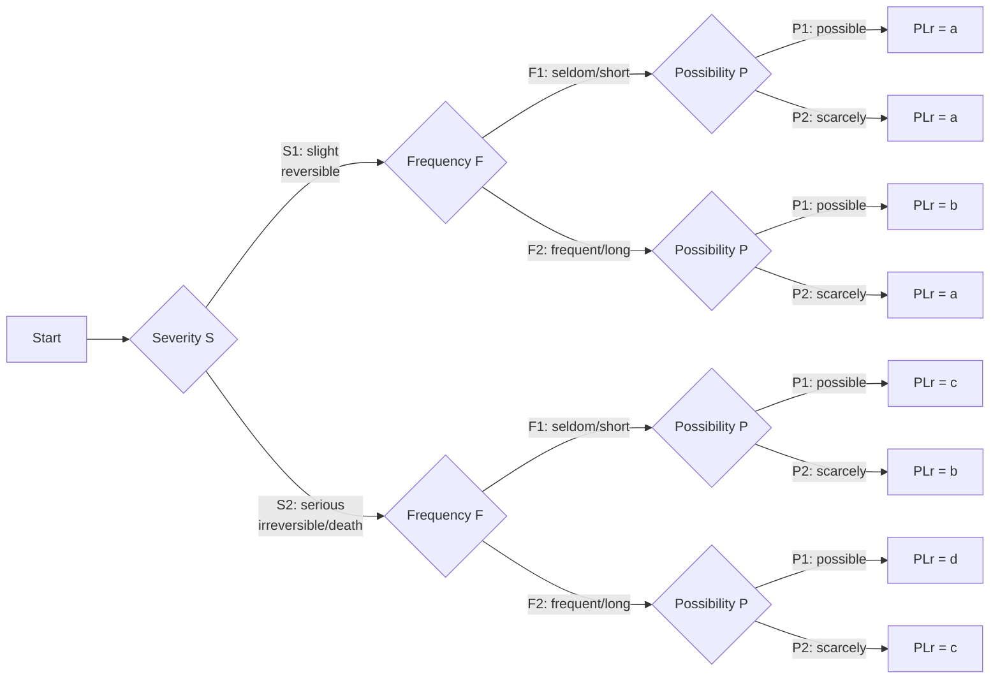
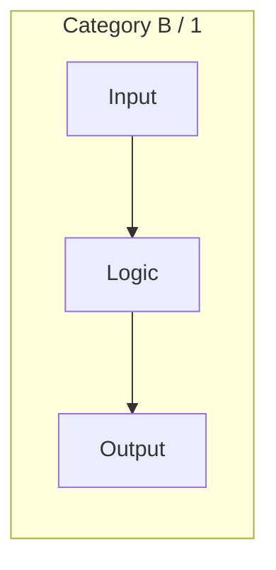
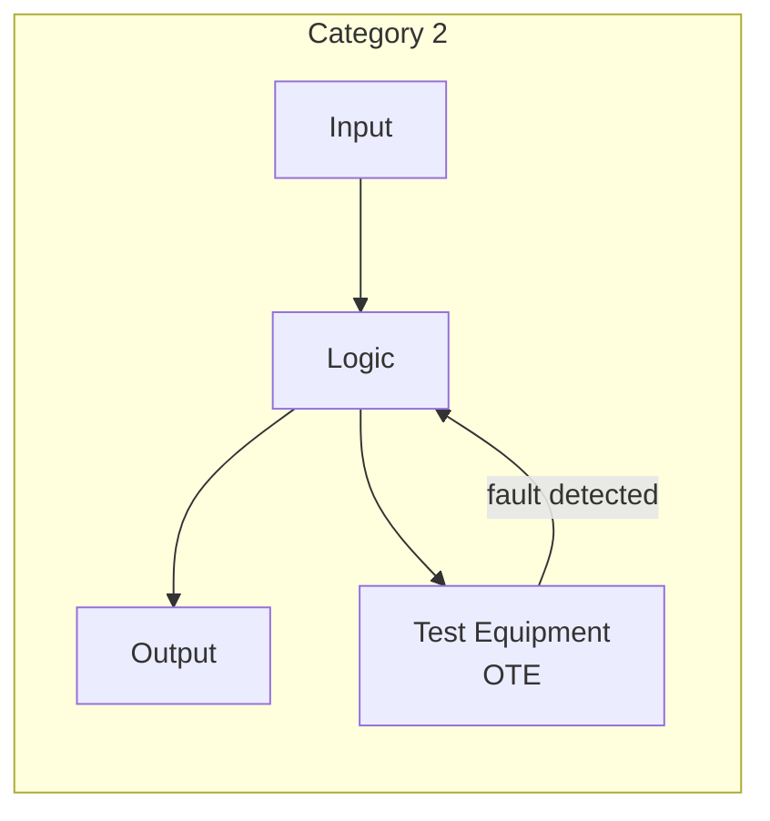
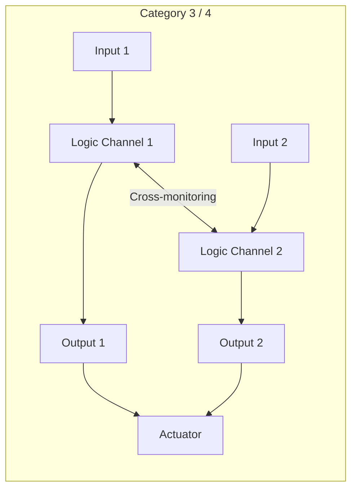

# ISO 13849 — Safety of Machinery: Safety Functions & Performance Level (PLr)

**Category:** 25 — Robotics Safety  
**Document:** 03 — ISO 13849 Safety Functions & PLr  
**Standard:** EN ISO 13849-1:2023 + EN ISO 13849-2:2012  
**Scope:** Performance Level assignment, category architecture, calculation methodology  
**Audience:** Safety control system designers, robot integrators, machinery CE marking teams  
**Prerequisites:** Risk assessment (ISO 12100), basic reliability engineering

---

## Chapter 1 — Standard Overview & Applicability

### 1.1 When to Use ISO 13849 vs. IEC 62061

| Criterion | ISO 13849-1 | IEC 62061 |
|-----------|-------------|-----------|
| **Technology scope** | ALL (electrical, electronic, pneumatic, hydraulic, mechanical) | Electrical/electronic/programmable electronic only |
| **SRP/CS complexity** | Simple to moderately complex | Unlimited (subsystem approach) |
| **Output metric** | Performance Level (PL a-e) | Safety Integrity Level (SIL 1-3) |
| **Typical use** | Robot safety circuits with mixed technologies | Complex SIL-rated safety PLCs |
| **Quantitative analysis** | MTTF_d, DC_avg, CCF scoring | PFH_d (probability of dangerous failure/hour) |
| **Programming** | Limited variability software (LVL) or FVL | Full variability language allowed |

**Decision Rule:** If your robot safety system includes pneumatic/hydraulic components → use ISO 13849. If purely E/E/PE → either standard is acceptable. The EU Machinery Regulation 2023/1230 accepts both.

### 1.2 PLr to SIL Mapping

| Performance Level | PFH_d Range (per hour) | Equivalent SIL | Risk Reduction |
|------------------|----------------------|----------------|---------------|
| PL a | ≥ 10⁻⁵ to < 10⁻⁴ | — (below SIL 1) | Low |
| PL b | ≥ 3 × 10⁻⁶ to < 10⁻⁵ | — (below SIL 1) | Low-Medium |
| PL c | ≥ 10⁻⁶ to < 3 × 10⁻⁶ | SIL 1 | Medium |
| PL d | ≥ 10⁻⁷ to < 10⁻⁶ | SIL 2 | High |
| PL e | ≥ 10⁻⁸ to < 10⁻⁷ | SIL 3 | Very High |

---

## Chapter 2 — Performance Level Required (PLr) Determination

### 2.1 Risk Graph Method (ISO 13849-1 Figure 3)

### 2.2 Risk Parameters

| Parameter | Value | Description | Robot Example |
|-----------|-------|-------------|---------------|
| **S1** | Slight (reversible) | Bruise, minor cut | Low-speed cobot contact |
| **S2** | Serious (irreversible/death) | Fracture, amputation, death | Industrial robot collision |
| **F1** | Seldom/short exposure | Rare access to danger zone | Annual maintenance only |
| **F2** | Frequent/long exposure | Regular presence in danger zone | Cobot operator continuous work |
| **P1** | Possible under certain conditions | Avoidance depends on conditions | Warning possible, escape route exists |
| **P2** | Scarcely possible | No escape, sudden hazard | Unexpected robot motion, no warning |

### 2.3 Robotics PLr Examples

| Safety Function | S | F | P | PLr | Rationale |
|----------------|---|---|---|-----|-----------|
| Emergency stop (industrial robot) | S2 | F2 | P1 | **d** | Serious injury, frequent exposure, stop possible |
| Collaborative zone speed monitoring | S2 | F2 | P2 | **d** or **e** | Continuous presence, limited avoidance |
| Light curtain muting | S2 | F1 | P1 | **c** | Seldom entry into zone |
| AMR protective field stop | S2 | F2 | P1 | **d** | Frequent pedestrian interaction |
| Cobot power/force limiting | S1 | F2 | P1 | **b** | Reversible injury (TS 15066 limits) |
| Safety-rated monitored stop | S2 | F2 | P1 | **d** | Must be reliable for human presence |

---

## Chapter 3 — Categories (Hardware Architecture)

### 3.1 Category Definitions

| Category | Architecture | Fault Behavior | DC Required | Key Principle |
|----------|-------------|----------------|-------------|---------------|
| **B** | Single channel, basic | No fault detection; loss of safety on single fault | None | Basic design principles |
| **1** | Single channel, well-tried | No fault detection; well-tried components | None | Well-tried components & principles |
| **2** | Single channel + diagnostic | Faults detected by periodic test (test rate > demand rate) | Low to Medium | Periodic testing by diagnostics |
| **3** | Dual channel (redundant) | Single fault does not lead to loss of safety function; some faults detected | Low to Medium | Redundancy + diagnostics |
| **4** | Dual channel + enhanced diagnostic | No accumulation of faults leads to loss of safety; all faults detected before next demand | High | Full redundancy + high diagnostics |

### 3.2 Category Architecture Diagrams

### 3.3 Achievable PL per Category

| Category | Max Achievable PL | Typical Application |
|----------|------------------|---------------------|
| B | PL b (max) | Non-safety applications, advisory only |
| 1 | PL c (max) | Simple guard interlocks with well-tried components |
| 2 | PL d (max) | Safety PLC with periodic self-test |
| 3 | PL d (typical), PL e (with high MTTF_d) | Dual-channel safety relay circuits |
| 4 | PL e (highest) | Redundant safety PLCs with full cross-monitoring |

---

## Chapter 4 — Quantitative Calculation

### 4.1 Key Parameters

| Symbol | Parameter | Unit | Source |
|--------|-----------|------|--------|
| **MTTF_d** | Mean Time To Dangerous Failure | Years | Component reliability data (SN 29500, IEC 62380, field data) |
| **DC_avg** | Average Diagnostic Coverage | % | Table D.2 (ISO 13849-1) or FMEA |
| **CCF** | Common Cause Failure score | Points (≥65 required) | Table F.1 checklist |
| **T10d** | Useful lifetime (10% dangerous failure probability) | Years | Component specification |
| **PFH_d** | Probability of dangerous failure per hour | 1/h | Calculated final output |

### 4.2 MTTF_d Values (Typical Components)

| Component | Typical MTTF_d | Category | Source |
|-----------|---------------|----------|--------|
| Safety relay (e.g., Pilz PNOZ) | 150-300 years | Well-tried | Manufacturer data |
| Safety PLC (e.g., Pilz PSSu, Siemens F-CPU) | 100-500 years | Programmable | SIL certificate |
| Inductive proximity sensor | 50-150 years | Single channel | SN 29500 |
| Safety-rated laser scanner (SICK, Leuze) | 100-200 years | Per manufacturer | Data sheet |
| Emergency stop button (IEC 60947-5-5) | 300-1000 years | Well-tried | Manufacturer data |
| Contactor (IEC 60947-4-1) | 50-200 years (depends on duty cycle) | Electromechanical | B10d value |
| Safety mat (pressure-sensitive) | 50-150 years | Proven | B10d calculation |

### 4.3 B10d Calculation for Electromechanical Components

$$MTTF_d = \frac{B_{10d}}{0.1 \times n_{op}}$$

Where:
- $B_{10d}$ = number of operations at which 10% have dangerous failure (from manufacturer)
- $n_{op}$ = number of operations per year

**Example:** Contactor with B10d = 2,000,000 operations, used 10 times/day:
$$n_{op} = 10 \times 365 = 3,650 \text{ operations/year}$$
$$MTTF_d = \frac{2,000,000}{0.1 \times 3,650} = 5,479 \text{ years}$$

### 4.4 DC_avg (Diagnostic Coverage) Values

| Diagnostic Measure | DC Value | Example |
|-------------------|----------|---------|
| None | 0% | No monitoring |
| Monitoring of plausibility (indirect) | 60% | Input signal range check |
| Cross-monitoring of outputs with logic | 90% | Redundant contactors with feedback |
| Direct monitoring (e.g., EDM) | 99% | External device monitoring relay |
| Dynamic testing (complete function test) | 99% | Periodic full actuation test |

### 4.5 CCF (Common Cause Failure) Scoring

| Measure | Points | Description |
|---------|--------|-------------|
| Separation/segregation | 15 | Physical separation of signal paths |
| Diversity | 20 | Different technologies in channels |
| Design/application/experience | 5 | Proven design practices |
| Assessment/analysis | 5 | FMEA performed |
| Competence/training | 5 | Trained maintenance personnel |
| Environmental | 25 | Protection against contamination, EMC, temperature |
| **Minimum required** | **≥ 65** | Sum must reach 65 for Category 3/4 |

---

## Chapter 5 — Sistema Tool

### 5.1 Overview

**Sistema** (Safety Integrity Software Tool for Evaluation of Machine Applications) is the free software tool from IFA (Institute for Occupational Safety, Germany) for ISO 13849 calculations.

### 5.2 Workflow

| Step | Sistema Action | Input Required |
|------|---------------|---------------|
| 1 | Define safety function | Description, PLr |
| 2 | Define subsystems (channels) | Category, number of channels |
| 3 | Enter block data | MTTF_d (or B10d + nop), DC per block |
| 4 | Define diagnostics | DC_avg per subsystem |
| 5 | CCF scoring | Answer questionnaire |
| 6 | Calculate PL | Automatic — compare with PLr |
| 7 | Document | Generate report PDF |

### 5.3 Common Errors in Sistema Calculations

| Error | Impact | Correction |
|-------|--------|-----------|
| Using B10 instead of B10d | Over-estimates reliability | B10d = B10 × (dangerous failure fraction), typically B10d ≈ B10/2 |
| Ignoring mission time T10d | Component used beyond useful life | Set T10d ≤ 20 years; replace components |
| Wrong nop assumption | Incorrect MTTF_d | Count actual operations from process cycle |
| DCavg too high without evidence | Non-conservative PL claim | Justify DC values with FMEA or Table D.2 |
| Missing CCF scoring | Category 3/4 invalid | Complete Table F.1; score ≥ 65 |

---

## Chapter 6 — Comparison: ISO 13849 vs. IEC 62061

| Aspect | ISO 13849-1:2023 | IEC 62061:2021 |
|--------|-----------------|----------------|
| Metric | PL (a-e) | SIL (1-3 for machinery) |
| Quantitative | PFH_d | PFH_d (same metric) |
| Qualitative | Category (B, 1, 2, 3, 4) | Architecture constraints (A, B, C, D) |
| Technologies | All (pneumatic, hydraulic, E/E/PE) | E/E/PE only |
| Software | Clause 4.6 (LVL mainly) | Full software lifecycle (FVL, LVL) |
| Max SIL | SIL 3 (via PL e mapping) | SIL 3 (explicit) |
| Tool | Sistema (IFA, free) | Various (paid/proprietary) |
| Combined | Can combine with IEC 62061 subsystems | Can incorporate ISO 13849 subsystems |
| New edition alignment | 2023 edition aligns quantitatively with 62061 | 2021 edition aligns with 13849 |

---

## Chapter 7 — Robotics Application Examples

### 7.1 Industrial Robot Cell Safety Circuit

| Component | Function | Category | MTTF_d | DC |
|-----------|----------|----------|--------|-----|
| Guard door interlock (2× switches) | Detect door open | 3 | 150 yr | 90% (cross-monitoring) |
| Safety PLC (F-CPU) | Logic processing | 4 | 300 yr | 99% (self-test) |
| Safety relay + contactor (redundant) | STO (Safe Torque Off) | 3 | 200 yr | 99% (EDM) |
| Light curtain (Type 4, IEC 61496) | Presence detection | 4 | 150 yr | 99% (internal diag) |

**Achieved PL:** PL e (Category 4, high MTTF_d, high DC_avg, CCF ≥ 65)

### 7.2 Cobot Collaborative Zone

| Component | Function | Category | PL Target |
|-----------|----------|----------|-----------|
| Safety-rated speed monitoring | Limit TCP speed to 250 mm/s | Built into robot controller | PL d |
| Force/torque sensing | Limit contact force (TS 15066) | Integrated sensor | PL d |
| Safety-rated soft axis limit | Restrict workspace | Robot controller SLS | PL d |
| Presence detection (floor scanner) | Detect human approach for SSM | External laser scanner | PL d |

---

## Chapter 8 — Validation (ISO 13849-2)

### 8.1 Validation Activities

| Activity | Purpose | Method |
|----------|---------|--------|
| Analysis | Verify design meets requirements | FMEA, fault tree, circuit analysis |
| Testing | Confirm correct behavior under fault conditions | Fault injection, function test |
| Fault simulation | Prove single fault safety | Short circuits, open circuits, stuck-at |
| Environmental testing | Confirm robustness | EMC (IEC 61000-6-2), vibration |
| Documentation review | Complete technical file | Checklist per ISO 13849-2 Annex |

### 8.2 Fault Exclusion Conditions

Certain faults may be excluded from analysis if:
- Component is "well-tried" (defined use, proven history)
- Fault is physically impossible given component construction
- Probability is negligibly low relative to PLr

| Fault Exclusion | Component | Justification |
|-----------------|-----------|---------------|
| Short between contacts | Safety relay (forced-guided) | IEC 61810-3 mechanically linked contacts |
| Spring break in e-stop | Well-tried mushroom-head button | IEC 60947-5-5 construction standard |
| Encoder count error | Safety encoder (SIL 2 certified) | Internal redundancy proven |

---

## Chapter 9 — Interview Questions

### Entry-Level
1. What does PLr stand for and how is it determined?
2. Name the five categories (B, 1, 2, 3, 4) and their key differences.
3. What is MTTF_d and how does B10d relate to it?

### Mid-Level
1. Walk through a PLr calculation using the risk graph for an industrial robot emergency stop.
2. Explain DC_avg and how you justify a 99% diagnostic coverage claim.
3. How does Category 3 differ from Category 4 in terms of fault accumulation?

### Senior
1. Design a safety circuit achieving PL e for a robot cell with guard doors + light curtains.
2. How do you handle CCF when both channels use the same manufacturer's safety PLC?
3. When can you exclude faults from the ISO 13849-2 validation?

### Principal
1. How should ISO 13849 evolve to address AI-based adaptive safety functions in cobots?
2. Design a methodology combining ISO 13849 subsystems with IEC 62061 for a multi-technology robot cell.
3. Propose a digital twin approach for continuous PL validation of degrading components.

---

*Document Version: 1.0 | Last Updated: May 2026 | Author: Robotics Safety Standards Team*
