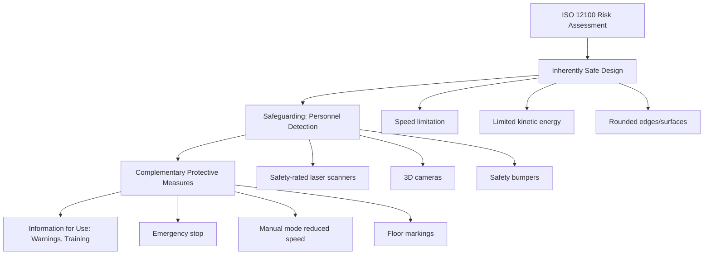
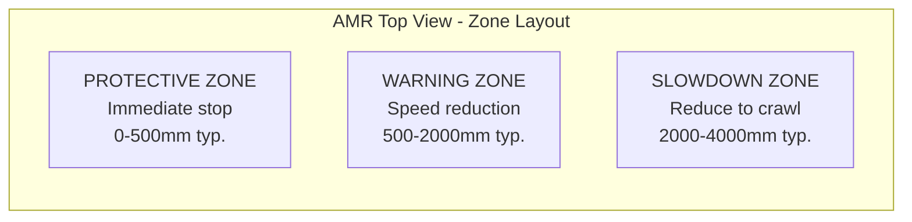
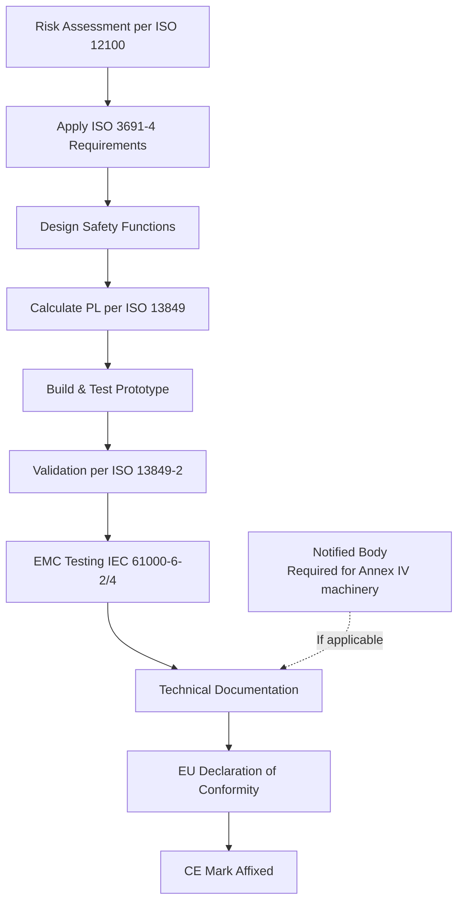

# AMR & AGV Safety — ISO 3691-4

**Category:** 25 — Robotics Safety  
**Document:** 04 — AMR/AGV Safety ISO 3691  
**Standard:** ISO 3691-4:2020, ANSI/ITSDF B56.5, VDI 2510  
**Scope:** Driverless industrial trucks, Autonomous Mobile Robots (AMR), Automated Guided Vehicles (AGV)  
**Audience:** Warehouse automation engineers, AMR fleet operators, system integrators, safety engineers  
**Prerequisites:** ISO 12100 risk assessment, ISO 13849 / IEC 62061 understanding

---

## Chapter 1 — Standard Landscape

### 1.1 Key Standards Comparison

| Standard | Title | Geography | Scope |
|----------|-------|-----------|-------|
| **ISO 3691-4:2020** | Industrial trucks — Driverless industrial trucks and their systems | International (ISO) | AGVs, AMRs carrying/towing loads in industrial environments |
| **ANSI/ITSDF B56.5-2019** | Safety Standard for Driverless, Automatic Guided Industrial Vehicles | USA | Similar to ISO 3691-4 but North American context |
| **VDI 2510** | Automated Guided Vehicle Systems (AGVS) | Germany | Design and application guidance |
| **VDI 2710** | Interdisciplinary design of AGV systems | Germany | System-level integration |
| **EN 1525:1997** | Safety of industrial trucks — Driverless trucks (withdrawn) | Europe | Superseded by ISO 3691-4 |
| **ISO 3691-1:2011** | Self-propelled industrial trucks (manned) | International | Base safety for all industrial trucks |

### 1.2 AGV vs. AMR Distinction

| Feature | AGV (Traditional) | AMR (Modern) |
|---------|-------------------|--------------|
| Navigation | Fixed path (wire, magnetic tape, QR codes) | Free navigation (SLAM, LiDAR) |
| Route flexibility | Low — predefined routes | High — dynamic path planning |
| Obstacle handling | Stop and wait | Navigate around obstacles |
| Infrastructure | Requires floor modifications | Minimal infrastructure |
| Safety approach | Zone-based with fixed sensors | Dynamic safety fields |
| Standards applicability | ISO 3691-4 (full) | ISO 3691-4 (full) + additional considerations |

---

## Chapter 2 — ISO 3691-4:2020 Structure

### 2.1 Standard Contents

| Clause | Title | Key Requirements |
|--------|-------|-----------------|
| 4 | General requirements | Risk assessment, safe design principles |
| 5 | Verification of safety-related parts | Safety functions per ISO 13849 or IEC 62061 |
| 6 | Personnel detection | Detection zones, sensor requirements |
| 7 | Speed control | Maximum speed limits per zone |
| 8 | Controls | Manual/automatic mode selection |
| 9 | Braking | Service and emergency braking |
| 10 | Warning devices | Visual and audible warnings |
| 11 | Load handling | Stability, load retention |
| 12 | Battery/charging | Electrical safety during charging |
| Annex A | Risk assessment examples | Hazard identification tables |
| Annex B | Performance Level / SIL assignment | Mapping safety functions to PLr |

### 2.2 Safety Hierarchy

---

## Chapter 3 — Detection Zones

### 3.1 Zone Architecture

### 3.2 Zone Definitions

| Zone | Name | Function | Typical Range | Response Time Budget |
|------|------|----------|---------------|---------------------|
| **Protective field** | Safety zone | Immediate stop (Cat 0 or 1) | 0 – 500 mm from vehicle edge | < 100 ms response |
| **Warning field** | Deceleration zone | Reduce speed, prepare to stop | 500 – 2000 mm | 200-500 ms |
| **Slowdown field** | Approach zone | Reduce to crawl speed | 2000 – 4000 mm | Advisory only |
| **Free field** | Normal operation | Full speed allowed | Beyond slowdown | N/A |

### 3.3 Protective Field Calculation

The protective field size must account for:

$$d_{min} = v \times (t_r + t_b) + d_{sensor} + d_{person} + Z_{safety}$$

Where:
- $v$ = vehicle speed (m/s)
- $t_r$ = system response time (sensor + controller processing)
- $t_b$ = braking time to full stop
- $d_{sensor}$ = sensor measurement uncertainty
- $d_{person}$ = distance a person can travel during stopping (1.6 m/s × t_stop)
- $Z_{safety}$ = additional safety margin (≥ 100 mm)

**Example:** AMR at 1.5 m/s, response time 200 ms, braking time 300 ms:
$$d_{min} = 1.5 \times (0.2 + 0.3) + 0.05 + 1.6 \times 0.3 + 0.1 = 0.75 + 0.05 + 0.48 + 0.1 = 1.38 \text{ m}$$

### 3.4 Dynamic Field Switching

| Scenario | Field Set | Speed | Rationale |
|----------|-----------|-------|-----------|
| Straight, open aisle | Small protective field | Full speed (2 m/s) | Long braking distance available |
| Approaching intersection | Extended protective field | Reduced (0.8 m/s) | Cross-traffic possible |
| Turning/rotating | 360° protective field | Very low (0.3 m/s) | Cannot see around corners |
| Load carrying (front) | Extended front field | Reduced | Load obstructs sensors |
| Reverse travel | Rear field activated | Reduced | Rear sensors typically lower resolution |

---

## Chapter 4 — Emergency Stop Categories

### 4.1 IEC 60204-1 Stop Categories

| Stop Category | Description | Application in AMR/AGV |
|---------------|-------------|----------------------|
| **Category 0** | Immediate removal of power to actuators (uncontrolled stop) | Emergency stop, protective field breach at high speed |
| **Category 1** | Controlled deceleration then power removal | Normal protective field activation, allows controlled braking |
| **Category 2** | Controlled stop with power maintained | Warning field activation, position hold needed (e.g., on ramp) |

### 4.2 Emergency Stop Requirements (ISO 3691-4)

| Requirement | Specification |
|-------------|--------------|
| Accessibility | E-stop button on all sides reachable by personnel |
| Color/shape | Red mushroom-head on yellow background (IEC 60947-5-5) |
| Function | Category 0 or Category 1 stop |
| Reset | Manual reset required; no automatic restart |
| Performance Level | PLr = d (minimum) per ISO 13849 |
| Wireless e-stop | Permitted with additional safety measures (fail-safe on signal loss) |
| Remote e-stop | Fleet management system must be able to stop individual vehicles |

### 4.3 Braking Performance

| Parameter | Requirement (ISO 3691-4) | Typical Values |
|-----------|--------------------------|----------------|
| Maximum stopping distance (loaded) | Must be within protective field calculation | 0.3-1.5 m depending on speed |
| Brake type | Fail-safe (spring-applied, electromagnetic release) | Electromagnetic disc brake |
| Deceleration (emergency) | ≥ 2 m/s² (typical requirement) | 3-5 m/s² achievable |
| Deceleration (service) | Comfortable, < 1.5 m/s² | 0.5-1.0 m/s² |
| Brake monitoring | Required for PL d/e | Wear detection, torque monitoring |
| Redundancy | Dual-channel recommended for PL d | Two independent brake circuits |

---

## Chapter 5 — Personnel Detection Technologies

### 5.1 Sensor Comparison

| Technology | Standard | Range | Resolution | Advantages | Limitations |
|-----------|----------|-------|-----------|------------|-------------|
| 2D Safety LiDAR | IEC 61496-3 (Type 3) | 1-30 m | 30-50 mm | Wide FOV, outdoor capable | 2D only (leg-height detection) |
| 3D Safety LiDAR | IEC 61496-3 | 0.5-10 m | 20-40 mm | Full body detection, height discrimination | Cost, processing time |
| Safety camera (2D) | IEC 61496-4 (Type 3) | 0.1-7 m | Pixel-dependent | Wide area, multiple zones | Lighting dependent |
| 3D ToF camera | IEC 61496-4 | 0.1-5 m | 20 mm | Volume detection, height filtering | Limited range, FOV |
| Safety bumper | IEC 61496-1 (Type 1) | Contact (0-50 mm) | N/A | Last resort, simple, reliable | Contact required (reactive only) |
| Ultrasonic | Not safety-rated typically | 0.2-5 m | ~10 mm | Low cost, works in dust | Not certifiable for safety per se |
| Radar | IEC 61496 (emerging) | 0.5-20 m | 50-100 mm | Works through dust, rain, fog | Lower resolution |

### 5.2 Safety Sensor Certification

| Certification Level | Application | Required For |
|--------------------|-------------|--------------|
| Type 1 (IEC 61496) | Bumper / pressure-sensitive | Last-resort stop (backup) |
| Type 2 (IEC 61496) | Non-safety rated presence detection | Warning zone only |
| Type 3 (IEC 61496) | Safety-rated optoelectronic device | Protective field for PL d |
| Type 4 (IEC 61496) | Highest integrity optoelectronic | PL e applications |
| SIL 2 / PL d | Safety laser scanner | Standard AMR protective field |
| SIL 3 / PL e | Safety 3D camera system | High-risk environments |

### 5.3 Sensor Placement Strategy

| Position | Sensor Type | Purpose |
|----------|-------------|---------|
| Front (direction of travel) | Safety LiDAR + bumper | Primary detection + backup |
| Rear | Safety LiDAR (smaller FOV) | Reverse travel protection |
| Sides | Ultrasonic or 3D camera | Side clearance in narrow aisles |
| Top (elevated) | 3D camera / ToF | Overhead obstacle detection |
| Floor-level | Cliff sensor (IR) | Edge/drop detection |
| 360° (rotating) | Single spinning LiDAR | Full surround monitoring |

---

## Chapter 6 — Floor Marking & Traffic Management

### 6.1 Floor Marking Standards

| Marking | Color | Purpose | Standard Reference |
|---------|-------|---------|-------------------|
| AMR travel lanes | Yellow (solid) | Define automated vehicle paths | ISO 3691-4, local regulations |
| Pedestrian paths | Green or blue | Segregated human walkways | EN ISO 3691-4 Annex |
| Shared zones | Yellow/green hatched | Human-robot coexistence areas | Site-specific risk assessment |
| Charging stations | Orange boundary | No pedestrian entry during charging | Electrical safety zones |
| Emergency stop zones | Red boundary | Immediate stop on entry | ISO 3691-4 Clause 7 |
| Speed limit zones | Signage + floor marking | Enforce reduced speed areas | VDI 2510 recommendations |

### 6.2 Traffic Management Safety

| Feature | Description | Safety Rationale |
|---------|-------------|-----------------|
| One-way aisles | AMRs travel in single direction | Eliminates head-on collision risk |
| Intersection management | Only one AMR in intersection at a time | Fleet controller manages right-of-way |
| Speed zoning | Speed maps loaded into AMR navigation | Reduce kinetic energy in high-risk areas |
| Pedestrian priority | AMR always yields to humans | ISO 3691-4 fundamental requirement |
| Deadlock avoidance | Fleet controller prevents gridlock | Ensures escape routes remain clear |
| Convoy separation | Minimum following distance | Prevents multi-vehicle pile-up |

---

## Chapter 7 — Fleet Safety Management

### 7.1 Fleet Controller Safety Functions

| Function | Category | PLr | Description |
|----------|----------|-----|-------------|
| Vehicle position tracking | Monitoring | PL c | Continuous pose estimation |
| Collision prediction | Prevention | PL d | Path overlap detection |
| Zone enforcement | Speed limiting | PL d | Geographic speed restrictions |
| Emergency fleet stop | All vehicles halt | PL d | Master emergency stop |
| Communication loss handling | Fail-safe | PL d | Vehicle stops on timeout |
| Traffic light management | Intersection control | PL c | Virtual traffic signals |

### 7.2 Communication Requirements

| Parameter | Requirement | Rationale |
|-----------|-------------|-----------|
| Latency | < 100 ms (typical) | Timely command delivery |
| Loss detection | < 1 second timeout | Vehicle must stop on comm loss |
| Protocol | 5G/WiFi 6 + safety layer | Redundant communication |
| Cybersecurity | Encrypted, authenticated | Prevent unauthorized commands |
| Redundancy | Dual-path recommended for PL d | No single point of failure |
| Heartbeat | Continuous watchdog signal | Detect silent failures |

---

## Chapter 8 — Warehouse AMR Case Studies

### 8.1 Amazon Robotics (Kiva Systems Heritage)

| Aspect | Implementation |
|--------|---------------|
| Navigation | QR codes on floor + odometry |
| Speed | 1.3 m/s (loaded), 2.0 m/s (unloaded) |
| Detection | Safety LiDAR 360° (SICK/Leuze) |
| Safety zones | Fully segregated (cage approach) |
| Human access | Pod access stations only; robots halt during maintenance |
| Incidents | Bear spray rupture (2018), minor injuries from proximity |

### 8.2 Open-Floor AMR (Modern Approach)

| Aspect | Implementation |
|--------|---------------|
| Navigation | SLAM (LiDAR + camera fusion) |
| Shared space | Humans and robots coexist |
| Speed | 1.0-1.5 m/s (adaptive based on occupancy) |
| Detection | Dual safety LiDAR + 3D camera |
| Intelligence | People-aware path planning, yield behavior |
| Challenge | Complex risk assessment, dynamic field sizing |

### 8.3 Outdoor AMR / Yard Operations

| Challenge | Solution | Standard Reference |
|-----------|----------|-------------------|
| Weather (rain, fog, snow) | Radar + LiDAR fusion | IEC 61496-3 outdoor rating |
| Uneven terrain | Enhanced IMU, suspension | ISO 3691-4 stability requirements |
| Mixed traffic (trucks, forklifts) | V2X communication | Site-specific risk assessment |
| GPS dependency | RTK-GPS + LiDAR localization | Redundant positioning |
| Speed (up to 8 km/h) | Extended protective fields | Stopping distance calculation |

---

## Chapter 9 — Compliance & Certification Path

### 9.1 CE Marking Process (EU)

### 9.2 Documentation Checklist

| Document | Content | Standard Clause |
|----------|---------|-----------------|
| Risk assessment | All hazards, zones, PLr determinations | ISO 3691-4 Clause 4 |
| Safety concept | Architecture, categories, sensor selection | ISO 13849-1 |
| Calculation report | Sistema printout or equivalent | ISO 13849-1 Clause 4 |
| Validation report | Fault injection results, test protocols | ISO 13849-2 |
| EMC test report | Immunity and emission results | IEC 61000-6-2/4 |
| User manual | Operating instructions, maintenance, training | ISO 3691-4 Clause 12 |
| Fleet safety concept | Multi-vehicle interactions, traffic management | ISO 3691-4 Annex |

---

## Chapter 10 — Interview Questions

### Entry-Level
1. What is the difference between an AGV and an AMR?
2. Name the three detection zones and what happens when each is breached.
3. What is a Category 0 stop vs. a Category 1 stop?

### Mid-Level
1. Calculate the minimum protective field size for an AMR traveling at 2 m/s with 250 ms system response time.
2. Explain dynamic field switching and when it's used.
3. What happens when the AMR loses communication with the fleet controller?

### Senior
1. Design a sensor architecture for an AMR operating in a shared human-robot warehouse.
2. How do you achieve PL d for the protective field stop function?
3. What additional considerations exist for outdoor AMR operations vs. indoor?

### Principal
1. Propose a safety architecture for a fleet of 200 AMRs with guaranteed collision avoidance.
2. How should ISO 3691-4 evolve to address swarm robotics and emergent fleet behaviors?
3. Design a predictive safety system that adjusts protection zones based on real-time occupancy analytics.

---

*Document Version: 1.0 | Last Updated: May 2026 | Author: Robotics Safety Standards Team*
