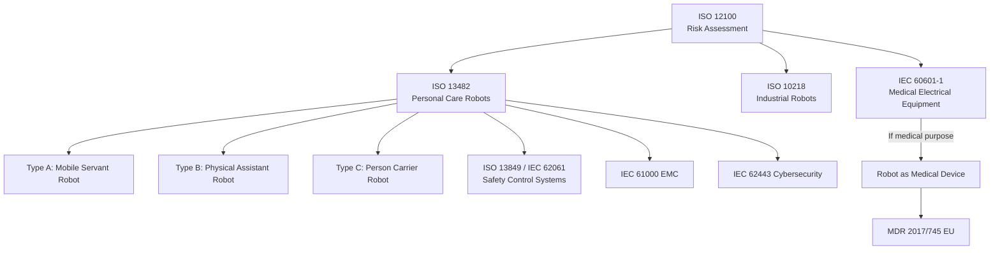
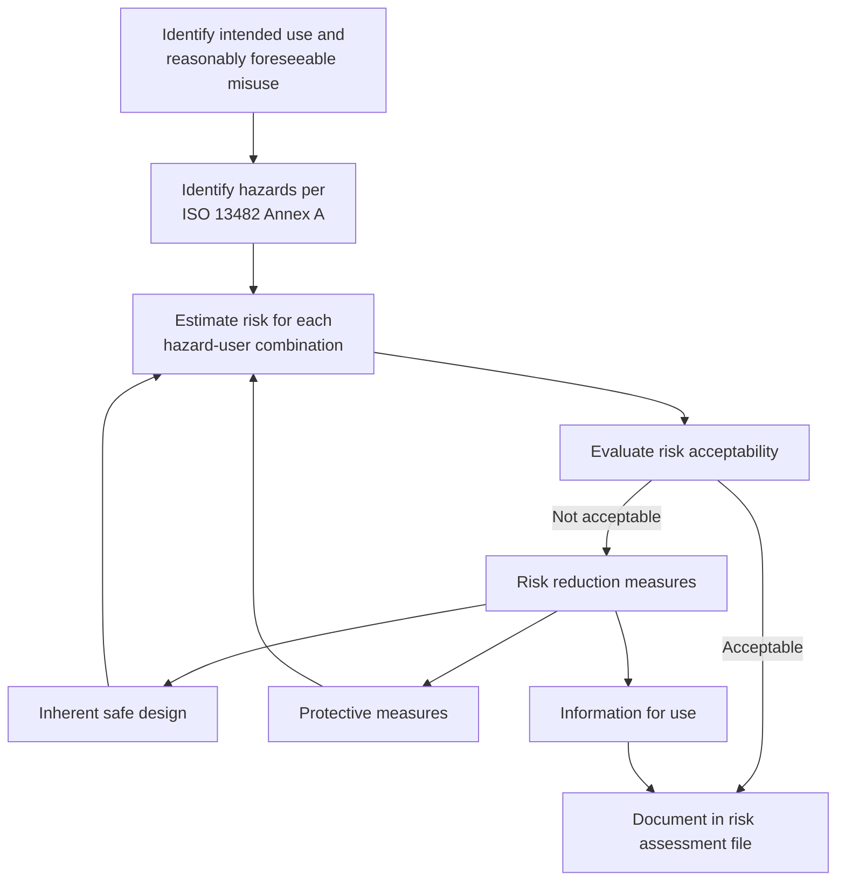
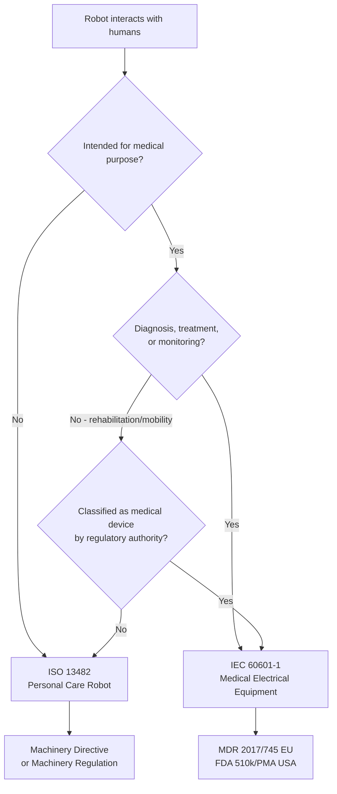

# Service & Personal Care Robots — ISO 13482

**Category:** 25 — Robotics Safety  
**Document:** 05 — Service & Personal Care Robots ISO 13482  
**Standard:** ISO 13482:2014, IEC 60601-1, ISO 18646 series  
**Scope:** Non-industrial robots for personal care, mobility, physical assistance  
**Audience:** Consumer robotics engineers, medical device designers, certification teams  
**Prerequisites:** ISO 12100 risk assessment, ISO 13849 safety functions

---

## Chapter 1 — Standard Overview

### 1.1 ISO 13482:2014 — Robots and Robotic Devices: Safety Requirements for Personal Care Robots

ISO 13482 is the first international safety standard specifically addressing **non-industrial** robots that operate in close proximity to humans in personal care scenarios. It is fundamentally different from ISO 10218 (industrial robots) because:

- The user is typically **untrained** (consumer, patient, elderly)
- The robot operates in **unstructured environments** (homes, hospitals, public spaces)
- **Physical contact** with humans is intended and expected (not just tolerated)
- The concept of a **separated safeguarded space** does not apply

### 1.2 Scope & Exclusions

| Included | Excluded |
|----------|----------|
| Mobile servant robots | Industrial robots (ISO 10218) |
| Physical assistant robots (exoskeletons) | Medical devices under IEC 60601-1 |
| Person carrier robots | Military/defense robots |
| Domestic service robots | Toys (EN 71, IEC 62115) |
| Public service robots (guide, cleaning) | Vehicles (ISO 3691, automotive standards) |
| Robotic wheelchairs | Implantable devices |

### 1.3 Relationship to Other Standards

---

## Chapter 2 — Robot Type Classification

### 2.1 Three Types of Personal Care Robots

| Type | Name | Definition | Examples |
|------|------|-----------|----------|
| **Type A** | Mobile Servant Robot | Robot that performs serving tasks, moves autonomously in human environment | Cleaning robots (Roomba++), delivery robots, guide robots, social companion robots |
| **Type B** | Physical Assistant Robot | Robot with actuators that provide physical assistance to a user through direct contact | Exoskeletons, powered orthoses, rehabilitation robots, walking-aid robots |
| **Type C** | Person Carrier Robot | Robot with the purpose of transporting humans | Robotic wheelchair, personal mobility robot, autonomous ride vehicles |

### 2.2 Detailed Characteristics

| Characteristic | Type A (Mobile Servant) | Type B (Physical Assistant) | Type C (Person Carrier) |
|---------------|------------------------|---------------------------|------------------------|
| Human contact | Unintended (minimize) | Intended (continuous) | Seated/supported |
| User training | None required | Basic (donning/doffing) | Minimal |
| Speed range | 0.5 – 6 km/h | Matches human movement | 0 – 20 km/h |
| Mass range | 5 – 200 kg | 5 – 50 kg (wearable) | 50 – 500 kg |
| Environment | Home, office, public | Anywhere user goes | Indoor/outdoor paths |
| Primary hazard | Collision, entrapment | Joint misalignment, overforce | Fall, collision, tip-over |
| Control mode | Autonomous | Shared human-robot | User command + autonomous |

---

## Chapter 3 — Hazard Analysis Methodology

### 3.1 Hazard Categories (ISO 13482 Annex A)

| Hazard Category | Specific Hazards | Robot Type(s) |
|----------------|-----------------|---------------|
| **Mechanical** | Crushing, shearing, cutting, entanglement, impact, stabbing | A, B, C |
| **Electrical** | Electric shock, battery thermal runaway, short circuit | A, B, C |
| **Thermal** | Burns from motors/electronics, battery fire | A, B, C |
| **Noise** | Hearing damage from proximity | A |
| **Ergonomic** | Musculoskeletal strain (Type B), posture forced by robot | B, C |
| **Radiation** | Laser sensors, UV germicidal (cleaning robots) | A |
| **Shape-related** | Sharp edges, protrusions, pinch points | A, B, C |
| **Energy storage** | Stored energy release (springs, pneumatics) | B |
| **Autonomous behavior** | Unexpected motion, incorrect decision, sensor failure | A, C |
| **Psychological** | Fear, anxiety, social isolation, over-trust | A, B |

### 3.2 Risk Assessment Process per ISO 13482

### 3.3 User Groups and Vulnerability

| User Group | Special Considerations | Risk Multiplier |
|-----------|----------------------|-----------------|
| Elderly (65+) | Fragile bones, slow reaction, cognitive decline | High |
| Children (under 14) | Unpredictable behavior, curiosity, small size | High |
| Persons with disabilities | Limited mobility, sensory impairment | High |
| Professional caregivers | Trained, able-bodied | Baseline |
| General public | Variable awareness and capability | Medium |
| Bystanders | Unaware of robot presence | Medium-High |

---

## Chapter 4 — Type A: Mobile Servant Robots

### 4.1 Safety Requirements

| Requirement | Description | Performance Target |
|-------------|-------------|-------------------|
| Collision avoidance | Detect and avoid obstacles and people | PL c-d per ISO 13849 |
| Contact force limitation | Maximum force if collision occurs | EN ISO 13482 Table C.1 thresholds |
| Speed limitation | Maximum velocity near humans | Typically ≤ 1.5 m/s indoor |
| Stability | Prevent tip-over on slopes/thresholds | Tilt test per ISO 13482 |
| Entrapment prevention | No gaps that can trap fingers/limbs | Gap analysis per ISO 13854 |
| Electromagnetic safety | Battery, charging, wireless EMC | IEC 62133 (battery), IEC 61000 |
| Sensor failure response | Safe stop on sensor degradation | Watchdog, redundancy |

### 4.2 Collision Force Thresholds

| Body Region | Max Transient Force (N) | Max Quasi-Static Force (N) | Max Pressure (N/cm²) |
|-------------|------------------------|---------------------------|---------------------|
| Head/Skull | 130 | 65 | — |
| Face | 65 | 45 | — |
| Chest | 140 | 70 | — |
| Abdomen | 110 | 55 | — |
| Hand/finger | 135 | 67 | 30 |
| Leg (upper) | 220 | 110 | — |
| Leg (lower) | 130 | 65 | — |

*Values derived from ISO/TS 15066 biomechanical thresholds, also referenced by ISO 13482 Annex C*

### 4.3 Examples

| Product | Type A Category | Key Safety Features |
|---------|----------------|---------------------|
| Softbank Pepper | Social companion | Low mass, compliant joints, bump sensors |
| Amazon Astro | Home assistant | Camera + LiDAR SLAM, low speed, edge detection |
| Pudu BellaBot | Delivery (restaurant) | LiDAR obstacle avoidance, limited speed |
| Brain Corp floor scrubbers | Commercial cleaning | Safety LiDAR, slow speed, large bumper |

---

## Chapter 5 — Type B: Physical Assistant Robots

### 5.1 Safety Requirements

| Requirement | Description | Criticality |
|-------------|-------------|-------------|
| Joint range limiting | Prevent hyperextension of human joints | **Critical** — direct injury risk |
| Force/torque limiting | Maximum assistance force bounded | **Critical** |
| Emergency release | User can doff/escape at any time | **Mandatory** |
| Misalignment detection | Detect if robot joint ≠ human joint axis | **Critical** for exoskeletons |
| Battery safety | Worn battery pack safety | IEC 62133 |
| Postural stability | Prevent falls during power loss | **Critical** for lower-limb |
| Skin contact | Biocompatibility, pressure sores | ISO 10993 (if prolonged) |

### 5.2 Exoskeleton-Specific Hazards

| Hazard | Cause | Mitigation |
|--------|-------|------------|
| Joint hyperextension | Actuator exceeds anatomical ROM | Hard mechanical stops + electronic limits |
| Shear force at attachment | Robot-human interface misalignment | Compliant coupling, DOF alignment adjustment |
| Fall (lower-limb exo) | Loss of power, sensor failure | Mechanical lock, gravity compensation, controlled lowering |
| Pressure injury | Prolonged wear, poor fit | Pressure distribution design, wear-time limits |
| Entrapment | Clothing/hair caught in mechanism | Enclosed actuators, smooth surfaces |
| Cognitive overload | User confused by robot behavior | Intuitive interface, training protocol |

### 5.3 Performance Targets for Exoskeletons

| Parameter | Typical Range | Validation Method |
|-----------|---------------|-------------------|
| Maximum joint torque | 20-80 Nm (depends on joint) | Dynamometer testing |
| Speed of joint actuation | ≤ 60°/s (hip), ≤ 90°/s (knee) | Motion capture comparison |
| Emergency stop time | < 200 ms to zero torque | Time-to-zero measurement |
| Mechanical ROM limits | Within 95th percentile anatomy | Anthropometric study |
| Weight on user | < 15 kg total (lower limb) | Weigh + user fatigue study |
| Operating temperature | 20-35°C at skin interface | Thermal sensor during use |

---

## Chapter 6 — Type C: Person Carrier Robots

### 6.1 Safety Requirements

| Requirement | Description | Standard Reference |
|-------------|-------------|-------------------|
| Stability (static) | No tip-over at rated slope | ISO 7176-1 (wheelchair adapted) |
| Stability (dynamic) | No tip-over during braking/acceleration | ISO 13482 Clause 5 |
| Collision avoidance | Must not collide with obstacles/people | PL d minimum |
| Occupant retention | Seatbelt or barrier for high speed | If > 6 km/h |
| Fall protection | Prevent user falling from carrier | Physical barrier, tilt detection |
| Manual override | User can always regain control | Hardware switch, not software only |
| Fail-safe braking | Stop safely on any failure | Spring-applied brake, PL d |
| Obstacle climbing | Safe behavior on kerbs/edges | Height sensing, speed reduction |

### 6.2 Speed Categories

| Speed Class | Range | Environment | Safety Level |
|-------------|-------|-------------|--------------|
| Indoor low | 0-3 km/h | Home, hospital corridor | PL c |
| Indoor medium | 3-6 km/h | Large facility, mall | PL d |
| Outdoor | 6-15 km/h | Sidewalk, campus | PL d-e |
| Road (special) | 15-25 km/h | Designated lanes | National vehicle regulations apply |

---

## Chapter 7 — Medical Robots: ISO 13482 vs. IEC 60601

### 7.1 Classification Decision Tree

### 7.2 Comparison Table

| Aspect | ISO 13482 (Personal Care) | IEC 60601-1 (Medical Device) |
|--------|--------------------------|------------------------------|
| Regulatory path | CE Machinery Regulation 2023/1230 | CE MDR 2017/745 (EU), FDA (US) |
| Risk management | ISO 12100 + ISO 13482 | ISO 14971 (Medical RM) |
| Essential safety | ISO 13849 / IEC 62061 | IEC 60601-1 clause structure |
| Biocompatibility | ISO 13482 Annex (limited) | ISO 10993 (full series) |
| Software lifecycle | IEC 62443, ISO 13849 Clause 4.6 | IEC 62304 (medical SW lifecycle) |
| Usability | General consumer design | IEC 62366-1 (medical usability) |
| Clinical evidence | Not required | Required (MDR Annex XIV) |
| Post-market surveillance | Limited | Full PMS/PMCF (MDR Article 83-86) |
| Notified Body | May not be required | Required for Class IIa+ |
| Classification | Not applicable | Class I, IIa, IIb, III |

### 7.3 Grey-Area Products

| Product | ISO 13482? | IEC 60601? | Rationale |
|---------|-----------|-----------|-----------|
| Rehabilitation exoskeleton (hospital) | Possibly | **Yes** | Medical intended use (recovery) |
| Mobility exoskeleton (daily living) | **Yes** | Possibly | Not medical if no treatment claim |
| Robotic wheelchair (prescribed) | Overlapping | **Yes** | Medical device in most jurisdictions |
| Robotic wheelchair (consumer, non-prescribed) | **Yes** | No | Consumer product |
| Social companion robot (dementia patients) | **Yes** | No | No medical claim (entertainment/social) |
| Telepresence robot (remote doctor) | **Yes** | No* | Robot itself not medical; doctor provides medical service |
| Surgical robot (da Vinci, etc.) | No | **Yes** | Clearly medical device |

---

## Chapter 8 — Testing & Certification

### 8.1 Test Methods (ISO 13482 Annex D)

| Test | Description | Acceptance Criteria |
|------|-------------|-------------------|
| Stability test | Tilt on slope (static + dynamic) | No tip-over at rated slope + margin |
| Collision test | Impact force measurement on surrogate | Below biomechanical thresholds |
| Environmental | Temperature, humidity, ingress protection | Per rated conditions |
| Electromagnetic | EMC immunity + emissions | IEC 61000-6-1/2/3/4 |
| Battery abuse | Crush, overcharge, short circuit, thermal | IEC 62133-2, UN 38.3 |
| Durability | Repeated cycles, wear testing | No degradation below safety limits |
| Software validation | Boundary testing, fault injection | No unsafe behavior under faults |
| User study | Real users in intended environment | Acceptable residual risk |

### 8.2 Certification Bodies

| Body | Region | Scope |
|------|--------|-------|
| TÜV SÜD / TÜV Rheinland | EU, Global | Full ISO 13482 certification |
| UL (Underwriters Laboratories) | USA, Global | Safety testing + listing |
| JQA (Japan Quality Assurance) | Japan | ISO 13482 + JIS B 8445 |
| KTL (Korea Testing Laboratory) | Korea | Korean safety standards + ISO 13482 |
| SGS | Global | Testing + certification |
| BSI | UK | UKCA marking |

### 8.3 First Certified Robots

| Robot | Manufacturer | Year | Type | Certifying Body |
|-------|-------------|------|------|-----------------|
| HAL (Hybrid Assistive Limb) | Cyberdyne (Japan) | 2014 | Type B (exoskeleton) | JQA — first ISO 13482 certificate globally |
| RIBA-II | RIKEN/Tokai Rubber | 2015 | Type B (lifting assist) | JQA |
| RT.2 | RT Corporation | 2016 | Type A (mobile servant) | JQA |
| Pepper | SoftBank Robotics | 2016 | Type A (social) | French certification |

---

## Chapter 9 — Future Developments

### 9.1 ISO 13482 Revision Status

| Development | Status (as of 2024) | Expected Content |
|-------------|--------------------| ----------------|
| ISO/DIS 13482-1 (Revision) | Under development | Split into multi-part standard |
| ISO/CD 13482-2 | Early draft | Physical assistant specific requirements |
| AI-related safety | Being discussed in ISO/TC 299 | Machine learning in decision-making |
| Cybersecurity integration | Proposed | Link to IEC 62443, ISO/SAE 21434 concepts |
| Swarm personal robots | Research phase | Multi-robot domestic coordination |

### 9.2 Challenges for Next Generation

| Challenge | Current Gap | Proposed Solution |
|-----------|-------------|-------------------|
| AI decision-making transparency | No standard for robot AI safety | ISO/IEC TR 5469 (AI in safety-critical) |
| Learning systems | Robot adapts → safety changes | Continuous safety monitoring |
| Shared autonomy | Human and robot share control | Clear handoff protocols |
| Emotional safety | Robot-human bonding/dependence | Ethical guidelines (IEEE 7000) |
| Cyber-physical attacks | Hacked personal robot in home | IEC 62443 + ISO 13482 integration |

---

## Chapter 10 — Interview Questions

### Entry-Level
1. What are the three types of personal care robots defined in ISO 13482?
2. Why can't ISO 10218 (industrial robot safety) be applied to home robots?
3. What is the main difference between ISO 13482 and IEC 60601-1?

### Mid-Level
1. Design a risk assessment for a Type B (physical assistant) exoskeleton for elderly users.
2. How do you determine whether a rehabilitation robot falls under ISO 13482 or IEC 60601?
3. What collision force limits apply to a Type A mobile servant robot?

### Senior
1. Propose a safety architecture for a Type C person carrier robot operating at 10 km/h on public sidewalks.
2. How should an exoskeleton detect and respond to joint misalignment with the human user?
3. Design a validation test protocol for a home companion robot that must meet ISO 13482.

### Principal
1. How should ISO 13482 evolve to address AI-based personal care robots that learn and adapt to individual users?
2. Propose a unified framework combining ISO 13482 and IEC 60601-1 for dual-purpose assistive/medical robots.
3. Design a certification methodology for swarm domestic robots (multiple coordinated service robots in one home).

---

*Document Version: 1.0 | Last Updated: May 2026 | Author: Robotics Safety Standards Team*
