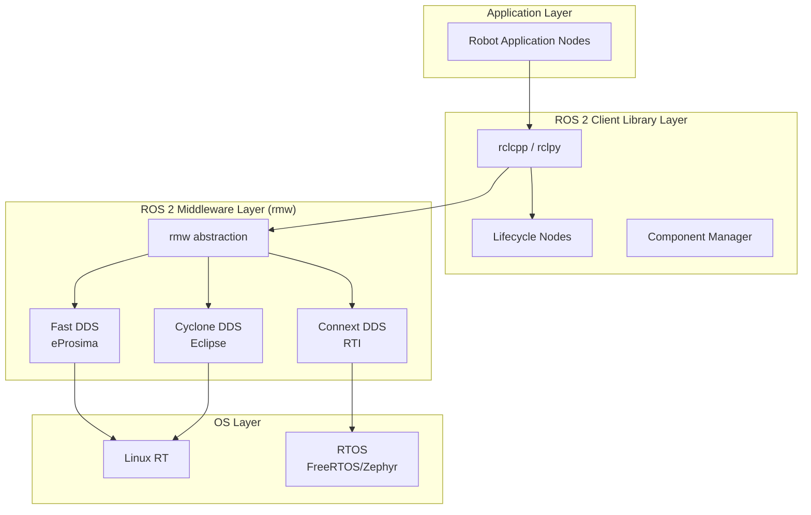
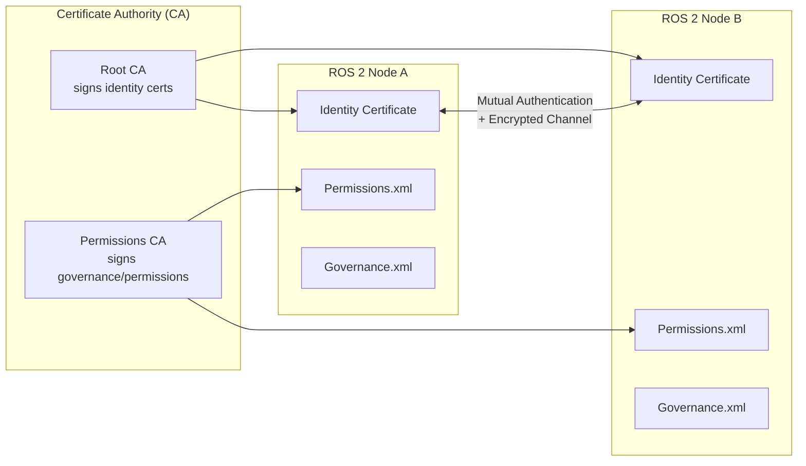
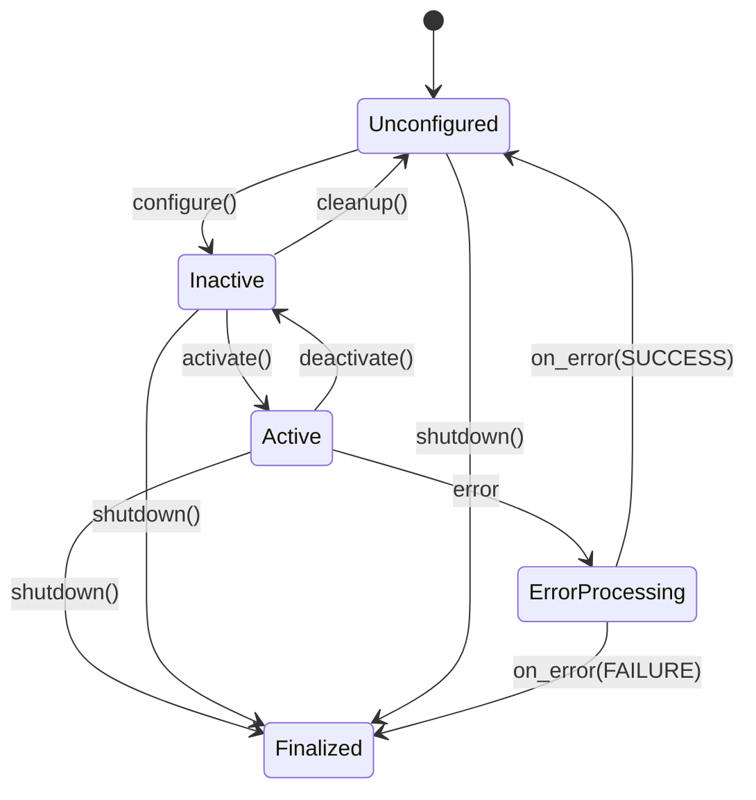
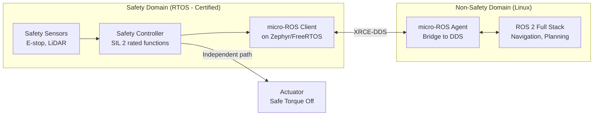
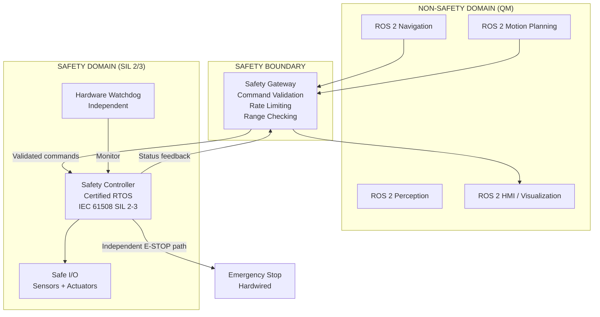

# ROS 2 Safety Architecture

**Category:** 25 — Robotics Safety  
**Document:** 06 — ROS 2 Safety Architecture  
**Standard:** REP-2004, SROS2, IEC 61508, ISO 13849, DDS Security Spec  
**Scope:** ROS 2 safety-relevant components, certification gaps, hybrid architectures  
**Audience:** Robotics software engineers, safety architects, open-source contributors  
**Prerequisites:** ROS 2 fundamentals (nodes, topics, services, actions), DDS middleware

---

## Chapter 1 — ROS 2 Architecture for Safety

### 1.1 ROS 2 Layered Architecture



### 1.2 Safety-Relevant ROS 2 Components

| Component | Safety Role | Maturity for Safety |
|-----------|------------|--------------------| 
| **DDS Middleware** | Deterministic communication, QoS | Medium — depends on DDS vendor certification |
| **Lifecycle Nodes** | State machine control (unconfigured→active→finalized) | High concept, implementation varies |
| **Watchdog (sw_watchdog)** | Node health monitoring | ROS 2 package available; not certified |
| **ros2_control** | Hardware abstraction for actuators | High utility; needs safety wrapper |
| **Bond (bond package)** | Node liveliness monitoring | Experimental; concept proven |
| **Launch system** | Process management, recovery | Not designed for safety |
| **Executor** | Callback scheduling | Determinism depends on configuration |
| **QoS Policies** | Reliability, deadline, liveliness | Critical for safety message delivery |

### 1.3 DDS Quality of Service for Safety

| QoS Policy | Safety Setting | Purpose |
|-----------|---------------|---------|
| Reliability | RELIABLE | Guarantee message delivery |
| Durability | TRANSIENT_LOCAL | Late-joining subscribers get last value |
| Deadline | Set tight deadline | Detect stale safety data |
| Liveliness | MANUAL_BY_TOPIC | Explicit heartbeat from safety nodes |
| History | KEEP_LAST (depth=1) | Only latest safety command matters |
| Lifespan | Short (e.g., 100ms) | Discard outdated safety messages |

---

## Chapter 2 — SROS2: DDS Security for ROS 2

### 2.1 Overview

SROS2 (Secure ROS 2) implements the **OMG DDS Security specification** (v1.1) to provide:
- **Authentication** — X.509 certificates verify node identity
- **Access Control** — Permissions define who can publish/subscribe to which topics
- **Cryptographic** — Encryption of data in transit (AES-GCM)

### 2.2 Security Architecture



### 2.3 SROS2 Configuration Files

| File | Purpose | Content |
|------|---------|---------|
| `identity_ca.cert.pem` | Root CA certificate | CA public key for identity verification |
| `cert.pem` | Node identity certificate | Node's X.509 certificate |
| `key.pem` | Node private key | Used for authentication handshake |
| `permissions_ca.cert.pem` | Permissions CA certificate | Verifies permissions document signatures |
| `governance.xml` | Domain governance policy | Which topics are encrypted/authenticated |
| `permissions.xml` | Per-node permissions | Allowed publish/subscribe/service topics |

### 2.4 Governance Policy Example

```xml
<?xml version="1.0" encoding="UTF-8"?>
<dds xmlns:xsi="http://www.w3.org/2001/XMLSchema-instance">
  <domain_access_rules>
    <domain_rule>
      <domains><id>0</id></domains>
      <allow_unauthenticated_participants>false</allow_unauthenticated_participants>
      <enable_join_access_control>true</enable_join_access_control>
      <discovery_protection_kind>ENCRYPT</discovery_protection_kind>
      <topic_access_rules>
        <topic_rule>
          <topic_expression>rt/safety/*</topic_expression>
          <enable_discovery_protection>true</enable_discovery_protection>
          <enable_read_access_control>true</enable_read_access_control>
          <enable_write_access_control>true</enable_write_access_control>
          <data_protection_kind>ENCRYPT</data_protection_kind>
        </topic_rule>
      </topic_access_rules>
    </domain_rule>
  </domain_access_rules>
</dds>
```

### 2.5 Safety-Security Intersection

| Safety Threat | Security Countermeasure (SROS2) | Residual Risk |
|--------------|-------------------------------|---------------|
| Unauthorized e-stop command | Write access control on /emergency_stop | Compromised CA |
| Spoofed sensor data | Authentication + topic encryption | Supply chain attack on certificates |
| Denial of service (flooding) | Rate limiting (DDS level) | Resource exhaustion still possible |
| Man-in-middle (command injection) | Mutual TLS + message encryption | Implementation vulnerabilities |
| Replay attack (old command) | Lifespan QoS + timestamp validation | Clock synchronization attacks |

---

## Chapter 3 — Lifecycle Nodes & Watchdog

### 3.1 Managed (Lifecycle) Node State Machine



### 3.2 Safety Application of Lifecycle

| State | Safety Meaning | Robot Behavior |
|-------|---------------|----------------|
| **Unconfigured** | Not ready; parameters not loaded | Robot powered but not operational |
| **Inactive** | Configured but not controlling actuators | Monitoring only; brakes engaged |
| **Active** | Full operation; actuators enabled | Normal robot operation |
| **Finalized** | Permanent shutdown | Safe stop; requires restart |
| **Error** | Fault detected | Transition to safe state |

### 3.3 Software Watchdog Pattern

```cpp
// Simplified watchdog concept in ROS 2
class SafetyWatchdog : public rclcpp_lifecycle::LifecycleNode {
  void on_activate() {
    watchdog_timer_ = create_wall_timer(
      100ms, [this]() { check_heartbeats(); });
  }
  
  void check_heartbeats() {
    for (auto& [node_name, last_seen] : monitored_nodes_) {
      auto elapsed = now() - last_seen;
      if (elapsed > timeout_threshold_) {
        RCLCPP_ERROR(get_logger(), "Node %s timeout!", node_name.c_str());
        trigger_safe_stop();
      }
    }
  }
  
  void trigger_safe_stop() {
    // Publish emergency stop
    auto msg = std_msgs::msg::Bool();
    msg.data = true;
    emergency_stop_pub_->publish(msg);
    // Transition self to inactive
    deactivate();
  }
};
```

---

## Chapter 4 — micro-ROS on Safety RTOS

### 4.1 micro-ROS Overview

| Aspect | micro-ROS | Standard ROS 2 |
|--------|-----------|----------------|
| Target | Microcontrollers (Cortex-M, RISC-V) | Linux/Windows/macOS |
| RTOS | FreeRTOS, Zephyr, NuttX, ThreadX | POSIX (Linux RT) |
| DDS | Micro XRCE-DDS (agent/client) | Full DDS (Fast/Cyclone/Connext) |
| Memory | Static allocation possible | Dynamic allocation |
| Footprint | 50-200 KB RAM | GB-scale |
| Real-time | Hard RT possible (with RTOS config) | Soft RT (Linux RT_PREEMPT) |
| Safety cert | Via RTOS certification | Not certifiable (Linux) |

### 4.2 Safety Patterns with micro-ROS



### 4.3 RTOS Safety Certification Status

| RTOS | Safety Certification | Level | Robot Applicability |
|------|---------------------|-------|---------------------|
| SafeRTOS | IEC 61508 SIL 3 | Pre-certified | Direct use in safety-critical loop |
| Zephyr (with safety profile) | IEC 61508 SIL 3 (in progress) | Working toward | micro-ROS target |
| FreeRTOS | Not safety-certified | QM only | Non-safety or with safety wrapper |
| QNX Neutrino | IEC 61508 SIL 3, ISO 26262 ASIL D | Certified | Industrial/automotive robots |
| VxWorks | IEC 61508 SIL 3, DO-178C DAL A | Certified | Aerospace, critical robots |
| PikeOS | IEC 61508 SIL 4, EN 50128 | Certified | Hypervisor for mixed-criticality |
| INTEGRITY | IEC 61508, DO-178B | Certified | Defense, space robots |

---

## Chapter 5 — REP-2004: Quality Declaration Framework

### 5.1 Quality Levels

ROS Enhancement Proposal (REP) 2004 defines quality levels 1-5 for ROS 2 packages:

| Quality Level | Description | Requirements | Safety Implication |
|--------------|-------------|--------------|-------------------|
| **Level 1** | Highest quality | Full CI, 95%+ coverage, API stability, docs, peer review | Candidate for safety-critical use |
| **Level 2** | High quality | CI, good coverage, stable API | Suitable for safety-related monitoring |
| **Level 3** | Acceptable quality | Basic CI, some coverage | Non-safety only |
| **Level 4** | Developing | Limited testing | Prototyping only |
| **Level 5** | Experimental | No guarantees | Research only |

### 5.2 Quality Level 1 Requirements (Summary)

| Category | Requirement |
|----------|-------------|
| Version policy | semver, ABI/API stability |
| Change control | Peer-reviewed PRs, CHANGELOG |
| Documentation | API docs, tutorials, design docs |
| Testing | Unit, integration, system tests; coverage ≥ 95% line, ≥ 95% branch |
| Dependencies | Only Level 1 or 2 dependencies |
| Platform support | All Tier 1 platforms (Ubuntu LTS, Windows, macOS) |
| Security | Vulnerability disclosure process, security audit |
| Linting | Consistent code style (ament_lint) |

### 5.3 Current Package Quality Status (ROS 2 Jazzy/Rolling)

| Package | Quality Level | Safety-Critical? |
|---------|--------------|-----------------|
| rclcpp | Level 1 | Foundation for all C++ nodes |
| rcl | Level 1 | Core client library |
| rmw_fastrtps_cpp | Level 1 | DDS middleware interface |
| nav2_core | Level 2 | Navigation framework |
| ros2_control | Level 2 | Hardware abstraction |
| sw_watchdog | Level 3-4 | Safety monitoring (concept) |
| bond | Level 4 | Node liveliness |
| moveit2 | Level 3 | Motion planning |

---

## Chapter 6 — IEC 61508 Compliance Gaps in ROS 2

### 6.1 Gap Analysis

| IEC 61508 Requirement | ROS 2 Current State | Gap Severity |
|----------------------|--------------------| -------------|
| **Safety lifecycle (V-model)** | No formal safety lifecycle documentation | **Critical** |
| **Software safety integrity** | No SIL claim; REP-2004 is quality, not safety | **Critical** |
| **Systematic capability** | Some process maturity (Level 1 packages) | **High** |
| **Architectural constraints** | No formal architecture safety analysis | **High** |
| **Coding standards** | ament_lint (style); no MISRA-C/C++ | **High** |
| **Static analysis** | Some tools (clang-tidy, cppcheck); not systematic | **Medium** |
| **MC/DC coverage** | Not measured (only line/branch) | **High** |
| **Independent verification** | Not performed by third party | **Critical** |
| **Configuration management** | Git-based; release process exists | **Medium** |
| **Traceability** | Requirements ↔ Test: partial (REP-based) | **High** |
| **Fault tolerance** | No systematic FMEA of ROS 2 stack | **Critical** |
| **Determinism** | DDS is best-effort on timing guarantees | **High** |
| **Dynamic memory** | Extensive use of heap allocation | **High** |
| **Exception handling** | C++ exceptions used widely | **Medium** |

### 6.2 Why ROS 2 Cannot Be Directly Certified

| Fundamental Barrier | Explanation |
|--------------------| ------------|
| Open-source development model | No single responsible organization for safety claims |
| Linux kernel dependency | Linux is not certifiable (too complex, no safety lifecycle) |
| Dynamic memory allocation | Violates IEC 61508 / ISO 26262 restrictions for SIL ≥ 2 |
| Non-deterministic scheduling | Cannot guarantee worst-case execution time on Linux |
| Third-party DDS dependencies | DDS vendor must also be certified |
| No formal safety case | No hazard analysis, FMEA, or safety manual for ROS 2 stack |
| Code complexity | Millions of LOC in dependencies |

---

## Chapter 7 — Hybrid Architecture Pattern (Safety-Certified + ROS 2)

### 7.1 Architecture Philosophy

The industry consensus for safety-critical robotics:
- **ROS 2 handles planning, perception, HMI** (non-safety)
- **Certified safety controller handles actuator control** (safety-critical)
- **Clean interface** between domains with safety monitoring

### 7.2 Reference Architecture



### 7.3 Safety Gateway Functions

| Function | Description | Performance Level |
|----------|-------------|-------------------|
| Command range checking | Velocity, acceleration within safe bounds | PL d |
| Rate limiting | Maximum command frequency | PL c |
| Watchdog monitoring | Detect ROS 2 node failure | PL d |
| Graceful degradation | Reduce capability on partial failure | PL c |
| State machine enforcement | Only valid state transitions allowed | PL d |
| Emergency override | Hardware e-stop bypasses all software | PL e |

### 7.4 Commercial Safety Controllers for ROS 2 Integration

| Product | Manufacturer | Certification | ROS 2 Interface |
|---------|-------------|---------------|-----------------|
| Pilz PSS 4000 | Pilz | PL e, SIL 3 | OPC UA / Ethernet |
| SICK Flexi Soft | SICK | PL e, SIL 3 | EtherNet/IP, PROFINET |
| Siemens SIMATIC Safety | Siemens | PL e, SIL 3 | PROFINET / OPC UA |
| ABB SafeMove | ABB | PL d | Robot controller internal |
| KUKA SafeOperation | KUKA | PL d | Robot controller internal |
| Bosch Rexroth SafeLogic | Bosch | PL e, SIL 3 | sercos / EtherCAT |

---

## Chapter 8 — ROS 2 Safety Working Group Efforts

### 8.1 Active Initiatives

| Initiative | Organization | Goal | Status (2024) |
|-----------|-------------|------|---------------|
| ROS 2 Safety WG | Open Robotics + community | Define safety patterns for ROS 2 | Active but informal |
| ROSIN SafeROS | EU Horizon project | Safety layer for ROS 2 | Completed (research) |
| micro-ROS safety | eProsima + Bosch | Safety-certifiable ROS 2 for MCU | Active development |
| ELISA (Linux safety) | Linux Foundation | Certifiable Linux kernel subsets | Active |
| Autoware safety | Autoware Foundation | Autonomous driving with ROS 2 | Active |
| Safety Island concept | Multiple vendors | Certified subsystem + ROS 2 QM | Industry pattern |

### 8.2 Proposed Safety Architecture Standards (ROS 2 Community)

| Proposal | Description | Adoption |
|----------|-------------|----------|
| Safety node pattern | Dedicated safety monitor nodes with highest priority | Widely discussed |
| Deterministic executor | Single-threaded, priority-based callback execution | ros2_realtime_support |
| Static allocation mode | Avoid malloc/new in runtime path | micro-ROS supports this |
| Formal QoS contracts | Enforce deadline/liveliness at middleware level | DDS supports; ROS 2 partial |
| Safety domain isolation | Separate DDS domain for safety topics | Architectural pattern |

---

## Chapter 9 — Practical Implementation Guidance

### 9.1 Design Checklist for Safety-Related ROS 2 Systems

| # | Checklist Item | IEC 61508 Reference |
|---|----------------|-------------------|
| 1 | Identify safety functions and assign SIL/PLr | Clause 7.4 |
| 2 | Separate safety-critical from non-safety code | Clause 7.4.2.2 |
| 3 | Use certified RTOS for safety-critical path | Clause 7.4.4 |
| 4 | Implement hardware watchdog independent of ROS 2 | Clause 7.4.11 |
| 5 | Use RELIABLE QoS + DEADLINE for safety topics | DDS spec |
| 6 | Enable SROS2 for all safety-related topics | DDS Security spec |
| 7 | Implement lifecycle nodes for controlled transitions | REP-2012 |
| 8 | Static memory allocation for safety path | Clause 7.4.4.14 |
| 9 | Measure WCET for safety callbacks | Clause 7.4.5 |
| 10 | Document safety case with clear boundary | ISO 61508 Part 1 |

### 9.2 Anti-Patterns (What NOT to Do)

| Anti-Pattern | Why Dangerous | Correct Approach |
|-------------|---------------|------------------|
| Safety e-stop via ROS 2 topic only | ROS 2 is QM; single point of failure | Hardwired e-stop + ROS 2 notification |
| Trust Linux timers for safety deadline | Linux is not real-time certified | Safety timer in certified RTOS |
| Use dynamic allocation in safety loop | Heap exhaustion → undefined behavior | Pre-allocated buffers, static allocation |
| Single DDS domain for everything | Safety messages compete with bulk data | Separate safety DDS domain |
| Rely on ROS 2 launch for recovery | Launch is not fault-tolerant | Hardware watchdog triggers restart |
| Skip SROS2 "because internal network" | Insider threat, misconfiguration | Always enable SROS2 for safety topics |

---

## Chapter 10 — Interview Questions

### Entry-Level
1. What is DDS and why does ROS 2 use it instead of the ROS 1 master?
2. Explain QoS reliability and deadline policies in context of safety messages.
3. What is SROS2 and what three protections does it provide?

### Mid-Level
1. Design a lifecycle node state machine for a robot arm safety controller in ROS 2.
2. Why can't ROS 2 on Linux be directly certified to IEC 61508 SIL 2?
3. Explain the hybrid architecture pattern (certified safety controller + ROS 2) and draw the boundary.

### Senior
1. Design a complete safety architecture for an AMR using ROS 2 navigation with a certified safety layer.
2. How would you implement a safety watchdog in ROS 2 that detects both node crashes and node hangs?
3. Propose a testing strategy to verify that the safety gateway correctly rejects invalid commands from ROS 2.

### Principal
1. Design a roadmap for making portions of ROS 2 certifiable to IEC 61508 SIL 2. What would need to change?
2. How should the ROS 2 executor be redesigned to provide deterministic scheduling guarantees?
3. Propose a formal verification approach for the ROS 2 ↔ safety controller interface.

---

*Document Version: 1.0 | Last Updated: May 2026 | Author: Robotics Safety Standards Team*
