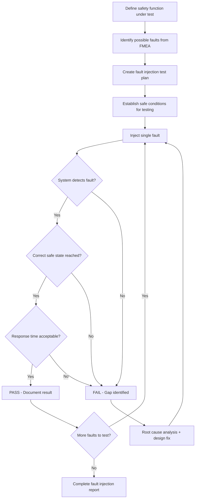

# Functional Safety in Robots — SIL & PLr Mapping

**Category:** 25 — Robotics Safety  
**Document:** 07 — Functional Safety in Robots: SIL & PLr  
**Standard:** IEC 61508:2010, IEC 62061:2021, ISO 13849-1:2023  
**Scope:** Mapping robot safety functions to SIL/PLr, safety controller qualification, fault injection  
**Audience:** Functional safety engineers, robot system integrators, SIL assessors  
**Prerequisites:** Understanding of IEC 61508 lifecycle, ISO 13849 categories

---

## Chapter 1 — Robot Safety Functions

### 1.1 Definition of Safety Function (IEC 61508)

A **safety function** is a function implemented by an E/E/PE safety-related system that is intended to achieve or maintain a safe state in respect of a specific hazardous event.

### 1.2 Common Robot Safety Functions

| # | Safety Function | Abbreviation | Description | Typical SIL/PL |
|---|----------------|-------------|-------------|----------------|
| 1 | Safe Torque Off | **STO** | Remove torque from motor; no movement | SIL 2 / PL d |
| 2 | Safe Stop 1 | **SS1** | Controlled deceleration then STO | SIL 2 / PL d |
| 3 | Safe Stop 2 | **SS2** | Controlled stop; torque maintained (position hold) | SIL 2 / PL d |
| 4 | Safely-Limited Speed | **SLS** | Monitor speed; STO if exceeded | SIL 2 / PL d |
| 5 | Safely-Limited Position | **SLP** | Monitor position; STO if exceeded | SIL 2 / PL d |
| 6 | Safely-Limited Torque | **SLT** | Monitor torque/force; STO if exceeded | SIL 2 / PL d |
| 7 | Safe Direction | **SDI** | Monitor direction of rotation | SIL 2 / PL d |
| 8 | Safe Operating Stop | **SOS** | Position monitoring at standstill | SIL 2 / PL d |
| 9 | Safe Speed Monitor | **SSM** | Report speed status to higher-level safety | SIL 2 / PL d |
| 10 | Safe Brake Control | **SBC** | Control brake engagement safely | SIL 2 / PL d |
| 11 | Emergency Stop | **E-STOP** | Category 0 or 1 stop on demand | SIL 2 / PL d |
| 12 | Protective Stop | **P-STOP** | Safety device triggered stop | SIL 2 / PL d |
| 13 | Safety-rated Monitored Stop | **SMS** | Collaborative robot standstill when human present | SIL 2 / PL d |
| 14 | Reduced Speed Mode | **RSM** | Limit speed during teach/maintenance | SIL 1 / PL c |
| 15 | Safe Zone Monitoring | **SZM** | Cartesian space restriction | SIL 2 / PL d |

### 1.3 Safety Function to IEC 61800-5-2 Mapping

| IEC 61800-5-2 Function | Robot Application | Implementation |
|------------------------|-------------------|----------------|
| STO | Power removal from servo drives | Drive-integrated or external safety relay |
| SS1 | Controlled deceleration before STO | Drive ramp-down + STO after timeout |
| SS2 | Position hold (cobot stopped near human) | Active position control + monitoring |
| SLS | Speed monitoring during collaborative operation | Encoder monitoring + STO on violation |
| SLP | Workspace restriction (virtual fence) | Position encoder + Cartesian calculation |
| SOS | Robot stationary verification | Encoder standstill monitoring |
| SBC | Mechanical brake engagement | Fail-safe brake + monitoring |

---

## Chapter 2 — SIL/PLr Assignment for Robot Systems

### 2.1 SIL Determination Methods

| Method | Standard | Approach | Output |
|--------|----------|----------|--------|
| Risk graph | IEC 62061, IEC 61508 | Qualitative parameters → SIL | SIL 1-3 |
| Risk graph | ISO 13849-1 | S, F, P parameters → PLr | PL a-e |
| LOPA (Layers of Protection Analysis) | IEC 61511 (process, adapted) | Quantitative risk reduction | Target PFH |
| Hazard and Risk Assessment | ISO 12100 | Severity × Probability → Risk Level | Input to SIL/PLr |
| Tolerable Risk Method | IEC 62061 Annex A | Severity + probability classes | SIL from table |

### 2.2 IEC 62061 SIL Assignment Table

| Severity (Se) | Class | Description |
|--------------|-------|-------------|
| 4 | Death, loss of eye/arm | Irreversible |
| 3 | Permanent (broken bones, loss of finger) | Serious irreversible |
| 2 | Reversible (requiring medical attention) | Moderate |
| 1 | Slight (first-aid only) | Minor |

| Frequency (Fr) | Class | Exposure Time |
|---------------|-------|---------------|
| 5 | ≥ 1/h | Continuous |
| 4 | > 1/day to < 1/h | Frequent |
| 3 | > 1/2 weeks to ≤ 1/day | Occasional |
| 2 | > 1/year to ≤ 1/2 weeks | Rare |
| 1 | ≤ 1/year | Very rare |

| Probability of Occurrence (Pr) | Class | Avoidance |
|-------------------------------|-------|-----------|
| 5 | Very high | Impossible to avoid |
| 4 | Likely | Hardly possible |
| 3 | Possible | Under certain conditions |
| 2 | Rarely | Possible with training |
| 1 | Negligible | Easy to avoid |

**SIL Determination Matrix (Se × Fr × Pr → Cl):**

$$Cl = Fr + Pr + Av$$

| Class (Cl) | Se = 4 | Se = 3 | Se = 2 | Se = 1 |
|-----------|--------|--------|--------|--------|
| 3-4 | SIL 2 | — | — | — |
| 5-7 | SIL 2 | SIL 1 | — | — |
| 8-10 | SIL 2 | SIL 2 | SIL 1 | — |
| 11-13 | SIL 3 | SIL 2 | SIL 2 | SIL 1 |
| 14-15 | SIL 3 | SIL 3 | SIL 2 | SIL 1 |

### 2.3 Typical Robot SIL/PLr Assignments

| Application | Safety Function | SIL | PLr | Justification |
|-------------|----------------|-----|-----|---------------|
| Industrial robot cell e-stop | E-STOP (Cat 0/1) | SIL 2 | PL d | Se=4, Fr=4, Pr=3 → Cl=7 |
| Cobot speed monitoring (SSM) | SLS | SIL 2 | PL d | Se=3-4, Fr=5, Pr=3 → Cl=8-11 |
| Light curtain protective stop | P-STOP | SIL 2 | PL d | Se=4, Fr=4, Pr=4 → Cl=8 |
| Guard door interlock | Protective stop | SIL 2 | PL d | Se=4, Fr=3, Pr=3 → Cl=6 |
| Teach pendant enabling device | Reduced speed | SIL 1 | PL c | Se=3, Fr=2, Pr=2 → Cl=4 |
| AMR protective field stop | Emergency stop | SIL 2 | PL d | Se=3, Fr=5, Pr=3 → Cl=8 |
| Surgical robot force limiting | SLT | SIL 2-3 | PL d-e | Se=4, Fr=5, Pr=4 → Cl=9 (IEC 60601) |
| Robot workspace restriction | SLP (virtual fence) | SIL 2 | PL d | Se=4, Fr=4, Pr=3 → Cl=7 |

---

## Chapter 3 — Safety Controller Qualification

### 3.1 Safety Controller Comparison

| Product | Manufacturer | Max SIL | Max PL | Architecture | Programming |
|---------|-------------|---------|--------|--------------|-------------|
| **PNOZ multi 2** | Pilz | SIL 3/CL 3 | PL e | 1oo2D | PNOZmulti Configurator |
| **PSS 4000 (PSSu)** | Pilz | SIL 3/CL 3 | PL e | 1oo2D | PAS4000 (PASmulti/PASlogic) |
| **Flexi Soft** | SICK | SIL 3 | PL e | 1oo2D + diverse | Flexi Soft Designer |
| **SIMATIC S7-1500F** | Siemens | SIL 3 | PL e | 1oo2 (F-CPU) | TIA Portal Safety |
| **GuardLogix** | Rockwell/Allen-Bradley | SIL 3 | PL e | 1oo2 | Studio 5000 Safety |
| **PlutoGateway** | ABB/Jokab | SIL 3 | PL e | 1oo2D | Pluto Manager |
| **SIRIUS Safety** | Siemens | SIL 3 | PL e | Modular relay + PLC | HW config |
| **MSI 400** | Leuze | SIL 3 | PL e | Relay-based | DIP switches |

### 3.2 Architecture Patterns

| Architecture | Description | SIL Capability | Example |
|-------------|-------------|----------------|---------|
| **1oo1** | Single channel | SIL 1 max (with high DC) | Simple safety relay |
| **1oo1D** | Single channel + diagnostics | SIL 2 | Safety PLC single-channel mode |
| **1oo2** | Dual channel, both must agree | SIL 2-3 | Redundant safety PLC (F-CPU) |
| **1oo2D** | Dual channel + diagnostics | SIL 3 | Safety PLC with diverse processing |
| **2oo3** | Triple modular redundancy (vote) | SIL 3-4 | Triple-channel process safety |
| **2oo2** | Dual channel, both must be healthy | SIL 1-2 | High-availability, moderate safety |

### 3.3 Qualification Process for Safety Controllers

| Step | Activity | Evidence |
|------|----------|----------|
| 1 | Select controller with SIL/PL certificate | Manufacturer's SIL certificate |
| 2 | Verify Safety Manual compliance | Application meets Safety Manual constraints |
| 3 | Configure safety application | Application program with safety parameters |
| 4 | Verify application logic | Logic review, simulation, test |
| 5 | Calculate PFH/PL for subsystem | Include controller + I/O + actuators |
| 6 | Validate in target environment | Functional test + fault injection |
| 7 | Document in safety case | Integration report, test evidence |

### 3.4 Safety Manual Requirements (IEC 61508-2 Clause 7.4.7)

| Information Required | Purpose |
|---------------------|---------|
| Safety function capability | Maximum SIL achievable |
| Architectural constraints | HFT, DC requirements |
| Failure rates (λ_D, λ_DD, λ_DU) | For PFH calculation |
| Proof test interval (T_proof) | When to perform full test |
| Useful lifetime | When to replace |
| Environmental constraints | Temperature, humidity, EMC |
| Application restrictions | What you CANNOT use it for |
| Diagnostic behavior | What happens on detected fault |
| Response time | Worst-case safety response |
| Installation requirements | Wiring, separation, grounding |

---

## Chapter 4 — Tool Qualification for Robot Programming

### 4.1 IEC 61508 Tool Classification

| Tool Class | Impact | Certification Needed | Example |
|-----------|--------|---------------------|---------|
| **T1** | Cannot introduce errors AND cannot fail to detect errors | None | Text editor, version control |
| **T2** | Can fail to detect errors but cannot introduce errors | Increased confidence measures | Static analysis tool, test tool |
| **T3** | Can directly introduce errors into safety-related system | Full qualification per IEC 61508 | Compiler, safety PLC IDE, code generator |

### 4.2 Robot Programming Tool Qualification

| Tool | Class | Qualification Approach |
|------|-------|----------------------|
| Robot OEM programming environment (ABB RobotStudio) | T3 | Manufacturer certifies; user validates application |
| Safety PLC IDE (TIA Portal Safety) | T3 | Siemens certified per IEC 61508 |
| Sistema (ISO 13849 calculation) | T2 | IFA validated tool |
| Compiler (GCC, MSVC) | T3 | Diverse compilation, back-to-back test |
| MATLAB/Simulink (code generation) | T3 | MathWorks IEC 61508 certification kit |
| Static analysis (Polyspace, PC-lint) | T2 | Validate against known defects |
| Unit test framework (Google Test) | T2 | Validate framework with known-answer tests |

### 4.3 Offline Programming & Simulation

| Consideration | Requirement | Standard Reference |
|---------------|-------------|-------------------|
| Model fidelity | Simulation must represent real robot accurately | IEC 61508-3 Clause 7.4.7 |
| Gap analysis | Document differences between simulation and reality | ISO 10218-2 Clause 5.4 |
| Commissioning test | ALWAYS verify safety functions on physical system | ISO 13849-2 |
| Teach pendant validation | Verify programmed paths don't violate safety zones | ISO 10218-1 Clause 5.5 |

---

## Chapter 5 — Fault Injection Test Methodologies

### 5.1 Purpose of Fault Injection

Fault injection testing validates that:
1. The safety system **detects** dangerous faults
2. The system transitions to a **safe state** upon detection
3. **No single fault** leads to loss of the safety function (for Category 3/4, SIL 2/3)
4. **No accumulation of faults** goes undetected (for Category 4)

### 5.2 Fault Types to Inject

| Fault Category | Specific Faults | Injection Method |
|---------------|----------------|------------------|
| **Open circuit** | Wire break, connector failure | Disconnect wire/connector |
| **Short circuit** | Wire-to-wire, wire-to-ground, wire-to-supply | Jumper wire or relay switch |
| **Stuck-at** | Signal permanently high or low | Force signal with power supply |
| **Timing** | Late response, missing heartbeat | Delay injection (software or hardware) |
| **Data corruption** | Wrong value, bit flip | Modify register or memory |
| **Power failure** | Supply drop, transient | Controlled power interruption |
| **EMC disturbance** | Electromagnetic interference | IEC 61000-4-x test levels |
| **Mechanical** | Stuck valve, broken spring | Physical manipulation |
| **Sensor failure** | Blind sensor, frozen value | Cover sensor or inject false signal |
| **Actuator failure** | Stuck contactor, failed brake | Block mechanism or disable coil |

### 5.3 Fault Injection Protocol

### 5.4 Fault Injection Test Report Template

| Field | Content |
|-------|---------|
| Safety Function ID | SF-001: Emergency Stop |
| Test ID | FI-001-03 |
| Fault injected | Channel A open circuit (e-stop wiring) |
| Pre-conditions | Robot in automatic mode, TCP moving |
| Expected behavior | Channel B maintains safety; fault detected within TFD |
| Actual behavior | Robot stopped via Channel B; fault LED activated in 45 ms |
| Pass/Fail | **PASS** |
| Response time measured | 45 ms (requirement: < 100 ms) |
| Notes | Cross-monitoring detected within 2 cycles |

### 5.5 Coverage Requirements

| SIL / Category | Single Fault Coverage | Dual Fault Coverage | DC Required |
|----------------|---------------------|--------------------| ------------|
| SIL 1 / Cat 2 | All credible single faults tested | Not required | ≥ 60% |
| SIL 2 / Cat 3 | All credible single faults tested | Combination of most common | ≥ 90% |
| SIL 3 / Cat 4 | 100% single fault coverage | Systematic dual-fault analysis | ≥ 99% |

---

## Chapter 6 — PFH Calculation for Robot Safety Systems

### 6.1 PFH_d Formula (Simplified for 1oo2D Architecture)

$$PFH_{system} = PFH_{sensor} + PFH_{logic} + PFH_{actuator}$$

For 1oo2 subsystem:
$$PFH_{1oo2} = 2 \times (1 - DC) \times \lambda_{D} \times T_1 \times \lambda_{D} + 2 \times DC \times \lambda_{D} \times T_2 \times \lambda_{D}$$

Simplified (if DC is high and T_1 >> T_2):
$$PFH_{1oo2} \approx 2 \times (1-DC_{avg}) \times \lambda_D^2 \times T_{proof}$$

Where:
- $\lambda_D$ = dangerous failure rate per hour
- $DC_{avg}$ = average diagnostic coverage
- $T_{proof}$ = proof test interval (hours)
- $T_1$ = time between proof tests
- $T_2$ = time between diagnostic tests

### 6.2 Example Calculation — E-Stop Circuit

| Subsystem | Component | λ_D (per hour) | DC | Architecture |
|-----------|-----------|----------------|----| -------------|
| Input (sensor) | 2× E-stop buttons | 1.14 × 10⁻⁷ | 99% (cross-monitoring) | 1oo2 |
| Logic | Safety relay (PNOZ) | 5.7 × 10⁻⁹ | 99% (internal) | 1oo2D |
| Output (actuator) | 2× contactors + EDM | 2.28 × 10⁻⁷ | 99% (EDM feedback) | 1oo2 |

**Total PFH_d** ≈ 3.5 × 10⁻⁸ per hour → **SIL 2** (requirement: < 10⁻⁶)

---

## Chapter 7 — Proof Testing & Maintenance

### 7.1 Proof Test Requirements

| SIL/PL | Recommended Proof Test Interval | Coverage Required |
|--------|-------------------------------|-------------------|
| SIL 1 / PL c | Annual (or per manufacturer) | 90% of undetected faults |
| SIL 2 / PL d | 6-12 months | > 90% of undetected faults |
| SIL 3 / PL e | 3-6 months (or continuous monitoring) | > 99% coverage |

### 7.2 Robot Safety System Proof Test Checklist

| Test Item | Method | Frequency | Acceptance |
|-----------|--------|-----------|------------|
| E-stop function | Activate each button; verify stop | Monthly | Full stop within specification |
| Guard door interlock | Open each door; verify stop | Monthly | Stop + no restart without reset |
| Light curtain | Interrupt beam at all heights | Monthly | Stop within response time |
| Safety PLC diagnostics | Check fault log | Weekly | No unresolved faults |
| Brake function | Release and check holding | Quarterly | No drift beyond tolerance |
| Speed monitoring | Measure actual vs. monitored speed | Quarterly | Within ±5% |
| Position limits (SLP) | Command beyond limit; verify stop | Quarterly | Stop before limit breach |
| Force monitoring | Apply known force; verify response | Quarterly | Trip at correct threshold |

---

## Chapter 8 — Common Pitfalls & Best Practices

### 8.1 Common Mistakes

| Mistake | Consequence | Correct Approach |
|---------|-------------|------------------|
| Using standard PLC for safety function | No safety integrity claim possible | Use F-CPU or safety relay |
| Not considering common cause failure | Overestimated reliability | CCF analysis per ISO 13849 |
| SIL 2 claim with SIL 1 sensors | System limited to lowest subsystem SIL | All subsystems must meet target |
| No proof testing defined | PFH degrades over time | Document and enforce proof test schedule |
| Bypassing safety during commissioning | Incident during setup | Use safe-rated reduced speed mode |
| Mixing safety and non-safety I/O on same module | Possible interference | Use dedicated safety I/O modules |
| Not validating after modification | Unknown safety state | Re-validate per ISO 13849-2 after any change |

### 8.2 Best Practices

| Practice | Benefit |
|----------|---------|
| Use pre-certified components (SIL certificates) | Reduced qualification effort |
| Maintain safety case documentation | Traceability, audit-ready |
| Independent assessment (third-party) | Unbiased verification |
| Plan for modifications (management of change) | Prevent safety degradation |
| Train all personnel on safety system | Prevent human-induced failures |
| Implement defense-in-depth | Multiple independent layers |
| Monitor field failure data | Continuous SIL validation |

---

## Chapter 9 — Standards Cross-Reference

| Robot Type | Primary Safety Standard | Safety Function Standard | Control System Standard |
|-----------|----------------------|------------------------|----------------------|
| Industrial robot | ISO 10218-1/2 | IEC 62061 or ISO 13849 | IEC 61800-5-2 (drives) |
| Collaborative robot | ISO 10218-2 + ISO/TS 15066 | ISO 13849 (PLr d typically) | IEC 61800-5-2 |
| Mobile robot (AMR) | ISO 3691-4 | ISO 13849 or IEC 62061 | ISO 3691-4 Clause 5 |
| Personal care robot | ISO 13482 | ISO 13849 or IEC 62061 | ISO 13482 Clause 5 |
| Surgical robot | IEC 60601-1 + IEC 80601-2-77 | IEC 62304 (software) | IEC 60601-1 Clause 14 |
| Agricultural robot | ISO 18497 | ISO 13849 | IEC 62061 |

---

## Chapter 10 — Interview Questions

### Entry-Level
1. What is the difference between SIL and PL? How do they relate?
2. Name five common robot safety functions and their abbreviations.
3. What is a Safety Integrity Level and how many levels are defined for machinery?

### Mid-Level
1. Walk through the IEC 62061 SIL assignment process for an industrial robot emergency stop.
2. Explain the difference between 1oo1D and 1oo2D architectures.
3. What is fault injection testing and when is it required?

### Senior
1. Design a complete safety function allocation for a 6-axis collaborative robot cell.
2. Calculate PFH_d for a dual-channel safety circuit and prove it meets SIL 2.
3. How do you qualify a safety PLC application program per IEC 61508?

### Principal / Chief Safety Engineer
1. Propose a methodology for continuous SIL validation using digital twin and field failure data.
2. How should functional safety standards evolve to address ML-based robot safety functions?
3. Design a cross-standard harmonization framework combining ISO 13849, IEC 62061, and IEC 61800-5-2 for a multi-robot flexible manufacturing cell.

---

*Document Version: 1.0 | Last Updated: May 2026 | Author: Robotics Safety Standards Team*
