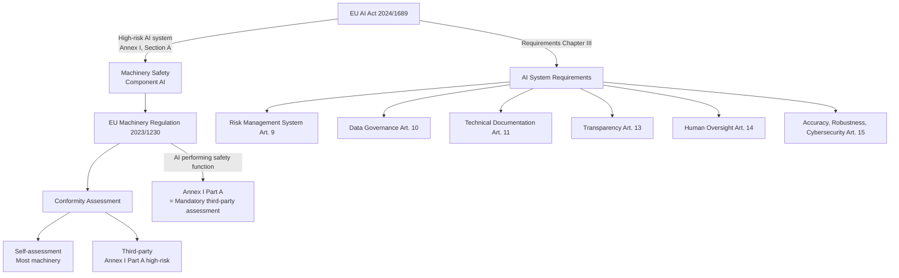

# EU Machinery Regulation 2023/1230

**Category:** 25 — Robotics Safety  
**Document:** 08 — EU Machinery Regulation 2023  
**Standard:** Regulation (EU) 2023/1230, EU AI Act (Regulation (EU) 2024/1689)  
**Scope:** Transition from Machinery Directive 2006/42/EC, AI-controlled machinery, self-learning systems  
**Audience:** CE marking consultants, robot manufacturers, compliance teams, legal/regulatory affairs  
**Prerequisites:** Familiarity with EU regulatory framework, prior Machinery Directive 2006/42/EC

---

## Chapter 1 — Regulatory Transition Overview

### 1.1 Key Dates

| Milestone | Date | Significance |
|-----------|------|--------------|
| Machinery Directive 2006/42/EC published | June 9, 2006 | Current directive enters force |
| Commission proposal for new Regulation | April 21, 2021 | Legislative process begins |
| Regulation (EU) 2023/1230 published | June 29, 2023 | Official Journal publication |
| Entry into force | July 19, 2023 | 20 days after publication |
| **Application date** | **January 20, 2027** | Mandatory compliance deadline |
| 2006/42/EC repealed | January 20, 2027 | Old directive no longer valid |
| Transition period | July 2023 – January 2027 | 42 months to comply |

### 1.2 Directive vs. Regulation

| Aspect | Directive 2006/42/EC | Regulation 2023/1230 |
|--------|---------------------|---------------------|
| Legal instrument | Directive (transposed by each Member State) | Regulation (directly applicable in all EU) |
| National implementation | 27 different national laws | Single EU-wide text |
| Interpretation variance | Yes (differing transpositions) | No (uniform application) |
| Amendment process | EU + national amendment needed | EU amendment only |
| Legal certainty | Medium (national differences) | High (single text) |

### 1.3 Scope Comparison

| Item | 2006/42/EC | 2023/1230 | Change |
|------|-----------|-----------|--------|
| Machinery | ✅ | ✅ | Same |
| Partly completed machinery | ✅ | ✅ | Clarified |
| Safety components | ✅ | ✅ | Expanded list |
| Interchangeable equipment | ✅ | ✅ | Same |
| Lifting accessories | ✅ | ✅ | Same |
| Chains, ropes, webbing | ✅ | ✅ | Same |
| Removable mechanical transmission devices | ✅ | ✅ | Same |
| **Related products (new)** | ❌ | ✅ | **NEW category** |
| **Software ensuring safety function** | Implicit | ✅ **Explicit** | **Major change** |
| **AI/ML systems performing safety function** | ❌ | ✅ **Explicit** | **Major change** |

---

## Chapter 2 — Key Changes for Robotics

### 2.1 Major Changes Summary

| # | Change | Impact on Robotics | Article/Annex |
|---|--------|-------------------|---------------|
| 1 | Digital documentation allowed | No more paper-only manuals required | Art. 10(7) |
| 2 | Digital Declaration of Conformity | QR code / URL permitted | Art. 21 |
| 3 | **Substantial modification** defined | Modifying a robot may = new machinery | Art. 3(16), Art. 18 |
| 4 | **AI/ML safety software** as safety component | AI performing safety function → Annex I requirements | Art. 3(3), Annex I 1.1.9 |
| 5 | **Cyber-security EHSR** | Protection against corruption of safety functions | Annex I 1.1.9 |
| 6 | **Autonomous/mobile machinery** | Specific EHSR for autonomous systems | Annex I 1.3.7(a) |
| 7 | Annex I (high-risk) expanded | More machine categories require third-party assessment | Annex I Part A |
| 8 | Market surveillance strengthened | National authorities get more enforcement power | Art. 41-50 |
| 9 | Conformity assessment updated | Notified Body involvement expanded | Art. 25-30 |
| 10 | Harmonized standards obligation | European Commission can mandate CEN/CENELEC | Art. 20 |

### 2.2 Substantial Modification (Article 18)

A **substantial modification** makes a previously compliant machine into a "new" machine that must be re-certified:

| Criterion | Description | Robot Example |
|-----------|-------------|---------------|
| New hazard or increased risk | Modification creates hazard not previously assessed | Adding higher-payload tool to cobot |
| Safety devices no longer adequate | Existing safeguards insufficient for modified machine | Increasing speed beyond original safety zone design |
| New safety concept needed | Fundamental change in risk reduction strategy | Replacing guard doors with collaborative operation |
| Performance of safety function affected | Modification impacts SIL/PL of safety system | Software update to safety controller |

### 2.3 Autonomous and Mobile Machinery (Annex I, 1.3.7)

New Essential Health & Safety Requirements (EHSR) specifically addressing autonomous operation:

| EHSR | Requirement | Application to Robots |
|------|-------------|----------------------|
| 1.3.7(a) | Autonomous machinery must limit its operation to defined area | Robot workspace restriction, geofencing |
| 1.3.7(b) | Avoid collision with persons | Presence detection, safety-rated speed |
| 1.3.7(c) | Machinery with operator must prevent movement while human is in dangerous zone | Collaborative operation requirements |
| 1.3.7(d) | Safe for persons being transported | Person carrier robots (ISO 13482 Type C) |
| 1.3.7(e) | Communication to indicate intended movement | Signal lights, sound warnings, HMI |
| 1.3.7(f) | Human must be able to override/stop at any time | E-stop accessible, override priority |

---

## Chapter 3 — AI-Controlled Machinery

### 3.1 New EHSR for Software Safety (Annex I, 1.1.9)

> *"Machinery whose safety relies on software must be designed so that the software is developed and validated in a manner proportionate to the safety risk."*

| Requirement | Traditional Machinery | AI/ML Machinery |
|-------------|----------------------|-----------------|
| Software development lifecycle | IEC 62061 / ISO 13849 Clause 4.6 | + AI lifecycle (ISO/IEC 22989, 23053) |
| Validation | Deterministic testing | + Robustness testing, adversarial testing |
| Traceability | Requirements → Tests | + Training data → Model → Behavior |
| Modification tracking | Version control | + Model versioning, training data lineage |
| Cybersecurity | Implicit (not explicit in 2006/42/EC) | **Explicit requirement** (Annex I 1.1.9) |

### 3.2 Self-Learning Machinery

The Regulation explicitly addresses **evolving behavior** (self-learning / continuously-learning systems):

| Challenge | Regulatory Response |
|-----------|-------------------|
| Behavior changes after deployment | Must maintain safety regardless of learned changes |
| Unpredictable outputs | Output bounding required (safe operating envelope) |
| No static validation possible | Continuous monitoring and safety constraints |
| Training data bias | Risk assessment must consider data quality |
| Explainability | Not explicitly required but aids conformity assessment |

### 3.3 Connection to EU AI Act (2024/1689)

### 3.4 High-Risk AI in Machinery (EU AI Act Annex I)

| Category | AI Application | Assessment |
|----------|---------------|------------|
| Safety component of machinery (covered by 2023/1230) | AI-based collision avoidance, AI safety monitoring | **Mandatory third-party** (Notified Body) |
| AI performing non-safety function | Path planning (non-safety), quality inspection | May be self-assessed |
| General purpose AI (GPAI) | Foundation models used in robot | GPAI rules apply (Art. 51-54) |

---

## Chapter 4 — Cybersecurity Requirements

### 4.1 New EHSR: Protection Against Corruption (Annex I, 1.1.9)

| Requirement | Description | Robot Implementation |
|-------------|-------------|---------------------|
| Protection of safety-related software | Prevent unauthorized modification | Secure boot, code signing, access control |
| Protection of safety-related hardware | Prevent physical tampering | Tamper detection, sealed enclosures |
| Network protection | Prevent remote attacks on safety | Firewall, IDS, segmentation |
| Data integrity | Safety data cannot be corrupted | CRC/hash verification, redundant data |
| Authentication | Only authorized users can modify | Multi-factor authentication, role-based access |
| Logging | Record safety-relevant events | Tamper-proof audit log |

### 4.2 Cybersecurity Standards Mapping

| Machinery Regulation Requirement | Applicable Standard | Scope |
|---------------------------------|--------------------| ------|
| General cybersecurity | IEC 62443 (series) | Industrial automation and control systems |
| IoT-connected machinery | ETSI EN 303 645 | Consumer IoT cybersecurity |
| AI system security | ISO/IEC 27090 (draft) | AI cybersecurity |
| Medical robots | IEC 81001-5-1 | Health software cybersecurity |
| Automotive robots (AGV on road) | ISO/SAE 21434 | Automotive cybersecurity |
| Risk assessment | IEC 62443-3-2 | Security risk assessment |

### 4.3 Cyber-Physical Attack Scenarios for Robots

| Attack Vector | Safety Impact | Mitigation (per 2023/1230 + IEC 62443) |
|--------------|--------------|------|
| Ransomware on robot controller | Loss of control; uncontrolled movement | Isolated safety PLC (independent of IT network) |
| Spoofed sensor data | Robot fails to detect human | Sensor diversity, plausibility checking |
| Unauthorized speed command | Robot exceeds safe speed | Safety-rated speed monitoring (independent channel) |
| OTA update injection | Malicious firmware installed | Code signing, secure boot chain |
| Network flooding (DoS) | Safety communication timeout | Hardwired safety path independent of network |
| Physical USB attack | Malware introduction via maintenance port | USB port control, authentication required |

---

## Chapter 5 — Conformity Assessment Procedures

### 5.1 Assessment Routes Under 2023/1230

| Route | Article | Description | When Required |
|-------|---------|-------------|---------------|
| **Module A** | Annex V | Internal production control (self-assessment) | Most machinery NOT in Annex I Part A |
| **Module B + C** | Annex VI + VII | EU-type examination + Conformity to type | Annex I Part A machinery |
| **Module H** | Annex IX | Full quality assurance (ISO 9001-based) | Alternative for Annex I Part A |
| **Module G** | Annex VIII | Unit verification (individual assessment) | One-off or complex machines |

### 5.2 Annex I Part A — High-Risk Machinery Categories (Requiring Third-Party)

| # | Machine Category | Robot Relevance |
|---|-----------------|-----------------|
| 1 | Woodworking machinery | Robot-fed woodworking cells |
| 2 | Presses (metalworking) | Robot-tended press cells |
| 3 | Injection/compression moulding machinery | Robot-served moulding |
| 4 | Machinery for underground work | Mining robots |
| 5 | Waste collection vehicles (automated) | Robotic waste handling |
| 6 | **Machinery with embedded AI safety component** | **Any robot using AI for safety function** |
| 7 | **Machinery intended for use by untrained consumers** | **Personal care robots (ISO 13482)** |
| 8 | Removable mechanical transmission devices | — |
| ... | (Full list in Regulation Annex I Part A) | — |

### 5.3 Technical Documentation Requirements

| Document | 2006/42/EC | 2023/1230 | Change |
|----------|-----------|-----------|--------|
| General description | Required | Required | Same |
| Detailed drawings | Required | Required | Same |
| Risk assessment | Required | Required | + Cybersecurity risks |
| Standards applied | List of harmonized standards | List + explanation of compliance | More detail needed |
| Test results | Required | Required | + AI validation results |
| Instructions (user manual) | Paper required | **Digital format permitted** | Modernized |
| Declaration of Conformity | Paper required | **Digital format permitted (QR code)** | Modernized |
| **AI-specific documentation** | N/A | Required for AI safety components | **NEW** |
| **Cybersecurity assessment** | Not required | **Required** | **NEW** |
| **Training data documentation** | N/A | Required for self-learning systems | **NEW** |

---

## Chapter 6 — UKCA Post-Brexit Implications

### 6.1 UK Regulatory Landscape

| Aspect | EU (CE marking) | UK (UKCA marking) |
|--------|----------------|-------------------|
| Legal basis | Regulation 2023/1230 (from 2027) | Supply of Machinery (Safety) Regulations 2008 (currently = 2006/42/EC) |
| Marking | CE | UKCA (England, Wales, Scotland); CE+UKNI (Northern Ireland) |
| Recognition | CE NOT accepted in UK (from current extension deadline) | UKCA NOT accepted in EU |
| Harmonized standards | EN standards referenced in OJEU | Designated standards (UK adopted ENs) |
| Notified Body | EU Notified Bodies | UK Approved Bodies |
| Northern Ireland Protocol | CE marking valid (Windsor Framework) | Both CE and UKCA accepted |

### 6.2 Key Differences for Robot Manufacturers

| Issue | Impact | Mitigation |
|-------|--------|-----------|
| Dual marking required | Need both CE + UKCA for both markets | Dual conformity assessment |
| Diverging requirements (future) | UK may not adopt 2023/1230 equivalents | Monitor BEIS/OPSS consultations |
| Approved Body capacity | Limited UK Approved Body capacity | Plan early for third-party assessment |
| Standards divergence | UK may develop national deviations | Track BSI publications |
| AI regulation divergence | UK AI regulation different from EU AI Act | Separate compliance for UK AI framework |
| Northern Ireland (Windsor Framework) | Follows EU rules for goods | CE marking sufficient for NI |

### 6.3 Current UK Position (As of 2024-2025)

| Topic | UK Status |
|-------|-----------|
| CE marking acceptance extension | Extended multiple times; currently accepted for certain product categories |
| Machinery Regulation equivalent | Under consultation; no UK equivalent of 2023/1230 yet announced |
| AI regulation | Pro-innovation, sector-specific approach (not EU AI Act copy) |
| Product safety (general) | Product Regulation and Metrology Bill introduced 2024 |
| Cybersecurity | PSTI Act 2022 (IoT security); machinery cybersecurity unclear |

---

## Chapter 7 — Practical Compliance Roadmap

### 7.1 Manufacturer Transition Checklist

| Phase | Actions | Timeline |
|-------|---------|----------|
| **Assessment** | Gap analysis: 2006/42/EC vs 2023/1230 | Now – Q2 2025 |
| **Assessment** | Identify AI safety components in products | Now – Q2 2025 |
| **Assessment** | Cybersecurity risk assessment for all connected machinery | Now – Q3 2025 |
| **Planning** | Define conformity assessment route (self vs. third-party) | Q2 2025 |
| **Planning** | Engage Notified Body if required (Annex I Part A) | Q3 2025 |
| **Implementation** | Update technical documentation | Q3 2025 – Q2 2026 |
| **Implementation** | Implement cybersecurity measures | Q3 2025 – Q3 2026 |
| **Implementation** | Digital documentation / QR codes for DoC | Q1 2026 |
| **Implementation** | AI documentation and validation (if applicable) | Q1 2026 – Q3 2026 |
| **Validation** | Conformity assessment completion | Q3 2026 – Q4 2026 |
| **Compliance** | New products compliant with 2023/1230 | **By January 20, 2027** |

### 7.2 Impact on Different Robot Types

| Robot Type | Key New Requirements | Third-Party Required? |
|-----------|---------------------|----------------------|
| Industrial robot (in cell) | Cybersecurity EHSR, substantial modification rules | Only if Annex I Part A applies |
| Collaborative robot | + Autonomous operation EHSR, AI if used | If AI safety component |
| AMR/AGV | + Autonomous EHSR (1.3.7), geofencing | If AI safety component |
| Personal care robot | + Consumer-intended → Annex I Part A likely | **Yes** (untrained user category) |
| Surgical robot | IEC 60601 (MDR) applies primarily | MDR route (separate) |
| Agricultural robot | + Autonomous EHSR | Check Annex I Part A |

---

## Chapter 8 — Standards Under Development (Supporting 2023/1230)

### 8.1 CEN/CENELEC Standardization Requests

| Standard | Working Group | Scope | Expected |
|----------|--------------|-------|----------|
| prEN (revision of EN ISO 12100) | CEN/TC 114 | Risk assessment update for AI/autonomous | 2025-2026 |
| prEN (cybersecurity for machinery) | CEN/TC 114 JWG | Cybersecurity EHSR guidance | 2025-2026 |
| prEN (autonomous mobile machinery) | CEN/TC 114 | EHSR 1.3.7 detailed requirements | 2025 |
| EN ISO 10218-1/2 revision | ISO/TC 299 | Robot safety aligned with 2023/1230 | 2025 |
| EN IEC 62443 (machinery profile) | IEC/TC 65 | Cybersecurity for machinery context | In development |
| prEN (AI in machinery safety) | CEN-CENELEC JTC 21 | AI-specific safety validation | 2026 |

---

## Chapter 9 — Comparison Table (Full)

| Feature | Directive 2006/42/EC | Regulation 2023/1230 |
|---------|---------------------|---------------------|
| Legal form | Directive | Regulation |
| Digital documentation | Not permitted (paper only) | Permitted (digital + paper on request) |
| Declaration of Conformity format | Paper, physical | Digital (QR code, URL) allowed |
| AI/ML | Not addressed | Explicitly addressed (Annex I 1.1.9) |
| Cybersecurity | Not addressed | Explicit EHSR (Annex I 1.1.9) |
| Autonomous operation | Barely mentioned | Specific EHSR (1.3.7) |
| Self-learning | Not envisaged | Explicitly considered |
| Substantial modification | Interpretation only (Guide to application) | **Legal definition (Art. 3(16))** |
| High-risk list | Annex IV (23 categories) | Annex I Part A (revised/expanded) |
| Market surveillance | National approaches | Strengthened + Digital tools |
| Penalties | National (varied) | Framework for harmonized penalties |
| Component safety | Safety component defined | + **Software** as safety component |
| Related products | Not covered | **New category introduced** |
| Notified Body assessment | For Annex IV machinery | For Annex I Part A machinery |

---

## Chapter 10 — Interview Questions

### Entry-Level
1. What is the difference between a Directive and a Regulation in EU law?
2. When does the Machinery Regulation 2023/1230 become mandatory?
3. What is a "substantial modification" under the new Regulation?

### Mid-Level
1. How does the new Regulation address AI-based safety components? What conformity assessment route applies?
2. Explain the cybersecurity requirements in Annex I 1.1.9 and how they apply to a connected industrial robot.
3. What are the new EHSRs for autonomous/mobile machinery (1.3.7)?

### Senior
1. Design a compliance roadmap for transitioning a collaborative robot product line from 2006/42/EC to 2023/1230.
2. How do the EU AI Act and Machinery Regulation 2023/1230 interact for a robot using ML-based safety monitoring?
3. What challenges does the "substantial modification" definition create for OTA-updated robot systems?

### Principal / Regulatory Affairs Director
1. Propose a risk management framework that satisfies both the Machinery Regulation and the EU AI Act for self-learning industrial robots.
2. How should global robot manufacturers manage regulatory divergence between EU (2023/1230 + AI Act), UK (UKCA + Pro-Innovation AI), and US (no federal machinery regulation)?
3. Design a continuous compliance system for robots that learn and evolve post-deployment under 2023/1230.

---

*Document Version: 1.0 | Last Updated: May 2026 | Author: Robotics Safety Standards Team*
