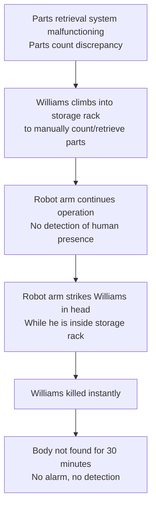
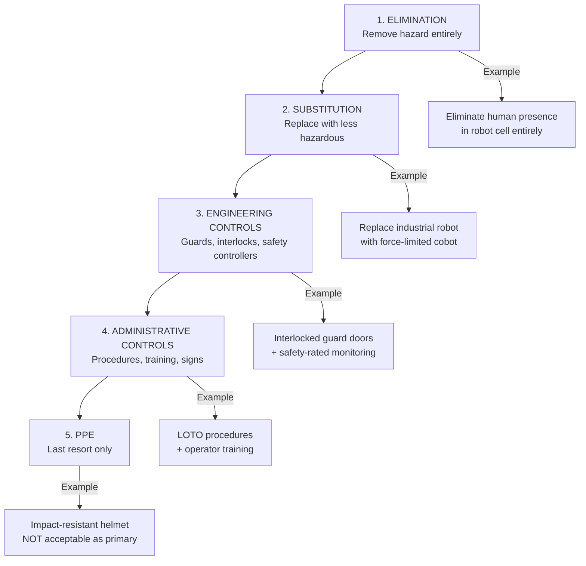

# Robotics Safety Case Studies

**Category:** 25 — Robotics Safety  
**Document:** 09 — Case Studies (Fatal Incidents, Near-Misses, Lessons Learned)  
**Scope:** Historical robot-related fatalities, industry incidents, root cause analysis  
**Audience:** Safety engineers, compliance teams, risk assessment practitioners  
**Prerequisites:** ISO 10218, ISO/TS 15066, ISO 3691-4, general functional safety knowledge

---

## Chapter 1 — Overview of Robot Safety Incidents

### 1.1 Global Robot Incident Statistics

| Period | Fatalities (Industrial Robots) | Serious Injuries | Source |
|--------|-------------------------------|-------------------|--------|
| 1979-2017 | ~40 confirmed fatalities (USA) | Hundreds reported (OSHA) | OSHA Fatality/Catastrophe reports |
| 2000-2020 | 27 reported (EU) | Not centrally tracked | EU-OSHA |
| 2015-2023 | Rising trend with robot density | Cobot incidents emerging | IFR + national statistics |
| Key trend | Fatalities declining relative to robot population | Near-misses increasing with cobots | Industry analysis |

### 1.2 Common Root Cause Categories

| Root Cause Category | % of Incidents | Description |
|--------------------|----------------|-------------|
| Inadequate safeguarding | 35% | Missing guards, bypassed interlocks |
| Unexpected robot motion | 25% | Robot moved during maintenance, restart without clearance |
| Human error (operational) | 20% | Entering safeguarded space, ignoring procedures |
| Control system failure | 10% | Software bug, sensor failure, wiring error |
| Inadequate risk assessment | 7% | Failure to identify hazard or underestimation of risk |
| Other (environmental, structural) | 3% | Floor failure, power surge, seismic |

---

## Chapter 2 — Case Study: Robert Williams (1979) — First Robot Fatality

### 2.1 Incident Summary

| Field | Detail |
|-------|--------|
| **Date** | January 25, 1979 |
| **Location** | Ford Motor Company, Flat Rock Casting Plant, Michigan, USA |
| **Victim** | Robert Williams, age 25, maintenance worker |
| **Robot** | Unit Handling Machine (1-ton robot arm in parts storage) |
| **Task** | Retrieving parts from a 5-tier storage rack |
| **Cause of death** | Robot arm struck victim in the head |
| **Significance** | First known human death caused by a robot (worldwide) |

### 2.2 Detailed Sequence of Events

### 2.3 Root Cause Analysis

| Factor | Analysis |
|--------|----------|
| **Missing safeguard** | No presence detection in robot workspace |
| **No interlock** | No means to detect human entry into rack area |
| **Procedure failure** | No lockout/tagout procedure followed |
| **Design flaw** | Human access needed but robot workspace not separated |
| **Control system** | No sensor to detect unexpected obstacle |
| **Supervision** | No buddy system, no communication protocol |

### 2.4 Missing Standard Clauses (Had They Existed)

| Modern Standard | Relevant Clause | What Would Have Prevented Incident |
|----------------|----------------|-----------------------------------|
| ISO 10218-2:2011 | 5.2.2 | Perimeter safeguarding required |
| ISO 10218-2:2011 | 5.11 | Lockout/tagout before entering robot space |
| OSHA 29 CFR 1910.147 | Lockout/Tagout | Energy isolation before access |
| ANSI/RIA R15.06 | 4.2 | Risk assessment mandatory |
| ISO 14120 | Clause 5 | Fixed/movable guards with interlocks |

### 2.5 Legacy & Impact

| Outcome | Detail |
|---------|--------|
| Legal | Williams' family awarded $10 million (1983 — among first robot liability cases) |
| Standards | Catalyzed development of ANSI/RIA R15.06 (1986) |
| Industry practice | Fencing of industrial robot cells became standard practice |
| OSHA | Specific guidelines for robot safety issued |

---

## Chapter 3 — Case Study: Vladimir Kuligin (2015) — Volkswagen Baunatal

### 3.1 Incident Summary

| Field | Detail |
|-------|--------|
| **Date** | June 29, 2015 |
| **Location** | Volkswagen plant, Baunatal, Germany |
| **Victim** | 22-year-old external contractor (setup technician) |
| **Robot** | Industrial robot in body-in-white welding line |
| **Task** | Commissioning/installing robot in production cell |
| **Cause of death** | Robot grabbed and pressed victim against a metal plate |
| **Investigation** | Ruled as operator error; no criminal charges filed against VW |

### 3.2 Detailed Sequence of Events

| Step | Event | Safety Implication |
|------|-------|-------------------|
| 1 | Contractor working inside partially-completed robot cell | Cell not yet fully safeguarded (during commissioning) |
| 2 | Working with colleague (2-person team) | Buddy system partially implemented |
| 3 | Robot activated (reason disputed: intentional for testing or accidental) | Teach mode vs. automatic mode confusion |
| 4 | Robot grabbed victim and pinned against metal plate | Crushing force from industrial robot arm |
| 5 | Colleague could not stop robot in time | Emergency stop not immediately accessible |
| 6 | Victim died from chest compression injuries | Fatal within seconds |

### 3.3 Root Cause Analysis

| Factor | Analysis |
|--------|----------|
| **Commissioning phase** | Safety systems not fully operational during setup |
| **Mode confusion** | Unclear if robot was in teach/manual vs. automatic mode |
| **Access control** | Person present in robot workspace during powered motion |
| **E-stop accessibility** | Emergency stop not within immediate reach |
| **Contractor management** | Contractor may not have received full safety briefing |
| **Reduced safeguarding** | Temporary situation during commissioning — inherently higher risk |

### 3.4 Applicable Standard Clauses

| Standard | Clause | Requirement Violated |
|----------|--------|---------------------|
| ISO 10218-2:2011 | 5.11.3 | Safety during commissioning — reduced speed mode |
| ISO 10218-1:2011 | 5.8 | Enabling device (3-position hold-to-run) in teach mode |
| ISO 10218-2:2011 | 5.5.2 | Access for maintenance — safety system required |
| EN ISO 13849-1 | Clause 5 | Safety control system even during setup |
| BetrSichV (Germany) | §3 | Employer responsibility for contractor safety |

### 3.5 Lessons Learned

| Lesson | Implementation |
|--------|---------------|
| Commissioning is highest-risk phase | Specific commissioning safety plan required |
| 3-position enabling device mandatory | Dead-man switch: panic release = stop |
| Reduced speed (250 mm/s) during setup | ISO 10218-1 Clause 5.8 |
| Never single-person in robot workspace | Minimum 2 persons: 1 at e-stop, 1 working |
| Contractor induction | Full safety briefing + competency verification |

---

## Chapter 4 — Case Study: Amazon Warehouse Robot Incidents (2018-2023)

### 4.1 Incident Timeline

| Date | Facility | Incident | Injuries | Source |
|------|----------|----------|----------|--------|
| Dec 2018 | Robbinsville, NJ | Bear spray can punctured by robot, fumes spread | 24 hospitalized, 1 critical | OSHA + media reports |
| 2019-2021 | Multiple | Various human-robot proximity incidents | Minor injuries reported | Reveal News investigation |
| Nov 2022 | Multiple | Amazon reports 39 "serious" injuries at robot facilities | 39 recordable | OSHA 300 logs |
| 2023 | Multiple | Continued higher injury rate at robot facilities vs. non-robot | Statistical analysis | Strategic Organizing Center report |

### 4.2 Bear Spray Incident (December 2018) — Detailed

| Field | Detail |
|-------|--------|
| **Location** | Amazon BFI3, Robbinsville, New Jersey |
| **Cause** | Automated robot punctured a can of bear spray (concentrated capsaicin) |
| **Outcome** | Building evacuation; 24 workers hospitalized; 1 critical condition |
| **Robot type** | Kiva-style AMR (drive unit) handling pod/shelf system |
| **Root cause** | Product (bear spray) was damaged by robotic handling; inadequate hazmat screening |
| **Safety failure** | Risk assessment did not consider hazardous product handling |

### 4.3 Systemic Issues Identified

| Issue | Detail | Standard Gap |
|-------|--------|--------------|
| Speed vs. safety culture | Productivity targets create pressure to minimize safety stops | Organizational — IEC 61508 Part 1 Clause 6 (safety management) |
| Risk assessment gaps | Hazardous goods not considered in robotic handling risk assessment | ISO 12100 — foreseeable misuse |
| Segregation model limitations | Human must still enter robot zone for exceptions | ISO 3691-4 — shared space considerations |
| Ergonomic injury from pace | Robots set pace; human cannot sustain | Not traditional robot safety — occupational health |
| Reporting suppression allegations | Under-reporting of injuries claimed by workers | OSHA recordkeeping requirements |

### 4.4 Lessons for AMR Safety

| Lesson | Application |
|--------|------------|
| Risk assessment must include handled products | ISO 12100: consider all materials in workspace |
| Evacuation plan for hazmat release | OSHA 1910.120, emergency planning |
| Human-robot pace matching | Ergonomic design standards (ISO 6385) |
| Safety culture independent of productivity | IEC 61508 Part 1: safety management system |
| Transparent incident reporting | Required for continuous safety improvement |

---

## Chapter 5 — Case Study: Collaborative Robot (Cobot) Near-Misses

### 5.1 Overview of Cobot Safety Incidents

Unlike industrial robot fatalities (clear causes, established standards), cobot incidents are often near-misses that expose gaps in ISO/TS 15066 implementation:

| Incident Type | Frequency | Root Cause | Standard Clause |
|--------------|-----------|------------|-----------------|
| Speed violation (brief exceedance) | Common | Transient during trajectory change | TS 15066 Clause 5.3.5 |
| Contact force above threshold | Occasional | Wrong tool/payload; surface area miscalculated | TS 15066 Table A.2 |
| Clamping/trapping | Occasional | Object between cobot and fixture | TS 15066 Clause 5.3.4.4 |
| Unexpected restart after pause | Rare but serious | Operator not clear of workspace | ISO 10218-2 Clause 5.11 |
| Teaching mode surprise motion | Occasional | Hand-guiding overshoot, acceleration too high | ISO 10218-1 Clause 5.8 |

### 5.2 Example: Clamping Incident

| Field | Detail |
|-------|--------|
| **Setting** | Cobot pick-and-place cell; operator feeds parts |
| **Incident** | Operator's hand trapped between cobot end-effector and workpiece fixture |
| **Force experienced** | 180 N quasi-static on finger (threshold: 140 N per TS 15066 Table A.2) |
| **Injury** | Bruising, no fracture (reversible) |
| **Root cause** | Risk assessment used transient force limits but actual contact was quasi-static clamping |
| **Corrective action** | Added soft stops (foam), reduced closing force, redesigned fixture approach angle |

### 5.3 Example: Speed Monitoring Gap

| Field | Detail |
|-------|--------|
| **Setting** | Cobot welding cell; Safety-rated Monitored Stop (SMS) for human approach |
| **Incident** | Speed briefly exceeded 250 mm/s during trajectory recalculation near SMS boundary |
| **Duration** | 80 ms overshoot (within inertia of measurement) |
| **Detection** | Internal robot monitoring caught it; external safety PLC did not (sampling rate difference) |
| **Root cause** | Robot controller speed monitoring and external safety PLC had different measurement windows |
| **Corrective action** | Synchronized monitoring; added margin (actual limit set to 200 mm/s to allow for overshoot) |

### 5.4 ISO/TS 15066 Implementation Errors Leading to Near-Misses

| Error | Frequency | Consequence | Fix |
|-------|-----------|-------------|-----|
| Using transient limits for quasi-static contact | Very common | Force threshold exceeded in clamping | Identify all clamping scenarios; use quasi-static values |
| Ignoring tool/workpiece in contact area calculation | Common | Effective surface area smaller → higher pressure | Include all geometries in force/pressure calc |
| Not measuring actual forces (relying on spec only) | Common | Specification ≠ reality (inertia, control dynamics) | Physical measurement with calibrated force sensors |
| No consideration of collaborative workspace geometry | Occasional | Trap points not identified in risk assessment | 3D analysis of all approach vectors |
| Payload change without reassessment | Common | Heavier tool = more kinetic energy = higher force | Reassess for every tool/payload combination |

---

## Chapter 6 — Case Study: Industrial Robot Fatality Compilation

### 6.1 Selected Fatal Incidents (Global)

| Year | Location | Industry | Robot Type | Cause of Death | Root Cause |
|------|----------|----------|-----------|----------------|-----------|
| 1979 | USA (Ford) | Automotive | Parts handling | Head strike | No safeguarding |
| 1981 | Japan (Kawasaki) | Manufacturing | Hydraulic robot | Crushing | Entered active workspace |
| 2001 | USA | Automotive | Welding robot | Crushing (chest) | Bypassed interlock |
| 2015 | Germany (VW) | Automotive | Assembly robot | Chest compression | Commissioning, no safeguarding |
| 2016 | India | Manufacturing | Welding robot | Welding rod to chest | No perimeter guard |
| 2019 | USA | Food processing | Palletizing robot | Crushing | Entered cell without LOTO |
| 2021 | South Korea | Manufacturing | Material handling | Crushed against conveyor | Sensor malfunction + bypassed guard |

### 6.2 Pattern Analysis

| Pattern | Incidents | Prevention Standard |
|---------|-----------|-------------------|
| Entering active cell without stopping robot | 60% of fatalities | ISO 10218-2 Clause 5.10: interlocking guards |
| During maintenance/commissioning | 25% of fatalities | ISO 10218-2 Clause 5.11: LOTO + reduced speed |
| Control system failure | 10% of fatalities | ISO 13849 / IEC 62061: Category 3/4 safety functions |
| Interlock bypass | 15% of fatalities | ISO 14119: interlock defeat prevention |
| Inadequate risk assessment | Underlying factor in >50% | ISO 12100: systematic risk assessment |

---

## Chapter 7 — Corrective Standard Clauses Summary

### 7.1 Mapping Incidents to Standard Requirements

| Incident Category | Preventive Standard | Key Clause | Requirement |
|------------------|--------------------| -----------|-------------|
| Entering powered workspace | ISO 10218-2 | 5.10.3 | Interlocking devices with guard locking |
| Robot moves during maintenance | ISO 10218-2 | 5.11 | Lockout/tagout + verification of energy isolation |
| Collaborative force excessive | ISO/TS 15066 | 5.3.5 | Power & force limiting with measured thresholds |
| AMR collision with pedestrian | ISO 3691-4 | Clause 6 | Protective field + emergency braking |
| No e-stop accessible | ISO 10218-2 | 5.4 | E-stop within reach from any personnel position |
| Interlock defeated | ISO 14119 | Clause 7 | Defeat-resistant interlock design |
| Unexpected restart | ISO 10218-2 | 5.7 | Restart requires deliberate action + workspace clearance |
| Commissioning without safeguards | ISO 10218-2 | 5.5.2 | Reduced speed + enabling device during setup |

### 7.2 Hierarchy of Controls for Robot Safety

---

## Chapter 8 — Industry Response & Safety Improvements

### 8.1 Post-Incident Industry Changes

| Decade | Safety Evolution | Catalyst |
|--------|-----------------|----------|
| 1980s | Perimeter fencing becomes standard | Williams (1979) + early fatalities |
| 1990s | Safety PLCs introduced; interlocking standards | Continued incidents during maintenance |
| 2000s | Safety-rated speed/position monitoring in drives | IEC 61800-5-2; need for collaborative work |
| 2010s | ISO/TS 15066 published; cobots proliferate | Industry demand for flexible automation |
| 2020s | AI safety questions; fleet safety; cybersecurity | Amazon incidents + autonomous systems growth |

### 8.2 Technology Improvements Driven by Incidents

| Technology | Problem Addressed | Example Products |
|-----------|-------------------|-----------------|
| Safety laser scanners | Detect human presence without fences | SICK microScan3, Leuze RSL 400 |
| 3D safety cameras | Detect humans in 3D space | SICK safeVisionary2, ifm O3D |
| Force/torque sensing | Limit contact forces (cobots) | ATI FT sensor, robot-integrated sensors |
| Safety-rated speed monitoring | Prevent dangerous speeds near humans | Drive-integrated (SLS per IEC 61800-5-2) |
| Collaborative robot design | Inherent force limitation | Universal Robots, FANUC CRX, ABB GoFa |
| Safety-rated soft axes (virtual fencing) | Restrict workspace electronically | ABB SafeMove, KUKA SafeOperation |
| Electronic skin (proximity sensing) | Pre-contact detection (capacitive) | Blue Danube Robotics Airskin, Bosch APAS |

---

## Chapter 9 — Regulatory Response to Incidents

### 9.1 OSHA (USA) Response

| Action | Detail |
|--------|--------|
| OSHA TED 01-00-015 (1987) | Guidelines for Robotics Safety |
| OSHA citation history | Multiple citations for inadequate machine guarding (29 CFR 1910.212) |
| Amazon investigations | OSHA opened investigations at multiple Amazon robot facilities |
| Recommended practices | OSHA-NIOSH collaboration on AMR safety guidance |

### 9.2 EU Response

| Action | Detail |
|--------|--------|
| EN ISO 10218-1/2:2011 | Harmonized standard under Machinery Directive |
| ISO/TS 15066:2016 | Technical specification for collaborative operation |
| EU Machinery Regulation 2023/1230 | Strengthened requirements for autonomous/AI machinery |
| EU-OSHA campaigns | Awareness campaigns on robot safety |

---

## Chapter 10 — Interview Questions

### Entry-Level
1. Name three common root causes of robot-related fatalities.
2. What is lockout/tagout (LOTO) and why is it critical for robot maintenance?
3. Describe the Robert Williams (1979) incident and what standard it catalyzed.

### Mid-Level
1. Analyze the VW Baunatal incident (2015). Which ISO 10218-2 clauses were violated?
2. How do cobot near-miss incidents differ from industrial robot fatalities in root cause?
3. What lessons from the Amazon bear spray incident apply to AMR risk assessment?

### Senior
1. Design a commissioning safety plan that prevents incidents like the VW Baunatal case.
2. How should force measurement validation be performed to prevent ISO/TS 15066 implementation errors?
3. Propose a safety incident investigation methodology for a fleet of 50 AMRs.

### Principal / Chief Safety Officer
1. How should the robotics industry evolve safety management systems in response to increasing human-robot collaboration?
2. Design a predictive safety analytics system that identifies near-miss patterns before they become fatalities.
3. Propose regulatory changes needed to address AI-controlled machinery incidents that have no direct human "error" component.

---

*Document Version: 1.0 | Last Updated: May 2026 | Author: Robotics Safety Standards Team*
