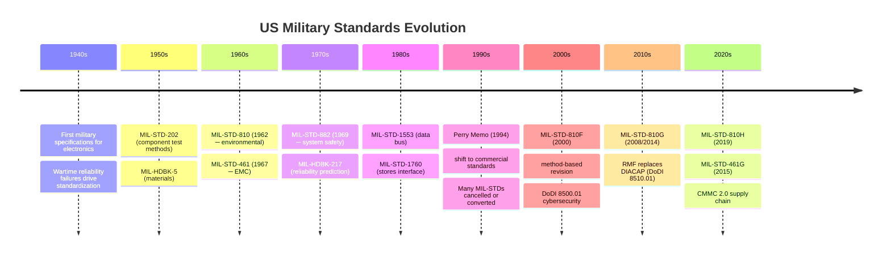
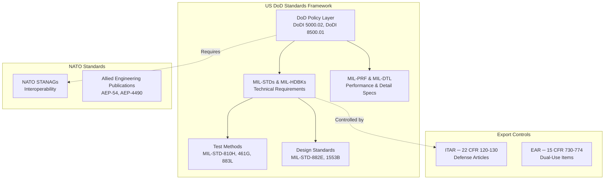
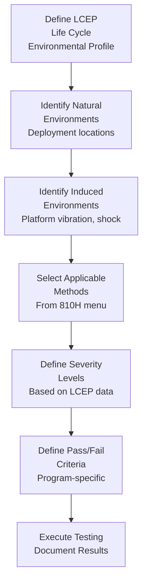
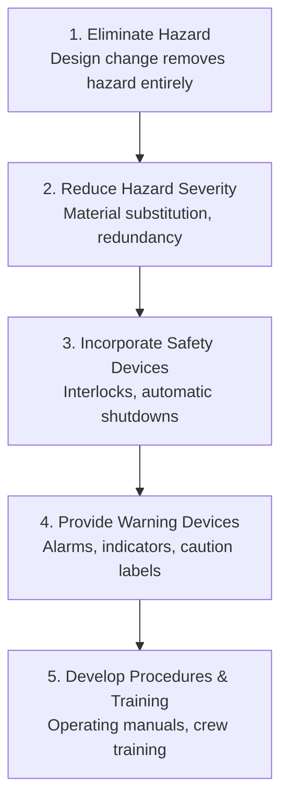
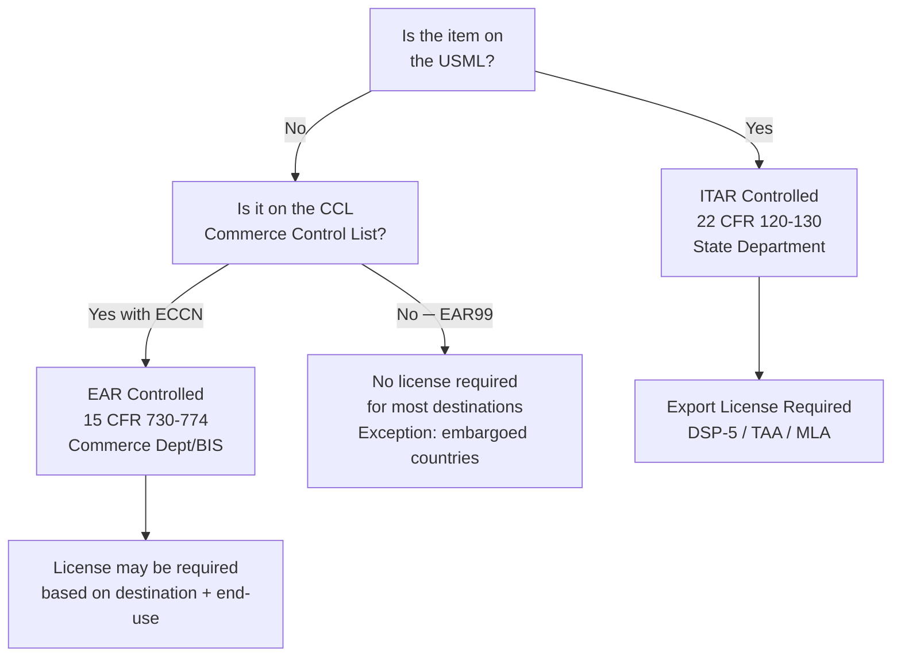
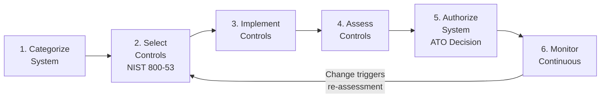

# Defense & Military Standards — Comprehensive Overview

**Category:** 26 — Defense & Military Standards  
**Document:** 00 — Standards Landscape Overview  
**Scope:** MIL-STDs, NATO STANAGs, ITAR, environmental qualification, EMC/EMI, system safety, cybersecurity  
**Key Standards:** MIL-STD-810H, MIL-STD-461G, MIL-STD-882E, DISA STIG, ITAR  
**Audience:** Defense systems engineers, military qualification engineers, ITAR compliance officers  
**Prerequisites:** Basic systems engineering and environmental testing knowledge

---

## Chapter 1 — Historical Context & Origin Story

### 1.1 Why Military Standards Exist

Military standards emerged from catastrophic wartime equipment failures:

| Era | Problem | Standard Response |
|-----|---------|-----------------|
| WWII | 50% of electronic equipment failed in tropical climates | MIL-STD-810 development (1962) |
| Korean War | Radio equipment failed in extreme cold | Environmental test methods formalized |
| Vietnam | EMI between systems caused friendly fire | MIL-STD-461 (EMC requirements) |
| 1960s-70s | Missile system reliability 30-40% | MIL-HDBK-217 reliability prediction |
| 1980s | Software complexity causing weapon failures | MIL-STD-882 system safety |
| 2000s | Cyber attacks on military networks | DoDI 8500.01, RMF |
| 2010s | Supply chain compromises (counterfeit parts) | AS6171, DFARS 252.225 |

### 1.2 Evolution of US Military Standards



### 1.3 The "Perry Memo" Revolution (1994)

Secretary of Defense William Perry issued a memorandum directing DoD to use commercial standards and practices wherever possible, reducing reliance on MIL-STDs. This:
- Cancelled ~31,000 military specifications
- Converted many MIL-STDs to performance-based
- Created the current environment where MIL-STD-810H provides **methods** but not mandatory pass/fail criteria (tailoring required)
- Led to increased use of ISO, IEC, SAE, and ASTM commercial standards

**Key surviving MIL-STDs (still mandatory for most defense programs):**
- MIL-STD-810H (environmental)
- MIL-STD-461G (EMC)
- MIL-STD-882E (system safety)
- MIL-STD-1553B (data bus)
- MIL-STD-704F (aircraft power)

---

## Chapter 2 — Standards Architecture

### 2.1 Defense Standards Hierarchy



### 2.2 Master Standards Table

| Standard | Title | Current Version | Primary Domain |
|----------|-------|----------------|---------------|
| MIL-STD-810H | Environmental Engineering | 2019 | Environmental qualification |
| MIL-STD-461G | EMI/EMC Requirements | 2015 | Electromagnetic compatibility |
| MIL-STD-464C | EM Environmental Effects | 2010 | System-level EME |
| MIL-STD-882E | System Safety | 2012 | Safety analysis |
| MIL-STD-1553B | Digital Data Bus | 1978+notices | Avionics communication |
| MIL-STD-1760 | Aircraft/Store Interface | Current | Weapons integration |
| MIL-STD-704F | Aircraft Elec. Power | 2004 | Power quality |
| MIL-STD-883L | Microelectronics Test | Current | IC qualification |
| MIL-STD-750F | Semiconductor Test | Current | Discrete device test |
| MIL-STD-202H | Component Test Methods | Current | Passive component test |
| MIL-STD-2169B | HEMP Hardening | 1993 | Nuclear EMP survivability |
| MIL-HDBK-217F | Reliability Prediction | 1991 | MTBF calculation |
| MIL-PRF-38535 | Microcircuit Performance | Current | QML IC procurement |
| MIL-PRF-19500 | Semiconductor General | Current | JANS/JAN/JANTX devices |

---

## Chapter 3 — MIL-STD-810H Environmental Engineering

### 3.1 Overview

MIL-STD-810H (31 January 2019) provides **environmental engineering considerations and laboratory test methods** for military materiel. It does NOT specify pass/fail criteria — the program must tailor requirements to the specific platform and lifecycle environment.

### 3.2 Test Method Matrix

| Method | Title | Key Parameters | Typical Platform |
|--------|-------|---------------|-----------------|
| 500.7 | Low Pressure (Altitude) | Up to 100,000 ft equivalent | Aircraft, missile |
| 501.7 | High Temperature | +49°C to +71°C (storage: +85°C) | Desert, engine bay |
| 502.7 | Low Temperature | -51°C to -62°C (storage: -57°C) | Arctic, altitude |
| 503.7 | Temperature Shock | Rapid cycling between extremes | Airborne electronics |
| 506.7 | Rain | Blowing rain, drip | All ground vehicles |
| 507.7 | Humidity | 95% RH cycling | Tropical deployment |
| 509.7 | Salt Fog | 5% NaCl, 35°C, 48-hours | Naval, coastal |
| 510.7 | Sand and Dust | Fine sand (149µm), blowing | Desert ground vehicle |
| 514.8 | Vibration | Random, sine, combined | All platforms |
| 516.8 | Shock | Functional, crash, pyroshock | Vehicle-mounted, stores |
| 519.8 | Gunfire Vibration | Repetitive shock pulse | Weapons-mounted |
| 520.5 | Combined Temp/Humidity/Vibration | Simultaneous multi-axis | Helicopter-mounted |
| 521.5 | Icing/Freezing Rain | Ice accretion on surfaces | Aircraft, vehicles |
| 528.1 | Multi-Exciter Testing | MIMO vibration | Complex structures |

### 3.3 Tailoring Philosophy



### 3.4 MIL-STD-810H Method 514.8 — Vibration (Detail)

The most commonly applied method. Key test categories:

| Category | Description | Typical Level (ASD) | Duration |
|----------|-------------|---------------------|----------|
| General vehicle | Ground vehicle random vibration | 0.01-0.04 g²/Hz | 2 hours/axis |
| Helicopter | Rotor-induced + turbulence | 0.1-0.5 g²/Hz peaks | 4 hours/axis |
| Fixed wing | Turbulence + engine vibration | 0.01-0.1 g²/Hz | 4 hours/axis |
| Ship/submarine | Sea state vibration | 0.001-0.01 g²/Hz | 2 hours/axis |
| Missile launch | High-g random burst | 1.0-10 g²/Hz | 60 seconds |

---

## Chapter 4 — MIL-STD-461G EMC/EMI

### 4.1 Test Method Overview

| Test | Title | Limit Type | Applicability |
|------|-------|-----------|---------------|
| CE101 | Conducted Emissions, Power Leads (30 Hz–10 kHz) | dBµA | Power leads, AC/DC |
| CE102 | Conducted Emissions, Power Leads (10 kHz–10 MHz) | dBµV | All power leads |
| CS101 | Conducted Susceptibility, Power Leads (30 Hz–150 kHz) | Volts | Power bus immunity |
| CS114 | Conducted Susceptibility, Bulk Cable Injection | dBµA | Signal/power cables |
| CS115 | Conducted Susceptibility, EMP (damped sinusoid) | Amps | EMP immunity |
| CS116 | Conducted Susceptibility, Damped Sinusoidal Transients | Amps | Lightning transients |
| RE101 | Radiated Emissions, Magnetic (30 Hz–100 kHz) | dBpT | Magnetic field control |
| RE102 | Radiated Emissions, Electric (10 kHz–18 GHz) | dBµV/m | All radiated emissions |
| RS101 | Radiated Susceptibility, Magnetic (30 Hz–100 kHz) | dBpT | Magnetic immunity |
| RS103 | Radiated Susceptibility, Electric (2 MHz–40 GHz) | V/m | RF immunity (1-200 V/m) |

### 4.2 Key Differences from Commercial EMC (IEC 61000)

| Parameter | MIL-STD-461G | IEC 61000-6-2 (Industrial) | Notes |
|-----------|-------------|---------------------------|-------|
| Emission frequency | 30 Hz – 40 GHz | 150 kHz – 6 GHz | Military covers much lower |
| RS103 field strength | 10-200 V/m | 10 V/m (80-1000 MHz) | Military 10-20× more severe |
| Test facility | Shielded room (MIL-STD-461G) | Semi-anechoic chamber | Different ground plane requirements |
| Transient immunity | CS115/CS116 EMP-specific | IEC 61000-4-4/5 general | Military tests nuclear EMP |
| Cable bundling | Part of test setup (realistic) | Separate cable standard | Military more realistic |

### 4.3 Platform-Specific Limits

MIL-STD-461G applies different limits based on platform installation:

| Platform | RE102 Limit (typical @100 MHz) | RS103 Level | Key Concern |
|----------|------------------------------|-------------|-------------|
| Ground (Army) | 24 dBµV/m | 10 V/m | Radio co-site interference |
| Ship (Navy) | 24 dBµV/m | 200 V/m (topside) | Radar, SATCOM co-site |
| Aircraft (Air Force) | 34 dBµV/m | 20-200 V/m | Avionics interference |
| Submarine | Very stringent (classified) | Classified | Acoustic signature + intercept |
| Space | MIL-STD-1541A applies | Specific | Component interactions |

---

## Chapter 5 — MIL-STD-882E System Safety

### 5.1 Core Concepts

MIL-STD-882E establishes a systematic approach to safety for DoD acquisitions:

**Hazard Risk Index (HRI):**

| | Catastrophic (I) | Critical (II) | Marginal (III) | Negligible (IV) |
|---|---|---|---|---|
| **Frequent (A)** | 1 | 3 | 7 | 13 |
| **Probable (B)** | 2 | 5 | 9 | 16 |
| **Occasional (C)** | 4 | 6 | 11 | 18 |
| **Remote (D)** | 8 | 10 | 14 | 19 |
| **Improbable (E)** | 12 | 15 | 17 | 20 |

**HRI Acceptance:**
- HRI 1-5: Unacceptable (Component or PM level acceptance)
- HRI 6-9: Undesirable (PEO or higher acceptance)
- HRI 10-17: Acceptable with review
- HRI 18-20: Acceptable without review

### 5.2 Required Tasks (Selected)

| Task | Title | Description |
|------|-------|-------------|
| 100 | Safety Program | Overall safety management plan |
| 101 | System Safety Design Criteria | Integrate safety into design |
| 102 | Preliminary Hazard List (PHL) | Initial hazard identification |
| 103 | Preliminary Hazard Analysis (PHA) | Risk assessment of PHL |
| 104 | Subsystem Hazard Analysis (SSHA) | Component-level hazards |
| 105 | System Hazard Analysis (SHA) | Integrated system hazards |
| 106 | Operating & Support HA (O&SHA) | Operational hazards |
| 107 | Software System Safety | Software-related hazard analysis |
| 108 | Safety Verification | Test and verification of safety |
| 301 | Design Criteria | Design order of precedence |
| 302 | Monitoring of Subcontractors | Flow-down requirements |

### 5.3 Design Order of Precedence (Task 301)



---

## Chapter 6 — Export Controls (ITAR & EAR)

### 6.1 ITAR vs EAR Decision Tree



### 6.2 USML Categories (22 CFR 121)

| Category | Description | Examples |
|----------|-------------|---------|
| I | Firearms, close assault weapons | Military rifles, grenade launchers |
| II | Guns and armament | Artillery, naval guns |
| III | Ammunition/ordnance | Military ammunition |
| IV | Launch vehicles, missiles | ICBM, cruise missiles, drones (certain) |
| V | Explosives, propellants | Military explosives |
| VII | Ground vehicles | Tanks, armored vehicles |
| VIII | Aircraft | Military aircraft, UAVs (certain) |
| IX | Military training equipment | Simulators, training devices |
| XI | Military electronics | Radar, EW, C2 systems |
| XII | Fire control, detection | Targeting, night vision |
| XIII | Materials/alloys | Radiation-hardened materials |
| XIV | Toxicological agents | Chemical/biological defense |
| XV | Spacecraft & related | Military satellites |

### 6.3 ITAR Compliance Requirements

| Requirement | Detail | Penalty for Violation |
|-------------|--------|----------------------|
| Registration | All manufacturers/exporters register with DDTC | $500K + criminal |
| License (DSP-5) | Individual export authorization | Revocation + criminal |
| TAA | Technical Assistance Agreement (for sharing data) | $1M per violation |
| Record keeping | 5 years minimum retention | Civil/criminal |
| Foreign person access | No ITAR data to non-US persons without approval | Criminal prosecution |
| Re-export control | End-user must not re-export without US approval | Debarment |
| Citizenship verification | Employee citizenship screening | Facility clearance loss |

**Maximum penalties:** Up to $1M per violation + 20 years imprisonment (criminal ITAR violations)

---

## Chapter 7 — NATO Interoperability (STANAGs)

### 7.1 Key STANAGs for Defense Electronics

| STANAG | Title | Domain | Status |
|--------|-------|--------|--------|
| 4671 | UAV Systems Airworthiness | UAS | Active |
| 4586 | UAS Control System Interoperability | UAS C2 | Active |
| 4609 | UAV Intelligence Imagery | ISR | Active |
| 5066 | HF Data Communications | COMMS | Active |
| 4607 | Ground Moving Target Indicator (GMTI) | Radar | Active |
| 4559 | NATO Standard ISR Library Interface | Data | Active |
| 4694 | Common ISTAR Interoperability (Tier 2) | ISR | Active |
| 5516 | Link 22 | Tactical Data Link | Active |
| 5500 | NATO Network Enabled Capability (NNEC) | Architecture | Active |
| 4626 | Modular and Open Systems Approach | Architecture | Active |

---

## Chapter 8 — Defense Cybersecurity Standards

### 8.1 Risk Management Framework (RMF) — DoDI 8510.01



### 8.2 Key Cybersecurity Standards

| Standard | Scope | Applicability |
|----------|-------|---------------|
| NIST SP 800-53 Rev5 | Security controls catalog | All DoD IT systems |
| CNSS Instruction 1253 | Security categorization for NSS | National Security Systems |
| DoDI 8500.01 | Cybersecurity policy | All DoD activities |
| DoDI 8510.01 | Risk Management Framework | IT system authorization |
| DISA STIGs | Configuration hardening | All DoD IT products |
| FIPS 140-3 | Cryptographic modules | NSS crypto requirements |
| NSA CNSA Suite 2.0 | Algorithm requirements | Classified systems |
| CMMC 2.0 | Supply chain security maturity | Defense contractors |

### 8.3 CMMC 2.0 (Cybersecurity Maturity Model Certification)

| Level | Controls | Assessment | Who Needs It |
|-------|----------|-----------|--------------|
| Level 1 | 17 practices (basic safeguarding) | Self-assessment | All contractors with FCI |
| Level 2 | 110 practices (NIST SP 800-171 Rev2) | Third-party assessment (C3PAO) | Contractors with CUI |
| Level 3 | 110+ (800-171 + 800-172 subset) | Government-led assessment (DIBCAC) | Critical programs |

---

## Chapter 9 — Component Screening Levels

### 9.1 MIL-PRF-38535 Quality Levels (Microcircuits)

| Level | Designation | Temperature Range | Screening | Applications |
|-------|------------|-------------------|-----------|--------------|
| QML-V | Space/strategic | -55°C to +125°C | Full Class V | Satellites, strategic weapons |
| QML-Q | Military | -55°C to +125°C | Full military screen | All military electronics |
| QML-M | Enhanced commercial | -40°C to +105°C | Reduced screen | Non-critical military |
| QML-T (legacy) | Prototype | Various | Minimal | Development only |

### 9.2 Screening Flow (QML-Q)

```mermaid
flowchart TB
    A[Wafer Fabrication] --> B[Wafer-Level Testing<br/>100% electrical]
    B --> C[Visual Inspection<br/>MIL-STD-883 Method 2010]
    C --> D[Die Attach & Wire Bond<br/>Package Assembly]
    D --> E[Temperature Cycling<br/>-55°C to +125°C (100 cycles)]
    E --> F[Constant Acceleration<br/>30,000g (Y1 axis)]
    F --> G[Burn-In<br/>125°C, 240 hrs, VCC max]
    G --> H[Final Electrical Test<br/>-55°C, +25°C, +125°C]
    H --> I[X-Ray Inspection<br/>MIL-STD-883 Method 2012]
    I --> J[PIND Test<br/>Particle Impact Noise Detection]
    J --> K[Seal Test (Fine/Gross Leak)<br/>MIL-STD-883 Method 1014]
    K --> L[External Visual<br/>Final Inspection]
    L --> M[QML-Q Qualified Part]
```

---

## Chapter 10 — Reliability Standards

### 10.1 MIL-HDBK-217F (Reliability Prediction)

Despite being officially "cancelled" (1995 Perry memo), MIL-HDBK-217F remains the most widely used reliability prediction method in defense:

**Part Count Method (basic):**

$$\lambda_p = \lambda_b \cdot \pi_Q \cdot \pi_E$$

Where:
- $\lambda_p$ = predicted failure rate (failures/10⁶ hours)
- $\lambda_b$ = base failure rate
- $\pi_Q$ = quality factor
- $\pi_E$ = environmental factor

**Environmental Factors (π_E) for Different Platforms:**

| Environment | Symbol | π_E (typical) |
|------------|--------|---------------|
| Ground, benign | G_B | 1.0 |
| Ground, fixed | G_F | 2.0 |
| Ground, mobile | G_M | 4.0-14.0 |
| Naval, sheltered | N_S | 4.0 |
| Naval, unsheltered | N_U | 6.0 |
| Airborne, inhabited (transport) | A_IT | 4.0 |
| Airborne, inhabited (fighter) | A_IF | 6.0 |
| Airborne, uninhabited (fighter) | A_UF | 8.0 |
| Space, flight | S_F | 0.5 |
| Missile, launch | M_L | 120.0 |

### 10.2 Modern Alternatives

| Method | Standard | Advantage over 217F |
|--------|----------|-------------------|
| FIDES 2022 | French MoD | Physics of failure approach; process factors |
| RIAC 217Plus | RIAC (Quanterion) | Updated failure rate data; mission profiles |
| IEC 62380 | IEC/CNET | Telecom-focused; European alternative |
| SN 29500 | Siemens | Industry-specific failure rates |
| Telcordia SR-332 | Ericsson/Telcordia | Telecommunications equipment |

---

## Chapter 11 — Interview Questions

### Tier 1: Entry-Level (0-3 years)
1. What does MIL-STD-810H cover and what is "tailoring"?
2. Name five MIL-STD-461G test methods and their purpose.
3. What is the difference between ITAR and EAR?
4. What is the Hazard Risk Index in MIL-STD-882E?
5. What screening tests distinguish a QML-Q part from commercial?

### Tier 2: Mid-Level (3-8 years)
1. Explain how to tailor MIL-STD-810H Method 514.8 vibration for a helicopter-mounted system.
2. What is the significance of RS103 at 200 V/m for naval topside equipment?
3. How does the RMF process (DoDI 8510.01) lead to an ATO?
4. Explain MIL-STD-882E Task 107 (Software System Safety) requirements.
5. How do you determine if a technology is ITAR-controlled vs. EAR-controlled?

### Tier 3: Senior/Lead (8-15 years)
1. Design an EMI test plan for a radar system with co-site interference concerns.
2. How do you flow down CMMC Level 2 requirements to foreign subcontractors?
3. Explain the LCEP development process and how it drives 810H tailoring.
4. How do you manage ITAR compliance for multinational development teams?
5. Compare MIL-HDBK-217F with FIDES 2022 — when would you use each?

### Tier 4: Principal/Distinguished (15+ years)
1. How should MIL-STD-882E evolve to address AI/ML-based autonomous weapons systems?
2. Design a comprehensive EME hardening strategy for a networked tactical system.
3. How do export control changes (AUKUS, CHIPS Act) affect defense program architecture decisions?
4. Propose a modernized reliability methodology that combines physics-of-failure with field data.
5. How do you architect a system for simultaneous CMMC Level 3 and NATO SECRET compliance?

---

*Document Version: 1.0 | Last Updated: May 2026 | Author: Technology Standards Team*
