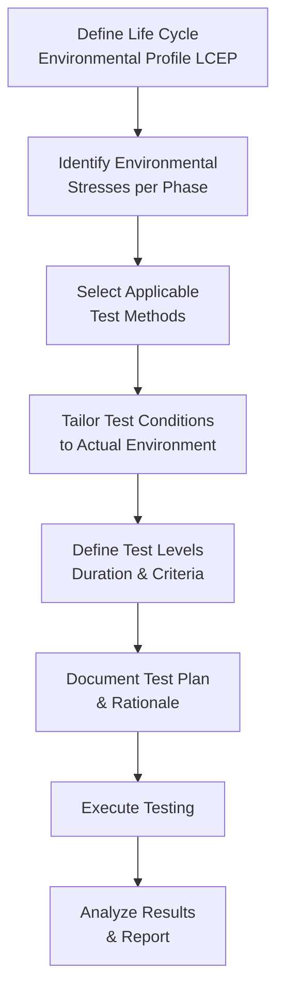

# MIL-STD-810H — Environmental Engineering Considerations & Laboratory Tests

**Category:** 26 — Defense & Military Standards  
**Document:** 01 — MIL-STD-810H Environmental Testing  
**Standard:** MIL-STD-810H (31 January 2019)  
**Scope:** Environmental test methods for military equipment qualification  
**Audience:** Defense test engineers, qualification managers, environmental labs  
**Prerequisites:** Basic understanding of defense acquisition (DoDI 5000.02)

---

## Chapter 1 — Standard Overview

### 1.1 Purpose & Philosophy

MIL-STD-810H is the DoD standard that establishes environmental engineering principles for:
- Defining environmental conditions equipment will encounter through its lifecycle
- Tailoring test methods to those specific conditions
- Qualifying equipment to survive and operate in those environments

**Key Philosophy:** Test tailoring — NOT "test to the worst case in the standard" but "test to the worst case in YOUR operational environment."

### 1.2 Document Structure

| Part | Content | Usage |
|------|---------|-------|
| Part One | Environmental Engineering Program Guidelines | Program planning, LCEP development |
| Part Two | Laboratory Test Methods (500-series) | 29 test methods, procedures, analysis |
| Part Three | World Climatic Regions | Climate data for tailoring (annexed) |

### 1.3 LCEP (Life Cycle Environmental Profile)

| Phase | Environmental Factors | Example |
|-------|----------------------|---------|
| Storage | Temperature, humidity, dust, solar radiation | Desert depot: -33°C to +71°C |
| Transportation | Vibration, shock, altitude, temperature | C-130 aircraft cargo bay |
| Deployment | All field environments | Arctic, desert, tropical, maritime |
| Operation | Vibration (vehicle), EMI, altitude, rain | Mounted on HMMWV in rain |
| Maintenance | Handling drops, cleaning chemicals | Field repair tent |

---

## Chapter 2 — Complete Test Methods Summary

### 2.1 Master Test Method Table

| Method | Title | Test Category | Key Parameters |
|--------|-------|--------------|----------------|
| **500.6** | Low Pressure (Altitude) | Climatic | Up to 30,480 m (100,000 ft) |
| **501.7** | High Temperature | Climatic | Storage: +71°C; Operation: +63°C |
| **502.7** | Low Temperature | Climatic | Operation: -51°C (Arctic) |
| **503.7** | Temperature Shock | Climatic | ΔT up to 88°C; transfer time <1 min |
| **504.2** | Contamination by Fluids | Chemical | Fuel, lubricants, hydraulic fluid |
| **505.7** | Solar Radiation (Sunshine) | Climatic | 1120 W/m² (actinic + heating) |
| **506.6** | Rain | Climatic | 4 in/hr wind-driven, drip, blowing |
| **507.6** | Humidity | Climatic | 95% RH, aggravated cycling |
| **508.7** | Fungus | Biological | 28-day incubation at 30°C/95% RH |
| **509.7** | Salt Fog | Corrosion | 5% NaCl, 35°C, 24-hour cycles |
| **510.7** | Sand and Dust | Particulate | 140 mesh sand, 0.5-2 g/m³, 18 m/s wind |
| **511.7** | Explosive Atmosphere | Safety | HC/air mixtures, various O₂ concentrations |
| **512.6** | Immersion | Moisture | Fording (1.2 m), submersion, drip |
| **513.7** | Acceleration | Dynamic | Sustained & crash acceleration |
| **514.8** | Vibration | Dynamic | Random, sinusoidal, gunfire, transportation |
| **515.8** | Acoustic Noise | Dynamic | Up to 170 dB OASPL (jet aircraft) |
| **516.8** | Shock | Dynamic | Functional, crash, transit drop, ballistic |
| **517.2** | Pyroshock | Dynamic | 10,000+ g at > 10 kHz (ordnance separation) |
| **518.2** | Acidic Atmosphere | Corrosion | SO₂ exposure, industrial/shipboard |
| **519.8** | Gunfire Vibration | Dynamic | Helicopter/aircraft gunfire-induced vibration |
| **520.4** | Temperature-Humidity-Vibration-Altitude | Combined | Multi-environment simultaneous |
| **521.4** | Icing/Freezing Rain | Climatic | Ice accretion, de-icing capability |
| **522.2** | Ballistic Shock | Dynamic | Mine blast, IED, ballistic impact |
| **523.4** | Vibro-Acoustic/Temperature | Combined | Simultaneous thermal + vibration + acoustic |
| **524** | Freeze/Thaw | Climatic | Repeated freezing and thawing cycles |
| **525** | Time Waveform Replication (TWR) | Dynamic | Field-measured waveform replay |
| **526** | Rail Impact | Dynamic | Railway humping yard shock |
| **527** | Multi-Excitation | Dynamic | Multi-axis simultaneous vibration |
| **528** | Mechanical Vibrations of Shipboard Equipment | Dynamic | Naval platform-specific |
| **529** | Vibration — Freefall | Dynamic | Free-fall + vibration combination |

---

## Chapter 3 — Vibration (Method 514.8)

### 3.1 Vibration Categories

| Category | Application | Profile |
|----------|-------------|---------|
| 1 | General minimum integrity | Basic sine/random exposure |
| 2 | Loose cargo (unrestrained) | Broad-band random, higher levels |
| 3 | Transportation: wheeled vehicle | Road-induced random (frequency-specific) |
| 4 | Transportation: tracked vehicle | High-amplitude, low-frequency |
| 5 | Transportation: fixed-wing aircraft | Propeller-induced + random turbulence |
| 6 | Transportation: helicopter | Main rotor harmonics + tail rotor |
| 7 | Transportation: ship/submarine | Low-frequency, long-duration |
| 8 | Transportation: rail | Rail-induced random + shock |
| 9 | Gunfire-induced | Narrowband bursts at gunfire rate |
| 10-14 | Operational: aircraft jet | 20-2000 Hz, 0.04 g²/Hz random |
| 15-18 | Operational: helicopter | Rotor harmonics (dominant narrow bands) |
| 19-21 | Operational: ground vehicle | 5-500 Hz, various platforms |

### 3.2 Typical Random Vibration Profiles

| Platform | Frequency Range | Composite Level (Grms) | Duration |
|----------|----------------|----------------------|----------|
| Tracked vehicle (cargo) | 5-500 Hz | 3.2 Grms | 540 min/axis |
| Wheeled vehicle (HMMWV) | 5-500 Hz | 1.2 Grms | 540 min/axis |
| Fixed-wing jet (cargo) | 20-2000 Hz | 7.7 Grms | 240 min/axis |
| Helicopter (avionics bay) | 10-2000 Hz | 3.5 Grms + narrowbands | 60 min/axis |
| Ship (electronic equipment) | 1-100 Hz | 0.5 Grms | Endurance |

### 3.3 Test Tailoring Guidance

| Step | Action | Data Source |
|------|--------|-------------|
| 1 | Define mission profile (LCEP) | Platform operations concept |
| 2 | Obtain measured vibration data | Accelerometer data from platform or similar |
| 3 | Develop test spectrum | Envelope measured data + margin |
| 4 | Determine test duration | Miner's rule fatigue equivalence |
| 5 | Select axes | 3 orthogonal (X, Y, Z) — sequential or simultaneous |
| 6 | Define pass criteria | Functional operation during + structural after |

---

## Chapter 4 — Shock (Method 516.8)

### 4.1 Shock Test Procedures

| Procedure | Application | Parameters |
|-----------|-------------|------------|
| I | Functional Shock | Half-sine: 20-200g, 2-25 ms |
| II | Transportation Shock (bench handling) | 18 drops, 40-200g |
| III | Fragility | Increasing amplitude until failure (design info) |
| IV | Transit Drop | Free-fall from specified height (30 in to 72 in) |
| V | Crash Hazard | 20g, 11ms half-sine (minimum) |
| VI | Bench Handling | 3 drops per face/edge (100 mm height) |
| VII | Pendulum Impact | Side impact simulation |
| VIII | Catapult Launch/Arrested Landing | Carrier aircraft: 6g/6g sustained |

### 4.2 Shock Response Spectrum (SRS)

| Frequency Range | Typical Level | Application |
|-----------------|---------------|-------------|
| 10-100 Hz | 10-50 g peak | Ground vehicle crash |
| 100-3000 Hz | 50-500 g peak | Ballistic/mine blast |
| 1000-10000 Hz | 1000-10000 g peak | Pyroshock (ordnance) |

---

## Chapter 5 — Temperature (Methods 501/502/503)

### 5.1 Climate Categories (MIL-STD-810H Table 501.7-I through VII)

| Climatic Category | High Temp Operation | Low Temp Operation | Cycle Range |
|-------------------|--------------------|--------------------|-------------|
| A1 — Hot Dry (Desert) | +49°C (induced +63°C) | +32°C (night) | Daily cycle |
| A2 — Hot Dry (Mild) | +44°C (induced +56°C) | +32°C | Daily cycle |
| B1 — Hot Humid (Tropical) | +35°C | +25°C | Daily + humidity |
| B2 — Hot Humid (Maritime) | +32°C | +25°C | + salt atmosphere |
| C0 — Basic Cold | -21°C | -21°C | Storage only |
| C1 — Cold | -32°C | -32°C | Operation |
| C2 — Intermediate Cold | -46°C | -46°C | Operation |
| C3 — Severe Cold (Arctic) | -51°C | -51°C | Operation |
| C4 — Extreme Cold | -57°C | -57°C | Storage/transit |

### 5.2 Temperature Shock (Method 503.7)

| Parameter | Typical Requirement |
|-----------|-------------------|
| Transfer time | < 1 minute (between hot and cold chambers) |
| Temperature extremes | -54°C to +71°C (Procedure I) |
| Dwell time | Until thermal stabilization (typically 2-4 hours) |
| Number of cycles | 3-5 (qualification); 1 (acceptance) |
| Pass criteria | No physical damage, meets functional requirements |

---

## Chapter 6 — Environmental Test Chamber Specifications

### 6.1 Chamber Types Required

| Chamber Type | Capability | Standards Supported |
|-------------|-----------|---------------------|
| Temperature/Humidity | -75°C to +200°C, 10-98% RH | 501, 502, 503, 507 |
| Vibration shaker (electrodynamic) | 20 kN force, 1-5000 Hz, 100g peak | 514, 519 |
| Shock machine (drop/impact) | 500g, 1-50ms | 516 |
| Salt spray chamber | 35°C, 5% NaCl, 1000L+ volume | 509 |
| Sand/dust chamber | 0.5-2 g/m³, 18 m/s wind, 140 mesh | 510 |
| Altitude (low pressure) | 30,480 m equivalent | 500 |
| Rain chamber | 4 in/hr, wind-driven | 506 |
| Solar radiation | 1120 W/m² (xenon arc) | 505 |
| Acoustic reverberant | 140-170 dB OASPL, 50-10000 Hz | 515 |
| Combined environment (HALT/HASS) | Temperature + vibration + humidity | 520 |

---

## Chapter 7 — Test Tailoring Process

### 7.1 Tailoring Philosophy

### 7.2 Tailoring Checklist

| Decision Point | Options | Rationale Required |
|---------------|---------|-------------------|
| Test temperature extremes | Standard categories vs. measured data | Platform-specific measurement preferred |
| Vibration levels | Standard profiles vs. measured PSD | Measured data always preferred for tailoring |
| Test duration | Standard vs. fatigue-equivalence | Use Miner's rule for acceleration |
| Number of axes | Sequential (X,Y,Z) vs. simultaneous | Platform mounting determines |
| Combined environments | Sequential vs. simultaneous | Simultaneous if service life includes combined |
| Pass/fail criteria | Functional during vs. survival only | Operational requirement drives decision |

---

## Chapter 8 — MIL-STD-810H vs. Commercial Standards

| MIL-STD-810H Method | Commercial Equivalent | Key Differences |
|--------------------|----------------------|-----------------|
| 501/502 (Temperature) | IEC 60068-2-1/2 | MIL adds LCEP tailoring; higher extremes |
| 503 (Temp Shock) | IEC 60068-2-14 | Similar but MIL includes thermal measurement |
| 507 (Humidity) | IEC 60068-2-78 | MIL uses aggravated cycle with condensation |
| 509 (Salt Fog) | IEC 60068-2-11/52 | Similar exposure; MIL links to LCEP |
| 510 (Sand/Dust) | IEC 60068-2-68 | MIL emphasizes blown sand; IEC separates dust vs sand |
| 514 (Vibration) | IEC 60068-2-6/64 | MIL has military-specific profiles (vehicles, aircraft) |
| 516 (Shock) | IEC 60068-2-27 | MIL includes gunfire, pyroshock, crash profiles |
| 506 (Rain) | IEC 60068-2-18 | MIL adds wind-driven rain (combat conditions) |

---

## Chapter 9 — Test Sequence & Combined Effects

### 9.1 Recommended Test Sequence (Method 520)

| Phase | Tests | Rationale |
|-------|-------|-----------|
| 1 — Baseline | Visual inspection + functional test | Establish reference |
| 2 — Climatic (non-damaging first) | Altitude, temperature, humidity | Verify sealing before mechanical |
| 3 — Dynamic | Vibration, shock | Most likely to cause damage |
| 4 — Corrosive | Salt fog, sand/dust | After mechanical to test sealing degradation |
| 5 — Combined | Temperature + vibration (if required) | Synergistic effects |
| 6 — Final | Full functional test + destructive physical analysis | Confirm qualification |

---

## Chapter 10 — Interview Questions

### Entry-Level
1. What is MIL-STD-810H and what does "tailoring" mean in its context?
2. Name five test methods from MIL-STD-810H and their method numbers.
3. What is the LCEP and why is it important?

### Mid-Level
1. How do you tailor a vibration test profile for a specific vehicle platform?
2. Explain the difference between qualification and acceptance testing for MIL-STD-810H.
3. What test sequence would you recommend and why?

### Senior
1. Design a complete MIL-STD-810H test program for an avionics LRU on a fighter aircraft.
2. How do you handle combined environment testing when the standard doesn't specify your exact combination?
3. Propose a fatigue-equivalence approach for test duration acceleration.

### Principal
1. How should MIL-STD-810 evolve to address additive-manufactured components and advanced composites?
2. Design a model-based environmental qualification methodology using digital twins.
3. Propose a risk-based approach to reduce test redundancy across MIL-STD-810H, DO-160G, and DEF STAN 00-35.

---

*Document Version: 1.0 | Last Updated: May 2026 | Author: Defense Standards Engineering Team*
