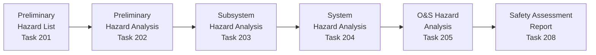
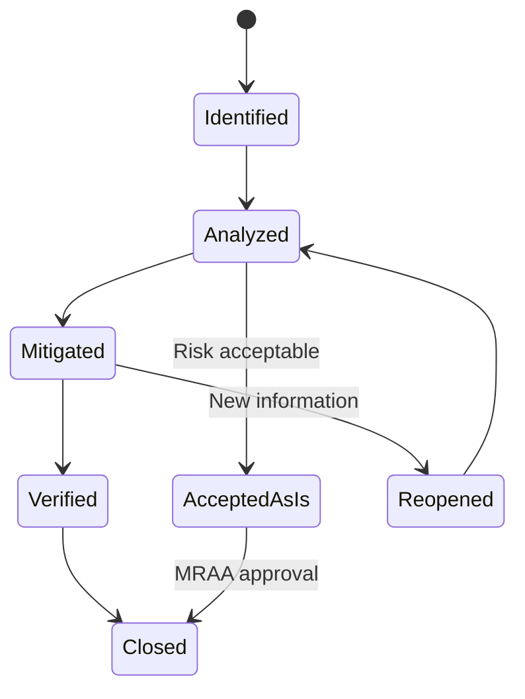

# MIL-STD-882E — System Safety

**Category:** 26 — Defense & Military Standards  
**Document:** 03 — MIL-STD-882E System Safety  
**Standard:** MIL-STD-882E (11 May 2012)  
**Scope:** System safety program, hazard analysis, risk assessment, software safety  
**Audience:** System safety engineers, program managers, SSWG members  
**Prerequisites:** Defense acquisition lifecycle (DoDI 5000.02)

---

## Chapter 1 — Standard Overview

### 1.1 Purpose

MIL-STD-882E defines the DoD approach to system safety, requiring that **hazards associated with every system, subsystem, and equipment are identified, evaluated, and mitigated** throughout the system lifecycle.

### 1.2 Key Concepts

| Concept | Definition |
|---------|-----------|
| Mishap | Unplanned event causing death, injury, occupational illness, or damage |
| Hazard | Real or potential condition that can cause mishap |
| Risk | Combination of mishap severity and probability of occurrence |
| ALARP | As Low As Reasonably Practicable (residual risk acceptable?) |
| SSWG | System Safety Working Group (program-level safety body) |
| MRAA | Mishap Risk Acceptance Authority (who accepts residual risk) |

### 1.3 System Safety Tasks (Appendix A)

| Task # | Title | Description |
|--------|-------|-------------|
| 100 | Safety Management | Overall program organization |
| 101 | System Safety Program | Plan, organization, resources |
| 102 | System Safety Working Group (SSWG) | Cross-functional safety group |
| 103 | Hazard Tracking System | Track hazards from identification through closure |
| 104 | Progress Summary Reports | Periodic status to program management |
| 201 | Preliminary Hazard List (PHL) | Initial identification of hazards |
| 202 | Preliminary Hazard Analysis (PHA) | Initial assessment of identified hazards |
| 203 | Subsystem Hazard Analysis (SSHA) | Design-level hazard analysis |
| 204 | System Hazard Analysis (SHA) | Integration-level multi-subsystem analysis |
| 205 | Operating & Support Hazard Analysis (O&SHA) | Operational procedures and maintenance |
| 206 | Health Hazard Assessment (HHA) | Human health risks (noise, chemicals, radiation) |
| 207 | Software System Safety (Software Hazard Analysis) | Software contribution to system hazards |
| 208 | Safety Assessment Report (SAR) | Summary report for decision authority |
| 209 | Test Safety Assessment | Safety during testing |
| 210 | Residual Risk Assessment & Acceptance | Final risk determination |
| 301 | Safety Verification | Verification that requirements are met |
| 302 | Safety Review of Change Proposals | ECPs that affect safety |
| 303 | Lessons Learned | Capture and disseminate safety lessons |

---

## Chapter 2 — Mishap Risk Assessment

### 2.1 Mishap Severity Categories

| Category | Severity | Description | Example |
|----------|----------|-------------|---------|
| **I** | Catastrophic | Death, system loss, irreversible severe environmental damage | Aircraft crash, weapon detonation |
| **II** | Critical | Severe injury/illness, major system damage, reversible major environmental | Crew member severe burn, loss of mission-critical subsystem |
| **III** | Marginal | Minor injury/illness, minor system damage, minor environmental | Sprained ankle, replacement of component |
| **IV** | Negligible | Less than minor injury, less than minor system damage | First aid, cosmetic damage |

### 2.2 Mishap Probability Levels

| Level | Description | Individual Item | Fleet/Inventory |
|-------|-------------|-----------------|-----------------|
| **A** | Frequent | Likely to occur often in item life | Continuously experienced |
| **B** | Probable | Will occur several times in item life | Will occur frequently |
| **C** | Occasional | Likely to occur sometime in item life | Will occur several times |
| **D** | Remote | Unlikely but possible in item life | Can reasonably be expected to occur |
| **E** | Improbable | So unlikely, can assume it won't occur | Unlikely but possible |
| **F** | Eliminated | Incapable of occurrence (design eliminates) | Cannot occur |

### 2.3 Mishap Risk Index (MRI) Matrix

| | Catastrophic (I) | Critical (II) | Marginal (III) | Negligible (IV) |
|---|---|---|---|---|
| **Frequent (A)** | 1 | 2 | 4 | 8 |
| **Probable (B)** | 1 | 2 | 5 | 9 |
| **Occasional (C)** | 2 | 3 | 6 | 10 |
| **Remote (D)** | 3 | 4 | 7 | 11 |
| **Improbable (E)** | 4 | 5 | 8 | 12 |

### 2.4 Risk Acceptance Authority

| MRI Range | Risk Level | Acceptance Authority |
|-----------|-----------|---------------------|
| 1-3 | **HIGH** | Component Acquisition Executive (CAE) or higher |
| 4-6 | **SERIOUS** | Program Executive Officer (PEO) |
| 7-9 | **MEDIUM** | Program Manager (PM) |
| 10-12 | **LOW** | PM (documented only, no special approval) |

---

## Chapter 3 — Hazard Analysis Methods

### 3.1 Analysis Progression

### 3.2 Preliminary Hazard Analysis (PHA) — Format

| # | Hazard | Cause | Effect | Severity | Probability | MRI | Mitigation | Residual Risk |
|---|--------|-------|--------|----------|-------------|-----|-----------|---------------|
| PH-001 | Battery thermal runaway | Manufacturing defect, overcharge | Fire, crew injury | II | D | 4 | BMS with triple redundancy, firewall isolation | Medium (7) |
| PH-002 | RF radiation exposure | Antenna mispointing while crew on deck | Burns, eye injury | II | C | 3 | Exclusion zone + interlock + warning system | Serious (5) |
| PH-003 | Software-commanded wrong weapon release | Software logic error | Fratricide | I | D | 3 | Independent safety interlock (hardware) | Medium (7) |

### 3.3 Analysis Techniques Used in 882E Context

| Technique | Task | Best For |
|-----------|------|----------|
| Fault Tree Analysis (FTA) | 203, 204 | Top-down: understand paths to catastrophic failure |
| FMECA | 203 | Bottom-up: component failure effects |
| Event Tree Analysis (ETA) | 204 | Sequence of events leading to mishap |
| Energy Trace & Barrier Analysis | 202 | Identify energy sources and their barriers |
| Sneak Circuit Analysis | 203 (electronic) | Hidden paths in wiring/logic |
| Software Fault Tree Analysis | 207 | Software contribution to hazards |
| Common Cause/Mode Analysis | 204 | Failures affecting multiple subsystems |
| Hazard and Operability (HAZOP) | 205 | Procedural/operational deviations |

---

## Chapter 4 — Software System Safety (Task 207)

### 4.1 Software Safety Criticality

| Software Control Category | Description | Mitigation Required |
|--------------------------|-------------|---------------------|
| **I — Safety Critical** | Software exercises autonomous control over safety-critical hardware (no other safeguard) | Full software safety lifecycle; highest rigor |
| **II — Safety Related** | Software provides safety-critical commands but hardware provides independent safeguard | Rigorous software development + hardware interlock verification |
| **III — Non-Safety Critical** | Software does not control, inhibit, or influence safety-critical functions | Standard development practices |

### 4.2 Software Hazard Analysis Process

| Step | Activity | Output |
|------|----------|--------|
| 1 | Identify software-controllable hazards | Software Hazard List |
| 2 | Map software to safety-critical functions | Software-Hardware criticality matrix |
| 3 | Perform Software FTA / FMEA | Fault trees for software-contributed mishaps |
| 4 | Identify software safety requirements | Specific safety requirements (SSRs) |
| 5 | Verify safety requirements through test | Safety qualification test evidence |
| 6 | Assess residual software risk | Task 210 input |

### 4.3 Software Safety Requirements Examples

| Requirement | Category | Verification Method |
|-------------|----------|-------------------|
| Software shall detect loss of communication with safety-critical sensor within 100 ms | I | Test with simulated comm failure |
| Software shall NOT command weapon release without confirmed target identification from independent source | I | Independent V&V + fault injection |
| Watchdog timer shall reset system if heartbeat not received within 500 ms | I | Fault injection + timing analysis |
| Display software shall present no-fire boundary to operator within 2 frames | II | Human factors test |
| Navigation software error > 50 m shall trigger warning | II | Simulation + real-world test |

---

## Chapter 5 — System Safety Working Group (SSWG)

### 5.1 SSWG Composition

| Member | Role | Organization |
|--------|------|-------------|
| System Safety Lead (Chair) | Manage program safety, chair meetings | Contractor |
| Government Safety POC | Oversight, risk acceptance | Program Office |
| Hardware Engineers | Identify hardware hazards | Design team |
| Software Engineers | Identify software hazards (Task 207) | SW development team |
| Test Engineers | Safety during testing (Task 209) | T&E organization |
| Logistics/Maintenance | O&S hazards (Task 205) | Sustainment |
| Human Factors | Human-related hazards | HFE team |
| Quality Assurance | Process compliance | QA team |

### 5.2 SSWG Meeting Cadence

| Program Phase | Frequency | Focus |
|---------------|-----------|-------|
| Concept/MSA | Quarterly | PHL development, initial risk identification |
| EMD (Engineering) | Monthly | Subsystem/system hazard analysis, design trades |
| Test & Evaluation | Bi-weekly | Test safety, incident response |
| Production | Quarterly | Manufacturing hazards, change proposals |
| Operations | Semi-annual | Lessons learned, field incidents |

---

## Chapter 6 — Safety Order of Precedence

### 6.1 Design Order of Precedence (MIL-STD-882E Section 4.4)

| Priority | Method | Description | Example |
|----------|--------|-------------|---------|
| 1 | **Eliminate hazard** | Design to remove hazard entirely | Use non-explosive fuze alternative |
| 2 | **Reduce risk** | Reduce severity or probability through design | Lower voltage, reduce stored energy |
| 3 | **Incorporate safety devices** | Add barriers/interlocks | Arming interlock, shielding |
| 4 | **Provide warning devices** | Alert personnel of hazard | Alarms, warning lights, klaxons |
| 5 | **Develop procedures/training** | Administrative controls | Operational procedures, safety training |
| 6 | **Accept residual risk** | Documented risk acceptance | MRAA signature |

---

## Chapter 7 — Hazard Tracking & Closure

### 7.1 Hazard Status Progression

### 7.2 Hazard Tracking System Fields

| Field | Content | Example |
|-------|---------|---------|
| Hazard ID | Unique identifier | HAZ-2024-0047 |
| Title | Brief description | Battery thermal runaway during charging |
| System/Subsystem | Where it applies | Power subsystem / Battery module |
| Severity Category | I-IV | II (Critical) |
| Probability | A-F | D (Remote) |
| MRI | 1-12 | 4 |
| Current Status | Open/Analyzed/Mitigated/Closed | Mitigated |
| Risk Acceptance Authority | Who must accept | PEO |
| Corrective Action | What was done | BMS triple-redundant monitoring + firewall |
| Verification | How confirmed | Test report TR-2024-089 |
| Residual Risk | After mitigation | MRI = 7 (Medium) |

---

## Chapter 8 — Integration with DoD Acquisition

### 8.1 Safety Activities by Acquisition Phase

| Phase | Key Safety Activities | Deliverables |
|-------|----------------------|--------------|
| **MSA (Material Solution Analysis)** | PHL, Initial PHA, Safety concept | System Safety Program Plan (SSPP) |
| **TMRR (Technology Maturation)** | PHA refinement, safety requirements | Updated PHA, Safety Requirements |
| **EMD (Engineering & Manufacturing)** | SSHA, SHA, Software Safety, Test Safety | SSHA, SHA, SAR (preliminary) |
| **Production** | Manufacturing Safety, Change Proposals | Production Safety Assessment |
| **O&S (Operations & Support)** | O&SHA, Field Safety, Lessons Learned | Final SAR, Lessons Learned |

### 8.2 Relationship to Other Standards

| Standard | Relationship to MIL-STD-882E |
|----------|------------------------------|
| MIL-STD-810H | Environmental hazards identified in PHA |
| MIL-STD-461G | EMI as hazard to personnel or systems |
| DO-178C | Software safety (civil aviation equivalent of Task 207) |
| IEC 61508 | Functional safety (commercial equivalent approach) |
| MIL-HDBK-516C | Airworthiness includes system safety evidence |
| ARP 4761 | Safety assessment methodology (civil aviation equivalent) |
| DoDI 5000.02T | Acquisition framework mandating 882E |

---

## Chapter 9 — MIL-STD-882E vs. ISO 12100 / IEC 61508

| Aspect | MIL-STD-882E | ISO 12100 + IEC 61508 |
|--------|-------------|----------------------|
| Domain | Defense/military systems | Commercial/industrial |
| Risk matrix | 5×4 (probability × severity) | Continuous (PFH) or qualitative |
| Risk acceptance | Named authority (MRAA) | ALARP + societal standards |
| Software safety | Task 207 (criticality categories) | IEC 61508 Part 3 / IEC 62304 |
| Lifecycle scope | Cradle to grave (all phases) | Design + operation focused |
| Hazard tracking | Formal tracking system mandated | Less prescriptive |
| Legal basis | DoDI 5000.02 (acquisition regulation) | EU Directives / Regulations |

---

## Chapter 10 — Interview Questions

### Entry-Level
1. What are the four severity categories in MIL-STD-882E?
2. What is a Mishap Risk Index and how is it calculated?
3. What is the SSWG and who participates?

### Mid-Level
1. Walk through a Preliminary Hazard Analysis for a UAV launch system.
2. Explain the three Software Control Categories and their implications for development rigor.
3. How does the Order of Precedence for hazard mitigation work? Give an example.

### Senior
1. Design a system safety program for a new missile defense system from MSA through production.
2. How do you handle hazards that span multiple subsystems from different contractors?
3. Propose a methodology for software system safety of an AI-based target recognition system.

### Principal
1. How should MIL-STD-882E evolve to address autonomous weapons systems and AI decision-making?
2. Design a safety framework for a multi-domain system (air, land, sea, space, cyber) with emergent hazards.
3. Propose a quantitative risk assessment methodology to supplement the qualitative 882E matrix.

---

*Document Version: 1.0 | Last Updated: May 2026 | Author: Defense Standards Engineering Team*
