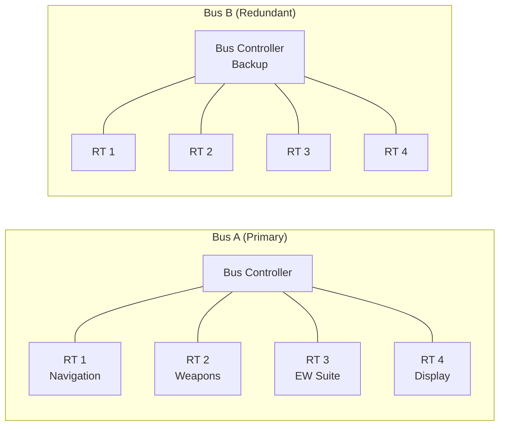

# MIL-STD-1553B — Digital Time Division Command/Response Multiplex Bus

**Category:** 26 — Defense & Military Standards  
**Document:** 04 — MIL-STD-1553B Data Bus  
**Standard:** MIL-STD-1553B (21 September 1978, Notice 4: 2017)  
**Scope:** Avionics/defense serial data bus protocol, terminal types, message formats  
**Audience:** Avionics bus engineers, embedded systems developers, defense integrators  
**Prerequisites:** Digital communications fundamentals, military avionics concepts

---

## Chapter 1 — Standard Overview

### 1.1 History & Significance

| Year | Event |
|------|-------|
| 1973 | MIL-STD-1553A published (USAF for F-16 program) |
| 1978 | MIL-STD-1553B published (multi-service standard) |
| 1986 | Notice 2 — validation/verification guidelines |
| 1996 | SAE AS15531 (commercial/international version) |
| 2017 | Notice 4 — latest update |
| Present | Still in active use on 100+ military platforms worldwide |

### 1.2 Key Characteristics

| Parameter | Specification |
|-----------|--------------|
| Data rate | 1 Mbps (Manchester II bi-phase) |
| Topology | Dual-redundant bus (Bus A, Bus B) |
| Media | Shielded twisted-pair (78 Ω ± 2 Ω) |
| Max terminals | 31 Remote Terminals per bus |
| Word size | 20 bits (16 data + 3 sync + 1 parity) |
| Max message size | 32 data words (512 bits = 512 µs) |
| Coupling | Transformer-coupled (direct or stub) |
| Maximum bus length | ~100 m (300 ft) typical |
| Deterministic | Yes (command/response protocol) |

---

## Chapter 2 — Bus Architecture

### 2.1 Terminal Types

| Terminal Type | Abbreviation | Role | Count |
|-------------|-------------|------|-------|
| **Bus Controller** | **BC** | Master — initiates all transactions | 1 (active); backup possible |
| **Remote Terminal** | **RT** | Slave — responds to BC commands | Up to 31 (addresses 0-30; 31 = broadcast) |
| **Bus Monitor** | **BM** / **MT** | Passive listener (no response) | 1+ (for recording/debugging) |

### 2.2 Dual-Redundant Architecture

### 2.3 Coupling Methods

| Method | Stub Length | Transformer Ratio | Application |
|--------|-----------|-------------------|-------------|
| Direct coupling | ≤ 1 ft (0.3 m) | 1:1.41 | Short stubs, close-mounted LRUs |
| Transformer coupling (stub) | 1–20 ft (0.3–6 m) | 1:1 | Most common; longer stubs allowed |

---

## Chapter 3 — Word Formats

### 3.1 Three Word Types

| Word Type | Bits | Source | Content |
|-----------|------|--------|---------|
| **Command Word** | 20 | BC only | RT address (5) + T/R (1) + subaddress (5) + word count (5) + sync (3) + parity (1) |
| **Data Word** | 20 | BC or RT | Data (16) + sync (3) + parity (1) |
| **Status Word** | 20 | RT only | RT address (5) + status bits (11) + sync (3) + parity (1) |

### 3.2 Command Word Format

| Bit Position | Field | Size | Description |
|-------------|-------|------|-------------|
| 1-3 | Sync | 3 bits | Command/Status sync pattern (positive-then-negative) |
| 4-8 | RT Address | 5 bits | 0-30 (31 = broadcast) |
| 9 | T/R | 1 bit | 0 = Receive (BC→RT), 1 = Transmit (RT→BC) |
| 10-14 | Subaddress/Mode | 5 bits | 1-30 = subaddress; 0 or 31 = mode code |
| 15-19 | Word Count/Mode Code | 5 bits | 1-32 words (0 = 32); or mode code value |
| 20 | Parity | 1 bit | Odd parity over bits 4-19 |

### 3.3 Status Word Fields

| Bit | Field | Meaning |
|-----|-------|---------|
| 4-8 | RT Address | Address of responding RT |
| 9 | Message Error | RT detected error in received message |
| 10 | Instrumentation | RT used for instrumentation |
| 11 | Service Request | RT requesting service from BC |
| 12 | Reserved | — |
| 13 | Broadcast Received | RT acknowledges broadcast command |
| 14 | Busy | RT cannot comply (busy with prior command) |
| 15 | Subsystem Flag | RT's subsystem has fault |
| 16 | Dynamic Bus Control Acceptance | RT accepts bus control |
| 17 | Terminal Flag | RT itself has fault |
| 18-19 | Reserved | — |
| 20 | Parity | Odd parity |

---

## Chapter 4 — Message Transfer Types

### 4.1 Six Transfer Types

| Type | Direction | Sequence | Use |
|------|-----------|----------|-----|
| **BC to RT** | BC → RT | Cmd(Rx) → Data → Status | Send data to subsystem |
| **RT to BC** | RT → BC | Cmd(Tx) → Status → Data | Retrieve data from subsystem |
| **RT to RT** | RT_A → RT_B | Cmd(Rx)_B → Cmd(Tx)_A → Status_A → Data → Status_B | Direct subsystem-to-subsystem |
| **Mode Code (no data)** | BC ↔ RT | Cmd(Mode) → Status | Control commands (reset, sync, etc.) |
| **Mode Code (with data, Tx)** | RT → BC | Cmd(Mode) → Status → Data(1 word) | BIT results, vector word |
| **Mode Code (with data, Rx)** | BC → RT | Cmd(Mode) → Data(1 word) → Status | Synchronize, configure |

### 4.2 Broadcast Messages

| Feature | Description |
|---------|-------------|
| Address | RT address 31 used for broadcast |
| Response | NO status word returned (all RTs receive silently) |
| Application | Time synchronization, mode changes |
| Verification | BC must verify receipt via subsequent RT-to-BC transfer |

---

## Chapter 5 — Timing Requirements

### 5.1 Critical Timing Parameters

| Parameter | Requirement | Tolerance |
|-----------|-------------|-----------|
| Bit rate | 1.0 MHz | ± 0.1% |
| Inter-message gap (BC side) | ≥ 4 µs | No maximum (BC controls schedule) |
| RT response time | 4–12 µs (after last bit of command) | Must be within window |
| Contiguous word gap | ≤ 4 µs | Between consecutive data words |
| No-response timeout | 14 µs (typical BC setting) | BC declares RT dead if no response |

### 5.2 Bus Cycle Timing

| Scenario | Typical Cycle Time | Calculation |
|----------|-------------------|-------------|
| BC to RT (32 words) | ~700 µs | 20 (cmd) + 32×20 (data) + 20 (status) + gaps |
| RT to BC (1 word) | ~80 µs | 20 (cmd) + 20 (status) + 20 (data) + gaps |
| Full bus cycle (32 RTs, mixed) | 5-20 ms | Depends on message schedule |
| Typical avionics frame rate | 50 Hz (20 ms) or 80 Hz (12.5 ms) | Platform-specific requirement |

---

## Chapter 6 — Mode Codes

### 6.1 Standard Mode Codes

| Code Value | Transmit (T/R=1) | Receive (T/R=0) |
|-----------|-------------------|-----------------|
| 0 | Dynamic Bus Control | Dynamic Bus Control |
| 1 | Synchronize (w/data) | Synchronize (w/data) |
| 2 | Transmit Status Word | Transmit Last Command |
| 3 | Initiate Self-Test | Initiate Self-Test |
| 4 | Transmitter Shutdown | Transmitter Shutdown |
| 5 | Override Transmitter Shutdown | Override Transmitter Shutdown |
| 8 | Reset Remote Terminal | Reset Remote Terminal |
| 16 | Transmit Vector Word | — |
| 17 | Transmit BIT Word | — |
| 18-31 | Reserved / User-defined | Reserved / User-defined |

---

## Chapter 7 — Error Detection & Handling

### 7.1 Error Types

| Error | Detection Method | RT Action |
|-------|-----------------|-----------|
| Manchester encoding violation | Decoder detects invalid transition | Set Message Error bit |
| Parity error | Odd parity check | Set Message Error bit; no response |
| Word count error | Expected vs. received word count mismatch | Set Message Error bit |
| Sync pattern invalid | Wrong sync type received | Ignore message |
| Gap violation | Inter-word gap > 4 µs | Set Message Error bit |
| RT address mismatch | Not my address | Ignore (do not respond) |
| No response timeout | BC waits > 14 µs with no status | BC retries on same/alternate bus |

### 7.2 BC Error Recovery Strategy

| Step | Action | Fallback |
|------|--------|----------|
| 1 | Retry on same bus (Bus A) | Same message, immediately |
| 2 | Retry on alternate bus (Bus B) | Same message on redundant bus |
| 3 | Mark RT as failed | Report to system executive |
| 4 | Continue schedule | Skip failed RT in cycle |
| 5 | Periodic re-poll | Check if RT recovers |

---

## Chapter 8 — Physical Layer

### 8.1 Electrical Characteristics

| Parameter | Requirement |
|-----------|-------------|
| Impedance | 70–85 Ω (nominal 78 Ω) |
| Coupling transformer | Isolation ≥ 1500 Vrms |
| Output voltage (BC/RT) | 18–27 Vp-p (across bus) |
| Output voltage (stub) | 6–9 Vp-p (at transformer secondary) |
| Rise/fall time | 100–300 ns |
| Zero-crossing distortion | ≤ ±150 ns |
| Common mode rejection | ≥ 35 dB |
| Cable type | Twinaxial, 78 Ω, shielded |

### 8.2 Manchester II Bi-Phase Encoding

| Logic | First Half | Second Half | Transition |
|-------|-----------|-------------|-----------|
| Logic 1 | Positive | Negative | Mid-bit transition high→low |
| Logic 0 | Negative | Positive | Mid-bit transition low→high |
| Sync (Cmd/Sts) | Positive 1.5 bits | Negative 0.5 bits | Invalid Manchester (pattern recognition) |
| Sync (Data) | Negative 1.5 bits | Positive 0.5 bits | Inverse of Cmd sync |

---

## Chapter 9 — Platform Applications

### 9.1 Aircraft Using MIL-STD-1553B

| Platform | Number of 1553 Buses | Key Subsystems on Bus |
|----------|---------------------|----------------------|
| F-16 Fighting Falcon | 4+ | Fire control, stores management, INS, radar |
| F/A-18 Hornet | 5+ | Mission computer, weapons, EW, displays |
| F-22 Raptor | Multiple (+ fiber) | Integrated avionics, stealth management |
| C-130J Hercules | 2-4 | Flight management, cargo, defensive aids |
| AH-64 Apache | 3+ | Fire control, sensors, engines |
| Eurofighter Typhoon | 4 | Avionics, weapons, EW |
| Joint Strike Fighter (F-35) | Limited (primary = fiber) | Legacy interfaces, stores |

### 9.2 Alternative and Successor Buses

| Bus | Data Rate | Domain | Relationship to 1553 |
|-----|-----------|--------|---------------------|
| ARINC 429 | 12.5/100 kbps | Civil avionics | Simpler, unidirectional (point-to-point) |
| ARINC 664 (AFDX) | 100 Mbps | Civil avionics (A380, 787) | Ethernet-based deterministic |
| MIL-STD-1773 | 1-20 Mbps | Fiber optic avionics | Fiber version of 1553 |
| FC-AE-1553 | 1-4 Gbps | Next-gen military | Fibre Channel with 1553 protocol emulation |
| TTP (Time-Triggered Protocol) | 25 Mbps | Safety-critical avionics | Deterministic, TDMA |
| IEEE 1394b (AS5643) | 800 Mbps | Military video/sensor | High bandwidth, deterministic |
| Ethernet (TSN) | 1-10 Gbps | Future military | Time-Sensitive Networking |

---

## Chapter 10 — Interview Questions

### Entry-Level
1. What are the three terminal types in MIL-STD-1553B?
2. What is the data rate and encoding method?
3. Explain the difference between a Command Word and a Status Word.

### Mid-Level
1. Describe the six message transfer types and when each is used.
2. How does the BC detect and recover from RT communication failures?
3. What is the maximum latency for a single BC-to-RT transfer of 32 data words?

### Senior
1. Design a 1553 bus architecture for a new platform with 20 subsystems and 80 Hz frame rate.
2. How do you validate 1553 compliance including timing, voltage, and protocol correctness?
3. Propose a strategy for integrating legacy 1553 subsystems with a modern Ethernet backbone.

### Principal
1. Design a migration path from MIL-STD-1553B to deterministic Ethernet (TSN) for a legacy fighter upgrade.
2. How should 1553 evolve or be replaced for autonomous UAV platforms with high-bandwidth sensor fusion?
3. Propose a cybersecurity hardening approach for 1553 bus (which has no native authentication or encryption).

---

*Document Version: 1.0 | Last Updated: May 2026 | Author: Defense Standards Engineering Team*
