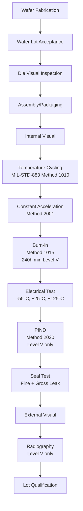

# MIL-PRF-38535 — Microcircuits & Radiation Hardness Assurance

**Category:** 26 — Defense & Military Standards  
**Document:** 05 — MIL-PRF-38535 Microcircuits  
**Standard:** MIL-PRF-38535 (Performance Specification), MIL-STD-883 (Test Methods)  
**Scope:** Military/space-grade integrated circuits, QML program, radiation hardness  
**Audience:** Component engineers, radiation effects specialists, QML facility managers  
**Prerequisites:** Semiconductor physics, IC manufacturing fundamentals

---

## Chapter 1 — Standard Overview

### 1.1 MIL-PRF-38535 Structure

| Level | Description | Application |
|-------|-------------|-------------|
| General Specification | MIL-PRF-38535 | Overall framework, quality levels, QML requirements |
| Detail Specification | Slash sheets (e.g., /001, /002) | Device-specific parameters and tests |
| Test Methods | MIL-STD-883 | How to perform each test |

### 1.2 Quality Levels

| Quality Level | Description | Application | Screening |
|--------------|-------------|-------------|-----------|
| **V (Space)** | Highest reliability | Space, strategic nuclear | Full screening + lot qualification + radiation |
| **Q** | High reliability | Tactical military, aircraft | Full screening + group qualification |
| **M** | Standard military | General military | Reduced screening |
| **T** | Enhanced commercial | COTS with enhanced testing | Extended temperature, limited screening |
| **Commercial** | Not covered by MIL-PRF-38535 | Consumer/industrial | Manufacturer QC only |

### 1.3 QML (Qualified Manufacturers List)

| Aspect | Description |
|--------|-------------|
| Definition | DoD-approved manufacturers and product lines for MIL-PRF-38535 ICs |
| Authority | Defense Logistics Agency (DLA Land and Maritime) |
| Certification | Manufacturer's technology line certified by DSCC audit |
| Technology Certification | Specific fabrication process certified (not just facility) |
| QML listing | Published list of certified manufacturer/technology/device combinations |
| Maintenance | Periodic surveillance audits + yield/reliability monitoring |

---

## Chapter 2 — Screening Flow

### 2.1 Level Q/V Screening Flow

### 2.2 Key Screening Tests

| Test | MIL-STD-883 Method | Purpose | Conditions (typical) |
|------|-------------------|---------|---------------------|
| Internal Visual | 2010/2017 | Die attach, bond wire inspection | 100× magnification |
| Temperature Cycling | 1010 | Mechanical fatigue (solder, bonds) | -65°C to +150°C, 100 cycles (Q), 500 (V) |
| Constant Acceleration | 2001 | Die attach, lid integrity | 20,000 – 30,000 g (Y1 axis) |
| Burn-in | 1015 | Infant mortality elimination | 125°C, 160h (Q) / 240h (V), powered |
| Electrical Test | Per detail spec | Verify parametric and functional | -55°C, +25°C, +125°C |
| PIND (Particle Impact Noise Detection) | 2020 | Internal loose particles | Acoustic detection |
| Fine Leak | 1014.14 (Condition A) | Hermetic seal integrity | Helium tracer gas |
| Gross Leak | 1014.14 (Condition C) | Large seal failures | Fluorocarbon bubble |
| Radiography (X-ray) | 2012 | Internal defects, wire bond position | X-ray imaging |

---

## Chapter 3 — Radiation Hardness Assurance (RHA)

### 3.1 Radiation Environment Sources

| Source | Environment | Particles | Concern |
|--------|-------------|-----------|---------|
| Van Allen Belts | Earth orbit (LEO, MEO, GEO) | Protons, electrons (trapped) | TID, displacement |
| Solar Particle Events (SPE) | Space (all orbits) | Protons, heavy ions (transient) | SEE, TID |
| Galactic Cosmic Rays (GCR) | Space (all) | Heavy ions (continuous, low flux) | SEE (especially SEL) |
| Nuclear Weapon Effects | Military (atmosphere/space) | Gamma, neutrons, X-rays, EMP | TID, dose-rate, neutron damage |
| Nuclear Reactor | Navy (submarine/carrier) | Neutrons, gamma | TID, displacement damage |
| Proton Therapy (medical) | Medical facility | Protons | SEE testing source |
| Atmospheric Neutrons | Aircraft altitude (>30,000 ft) | Neutrons from cosmic ray interactions | SEU in avionics |

### 3.2 Radiation Effects Taxonomy

| Effect | Abbreviation | Mechanism | Consequence |
|--------|-------------|-----------|-------------|
| **Total Ionizing Dose** | TID | Cumulative charge trapped in oxide | Parameter drift, functional failure |
| **Single Event Upset** | SEU | Ion strike flips a storage bit | Soft error (recoverable) |
| **Single Event Latchup** | SEL | Ion triggers thyristor (PNPN path) | Destructive current draw |
| **Single Event Burnout** | SEB | Ion triggers secondary breakdown in power MOSFET | Destructive (power devices) |
| **Single Event Gate Rupture** | SEGR | Ion causes oxide breakdown | Destructive (power MOSFETs) |
| **Single Event Functional Interrupt** | SEFI | Ion disrupts control logic | Device halts (requires reset) |
| **Single Event Transient** | SET | Ion generates current pulse in analog | Transient voltage/current glitch |
| **Enhanced Low Dose Rate Sensitivity** | ELDRS | Increased degradation at low dose rates | Bipolar/BiCMOS devices affected |
| **Displacement Damage** | DD | Neutrons/protons displace Si atoms | Reduced gain, increased leakage |
| **Dose Rate (Transient Radiation)** | — | Prompt gamma photocurrent | Latchup, logic upset, burnout |

### 3.3 RHA Designators (MIL-PRF-38535)

| Designator | Meaning | TID Requirement |
|-----------|---------|-----------------|
| **M** | TID ≥ 3 krad(Si) | Low hardness |
| **D** | TID ≥ 10 krad(Si) | Moderate |
| **P** | TID ≥ 30 krad(Si) | High |
| **L** | TID ≥ 100 krad(Si) | Very high |
| **R** | TID ≥ 300 krad(Si) | Extreme |
| **H** | TID ≥ 1 Mrad(Si) | Hardened by design |
| **F** | Fail-safe specification | Custom requirements |

---

## Chapter 4 — Radiation Testing Methods

### 4.1 TID Testing (MIL-STD-883 Method 1019)

| Parameter | Standard Requirement |
|-----------|---------------------|
| Radiation source | Co-60 gamma (preferred) or X-ray |
| Dose rate (standard) | 50–300 rad(Si)/s |
| Dose rate (ELDRS screen) | 10 mrad(Si)/s or lower |
| Bias during irradiation | Worst-case (usually all inputs/outputs biased) |
| Temperature | 25°C ± 5°C (room temperature) |
| Post-irradiation anneal | Test within 1 hour of exposure; or specified anneal step |
| Parameters measured | All spec parameters at each dose step |
| Test structure | Functional devices (not just test structures) |

### 4.2 SEE Testing

| Test | Method | Source | LET Range |
|------|--------|--------|-----------|
| Heavy ion SEU/SEL | EIA/JESD57 | Cyclotron (heavy ions) | 1–100 MeV-cm²/mg |
| Proton SEE | JESD234 | Proton beam (50-200 MeV) | N/A (nuclear reactions) |
| Laser SEE | — | Pulsed laser (wavelength ~800 nm) | Equivalent LET mapping |

### 4.3 ELDRS Testing

| Issue | Standard TID test (high dose rate) | ELDRS concern |
|-------|-----------------------------------|---------------|
| Dose rate | 50-300 rad(Si)/s | Space environment: 0.001-0.01 rad(Si)/s |
| Result | May show MORE hardness | May show LESS hardness at low rate |
| Affected technologies | Bipolar, BiCMOS, some CMOS (older) | Same |
| Solution | Test at 10 mrad(Si)/s per MIL-STD-883 Method 1019.9 | Extended test (weeks-months) |
| Alternative | Accelerated ELDRS test at elevated temperature | 100°C at higher dose rate |

---

## Chapter 5 — Package Types & Reliability

### 5.1 Military Package Types

| Package | Description | Hermeticity | Temperature | Application |
|---------|-------------|-------------|-------------|-------------|
| CDIP (Ceramic DIP) | Ceramic dual in-line | Hermetic | -55 to +125°C | Legacy military |
| CQFP (Ceramic QFP) | Ceramic quad flat pack | Hermetic | -55 to +125°C | Higher pin count |
| CLCC (Ceramic Leadless Chip Carrier) | Ceramic LCC | Hermetic | -55 to +125°C | SMT military |
| Flatpack | Low-profile ceramic | Hermetic | -55 to +125°C | Space, weight-critical |
| Column Grid Array (CGA) | Ceramic with solder columns | Hermetic | -55 to +125°C | High I/O, thermal cycling |
| Plastic (PEM) | Plastic encapsulated | Non-hermetic | -55 to +125°C* | COTS with upscreening |

*Plastic packages used per GEIA-STD-0002/0006 with appropriate derating and qualification*

### 5.2 Hermetic vs. Non-Hermetic

| Factor | Hermetic (Ceramic) | Non-Hermetic (Plastic) |
|--------|-------------------|----------------------|
| Moisture ingress | None (sealed cavity) | Permeable (moisture absorption) |
| Reliability (high temp) | Excellent | Degraded above 110°C |
| Cost | 10-100× commercial | Lower |
| Lead time | 6-18 months | Weeks |
| Size/weight | Larger | Smaller |
| Space qualification | Standard | Requires special qualification |
| Repair/rework | Difficult (lid sealed) | Standard |
| PIND test | Required (Level V) | N/A |

---

## Chapter 6 — Lot Qualification & Group Testing

### 6.1 Group Inspection

| Group | Tests | Frequency | Purpose |
|-------|-------|-----------|---------|
| A | Electrical (DC, AC, functional) at temperature | Every lot | Verify performance |
| B | Die-related: wire bond, die shear, SEM, decap | Periodic (quarterly) | Construction integrity |
| C | Package-related: thermal cycling (1000 cyc), thermal shock, HAST/THB | Periodic (semi-annual) | Long-term reliability |
| D | Endurance: life test (1000h at 125°C) | Periodic (annual) | Wearout/degradation |
| E | Radiation: TID, SEE (for RHA designator) | Per technology/lot | Radiation hardness |

---

## Chapter 7 — Counterfeit Prevention

### 7.1 Counterfeit Risk for Military Microcircuits

| Risk Factor | Description |
|-------------|-------------|
| Obsolescence | Many MIL ICs out of production → creates demand for counterfeits |
| High value | MIL-grade ICs cost 10-100× commercial → profit motive |
| Supply chain complexity | Brokers, distributors, gray market | 
| Geopolitical | Nation-state adversaries may supply trojan'd components |
| Detection difficulty | Sophisticated counterfeits require advanced testing |

### 7.2 Detection Methods (SAE AS6081/AS6171)

| Test | Purpose | Capability |
|------|---------|-----------|
| External Visual | Surface markings, package condition | Remarked parts, sanding marks |
| X-ray / Radiography | Internal construction | Wrong die, missing bonds |
| Decapsulation + Die Visual | Verify die markings, technology | Different die than marked |
| Electrical testing (full spec) | Verify performance | Out-of-spec rejects |
| Heated solvent test | Verify marking permanence | Re-inked markings dissolve |
| XRF (X-ray fluorescence) | Material composition | Wrong package material |
| FTIR (Fourier-Transform IR) | Package material ID | Wrong mold compound |
| Curve tracer | Basic functionality | Dead or wrong devices |
| Acoustic microscopy (C-SAM) | Die attach voids, delamination | Recycled/damaged parts |

---

## Chapter 8 — Derating & Reliability

### 8.1 Derating Guidelines (MIL-HDBK-338B / NASA EEE-INST-002)

| Parameter | Derating Factor (Typical) |
|-----------|--------------------------|
| Junction temperature | Derate to 80% of max Tj (e.g., 125°C → use ≤ 100°C) |
| Supply voltage | 70-90% of absolute max rating |
| Output current | ≤ 75% of rated maximum |
| Clock frequency | ≤ 80% of maximum specified |
| Fanout | ≤ 75% of maximum rated |
| Electrostatic stress | 50% of ESD rating for design margin |

### 8.2 Reliability Prediction (MIL-HDBK-217F)

| Factor | Description | Impact on λ (failure rate) |
|--------|-------------|---------------------------|
| πT (temperature) | Junction temperature | Exponential increase with temperature |
| πQ (quality) | Quality level (Q, V, commercial) | Military: 0.25×; commercial: 10× |
| πE (environment) | Operating environment | Ground benign: 1×; missile launch: 200× |
| πL (learning) | Manufacturing maturity | New process: 10×; mature: 1× |

---

## Chapter 9 — Current Trends & Alternatives

### 9.1 COTS in Military (Perry Reform Legacy)

| Approach | Description | Risk |
|----------|-------------|------|
| Direct COTS use | Commercial parts with no additional testing | High — no qualification |
| Upscreened COTS | Commercial parts with added MIL-STD-883 screening | Medium — limited lot control |
| MIL-COTS / Enhanced COTS | Parts designed to military temp but not full QML | Medium-Low |
| QML (MIL-PRF-38535) | Full military qualification | Lowest technical risk |
| GEIA-STD-0002 | Standard for plastic-packaged EEE parts in high-reliability | Controlled COTS approach |

### 9.2 Trusted Foundry / DMEA Program

| Program | Purpose | Status |
|---------|---------|--------|
| DoD Trusted Foundry | Ensure access to trusted semiconductor fabrication | Active (DMEA managed) |
| RAMP (Rapid Assured Microelectronics Prototyping) | Accelerate prototype access | Active |
| State-of-the-Art Heterogeneous Integrated Packaging (SHIP) | Advanced packaging for military | Active |
| DARPA ERI (Electronics Resurgence Initiative) | Next-gen semiconductor for defense | Multi-program |

---

## Chapter 10 — Interview Questions

### Entry-Level
1. What are the quality levels defined in MIL-PRF-38535?
2. What is the purpose of burn-in testing?
3. Name three radiation effects on integrated circuits.

### Mid-Level
1. Walk through the Level V screening flow for a space-grade FPGA.
2. Explain TID testing per MIL-STD-883 Method 1019. What parameters do you monitor?
3. What is ELDRS and why does it matter for bipolar devices in space?

### Senior
1. Design a radiation hardness assurance program for a LEO constellation with 15-year mission life.
2. How do you qualify a COTS FPGA for a tactical military application? What additional testing is required?
3. Propose a counterfeit detection protocol for legacy MIL-PRF-38535 ICs procured from a broker.

### Principal
1. How should the DoD approach semiconductor supply chain security given geopolitical constraints (TSMC/Taiwan)?
2. Design a qualification methodology for advanced-node (5nm/3nm) parts where MIL-STD-883 tests were designed for legacy packaging.
3. Propose a modern alternative to MIL-HDBK-217F reliability prediction that accounts for nanoscale failure mechanisms.

---

*Document Version: 1.0 | Last Updated: May 2026 | Author: Defense Standards Engineering Team*
