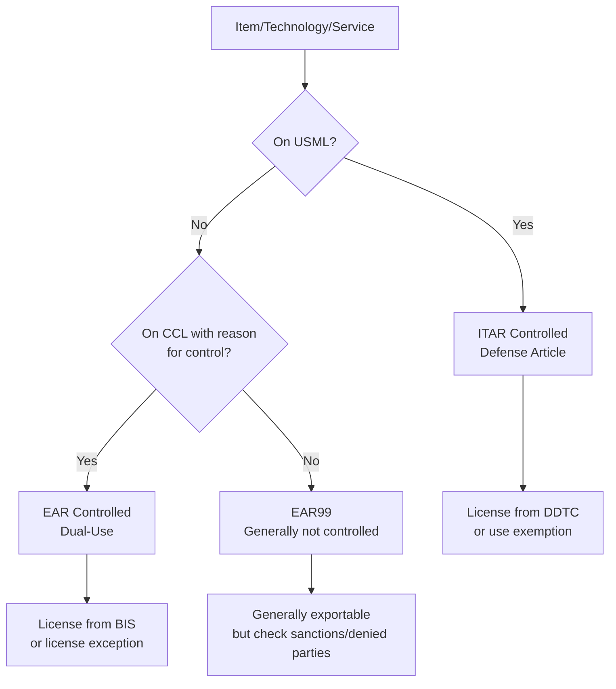

# ITAR & EAR — Export Controls for Defense Technology

**Category:** 26 — Defense & Military Standards  
**Document:** 06 — ITAR/EAR Export Controls  
**Standard:** ITAR (22 CFR 120-130), EAR (15 CFR 730-774)  
**Scope:** US export control regulations for defense articles and dual-use technology  
**Audience:** Export compliance officers, program managers, engineers handling controlled data  
**Prerequisites:** Understanding of US government contracting, DoD programs

---

## Chapter 1 — Export Control Framework

### 1.1 Two-Track System

| Regulation | Authority | Scope | Administering Agency |
|-----------|-----------|-------|---------------------|
| **ITAR** (International Traffic in Arms Regulations) | Arms Export Control Act (AECA) | Defense articles, defense services, technical data | Department of State — DDTC |
| **EAR** (Export Administration Regulations) | Export Control Reform Act 2018 | Dual-use items, commercial with military potential | Department of Commerce — BIS |

### 1.2 Decision Flow

---

## Chapter 2 — ITAR (International Traffic in Arms Regulations)

### 2.1 United States Munitions List (USML) Categories

| Category | Title | Examples |
|----------|-------|---------|
| I | Firearms | Military rifles, pistols, ammunition |
| II | Materials, Chemicals, Microorganisms | Energetics, propellants, chemical agents |
| III | Ammunition/Ordnance | Warheads, mines, torpedoes |
| IV | Launch Vehicles, Missiles, Rockets | Ballistic missiles, rocket motors |
| V | Explosives | Military explosives, detonators |
| VI | Surface Vessels of War | Warships, combat boats |
| VII | Ground Vehicles | Tanks, APCs, military vehicles |
| VIII | Aircraft | Military aircraft, UAVs, engines |
| IX | Military Training Equipment | Simulators, training devices |
| X | Personal Protective Equipment | Body armor, helmets (military-spec) |
| **XI** | **Military Electronics** | EW systems, military radar, C4ISR |
| XII | Fire Control, Sensors | Targeting systems, military optics, IR sensors |
| XIII | Materials/Miscellaneous | Classified materials, special alloys |
| XIV | Toxicological Agents | Chemical/biological defense |
| **XV** | **Spacecraft** | Military/intelligence satellites |
| XVI | Nuclear Weapons | (Separate regulatory regime) |
| XVII | Classified Articles | Items classified by USG |
| XVIII | Directed Energy Weapons | Lasers, HPM weapons |
| XIX | Gas Turbine Engines | Military-specific turbines |
| XX | Submersible Vessels | Military submarines |
| XXI | Articles, Technical Data, Defense Services not otherwise enumerated | Catch-all |

### 2.2 ITAR Definitions

| Term | Definition | Implication |
|------|-----------|-------------|
| **Defense Article** | Any item on USML | Cannot export/transfer without license |
| **Technical Data** | Information required for design, development, production, maintenance of defense article | ITAR-controlled: drawings, specs, code, test data |
| **Defense Service** | Furnishing assistance (training, technical advice) to foreign person using technical data | Person-to-person controlled |
| **Foreign Person** | Any non-US citizen, non-permanent resident, non-protected individual | Even on US soil — "deemed export" |
| **Deemed Export** | Disclosure of controlled technical data to foreign person in the US | Requires license like physical export |
| **Empowered Official** | Corporate officer responsible for ITAR compliance | Must sign applications |
| **DDTC** | Directorate of Defense Trade Controls | Issues licenses, maintains USML |

### 2.3 ITAR License Types

| License Type | Use | Duration |
|-------------|-----|----------|
| DSP-5 | Permanent export of defense article | Valid for 4 years |
| DSP-73 | Temporary export of defense article | Specific time period |
| DSP-85 | Temporary import of defense article | Return to origin required |
| TAA (Technical Assistance Agreement) | Ongoing defense services or technical data exchange | Multi-year (renewable) |
| MLA (Manufacturing License Agreement) | Foreign manufacture of defense article | Multi-year |
| WDA (Warehouse and Distribution Agreement) | Foreign storage/distribution | Specific locations |

### 2.4 ITAR Violations & Penalties

| Violation Type | Civil Penalty | Criminal Penalty |
|---------------|--------------|-----------------|
| Unauthorized export of defense article | Up to $1.2M per violation | Up to $1M and/or 20 years imprisonment |
| Willful violation | Debarment + civil penalty | Criminal prosecution |
| Failure to register | Administrative penalty | Bars all ITAR activities |
| Unauthorized retransfer | Same as export violation | Same |
| Voluntary disclosure (VD) | Reduced penalties (mitigating) | Reduced (demonstrates good faith) |

### 2.5 Notable ITAR Enforcement Cases

| Company | Year | Violation | Penalty |
|---------|------|-----------|---------|
| ITT Corporation | 2007 | Night vision to China, Singapore | $100M (then-record) |
| Raytheon | 2012 | Technical data to multiple countries | $8M + corrective measures |
| FLIR Systems | 2018 | Dual-national employees accessing ITAR data | $30M consent agreement |
| L3 Technologies | 2016 | EO/IR systems data to foreign persons | $26M |
| SpaceX | 2023 | Failure to properly control technical data | $180K + corrective |

---

## Chapter 3 — EAR (Export Administration Regulations)

### 3.1 Commerce Control List (CCL) Categories

| Category | Title | Examples |
|----------|-------|---------|
| 0 | Nuclear & Miscellaneous | Nuclear equipment, materials |
| 1 | Materials, Chemicals, Microorganisms | Advanced composites, ceramics |
| 2 | Materials Processing | CNC machines, semiconductor equipment |
| 3 | Electronics | High-performance ICs, FPGAs, computers |
| 4 | Computers | Supercomputers, TPP (theoretical performance) |
| 5 Part 1 | Telecommunications | Encryption, advanced radio |
| 5 Part 2 | Information Security | Cryptographic items, cybersecurity tools |
| 6 | Sensors & Lasers | Cameras, LiDAR, high-power lasers |
| 7 | Navigation & Avionics | GPS/INS, accelerometers |
| 8 | Marine | Underwater vehicles, sonar |
| 9 | Aerospace & Propulsion | Gas turbines, spacecraft components |

### 3.2 ECCN Structure

Format: `[Category][Product Group][Reason for Control][Item Number]`

Example: **3A001** = Category 3 (Electronics), Product Group A (Systems/Equipment), 001 (specific item)

| Product Group Letter | Meaning |
|---------------------|---------|
| A | Systems, equipment, components |
| B | Test, inspection, production equipment |
| C | Materials |
| D | Software |
| E | Technology |

### 3.3 Reasons for Control

| Code | Reason for Control | Description |
|------|-------------------|-------------|
| NS | National Security | Primary military control |
| MT | Missile Technology | MTCR items |
| NP | Nuclear Proliferation | Nuclear Suppliers Group |
| CB | Chemical/Biological | CWC/BWC items |
| CC | Crime Control | Law enforcement equipment |
| RS | Regional Stability | Destabilizing weapons/tech |
| AT | Anti-Terrorism | All items (minimum control) |
| UN | United Nations Sanctions | UN-mandated controls |
| SI | Significant Items | Enhanced oversight |

### 3.4 License Exceptions (Key Examples)

| Exception | Code | Description |
|-----------|------|-------------|
| Strategic Trade Authorization | STA | Pre-approved allies (36 countries) for NS/RS items |
| Technology & Software (unrestricted) | TSU | Published/educational technology |
| Civil End-Users | CIV | Civil end-use in Country Group B |
| Temporary exports | TMP | Temporary export for demo, exhibition |
| Servicing | RPL | Replacement parts, repair |
| Government End-Use | GOV | US government end-use abroad |
| Encryption | ENC | Mass-market encryption products (after review) |

---

## Chapter 4 — Compliance Programs

### 4.1 ITAR Compliance Program Elements

| Element | Requirement | Best Practice |
|---------|-------------|---------------|
| Registration | DDTC registration (annual, mandatory) | Keep current; submit amendments |
| Empowered Official | Named officer with authority to bind company | VP-level or above |
| Technology Control Plan (TCP) | Physical and IT controls for ITAR data | Separate networks, badge access, encryption |
| Training | All personnel handling ITAR material trained | Annual training + new-hire orientation |
| Record-keeping | 5-year retention for all ITAR transactions | Document management system |
| Screening | Denied parties screening before any export | Automated screening tools |
| Marking | All ITAR-controlled documents marked | "ITAR Controlled — 22 CFR §120-130" |
| Foreign person identification | Track foreign nationals in facility | Visitor logs, HR coordination |
| IT security | NIST 800-171 / CMMC for CUI; ITAR for classified | Separate network segments |
| Audit | Internal compliance audits | Annual minimum; risk-based frequency |

### 4.2 Technology Control Plan (TCP) Requirements

| Control Area | Measures |
|-------------|----------|
| Physical access | Restricted areas with badge access; ITAR rooms |
| IT systems | Separate servers/networks for ITAR data; encrypted |
| Visitor control | Foreign nationals escorted; no access to ITAR areas |
| Shipping/receiving | Classified/controlled material handling procedures |
| Reproduction | Controlled copying of ITAR documents |
| Destruction | Approved destruction methods (shred, degauss) |
| Remote access | VPN + MFA + US-person verification |
| Cloud | ITAR data in FedRAMP High or GovCloud ONLY |
| Subcontractors | Flow-down of ITAR requirements |

---

## Chapter 5 — Deemed Export Rule

### 5.1 Definition

A **deemed export** occurs when controlled technical data or source code is released to a foreign person within the United States (or within the company). This is treated the same as a physical export to that person's country.

### 5.2 Practical Scenarios

| Scenario | ITAR | EAR | Action Required |
|----------|------|-----|-----------------|
| Indian engineer joins ITAR program team | Deemed export to India | N/A (ITAR takes precedence) | DDTC license or TAA required |
| Chinese student intern in lab with controlled equipment | Deemed export to China | License required (EAR or ITAR) | License before access |
| Canadian engineer on bilateral program (DCS/FMS) | May be exempt under ITAR §126.5 | License exception possible | Verify exemption applicability |
| Foreign person views controlled presentation at conference | Export (even oral disclosure) | Same | Verify classification first |
| Uploading ITAR data to commercial cloud server (non-US entity owns) | Unauthorized export | Same principle | Must use US-controlled infrastructure |

---

## Chapter 6 — Wassenaar Arrangement & Multilateral Regimes

### 6.1 Multilateral Export Control Regimes

| Regime | Items Controlled | Members | US Implementation |
|--------|-----------------|---------|-------------------|
| **Wassenaar Arrangement** | Conventional arms + dual-use | 42 states | EAR (CCL) |
| **MTCR** (Missile Technology Control Regime) | Missiles + delivery systems | 35 states | ITAR Cat IV + EAR |
| **NSG** (Nuclear Suppliers Group) | Nuclear materials + equipment | 48 states | NRC regulations + EAR |
| **Australia Group** | Chemical/biological | 43 states | EAR (CB reason for control) |
| **CWC/BWC** | Chemical/biological weapons | Near-universal | EAR + Department of State |

### 6.2 Country Groups (EAR)

| Group | Description | Key Countries | Export Ease |
|-------|-------------|---------------|------------|
| A:1 | Wassenaar participants | EU, Japan, Australia, UK | Easiest |
| A:2 | MTCR members | Similar to A:1 | Missiles restricted |
| B | General destinations | Most countries not sanctioned | Moderate |
| D:1 | National security concern | China, Russia, Venezuela | License required for most |
| D:5 | Arms embargo | Myanmar, Sudan, Syria | Nearly all items require license |
| E:1 | Terrorist-supporting | North Korea, Iran, Syria, Cuba | Embargo — almost nothing allowed |
| E:2 | Unilateral embargo | North Korea, Cuba | Maximum restriction |

---

## Chapter 7 — Recent Changes & Trends

### 7.1 Export Control Reform (ECR)

| Change | Year | Impact |
|--------|------|--------|
| ITAR → EAR jurisdiction shift | 2013-2020 | Many items moved from USML to CCL (600-series ECCNs) |
| 600-series ECCN creation | 2013+ | Military items controlled under EAR (less restrictive than ITAR) |
| USML positive list approach | 2013+ | Items described by specific function (not catch-all) |
| Entity List additions (China) | 2019-2024 | Huawei, SMIC, numerous Chinese entities |
| Semiconductor export controls | 2022-2024 | Advanced chips/equipment restricted to China |
| AI export controls | 2024-2025 | AI chips, model weights, computing restricted |

### 7.2 China-Specific Controls (2022-2025)

| Control | Effective Date | Scope |
|---------|--------------|-------|
| Advanced semiconductor equipment | Oct 2022 | EUV, certain DUV lithography to China |
| Advanced computing chips | Oct 2022 | A100/H100 class GPU restricted |
| Supercomputer end-use | Oct 2022 | Any item if destined for Chinese supercomputer |
| AI chip controls (expanded) | Oct 2023 | Lower threshold (reduced TOPS/bandwidth) |
| AI model weight controls | 2024 | Certain large model weights deemed controlled |
| HBM (High-Bandwidth Memory) | 2024 | HBM chips for AI accelerators restricted |

---

## Chapter 8 — CMMC 2.0 (Cybersecurity Maturity Model Certification)

### 8.1 CMMC Levels

| Level | Name | Practices | Assessment | Required For |
|-------|------|-----------|-----------|--------------|
| 1 | Foundational | 17 practices (FAR 52.204-21) | Self-assessment (annual) | All DoD contracts with FCI |
| 2 | Advanced | 110 practices (NIST 800-171 r2) | Third-party (C3PAO) for prioritized; self for non-prioritized | CUI handling |
| 3 | Expert | 110+ additional (NIST 800-172) | Government-led assessment (DIBCAC) | Highest-value programs (APT threat) |

### 8.2 Relationship to Export Control

| Interface | Description |
|-----------|-------------|
| CUI (Controlled Unclassified Information) | Technical data/specs controlled under EAR or ITAR |
| NIST 800-171 compliance | Protects CUI in contractor systems |
| DFARS 252.204-7012 | Requires adequate security for CDI (Covered Defense Information) |
| CMMC + ITAR | ITAR data requires CMMC Level 2 minimum + ITAR-specific controls |
| Cloud for CUI | Must be FedRAMP Moderate (or equivalent) + DFARS 252.204-7012 |

---

## Chapter 9 — Practical Compliance Scenarios

### 9.1 Common Scenarios

| Scenario | Classification | Required Action |
|----------|---------------|-----------------|
| Exporting encrypted military radio | USML Cat XI | ITAR DSP-5 license |
| Sharing radar algorithm code with UK partner | USML Cat XI (technical data) | TAA with UK entity (or ITAR exemption §126.4 bilateral) |
| Selling commercial drone to UAE | EAR 9A012 (if under CCL) | License per country/end-use check |
| Publishing paper on steerable antenna design | Check if derived from ITAR data | If ITAR-derived → DDTC approval needed |
| Hosting Indian engineer on F-35 program | USML multiple categories (deemed export) | TAA + TCP + background check |
| Using Chinese-manufactured FPGA in defense system | Potential DFARS 252.225-7012 restriction | Verify country of origin + Section 889 compliance |

---

## Chapter 10 — Interview Questions

### Entry-Level
1. What is the difference between ITAR and EAR?
2. What is a "deemed export"?
3. Name three categories of the USML.

### Mid-Level
1. How do you determine if a technology is ITAR or EAR controlled? Walk through the classification process.
2. What is a Technical Assistance Agreement (TAA) and when is it needed?
3. Explain the concept of "fundamental research exclusion" and its limitations.

### Senior
1. Design a Technology Control Plan for a facility with 200 engineers (30% foreign nationals) working on ITAR programs.
2. How do you handle a situation where an engineer inadvertently shared ITAR data with a foreign colleague?
3. Propose a compliance approach for a product that has both ITAR and EAR-controlled components.

### Principal / VP Compliance
1. How should US export control policy evolve to address AI/ML technology that doesn't fit traditional "article" or "data" classifications?
2. Design a global compliance architecture for a multinational defense company operating in US, UK, France, and Australia with different national controls.
3. Propose a framework for balancing national security export controls with the need for allied technology sharing in an era of great power competition.

---

*Document Version: 1.0 | Last Updated: May 2026 | Author: Defense Standards Engineering Team*
