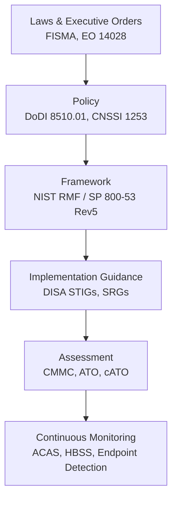
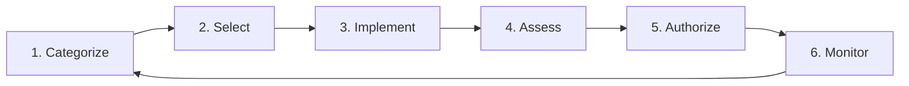
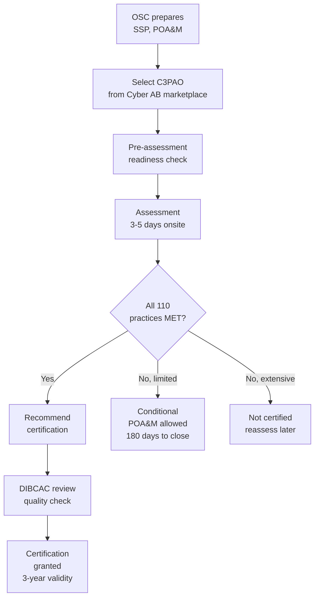

# DoD Cybersecurity — RMF, DISA STIGs & CMMC

**Category:** 26 — Defense & Military Standards  
**Document:** 08 — DoD Cybersecurity RMF DISA  
**Standard:** NIST SP 800-53 Rev5, DoDI 8510.01, CMMC 2.0, FIPS 140-3  
**Scope:** Cybersecurity framework for DoD information systems  
**Audience:** ISSEs, ISSMs, cybersecurity architects, defense contractors  
**Prerequisites:** Basic information security, networking fundamentals

---

## Chapter 1 — DoD Cybersecurity Architecture

### 1.1 Framework Stack

### 1.2 Key Authorities

| Authority | Role | Document |
|-----------|------|----------|
| DoD CIO | Policy oversight | DoDI 8510.01 |
| DISA (Defense Information Systems Agency) | STIGs, network infrastructure, SRGs | SRG/STIG library |
| NSA | Cryptographic standards, TEMPEST | Suite B, CNSS policies |
| NIST | Framework development | SP 800-53, 800-171, 800-37 |
| CYBERCOM | Operational cyber defense | OPORD, TASKORD |
| DCSA (Defense Counterintelligence & Security Agency) | Industrial security, CMMC oversight | NISPOM, CMMC |

---

## Chapter 2 — Risk Management Framework (RMF)

### 2.1 Six-Step Process (NIST SP 800-37 Rev2)

### 2.2 Step Details

| Step | Activity | Key Outputs | Tools/References |
|------|----------|-------------|-----------------|
| **1. Categorize** | Determine system impact level (C/I/A) | System categorization document | CNSSI 1253, FIPS 199 |
| **2. Select** | Choose security controls based on impact + overlays | Security control baseline + tailoring | NIST 800-53 Rev5, DISA SRG |
| **3. Implement** | Deploy and configure controls | System security plan, STIG compliance | DISA STIGs, hardening guides |
| **4. Assess** | Evaluate control effectiveness | Security Assessment Report (SAR) | SCA-V, ACAS scans, manual checks |
| **5. Authorize** | AO decision (accept risk or deny) | Authorization to Operate (ATO) | POA&M for residual risks |
| **6. Monitor** | Continuous monitoring of security posture | Ongoing reporting, alerts | ACAS, HBSS, SIEM, eMASS |

### 2.3 Impact Levels (CNSSI 1253)

| Confidentiality | Integrity | Availability | Example System |
|----------------|-----------|--------------|----------------|
| Low | Low | Low | Public website |
| Moderate | Moderate | Moderate | Unclassified C2 system |
| High | High | High | Weapons system, nuclear C3 |

### 2.4 Authorization Boundaries

| Concept | Description |
|---------|-------------|
| System boundary | Defines what hardware/software/networks are in the authorization |
| Interconnections | ISAs (Interconnection Security Agreements) for external systems |
| Inheritance | Controls inherited from hosting environment (cloud, enclave) |
| Common controls | Enterprise-level controls applied to multiple systems |
| Hybrid controls | Partially provided by system, partially inherited |

---

## Chapter 3 — NIST SP 800-53 Rev5 Control Families

### 3.1 Control Families

| ID | Family | # Controls | Example |
|----|--------|-----------|---------|
| AC | Access Control | 25 | AC-2 Account Management |
| AT | Awareness & Training | 6 | AT-2 Security Awareness Training |
| AU | Audit & Accountability | 16 | AU-2 Event Logging |
| CA | Assessment, Authorization | 9 | CA-6 Authorization |
| CM | Configuration Management | 14 | CM-6 Configuration Settings |
| CP | Contingency Planning | 13 | CP-10 System Recovery |
| IA | Identification & Authentication | 12 | IA-2 Multi-Factor Authentication |
| IR | Incident Response | 10 | IR-4 Incident Handling |
| MA | Maintenance | 7 | MA-4 Remote Maintenance |
| MP | Media Protection | 8 | MP-6 Media Sanitization |
| PE | Physical & Environmental | 23 | PE-3 Physical Access Control |
| PL | Planning | 11 | PL-2 System Security Plan |
| PM | Program Management | 32 | PM-9 Risk Management Strategy |
| PS | Personnel Security | 9 | PS-3 Personnel Screening |
| RA | Risk Assessment | 10 | RA-5 Vulnerability Scanning |
| SA | System & Services Acquisition | 23 | SA-11 Developer Security Testing |
| SC | System & Communications Protection | 51 | SC-8 Transmission Confidentiality |
| SI | System & Information Integrity | 23 | SI-2 Flaw Remediation |
| SR | Supply Chain Risk Management | 12 | SR-3 Supply Chain Controls |

### 3.2 Control Enhancements (DoD-Specific)

| Control | Base | DoD Enhancement |
|---------|------|-----------------|
| AC-2 | Account Management | (5) Automatic account disabling after 35 days inactivity |
| IA-2 | MFA | (1)(2) MFA for privileged AND non-privileged (CAC/PIV mandatory) |
| AU-2 | Event Logging | DoD requires specific event types per SRG |
| SC-13 | Cryptographic Protection | Must use NSA-approved algorithms (Suite B / CNSA) |
| SI-2 | Flaw Remediation | IAVMs: Critical (21 days), High (30 days) |

---

## Chapter 4 — DISA STIGs

### 4.1 STIG Overview

| Aspect | Detail |
|--------|--------|
| Definition | Security Technical Implementation Guide — detailed hardening checklist |
| Authority | DISA (Defense Information Systems Agency) |
| Format | XCCDF (Extensible Configuration Checklist Description Format) |
| Tooling | STIG Viewer (manual review), SCAP (automated scanning) |
| Finding categories | CAT I (Critical), CAT II (High), CAT III (Medium) |
| Release cycle | Quarterly updates |
| Scope | OS, applications, network devices, databases, containers, cloud |

### 4.2 Key STIGs

| STIG | Scope | Key Requirements |
|------|-------|-----------------|
| Windows Server 2022 | OS hardening | 300+ checks (account policy, audit, services) |
| Red Hat Enterprise Linux 8/9 | OS hardening | SELinux enforcing, FIPS mode, audit rules |
| Cisco IOS-XE | Network devices | AAA, encrypted management, ACLs |
| Oracle Database 19c | Database security | Encryption, audit, privilege controls |
| Apache/Tomcat | Web servers | TLS config, directory listing, error handling |
| Docker Enterprise | Container runtime | Image signing, namespace isolation |
| VMware vSphere | Virtualization | VM isolation, vCenter hardening |
| Windows 10/11 | Endpoint | Credential Guard, BitLocker, AppLocker |
| Microsoft 365 | Cloud applications | Conditional Access, DLP, retention |

### 4.3 STIG Finding Severity

| Category | Severity | Definition | Remediation Timeline |
|----------|----------|-----------|---------------------|
| CAT I | Critical | Direct risk of data loss or system compromise | Immediate (or within IAVM timeline) |
| CAT II | High | Degraded security posture, potential exploitation | 30 days |
| CAT III | Medium | Administrative weakness, defense-in-depth concern | 90 days |

### 4.4 SCAP Compliance Scanning

| Tool | Purpose |
|------|---------|
| DISA SCC (SCAP Compliance Checker) | Automated STIG compliance scanning |
| Nessus (ACAS) | Vulnerability + compliance scanning (DoD license) |
| OpenSCAP | Open-source SCAP scanner (RHEL native) |
| CIS-CAT | CIS Benchmark automated assessment |
| Ansible STIG roles | Automated remediation + compliance-as-code |

---

## Chapter 5 — CMMC 2.0

### 5.1 Level Structure

| Level | Name | # Practices | Assessment Type | Required For |
|-------|------|-------------|-----------------|--------------|
| **1** | Foundational | 17 (FAR 52.204-21) | Annual self-assessment | All DoD contracts with FCI |
| **2** | Advanced | 110 (NIST 800-171 Rev2) | C3PAO third-party (prioritized) or self-assessment (non-prioritized) | Contracts with CUI |
| **3** | Expert | 110 + additional (NIST 800-172) | Government-led (DIBCAC) | Highest-priority programs |

### 5.2 NIST 800-171 Rev2 — 14 Families (110 Practices)

| Family | # Practices | Key Requirement |
|--------|------------|-----------------|
| Access Control | 22 | Limit system access to authorized users |
| Awareness & Training | 3 | Security awareness training |
| Audit & Accountability | 9 | Create and protect audit records |
| Configuration Management | 9 | Baseline configurations, change control |
| Identification & Authentication | 11 | Authenticate users, MFA |
| Incident Response | 3 | Establish incident handling capability |
| Maintenance | 6 | Perform maintenance with controls |
| Media Protection | 9 | Protect and sanitize CUI media |
| Personnel Security | 2 | Screen individuals, protect CUI on termination |
| Physical Protection | 6 | Limit physical access to systems |
| Risk Assessment | 3 | Periodically assess risk, scan vulnerabilities |
| Security Assessment | 4 | Assess controls, POA&M |
| System & Communications Protection | 16 | Monitor communications, boundary protection |
| System & Information Integrity | 7 | Identify and correct flaws, monitor alerts |

### 5.3 CMMC Assessment Process

### 5.4 Scoring Methodology (NIST 800-171 DoD Assessment)

| Score | Meaning |
|-------|---------|
| 110 | All practices implemented (perfect) |
| 80-109 | Minor gaps, correctable |
| <80 | Significant deficiencies |
| -203 (minimum) | No practices implemented |

Each unimplemented practice deducts 1, 3, or 5 points based on criticality.

---

## Chapter 6 — Cryptographic Standards

### 6.1 FIPS 140-3

| Level | Physical Security | Key Management | Use Case |
|-------|-------------------|----------------|----------|
| 1 | No physical security beyond production-grade | Basic | Software crypto modules |
| 2 | Tamper-evident (seals, coatings) | Role-based authentication | Commercial hardware |
| 3 | Tamper-resistant (hard epoxy, active zeroize) | Identity-based authentication | Military/government |
| 4 | Tamper-active (self-destruct on penetration) | Multi-factor | Physically unprotected environments |

### 6.2 NSA Suite B / CNSA 2.0

| Algorithm | Suite B (2005) | CNSA 1.0 (2016) | CNSA 2.0 (2022, PQC transition) |
|-----------|---------------|-----------------|----------------------------------|
| Symmetric | AES-128/256 | AES-256 | AES-256 |
| Hash | SHA-256/384 | SHA-384 | SHA-384/512 |
| Public key (signing) | ECDSA P-256/P-384 | ECDSA P-384 / RSA-3072+ | CRYSTALS-Dilithium (ML-DSA) |
| Public key (key est.) | ECDH P-256/P-384 | ECDH P-384 / DH-3072+ | CRYSTALS-Kyber (ML-KEM) |
| Key exchange | — | — | ML-KEM-1024 |

### 6.3 NSA Type 1 vs. Commercial

| Attribute | Type 1 (NSA-approved) | Commercial (FIPS 140-3) |
|-----------|----------------------|------------------------|
| Classification | Up to TOP SECRET/SCI | Unclassified CUI only |
| Approval | NSA CSFC/Type 1 program | NIST CMVP |
| Key management | NSA EKMS (KOV-26, KYK-13) | Standard PKI/KMS |
| Examples | KG-175 TACLANE, KG-250 | Commercial VPN (FIPS mode) |
| Availability | Government only | Commercially available |

---

## Chapter 7 — Continuous Monitoring & Tools

### 7.1 DoD Cybersecurity Tools

| Tool | Function | Deployment |
|------|----------|-----------|
| ACAS (Assured Compliance Assessment Solution) | Vulnerability scanning (Nessus-based) | Network-wide |
| HBSS (Host-Based Security System) | Endpoint protection (McAfee/Trellix) | Every DoD endpoint |
| ESS (Endpoint Security Solutions) | Next-gen endpoint (replacing HBSS) | Migration ongoing |
| eMASS | Enterprise Mission Assurance Support Service (RMF tracking) | All DoD systems |
| SIEM (Splunk/ELK) | Log aggregation, correlation | SOC/NOSC |
| Comply-to-Connect (C2C) | Network access control (NAC) | Enterprise networks |
| SCAP tools | Automated compliance checking | Endpoints + servers |

### 7.2 Vulnerability Management (IAVM Process)

| Category | Timeline | Definition |
|----------|----------|-----------|
| IAVA (Information Assurance Vulnerability Alert) | 21 days (critical) | Immediate action required, critical vulnerability |
| IAVB (Information Assurance Vulnerability Bulletin) | 30 days | High severity, action required |
| IAVM Technical Advisory | Best effort | Informational, recommended action |
| BOD (Binding Operational Directive) | Per directive (CISA) | Mandatory for federal civilian (DoD aligns) |

---

## Chapter 8 — Zero Trust Architecture (DoD)

### 8.1 DoD Zero Trust Strategy (2022)

| Pillar | Components |
|--------|-----------|
| User | Identity, MFA, continuous authentication, behavioral analytics |
| Device | Device health, compliance, EDR, MDM |
| Network | Microsegmentation, encrypted transport, SDN |
| Application/Workload | Application security, container hardening, API protection |
| Data | Data classification, DLP, encryption at rest/transit |
| Visibility & Analytics | SIEM, SOAR, UEBA, threat intelligence |
| Automation & Orchestration | Automated response, SOAR playbooks |

### 8.2 Thunderdome (DISA Zero Trust Program)

| Aspect | Detail |
|--------|--------|
| Purpose | Implement ZTA across DoD enterprise |
| Components | ZTNA, SWG, CASB, SD-WAN (SASE architecture) |
| Vendor | Booz Allen (prime), with Zscaler, Appgate, Illumio |
| Timeline | Prototype 2023, incremental deployment 2024-2027 |
| Key change | Move from perimeter-based to identity/data-centric |

---

## Chapter 9 — Authorization Types

### 9.1 ATO Types

| Type | Full Name | Duration | Scope |
|------|-----------|----------|-------|
| ATO | Authorization to Operate | 3 years (standard) | Full authority to operate |
| IATT | Interim Authorization to Test | 6 months max | Testing/evaluation only |
| DATO | Denial of Authorization to Operate | N/A | System cannot operate |
| cATO | Continuous Authorization to Operate | Ongoing (no expiration) | Requires mature continuous monitoring |
| P-ATO | Provisional ATO (FedRAMP) | 3 years | Cloud service offering |

### 9.2 cATO (Continuous ATO)

| Requirement | Description |
|-------------|-------------|
| Real-time monitoring | SIEM, endpoint, network visibility |
| Automated compliance | Continuous STIG checking, drift detection |
| DevSecOps pipeline | Security integrated in CI/CD |
| Software Bill of Materials (SBOM) | Automated vulnerability tracking |
| Risk scoring | Quantitative risk dashboard for AO |
| Stakeholder agreement | AO, ISSM, system owner all agree to continuous model |
| Platform | Often DoD Platform One (Big Bang, Party Bus) |

---

## Chapter 10 — Interview Questions

### Entry-Level
1. Name the six steps of the Risk Management Framework (RMF).
2. What is a STIG and what tool is used to view STIG findings?
3. What are the three levels of CMMC 2.0?

### Mid-Level
1. Walk through the process of obtaining an ATO for a new weapons system on the NIPR network.
2. Explain the difference between CAT I, CAT II, and CAT III STIG findings and their remediation timelines.
3. How does NIST 800-53 Rev5 differ from NIST 800-171? When would you use each?

### Senior
1. Design a Zero Trust architecture for a tactical network that operates in DDIL (Denied, Degraded, Intermittent, Limited) environments.
2. Propose a cATO strategy for a DevSecOps platform hosting multiple mission applications. What telemetry and automation is required?
3. How would you implement FIPS 140-3 Level 3 cryptographic module requirements in a software-defined radio platform?

### Principal / CISO
1. How should DoD evolve its cybersecurity framework to address quantum computing threats to current cryptographic infrastructure?
2. Design a unified security architecture that spans SECRET, UNCLASSIFIED, and coalition networks with appropriate cross-domain solutions.
3. Propose a strategy for securing AI/ML pipelines in DoD systems where traditional ATO processes are too slow for model update cycles.

---

*Document Version: 1.0 | Last Updated: May 2026 | Author: Defense Standards Engineering Team*
