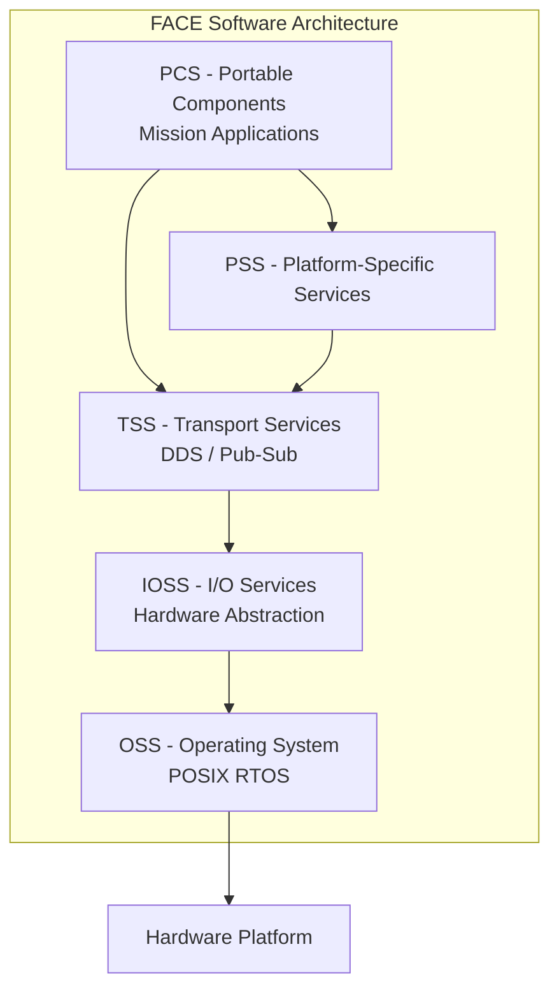
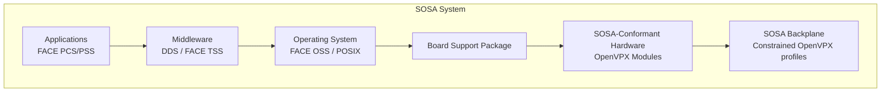

# FACE, MOSA & OpenVPX — Open Architecture for Defense Electronics

**Category:** 26 — Defense & Military Standards  
**Document:** 09 — FACE MOSA OpenVPX Architecture  
**Standard:** FACE Technical Standard v3.1, DoDI 5000.88 (MOSA), VITA 65 (OpenVPX), SOSA  
**Scope:** Modular open systems approach for military avionics, ground vehicles, naval systems  
**Audience:** Systems architects, embedded software engineers, defense acquisition professionals  
**Prerequisites:** Embedded systems architecture, real-time OS concepts, DoD acquisition

---

## Chapter 1 — Open Architecture Imperative

### 1.1 Problem Statement

| Traditional (Proprietary) | Open Architecture |
|--------------------------|-------------------|
| Vendor lock-in (single source) | Multiple suppliers compete |
| 20-30 year tech refresh impossible | Incremental modernization |
| $B cost overruns for integration | Standard interfaces reduce integration |
| Obsolescence drives full redesign | Swap components, keep interfaces |
| Interoperability by accident | Interoperability by design |

### 1.2 DoD Policy Framework

| Policy | Year | Mandate |
|--------|------|---------|
| DoDI 5000.88 | 2021 | Engineering of Defense Systems — requires MOSA |
| DoDI 5000.02 | 2020 | Adaptive Acquisition Framework — MOSA at Milestone B |
| Section 804 (2016 NDAA) | 2016 | Middle Tier Acquisition — rapid prototyping + fielding |
| Better Buying Power 3.0 | 2015 | Modular systems, open architectures |
| FACE Consortium | 2010 | Industry-government partnership for avionics portability |

---

## Chapter 2 — FACE (Future Airborne Capability Environment)

### 2.1 FACE Technical Standard v3.1 Overview

| Segment | Full Name | Purpose | Example |
|---------|-----------|---------|---------|
| **OSS** | Operating System Segment | POSIX-compliant RTOS | VxWorks, LynxOS, Integrity |
| **IOSS** | I/O Services Segment | Hardware abstraction for I/O | MIL-STD-1553, ARINC 429 drivers |
| **TSS** | Transport Services Segment | Data distribution middleware | DDS (Data Distribution Service) |
| **PSS** | Platform-Specific Services Segment | Platform-unique services | Sensor fusion, vehicle-specific |
| **PCS** | Portable Components Segment | Mission applications | Navigation, weapons mgmt, displays |

### 2.2 FACE Architecture



### 2.3 FACE Profiles (Capability Sets)

| Profile | OSS | TSS | Target |
|---------|-----|-----|--------|
| **Security** | Full POSIX, DO-178C DAL A-capable | Full DDS | Safety/security critical (weapons, flight) |
| **Safety Extended** | POSIX with safety extensions | Full DDS | DAL A/B applications |
| **Safety Base** | Minimal POSIX, deterministic | Simplified transport | Deeply embedded, hard real-time |
| **General Purpose** | Full POSIX (Linux allowed) | Full DDS | Mission planning, non-safety |

### 2.4 FACE Conformance

| Level | Description |
|-------|-------------|
| **FACE Conformant** | Verified by FACE Consortium test suite; listed in FACE registry |
| **FACE Aligned** | Follows FACE principles but not formally verified |
| **Not FACE** | Proprietary, non-conformant |

### 2.5 FACE Data Model

| Concept | Description |
|---------|-------------|
| USM (Unit of Portability) | Smallest independently deployable software unit |
| UoP (Unit of Portability) | A component conforming to FACE interfaces |
| Shared Data Model (SDM) | Common data dictionary for avionics (platform-independent) |
| TSS API | Standard API for publish/subscribe communication |
| IOSS API | Standard API for I/O device access |

---

## Chapter 3 — MOSA (Modular Open Systems Approach)

### 3.1 DoDI 5000.88 Requirements

| Requirement | Description |
|-------------|-------------|
| MOSA analysis | Required at every acquisition milestone |
| Key interfaces | Identify and document modular interfaces |
| Business case | Justify open vs. proprietary for each interface |
| Data rights | Government must have rights to interface specifications |
| Competition | MOSA must enable future competition at module level |
| Technical standards | Use consensus-based standards where available |

### 3.2 MOSA Principles

| Principle | Description | Implementation |
|-----------|-------------|---------------|
| **Modularity** | System decomposed into discrete functional modules | Well-defined boundaries |
| **Open interfaces** | Published, consensus-based interface standards | FACE, VICTORY, GVA, MORA |
| **Interoperability** | Modules from different vendors work together | Standard data models |
| **Upgradability** | Technology refresh without full redesign | Hot-swap capable |
| **Competition** | Multiple sources possible at module level | Government owns interface specs |
| **Reuse** | Components usable across programs | Common components catalog |

### 3.3 Domain-Specific Open Architecture Standards

| Domain | Standard | Scope |
|--------|----------|-------|
| Airborne | FACE | Avionics software portability |
| Ground vehicles | VICTORY (Vehicular Integration for C4ISR/EW Interoperability) | Ground vehicle electronics |
| Naval | NOSA (Navy Open Systems Architecture) | Shipboard systems |
| UK ground | GVA (Generic Vehicle Architecture) | DEF STAN 23-009 |
| Sensors | MORA (Modular Open RF Architecture) | Radar/EW systems |
| Missile defense | MBSE + MOSA (MDA architecture) | BMD system integration |

---

## Chapter 4 — OpenVPX (VITA 65)

### 4.1 OpenVPX Overview

| Aspect | Detail |
|--------|--------|
| Standard | VITA 65 (OpenVPX) |
| Organization | VITA (VMEbus International Trade Association) |
| Purpose | Standard module/backplane profiles for rugged embedded computing |
| Form factor | 3U and 6U VPX modules |
| Bus | High-speed serial switched fabric (PCIe, 10GbE, InfiniBand, RapidIO) |
| Predecessor | VME (VITA 1) — parallel bus, obsolescent |
| Key advantage | Multi-Gbps data rates, standard pinout profiles |

### 4.2 VPX Module Sizes

| Size | Dimensions | Typical Use |
|------|-----------|------------|
| 3U VPX | 100mm × 160mm | SWaP-constrained (UAVs, pods, missiles) |
| 6U VPX | 233mm × 160mm | Full capability (ground, naval, large air) |
| VITA 74 (VNX) | Smaller than 3U | Extreme SWaP (nano-UAV, soldier-carried) |

### 4.3 OpenVPX Slot Profiles

| Profile Type | Description | Example |
|-------------|-------------|---------|
| Payload | Processing module (SBC, FPGA, GPU) | Intel Xeon or Xilinx FPGA card |
| Switch | Network fabric switch | 10GbE / PCIe Gen4 switch |
| I/O | Sensor interface or communication | MIL-STD-1553, ARINC 429, RF digitizer |
| Storage | Mass storage | NVMe SSD RAID array |
| Graphics | Display processing | GPU for tactical displays |

### 4.4 Backplane Topologies

| Topology | Description | Use Case |
|----------|-------------|----------|
| Central switch | Star topology via central switch slot | General purpose compute |
| Distributed | Peer-to-peer mesh between slots | Low-latency signal processing |
| Hybrid | Switch + direct peer connections | Radar processing + C2 |
| Pipeline | Slots connected in serial pipeline | Signal processing chain |

### 4.5 Key VITA Standards (VPX Ecosystem)

| Standard | Title | Function |
|----------|-------|----------|
| VITA 46 | VPX Base Standard | Module mechanical/electrical |
| VITA 48 | Air and Liquid Cooling | Thermal management (VPX-REDI) |
| VITA 65 | OpenVPX | System-level profiles |
| VITA 66 | Optical interconnect | Fiber optic backplane |
| VITA 67 | RF/Coaxial connector | RF signals through backplane |
| VITA 68 | Compliance test | Connector signal integrity |
| VITA 73 | Ruggedized small form factor | Extreme environment |

---

## Chapter 5 — SOSA (Sensor Open Systems Architecture)

### 5.1 SOSA Technical Standard

| Aspect | Detail |
|--------|--------|
| Organization | The Open Group SOSA Consortium |
| Purpose | Constrain OpenVPX profiles for DoD interoperability |
| Relationship to OpenVPX | SOSA selects specific OpenVPX profiles (subset) |
| Key addition | Software API standards layered on hardware profiles |
| Conformance | SOSA Conformant products tested and registered |

### 5.2 SOSA vs. OpenVPX

| Attribute | OpenVPX (VITA 65) | SOSA |
|-----------|-------------------|------|
| Scope | Hardware profiles (mechanical, electrical, backplane) | Hardware + software + security |
| Flexibility | Many possible configurations | Constrained subset for interoperability |
| Conformance testing | VITA 65 compliance | SOSA conformance (more rigorous) |
| Software | Not specified | Specifies OS APIs, middleware (FACE alignment) |
| Security | Not specified | Trusted boot, hardware root of trust |

### 5.3 SOSA Reference Architecture



---

## Chapter 6 — OMS/UCI (Open Mission Systems / Universal C2 Interface)

### 6.1 OMS Overview

| Aspect | Detail |
|--------|--------|
| Origin | US Air Force Research Lab (AFRL) |
| Purpose | Standard interface for mission systems integration |
| Scope | Avionics, weapons, sensors, C2 on airborne platforms |
| Architecture | Service-oriented (SOA) with publish/subscribe |
| Key interface | UCI (Universal Command & Control Interface) |
| Data format | XML-based message definitions |
| Transport | DDS (Data Distribution Service) preferred |

### 6.2 UCI Service Categories

| Category | Services | Example |
|----------|----------|---------|
| Platform | Navigation, flight data, stores management | GPS position, weapons status |
| Sensor | Radar, EO/IR, EW | Radar tracks, imagery |
| Communication | Data links, radio management | Link 16, SATCOM |
| Weapons | Weapon employment, BDA | Targeting, launch authorization |
| Mission | Route planning, threat assessment | Mission computer services |

---

## Chapter 7 — VICTORY (Ground Vehicle Open Architecture)

### 7.1 VICTORY Architecture

| Aspect | Detail |
|--------|--------|
| Full name | Vehicular Integration for C4ISR/EW Interoperability |
| Scope | US Army ground vehicle electronics |
| Purpose | Common architecture for vehicle electronics (radios, sensors, displays) |
| Key interface | VICTORY Data Bus (Ethernet-based) |
| Middleware | DDS for publish/subscribe |
| Platform | Stryker, Bradley, JLTV, AMPV integration target |

### 7.2 VICTORY Services

| Service | Function |
|---------|----------|
| Platform Service | Vehicle power, thermal, position |
| Network Transport | Data routing between components |
| Data Management | Common operational picture (COP) |
| C4ISR Service | Radio, intercom, blue force tracking |
| Sensor Service | Situational awareness sensors |

---

## Chapter 8 — Integration Challenges

### 8.1 Common MOSA Implementation Issues

| Challenge | Root Cause | Mitigation |
|-----------|-----------|-----------|
| Latency overhead from middleware | DDS discovery + serialization | Profile DDS QoS, preallocate |
| Incomplete standard (gaps) | Standards don't cover all interfaces | PSS layer for platform-specific |
| Vendor interpretation differences | Ambiguity in standards | Conformance testing, SOSA registration |
| SWaP constraints | Open architecture adds overhead (software layers) | Hardware acceleration, optimized middleware |
| Security certification | Layered architecture complicates CC/RMF | Compositional assurance, common criteria |
| Legacy integration | Existing systems don't have open interfaces | Wrapper/adapter pattern at boundary |
| Data model mismatch | Different systems use different data dictionaries | FACE SDM, translation services |

### 8.2 FACE/SOSA Adoption Status (2025)

| Program | Standard | Status |
|---------|----------|--------|
| F-35 (TR3/Block 4) | FACE-aligned | Partial adoption in mission computing |
| Future Vertical Lift (FVL) | FACE + MOSA mandatory | Full FACE conformance required |
| AMPV (Armored Multi-Purpose Vehicle) | VICTORY + SOSA | Open architecture computing |
| DDG-51 Flight III | Navy NOSA | Open architecture combat system |
| B-21 Raider | MOSA (specific details classified) | Open architecture by design |
| JADC2 (Joint All-Domain C2) | OMS/UCI + FACE | Interoperability across domains |

---

## Chapter 9 — Design Patterns

### 9.1 FACE Component Pattern (C++)

```cpp
// FACE TSS Publisher (simplified example)
#include <FACE/TSS/DataWriter.h>
#include <FACE/Common/Types.h>

class NavigationPublisher {
public:
    FACE::RETURN_CODE_TYPE initialize() {
        FACE::TSS::CONNECTION_ID_TYPE connId;
        FACE::RETURN_CODE_TYPE status;
        
        // Create connection using FACE TSS API
        FACE::TSS::Create_Connection(
            "NavData_Pub",           // connection name
            FACE::TSS::PUB,          // pub/sub direction  
            connId,                  // returned connection ID
            status                   // return code
        );
        return status;
    }
    
    void publish(const NavigationData& navData) {
        FACE::RETURN_CODE_TYPE status;
        FACE::TSS::Send_Message(
            connectionId_,
            sizeof(NavigationData),
            &navData,
            status
        );
    }
    
private:
    FACE::TSS::CONNECTION_ID_TYPE connectionId_;
};
```

### 9.2 VPX Backplane Configuration (Conceptual)

```
Slot 1: Switch (10GbE + PCIe Gen4)
Slot 2: SBC (Intel Xeon D-2700, 64GB DDR5)  
Slot 3: FPGA (Xilinx Versal AI Core)
Slot 4: GPU (NVIDIA A100 rugged variant)
Slot 5: Storage (2TB NVMe RAID-1)
Slot 6: I/O (MIL-STD-1553 + ARINC 429 + Ethernet)
Slot 7: RF (ADC/DAC for sensor digitization)
Backplane: SOSA-aligned profiles, 10GbE data plane + PCIe control
```

---

## Chapter 10 — Interview Questions

### Entry-Level
1. What does FACE stand for and what problem does it solve?
2. Name the five segments of the FACE architecture.
3. What is OpenVPX and how does it differ from legacy VME?

### Mid-Level
1. Explain the relationship between SOSA and OpenVPX. Why does SOSA constrain OpenVPX profiles?
2. Design a FACE-conformant software architecture for a navigation system that must publish position data to multiple subscribers.
3. Compare FACE TSS to commercial DDS implementations. What constraints does FACE add?

### Senior
1. Propose a migration strategy for a legacy avionics system (Ada, MIL-STD-1553, federated architecture) to FACE-conformant modular architecture.
2. How would you architect a SOSA-conformant electronic warfare system that requires sub-microsecond latency for threat response?
3. Design a verification strategy that demonstrates MOSA compliance per DoDI 5000.88 at Milestone B.

### Principal / Chief Architect
1. How should the DoD balance open architecture (MOSA) requirements with the need for technological superiority (proprietary innovation)?
2. Propose an evolution of FACE/SOSA to support AI/ML workloads with GPU/NPU acceleration while maintaining real-time determinism.
3. Design a JADC2-compliant architecture that integrates FACE (air), VICTORY (ground), and Navy NOSA (maritime) into a unified data fabric.

---

*Document Version: 1.0 | Last Updated: May 2026 | Author: Defense Standards Engineering Team*
