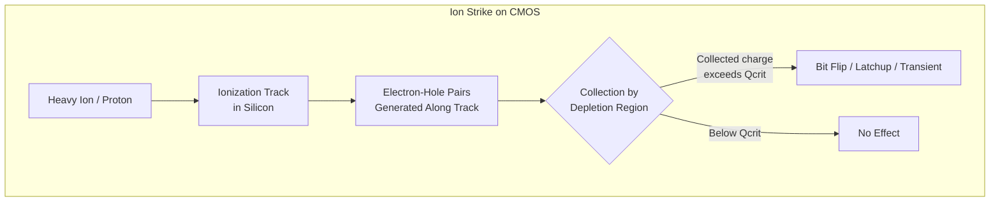

# Radiation Hardening for Space & Defense Electronics

**Category:** 26 — Defense & Military Standards  
**Document:** 10 — Radiation Hardening Space Defense  
**Standard:** MIL-PRF-38535 (RHA), JEDEC JESD89, ESA ECSS-E-HB-10-12A  
**Scope:** Radiation effects, hardening techniques, testing for space/military/nuclear  
**Audience:** Radiation effects engineers, ASIC/FPGA designers, mission assurance engineers  
**Prerequisites:** Semiconductor physics, digital/analog IC design, orbital mechanics

---

## Chapter 1 — Radiation Environments

### 1.1 Space Radiation Sources

| Source | Particles | Energy | Flux | Primary Concern |
|--------|-----------|--------|------|-----------------|
| **Trapped Radiation (Van Allen Belts)** | Protons (inner belt), Electrons (outer belt) | 100 keV – 400 MeV (protons) | Continuous, orbit-dependent | TID, displacement damage |
| **Galactic Cosmic Rays (GCR)** | Heavy ions (all elements, Fe peak) | 100 MeV – 10 GeV/nucleon | ~4 particles/cm²/s (solar min) | SEE (especially SEL) |
| **Solar Particle Events (SPE)** | Protons, some heavy ions | 10 MeV – several GeV | Sporadic, intense (10⁴–10⁶ p/cm²/s) | SEE + TID burst |
| **Secondary Neutrons** | Neutrons from nuclear interactions | Thermal to 100+ MeV | Altitude/shielding dependent | SEU in avionics (aircraft) |

### 1.2 Orbit Dependence

| Orbit | Altitude | TID (typical/year, Si) | SEE Concern | Notes |
|-------|----------|----------------------|-------------|-------|
| LEO (low inclination) | 400-600 km | 1-5 krad | Moderate (SAA protons) | ISS orbit |
| LEO (polar/SSO) | 600-800 km | 5-20 krad | Higher (polar GCR) | Earth observation |
| MEO | 2,000-35,000 km | 50-200 krad | High (belt crossing) | GPS constellation |
| GEO | 35,786 km | 10-30 krad | High (GCR, SPE) | Communications satellites |
| HEO (Molniya) | Perigee 500, Apogee 40,000 km | 50-100 krad | Very high (belt transit) | Russian comms |
| Interplanetary | Beyond magnetosphere | Varies (solar distance) | Very high (unshielded GCR) | Mars missions |

### 1.3 Nuclear Weapon Effects (Military)

| Effect | Mechanism | Timescale | Consequence |
|--------|-----------|-----------|-------------|
| Prompt gamma | Intense gamma burst | Nanoseconds | Dose-rate upset, latchup, burnout |
| X-ray | Thermal X-ray pulse | Microseconds | Surface heating, charge injection |
| Neutron fluence | Fast neutrons | Microseconds-seconds | Displacement damage, activation |
| EMP (HEMP) | Compton electrons in atmosphere | Nanoseconds (E1), Seconds (E3) | Cable/antenna coupling, power grid |
| System Generated EMP (SGEMP) | X-ray on spacecraft surfaces | Nanoseconds | Internal charge injection in space systems |

---

## Chapter 2 — Radiation Effects in Semiconductors

### 2.1 Total Ionizing Dose (TID)

| Effect | Mechanism | Consequence in CMOS |
|--------|-----------|-------------------|
| Oxide trapped charge | Electron-hole pairs in SiO₂; holes trapped at interface | Vt shift (NMOS → more negative, PMOS → more positive) |
| Interface traps | Broken Si-SiO₂ bonds | Increased leakage, mobility degradation |
| Increased leakage | Parasitic transistor activation (field oxide) | IDDQ increase, functional failure at high dose |
| Timing degradation | Reduced drive strength from Vt shift | Frequency reduction, setup/hold violations |
| Rebound/Recovery | Annealing of trapped charge (vs. interface traps) | Partial recovery at room temperature |

### 2.2 Single Event Effects (SEE) Mechanisms

### 2.3 SEE Types Detail

| Effect | Abbreviation | Mechanism | Destructive? | Recovery |
|--------|-------------|-----------|-------------|----------|
| Single Event Upset | SEU | Ion flips stored bit (SRAM, FF) | No | Write correct value |
| Multiple Bit Upset | MBU | Single ion upsets adjacent bits | No | ECC correction (if designed) |
| Single Event Latchup | SEL | Ion triggers PNPN thyristor | Potentially (thermal) | Power cycle required |
| Single Event Burnout | SEB | Ion triggers second breakdown in power MOSFET | Yes | Device destroyed |
| Single Event Gate Rupture | SEGR | Ion causes oxide breakdown in power MOSFET | Yes | Device destroyed |
| Single Event Transient | SET | Ion generates current pulse in analog circuit | No (usually) | Transient passes |
| Single Event Functional Interrupt | SEFI | Ion disrupts control/config logic | No | Device reset required |
| Single Event Dielectric Rupture | SEDR | Ion ruptures thin gate oxide | Yes | Permanent damage |

### 2.4 Key Metrics

| Metric | Definition | Units |
|--------|-----------|-------|
| LET (Linear Energy Transfer) | Energy deposited per unit path length in material | MeV-cm²/mg |
| LET_th (Threshold LET) | Minimum LET to cause SEE | MeV-cm²/mg |
| σ (Cross-section) | Probability of SEE per unit fluence | cm²/device or cm²/bit |
| σ_sat (Saturated cross-section) | Maximum cross-section at high LET | cm²/device |
| Q_crit (Critical charge) | Minimum charge to flip a bit | fC |
| FIT (Failure in Time) | Failures per 10⁹ device-hours | FIT |
| SEU rate | Predicted upset rate in orbit | upsets/device/day |

---

## Chapter 3 — Enhanced Low Dose Rate Sensitivity (ELDRS)

### 3.1 ELDRS Overview

| Aspect | Detail |
|--------|--------|
| Definition | Greater degradation at LOW dose rates than HIGH dose rates |
| Affected technologies | Bipolar (BJT), BiCMOS, some linear CMOS |
| Mechanism | Space charge effects at low dose rates allow more interface trap buildup |
| Discovery | 1991 (JPL research on LM139 comparators) |
| Significance | Standard TID test (high dose rate) UNDERESTIMATES space degradation |
| Testing requirement | MIL-STD-883 Method 1019.9 requires low-dose-rate testing (≤10 mrad/s) |

### 3.2 ELDRS-Susceptible Device Types

| Device Type | Examples | ELDRS Concern |
|-------------|---------|---------------|
| Bipolar op-amps | LM124, LM324, OP-07 | Input bias current, offset voltage |
| Comparators | LM139, LM339 | Switching threshold shift |
| Voltage regulators | LM117, LM2940 | Output voltage drift |
| Voltage references | LM4040, AD584 | Reference voltage shift |
| Bipolar transistors | 2N2222, 2N2907 | hFE degradation |
| Optocouplers | Various | CTR (Current Transfer Ratio) degradation |

### 3.3 Testing Approaches

| Method | Dose Rate | Duration (100 krad) | Validity |
|--------|-----------|---------------------|----------|
| Standard TID | 50-300 rad/s | ~6-30 minutes | May overestimate hardness |
| True LDRS (space-like) | 1-10 mrad/s | 115-1157 days | Most accurate; impractical for qualification |
| Accelerated ELDRS | 10 mrad/s at 100°C | 3-4 months | Accepted alternative (with validation) |
| 1.5× overtest at high rate | 50 rad/s to 1.5× spec dose | Hours | Conservative screen (not always sufficient) |

---

## Chapter 4 — Hardening Techniques

### 4.1 Hardening by Design (HBD)

| Technique | Target Effect | Mechanism | Penalty |
|-----------|--------------|-----------|---------|
| **Enclosed layout (ELT)** | TID leakage | Annular gate eliminates parasitic edge transistor | 2-3× area increase |
| **Guard rings** | SEL | N+ and P+ rings around wells collect latchup current | Area + capacitance |
| **Triple Modular Redundancy (TMR)** | SEU | Three copies + majority voter | 3× area, 3× power, slight delay |
| **Dual Interlocked Storage Cell (DICE)** | SEU | Cross-coupled redundant nodes | 2× area, limited to single-node upset |
| **Temporal redundancy** | SET | Sample signal multiple times with delay | Latency increase |
| **Error Detection & Correction (EDAC)** | SEU (memory) | Hamming/BCH/Reed-Solomon codes | Area for check bits + encode/decode logic |
| **SOI (Silicon on Insulator)** | SEL, TID | Buried oxide isolates transistors; smaller collection volume | Process cost, floating body effects |
| **Hardened library cells** | TID + SEU | Custom cell design with all HBD techniques | Area, power, limited selection |

### 4.2 Hardening by Process (HBP)

| Technique | Effect Addressed | Mechanism |
|-----------|-----------------|-----------|
| Thin gate oxide | TID | Less charge trapping volume |
| Shallow Trench Isolation (STI) optimization | TID leakage | Reduced radiation-induced leakage current (RILC) |
| Retrograde wells | SEL | Reduced parasitic gain of PNPN structure |
| Epitaxial (epi) substrate | SEL | Thin epi reduces charge collection depth |
| SOI substrate | SEL + SEU | Complete isolation, small collection volume |
| SiGe BiCMOS | ELDRS | Improved radiation response vs. bulk Si bipolar |

### 4.3 System-Level Hardening

| Technique | Scope | Application |
|-----------|-------|-------------|
| Shielding (Al, Ta, W) | TID reduction | Spacecraft structure provides some shielding |
| Spot shielding | TID for sensitive parts | Tungsten/copper shields around critical ICs |
| Current limiting | SEL | Current-limited power supplies (< destructive level) |
| Watchdog timer | SEFI | Reset system if no heartbeat |
| Scrubbing (FPGA) | SEU in configuration | Periodically rewrite FPGA bitstream |
| Checkpoint/rollback | SEU in processor | Save state, detect error, restore |
| Cold sparing | SEL/SEB destruction | Redundant spare activated on failure |

---

## Chapter 5 — Radiation Testing

### 5.1 TID Testing (Co-60)

| Parameter | Requirement (MIL-STD-883 TM 1019) |
|-----------|-----------------------------------|
| Source | Co-60 gamma (1.17 + 1.33 MeV photons) |
| Dose rate | 50-300 rad(Si)/s (standard); ≤10 mrad(Si)/s (ELDRS) |
| Bias | Worst-case (typically all pins at supply or ground) |
| Temperature | 25°C ± 6°C |
| Dosimetry | TLDs (thermoluminescent dosimeters) calibrated to ±10% |
| Dose steps | Test at 50%, 100% of spec dose (minimum) |
| Post-irradiation | Electrical test within 1 hour; optional room-temp anneal |
| Sample size | Minimum 10 devices per lot (qualification) |

### 5.2 Heavy Ion SEE Testing

| Parameter | Typical Requirement |
|-----------|---------------------|
| Facility | Cyclotron (TAMU, BNL, GANIL, UCL) |
| Ions | Range of LET (e.g., Ne, Ar, Kr, Xe to cover 1-80 MeV-cm²/mg) |
| LET range | 1 to 60+ MeV-cm²/mg (surface LET) |
| Beam energy | Sufficient to penetrate device (>40 μm range in Si) |
| Fluence | 10⁷ ions/cm² per run (minimum for statistics) |
| Angle tilting | 0°, 30°, 45°, 60° to increase effective LET |
| Temperature | Room temperature (or elevated for latchup) |
| Monitoring | Current (latchup), bit errors (SEU), function (SEFI) |
| Output | Cross-section vs. LET curve (Weibull fit) |

### 5.3 Proton SEE Testing

| Parameter | Typical Requirement |
|-----------|---------------------|
| Facility | Proton cyclotron (Indiana, TRIUMF, PSI) |
| Energy range | 30-200 MeV (space environment representative) |
| Mechanism | Nuclear reactions produce secondary ions (indirect SEE) |
| Fluence | 10¹⁰-10¹² protons/cm² per energy point |
| Output | Cross-section vs. proton energy |
| Significance | Dominant SEE source in inner Van Allen belt (LEO) |

### 5.4 Displacement Damage Testing

| Parameter | Detail |
|-----------|--------|
| Source | Proton beam, neutron reactor, or Co-60 (electrons for DD) |
| Unit | Non-Ionizing Energy Loss (NIEL) → equivalent 1 MeV neutron fluence |
| Affected devices | Solar cells, CCDs/CMOS image sensors, BJTs, LEDs, laser diodes |
| Effect | Reduced minority carrier lifetime → lower gain, increased dark current |
| Testing | Irradiate, measure parametric shift (hFE, dark current, efficiency) |

---

## Chapter 6 — SEE Rate Prediction

### 6.1 Rate Calculation Methodology

| Step | Action | Tool |
|------|--------|------|
| 1 | Obtain device cross-section vs. LET curve | Heavy ion test data |
| 2 | Characterize environment (orbit, shielding) | CREME96, OMERE, SPENVIS |
| 3 | Integrate σ(LET) × environment LET spectrum | CREME96 UPSET module |
| 4 | Add proton-induced SEE contribution | Proton test data + trapped proton model |
| 5 | Calculate device-level rate (upsets/day) | Sum heavy ion + proton contributions |
| 6 | Determine system-level impact | Multiply by number of devices, add mitigation factors |

### 6.2 Environment Models

| Model | Scope | Organization |
|-------|-------|-------------|
| AP8/AP9 | Trapped protons | NASA/AFRL |
| AE8/AE9 | Trapped electrons | NASA/AFRL |
| CREME96/CREME-MC | GCR heavy ion environment | NRL |
| ESP (Emission of Solar Protons) | Solar proton event model | JPL |
| SPENVIS | Integrated space environment tool | ESA |
| OMERE | French space environment tool | CNES/TRAD |

---

## Chapter 7 — FPGA-Specific Radiation Concerns

### 7.1 SRAM-Based FPGA (Xilinx/AMD, Intel/Altera)

| Concern | Mechanism | Mitigation |
|---------|-----------|-----------|
| Configuration memory SEU | Bit flip in configuration SRAM changes routing/logic | Scrubbing (internal or external) |
| Block RAM SEU | User data memory upset | EDAC (Hamming or TMR) |
| Logic SEU | User flip-flop upset | TMR with voting |
| SEL | Latchup in I/O or core | Current limiting, power cycling |
| SEFI | Upset in global control (clock, reset) | Watchdog, full reconfiguration |

### 7.2 Flash-Based FPGA (Microchip/Microsemi)

| Advantage | Detail |
|-----------|--------|
| No configuration SEU | Flash cells immune to single-ion upset (high Qcrit) |
| Lower SEL risk | Non-volatile configuration doesn't require SRAM |
| Instant-on | No boot/configuration time |
| Radiation tolerance | Inherently more tolerant (RT ProASIC3, RTG4) |
| Limitation | Accumulated TID can degrade flash cells over mission life |

### 7.3 Antifuse FPGA (Legacy Actel)

| Advantage | Detail |
|-----------|--------|
| Permanently programmed | Configuration immune to radiation |
| Highest reliability | No SEU in configuration |
| Limitation | One-time programmable, smaller capacity, obsolescent |

---

## Chapter 8 — Space-Grade Component Selection

### 8.1 Selection Criteria

| Factor | Consideration |
|--------|---------------|
| TID requirement | Orbit dose + margin (×2 RDM typical) |
| SEE susceptibility | LET threshold > mission environment LET |
| SEL immunity | LETth > 75 MeV-cm²/mg preferred (or SEL-free) |
| ELDRS | Test at low dose rate for bipolar devices |
| Temperature range | -55 to +125°C (MIL) or custom for space thermal cycling |
| Quality level | MIL-PRF-38535 Level V (space) preferred |
| Heritage | Previously flown components reduce risk |
| Availability | Lead time for rad-hard parts (12-18+ months) |
| Obsolescence | Assess long-term availability for multi-year programs |
| Cost | Rad-hard parts 10-1000× commercial equivalent |

### 8.2 Radiation Design Margin (RDM)

| Standard | Required RDM | Meaning |
|----------|-------------|---------|
| MIL-HDBK-814 | 2× (TID) | Part must survive 2× predicted mission dose |
| ECSS-E-HB-10-12A (ESA) | 2× (with lot qualification) | Same principle |
| NASA EEE-INST-002 | Context-dependent | Based on part characterization data quality |
| Typical SEE | Must demonstrate no destructive SEE to max environment LET | Plus 25% LET margin |

---

## Chapter 9 — Notable Radiation Incidents

| Mission/System | Year | Effect | Consequence |
|----------------|------|--------|-------------|
| Hubble Space Telescope | 1993+ | SEU in 486 processor | Periodic safe-mode entries |
| Mars Pathfinder | 1997 | Priority inversion (not radiation, but system design) | Temporary loss of contact |
| Toyota unintended acceleration | 2009-2010 | Investigated for SEU (not confirmed sole cause) | Major recall, NASA investigation |
| Galaxy 15 "Zombiesat" | 2010 | SEE caused loss of command reception | Satellite drifted uncontrolled for months |
| INTEGRAL (ESA) | 2014 | SPE caused multiple SEU | Temporary safe mode during solar event |
| Avionics SEU (commercial) | Ongoing | Neutron-induced SEU at altitude | Estimated 1 event/1000 flight hours (fleet-wide) |

---

## Chapter 10 — Interview Questions

### Entry-Level
1. Name three types of radiation effects on semiconductors.
2. What is the difference between TID and SEE?
3. What is LET and why is it important for SEE characterization?

### Mid-Level
1. Explain the difference between SEU and SEL. Why is SEL more dangerous?
2. Design a TMR-protected register file for a space processor. What are the area and timing costs?
3. What is ELDRS and which device types are susceptible? How do you test for it?

### Senior
1. Design a complete radiation hardness assurance program for a GEO communication satellite with a 15-year mission life. Address TID, SEE, and displacement damage.
2. Compare SRAM-based vs. flash-based FPGAs for a LEO earth observation mission. Propose the scrubbing strategy for the SRAM option.
3. You've discovered that a qualified rad-hard part has an ELDRS sensitivity not covered in the original qualification. Propose a mitigation and requalification approach.

### Principal / Chief Engineer
1. How should the space industry adapt qualification approaches for advanced commercial semiconductor nodes (5nm/3nm) that have never been radiation-characterized?
2. Design a heterogeneous computing architecture (CPU + FPGA + GPU) for a deep-space probe that must survive 300 krad TID and LET > 75 MeV-cm²/mg SEE environment.
3. Propose a framework for using commercial NewSpace (SpaceX, OneWeb) approach to radiation tolerance (large constellations, graceful degradation) vs. traditional exquisite spacecraft hardening.

---

*Document Version: 1.0 | Last Updated: May 2026 | Author: Defense Standards Engineering Team*
