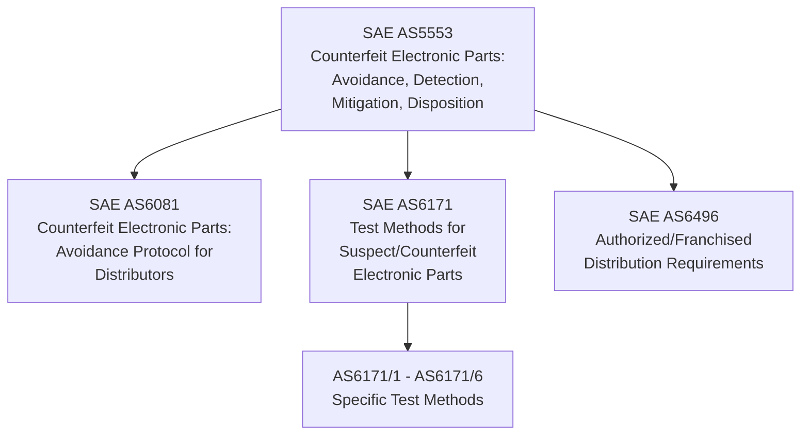
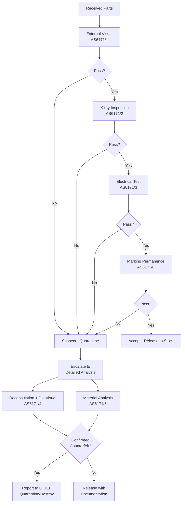

# Counterfeit Parts Prevention — SAE AS6081/AS5553/AS6171

**Category:** 26 — Defense & Military Standards  
**Document:** 11 — Counterfeit Parts AS6081  
**Standard:** SAE AS5553, AS6081, AS6171, DFARS 252.246-7007/7008  
**Scope:** Detection, avoidance, and reporting of counterfeit electronic parts in defense supply chains  
**Audience:** Quality engineers, procurement specialists, component engineers, program managers  
**Prerequisites:** Electronic component basics, supply chain management, MIL-PRF-38535

---

## Chapter 1 — Counterfeit Parts Crisis

### 1.1 Scale of the Problem

| Statistic | Source | Year |
|-----------|--------|------|
| 1 million+ suspected counterfeit parts in DoD supply chain | SASC Report | 2012 |
| $7.5 billion annual losses (global electronics counterfeiting) | IHS Markit | 2020 |
| 70% of counterfeits traced to China | SASC Investigation | 2012 |
| ~15,000 counterfeit incidents reported to GIDEP (cumulative) | GIDEP database | 2023 |
| 39% of companies encountered counterfeits | IPC Survey | 2021 |

### 1.2 Types of Counterfeit Parts

| Type | Description | Detection Difficulty |
|------|-------------|---------------------|
| **Recycled** | Used parts pulled from scrap PCBs, cleaned, re-marked | Moderate (sanding marks, solder residue) |
| **Remarked** | Lower-grade part re-labeled as higher-grade (e.g., commercial → MIL) | Moderate (marking tests) |
| **Overproduced** | Unauthorized production by contract manufacturer | Very Difficult (identical to genuine) |
| **Cloned** | Reverse-engineered copy (different manufacturer) | Difficult (may pass functional test) |
| **Defective/rejected** | Parts failing factory QC sold as good | Difficult (marginal parameters) |
| **Tampered** | Genuine parts with malicious hardware modification (trojan) | Extremely Difficult |
| **Forged documentation** | Genuine parts with falsified traceability/CoC | Moderate (document verification) |

### 1.3 Notable Counterfeit Incidents

| Incident | Year | Impact |
|----------|------|--------|
| P-8A Poseidon ice detection module | 2010 | Counterfeit memory ICs found in maritime patrol aircraft |
| THAAD missile defense | 2011 | Suspected counterfeit transistors in missile system |
| C-130 Hercules display units | 2012 | Counterfeit ICs in aircraft displays |
| SH-60 helicopter assemblies | 2012 | Multiple counterfeit components discovered |
| FLIR thermal systems | 2013 | Counterfeit capacitors caused field failures |
| Nuclear submarine controllers | 2014 | Counterfeit Chinese chips in Virginia-class sub systems |
| F-15 TEWS (Tactical EW System) | 2012 | Recycled parts re-marked as MIL-grade |

---

## Chapter 2 — SAE Standards Framework

### 2.1 Standard Relationship

### 2.2 SAE AS5553 Rev C — Counterfeit Electronic Parts Avoidance

| Section | Requirement |
|---------|-------------|
| Scope | Requirements for enterprises to mitigate risk of counterfeit parts |
| Applicability | Manufacturers, distributors, assemblers, repair facilities |
| Quality Management | Counterfeit parts prevention plan required |
| Procurement | Authorized sources preferred; risk assessment for non-authorized |
| Traceability | Full supply chain documentation from OCM/OEM |
| Reporting | Report suspected counterfeits to GIDEP and ERAI |
| Training | Personnel awareness training on counterfeits |
| Flow-down | Requirements flow to all sub-tier suppliers |

### 2.3 SAE AS6081 Rev A — Distributor Requirements

| Requirement | Description |
|-------------|-------------|
| Scope | Independent distributors and brokers of electronic parts |
| Supplier qualification | Audit and approve all sources |
| Incoming inspection | Risk-based inspection and testing per AS6171 |
| Authentication | Verify part authenticity before resale |
| Traceability | Maintain complete chain of custody documentation |
| Quarantine | Segregate suspect parts pending investigation |
| Disposition | Clear process for confirmed counterfeits (destroy or return) |
| Reporting | Mandatory reporting to GIDEP |

### 2.4 SAE AS6171 — Test Methods Standard

| Test Method | AS6171 Section | Purpose |
|-------------|----------------|---------|
| AS6171/1 | External visual inspection | Package condition, markings |
| AS6171/2 | Radiological (X-ray) inspection | Internal construction |
| AS6171/3 | Electrical testing | Parametric and functional verification |
| AS6171/4 | Die verification (decapsulation) | Die markings, technology node |
| AS6171/5 | Material analysis (XRF, FTIR) | Package material composition |
| AS6171/6 | Remarking detection | Marking permanence, acetone test |

---

## Chapter 3 — Detection Methodology

### 3.1 Inspection Flow

### 3.2 External Visual Inspection (Level 1)

| Check | What to Look For | Indicates |
|-------|-----------------|-----------|
| Package surface | Sanding marks, uneven texture, re-coating | Recycled/remarked part |
| Markings | Misaligned text, font inconsistency, wrong logo | Remarked part |
| Lead condition | Oxidation, solder residue, bent leads, missing plating | Recycled (previously soldered) |
| Lot/date code | Inconsistency with datasheet or OCM records | Forged markings |
| Pin 1 indicator | Missing, incorrect orientation | Wrong part or remarked |
| Mold marks | Missing cavity number, wrong mold compound color | Different source |
| Country of origin | Inconsistent with known OCM manufacturing locations | Suspect origin |

### 3.3 Electrical Testing (Level 2)

| Test Type | Purpose | Detects |
|-----------|---------|---------|
| Curve tracer (basic) | Verify device type (diode, BJT, MOSFET, IC) | Completely wrong device |
| DC parametric | All DC specs per datasheet | Marginal/rejected parts, wrong variant |
| AC parametric | Timing, frequency response | Slower/downgraded parts |
| Functional | Full digital/analog function | Non-functional counterfeits |
| Temperature (-55°C to +125°C) | Performance across temperature | Commercial parts marked as MIL |
| Burn-in (168h) | Infant mortality screening | Recycled parts with latent defects |

### 3.4 Advanced Detection Methods (Level 3)

| Method | Equipment | Capability |
|--------|-----------|-----------|
| X-ray (2D) | Cabinet X-ray system | Wire bonds, die size, die attach |
| X-ray CT (3D) | Computed tomography | Full internal 3D reconstruction |
| Acoustic microscopy (C-SAM) | Acoustic scanning microscope | Die delamination, voids, cracks |
| Decapsulation + optical | Acid/laser decap + microscope | Die top metal markings, technology ID |
| SEM/EDS | Scanning electron microscope | Surface morphology, elemental analysis |
| XRF | X-ray fluorescence analyzer | Lead frame material composition (Pb-free vs leaded) |
| FTIR | Fourier-Transform Infrared | Mold compound material identification |
| Heated solvent (acetone) | Chemical test on markings | Marking permanence (re-inked parts fail) |
| DNA marking verification | Special reader | Authenticates DNA-tagged components |

---

## Chapter 4 — Supply Chain Controls

### 4.1 Authorized vs. Non-Authorized Sources

| Source Type | Description | Risk Level | Examples |
|-------------|-------------|-----------|---------|
| OCM (Original Component Manufacturer) | The IC manufacturer | Lowest | Texas Instruments, Intel, Analog Devices |
| Authorized distributor | OCM-authorized reseller | Low | Digi-Key, Mouser, Arrow, Avnet |
| Franchised distributor | Contractual relationship with OCM for specific lines | Low | Rochester Electronics (licensed) |
| Independent distributor (qualified) | Third-party with AS6081 qualification | Medium | Smith & Associates, Converge |
| Broker (unqualified) | Unknown source, no quality system | High | eBay sellers, unknown brokers |
| Government supply (DLA) | Defense Logistics Agency stock | Low-Medium | DLA Land and Maritime |

### 4.2 DFARS Counterfeit Prevention Requirements

| DFARS Clause | Requirement |
|-------------|-------------|
| 252.246-7007 | Contractor counterfeit electronic part detection and avoidance system |
| 252.246-7008 | Sources of electronic parts (prioritize authorized sources) |
| 252.244-7001 | Flow-down of counterfeit prevention to subcontractors |

### 4.3 Source Priority (DFARS 252.246-7008)

| Priority | Source | When Allowed |
|----------|--------|--------------|
| 1st | OCM or OEM | Always preferred |
| 2nd | Authorized distributor | Preferred alternative |
| 3rd | Supplier that obtains from OCM/authorized | With documentation |
| 4th | Other source (independent distributor) | Only if 1-3 unavailable AND additional inspection per AS6081 |

---

## Chapter 5 — Reporting & Information Sharing

### 5.1 GIDEP (Government-Industry Data Exchange Program)

| Aspect | Detail |
|--------|--------|
| Purpose | Share quality/reliability/counterfeit alert information |
| Membership | DoD, NASA, DOE, defense contractors (free for government) |
| Key database | SAFE (Suspect/Counterfeit) alerts |
| Reporting | Mandatory for government contracts (DFARS) |
| Alert types | Suspect counterfeit, nonconforming, safety |
| Access | Members-only (sensitive information) |
| Response | Recipients must search for affected parts in their inventory |

### 5.2 ERAI

| Aspect | Detail |
|--------|--------|
| Type | Commercial (subscription-based) counterfeit reporting |
| Database | Reported counterfeit/suspect parts from industry |
| Service | Part search, risk alerts, company verification |
| Advantage | Broader industry participation than GIDEP |

### 5.3 Reporting Requirements

| Trigger | Action | Timeline |
|---------|--------|----------|
| Suspect counterfeit identified | Quarantine parts immediately | Same day |
| Confirmed counterfeit | Report to GIDEP (government contracts) | Within 60 days |
| Parts in fielded systems | Notify all affected programs | Immediately |
| Supplier involved | Place supplier on alert / suspend | Pending investigation |
| Criminal activity suspected | Report to DCIS (Defense Criminal Investigative Service) | Immediately |

---

## Chapter 6 — Authentication Technologies

### 6.1 Anti-Counterfeiting Technologies

| Technology | Mechanism | Application |
|-----------|-----------|-------------|
| **DNA marking** | Botanical DNA embedded in ink/coating | Applied to component surface (Applied DNA Sciences) |
| **Physical Unclonable Function (PUF)** | Silicon manufacturing variation creates unique fingerprint | Built into IC die (Intrinsic ID, Synopsys) |
| **Blockchain traceability** | Distributed ledger records chain of custody | Supply chain documentation |
| **QR/2D matrix codes** | Encoded identifier on package | Traceable to OCM database |
| **RFID/NFC tags** | Embedded authentication tag | Reel/tube level tracking |
| **Micro-taggant particles** | Microscopic coded particles in mold compound | Material authentication |
| **Laser marking (subsurface)** | Marks inside package material | Cannot be sanded/removed |
| **Cryptographic authentication** | Device responds to challenge with signed response | Built into IC (secure element) |

### 6.2 IDEA-STD-1010 — Acceptability of Electronic Components

| Aspect | Detail |
|--------|--------|
| Publisher | Independent Distributors of Electronics Association (IDEA) |
| Purpose | Visual inspection standard for independent distributors |
| Scope | External condition assessment of received components |
| Criteria | Accept/reject based on physical condition indicators |
| Relationship to AS6081 | Complementary (AS6081 references IDEA-STD-1010) |

---

## Chapter 7 — DLA (Defense Logistics Agency) Programs

### 7.1 DLA Anti-Counterfeit Initiatives

| Program | Description |
|---------|-------------|
| QSLD (Qualified Suppliers List for Distributors) | DLA-qualified distributors for military components |
| DNA Marking Program | DLA requires DNA marks on certain procurements |
| DMSMS (Diminishing Manufacturing Sources) | Manage obsolescence to reduce counterfeit driver |
| GIDEP Participation | Mandatory reporting for DLA-managed items |
| Testing (DLA Land and Maritime) | Independent testing capability for suspect parts |

### 7.2 Obsolescence as Counterfeit Driver

| Factor | Risk | Mitigation |
|--------|------|-----------|
| Part discontinued | Creates gray market demand | Lifetime buys, design refresh |
| Long program life (20-40 years) | Parts obsolete mid-program | DMSMS planning |
| Small quantities | OCM won't restart production | DLA-managed inventory |
| Foreign-only sources | Limited OCM options | Trusted supplier programs |
| High price of rad-hard/MIL parts | Incentivizes counterfeiting | Enhanced testing, DNA marking |

---

## Chapter 8 — Quality System Requirements

### 8.1 Counterfeit Mitigation Plan Elements (AS5553)

| Element | Description |
|---------|-------------|
| Policy statement | Organization commitment to counterfeit prevention |
| Roles & responsibilities | Named individuals responsible for anti-counterfeit activities |
| Training | Awareness training for procurement, QA, receiving, engineering |
| Procurement controls | Source selection criteria, authorized source preference |
| Receiving inspection | Risk-based inspection plan per AS6171 |
| Traceability | Documentation requirements for chain of custody |
| Inventory controls | FIFO, segregation, environmental storage |
| Reporting | Procedures for reporting suspect/confirmed counterfeits |
| Supplier management | Audit schedule, qualification criteria, performance metrics |
| Disposition | Quarantine, investigation, destruction procedures |
| Continuous improvement | Lessons learned, trend analysis, plan updates |

### 8.2 Risk Assessment Matrix

| Risk Factor | Low Risk | Medium Risk | High Risk |
|-------------|----------|-------------|-----------|
| Source | OCM / authorized | Franchised / known independent | Unknown broker |
| Part type | Standard commercial | Extended temp / industrial | MIL/space/obsolete |
| Demand | Normal availability | Allocation/long lead | End-of-life/discontinued |
| Application | Non-critical | Mission system | Safety-critical / nuclear |
| Quantity | Standard order | Unusual quantity available | "Too good to be true" pricing |
| Documentation | Full OCM traceability | Partial documentation | No traceability / suspect CoC |

---

## Chapter 9 — Emerging Trends

### 9.1 Hardware Trojan Threats

| Aspect | Detail |
|--------|--------|
| Definition | Malicious modification to IC hardware (added/modified circuitry) |
| Threat actors | Nation-state (espionage, sabotage) |
| Insertion point | During fabrication (foundry), packaging, or supply chain |
| Detection | Extremely difficult (may not appear in standard testing) |
| Methods | Side-channel analysis, formal verification, golden IC comparison |
| Mitigation | Trusted foundry, split fabrication, runtime monitoring |

### 9.2 Advanced Detection Research

| Technology | Status | Capability |
|-----------|--------|-----------|
| Machine learning visual inspection | Emerging | Automated detection of surface anomalies |
| Terahertz imaging | Research | Non-destructive internal imaging |
| Magnetic fingerprinting | Emerging | Unique magnetic signature per IC |
| Power side-channel | Proven | Detect trojans via power signature |
| Aging-based authentication | Research | Verify age claims using transistor aging effects |

---

## Chapter 10 — Interview Questions

### Entry-Level
1. What are the main types of counterfeit electronic parts?
2. Name the three key SAE standards for counterfeit prevention (AS5553, AS6081, AS6171).
3. What is GIDEP and why is it important for counterfeit reporting?

### Mid-Level
1. Design a receiving inspection protocol for electronic parts procured from an independent distributor per AS6081.
2. Explain the DFARS 252.246-7007/7008 requirements. How do they affect source selection?
3. Walk through the AS6171 test hierarchy. At what point would you escalate from Level 1 to Level 3 testing?

### Senior
1. You've discovered suspected counterfeit ICs in a fielded weapon system. Describe your response plan (immediate actions, investigation, reporting, remediation).
2. Design a complete anti-counterfeit quality system for a Tier-1 defense contractor per AS5553. What are the critical processes?
3. Propose a supply chain authentication architecture using PUF + blockchain for a nuclear submarine program with 30-year lifecycle.

### Principal / VP Quality
1. How should the defense industry balance the cost of anti-counterfeit testing against the risk of undetected counterfeits, especially for lower-criticality systems?
2. Design a national-level strategy to address the root cause of counterfeiting (obsolescence + offshore manufacturing dependence).
3. Propose a framework for detecting hardware trojans in commercially fabricated ICs used in defense systems, considering the limitations of current testing technology.

---

*Document Version: 1.0 | Last Updated: May 2026 | Author: Defense Standards Engineering Team*
