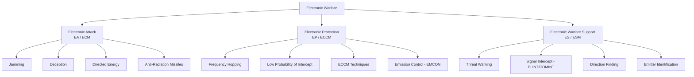
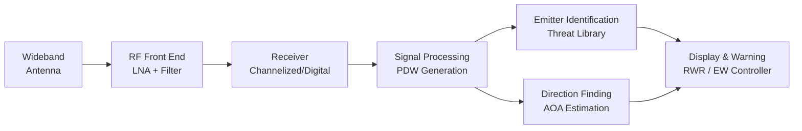

# Electronic Warfare Standards & Taxonomy

**Category:** 26 — Defense & Military Standards  
**Document:** 12 — Electronic Warfare Standards  
**Standard:** AEDP-3, JP 3-13.1, MIL-STD-461G (EW context), NATO EW STANAGs  
**Scope:** EW taxonomy, standards, threat libraries, directed energy, spectrum operations  
**Audience:** EW systems engineers, SIGINT analysts, spectrum managers, radar designers  
**Prerequisites:** Electromagnetic theory, radar principles, signals processing

---

## Chapter 1 — Electronic Warfare Taxonomy

### 1.1 EW Divisions (JP 3-13.1)

### 1.2 Definitions

| Term | Old Term | Definition |
|------|----------|-----------|
| **Electronic Attack (EA)** | ECM (Electronic Countermeasures) | Use of EM energy to attack personnel, facilities, or equipment to degrade/destroy enemy capability |
| **Electronic Protection (EP)** | ECCM (Electronic Counter-Countermeasures) | Actions to protect own forces from effects of friendly/enemy EW |
| **Electronic Warfare Support (ES)** | ESM (Electronic Support Measures) | Actions to search for, intercept, identify, and locate EM emissions for threat recognition, targeting, planning |
| **SIGINT** | — | Signals Intelligence (ELINT + COMINT + FISINT) |
| **ELINT** | — | Electronic Intelligence (radar and non-communication emitters) |
| **COMINT** | — | Communications Intelligence (communication signals) |
| **MASINT** | — | Measurement and Signature Intelligence |

### 1.3 Electromagnetic Spectrum Operations (EMSO)

| Concept | Description |
|---------|-------------|
| EMSO | Coordinated military operations in/through the EMS |
| Spectrum Management | Allocation and deconfliction of frequencies in operational area |
| EMCON | Emission Control — restricting own emissions to reduce detection |
| JEWCS | Joint Electronic Warfare Core Staff (NATO EW coordination) |
| JRFL | Joint Restricted Frequency List — protected frequencies |
| EME | Electromagnetic Environment — all EM emissions in an area |

---

## Chapter 2 — Electronic Attack (EA/ECM)

### 2.1 Jamming Techniques

| Technique | Type | Mechanism | Effective Against |
|-----------|------|-----------|-------------------|
| **Barrage** | Noise | Broadband noise across frequency band | Multiple threats (low J/S) |
| **Spot** | Noise | Concentrated noise on specific frequency | Known single threat (high J/S) |
| **Sweep** | Noise | Rapidly swept across band | Frequency-agile radars |
| **DRFM (Digital RF Memory)** | Deception | Digitize, modify, retransmit radar signal | Coherent/Doppler radars |
| **Range Gate Pull-Off (RGPO)** | Deception | Gradually delay echo to move range track | Tracking radars |
| **Velocity Gate Pull-Off (VGPO)** | Deception | Gradually shift Doppler to break velocity track | Pulse-Doppler radars |
| **Cross-eye** | Angular deception | Two antennas create wavefront distortion | Monopulse tracking radars |
| **Cross-pol** | Angular deception | Retransmit with orthogonal polarization | Polarization-sensitive trackers |
| **Chaff** | Passive | Metal strips create radar returns | Search/acquisition radars |
| **Flares** | Passive (IR) | Hot sources decoy IR missiles | IR-guided missiles |
| **Towed decoy** | Active/passive | Trailing decoy presents alternative target | Radar-guided missiles |

### 2.2 Jamming Equation

$$\frac{J}{S} = \frac{P_j \cdot G_j \cdot 4\pi \cdot R_t^2}{P_t \cdot G_t \cdot \sigma \cdot G_{ja}}$$

Where:
- $J/S$ = Jam-to-Signal ratio
- $P_j$ = Jammer power
- $G_j$ = Jammer antenna gain toward radar
- $R_t$ = Range from radar to target
- $P_t$ = Radar transmit power
- $G_t$ = Radar antenna gain
- $\sigma$ = Target radar cross-section (RCS)
- $G_{ja}$ = Radar antenna gain toward jammer

### 2.3 Directed Energy Weapons (DEW)

| Type | Mechanism | Range | Effect | Example System |
|------|-----------|-------|--------|----------------|
| High-Power Microwave (HPM) | Intense EM pulse damages electronics | Hundreds of meters | Electronic upset/damage | CHAMP, Phaser |
| High-Energy Laser (HEL) | Focused laser burns/melts target | Km range | Thermal destruction | HELIOS, THOR, Iron Beam |
| Electromagnetic Pulse (EMP) | Very short, intense broadband EM | Variable (nuclear: continental) | Widespread electronics damage | Nuclear EMP (E1/E2/E3) |
| Active Denial System (ADS) | 95 GHz millimeter wave | Hundreds of meters | Pain (non-lethal) | ADS (crowd control) |

---

## Chapter 3 — Electronic Protection (EP/ECCM)

### 3.1 Radar ECCM Techniques

| Technique | Category | Mechanism | Effective Against |
|-----------|----------|-----------|-------------------|
| **Frequency agility** | Signal design | Pulse-to-pulse frequency change | Spot jamming |
| **Frequency diversity** | Signal design | Multiple frequencies simultaneously | Narrowband jamming |
| **Pulse compression (LPI)** | Signal design | Spread energy over time/bandwidth | Intercept receivers |
| **Ultra-low sidelobes** | Antenna | -40 to -60 dB sidelobes | Sidelobe jamming |
| **Monopulse** | Processing | Single-pulse angle measurement | Blinking, AGC jamming |
| **SLC (Sidelobe Canceller)** | Processing | Adaptive nulling of sidelobe interference | Standoff jamming |
| **Burnthrough** | Power management | Increase power to overcome J/S | Noise jamming |
| **Home-on-Jam** | Counter-EA | Track jammer as target | Self-screening jamming |
| **Leading-edge tracking** | Processing | Track earliest return (before deception arrives) | RGPO |
| **Adaptive beamforming** | Antenna/processing | AESA electronically places null toward jammer | Multiple jamming directions |

### 3.2 Communication EP

| Technique | Application | Mechanism |
|-----------|-------------|-----------|
| FHSS (Frequency Hopping Spread Spectrum) | Tactical radios | Rapidly hop among frequencies |
| DSSS (Direct Sequence Spread Spectrum) | Military data links | Spread signal below noise floor |
| Adaptive power control | Radios | Minimize emission power (reduce detection) |
| Directional antennas | SATCOM, point-to-point | Reduce intercept probability |
| Burst transmission | Messaging | Compress and transmit in very short burst |
| AJ (Anti-Jam) GPS | Navigation | Controlled Reception Pattern Antenna (CRPA) |

---

## Chapter 4 — Electronic Warfare Support (ES/ESM)

### 4.1 ES System Architecture

### 4.2 Key ES Parameters

| Parameter | Description | Typical Measurement |
|-----------|-------------|-------------------|
| Frequency | Center frequency of emission | MHz or GHz (±1 MHz typical) |
| PRI (Pulse Repetition Interval) | Time between pulse starts | μs (±10 ns typical) |
| Pulse Width (PW) | Duration of radar pulse | μs or ns |
| AOA (Angle of Arrival) | Direction of emitter | Degrees (±2-5° typical) |
| Amplitude | Signal strength (for ranging) | dBm |
| Intra-pulse modulation | Chirp, Barker code, phase coding | Modulation type/parameters |
| Scan pattern | Antenna rotation characteristics | Circular, sector, electronic |
| Agility | Frequency/PRI variation pattern | Agile, stagger, jitter |

### 4.3 Pulse Descriptor Word (PDW)

| Field | Content | Bits (typical) |
|-------|---------|----------------|
| TOA (Time of Arrival) | Precise arrival time | 48 (ns resolution) |
| Frequency | RF frequency | 32 |
| Pulse Width | Duration | 16 |
| Amplitude | Received power level | 12 |
| AOA | Angle of arrival | 16 |
| Modulation | Intra-pulse modulation type | 8 |
| Flags | Valid/invalid, quality indicators | 8 |

---

## Chapter 5 — AEDP-3 (NATO EW Data Library)

### 5.1 Overview

| Aspect | Detail |
|--------|--------|
| Title | NATO Electronic Warfare Database (EWDB) / AEDP-3 |
| Purpose | Standardized format for storing radar/threat parameters |
| Classification | NATO SECRET (minimum) — operational versions higher |
| Content | Parametric data for all known threat emitters |
| Users | EW system programming, threat analysis, mission planning |
| Update cycle | Continuous (new threats added as identified) |
| Format | Structured database with defined fields per emitter |

### 5.2 Threat Library Data Elements

| Category | Parameters |
|----------|-----------|
| **Identification** | NATO designation, country, platform, threat level |
| **RF characteristics** | Frequency band, specific frequencies, bandwidth |
| **Temporal** | PRI (stable/agile/stagger), pulse width, burst patterns |
| **Spatial** | Antenna type, beamwidth, scan rate, sector limits |
| **Power** | ERP, peak power, average power |
| **Modes** | Search, acquisition, track, engagement (TWS, STT) |
| **Associated weapons** | Missile type, range, engagement altitude |
| **ECCM** | Known EP features of the threat |
| **Signatures** | Unique identifiers for ES classification |

### 5.3 EW Reprogramming

| Aspect | Detail |
|--------|--------|
| Definition | Update EW system threat libraries and response algorithms |
| Trigger | New threat identified, existing threat parameters changed |
| Timeline | Urgent: 72 hours; Routine: weeks to months |
| Standard | CJCSI 3210.04 (Joint EW Reprogramming Policy) |
| Process | Collect → Analyze → Develop → Test → Distribute → Load |
| Challenge | AESA radars with software-defined waveforms change rapidly |

---

## Chapter 6 — EW System Standards

### 6.1 Applicable Military Standards

| Standard | Relevance to EW |
|---------|-----------------|
| MIL-STD-461G | EMC/EMI — EW systems must not interfere with own platform |
| MIL-STD-464C | Electromagnetic Environmental Effects (E3) for systems |
| MIL-STD-469B | Radar Engineering Design Requirements |
| MIL-HDBK-235 | EW/radar receiver sensitivity calculation |
| MIL-STD-2169 | High-Altitude EMP protection for ground systems |
| MIL-STD-188-141C | HF radio interoperability (ALE) |
| STANAG 4193 | Link-11/Link-22 (tactical data link for EW) |
| STANAG 4633 | NATO ESM System Interoperability |

### 6.2 EW System Requirements

| Requirement | Metric | Typical Value |
|-------------|--------|---------------|
| Frequency coverage | Band | 0.5 – 40 GHz (modern systems extending to 100+ GHz) |
| Instantaneous bandwidth | MHz | 2-6 GHz (wideband digital receivers) |
| Dynamic range | dB | 60-80 dB |
| Sensitivity | dBm | -60 to -80 dBm |
| Probability of Intercept (POI) | % | >95% for known threats |
| False alarm rate | per hour | <1 for declared threats |
| Reaction time (EA) | ms | <100 ms (technique activation) |
| ERP (jamming) | Watts | 100W – 10 kW+ (platform dependent) |
| AOA accuracy | degrees | ±2-5° (interferometer-based) |

---

## Chapter 7 — Cognitive & Adaptive EW

### 7.1 Evolution of EW Systems

| Generation | Era | Approach |
|-----------|-----|----------|
| 1st | 1940s-60s | Fixed-frequency jammers, manual operation |
| 2nd | 1970s-80s | Pre-programmed threat libraries, semi-automatic |
| 3rd | 1990s-2010s | Digitally programmable, DRFM-based |
| 4th | 2010s-present | Adaptive, cognitive, AI-enabled |
| 5th | Future | Fully autonomous, machine-speed decision making |

### 7.2 Cognitive EW Characteristics

| Capability | Description |
|-----------|-------------|
| Sense | Wideband digital receivers with full environment awareness |
| Learn | Machine learning classifies new/unknown emitters |
| Decide | AI selects optimal technique against each threat |
| Act | Rapidly synthesize and deploy countermeasure |
| Adapt | Observe EA effectiveness, modify technique in real-time |
| Remember | Update threat models based on operational experience |

### 7.3 AI/ML in EW

| Application | ML Technique | Purpose |
|------------|-------------|---------|
| Signal classification | Deep learning (CNN) | Identify emitter type from raw RF |
| Threat clustering | Unsupervised learning | Group unknown emitters |
| Technique optimization | Reinforcement learning | Learn best jamming technique against adaptive radar |
| Anomaly detection | Autoencoders | Detect novel/unknown threats |
| Waveform generation | Generative adversarial networks (GAN) | Synthesize deceptive waveforms |

---

## Chapter 8 — Spectrum Warfare & Electromagnetic Maneuver

### 8.1 Electromagnetic Spectrum Operations (EMSO)

| Component | Description |
|-----------|-------------|
| Spectrum management | Frequency allocation, deconfliction in AOR |
| Electronic warfare | EA, EP, ES as previously defined |
| Spectrum superiority | Ability to use EMS while denying adversary use |
| Navigation warfare (NAVWAR) | Protect own PNT, deny adversary GPS/PNT |
| Cyber-electromagnetic activities | Intersection of cyber and EM domains |

### 8.2 Anti-Access/Area Denial (A2/AD) EW Environment

| Threat System | Type | Range | Concern |
|--------------|------|-------|---------|
| S-400 (SA-21) | SAM | 400 km | Long-range integrated air defense |
| Su-57 (Felon) EW suite | Airborne | Platform-dependent | AESA + advanced EW |
| Krasukha-4 | Ground-based jammer | 300 km | Wideband jamming of AWACS/ISR |
| Murmansk-BN | HF jammer | 5000 km | Disrupts HF communications |
| GPS spoofing/jamming | NAVWAR | Variable | Deny precision navigation |
| Kalibr-M with EW support | Cruise missile | 2000+ km | Penetration of degraded defenses |

---

## Chapter 9 — DEW (Directed Energy Weapons) Standards

### 9.1 DEW Standards & Guidance

| Standard/Guide | Scope |
|---------------|-------|
| MIL-STD-1540 (space vehicle testing) | Laser hardness for space systems |
| MIL-STD-2169 | HEMP (High-Altitude EMP) hardening |
| IEC 62471 | Photobiological safety of lamps/lasers |
| ANSI Z136 | Laser safety (personnel) |
| DoD Directive 3000.03E | DoD Executive Agent for Non-Lethal Weapons |
| DoDD 3100.10 | Space Policy (laser weapons in space) |
| NATO STANAG 4688 | NATO Laser Safety Standard |

### 9.2 DEW Program Status (2025)

| System | Type | Service | Platform | Status |
|--------|------|---------|----------|--------|
| HELIOS | 60 kW laser | Navy | DDG-51 Flight IIA | Deployed (2022) |
| DE-SHORAD | 50 kW laser | Army | Stryker vehicle | Fielding 2025 |
| Phaser | HPM | Air Force | Ground-based (C-UAS) | Prototype deployed |
| THOR | HPM | Air Force | Expeditionary C-UAS | Operational testing |
| Iron Beam | HEL | Israel | Ground-based | Integration with Iron Dome |
| DragonFire | HEL | UK MoD | Naval | Demonstrator 2027 |

---

## Chapter 10 — Interview Questions

### Entry-Level
1. Define the three divisions of Electronic Warfare (EA, EP, ES).
2. What is the difference between noise jamming and deception jamming?
3. What is a Radar Warning Receiver (RWR) and what parameters does it measure?

### Mid-Level
1. Explain DRFM-based deception jamming. How does Range Gate Pull-Off work against a tracking radar?
2. Design an ECCM suite for a ground-based air surveillance radar. What techniques would you implement?
3. What is AEDP-3 and how is it used to program EW systems?

### Senior
1. Design a cognitive EW system architecture that can detect, classify, and respond to unknown/adaptive threats in real-time. What ML approaches would you use?
2. Propose an EW capability against an integrated air defense system (IADS) consisting of S-400, Buk-M3, and Pantsir-S1. Identify attack vectors and required EA techniques.
3. How would you approach the challenge of EW reprogramming timelines (weeks) vs. software-defined radar threat adaptation (seconds)? Propose an architecture to close this gap.

### Principal / Chief Scientist
1. How should EW systems evolve to address quantum radar and quantum communication technologies that are inherently resistant to traditional jamming?
2. Design a multi-domain EMSO architecture that integrates space-based, airborne, and ground EW assets with cyber effects for a peer-conflict scenario.
3. Propose a framework for testing and certifying autonomous AI-enabled EW systems that make engagement decisions at machine speed, addressing both effectiveness and legal/ethical constraints.

---

*Document Version: 1.0 | Last Updated: May 2026 | Author: Defense Standards Engineering Team*
