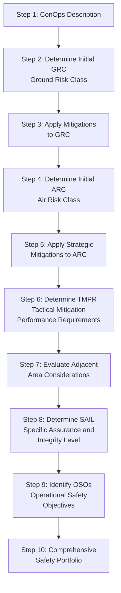

# Drone / UAV / eVTOL Standards — Comprehensive Overview

**Category:** 27 — Drone, UAV & eVTOL Standards  
**Document:** 00 — Standards Landscape Overview  
**Scope:** Hobbyist to military UAS, commercial drones, eVTOL/AAM, UTM systems  
**Key Standards:** FAA Part 107, EU 2019/945, EASA SC-VTOL, ASTM F38, JARUS SORA, NATO STANAG 4671  
**Audience:** UAS manufacturers, eVTOL certification engineers, UTM architects, drone operators  
**Prerequisites:** Basic aviation/airworthiness knowledge

---

## Chapter 1 — Historical Context

### 1.1 Key Timeline

| Year | Event | Standard Impact |
|------|-------|----------------|
| 1917 | Kettering Bug (first US military drone) | Military UAS concept proved |
| 1960s | Ryan Firebee reconnaissance drone (Vietnam) | Military drone operations formalized |
| 2006 | FAA issues first commercial UAS permit | Commercial drone regulation begins |
| 2012 | FAA Modernization and Reform Act | Congress mandates UAS integration |
| 2013 | Amazon Prime Air announced | Commercial delivery drone concept |
| 2016 | FAA Part 107 finalized | First US small UAS operational rule |
| 2019 | EU Drone Regulation 2019/945 + 2019/947 | European unified drone rules |
| 2020 | FAA Remote ID rule (14 CFR Part 89) | Mandatory drone identification |
| 2021 | Joby Aviation eVTOL type certification basis | eVTOL certification race begins |
| 2022 | EASA SC-VTOL published | European eVTOL certification standard |
| 2023 | First drone delivery FAA Part 135 certificate (Wing) | Beyond VLOS commercial ops |
| 2024 | FAA BVLOS rule proposed | Scalable autonomous drone operations |
| 2025 | eVTOL first commercial service (target) | Archer/Joby commercial operations |

### 1.2 Regulatory Landscape Architecture

```mermaid
graph TB
    subgraph "International"
        ICAO[ICAO<br/>Circular 328, Annex 2 Amd 8]
        JARUS[JARUS<br/>Joint Authorities for Rulemaking]
    end
    
    subgraph "USA (FAA)"
        P107[Part 107<br/>Small UAS <55 lbs]
        P89[Part 89<br/>Remote ID]
        P135[Part 135<br/>Air Carrier (delivery)]
        P21[Part 21.17(b)<br/>Special Class<br/>eVTOL Type Cert]
    end
    
    subgraph "Europe (EASA)"
        EU945[EU 2019/945<br/>UAS Design/Production]
        EU947[EU 2019/947<br/>UAS Operations]
        SCVTOL[SC-VTOL<br/>eVTOL Certification]
    end
    
    subgraph "Military (NATO)"
        S4671[STANAG 4671<br/>UAV Airworthiness]
        S4586[STANAG 4586<br/>UAS Control System]
    end
    
    ICAO --> P107
    ICAO --> EU947
    JARUS --> EU947
    JARUS --> S4671
```

---

## Chapter 2 — FAA Regulations (USA)

### 2.1 FAA Part 107 — Small UAS Rule

**Applicability:** UAS < 55 lbs (25 kg) for commercial operations in USA

| Requirement | Detail |
|-------------|--------|
| Weight | < 55 lbs (including payload) at takeoff |
| Altitude | ≤ 400 ft AGL (or within 400 ft of structure) |
| Speed | ≤ 100 mph (87 knots) |
| Visibility | ≥ 3 statute miles from control station |
| Time | Daylight or civil twilight (with anti-collision lights) |
| Line of sight | Visual line of sight (VLOS) required |
| Airspace | Class G (uncontrolled) without authorization; LAANC for B/C/D/E |
| Pilot certificate | Remote Pilot Certificate (Part 107 exam) |
| Registration | All UAS > 250g must be FAA-registered |

**Waivers available (Part 107.200):**
- Night operations (now standard with anti-collision light)
- Over people (4 categories based on kinetic energy)
- Beyond VLOS (case-by-case waiver, BVLOS rule pending)
- Multiple UAS from single operator

### 2.2 FAA Remote ID (14 CFR Part 89)

Mandatory since September 2023:

| Requirement | Standard Remote ID | Remote ID Broadcast Module |
|-------------|-------------------|--------------------------|
| UAS ID | Unique serial number | Serial or session ID |
| Position (UAS) | Lat/Lon/Alt (GPS) | Lat/Lon/Alt |
| Position (control station) | Lat/Lon/Alt | Lat/Lon (takeoff point) |
| Velocity | Ground speed + heading | Not required |
| Timestamp | UTC time mark | UTC time mark |
| Broadcast | Internet + RF broadcast | RF broadcast only |
| Compliance | Built-in at manufacture | Retrofit module |

**Broadcast protocol:** ASTM F3411-22 (Remote ID performance standard)

### 2.3 eVTOL Type Certification (FAA Part 21.17(b))

```mermaid
flowchart TB
    A[Apply for Type Certificate<br/>Part 21.17(b) Special Class] --> B[FAA Establishes<br/>Certification Basis<br/>G-1 Issue Paper]
    B --> C[Applicant Shows Compliance<br/>via Means of Compliance<br/>ASTM F3230 / DO-178C etc.]
    C --> D[FAA Design Reviews<br/>+ Conformity Inspections]
    D --> E[Flight Testing<br/>Envelope expansion]
    E --> F[Type Certificate<br/>Issued]
    F --> G[Production Certificate<br/>Part 21 Subpart G]
    G --> H[Operations Certificate<br/>Part 135 Air Carrier]
```

**Active eVTOL certifications (2024-2025):**

| Company | Aircraft | Config | FAA Basis | Target |
|---------|----------|--------|-----------|--------|
| Joby Aviation | S4 | Tiltrotor (6 props) | Part 21.17(b), G-1 | 2025 |
| Archer Aviation | Midnight | Tilt + lift (12 props) | Part 21.17(b), G-1 | 2025 |
| Wisk Aero | Cora (autonomous) | Multicopter + wing | Part 21.17(b) | 2026+ |
| Lilium | Lilium Jet | Ducted fan (36) | EASA SC-VTOL | 2026 |
| Vertical Aerospace | VX4 | Tiltrotor (8 props) | EASA SC-VTOL | 2026 |

---

## Chapter 3 — EU Drone Regulations (EASA)

### 3.1 EU 2019/947 — Operations Categories

```mermaid
graph LR
    subgraph "EU UAS Operations Framework"
        OPEN[Open Category<br/>──────────────<br/>Low risk<br/>No authorization<br/>Self-declaration]
        SPECIFIC[Specific Category<br/>──────────────<br/>Medium risk<br/>Authorization required<br/>SORA assessment]
        CERTIFIED[Certified Category<br/>──────────────<br/>High risk<br/>Type certificate<br/>Operator certificate<br/>Remote pilot license]
    end
    
    OPEN -->|"MTOW <25kg<br/>VLOS only<br/>Max 120m AGL<br/>No assembly of people"| O_SUB[Subcategories:<br/>A1 (fly over people)<br/>A2 (close to people)<br/>A3 (far from people)]
    
    SPECIFIC -->|"SORA or PDRA<br/>ConOps required<br/>Operational authorization"| S_SUB[PDRA-G01 (VLOS city)<br/>PDRA-G02 (BVLOS rural)<br/>PDRA-S01 (VLOS maritime)<br/>Custom SORA]
    
    CERTIFIED -->|"Full aircraft-style<br/>certification"| C_SUB[eVTOL passenger<br/>Large cargo drones<br/>Autonomous urban ops]
```

### 3.2 EU 2019/945 — UAS Class Categories (Design & Production)

| Class | MTOW | Speed | Kinetic Energy | Key Requirement |
|-------|------|-------|---------------|-----------------|
| C0 | < 250g | < 19 m/s | < 80 J | No registration required; toy-like |
| C1 | < 900g | < 19 m/s | < 80 J | Remote ID; geo-awareness; lights |
| C2 | < 4 kg | N/A | N/A | Low-speed mode; Remote ID; geo-awareness |
| C3 | < 25 kg | N/A | N/A | Characteristic dimension < 3m; Remote ID |
| C4 | < 25 kg | N/A | N/A | No auto modes; for A3 subcategory |
| C5 | < 25 kg (Specific) | N/A | N/A | For PDRA-G01/G02 operations |
| C6 | < 25 kg (Specific) | N/A | N/A | For low-speed specific operations |

### 3.3 JARUS SORA (Specific Operations Risk Assessment)

**10-step methodology for Specific category authorization:**



**SAIL (Specific Assurance and Integrity Level):**

| SAIL | Final GRC | Final ARC | Description |
|------|-----------|-----------|-------------|
| I | 1 | a | Very low risk |
| II | 2-3 | b | Low risk |
| III | 4 | b | Medium risk |
| IV | 5-6 | c | Medium-high risk |
| V | 7 | c | High risk |
| VI | 8+ | d | Very high risk (→ Certified) |

---

## Chapter 4 — eVTOL Certification Standards

### 4.1 EASA SC-VTOL (Special Condition for VTOL Aircraft)

Key sections and requirements:

| SC-VTOL Section | Requirement | Origin Standard |
|-----------------|-------------|-----------------|
| SC-VTOL.2000 | Flight loads and structure | CS-23 Amdt 5 adapted |
| SC-VTOL.2105 | Performance: climb, range | New for VTOL profiles |
| SC-VTOL.2150 | Stability and control | Unique VTOL transition |
| SC-VTOL.2205 | Powerplant: DEP (Distributed Electric Propulsion) | New |
| SC-VTOL.2510 | Equipment: avionics, displays | DO-178C, DO-254 |
| SC-VTOL.2600 | Emergency landing | Auto-rotation / glide equivalent |
| SC-VTOL.2900 | Cybersecurity | DO-326A / ED-203A |

### 4.2 Functional Safety for eVTOL

eVTOL systems apply traditional aviation safety standards:

| System | Standard | DAL Required | Justification |
|--------|----------|-------------|---------------|
| Flight control (FCS) | DO-178C (SW) + DO-254 (HW) | DAL A | Loss = catastrophic (hull loss) |
| Battery management (BMS) | DO-178C | DAL B-C | Battery failure = loss of thrust |
| Navigation (GNSS/INS) | DO-178C | DAL B | Degraded = major failure |
| Communication (C2 link) | DO-178C | DAL C | Loss of C2 = hazardous |
| Detect & Avoid (DAA) | DO-178C + MOPS (SC-228) | DAL C | Mid-air collision prevention |
| Display system | DO-178C | DAL C | Misleading info = hazardous |

### 4.3 Battery Safety Standards for eVTOL

| Standard | Scope | Application |
|----------|-------|-------------|
| RTCA DO-311A | Rechargeable lithium batteries | Primary power for eVTOL |
| RTCA DO-227A | Minimum operational performance for UPS | Backup battery systems |
| SAE AS6413 | Battery management for aircraft | BMS requirements |
| UN 38.3 | Transport of lithium batteries | Shipping batteries |
| UL 1973 | Stationary battery systems | Ground charging |
| IEC 62660 | EV cell testing | Adapted for aviation cells |

---

## Chapter 5 — Counter-UAS & Security

### 5.1 Counter-UAS Standards

| Standard/Document | Scope |
|------------------|-------|
| ASTM WK65056 (draft) | Counter-UAS detection performance |
| FAA UAS Detection Technology Evaluation | CUAS equipment assessment |
| NATO STANAG 4703 | Counter-UAS equipment interoperability |
| UK ARPAS Drone Security Framework | Security assessment for drone ops |
| NIST IR 8355 | UAS Cybersecurity |

### 5.2 UAS Cybersecurity Threats

| Threat | Attack Vector | Mitigation Standard |
|--------|-------------|-------------------|
| GPS spoofing | Fake GNSS signals | RTCA DO-373, multi-constellation |
| C2 link hijacking | RF interception/replay | Encrypted datalinks, FIPS 140-3 |
| Payload tampering | Modified firmware | Secure boot, code signing |
| Denial of service | Jamming control frequencies | Frequency hopping, LTE/5G backup |
| Data exfiltration | Camera/sensor data theft | Encrypted storage, Remote ID privacy |

---

## Chapter 6 — Future Trends (2025-2030)

| Trend | Timeline | Impact |
|-------|----------|--------|
| FAA BVLOS final rule | 2025-2026 | Scalable commercial drone delivery |
| eVTOL first passenger service | 2025-2026 | New airspace category needed |
| U-Space/UTM full deployment (EU) | 2025-2027 | Automated airspace management |
| 5G C2 link standard (3GPP) | 2025 | Reliable cellular drone control |
| Autonomous eVTOL certification | 2027+ | No onboard pilot; DAL A autonomy |
| Drone swarm regulations | 2026-2028 | Multi-UAS operations under single operator |
| Hydrogen/electric hybrid eVTOL | 2027+ | New propulsion certification paths |
| Vertiport standards | 2025-2026 | Infrastructure for UAM operations |

---

## Chapter 7 — Interview Questions

### Tier 1: Entry-Level
1. What is FAA Part 107 and what are its key operational limitations?
2. Explain the EU Open/Specific/Certified operations categories.
3. What is Remote ID and why is it mandatory?
4. Name the four eVTOL DAL levels and their corresponding failure conditions.

### Tier 2: Mid-Level
1. Walk through the JARUS SORA process for a BVLOS delivery drone operation.
2. Compare FAA Part 21.17(b) and EASA SC-VTOL certification paths.
3. How does DO-178C apply to UAS flight control software?
4. What are the ASTM F38 committee standards and their role in UAS certification?

### Tier 3: Senior/Lead
1. Design a certification strategy for a fully autonomous cargo drone (no remote pilot).
2. How do you establish a Means of Compliance matrix for SC-VTOL requirements?
3. Explain the differences between PDRA-G01 and a full custom SORA assessment.
4. How do you address lithium battery thermal runaway in an eVTOL safety assessment (ARP4761A)?

### Tier 4: Principal
1. Propose a certification framework for UAS swarm operations that doesn't exist today.
2. How should airworthiness standards evolve for AI-based Detect & Avoid systems?
3. Design a dual-certification strategy (FAA + EASA) minimizing redundant compliance.
4. How do you address the gap between DO-178C deterministic software assurance and ML-based perception for eVTOL?

---

*Document Version: 1.0 | Last Updated: May 2026 | Author: Technology Standards Team*
