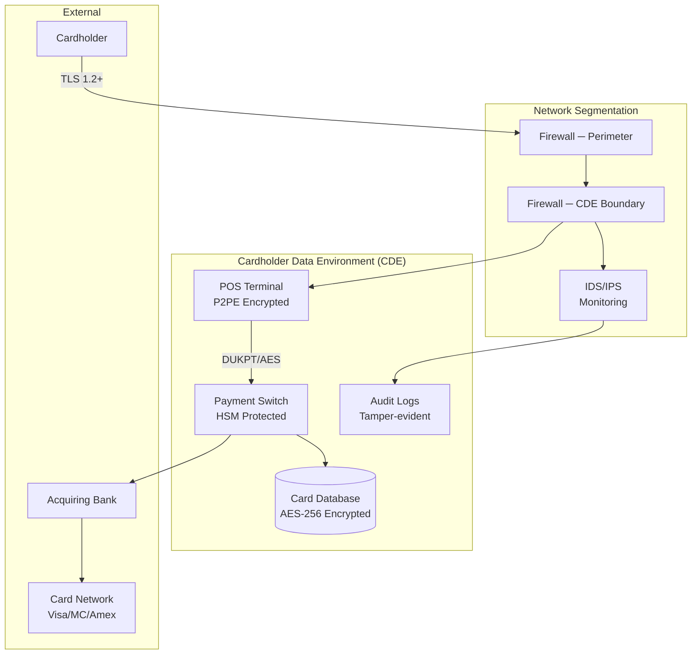
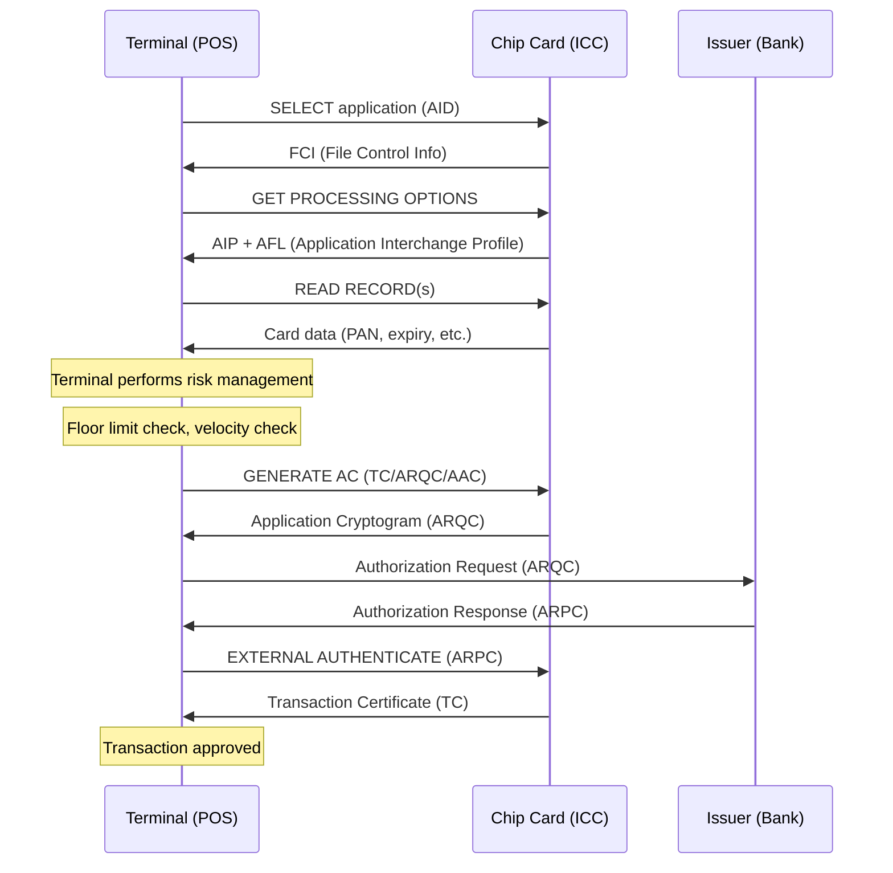
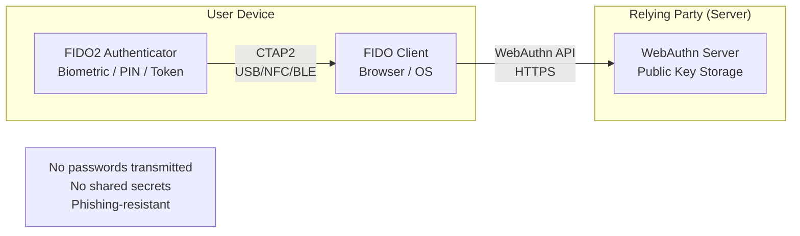
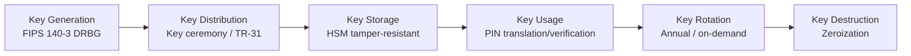

# FinTech, Banking & Payment Standards — Comprehensive Overview

**Category:** 28 — FinTech, Banking & Payment Standards  
**Document:** 00 — Standards Landscape Overview  
**Scope:** Payment card security, messaging, EMV chip, digital identity, open banking, crypto regulation  
**Key Standards:** PCI DSS v4.0, ISO 20022, EMVCo, FIDO2, MiCA, SWIFT CSP  
**Audience:** Payment engineers, banking architects, crypto compliance, fraud detection engineers  
**Prerequisites:** Basic understanding of cryptography and network security

---

## Chapter 1 — Historical Context

### 1.1 Key Events Driving FinTech Standards

| Year | Event | Standard Impact |
|------|-------|----------------|
| 1950 | Diners Club first charge card | Concept of card-based payment |
| 1967 | First ATM (Barclays, London) | PIN security requirements born |
| 1970 | SWIFT founded (Brussels) | Bank messaging standardization |
| 1994 | First internet purchase (NetMarket) | Need for online payment security |
| 1996 | SET protocol (Visa/Mastercard) | First e-commerce security attempt (failed) |
| 1999 | EMV chip card specification v3.0 | Chip-and-PIN replaces magnetic stripe |
| 2004 | PCI DSS v1.0 published | Card data security standard created |
| 2007 | iPhone + mobile payments concept | Mobile payment standards needed |
| 2009 | Bitcoin whitepaper/genesis block | Cryptocurrency standards eventually needed |
| 2013 | Target breach (110M cards) | PCI DSS enforcement acceleration |
| 2015 | PSD2 directive (EU) | Open Banking mandate |
| 2016 | SWIFT Bangladesh Bank heist ($81M) | SWIFT CSP created |
| 2018 | FIDO2/WebAuthn published | Passwordless authentication |
| 2020 | COVID: contactless payment surge | NFC/tap-to-pay acceleration |
| 2022 | PCI DSS v4.0 published | Major security update |
| 2023 | EU MiCA regulation | Comprehensive crypto regulation |
| 2024 | FedNow + ISO 20022 migration | Real-time payment interoperability |
| 2025 | PCI DSS v4.0 full enforcement | All 4.0 requirements mandatory |

---

## Chapter 2 — PCI DSS v4.0 (Payment Card Industry Data Security Standard)

### 2.1 Structure Overview

PCI DSS v4.0 (published March 2022, mandatory March 2025) has **6 goals, 12 requirements, ~1,800 sub-requirements:**

| Goal | Requirement | Focus Area |
|------|------------|------------|
| Build & Maintain Secure Network | 1. Install/maintain network security controls | Firewalls, segmentation |
| | 2. Apply secure configuration to system components | Defaults, hardening |
| Protect Account Data | 3. Protect stored account data | Encryption at rest |
| | 4. Protect cardholder data with strong cryptography during transmission | TLS 1.2+, encryption in transit |
| Maintain Vulnerability Management | 5. Protect from malicious software | Anti-malware, phishing |
| | 6. Develop and maintain secure systems | SDLC, vulnerability management |
| Implement Strong Access Control | 7. Restrict access by business need-to-know | Least privilege |
| | 8. Identify users and authenticate access | MFA, strong passwords |
| | 9. Restrict physical access to cardholder data | Physical security |
| Monitor and Test Networks | 10. Log and monitor all access | SIEM, audit trails |
| | 11. Test security of systems regularly | Pen testing, ASV scans |
| Maintain Security Policy | 12. Support information security with policy | Governance, training |

### 2.2 Key Changes in v4.0 vs v3.2.1

| Area | v3.2.1 | v4.0 | Impact |
|------|--------|------|--------|
| Authentication | MFA for admin access | MFA for ALL CDE access (Req 8.4) | Massive expansion |
| Encryption | TLS 1.1 allowed | TLS 1.2 minimum required | Protocol upgrade |
| Targeted Risk Analysis | Prescriptive frequencies | Risk-based frequency selection | Flexibility |
| Customized Approach | N/A (defined approach only) | Customized controls option | Alternative compliance |
| E-commerce | Basic protection | Client-side script control (Req 6.4.3) | Magecart defense |
| Encryption | AES-128 acceptable | AES-256 recommended; key rotation | Stronger crypto |
| Logging | Daily log review | Automated anomaly detection (Req 10.4.1.1) | SIEM requirement |

### 2.3 Compliance Validation Methods

| Merchant Level | Transaction Volume | Validation Method |
|---------------|-------------------|-------------------|
| Level 1 | > 6M transactions/year | Report on Compliance (ROC) by QSA |
| Level 2 | 1-6M transactions/year | SAQ + ASV quarterly scan |
| Level 3 | 20K-1M e-commerce | SAQ + ASV scan |
| Level 4 | < 20K e-commerce / < 1M | SAQ (simplified) |

### 2.4 PCI DSS Architecture Diagram



---

## Chapter 3 — ISO 20022 Universal Financial Messaging

### 3.1 Overview

ISO 20022 is replacing all legacy financial messaging formats worldwide:

| Legacy Format | Replaced By | Migration Deadline |
|--------------|-------------|-------------------|
| SWIFT MT (FIN) | SWIFT MX (ISO 20022) | November 2025 |
| FedWire format | FedNow ISO 20022 | Live since July 2023 |
| SEPA (legacy XML) | Already ISO 20022 | Completed 2014 |
| CHAPS (UK) | ISO 20022 | Already migrated 2023 |
| SIC (Switzerland) | ISO 20022 | Already migrated 2022 |
| BOJ-NET (Japan) | ISO 20022 | Migrating 2024-2025 |

### 3.2 ISO 20022 Message Structure

```
ISO 20022 XML Message:
├── Business Area (e.g., pacs = Payments Clearing & Settlement)
├── Message Definition (e.g., pacs.008 = Customer Credit Transfer)
├── Message Component (structured data elements)
│   ├── Group Header (MsgId, CreDtTm, NbOfTxs)
│   ├── Credit Transfer Information
│   │   ├── Debtor (name, address, account)
│   │   ├── Creditor (name, address, account)
│   │   ├── Amount & Currency
│   │   ├── Remittance Information (structured)
│   │   └── Purpose Code
│   └── Supplementary Data
└── Transport (via SWIFT MX, API, etc.)
```

### 3.3 Key Message Types

| Message ID | Name | Use Case |
|-----------|------|----------|
| pacs.008 | FI to FI Customer Credit Transfer | Standard payment |
| pacs.009 | Financial Institution Credit Transfer | Bank-to-bank |
| pacs.002 | Payment Status Report | Status/rejection |
| camt.053 | Bank to Customer Statement | Account statement |
| camt.054 | Bank to Customer Debit/Credit Notification | Transaction alert |
| pain.001 | Customer Credit Transfer Initiation | Payment order |
| pain.002 | Customer Payment Status Report | Status feedback |

---

## Chapter 4 — EMV Chip Card Standards

### 4.1 EMV Architecture

| Level | Scope | Standard | Certification |
|-------|-------|----------|---------------|
| Level 1 | Physical interface (contact/contactless) | EMV Book 1 | Terminal L1 cert |
| Level 2 | Application protocol, transaction flow | EMV Books 2-4 | Terminal L2 cert |
| Level 3 | Payment network (Visa/MC/Amex) brand | Network-specific | Brand testing |

### 4.2 EMV Contact Transaction Flow



### 4.3 Contactless Payment (NFC) Limits

| Country | Contactless Limit (no PIN) | Technology |
|---------|---------------------------|-----------|
| USA | No limit (signature optional) | EMVCo contactless |
| UK | £100 | EMV contactless |
| EU (SEPA) | €50 (cumulative: €150) | EMV contactless |
| Australia | AUD $200 | EMV contactless |
| Japan | ¥20,000 | FeliCa + EMV |
| India | ₹5,000 | EMV contactless |

---

## Chapter 5 — Digital Identity & Authentication (FIDO2)

### 5.1 FIDO2 Architecture



### 5.2 FIDO vs Traditional Authentication

| Factor | Passwords | TOTP (2FA) | FIDO2/Passkeys |
|--------|-----------|-----------|----------------|
| Phishing resistant | No | Partially | Yes (origin-bound) |
| Server breach risk | High (password DB) | Medium (seed theft) | None (public keys only) |
| User experience | Poor (memorization) | Medium (code entry) | Excellent (biometric) |
| Account recovery | Email/SMS (weak) | Backup codes | Account recovery flow |
| MFA compliant | No (single factor) | Yes | Yes (possession + biometric) |
| PCI DSS v4.0 compliant | Limited | Yes (Req 8.4) | Yes (Req 8.4) |

---

## Chapter 6 — Open Banking Standards

### 6.1 Global Open Banking Landscape

| Region | Standard | Mandate Type | Status |
|--------|----------|-------------|--------|
| EU | PSD2 + Berlin Group NextGenPSD2 | Regulatory mandate | Active |
| UK | CMA Open Banking Standard | Regulatory mandate (CMA 9) | Active |
| USA | FDX (Financial Data Exchange) | Industry-led (voluntary) | Growing |
| Australia | CDR (Consumer Data Right) | Legislative mandate | Active |
| Brazil | Open Finance Brasil | Regulatory mandate (BCB) | Active |
| India | Account Aggregator (RBI) | Regulatory mandate | Active |
| Saudi Arabia | SAMA Open Banking | Regulatory mandate | Phase 1 |

### 6.2 PSD2 API Structure (EU)

| API | Function | Access |
|-----|----------|--------|
| AIS (Account Information Service) | Read account balances & transactions | AISP license required |
| PIS (Payment Initiation Service) | Initiate payments from account | PISP license required |
| CBPII (Confirmation of Funds) | Check if account has sufficient funds | Limited access |

---

## Chapter 7 — Cryptocurrency & DeFi Regulation

### 7.1 EU MiCA Regulation (Markets in Crypto-Assets)

Regulation 2023/1114, fully enforced December 2024:

| Token Type | MiCA Category | Key Requirements |
|-----------|---------------|-----------------|
| Bitcoin, Ethereum | Crypto-assets (general) | CASP registration; whitepaper |
| USDC, Tether (USDT) | E-money Tokens (EMT) | E-money license; 1:1 fiat reserves |
| Proposed gold-backed token | Asset-Referenced Tokens (ART) | Banking license equivalent; reserve rules |
| Utility tokens (limited) | Utility tokens | Whitepaper if traded on exchange |
| Security tokens | Not MiCA (MiFID II applies) | Full securities regulation |

### 7.2 FATF Travel Rule Implementation

**Requirement:** VASPs must exchange originator/beneficiary info for transfers ≥ $1,000/€1,000

| Solution | Protocol | Adoption |
|----------|----------|----------|
| SWIFT (Sygnature) | ISO 20022 adaptation | Banks + crypto exchanges |
| Travel Rule Protocol (TRP) | Decentralized peer-to-peer | US exchanges |
| OpenVASP | Open-source, blockchain-based | EU exchanges |
| Sygna Bridge | Centralized hub | Asia exchanges |
| Notabene | SaaS compliance platform | Global CASPs |

---

## Chapter 8 — Payment Security Hardware (HSM)

### 8.1 HSM Standards for Banking

| Standard | Scope | Application |
|----------|-------|-------------|
| FIPS 140-3 Level 3 | Cryptographic module security | All payment HSMs |
| PCI HSM v3.0 | Payment-specific HSM requirements | PIN processing |
| Common Criteria EAL 4+ | Independent security evaluation | Terminal security |
| ISO 13491 | Banking — Secure cryptographic devices | ATM crypto modules |
| ANSI X9.24 | Retail financial services: symmetric key management | DUKPT, AES key injection |

### 8.2 Key Management Lifecycle



---

## Chapter 9 — Compliance Matrix

| Standard | Banks | Payment Processors | Crypto Exchanges | FinTechs |
|----------|-------|-------------------|------------------|----------|
| PCI DSS v4.0 | Required | Required | If card payment | If card payment |
| ISO 27001 | Expected | Expected | Expected | Expected |
| SOC 2 Type II | Expected | Required | Expected | Expected |
| SWIFT CSP | If SWIFT member | If SWIFT member | N/A | N/A |
| PSD2/Open Banking | Required (EU) | N/A | N/A | Required if AISP/PISP |
| MiCA | N/A | N/A | Required (EU) | If crypto services |
| DORA (EU) | Required | Required | Required | Required (if critical) |
| Basel III/IV | Required | N/A | N/A | N/A |
| SOX (USA) | Required (public) | Required (public) | Required (public) | Required (public) |
| GDPR | Required (EU) | Required (EU) | Required (EU) | Required (EU) |

---

## Chapter 10 — Interview Questions

### Tier 1: Entry-Level
1. What are the 12 PCI DSS requirements (at goal level)?
2. What is ISO 20022 and why is it replacing SWIFT MT messages?
3. Explain the EMV transaction flow at a high level.
4. What is FIDO2 and how does it differ from password-based authentication?

### Tier 2: Mid-Level
1. Explain PCI DSS v4.0 Requirement 6.4.3 (client-side script integrity) and how to implement it.
2. Design a key management architecture for a payment processor using DUKPT.
3. How does the FATF Travel Rule apply to cryptocurrency exchanges?
4. Compare SAQ types and determine which applies for a given merchant setup.

### Tier 3: Senior/Lead
1. Design a PCI DSS v4.0 compliant architecture for a cloud-native payment platform.
2. How do you implement MiCA compliance for a multi-jurisdiction crypto exchange?
3. Explain how SWIFT gpi UETR works and its implications for ISO 20022 migration.
4. Design an Open Banking API architecture compliant with PSD2 + UK Open Banking standards.

### Tier 4: Principal
1. How should payment standards evolve for CBDC (Central Bank Digital Currency) integration?
2. Propose a post-quantum cryptography migration strategy for payment HSMs.
3. Design a unified compliance framework covering PCI DSS, DORA, NIS2, and SWIFT CSP.
4. How do you architect a global payment system handling ISO 20022, real-time payments, and legacy SWIFT MT simultaneously?

---

*Document Version: 1.0 | Last Updated: May 2026 | Author: Technology Standards Team*
