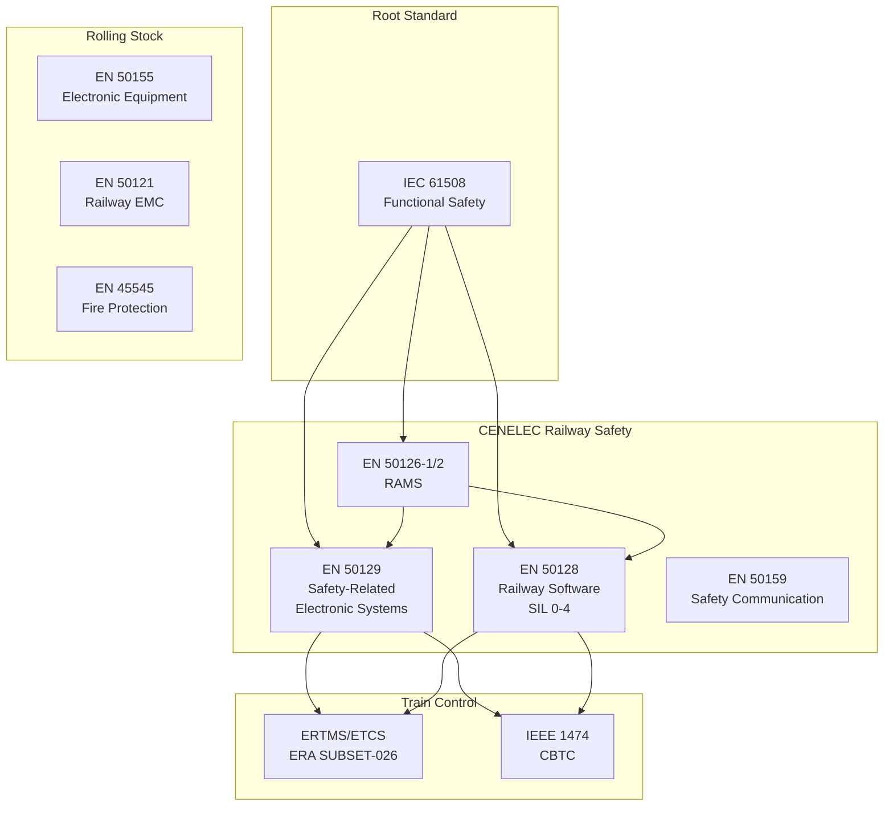
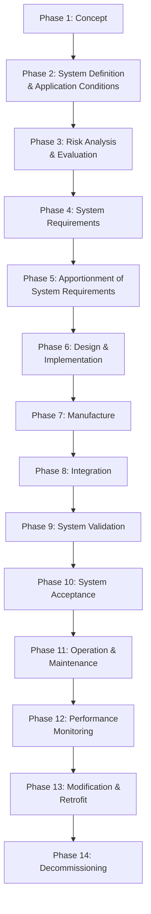
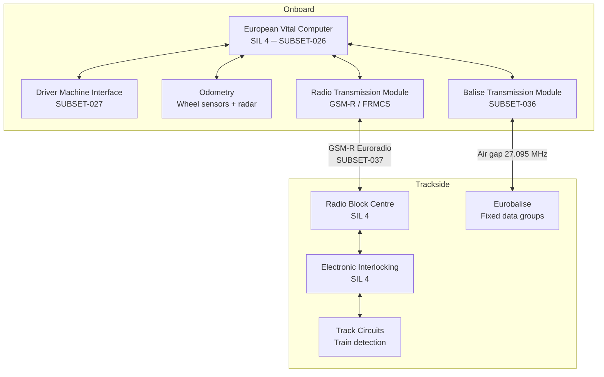

# Railway & Mass Transit Systems Standards — Comprehensive Overview

**Category:** 29 — Railway & Mass Transit Systems  
**Document:** 00 — Standards Landscape Overview  
**Scope:** EN 50126/128/129 RAMS, ETCS/ERTMS, CBTC, signaling, rolling stock  
**Key Standards:** EN 50128, EN 50129, EN 50126, ERA SUBSET-026, IEEE 1474  
**Audience:** Rail signaling engineers, traction control engineers, ETCS designers, CBTC architects  
**Prerequisites:** Functional safety fundamentals (IEC 61508)

---

## Chapter 1 — Historical Context

### 1.1 Accidents Driving Railway Standards

| Year | Disaster | Fatalities | Standard Impact |
|------|----------|-----------|----------------|
| 1879 | Tay Bridge Disaster (Scotland) | 75 | Structural engineering standards |
| 1952 | Harrow & Wealdstone (UK) | 112 | AWS (Automatic Warning System) |
| 1988 | Clapham Junction (UK) | 35 | First railway software safety requirements |
| 1999 | Ladbroke Grove/Paddington (UK) | 31 | TPWS, ERTMS acceleration |
| 2002 | Potters Bar derailment (UK) | 7 | Maintenance standards review |
| 2005 | Amagasaki derailment (Japan) | 107 | Driver alertness systems |
| 2009 | Viareggio tank car explosion (Italy) | 32 | Tank wagon safety standards |
| 2013 | Lac-Mégantic (Canada) | 47 | Runaway train prevention |
| 2013 | Santiago de Compostela (Spain) | 79 | Speed enforcement systems |
| 2016 | Bad Aibling collision (Germany) | 12 | Safety culture, signaler error |

### 1.2 Standards Architecture



---

## Chapter 2 — EN 50126 RAMS (Reliability, Availability, Maintainability, Safety)

### 2.1 RAMS Lifecycle

EN 50126-1:2017 defines the complete railway RAMS lifecycle:



### 2.2 RAMS Parameters

| Parameter | Metric | Example Target (Metro) |
|-----------|--------|----------------------|
| **Reliability** | MTBF (Mean Time Between Failures) | > 100,000 hours (signaling) |
| **Availability** | Operational availability (%) | > 99.99% (metro line) |
| **Maintainability** | MTTR (Mean Time To Repair) | < 30 minutes (active) |
| **Safety** | THR (Tolerable Hazard Rate) per hour | 10⁻⁹/hr (SIL 4 function) |

### 2.3 SIL Allocation in Railway

| SIL | THR per hour | THR per year | Railway Application Example |
|-----|-------------|--------------|---------------------------|
| SIL 0 | No safety requirement | — | Passenger information display |
| SIL 1 | 10⁻⁶ to 10⁻⁵ | — | Advisory speed indication |
| SIL 2 | 10⁻⁷ to 10⁻⁶ | — | Level crossing warning |
| SIL 3 | 10⁻⁸ to 10⁻⁷ | — | ATP/ATC braking supervision |
| SIL 4 | 10⁻⁹ to 10⁻⁸ | — | Interlocking, ETCS vital |

---

## Chapter 3 — EN 50128 Railway Software

### 3.1 Software Development Lifecycle

EN 50128:2011 + Amendment 1 (2020) prescribes techniques per SIL level:

| Technique/Measure | SIL 0 | SIL 1 | SIL 2 | SIL 3 | SIL 4 |
|------------------|-------|-------|-------|-------|-------|
| Formal methods | — | R | R | HR | HR |
| Semi-formal methods | R | HR | HR | HR | HR |
| Structured methodology | HR | M | M | M | M |
| Object-oriented design | R | R | R | R | R |
| Static analysis | R | HR | M | M | M |
| Dynamic testing | HR | M | M | M | M |
| MC/DC coverage | — | R | R | HR | M |
| Boundary value analysis | HR | M | M | M | M |
| Equivalence classes | HR | M | M | M | M |
| Traceability | R | M | M | M | M |
| Configuration management | M | M | M | M | M |
| Impact analysis | R | HR | M | M | M |

**Legend:** M = Mandatory, HR = Highly Recommended, R = Recommended, — = Not required

### 3.2 Key Roles in EN 50128

| Role | Responsibility | Independence Required |
|------|---------------|---------------------|
| Requirements Manager | Capture & maintain requirements | N/A |
| Designer | Architecture & design | Separate from tester |
| Implementer | Code development | Separate from verifier |
| Tester | Test execution & reporting | Independent from developer |
| Verifier | Review & static analysis | Independent from developer |
| Validator | System-level validation | Independent from project |
| Assessor | Safety assessment | External to project team |

### 3.3 Tool Qualification (EN 50128 Clause 6.7)

| Tool Class | Impact | Qualification Required |
|-----------|--------|----------------------|
| T1 | No output used in safety system | None |
| T2 | Verifies/tests safety system; errors detectable | Evidence of correctness |
| T3 | Output directly in safety system; errors NOT detectable | Full qualification to SIL |

**Examples:**
- Compiler → T3 (output is machine code in safety system)
- Code review tool → T2 (verifies but doesn't generate code)
- Documentation tool → T1 (no direct impact on executable)

---

## Chapter 4 — EN 50129 Safety-Related Electronic Systems

### 4.1 Safety Case Structure

EN 50129 requires a structured safety case with evidence:

```mermaid
graph TB
    SC[Safety Case] --> EV1[Evidence of<br/>Quality Management<br/>ISO 9001 / IRIS]
    SC --> EV2[Evidence of<br/>Safety Management<br/>Independent Assessment]
    SC --> EV3[Evidence of<br/>Functional &<br/>Technical Safety]
    
    EV3 --> FUN[Functional Safety<br/>─ RAMS requirements<br/>─ SIL allocation<br/>─ Safety functions]
    EV3 --> TECH[Technical Safety<br/>─ Hardware safety<br/>─ Software safety (EN 50128)<br/>─ Safety communication (EN 50159)]
    
    SC --> ACCEPT[Safety Acceptance<br/>by Railway Authority]
```

### 4.2 Conditions for Safety Approval

1. **Quality Management Evidence:** ISO 9001 or IRIS (ISO/TS 22163) certification
2. **Safety Management Evidence:** Independent safety assessment (ISA) report
3. **Functional Safety Evidence:** Hazard log, RAMS analysis, THR compliance
4. **Technical Safety Evidence:** EN 50128 compliance (SW), hardware failure analysis
5. **Safety Authority Acceptance:** National Safety Authority (NSA) or Independent Safety Assessor

---

## Chapter 5 — ERTMS/ETCS (European Train Control System)

### 5.1 ETCS Levels

| Level | Trackside Equipment | Train Spacing | Communication | Status |
|-------|-------------------|---------------|---------------|--------|
| Level 0 | National systems | Fixed block (signals) | None (driver observes) | Legacy |
| Level 1 | Eurobalise transponders | Fixed block | Spot transmission | Deployed |
| Level 2 | Radio Block Centre (RBC) | Fixed block (track circuits) | GSM-R continuous | Widely deployed |
| Level 3 | No trackside signals | Moving block | GSM-R/FRMCS | Pilot deployments |

### 5.2 ETCS Level 2 Architecture



### 5.3 Key ERTMS Subsets

| Subset | Title | SIL | Content |
|--------|-------|-----|---------|
| SUBSET-026 | System Requirements Specification | SIL 4 | Core EVC behavior specification |
| SUBSET-023 | Glossary | — | Terminology definitions |
| SUBSET-034 | Train Interface FIS | SIL 2 | Train-to-balise communication |
| SUBSET-036 | FFFIS for Eurobalise | SIL 4 | Balise telegram format |
| SUBSET-037 | EuroRadio FIS | SIL 4 | Radio communication security |
| SUBSET-038 | Offline Key Management FIS | — | Crypto key distribution |
| SUBSET-039 | FIS for Track Circuit | SIL 4 | Train detection interface |
| SUBSET-041 | Performance Requirements | — | System response times |
| SUBSET-057 | Juridical Recording | — | Event/data recording |
| SUBSET-058 | ETCS Driver Machine Interface | — | DMI layout & ergonomics |
| SUBSET-076 | Test Specifications | — | Type approval testing |

---

## Chapter 6 — CBTC (Communications-Based Train Control)

### 6.1 IEEE 1474 Standards

| Standard | Title | Content |
|----------|-------|---------|
| IEEE 1474.1-2004 | CBTC Performance & Functional Requirements | System-level requirements |
| IEEE 1474.2-2003 | User Interface Requirements | Operator interface design |
| IEEE 1474.3-2008 | System Design & Functional Allocations | Architecture design |
| IEEE 1474.4-2011 | CBTC/CBTC System Safety | SIL requirements |

### 6.2 CBTC vs. ETCS Comparison

| Feature | CBTC | ETCS Level 2 | ETCS Level 3 |
|---------|------|-------------|-------------|
| Primary use | Metro/urban transit | Mainline railways | Future mainline |
| Block type | Moving block | Fixed block (track circuits) | Moving block |
| Position reporting | Radio-based + beacons | Radio + track circuits | Radio + train integrity |
| Track circuit needed | No | Yes (train detection) | No |
| Headway | 90 seconds possible | 120-180 seconds | 90 seconds (target) |
| Communication | 802.11/LTE proprietary | GSM-R standard | FRMCS (5G-based) |
| Supplier lock-in | High (proprietary) | Lower (standardized) | Lower (target) |

---

## Chapter 7 — Railway Cybersecurity

### 7.1 Applicable Standards

| Standard | Scope | Applicability |
|----------|-------|---------------|
| EN 50159:2010 | Safety-related communication in rail | All signaling communication |
| IEC 62443 series | Industrial control system security | Rail SCADA/control systems |
| NIS2 Directive (EU) | Railway as critical infrastructure | Mandatory for rail operators |
| TS 50701:2021 | Railway cybersecurity | Rail-specific guidance |
| CENELEC prEN 50129:2024 | Revised with cybersecurity clauses | New safety approval reqs |

### 7.2 EN 50159 Communication Categories

| Category | Network Type | Security Measures Required |
|----------|-------------|--------------------------|
| Category 1 | Closed network (dedicated railway) | Basic integrity checks (CRC) |
| Category 2 | Open network with known participants | Cryptographic authentication |
| Category 3 | Open network, unknown participants | Full cryptographic protection + authorization |

---

## Chapter 8 — Quality & Certification

### 8.1 IRIS (ISO/TS 22163:2023) — Railway Quality

| IRIS Requirement | Beyond ISO 9001 | Purpose |
|-----------------|-----------------|---------|
| First Article Inspection | Mandatory for new products | Validates manufacturing process |
| Configuration Management | Rail-specific CM requirements | Safety-critical traceability |
| Project Management | Gateway reviews mandatory | Lifecycle milestone control |
| Obsolescence Management | Proactive component management | 30+ year product lifecycles |
| RAMS requirements | Integral to quality system | Safety integration in QMS |
| Knowledge Management | Lessons learned mandatory | Organizational learning |

### 8.2 Certification Bodies & Authorities

| Body | Region | Scope |
|------|--------|-------|
| ERA (European Union Agency for Railways) | EU | ERTMS interoperability |
| ORR (Office of Rail and Road) | UK | Safety regulation |
| FRA (Federal Railroad Administration) | USA | US rail safety |
| ANSF (Agence Nationale de Sécurité Ferroviaire) | France | French rail safety authority |
| EBA (Eisenbahn-Bundesamt) | Germany | German railway authority |
| TÜV SÜD Rail | Global | Independent Safety Assessment |
| Ricardo Rail | Global | ISA and certification support |
| Lloyd's Register Rail | Global | ISA services |

---

## Chapter 9 — Interview Questions

### Tier 1: Entry-Level
1. What do RAMS letters stand for and what metrics represent each?
2. What are the four SIL levels in EN 50128 and their THR ranges?
3. Explain the difference between ETCS Levels 1, 2, and 3.
4. What is the purpose of EN 50159 and its three communication categories?

### Tier 2: Mid-Level
1. Walk through the EN 50128 software lifecycle for SIL 3 interlocking software.
2. Explain tool qualification classes T1, T2, T3 with examples.
3. How does moving block (CBTC/ETCS L3) improve headway vs. fixed block?
4. What evidence package is needed for EN 50129 safety case approval?

### Tier 3: Senior/Lead
1. Design a RAMS allocation strategy for a metro CBTC system with 99.99% availability target.
2. How do you handle EN 50128 compliance for COTS software in a SIL 4 system?
3. Explain the migration strategy from GSM-R to FRMCS for ETCS communication.
4. How do you perform independent safety assessment for interlocking software?

### Tier 4: Principal
1. How should EN 50128 evolve to address AI/ML in predictive maintenance for signaling?
2. Design an ETCS Level 3 architecture addressing the train integrity challenge without track circuits.
3. Propose a cybersecurity architecture for ETCS Level 2 that meets both TS 50701 and IEC 62443 SL3.
4. How do you achieve interoperability between proprietary CBTC systems and ETCS on shared infrastructure?

---

*Document Version: 1.0 | Last Updated: May 2026 | Author: Technology Standards Team*
