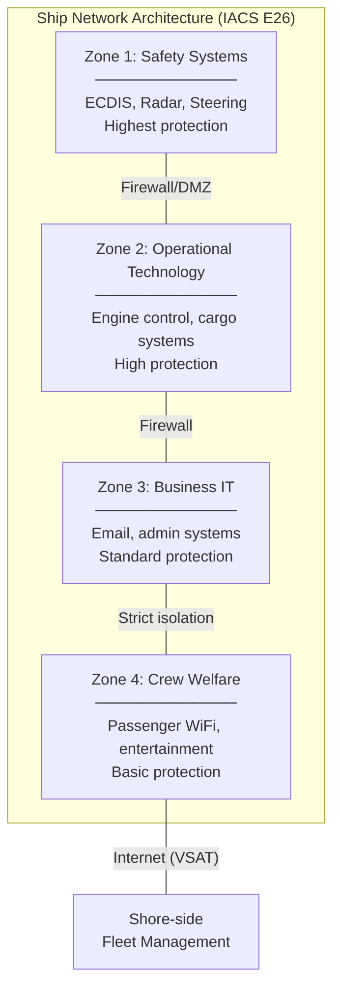

# Marine & Maritime Standards — Comprehensive Overview

**Category:** 30 — Marine & Maritime Standards  
**Document:** 00 — Standards Landscape Overview  
**Scope:** IMO SOLAS, ISM Code, IEC 61162, classification societies, ECDIS, cybersecurity  
**Key Standards:** SOLAS, MARPOL, IEC 60945, IEC 61162, IACS UR E26/E27  
**Audience:** Marine electronics engineers, ship automation designers, classification surveyors  
**Prerequisites:** Basic maritime operations knowledge

---

## Chapter 1 — Historical Context

### 1.1 Disasters Driving Maritime Standards

| Year | Disaster | Impact | Standard Created/Updated |
|------|----------|--------|------------------------|
| 1912 | RMS Titanic (1,500 dead) | Inadequate lifeboats, no radio watch | SOLAS 1914 (first edition) |
| 1967 | Torrey Canyon (120,000 tons oil) | First major tanker disaster | MARPOL development |
| 1978 | Amoco Cadiz (1.6M barrels) | Total structural failure | SOLAS 1978 Protocol |
| 1987 | Herald of Free Enterprise (193 dead) | Open bow doors, capsized | ISM Code development |
| 1989 | Exxon Valdez (37,000 tons) | Environmental catastrophe | OPA 90 (USA); double hull mandate |
| 1994 | Estonia ferry (852 dead) | Ro-Ro bow visor failure | SOLAS Chapter II-1 update |
| 2002 | Prestige tanker (77,000 tons) | Single hull tanker broke apart | Accelerated double-hull timeline |
| 2012 | Costa Concordia (32 dead) | Human factors, nav negligence | Updated ISM Code enforcement |
| 2017 | NotPetya hits Maersk (A.P. Moller) | $300M cyber damage, all systems down | IMO maritime cybersecurity guidelines |
| 2021 | Ever Given Suez blockage | Supply chain disruption | Autonomous ship discussion |

### 1.2 Standards Governance Architecture

```mermaid
graph TB
    subgraph "International (IMO)"
        IMO[International Maritime Organization<br/>UN specialized agency, London]
        SOLAS[SOLAS Convention<br/>Safety of Life at Sea]
        MARPOL[MARPOL Convention<br/>Marine Pollution]
        ISM[ISM Code<br/>Safety Management]
    end
    
    subgraph "Technical Standards (IEC/ISO)"
        IEC60945[IEC 60945<br/>Navigation Equipment General]
        IEC61162[IEC 61162<br/>Digital Interfaces (NMEA)]
        IEC62287[IEC 62287<br/>AIS Equipment]
    end
    
    subgraph "Classification Societies (IACS)"
        DNV[DNV<br/>Det Norske Veritas]
        LR[Lloyd's Register]
        ABS[American Bureau<br/>of Shipping]
        BV[Bureau Veritas]
        CLNK[ClassNK<br/>Japan]
    end
    
    IMO --> SOLAS
    IMO --> MARPOL
    IMO --> ISM
    SOLAS --> IEC60945
    SOLAS --> IEC61162
    SOLAS --> IEC62287
    SOLAS -->|"Rules complement"| DNV
    SOLAS -->|"Rules complement"| LR
```

---

## Chapter 2 — SOLAS Convention (Safety of Life at Sea)

### 2.1 Chapter Structure

| Chapter | Title | Key Content |
|---------|-------|-------------|
| I | General provisions | Definitions, application, surveys |
| II-1 | Construction | Structure, subdivision, stability, machinery |
| II-2 | Fire protection | Detection, extinction, fire safety systems |
| III | Life-saving appliances | Lifeboats, life rafts, survival craft |
| IV | Radiocommunications | GMDSS (Global Maritime Distress & Safety) |
| V | Safety of navigation | ECDIS, AIS, VDR, LRIT, navigation equipment |
| VI | Carriage of cargoes | General cargo requirements |
| VII | Carriage of dangerous goods | IMDG Code compliance |
| VIII | Nuclear ships | Nuclear-powered vessel requirements |
| IX | Management (ISM Code) | Safety management systems |
| X | Safety of HSC | High-speed craft safety |
| XI-1 | Special measures | Ship inspection, ISPS Code |
| XI-2 | Maritime security | ISPS Code implementation |
| XII | Bulk carrier safety | Additional structural requirements |
| XIII | Verification of compliance | IMO Audit Scheme |
| XIV | Polar Code | Polar waters operation |

### 2.2 SOLAS Chapter V — Navigation Equipment Requirements

Equipment required by vessel type and tonnage:

| Equipment | GT ≥ 500 | GT ≥ 3,000 | GT ≥ 10,000 | GT ≥ 50,000 | Standard |
|-----------|----------|-----------|------------|-------------|---------|
| ECDIS | Required | Required | Required | Required | IEC 61174 |
| AIS Class A | Required | Required | Required | Required | IEC 62287 |
| Radar (X-band) | Required | Required | Required | Required | IEC 62388 |
| Radar (S-band) | — | Required | Required | Required | IEC 62388 |
| VDR | — | Required | Required | Required | IEC 61996 |
| LRIT | Required | Required | Required | Required | Reg. V/19-1 |
| GNSS | Required | Required | Required | Required | IEC 61108 |
| Speed log | Required | Required | Required | Required | IEC 61023 |
| Echo sounder | Required | Required | Required | Required | IEC 61174 |
| AIS SART / EPIRB | Required | Required | Required | Required | IEC 61097 |

---

## Chapter 3 — IEC Marine Standards

### 3.1 IEC 61162 — Digital Interfaces

| Part | Title | Protocol | Application |
|------|-------|----------|-------------|
| IEC 61162-1:2016 | Single talker, multiple listeners | NMEA 0183 based (serial 4800/38400 baud) | Legacy bridge equipment |
| IEC 61162-2 | High-speed serial | RS-422, higher rates | AIS data links |
| IEC 61162-3:2010 | Instrument serial networks | Serial multi-talker | Distributed instruments |
| IEC 61162-450:2018 | Multiple talkers/listeners (Ethernet) | UDP multicast over Ethernet | Modern bridge systems |
| IEC 61162-460:2015 | Ethernet interconnection (IBS) | TCP/IP + multicast | Integrated bridge |

### 3.2 IEC 60945 — General Requirements for Maritime Navigation

All bridge equipment must meet IEC 60945 environmental requirements:

| Test | Requirement | Notes |
|------|------------|-------|
| Temperature | -15°C to +55°C (Category: Protected) | Exposed: -25°C to +70°C |
| Humidity | 75% at 40°C (6 days) | No condensation on internals |
| Vibration | 2-13.2 Hz ±1mm; 13.2-100 Hz 7m/s² | Ship-borne vibration profile |
| Inclination | ±22.5° roll, ±10° pitch | Must remain operational |
| Supply voltage | ±10% nominal DC; -20% to +10% AC | Voltage sag immunity |
| EMC | IEC 60533 (maritime EMC) | Radiated + conducted |
| Compass safe distance | Defined per equipment | Magnetic interference |
| IP rating | IP22 (bridge) / IP56 (exposed deck) | Ingress protection |

---

## Chapter 4 — Maritime Cybersecurity

### 4.1 IMO Guidelines (MSC-FAL.1/Circ.3)

In 2017, IMO adopted Resolution MSC.428(98) requiring cybersecurity in Safety Management Systems (ISM Code) by January 2021.

### 4.2 IACS Unified Requirements E26 & E27 (Mandatory from July 2024)

| UR | Title | Scope | Key Requirements |
|----|-------|-------|-----------------|
| E26 | Cyber Resilience of Ships | Ship-level cybersecurity | Asset inventory, zones/conduits, network segregation, monitoring |
| E27 | Cyber Resilience of On-Board Systems | Equipment/system level | Supplier security requirements, hardening, access control |

**E26 Security Zones (based on IEC 62443):**



### 4.3 Notable Maritime Cyber Incidents

| Year | Incident | Impact | Lessons |
|------|----------|--------|---------|
| 2017 | NotPetya hits Maersk | $300M; entire IT rebuild; 10 days offline | IT/OT segregation critical |
| 2018 | COSCO shipping ransomware | US operations disrupted for weeks | Backup/recovery planning |
| 2019 | GPS spoofing (Black Sea, 20+ ships) | Ships displayed incorrect positions | GNSS integrity monitoring |
| 2020 | MSC Mediterranean (ransomware) | Booking systems offline 5 days | Supply chain resilience |
| 2021 | Port of Houston (APT attempt) | Password spray on OT systems | Port cybersecurity framework |

---

## Chapter 5 — Autonomous Ships (MASS)

### 5.1 IMO MASS Degrees of Autonomy

| Degree | Description | Human Role | Status |
|--------|-------------|-----------|--------|
| 1 | Ship with automated processes and decision support | Onboard crew controls | Current technology |
| 2 | Remotely controlled with seafarers on board | Remote + onboard backup | Pilot projects |
| 3 | Remotely controlled without seafarers | Remote operator shore-based | Trials (Yara Birkeland) |
| 4 | Fully autonomous | No human intervention | Research phase |

### 5.2 MASS-Relevant Standards

| Standard | Organization | Scope |
|----------|-------------|-------|
| IMO MSC.1/Circ.1638 | IMO | MASS regulatory scoping exercise |
| DNV Cyber SECURE notation | DNV | Autonomous vessel cybersecurity |
| ISO 19847:2018 | ISO | Shipboard data servers |
| ISO 19848:2018 | ISO | Standard data for ship machinery |
| IEEE P2061 (draft) | IEEE | Unmanned maritime vehicles |
| Lloyd's Register ShipRight | LR | Autonomous ship class notation |
| BV NR 680 | Bureau Veritas | Autonomous navigation notation |

---

## Chapter 6 — Classification Society Comparison

| Feature | DNV | Lloyd's Register | ABS | Bureau Veritas | ClassNK |
|---------|-----|-----------------|-----|---------------|---------|
| Headquarters | Oslo, Norway | London, UK | Houston, USA | Paris, France | Tokyo, Japan |
| Fleet share | ~21% of GT | ~14% of GT | ~11% of GT | ~10% of GT | ~20% of GT |
| Cyber notation | Cyber Secure | Cyber Enabled | CyberSafety | NI 641 | CyberSecurity |
| Autonomous notation | DNV AUT | ShipRight | Guide for autonomous | NR 680 | ClassNK MASS |
| Green notation | CLEAN Design | ECO notation | ENVIRO | Clean Ship | EEDI notation |

---

## Chapter 7 — Environmental (MARPOL)

### 7.1 MARPOL Annexes

| Annex | Scope | Key 2020s Requirement |
|-------|-------|----------------------|
| I | Oil pollution | Double hull mandatory; IOPP certificate |
| II | Noxious liquid substances | Discharge standards for chemicals |
| III | Harmful substances in packages | IMDG Code compliance |
| IV | Sewage | Sewage treatment equipment mandatory |
| V | Garbage | Zero discharge (except food waste) |
| VI | Air pollution | IMO 2020: 0.5% sulfur cap (was 3.5%) |

### 7.2 IMO 2020 (MARPOL Annex VI) — Sulfur Cap

- **Before 2020:** 3.5% sulfur content in fuel (global)
- **After Jan 2020:** 0.5% sulfur cap globally; 0.1% in ECAs (Emission Control Areas)
- **Compliance options:** VLSFO (very low sulfur fuel oil), LNG, scrubbers, methanol

---

## Chapter 8 — Interview Questions

### Tier 1: Entry-Level
1. What is SOLAS and what chapters does it contain?
2. Explain the difference between IEC 61162-1 and IEC 61162-450.
3. What are the four IMO MASS degrees of autonomy?
4. Name three classification societies and their primary markets.

### Tier 2: Mid-Level
1. How does IEC 60945 environmental testing differ from MIL-STD-810H?
2. Explain IACS UR E26 network zone architecture and its basis in IEC 62443.
3. What equipment is required by SOLAS Chapter V for a 5,000 GT cargo vessel?
4. How does the ISM Code integrate with maritime cybersecurity post-2021?

### Tier 3: Senior/Lead
1. Design a cyber-resilient integrated bridge system meeting IACS E26/E27.
2. How do you approach type approval for ECDIS equipment (IEC 61174)?
3. Explain the regulatory pathway for a Degree 3 autonomous vessel (MASS).
4. How do you ensure GNSS integrity against spoofing attacks in safety-critical navigation?

### Tier 4: Principal
1. Propose a cybersecurity architecture for autonomous container vessels.
2. How should IMO regulations evolve to accommodate AI-based collision avoidance?
3. Design a dual-fuel (LNG + battery) power management system meeting SOLAS + class rules.
4. How do you harmonize DNV, LR, and ABS cyber notations into a unified fleet cybersecurity program?

---

*Document Version: 1.0 | Last Updated: May 2026 | Author: Technology Standards Team*
