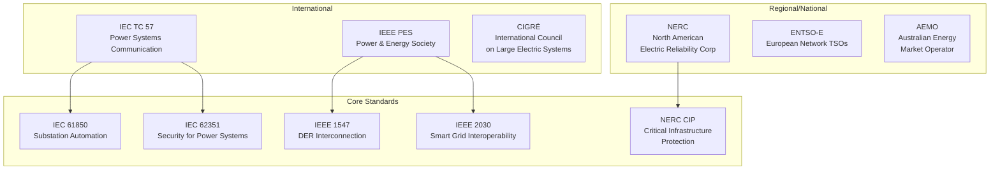
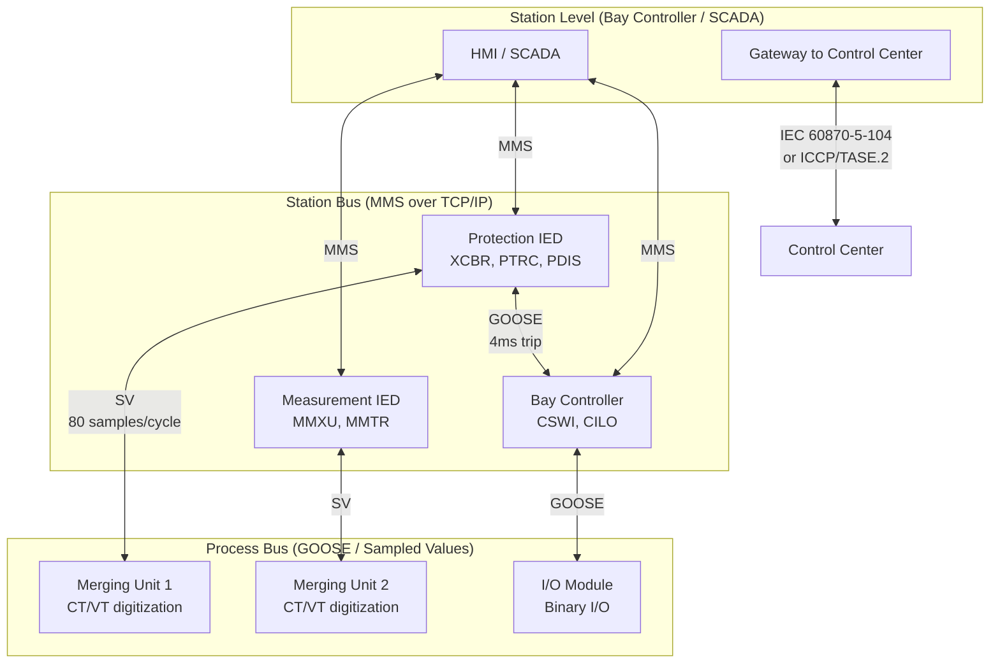

# Energy & Smart Grid Standards — Comprehensive Overview

**Category:** 31 — Energy & Smart Grid  
**Document:** 00 — Standards Landscape Overview  
**Scope:** IEC 61850, NERC CIP, IEEE 1547, Smart Metering, EV Charging, Nuclear I&C  
**Key Standards:** IEC 61850, IEEE 2030, IEC 61851, ISO 15118, OCPP, NERC CIP  
**Audience:** Power systems protection engineers, smart grid architects, EV charging system designers  
**Prerequisites:** Power system fundamentals, networking basics

---

## Chapter 1 — Historical Context

### 1.1 Events Driving Energy Standards

| Year | Event | Impact | Standard Response |
|------|-------|--------|------------------|
| 1965 | Northeast US blackout (30M affected) | Cascading grid failure | NERC formation (1968) |
| 1977 | New York City blackout | Looting, $300M damage | Grid resilience requirements |
| 1979 | Three Mile Island nuclear accident | Partial meltdown | NRC regulations, IEC 61513 |
| 1986 | Chernobyl disaster (USSR) | Catastrophic meltdown | IAEA safety standards overhaul |
| 2003 | Northeast US/Canada blackout (55M) | $6B economic damage | NERC CIP mandatory standards |
| 2010 | Stuxnet (Iran nuclear centrifuges) | First industrial cyber weapon | ICS/SCADA security standards |
| 2011 | Fukushima Daiichi (Japan) | Tsunami → meltdown | IEC 62859, defense-in-depth update |
| 2015 | Ukraine grid cyberattack | 230,000 customers offline | NERC CIP v5/v6 acceleration |
| 2021 | Texas winter storm (Uri) | 4.5M lost power, 246 deaths | Grid weatherization standards |
| 2021 | Colonial Pipeline ransomware | Fuel shortage, $4.4M ransom | Critical infrastructure protection |

### 1.2 Standards Governance Architecture



---

## Chapter 2 — IEC 61850 (Substation Automation)

### 2.1 IEC 61850 Part Structure

| Part | Title | Content |
|------|-------|---------|
| 61850-1 | Introduction & overview | General concepts |
| 61850-2 | Glossary | Terminology |
| 61850-3 | General requirements | Environmental, testing |
| 61850-4 | System & project management | Engineering process |
| 61850-5 | Communication requirements | Performance classes |
| 61850-6 | SCL (Substation Configuration Language) | XML-based engineering |
| 61850-7-1 | Basic communication structure - Principles | Abstract modeling |
| 61850-7-2 | ACSI (Abstract Communication Service Interface) | Service definitions |
| 61850-7-3 | Common Data Classes (CDC) | Data type definitions |
| 61850-7-4 | Logical Node classes | Standard function models |
| 61850-7-420 | DER logical nodes | Distributed energy resources |
| 61850-8-1 | MMS mapping | Manufacturing Message Specification |
| 61850-8-2 | XMPP mapping | Web services mapping |
| 61850-9-2 | Sampled Values | Process bus (analog values) |
| 61850-90-1 | Station-to-station communication | Inter-substation |
| 61850-90-5 | Routable GOOSE/SV | WAN communication |

### 2.2 Communication Architecture



### 2.3 Performance Classes (IEC 61850-5)

| Message Type | Performance Class | Transfer Time | Application |
|-------------|------------------|---------------|-------------|
| Type 1A: Fast Trip | P1: 10ms / P2/3: 3ms | < 3ms (P2/3) | Protection tripping (GOOSE) |
| Type 1B: Fast Other | P1: 100ms / P2/3: 20ms | < 20ms | Interlocking commands |
| Type 2: Medium | P1: 100ms / P2/3: 100ms | < 100ms | Automatic control functions |
| Type 3: Low speed | 500ms | < 500ms | Operator commands |
| Type 4: Raw data | P1: 10ms / P2/3: 3ms | < 3ms (SV) | Sampled Values (process bus) |
| Type 5: File transfer | > 1000ms | > 1000ms | Large data files |
| Type 6: Time sync | — | 1μs (SV), 1ms (GOOSE) | IEEE 1588 PTP / IEC 61588 |

### 2.4 Key Concepts

| Concept | Description | Example |
|---------|-------------|---------|
| **Logical Node (LN)** | Smallest data unit, represents a function | XCBR (circuit breaker), PDIS (distance protection) |
| **Logical Device (LD)** | Container for related LNs | LD for Bay 1 |
| **GOOSE** | Generic Object Oriented Substation Event | Fast multicast pub/sub (binary commands) |
| **Sampled Values (SV)** | Digitized analog measurements | 80/256 samples/cycle from merging units |
| **SCL** | XML configuration language | .scd, .icd, .cid files |
| **Dataset** | Collection of data attributes for reporting/logging | Custom groupings for specific use |

---

## Chapter 3 — NERC CIP (Critical Infrastructure Protection)

### 3.1 CIP Standards Matrix

| Standard | Title | Key Requirements |
|----------|-------|-----------------|
| CIP-002-5.1a | Cyber System Categorization | Identify & categorize BES Cyber Systems (High/Medium/Low) |
| CIP-003-8 | Security Management Controls | Security policies, access management for Low impact |
| CIP-004-6 | Personnel & Training | Background checks, security awareness training |
| CIP-005-7 | Electronic Security Perimeters | Network segmentation, ESP boundaries, remote access |
| CIP-006-6 | Physical Security | PSP (Physical Security Perimeters), access control |
| CIP-007-6 | System Security Management | Ports/services, patches, malicious code, logging |
| CIP-008-6 | Incident Reporting | Cybersecurity incident response plans |
| CIP-009-6 | Recovery Plans | Recovery plan, backup, testing |
| CIP-010-4 | Configuration Change Mgmt | Baseline configuration, vulnerability assessments |
| CIP-011-3 | Information Protection | BES Cyber System Information protection |
| CIP-012-1 | Communication Links | Protection of communication between control centers |
| CIP-013-2 | Supply Chain Risk Mgmt | Vendor risk management for medium/high impact |
| CIP-014-3 | Physical Security (Substations) | Transmission station physical protection |

### 3.2 Impact Rating Categories

| Rating | Criteria | Compliance Burden |
|--------|----------|-----------------|
| **High Impact** | Control centers controlling 1500+ MW; cranking paths; blackstart | Full CIP compliance (all standards) |
| **Medium Impact** | Generation ≥ 1500 MW aggregate; transmission ≥ 200 kV; certain control centers | Most CIP requirements apply |
| **Low Impact** | All other BES Cyber Systems | CIP-003 (simplified security plan) |

### 3.3 Penalties

- **NERC:** Up to $1,000,000 per violation per day
- **FERC:** Can increase penalties up to $1,437,317 per violation per day (inflation adjusted)
- **Highest known fine:** $10,000,000 (unnamed utility, 127 violations, 2019)

---

## Chapter 4 — IEEE 1547 (Distributed Energy Resources)

### 4.1 IEEE 1547-2018 Categories

| Category | Description | Capability | Application |
|----------|-------------|-----------|-------------|
| Category I | DER with minimal grid support | Cease to energize only | Small residential solar |
| Category II | DER with performance capabilities | Voltage/frequency ride-through | Commercial solar, small wind |
| Category III | Full grid support required | Active voltage regulation, frequency response | Utility-scale DER, microgrids |

### 4.2 Key Performance Requirements

| Function | IEEE 1547-2018 Requirement | Notes |
|----------|---------------------------|-------|
| Voltage ride-through | Category III: ride through to 0.5 pu for 0.16s | Replaces old "trip at 0.88 pu" |
| Frequency ride-through | 57.0 - 61.8 Hz continuous operation | Mandatory for Category II/III |
| Volt-VAR | Mandatory for Category II/III | Autonomous voltage regulation |
| Freq-Watt | Must be capable; may be activated | Primary frequency response |
| Ramp rate | Default 10% Prated per minute (soft start) | Prevents voltage flicker |
| Anti-islanding | Required unless intentional island | 2-second detection |

---

## Chapter 5 — EV Charging Standards

### 5.1 Standards Ecosystem

```mermaid
graph TB
    subgraph "Physical / Electrical"
        IEC61851[IEC 61851<br/>EV Conductive Charging]
        J1772[SAE J1772<br/>AC Connector (NA)]
        CCS[CCS (Combined<br/>Charging System)]
        CHADEMO[CHAdeMO<br/>DC Fast Charge]
        NACS[NACS (Tesla)<br/>SAE J3400]
        GB[GB/T<br/>China National]
    end
    
    subgraph "Communication (Vehicle ↔ EVSE)"
        ISO15118[ISO 15118<br/>V2G Communication]
        DIN70121[DIN 70121<br/>DC communication (legacy)]
    end
    
    subgraph "Network (EVSE ↔ Backend)"
        OCPP[OCPP 2.0.1<br/>Open Charge Point Protocol]
        OCPI[OCPI 2.2.1<br/>Open Charge Point Interface]
        OICP[OICP (Hubject)<br/>Roaming protocol]
    end
    
    IEC61851 --> J1772
    IEC61851 --> CCS
    CCS --> ISO15118
    CHADEMO --> DIN70121
    NACS --> ISO15118
    ISO15118 --> OCPP
    OCPP --> OCPI
```

### 5.2 IEC 61851 Modes

| Mode | Description | Max Power | Example |
|------|-------------|----------|---------|
| Mode 1 | AC charging, standard socket, no communication | 3.7 kW | Domestic socket (non-US) |
| Mode 2 | AC charging, standard socket + ICCB (in-cable control) | 7.4 kW | Portable EVSE |
| Mode 3 | AC charging, dedicated EVSE with control pilot | 22 kW (3-phase) | Wallbox, public AC |
| Mode 4 | DC charging, dedicated EVSE | 350+ kW | DC fast charger (CCS/CHAdeMO) |

### 5.3 ISO 15118 — Vehicle-to-Grid Communication

| Part | Title | Key Feature |
|------|-------|-------------|
| 15118-1 | General info & use case definition | V2G overview |
| 15118-2 | Network/application protocol (AC) | Plug & Charge, smart charging |
| 15118-3 | Physical/data link layer (PLC) | HomePlug Green PHY |
| 15118-4 | Network/transport protocol conformance | Test specifications |
| 15118-20 | 2nd generation (DC, WPT, bidirectional) | Bidirectional power transfer (V2G/V2H) |

### 5.4 OCPP 2.0.1

| Feature | OCPP 1.6 | OCPP 2.0.1 |
|---------|----------|-------------|
| Transport | SOAP/JSON over WebSocket | JSON over WebSocket only |
| Security | Optional TLS | Mandatory TLS + security profiles |
| Smart charging | Basic (profiles) | Advanced (ISO 15118 integration) |
| Device management | Basic | Component/variable model |
| Firmware update | Simple download | Signed firmware with certificate |
| ISO 15118 support | None | Full Plug & Charge certificate mgmt |

---

## Chapter 6 — Grid Security (IEC 62351)

### 6.1 IEC 62351 Parts

| Part | Title | Application |
|------|-------|-------------|
| 62351-1 | Introduction | Overview of security approach |
| 62351-3 | Security for TCP/IP profiles | TLS for IEC 61850 MMS, ICCP |
| 62351-4 | Security for MMS | Application layer security |
| 62351-5 | Security for IEC 60870-5/104 | Legacy SCADA protocols |
| 62351-6 | Security for IEC 61850 GOOSE/SV | Multicast authentication (GMAC) |
| 62351-7 | Network & System Management (NSM) | Monitoring, event logging |
| 62351-8 | Role-Based Access Control (RBAC) | Authorization framework |
| 62351-9 | Cyber Security Key Management | PKI, certificate management |
| 62351-10 | Security architecture guidelines | Defense-in-depth for utilities |
| 62351-14 | Cyber security event logging | SIEM integration |

---

## Chapter 7 — Nuclear Safety I&C Standards

### 7.1 IEC 61513 Nuclear Hierarchy

| Standard | Title | Role |
|----------|-------|------|
| IEC 61513:2011 | Nuclear I&C - General requirements | Overarching nuclear I&C standard |
| IEC 61226:2009 | Classification of I&C functions | Safety categories A, B, C |
| IEC 60880:2006 | Software for Category A functions | Highest safety software standard |
| IEC 62138:2018 | Software for Categories B & C | Non-safety / lower safety |
| IEC 61500:2009 | Data communication in nuclear | Communication requirements |
| IEC 62340:2007 | CCF (Common Cause Failure) | Diversity & defense-in-depth |

### 7.2 Nuclear Safety Categories

| Category | Function Example | Software Standard | Diversity Required |
|----------|-----------------|------------------|-------------------|
| A (Safety) | Reactor trip, ECCS actuation | IEC 60880 | Yes (CCF mitigation) |
| B (Safety-related) | Post-accident monitoring | IEC 62138 | Recommended |
| C (Important) | Control rod position | IEC 62138 | No |
| Non-categorized | Plant historian | General standards | No |

---

## Chapter 8 — Future Trends

### 8.1 Grid Modernization

| Trend | Standards Activity | Timeline |
|-------|-------------------|----------|
| Grid-forming inverters | IEEE 2800 (expected update) | 2024-2026 |
| Hydrogen integration | IEC TC 105 (fuel cells) | 2024-2028 |
| Vehicle-to-Grid (V2G) at scale | ISO 15118-20 deployment | 2025-2030 |
| Battery energy storage (BESS) | IEC 62933, UL 9540A | Ongoing |
| Digital twins for substations | IEC 61850-90-x extensions | 2025-2027 |
| FLISR (Fault Location Isolation Service Restoration) | IEEE 1547 + IEC 61850 | Deployed (ongoing) |

---

## Chapter 9 — Interview Questions

### Tier 1: Entry-Level
1. What are GOOSE and Sampled Values in IEC 61850?
2. Explain the difference between NERC CIP High, Medium, and Low impact ratings.
3. What is the purpose of IEEE 1547 and its three categories?
4. Name the four IEC 61851 charging modes.

### Tier 2: Mid-Level
1. Explain IEC 61850 SCL file types (SSD, ICD, SCD, CID) and their roles in engineering workflow.
2. How does IEC 62351-6 secure GOOSE messages without breaking performance requirements?
3. Design an OCPP 2.0.1 deployment architecture with ISO 15118 Plug & Charge support.
4. What are NERC CIP-005 Electronic Security Perimeter requirements for a medium-impact substation?

### Tier 3: Senior/Lead
1. Design an IEC 61850 process bus architecture for a 400 kV substation with redundancy.
2. How do you achieve NERC CIP compliance for a hybrid IT/OT control center?
3. Explain the IEEE 1547-2018 ride-through requirements and their impact on inverter firmware design.
4. How do you implement IEC 62351 key management across 500+ substations?

### Tier 4: Principal
1. Design a grid architecture integrating 50% renewable DER using IEEE 2030 + IEC 61850 + IEEE 1547.
2. How should NERC CIP evolve to address cloud-based SCADA and distributed control?
3. Propose a cybersecurity architecture for V2G infrastructure meeting ISO 15118-20 + IEC 62351 + NERC CIP.
4. How do you design defense-in-depth for nuclear I&C meeting IEC 61513 with modern digital platforms?

---

*Document Version: 1.0 | Last Updated: May 2026 | Author: Technology Standards Team*
