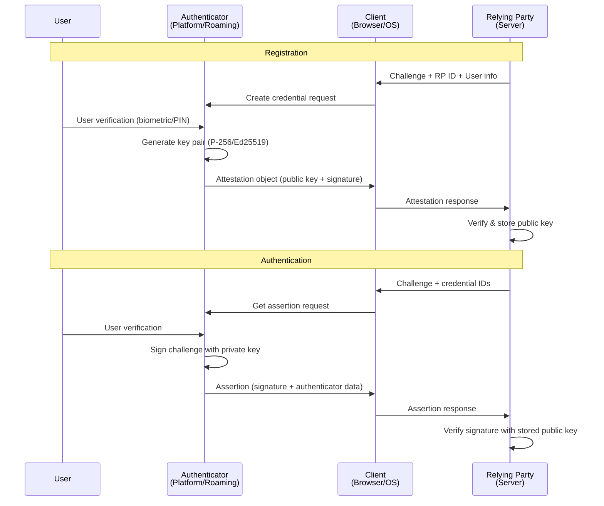
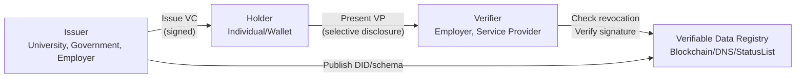

# Digital Identity & Authentication Standards — Comprehensive Overview

**Category:** 32 — Digital Identity & Authentication  
**Document:** 00 — Standards Landscape Overview  
**Scope:** FIDO2/Passkeys, NIST 800-63, eIDAS, e-passport, biometrics, decentralized identity  
**Key Standards:** FIDO2/WebAuthn, NIST SP 800-63, eIDAS 2.0, ISO 19794, W3C DID/VC  
**Audience:** Identity architects, authentication engineers, PKI specialists, IAM designers  
**Prerequisites:** Cryptography fundamentals, web security basics

---

## Chapter 1 — Historical Context

### 1.1 Identity Standard Evolution

| Year | Milestone | Impact |
|------|-----------|--------|
| 1988 | X.500 Directory Services (ITU-T) | Hierarchical identity model foundation |
| 1993 | X.509v3 certificates | PKI foundation, still dominant |
| 1998 | ICAO e-passport program begins | Machine-readable biometric travel documents |
| 2002 | SAML 1.0 (OASIS) | First federated identity standard |
| 2005 | OpenID 1.0 | Decentralized web authentication |
| 2006 | NIST SP 800-63 (first edition) | US federal identity assurance levels |
| 2007 | OAuth 1.0 | Delegated authorization |
| 2012 | OAuth 2.0 (RFC 6749) | Modern authorization framework |
| 2014 | eIDAS Regulation (EU) | EU-wide electronic identity recognition |
| 2014 | FIDO U2F specification | Hardware second-factor authentication |
| 2019 | FIDO2/WebAuthn (W3C Recommendation) | Passwordless authentication standard |
| 2022 | Passkeys (Apple/Google/Microsoft) | Consumer passwordless adoption |
| 2024 | eIDAS 2.0 (EU Digital Identity Wallet) | European Digital Identity Wallet mandate |

### 1.2 Standards Landscape Architecture

```mermaid
graph TB
    subgraph "Authentication"
        FIDO2[FIDO2<br/>WebAuthn + CTAP2]
        OATH[OATH TOTP/HOTP<br/>RFC 6238/4226]
        SAML[SAML 2.0<br/>Enterprise SSO]
        OIDC[OpenID Connect<br/>Consumer/Enterprise]
    end
    
    subgraph "Identity Assurance"
        NIST[NIST SP 800-63<br/>A/B/C (IAL/AAL/FAL)]
        EIDAS[eIDAS 2.0<br/>EU Digital Identity]
        ISO29115[ISO/IEC 29115<br/>Entity Authentication]
    end
    
    subgraph "Biometrics"
        ISO19794[ISO/IEC 19794<br/>Biometric Data Formats]
        ISO30107[ISO/IEC 30107<br/>Presentation Attack Detection]
        ICAO9303[ICAO Doc 9303<br/>Machine Readable Travel Documents]
    end
    
    subgraph "Decentralized Identity"
        DID[W3C DID<br/>Decentralized Identifiers]
        VC[W3C VC<br/>Verifiable Credentials]
        SIOP[Self-Issued OpenID Provider<br/>SIOP v2]
    end
    
    FIDO2 --> NIST
    OIDC --> NIST
    NIST --> EIDAS
    ISO19794 --> ICAO9303
    DID --> VC
    VC --> EIDAS
```

---

## Chapter 2 — FIDO2 / WebAuthn / Passkeys

### 2.1 Architecture



### 2.2 FIDO2 Component Comparison

| Component | WebAuthn (W3C) | CTAP2 (FIDO Alliance) | Passkeys |
|-----------|---------------|----------------------|----------|
| Specification | W3C Web Authentication API | Client to Authenticator Protocol | WebAuthn + cloud sync |
| Scope | Browser ↔ Relying Party | Client ↔ Authenticator (USB/NFC/BLE) | Cross-device credentials |
| Key storage | Platform authenticator or roaming | Hardware authenticator | Cloud-synced (iCloud/Google) |
| Discoverable credentials | Supported (resident keys) | Required for CTAP2.1 | Always discoverable |
| Cross-device | Limited to authenticator | Via NFC/BLE/USB | Automatic via cloud account |
| Phishing resistance | Yes (RP ID binding) | Yes | Yes |

### 2.3 Attestation Types

| Type | Description | Privacy | Use Case |
|------|-------------|---------|----------|
| None | No attestation | Maximum privacy | Consumer registration |
| Self | Self-signed by credential key | High privacy | Low-assurance registration |
| Basic | Signed by authenticator cert | Medium privacy | Enterprise enrollment |
| AttCA | Attestation CA (anonymization) | Medium-high privacy | Privacy-respecting enterprise |
| ECDAA | Direct Anonymous Attestation | High privacy (no linkability) | Government/privacy-critical |

---

## Chapter 3 — NIST SP 800-63 (Digital Identity Guidelines)

### 3.1 Assurance Levels

| Volume | Level 1 | Level 2 | Level 3 |
|--------|---------|---------|---------|
| **800-63A: IAL (Identity Assurance)** | Self-asserted identity; no proofing | Remote or in-person proofing; evidence verification | In-person (or supervised remote); physical document + biometric |
| **800-63B: AAL (Authenticator Assurance)** | Single factor (password ok) | Multi-factor required; approved authenticators | Hardware-based MFA; verifier impersonation resistant |
| **800-63C: FAL (Federation Assurance)** | Bearer assertion; no holder-of-key | Signed assertion; audience restriction | Holder-of-key; encrypted assertion |

### 3.2 Authenticator Types (800-63B)

| Authenticator Type | AAL1 | AAL2 | AAL3 | Phishing Resistant |
|-------------------|------|------|------|-------------------|
| Memorized secret (password) | ✓ | ✗ (alone) | ✗ | No |
| Look-up secret (recovery codes) | ✓ | ✗ (alone) | ✗ | No |
| Out-of-band (push notification) | ✓ | ✓ (MF) | ✗ | No |
| Single-factor OTP device | ✓ | ✓ (with password) | ✗ | No |
| Multi-factor OTP device | ✓ | ✓ | ✗ | No |
| Single-factor crypto software | ✓ | ✓ (with password) | ✗ | Yes |
| Single-factor crypto device | ✓ | ✓ (with password) | ✓ (multi-factor) | Yes |
| Multi-factor crypto device | ✓ | ✓ | ✓ | Yes |

### 3.3 Password Guidelines (SP 800-63B §5.1.1)

| Requirement | Old (Pre-2017) | NIST 800-63B (Current) |
|-------------|---------------|----------------------|
| Minimum length | 8 characters | 8 characters (min), prefer ≥ 15 |
| Maximum length | Often 16-20 | At least 64 characters supported |
| Complexity rules | Upper/lower/number/special | NOT REQUIRED (user choice) |
| Rotation policy | Every 90 days | Only on evidence of compromise |
| Blocklists | Not specified | REQUIRED (breached password lists) |
| Composition hints | Mandated | Meter/strength feedback preferred |

---

## Chapter 4 — eIDAS 2.0 (European Digital Identity)

### 4.1 EU Digital Identity Wallet (EUDIW) Architecture

```mermaid
graph TB
    subgraph "Wallet Ecosystem"
        WALLET[EU Digital Identity Wallet<br/>─ PID (Person Identification Data)<br/>─ QEAA (Qualified Electronic Attestations)<br/>─ QES (Qualified Electronic Signatures)]
        
        ISSUER[Issuer<br/>(Member State / Trusted Provider)]
        VERIFIER[Relying Party / Verifier<br/>(Online services, government, etc.)]
        TRUST[EU Trust Framework<br/>─ Trusted Lists<br/>─ Qualified Trust Services]
    end
    
    ISSUER -->|"Issue PID/attestation"| WALLET
    WALLET -->|"Present credential<br/>(selective disclosure)"| VERIFIER
    VERIFIER -->|"Verify via"| TRUST
    ISSUER -->|"Registered in"| TRUST
```

### 4.2 eIDAS Trust Service Levels

| Service | Qualified (QTS) | Non-Qualified | Difference |
|---------|----------------|---------------|-----------|
| Electronic Signature | QES = handwritten equivalent | Advanced e-signature | Legal presumption of validity |
| Electronic Seal | Qualified seal for legal persons | Advanced seal | EU-wide recognition |
| Time Stamp | Qualified time stamp | Standard time stamp | Legal evidence in courts |
| Registered Delivery | Qualified delivery service | Standard e-delivery | Legal presumption of receipt |
| Website Authentication | QWAC (Qualified Web Auth Cert) | Standard TLS cert | Browser trust indicator |

### 4.3 Architecture of Remote Qualified Electronic Signatures (QSCD)

| Component | Requirement | Standard |
|-----------|------------|---------|
| Signature Creation Device | Qualified SCD (QSCD) | EN 419 211/241 |
| Crypto algorithms | RSA ≥ 2048, ECDSA ≥ 256, EdDSA | ETSI TS 119 312 |
| TSP audit | Conformity assessment body (CAB) | ETSI EN 319 401 |
| Certificate profile | eIDAS qualified certificate | ETSI EN 319 412 |
| Signing protocol | Remote signing (CSC API) | ETSI TS 119 432 |

---

## Chapter 5 — Biometric Standards

### 5.1 ISO/IEC 19794 Data Interchange Formats

| Part | Biometric Modality | Key Content |
|------|-------------------|-------------|
| 19794-1 | Framework | General architecture |
| 19794-2 | Finger minutiae | Minutiae point format (Type 1-4) |
| 19794-4 | Finger image | Compressed/uncompressed fingerprint images |
| 19794-5 | Face image | Full frontal, token face images (ICAO compatible) |
| 19794-6 | Iris image | Rectilinear/polar iris image format |
| 19794-7 | Signature/sign (dynamic) | Online signature time series |
| 19794-8 | Finger pattern (skeletal) | Ridge pattern representations |
| 19794-9 | Vascular image | Finger/palm vein patterns |
| 19794-11 | Processed signature (dynamic) | Signature verification data |
| 19794-14 | DNA data | STR (Short Tandem Repeat) profiles |
| 19794-15 | Palm print | Full palm minutiae/image |

### 5.2 ISO/IEC 30107 — Presentation Attack Detection (PAD)

| Part | Title | Content |
|------|-------|---------|
| 30107-1 | Framework | PAD terminology, concepts |
| 30107-2 | Data formats | Attack presentation data format |
| 30107-3 | Testing & reporting | APCER/BPCER metrics, evaluation methodology |
| 30107-4 | Profile for mobile devices | Smartphone-specific PAD requirements |

**Key Metrics:**
- **APCER** (Attack Presentation Classification Error Rate): % of attacks classified as bona fide
- **BPCER** (Bona Fide Presentation Classification Error Rate): % of legitimate users rejected

### 5.3 ICAO Doc 9303 (Machine Readable Travel Documents)

| Part | Title | Content |
|------|-------|---------|
| Part 1 | Introduction | Overall framework |
| Part 3 | MRZ specifications | Machine Readable Zone format |
| Part 9 | Deployment of biometrics | Mandatory face; optional finger/iris |
| Part 10 | Logical Data Structure (LDS) | Data group structure in e-passports |
| Part 11 | Security mechanisms | BAC, PACE, AA, PA, EAC |
| Part 12 | Public Key Infrastructure (PKI) | CSCA, DS certificates, CRL |

**E-Passport Security Mechanisms:**

| Mechanism | Purpose | Cryptography |
|-----------|---------|-------------|
| BAC (Basic Access Control) | Prevent eavesdropping of NFC | 3DES key derived from MRZ |
| PACE (Password Authenticated Connection Establishment) | Stronger replacement for BAC | ECDH key agreement |
| PA (Passive Authentication) | Verify data integrity | Digital signature (RSA/ECDSA) |
| AA (Active Authentication) | Clone detection | Challenge-response |
| EAC (Extended Access Control) | Protect fingerprints/iris | Terminal authentication + chip auth |

---

## Chapter 6 — Decentralized Identity (W3C DID/VC)

### 6.1 W3C Decentralized Identifiers (DID)

```
did:example:123456789abcdefghi
└─┘ └─────┘ └──────────────────┘
 │     │              │
scheme  method    method-specific identifier
```

**Common DID Methods:**

| Method | Ledger/Registry | Use Case |
|--------|----------------|----------|
| did:web | DNS/HTTPS | Enterprise DIDs (easy adoption) |
| did:ion | Bitcoin (Layer 2 - Sidetree) | Microsoft ION network |
| did:ethr | Ethereum | ERC-1056 Ethereum identity |
| did:key | None (self-certifying) | Ephemeral/test identities |
| did:ebsi | EBSI (EU Blockchain) | EU cross-border identity |
| did:cheqd | Cheqd network | Payment-enabled credentials |
| did:jwk | None (JWK-based) | Simple self-certifying |

### 6.2 W3C Verifiable Credentials (VC)



### 6.3 VC Format Comparison

| Feature | JWT (JSON Web Token) | JSON-LD + LD-Proofs | SD-JWT | AnonCreds (Hyperledger) |
|---------|---------------------|--------------------|----|------------------------|
| Format | Compact JWT | JSON-LD document | JWT + disclosures | CL-signatures |
| Selective disclosure | No (all-or-nothing) | With BBS+ proofs | Yes (per-claim) | Yes (ZKP) |
| Predicate proofs | No | With BBS+ | Limited | Yes (> 18 without birthday) |
| Unlinkability | No | With BBS+ | Partial | Yes (ZKP) |
| Complexity | Low | High (contexts, graphs) | Medium | High |
| Adoption | Highest | Medium | Growing (IETF) | Niche (Hyperledger) |

---

## Chapter 7 — OAuth 2.0 / OpenID Connect Security

### 7.1 Current Best Practices (OAuth 2.1 / Security BCP)

| Practice | Requirement | Replaces |
|----------|------------|---------|
| PKCE (RFC 7636) | Mandatory for all clients | Implicit flow (deprecated) |
| Exact redirect URI matching | Mandatory | Pattern matching |
| Refresh token rotation | Recommended | Long-lived refresh tokens |
| Sender-constrained tokens (DPoP) | Recommended for high-value | Bearer tokens |
| PAR (Pushed Authorization Requests) | Recommended | Front-channel authz params |
| RAR (Rich Authorization Requests) | For fine-grained consent | Scope-only authorization |
| Implicit flow | DEPRECATED | — |
| ROPC (Resource Owner Password) | DEPRECATED | — |

---

## Chapter 8 — Interview Questions

### Tier 1: Entry-Level
1. Explain the difference between authentication and authorization with standard examples.
2. What are the three NIST 800-63 assurance level types (IAL, AAL, FAL)?
3. How does FIDO2/WebAuthn prevent phishing attacks?
4. What is the difference between OAuth 2.0 and OpenID Connect?

### Tier 2: Mid-Level
1. Walk through a FIDO2 registration and authentication flow including attestation.
2. Explain selective disclosure in Verifiable Credentials (SD-JWT vs. BBS+ vs. AnonCreds).
3. How does eIDAS 2.0 EU Digital Identity Wallet differ from eIDAS 1.0?
4. Design an AAL3-compliant authentication system per NIST 800-63B.

### Tier 3: Senior/Lead
1. Design an enterprise identity platform supporting FIDO2 + OIDC + SAML migration path.
2. How do you implement ISO 30107-3 PAD testing for a mobile biometric system?
3. Architect a Verifiable Credentials issuance/verification platform for a government use case.
4. How do e-passport security mechanisms (BAC/PACE/PA/AA/EAC) work together?

### Tier 4: Principal
1. Design a national digital identity architecture using W3C DID/VC + eIDAS 2.0 wallet + FIDO2.
2. How should NIST 800-63 evolve to incorporate decentralized identity and zero-knowledge proofs?
3. Propose an architecture for cross-border credential verification across EU + UK + US.
4. How do you prevent correlation attacks across Verifiable Credential presentations at scale?

---

*Document Version: 1.0 | Last Updated: May 2026 | Author: Technology Standards Team*
