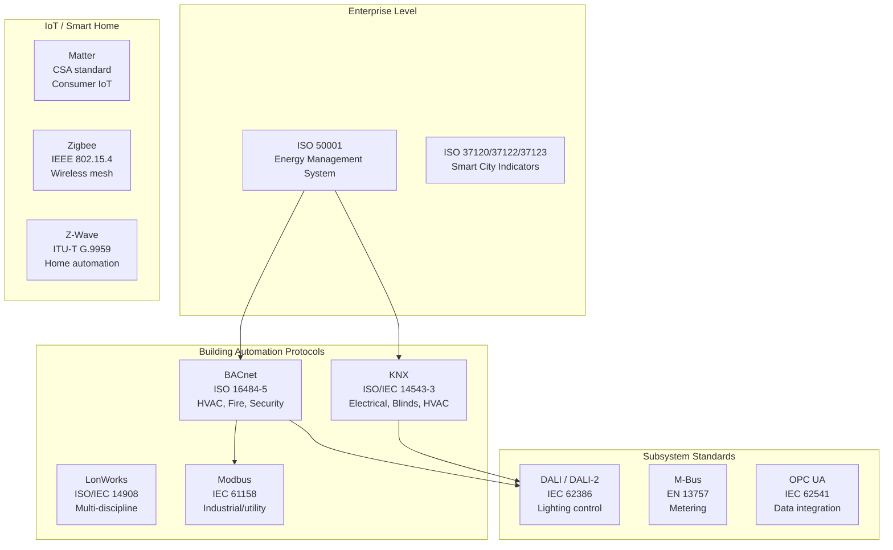
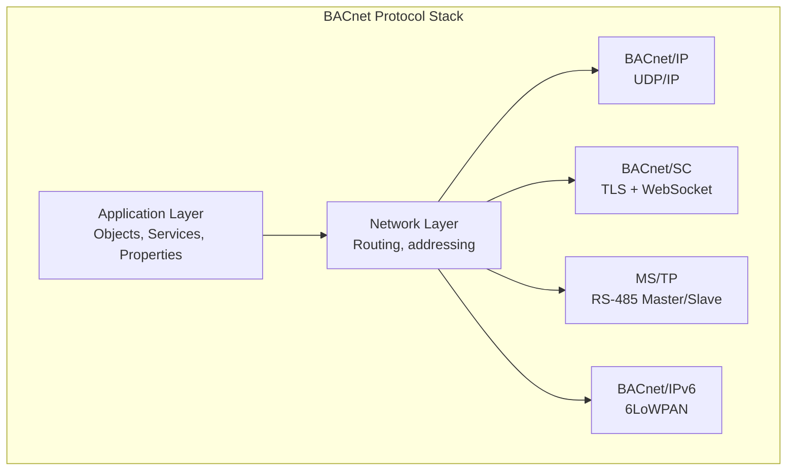
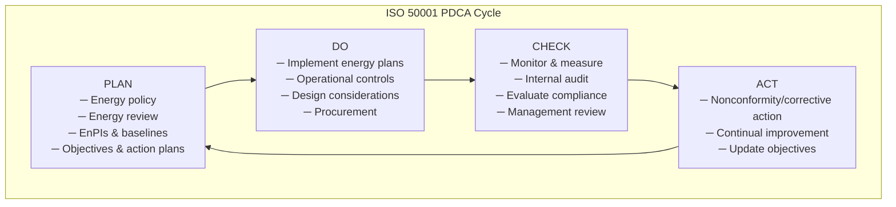
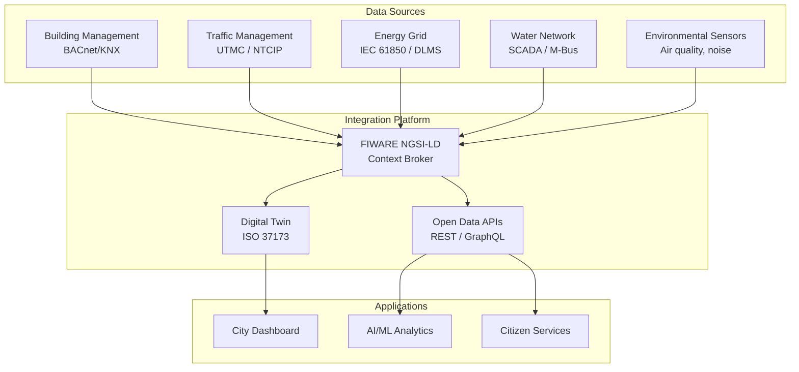

# Building Automation & Smart City Standards — Comprehensive Overview

**Category:** 33 — Building Automation & Smart City  
**Document:** 00 — Standards Landscape Overview  
**Scope:** BACnet, KNX, DALI, ISO 50001, Smart City (ISO 37120), cybersecurity  
**Key Standards:** BACnet (ISO 16484-5), KNX (ISO/IEC 14543-3), IEC 62386 (DALI), ISO 50001  
**Audience:** Building automation engineers, BMS designers, smart city architects  
**Prerequisites:** HVAC fundamentals, networking basics, control system concepts

---

## Chapter 1 — Historical Context

### 1.1 Evolution of Building Automation

| Year | Milestone | Impact |
|------|-----------|--------|
| 1960s | Pneumatic control systems (3-15 PSI) | First centralized building control |
| 1970s | DDC (Direct Digital Control) emerges | Microprocessor-based control replaces pneumatic |
| 1973 | Oil crisis / energy embargo | Energy management systems development |
| 1987 | LonWorks (Echelon Corp) | First peer-to-peer building network |
| 1987 | EIB (European Installation Bus) → KNX | European standard building bus |
| 1991 | BACnet committee formed (ASHRAE 135) | Open building automation protocol |
| 1995 | BACnet becomes ASHRAE Standard 135 | US building automation standard |
| 2003 | BACnet becomes ISO 16484-5 | International recognition |
| 2004 | KNX becomes ISO/IEC 14543-3 | International building control |
| 2011 | ISO 50001 (Energy Management) | Systematic energy efficiency |
| 2014 | ISO 37120 (Smart City indicators) | City performance benchmarking |
| 2015 | DALI-2 (IEC 62386 ed.2) | Modern digital lighting control |
| 2019 | BACnet Secure Connect (BACnet/SC) | Cybersecure BACnet over TLS/WebSocket |
| 2021 | Matter protocol (smart home) | Google/Apple/Amazon unified IoT |

### 1.2 Standards Architecture



---

## Chapter 2 — BACnet (ISO 16484-5)

### 2.1 Protocol Stack



### 2.2 Data Link Options

| Data Link | Medium | Speed | Max Devices | Typical Use |
|-----------|--------|-------|-------------|-------------|
| BACnet/IP | Ethernet/WiFi | 100Mbps+ | Unlimited | Building backbone |
| BACnet/SC | TLS over WebSocket | 100Mbps+ | Unlimited | Cybersecure IT networks |
| MS/TP | RS-485 (EIA-485) | 9.6-76.8 kbps | 254 (127 masters) | Field-level controllers |
| BACnet/IPv6 | 6LoWPAN / Thread | Variable | Mesh limited | IoT sensors |
| ARCNET | Coax/fiber | 2.5 Mbps | 255 | Legacy installations |

### 2.3 Object Model

| Object Type | Typical Use | Key Properties |
|-------------|-------------|----------------|
| Analog Input (AI) | Temperature sensor, pressure | Present-Value, Units, COV-Increment |
| Analog Output (AO) | Valve position, damper | Present-Value, Priority-Array |
| Analog Value (AV) | Setpoint, calculated value | Present-Value, Relinquish-Default |
| Binary Input (BI) | Switch, occupancy sensor | Present-Value, Polarity |
| Binary Output (BO) | Relay, fan on/off | Present-Value, Priority-Array |
| Binary Value (BV) | Schedule override, mode | Present-Value |
| Multi-State Input (MSI) | Fan speed (off/low/med/high) | Present-Value, Number-Of-States |
| Schedule | Time-based operation | Weekly-Schedule, Exception-Schedule |
| Trend Log | Historical data recording | Log-Buffer, Records-Since-Purge |
| Notification Class | Alarm routing | Recipient-List, Priority |
| Loop | PID control | Setpoint, Controlled-Variable-Reference |

### 2.4 Priority Array (Command Prioritization)

| Priority | Description | Typical Use |
|----------|-------------|-------------|
| 1 | Manual-Life Safety | Fire system override |
| 2 | Automatic-Life Safety | Smoke pressurization |
| 3 | Available | — |
| 4 | Available | — |
| 5 | Critical Equipment Control | Chiller staging |
| 6 | Minimum On/Off | Freeze protection |
| 7 | Available | — |
| 8 | Manual Operator | BMS operator command |
| 9 | Available | — |
| 10 | Available | — |
| 11 | Available | — |
| 12 | Available | — |
| 13 | Available | — |
| 14 | Available | — |
| 15 | Available | — |
| 16 | Relinquish Default | Default value (lowest priority) |

### 2.5 BACnet Secure Connect (BACnet/SC)

| Feature | BACnet/IP (legacy) | BACnet/SC |
|---------|-------------------|-----------|
| Transport | UDP (port 47808) | WebSocket over TLS 1.3 |
| Authentication | None native | Mutual TLS (X.509 certificates) |
| Encryption | None native | AES-256-GCM (TLS) |
| NAT traversal | Problematic (BBMD) | Native (WebSocket) |
| Hub concept | BBMD (BACnet Broadcast) | SC Hub (direct connection) |
| Certificate management | N/A | Operational + signing certificates |
| Backward compatibility | — | Requires SC-aware devices |

---

## Chapter 3 — KNX (ISO/IEC 14543-3)

### 3.1 KNX Physical Media

| Medium | Max Speed | Topology | Max Devices | Cable |
|--------|----------|----------|-------------|-------|
| KNX TP (Twisted Pair) | 9.6 kbps | Free topology | 64/line, 256/area | J-Y(St)Y 2×2×0.8mm |
| KNX PL (Power Line) | 1.2 kbps | Existing wiring | 255/domain | Mains wiring |
| KNX RF (Radio Frequency) | 16.384 kbps | Wireless | 256/domain | 868 MHz (EU) |
| KNX IP (IP/Ethernet) | 10/100 Mbps | Standard LAN | Unlimited | Cat5e/Cat6 |

### 3.2 KNX Addressing

```
Physical Address:    Area.Line.Device    (e.g., 1.2.15)
Group Address:       Main/Middle/Sub     (e.g., 1/2/5)
                     or Main/Sub         (e.g., 1/10)
```

### 3.3 KNX vs. BACnet

| Feature | KNX | BACnet |
|---------|-----|--------|
| Primary domain | Electrical, lighting, blinds | HVAC, fire/life safety |
| Architecture | Fully distributed (no server needed) | Client/server + peer |
| Typical device size | Switches, sensors, actuators | Controllers, AHU, chillers |
| Programming tool | ETS (Engineering Tool Software) | Vendor-specific + standard discovery |
| Configuration | Parameterization via ETS | Configuration via objects/properties |
| Interoperability | Strict (certified devices) | Standardized but variable (BTL testing) |
| Cost per point | Higher (certified components) | Lower at scale (open market) |
| Cybersecurity | KNX Secure (since 2019) | BACnet/SC (since 2019) |

---

## Chapter 4 — DALI (Digital Addressable Lighting Interface)

### 4.1 IEC 62386 Structure

| Part | Title | Content |
|------|-------|---------|
| 62386-101 | General requirements (system) | Wiring, topology, protocol basics |
| 62386-102 | General requirements (control gear) | LED drivers, ballasts |
| 62386-103 | General requirements (control devices) | Sensors, switches, controllers |
| 62386-2xx | Particular requirements (gear) | LED (201), fluorescent (202), etc. |
| 62386-3xx | Particular requirements (devices) | Occupancy (303), light (304), etc. |

### 4.2 DALI vs. DALI-2 vs. D4i

| Feature | DALI (Edition 1) | DALI-2 | D4i |
|---------|-----------------|--------|-----|
| Standard | IEC 62386 ed.1 (2009) | IEC 62386 ed.2 (2014+) | Extension of DALI-2 |
| Input devices | Not standardized | Standardized (Part 103) | Standardized |
| Interoperability | Limited (gear only) | Full (gear + devices) | Full + energy data |
| Energy data | None | Optional | Mandatory (luminaire data) |
| Diagnostics | Basic | Enhanced | Full lifetime data |
| Addressing | 64 gear per bus | 64 gear + 64 devices per bus | Same as DALI-2 |
| Certification | Self-declaration | DiiA testing & certification | DiiA D4i certification |

### 4.3 DALI Technical Parameters

| Parameter | Value |
|-----------|-------|
| Bus voltage | 16V typical (11.5-22.5V) |
| Max bus current | 250 mA (per power supply) |
| Max wire length | 300m (1.5mm²) |
| Data rate | 1200 baud (Manchester encoding) |
| Addresses | 64 individual + 16 groups + broadcast |
| Fade time | 0-90.5 seconds (logarithmic curve) |
| Dimming curve | Logarithmic (human perception-matched) |

---

## Chapter 5 — ISO 50001 (Energy Management System)

### 5.1 PDCA Framework



### 5.2 Key Concepts

| Concept | Definition | Example |
|---------|-----------|---------|
| **EnMS** | Energy Management System | Total organizational framework |
| **EnPI** | Energy Performance Indicator | kWh/m²/year (building), kWh/unit (production) |
| **EnB** | Energy Baseline | Reference period for comparison |
| **SEU** | Significant Energy Use | HVAC (typically 40-60% of building energy) |
| **Energy review** | Analysis of energy use & consumption | Identify SEUs, drivers, opportunities |

### 5.3 Integration with Building Automation

| ISO 50001 Requirement | BAS Support | Implementation |
|----------------------|-------------|----------------|
| Monitoring & measurement | BACnet trend logs, M-Bus meters | Sub-metering infrastructure |
| Operational control | BACnet scheduling, optimization | Sequence of operations |
| Energy review | Historical data analysis | Analytics platform integration |
| Performance improvement | Adaptive control, ML optimization | Fault detection & diagnostics |
| Documentation | Automated reporting | BACnet + cloud analytics |

---

## Chapter 6 — Smart City Standards

### 6.1 ISO 37120/37122/37123

| Standard | Title | Indicators | Scope |
|----------|-------|-----------|-------|
| ISO 37120:2018 | Sustainable cities — Indicators for city services and quality of life | 104 indicators | Basic city services |
| ISO 37122:2019 | Smart cities — Indicators | 80 indicators | Smart/digital services |
| ISO 37123:2019 | Resilient cities — Indicators | 68 indicators | Disaster resilience |

### 6.2 ISO 37122 Smart City Indicator Categories

| Category | Example Indicator | Measurement |
|----------|------------------|-------------|
| Economy | % of city area covered by 5G | Coverage percentage |
| Education | % students with 1:1 connected devices | Student ratio |
| Energy | % smart electricity meters | Meter penetration |
| Environment | Real-time air quality monitoring stations per km² | Density |
| Governance | % city services available online | Digital service ratio |
| Health | % electronic health records | EHR penetration |
| Safety | % of area covered by surveillance cameras | Coverage |
| Transportation | % of public transit with real-time info | System coverage |
| Water | Smart water meters as % of connections | Meter penetration |

### 6.3 Smart City Data Integration



---

## Chapter 7 — Building Cybersecurity

### 7.1 Threat Landscape

| Threat | Attack Vector | Impact | Mitigation Standard |
|--------|--------------|--------|-------------------|
| Ransomware on BMS | IT/OT convergence | Loss of HVAC/lighting control | IEC 62443, BACnet/SC |
| Unauthorized access | Default credentials | Full building control | NIST 800-82, KNX Secure |
| Data exfiltration | Unencrypted protocols | Occupancy patterns, schedules | BACnet/SC TLS, KNX IP Secure |
| Physical safety | Override life safety systems | Fire/smoke system disable | IEC 62443 SL-2 minimum |
| Supply chain | Compromised firmware updates | Backdoor in controllers | NIST 800-53 SC family |

### 7.2 IEC 62443 Applied to Buildings

| Security Level | Description | Building Application |
|---------------|-------------|---------------------|
| SL 1 | Casual/coincidental | Non-critical comfort systems |
| SL 2 | Intentional/low resources | Standard BAS operations |
| SL 3 | Sophisticated/moderate resources | Critical facilities (hospitals, data centers) |
| SL 4 | State-sponsored/extended resources | Government, defense buildings |

---

## Chapter 8 — Interview Questions

### Tier 1: Entry-Level
1. What is BACnet and what does the Priority Array accomplish?
2. Explain the difference between KNX TP and KNX IP.
3. What is DALI and how does DALI-2 improve upon the original?
4. Name three ISO 50001 energy management concepts (EnPI, EnB, SEU).

### Tier 2: Mid-Level
1. Compare BACnet/IP vs. BACnet/SC — architecture, security, and migration path.
2. Design a KNX system for a 10-story office building (topology, addressing, integration).
3. Explain how DALI-2 D4i enables predictive maintenance for LED lighting.
4. How does ISO 50001 integrate with BACnet trend logging for continuous commissioning?

### Tier 3: Senior/Lead
1. Design a BACnet/SC migration strategy for an existing 500-controller campus BMS.
2. How do you implement IEC 62443 zones and conduits for a hospital BAS?
3. Architect a smart city data platform using FIWARE NGSI-LD integrating BACnet, KNX, and DLMS.
4. How do you achieve LEED/BREEAM energy targets using ISO 50001 + advanced BAS analytics?

### Tier 4: Principal
1. Design a cybersecure building automation architecture for a critical infrastructure facility.
2. How should BACnet evolve to incorporate cloud-native, AI-driven building optimization?
3. Propose a national smart building standard integrating KNX Secure + BACnet/SC + IEC 62443.
4. How do you design a digital twin platform for a smart city (ISO 37173) connecting millions of BAS points?

---

*Document Version: 1.0 | Last Updated: May 2026 | Author: Technology Standards Team*
