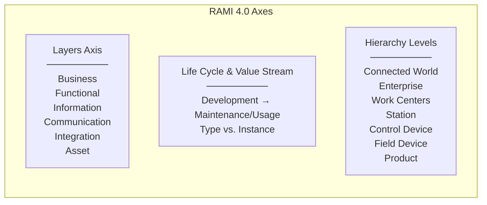
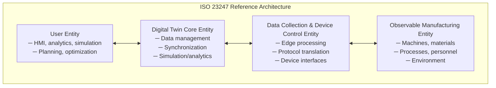

# Industry 4.0 & Digital Twin Standards — Comprehensive Overview

**Category:** 34 — Industry 4.0 & Digital Twin  
**Document:** 00 — Standards Landscape Overview  
**Scope:** RAMI 4.0, ISO 23247, Asset Administration Shell, OPC UA, Additive Manufacturing, ISA-95  
**Key Standards:** IEC 63278 (AAS), ISO 23247, OPC UA (IEC 62541), ISA-95 (IEC 62264)  
**Audience:** Industry 4.0 architects, digital twin engineers, manufacturing integration specialists  
**Prerequisites:** Manufacturing systems knowledge, IT/OT convergence understanding

---

## Chapter 1 — Historical Context

### 1.1 Industrial Revolution Milestones

| Revolution | Era | Technology | Standard Impact |
|-----------|-----|-----------|----------------|
| Industry 1.0 | 1784 | Steam power, mechanization | No formal standards |
| Industry 2.0 | 1870 | Electrical energy, mass production | ISA, IEC formation |
| Industry 3.0 | 1969 | PLC, automation, IT | IEC 61131, ISA-88/95 |
| Industry 4.0 | 2011 | Cyber-Physical Systems, IoT, AI | RAMI 4.0, AAS, OPC UA |
| Industry 5.0 | 2021+ | Human-centric, sustainable, resilient | EU frameworks emerging |

### 1.2 Key Milestones

| Year | Milestone | Impact |
|------|-----------|--------|
| 2011 | "Industrie 4.0" coined (Hannover Messe) | German national strategy |
| 2013 | Platform Industrie 4.0 established | German government initiative |
| 2015 | RAMI 4.0 reference architecture (DIN SPEC 91345) | 3D model for Industry 4.0 |
| 2016 | Asset Administration Shell concept published | Digital twin standard approach |
| 2017 | OPC UA TSN (Time-Sensitive Networking) initiative | Deterministic OPC UA |
| 2018 | ISO 23247 Digital Twin framework for manufacturing | International DT standard |
| 2020 | AAS specification Part 1 (Plattform I4.0) | Implementation specification |
| 2022 | IEC 63278-1 (AAS becomes IEC standard) | International standardization |
| 2023 | Eclipse BaSyx (open-source AAS implementation) | Reference implementation |
| 2024 | Manufacturing-X data space initiative | Catena-X model for manufacturing |

### 1.3 Standards Landscape Architecture

```mermaid
graph TB
    subgraph "Reference Architectures"
        RAMI[RAMI 4.0<br/>DIN SPEC 91345]
        IIRA[IIRA<br/>Industrial Internet<br/>Reference Architecture]
        NIST[NIST Smart Mfg<br/>Ecosystem]
    end
    
    subgraph "Digital Twin Standards"
        ISO23247[ISO 23247<br/>Digital Twin Framework<br/>for Manufacturing]
        AAS[IEC 63278 / AAS<br/>Asset Administration Shell]
        DTDL[DTDL (Azure)<br/>Digital Twins Definition Language]
    end
    
    subgraph "Communication"
        OPCUA[OPC UA<br/>IEC 62541<br/>Unified Architecture]
        MQTT[MQTT / Sparkplug B<br/>Lightweight messaging]
        TSN[IEEE 802.1 TSN<br/>Time-Sensitive Networking]
    end
    
    subgraph "Enterprise Integration"
        ISA95[ISA-95 / IEC 62264<br/>Enterprise-Control Integration]
        ISA88[ISA-88 / IEC 61512<br/>Batch Control]
        MESA[MESA MOM<br/>Manufacturing Operations]
    end
    
    RAMI --> AAS
    RAMI --> OPCUA
    ISO23247 --> AAS
    AAS --> OPCUA
    OPCUA --> TSN
    ISA95 --> OPCUA
```

---

## Chapter 2 — RAMI 4.0 (Reference Architecture Model Industrie 4.0)

### 2.1 Three-Dimensional Model



### 2.2 RAMI 4.0 Layers

| Layer | Function | Standards/Technologies |
|-------|----------|----------------------|
| **Business** | Business models, orchestration, legal | Enterprise architecture frameworks |
| **Functional** | Runtime & business logic description | ISA-95 functional models |
| **Information** | Data models, data persistence | OPC UA information models, AAS |
| **Communication** | Uniform data format, access control | OPC UA, MQTT, HTTP/REST |
| **Integration** | Digital representation of physical asset | OPC UA interface, I/O drivers |
| **Asset** | Physical world (things, people) | Sensors, actuators, machines |

---

## Chapter 3 — Asset Administration Shell (AAS / IEC 63278)

### 3.1 AAS Architecture

```mermaid
graph TB
    subgraph "Asset Administration Shell"
        HEADER[AAS Header<br/>─ ID, idShort<br/>─ Administration<br/>─ Description]
        
        subgraph "Submodels"
            SM1[Nameplate<br/>(IDTA 02006)]
            SM2[Technical Data<br/>(IDTA 02003)]
            SM3[Digital Nameplate<br/>(IDTA 02006)]
            SM4[Handover Documentation<br/>(IDTA 02004)]
            SM5[Carbon Footprint<br/>(IDTA 02023)]
            SM6[Custom Submodels]
        end
        
        ASSET[Referenced Asset<br/>─ Global Asset ID<br/>─ Specific Asset ID]
    end
    
    HEADER --> SM1
    HEADER --> SM2
    HEADER --> SM3
    HEADER --> SM4
    HEADER --> SM5
    HEADER --> SM6
    HEADER --> ASSET
```

### 3.2 AAS Metamodel Elements

| Element | Description | Example |
|---------|-------------|---------|
| **Asset Administration Shell** | Digital representation of an asset | Shell for a specific motor |
| **Submodel** | Structured collection of properties | Technical data, nameplate |
| **SubmodelElement** | Atomic or structured data element | Property, collection, reference |
| **Property** | Single value with semantic ID | Temperature: 85°C |
| **SubmodelElementCollection** | Grouping of elements | Dimensions {length, width, height} |
| **ReferenceElement** | Pointer to another element | Reference to related asset |
| **File** | Binary attachment | PDF manual, CAD file |
| **ConceptDescription** | Semantic definition (linked to ECLASS/IEC CDD) | Definition of "rated power" |

### 3.3 AAS Interaction Patterns

| Pattern | Description | Protocol |
|---------|-------------|----------|
| Type 1 (Passive) | File-based exchange (AASX package) | File transfer (ZIP) |
| Type 2 (Reactive) | API-based read/write access | HTTP/REST (AAS API spec) |
| Type 3 (Proactive) | Event-driven, publish-subscribe | MQTT, OPC UA Pub/Sub |

### 3.4 IDTA Submodel Templates (Standardized)

| Template ID | Title | Content |
|------------|-------|---------|
| IDTA 02001 | Contact Information | Manufacturer contact details |
| IDTA 02002 | Digital Nameplate | Equipment identification |
| IDTA 02003 | Technical Data | Performance specifications |
| IDTA 02004 | Handover Documentation | Manuals, certificates |
| IDTA 02005 | Provision of Simulation Models | FMU/FMI simulation interfaces |
| IDTA 02006 | Nameplate | Identification & marking |
| IDTA 02007 | Software Nameplate | Software version/license |
| IDTA 02008 | Time Series Data | Measurement/process data |
| IDTA 02010 | Service Request Notification | Maintenance requests |
| IDTA 02023 | Carbon Footprint | PCF (Product Carbon Footprint) |

---

## Chapter 4 — OPC UA (IEC 62541)

### 4.1 OPC UA Standard Parts

| Part | Title | Content |
|------|-------|---------|
| Part 1 | Overview and Concepts | Architecture overview |
| Part 3 | Address Space Model | Node types, references, attributes |
| Part 4 | Services | Service sets (read, write, subscribe, etc.) |
| Part 5 | Information Model | Base types, object model |
| Part 6 | Mappings (transport) | UA Binary, JSON, XML encodings |
| Part 8 | Data Access | Real-time data access |
| Part 9 | Alarms & Conditions | Event-based alarming |
| Part 10 | Programs | State machines for operations |
| Part 11 | Historical Access | Historian data retrieval |
| Part 12 | Discovery & GDS | Global Discovery Server |
| Part 14 | PubSub | Publish-Subscribe (MQTT, UADP) |
| Part 21 | Device Onboarding | Secure device provisioning |
| Part 100 | Devices (DI) | Device Information Model |

### 4.2 OPC UA Security Model

| Security Policy | Encryption | Signing | Use Case |
|----------------|-----------|---------|----------|
| None | None | None | Development only |
| Basic256Sha256 | AES-256-CBC | SHA-256/RSA-2048 | Standard production |
| Aes128_Sha256_RsaOaep | AES-128-CBC | SHA-256/RSA-2048 | Constrained devices |
| Aes256_Sha256_RsaPss | AES-256-CBC | SHA-256/RSA-PSS | Enhanced security |
| ECC_nistP256 | AES-256 | ECDSA P-256 | Modern (2024+) |
| ECC_nistP384 | AES-256 | ECDSA P-384 | High security |

### 4.3 OPC UA Companion Specifications

| Specification | Domain | Organization |
|--------------|--------|-------------|
| OPC UA for Robotics | Industrial robots | VDMA + OPC Foundation |
| OPC UA for Machine Tools | CNC machining | VDW + umati |
| OPC UA for PackML | Packaging machines | OMAC |
| OPC UA for MDIS | Subsea control | MDIS |
| OPC UA for Weaving | Textile machinery | VDMA |
| OPC UA for Plastics | Injection molding | EUROMAP |
| OPC UA for Woodworking | Woodworking machines | VDMA |
| OPC UA for I4.0 AAS | Asset Administration Shell | Plattform I4.0 |

---

## Chapter 5 — ISO 23247 (Digital Twin for Manufacturing)

### 5.1 Framework Architecture



### 5.2 ISO 23247 Parts

| Part | Title | Content |
|------|-------|---------|
| 23247-1 | Overview and general principles | Concepts, terminology |
| 23247-2 | Reference architecture | 4-entity framework |
| 23247-3 | Digital representation of manufacturing elements | Data modeling |
| 23247-4 | Information exchange | Integration standards |

### 5.3 Digital Twin Maturity Levels

| Level | Capability | Technology | Example |
|-------|-----------|-----------|---------|
| Level 1: Digital Model | Manual data entry, no automatic sync | CAD/PLM | 3D model of machine |
| Level 2: Digital Shadow | Automatic data flow (physical → digital) | IoT sensors → cloud | Real-time monitoring dashboard |
| Level 3: Digital Twin | Bidirectional automatic data flow | Closed-loop control | Autonomous optimization |
| Level 4: Digital Twin Aggregate | Multiple twins interacting | Multi-physics simulation | Factory-level simulation |

---

## Chapter 6 — ISA-95 / IEC 62264 (Enterprise-Control Integration)

### 6.1 ISA-95 Hierarchy Levels

| Level | Name | Function | Systems |
|-------|------|----------|---------|
| Level 4 | Business Planning & Logistics | Enterprise-wide planning | ERP (SAP, Oracle) |
| Level 3 | Manufacturing Operations Management | Production management | MES/MOM |
| Level 2 | Monitoring/Supervisory Control | Real-time supervision | SCADA, HMI |
| Level 1 | Sensing & Manipulation | Direct process control | PLC, DCS |
| Level 0 | Production Process | Physical processes | Sensors, actuators |

### 6.2 ISA-95 Activity Models (Level 3)

| Activity | Description | Key Functions |
|----------|-------------|---------------|
| Production Operations | Manufacturing execution | Dispatching, tracking, performance analysis |
| Maintenance Operations | Equipment maintenance | Work orders, scheduling, history |
| Quality Operations | Quality management | Testing, SPC, non-conformance |
| Inventory Operations | Material management | Receipt, storage, movement, shipping |

### 6.3 B2MML (Business-to-Manufacturing Markup Language)

B2MML is the XML implementation of ISA-95:

| B2MML Schema | ISA-95 Model | Content |
|-------------|-------------|---------|
| ProductDefinition | Product definition model | Bill of materials, product rules |
| ProductionSchedule | Production schedule | Work orders, operations schedule |
| ProductionPerformance | Production performance | Actual vs. planned reporting |
| ResourceQualification | Resource capability | Equipment, personnel, materials |

---

## Chapter 7 — Additive Manufacturing Standards

### 7.1 Standards Ecosystem

| Standard | Title | Scope |
|----------|-------|-------|
| ISO/ASTM 52900:2021 | AM — General principles — Terminology | Fundamental definitions |
| ISO/ASTM 52901:2017 | Requirements for purchased AM parts | Procurement spec |
| ISO/ASTM 52902:2019 | Test artifacts (benchmark parts) | Machine characterization |
| ISO/ASTM 52904:2019 | AM process qualification by PBF-LB/M | Laser powder bed fusion qualification |
| ISO/ASTM 52920:2023 | AM — Qualification principles | Process, personnel, equipment |
| ISO/ASTM 52950:2021 | AM file format (3MF/AMF) | Data exchange |
| ISO 17296-2:2015 | AM — General principles — Materials | Overview of AM materials |

### 7.2 AM Process Categories (ISO/ASTM 52900)

| Category | Abbreviation | Technology Examples | Material |
|----------|-------------|-------------------|----------|
| Powder Bed Fusion | PBF | SLS, DMLS, EBM, SLM | Polymer, metal |
| Directed Energy Deposition | DED | LENS, EBAM, Wire arc | Metal |
| Material Extrusion | MEX | FDM/FFF | Polymer, composite |
| Vat Photopolymerization | VPP | SLA, DLP, CLIP | Photopolymer |
| Material Jetting | MJT | PolyJet, DOD | Photopolymer, wax |
| Binder Jetting | BJT | ExOne, HP MJF | Metal, sand, polymer |
| Sheet Lamination | SHL | LOM, UAM | Paper, metal foil |

---

## Chapter 8 — Future Trends

| Trend | Standard Activity | Timeline |
|-------|------------------|----------|
| Data spaces (Manufacturing-X) | IDSA, Gaia-X, IEC 63365 | 2024-2027 |
| AI-driven manufacturing | ISO/IEC 22989 (AI concepts) + domain | 2024-2028 |
| Digital Product Passport (DPP) | EU Battery Regulation, IEC 63278 (AAS) | 2025 (batteries), 2027 (all) |
| 5G + TSN convergence | 3GPP R18 + IEEE 802.1 | 2025-2027 |
| Autonomous factories (Level 5) | ISA-95 extension, ISO 22400 KPIs | 2028+ |
| Quantum-safe OPC UA | OPC 10000-7 update planned | 2026-2028 |

---

## Chapter 9 — Interview Questions

### Tier 1: Entry-Level
1. What are the three axes of RAMI 4.0?
2. Explain the difference between a Digital Model, Digital Shadow, and Digital Twin.
3. What is OPC UA and how does it differ from classic OPC (DCOM)?
4. Name the five ISA-95 hierarchy levels with example systems.

### Tier 2: Mid-Level
1. Explain the Asset Administration Shell structure (header, submodels, concept descriptions).
2. How does OPC UA PubSub differ from the client-server model? When do you use each?
3. Walk through ISO 23247's four-entity reference architecture with a concrete manufacturing example.
4. How do ISA-95 activity models map to a modern MES implementation?

### Tier 3: Senior/Lead
1. Design an AAS-based digital twin architecture for a CNC machining center with OPC UA integration.
2. How do you implement OPC UA over TSN for deterministic control in a production line?
3. Architect a Manufacturing-X data space connecting 50 suppliers using AAS + EDC connector.
4. How do you qualify a PBF-LB/M additive manufacturing process per ISO/ASTM 52904?

### Tier 4: Principal
1. Design a factory-scale digital twin platform using ISO 23247 + AAS + OPC UA connecting 10,000 assets.
2. How should ISA-95 evolve for autonomous manufacturing with AI-driven decision-making?
3. Propose an architecture for Digital Product Passports at scale using AAS + Catena-X.
4. How do you ensure interoperability between AAS, DTDL (Azure), and WoT (W3C) digital twin approaches?

---

*Document Version: 1.0 | Last Updated: May 2026 | Author: Technology Standards Team*
