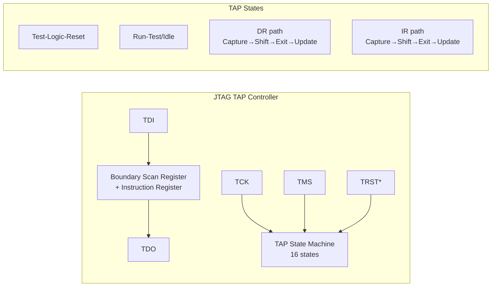

# EDA & Silicon Design Standards — Comprehensive Overview

**Category:** 35 — EDA & Silicon Design  
**Document:** 00 — Standards Landscape Overview  
**Scope:** SystemVerilog, UVM, UPF, IP-XACT, DFT/JTAG, Liberty, GDS/OASIS  
**Key Standards:** IEEE 1800 (SystemVerilog), IEEE 1801 (UPF), IEEE 1685 (IP-XACT), IEEE 1149.1 (JTAG)  
**Audience:** RTL designers, verification engineers, physical design engineers, DFT engineers  
**Prerequisites:** Digital logic fundamentals, VLSI design basics

---

## Chapter 1 — Historical Context

### 1.1 EDA Standards Evolution

| Year | Milestone | Impact |
|------|-----------|--------|
| 1983 | Verilog created (Gateway Design Automation) | First widely-used HDL |
| 1987 | VHDL standardized (IEEE 1076) | DoD-driven formal HDL |
| 1990 | IEEE 1149.1 (JTAG) standardized | Universal test access |
| 1993 | Synopsys Liberty format (.lib) | Timing/power characterization |
| 1994 | IEEE 1364 (Verilog) standardized | Industry HDL standard |
| 2000 | GDS II becomes de facto standard | Layout data exchange |
| 2001 | SystemVerilog initial (Accellera) | Unified design & verification |
| 2002 | OVM (Open Verification Methodology) | First constrained-random methodology |
| 2005 | IEEE 1800 SystemVerilog | Combined Verilog + SV extensions |
| 2007 | IP-XACT (IEEE 1685) | SoC integration metadata |
| 2009 | UPF 2.0 (IEEE 1801) | Unified Power Format standard |
| 2011 | UVM 1.0 (Universal Verification Methodology) | Industry standard verification |
| 2012 | OASIS (Open Artwork System Interchange Standard) | GDS successor |
| 2017 | IEEE 1800-2017 (SystemVerilog latest) | Current SV standard |
| 2019 | Portable Stimulus Standard (PSS / Accellera) | Reusable test intent |
| 2024 | IEEE 1801-2024 (UPF 4.0) | Latest power format |

### 1.2 Standards Ecosystem

```mermaid
graph TB
    subgraph "Design Entry"
        SV[IEEE 1800<br/>SystemVerilog<br/>RTL + Verification]
        VHDL[IEEE 1076<br/>VHDL]
    end
    
    subgraph "Verification"
        UVM[Accellera UVM<br/>Universal Verification<br/>Methodology]
        PSS[Accellera PSS<br/>Portable Stimulus]
        SVA[SystemVerilog<br/>Assertions (part of 1800)]
    end
    
    subgraph "Power"
        UPF[IEEE 1801<br/>UPF (Unified Power Format)]
        CPF[Si2 CPF<br/>Common Power Format (legacy)]
    end
    
    subgraph "Integration & IP"
        IPXACT[IEEE 1685<br/>IP-XACT]
        LIBERTY[Liberty (.lib)<br/>Timing/Power Models]
    end
    
    subgraph "Physical Design"
        GDS[GDSII<br/>Layout data]
        OASIS[SEMI P39 OASIS<br/>Layout data (compressed)]
        LEF[LEF/DEF<br/>Library/Design Exchange]
        SPEF[IEEE 1481 SPEF<br/>Parasitic data]
    end
    
    subgraph "Test & DFT"
        JTAG[IEEE 1149.1<br/>JTAG / Boundary Scan]
        STIL[IEEE 1450<br/>STIL (test patterns)]
        IJTAG[IEEE 1687<br/>Internal JTAG (IJTAG)]
    end
    
    SV --> UVM
    SV --> SVA
    SV --> UPF
    IPXACT --> SV
    LIBERTY --> UPF
```

---

## Chapter 2 — SystemVerilog (IEEE 1800-2017)

### 2.1 Language Domains

| Domain | Key Features | Use Case |
|--------|-------------|----------|
| **Design** | Modules, interfaces, always_ff/comb/latch, logic, structs, enums, packages | RTL coding |
| **Verification** | Classes, randomization, constraints, functional coverage, assertions | Testbench development |
| **Assertions** | SVA: properties, sequences, temporal logic | Formal verification, simulation |
| **DPI** | Direct Programming Interface (C/C++ integration) | Co-simulation, reference models |

### 2.2 Key Design Constructs

| Construct | Purpose | Example |
|-----------|---------|---------|
| `always_ff` | Sequential logic (flip-flops) | `always_ff @(posedge clk) q <= d;` |
| `always_comb` | Combinational logic | `always_comb y = a & b;` |
| `always_latch` | Latch inference (intentional) | `always_latch if(en) q <= d;` |
| `logic` | 4-state (replaces reg/wire ambiguity) | `logic [7:0] data;` |
| `interface` | Bundle of signals with modports | Port connections, protocols |
| `struct packed` | Bit-level data organization | Register fields |
| `enum` | Named constants | FSM states |
| `package` | Namespace for shared definitions | `package my_pkg;` |
| `generate` | Parameterized structural code | Array of instances |

### 2.3 Verification Constructs

| Construct | Purpose | Example |
|-----------|---------|---------|
| `class` | OOP for testbench components | Transaction, driver, monitor |
| `rand` / `randc` | Random variable declaration | `rand bit [7:0] addr;` |
| `constraint` | Constrain random generation | `constraint valid { addr < 100; }` |
| `covergroup` | Functional coverage collection | `covergroup cg @(posedge clk);` |
| `coverpoint` | Individual coverage point | `coverpoint addr { bins lo = {[0:63]}; }` |
| `cross` | Cross coverage | `cross addr, data;` |
| `mailbox` | Thread-safe FIFO communication | `mailbox #(transaction) mbx;` |
| `semaphore` | Resource arbitration | `semaphore sema = new(1);` |
| `assertion` | SVA inline check | `assert property (@(posedge clk) req |-> ##[1:3] ack);` |

---

## Chapter 3 — UVM (Universal Verification Methodology)

### 3.1 UVM Architecture

```mermaid
graph TB
    subgraph "UVM Testbench Architecture"
        TEST[uvm_test<br/>Test scenario configuration]
        ENV[uvm_env<br/>Environment container]
        
        subgraph "Agent (per interface)"
            SEQ[uvm_sequencer<br/>Sequence arbitration]
            DRV[uvm_driver<br/>Pin-level stimulus]
            MON[uvm_monitor<br/>Signal observation]
        end
        
        SCBD[uvm_scoreboard<br/>Checking/comparison]
        COV[Coverage Collector<br/>Functional coverage]
        
        subgraph "Sequences"
            SEQITEM[uvm_sequence_item<br/>Transaction object]
            SEQ1[uvm_sequence<br/>Stimulus scenario]
        end
    end
    
    subgraph "DUT"
        DUT[Design Under Test]
    end
    
    TEST --> ENV
    ENV --> SEQ
    ENV --> SCBD
    ENV --> COV
    SEQ --> DRV
    SEQ1 --> SEQ
    SEQITEM --> SEQ1
    DRV --> DUT
    DUT --> MON
    MON --> SCBD
    MON --> COV
```

### 3.2 UVM Phases

| Phase | Category | Purpose |
|-------|----------|---------|
| build | Build | Construct component hierarchy |
| connect | Build | Connect ports, exports, TLM |
| end_of_elaboration | Build | Final topology adjustments |
| start_of_simulation | Build | Pre-simulation setup |
| run | Run (task) | Main simulation (time-consuming) |
| extract | Cleanup | Extract results from DUT |
| check | Cleanup | Verify correctness |
| report | Cleanup | Print results/coverage |
| final | Cleanup | Final cleanup (no UVM mechanisms) |

### 3.3 UVM Factory & Configuration

| Mechanism | Purpose | Example |
|-----------|---------|---------|
| Factory override | Type substitution without code change | `set_type_override_by_type(base::get_type(), derived::get_type())` |
| Config DB | Hierarchical configuration passing | `uvm_config_db#(int)::set(this, "agent.*", "active", 1)` |
| TLM ports | Transaction-level communication | `uvm_analysis_port`, `uvm_tlm_fifo` |
| Objection | Phase completion control | `phase.raise_objection(this)` |
| Register model | CSR abstraction & auto-verification | `uvm_reg_block`, `uvm_reg_map` |

---

## Chapter 4 — UPF (IEEE 1801 — Unified Power Format)

### 4.1 Power Intent Concepts

| Concept | UPF Command | Purpose |
|---------|-------------|---------|
| Power Domain | `create_power_domain` | Group of elements sharing power state |
| Supply Port | `create_supply_port` | Power pin on boundary |
| Supply Net | `create_supply_net` | Internal power routing |
| Supply Set | `create_supply_set` | Bundle (power + ground + logic state) |
| Power State | `add_power_state` | Enumerated state (ON, OFF, RETENTION) |
| PST (Power State Table) | `create_pst` | Legal state combinations |
| Isolation | `set_isolation` | Clamp outputs when domain off |
| Retention | `set_retention` | Save register state before power-off |
| Level Shifter | `set_level_shifter` | Voltage domain crossing |

### 4.2 UPF Power Strategies

```mermaid
graph TB
    subgraph "Power Domain Architecture Example"
        PD_TOP[PD_TOP (Always-ON)<br/>VDD = 0.9V]
        PD_CPU[PD_CPU (Switchable)<br/>VDD = 0.9V / OFF]
        PD_GPU[PD_GPU (Switchable)<br/>VDD = 0.8V / OFF]
        PD_IO[PD_IO (Always-ON)<br/>VDD_IO = 1.8V]
    end
    
    PD_TOP -->|"Isolation cells"| PD_CPU
    PD_TOP -->|"Isolation cells"| PD_GPU
    PD_TOP -->|"Level shifters"| PD_IO
    PD_CPU -.->|"Retention registers"| PD_CPU
    PD_GPU -.->|"Retention registers"| PD_GPU
```

### 4.3 UPF Verification Strategy

| Stage | Tool | UPF Checks |
|-------|------|-----------|
| RTL Simulation | VCS/Xcelium/Questa with UPF | Power-aware simulation (corruption, isolation) |
| Formal | VC LP, JasperGold | Structural UPF rule checking |
| Synthesis | Design Compiler, Genus | Insertion of isolation, retention, level shifters |
| P&R | ICC2, Innovus | Power grid analysis, IR drop |
| Signoff | PrimeTime, Voltus | Static timing with multi-voltage |

---

## Chapter 5 — IP-XACT (IEEE 1685)

### 5.1 IP-XACT Components

| Element | Description | Content |
|---------|-------------|---------|
| Component | IP block description | Ports, registers, memory maps, file sets |
| Bus Interface | Standardized connection points | Master/slave/system, abstraction definition |
| Design | Connectivity (netlist) | Component instances + connections |
| Abstraction Definition | Bus protocol definition | Timing, port mapping |
| Catalog | Collection of references | IP library catalog |
| Generator Chain | Automated tool flow | Parametric generation scripts |

### 5.2 IP-XACT Register Description

```xml
<spirit:addressBlock>
  <spirit:name>CSR_BLOCK</spirit:name>
  <spirit:baseAddress>0x0000</spirit:baseAddress>
  <spirit:range>0x100</spirit:range>
  <spirit:width>32</spirit:width>
  <spirit:register>
    <spirit:name>CTRL_REG</spirit:name>
    <spirit:addressOffset>0x00</spirit:addressOffset>
    <spirit:size>32</spirit:size>
    <spirit:field>
      <spirit:name>ENABLE</spirit:name>
      <spirit:bitOffset>0</spirit:bitOffset>
      <spirit:bitWidth>1</spirit:bitWidth>
      <spirit:access>read-write</spirit:access>
    </spirit:field>
  </spirit:register>
</spirit:addressBlock>
```

### 5.3 IP-XACT Auto-Generation Flows

| Generated Output | Source in IP-XACT | Use Case |
|-----------------|------------------|----------|
| RTL register module | Memory maps + registers | CSR block generation |
| UVM register model | Register descriptions | Automated verification |
| C header files | Register definitions | Software driver headers |
| Documentation | All metadata | Datasheet generation |
| Testbench connectivity | Design + bus interfaces | TB auto-connection |

---

## Chapter 6 — DFT & Test Standards

### 6.1 IEEE 1149.1 (JTAG) Architecture



### 6.2 IEEE 1149.x Family

| Standard | Title | Application |
|----------|-------|-------------|
| IEEE 1149.1-2013 | Standard Test Access Port (JTAG) | Boundary scan, board test |
| IEEE 1149.4 | Mixed-Signal Test Bus | Analog boundary scan |
| IEEE 1149.6 | Boundary Scan for AC-coupled signals | High-speed differential |
| IEEE 1149.7 | Reduced-pin JTAG (cJTAG) | 2-wire (TCK+TMS), compact packages |
| IEEE 1149.8.1 | Boundary-Scan-Based Stimulus | Shorts/opens testing |

### 6.3 IEEE 1687 (IJTAG — Internal JTAG)

| Feature | JTAG (1149.1) | IJTAG (1687) |
|---------|---------------|--------------|
| Scope | Board-level / chip boundary | On-chip instruments |
| Access topology | Fixed chain | Reconfigurable (SIB, mux) |
| Target | Package pins | BIST, sensors, DFT, debug |
| Language | BSDL | ICL + PDL |
| Flexibility | Static chain | Dynamic instrument selection |

### 6.4 DFT Pattern Formats

| Format | Standard | Use |
|--------|----------|-----|
| STIL | IEEE 1450 | Standard Test Interface Language (ATE-neutral) |
| WGL | — (proprietary) | Waveform Generation Language |
| CTL | Part of IEEE 1450.6 | Core Test Language (hierarchical) |
| STDF | — (Teradyne) | Standard Test Data Format (results) |

---

## Chapter 7 — Physical Design Standards

### 7.1 File Format Comparison

| Format | Standard | Content | File Size | Status |
|--------|----------|---------|-----------|--------|
| GDSII | — (Calma, 1978) | Layout geometry (polygons) | Large (uncompressed) | Legacy but dominant |
| OASIS | SEMI P39 / ISO 28600 | Layout geometry (optimized) | 5-20× smaller than GDS | Adopted by advanced nodes |
| LEF | Si2 OpenAccess | Library cell geometry + pins | Moderate | Standard for P&R |
| DEF | Si2 OpenAccess | Design placement + routing | Large | Standard for P&R |
| SPEF | IEEE 1481 | Parasitic RC data | Large | Post-extraction signoff |
| SDF | IEEE 1497 | Standard Delay Format | Moderate | Timing annotation |

### 7.2 Liberty Timing Model (.lib)

| Section | Content | Example |
|---------|---------|---------|
| Library header | Technology, units, conditions | PVT corner (0.9V, 125°C, SS) |
| Cell | Logic function, area, leakage | `cell(INV_X1) { ... }` |
| Pin | Direction, capacitance, function | `pin(Y) { direction: output; function: "(!A)"; }` |
| Timing arc | Delay (NLDM / CCS) | Rise/fall delay lookup tables |
| Power | Dynamic + leakage power | Switching power lookup tables |
| Noise | Noise immunity data | CCS noise models |

### 7.3 Process Technology Nodes & Standards Impact

| Node | Year | Key Challenge | Standard Response |
|------|------|-------------|------------------|
| 28nm | 2011 | Double patterning intro | OASIS adoption |
| 14nm/16nm | 2014 | FinFET, multi-patterning | CCS timing models, Liberty |
| 7nm | 2018 | EUV introduction | OASIS mandatory, CCS-N noise |
| 5nm | 2020 | Design rule complexity | ML-assisted DRC |
| 3nm | 2022 | GAA (Gate-All-Around) | New Liberty extensions |
| 2nm | 2025 | Backside power, CFET | OpenAccess evolution |

---

## Chapter 8 — Interview Questions

### Tier 1: Entry-Level
1. Explain the difference between `always_ff`, `always_comb`, and `always_latch` in SystemVerilog.
2. What are the main components of a UVM testbench (agent, sequencer, driver, monitor)?
3. What is JTAG and what are its four mandatory signals?
4. What is the purpose of a Liberty (.lib) file?

### Tier 2: Mid-Level
1. Explain UVM factory override mechanism and when you'd use type vs. instance override.
2. Walk through UPF power domain design: isolation, retention, and level shifters.
3. How does IP-XACT auto-generate UVM register models and C headers from a single source?
4. Compare GDSII vs. OASIS file formats — when would you mandate OASIS?

### Tier 3: Senior/Lead
1. Design a UVM testbench architecture for a multi-protocol SoC (AXI + AHB + APB).
2. How do you verify UPF power intent across simulation, formal, and implementation?
3. Architect an IP-XACT-based design flow for a 50-IP SoC with automated integration.
4. Explain IEEE 1687 (IJTAG) SIB topology design for a chip with 20 internal instruments.

### Tier 4: Principal
1. How should EDA standards evolve to support chiplet-based designs (UCIe + IP-XACT)?
2. Design a UPF methodology for a 100-domain SoC with dynamic voltage-frequency scaling.
3. Propose a verification strategy combining UVM + Portable Stimulus + Formal for 1B-gate SoC.
4. How do you standardize the EDA-to-foundry interface for 2nm GAA processes?

---

*Document Version: 1.0 | Last Updated: May 2026 | Author: Technology Standards Team*
