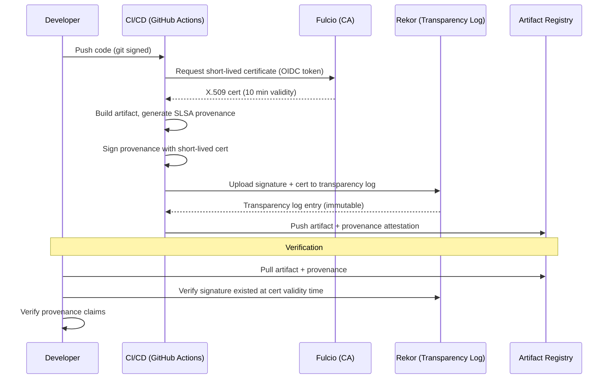

# DevSecOps & Software Supply Chain Security Standards — Comprehensive Overview

**Category:** 36 — DevSecOps & Supply Chain Security  
**Document:** 00 — Standards Landscape Overview  
**Scope:** NIST SSDF, SLSA, OWASP SAMM, SBOM (SPDX/CycloneDX), EO 14028, EU CRA, CMMC  
**Key Standards:** NIST SP 800-218 (SSDF), SLSA v1.0, SPDX (ISO/IEC 5962), CycloneDX  
**Audience:** DevSecOps engineers, AppSec architects, supply chain security leads  
**Prerequisites:** Software development lifecycle, CI/CD basics, security fundamentals

---

## Chapter 1 — Historical Context

### 1.1 Supply Chain Attacks Driving Standards

| Year | Attack | Impact | Standard Response |
|------|--------|--------|------------------|
| 2017 | NotPetya (via M.E.Doc update) | $10B global damage | Software update integrity requirements |
| 2017 | CCleaner (compromised build) | 2.3M infected | Build system security |
| 2019 | ASUS Live Update hijack | 500K+ devices | Code signing requirements |
| 2020 | SolarWinds Orion (SUNBURST) | 18,000 organizations, US govt agencies | EO 14028, SLSA, SSDF |
| 2021 | Codecov Bash Uploader | CI secrets exfiltrated | CI/CD pipeline security |
| 2021 | Kaseya VSA (REvil ransomware) | 1,500 downstream organizations | Managed service provider security |
| 2021 | Log4Shell (CVE-2021-44228) | Universal Java vulnerability | SBOM mandate, dependency tracking |
| 2022 | npm color/faker (maintainer sabotage) | Breaking millions of builds | Open source sustainability |
| 2023 | 3CX supply chain (compromised build) | 600,000 customers | Build verification requirements |
| 2024 | xz utils backdoor (CVE-2024-3094) | Targeted SSH daemon compression | Maintainer trust, code review |

### 1.2 Standards Architecture

```mermaid
graph TB
    subgraph "Government Mandates"
        EO14028[US EO 14028<br/>Improving Cybersecurity<br/>(May 2021)]
        EUCRA[EU Cyber Resilience Act<br/>(2024)]
        CMMC[CMMC 2.0<br/>DoD Contractor Security]
    end
    
    subgraph "Frameworks"
        SSDF[NIST SP 800-218<br/>SSDF (Secure Software<br/>Development Framework)]
        SLSA[SLSA v1.0<br/>Supply-chain Levels<br/>for Software Artifacts]
        SAMM[OWASP SAMM<br/>Software Assurance<br/>Maturity Model]
        SCVS[OWASP SCVS<br/>Software Component<br/>Verification Standard]
    end
    
    subgraph "SBOM Formats"
        SPDX[SPDX (ISO 5962)<br/>Linux Foundation]
        CDX[CycloneDX<br/>OWASP]
        SWID[SWID Tags<br/>ISO/IEC 19770-2]
    end
    
    subgraph "Tooling Standards"
        SIGSTORE[Sigstore<br/>Keyless signing]
        INTOTO[in-toto<br/>Supply chain layout]
        VEX[VEX<br/>Vulnerability Exploitability<br/>eXchange]
    end
    
    EO14028 --> SSDF
    EO14028 --> SPDX
    EO14028 --> CDX
    EUCRA --> CDX
    EUCRA --> SPDX
    SSDF --> SLSA
    SLSA --> SIGSTORE
    SLSA --> INTOTO
```

---

## Chapter 2 — NIST SP 800-218 (SSDF — Secure Software Development Framework)

### 2.1 Practice Groups

| Group | ID | Title | # Practices |
|-------|-----|-------|-------------|
| Prepare the Organization | PO | Organizational preparation | 5 practices |
| Protect the Software | PS | Protect all components from tampering | 3 practices |
| Produce Well-Secured Software | PW | Produce software with minimal vulnerabilities | 9 practices |
| Respond to Vulnerabilities | RV | Identify residual vulns, respond appropriately | 3 practices |

### 2.2 Key Practices

| Practice | ID | Requirements |
|----------|-----|-------------|
| Define security requirements | PO.1 | Security requirements in all software specs |
| Implement roles & responsibilities | PO.2 | Security champions, secure dev training |
| Protect all forms of code | PS.1 | SCM integrity, access controls, signing |
| Provide a mechanism for verifying release integrity | PS.2 | Cryptographic hashes, digital signatures |
| Design software to meet security requirements | PW.1 | Threat modeling, attack surface analysis |
| Review and/or analyze for security | PW.6 | SAST, DAST, SCA, manual review |
| Test executable code for vulnerabilities | PW.8 | Dynamic testing, fuzzing, penetration testing |
| Configure software securely by default | PW.9 | Secure defaults, hardening |
| Identify and confirm vulnerabilities | RV.1 | Vuln disclosure, triage, tracking |
| Assess, prioritize, and remediate vulns | RV.2 | Risk-based remediation timelines |

---

## Chapter 3 — SLSA (Supply-chain Levels for Software Artifacts)

### 3.1 SLSA v1.0 Levels

| Level | Name | Requirements | Protection Against |
|-------|------|-------------|-------------------|
| SLSA Build L0 | No guarantees | No SLSA controls | Nothing (baseline) |
| SLSA Build L1 | Provenance exists | Build generates provenance; package has provenance | Mistakes, unintentional changes |
| SLSA Build L2 | Hosted build platform | Build service generates provenance (not user-controlled) | Tampering after build |
| SLSA Build L3 | Hardened builds | Isolated, ephemeral build environments; non-falsifiable provenance | Compromised build platform |

### 3.2 SLSA Provenance Specification

| Field | Description | Example |
|-------|-------------|---------|
| `buildType` | URI identifying build process | `https://github.com/actions/...` |
| `builder.id` | URI identifying build platform | `https://github.com/actions/runner` |
| `invocation.configSource` | Source of build configuration | Git repo + ref + path |
| `materials` | Input artifacts (with digests) | Source repo SHA, dependencies |
| `metadata.buildStartedOn` | Build timestamp | ISO 8601 |
| `metadata.completeness` | What was captured | Parameters, environment, materials |
| `subject` | Output artifacts (with digests) | Container image SHA256 |

### 3.3 SLSA Implementation with Sigstore



---

## Chapter 4 — SBOM (Software Bill of Materials)

### 4.1 Format Comparison

| Feature | SPDX (ISO 5962) | CycloneDX | SWID Tags (ISO 19770-2) |
|---------|-----------------|-----------|------------------------|
| Organization | Linux Foundation | OWASP | ISO/IEC (legacy) |
| Primary use | License compliance + security | Security + supply chain | Software asset management |
| Format options | JSON, RDF, XML, YAML, tag-value | JSON, XML, Protobuf | XML |
| Vulnerability data | Via linking (VEX) | Native VEX support | Limited |
| Services/APIs | SPDX 3.0 supports | Native service BOM | No |
| Hardware BOM | SPDX 3.0 (profiles) | Yes (HBOM) | No |
| Cryptographic BOM | Not native | CBOM support | No |
| License info | Comprehensive (SPDX license list) | Supported | Basic |
| Dependency graph | SPDX 3.0 relationships | Nested components | No |
| NTIA minimum elements | Yes | Yes | Partial |

### 4.2 NTIA Minimum Elements for SBOM

| Element | Description | Required |
|---------|-------------|----------|
| Supplier Name | Entity that created the component | Yes |
| Component Name | Designation for a unit of software | Yes |
| Version | Version of the component | Yes |
| Unique Identifier | PURL, CPE, or other unique ID | Yes |
| Dependency Relationship | Upstream component(s) | Yes |
| Author of SBOM Data | Entity that created the SBOM | Yes |
| Timestamp | Date/time of SBOM generation | Yes |

### 4.3 VEX (Vulnerability Exploitability eXchange)

VEX status values:

| Status | Meaning | Action Required |
|--------|---------|----------------|
| Not Affected | Vulnerability does not affect this product | No action |
| Affected | Vulnerability affects this product | Remediation needed |
| Fixed | Vulnerability has been fixed in this version | Update available |
| Under Investigation | Investigating whether vulnerability applies | Pending |

---

## Chapter 5 — EU Cyber Resilience Act (CRA)

### 5.1 Key Requirements

| Requirement | Timeline | Scope |
|-------------|----------|-------|
| Security by design | 36 months after entry | All products with digital elements |
| Vulnerability handling process | 21 months | Manufacturers, importers, distributors |
| SBOM (machine-readable) | 36 months | All covered products |
| Actively exploited vuln reporting | 24 hours to ENISA | All manufacturers |
| Security updates (5 years minimum) | Product lifetime | Free security updates |
| CE marking (cybersecurity) | 36 months | Self-assessment or 3rd party |
| Coordinated vulnerability disclosure | 21 months | Manufacturers |

### 5.2 Product Categories

| Category | Assessment | Examples |
|----------|-----------|---------|
| Default | Self-assessment (Module A) | Consumer IoT, simple software |
| Important Class I | Harmonized standard OR third-party | Password managers, VPNs, OS, browsers |
| Important Class II | Third-party assessment required | Hypervisors, firewalls, HSMs, smart meters |
| Critical | European cybersecurity certification | Smart cards, secure elements, hardware encryption |

### 5.3 Penalties

| Violation | Maximum Fine |
|-----------|-------------|
| Essential cybersecurity requirements | €15M or 2.5% of worldwide annual turnover |
| Other obligations | €10M or 2% of worldwide annual turnover |
| Incorrect/misleading info to authorities | €5M or 1% of worldwide annual turnover |

---

## Chapter 6 — CMMC 2.0 (Cybersecurity Maturity Model Certification)

### 6.1 CMMC 2.0 Levels

| Level | Name | # Practices | Assessment | Based On |
|-------|------|-------------|-----------|---------|
| Level 1 | Foundational | 17 | Self-assessment (annual) | FAR 52.204-21 |
| Level 2 | Advanced | 110 | Third-party (C3PAO) or self | NIST SP 800-171 Rev 2 |
| Level 3 | Expert | 110+24 | Government-led (DIBCAC) | NIST SP 800-172 |

### 6.2 Level 2 Domain Summary (NIST 800-171)

| Domain | # Controls | Key Requirements |
|--------|-----------|-----------------|
| Access Control (AC) | 22 | Least privilege, session control, remote access |
| Awareness & Training (AT) | 3 | Security awareness, role-based training |
| Audit & Accountability (AU) | 9 | Audit logging, review, protection |
| Configuration Management (CM) | 9 | Baseline configs, change control |
| Identification & Authentication (IA) | 11 | MFA, password management |
| Incident Response (IR) | 3 | Incident handling, reporting |
| Maintenance (MA) | 6 | System maintenance controls |
| Media Protection (MP) | 9 | Media sanitization, transport |
| Personnel Security (PS) | 2 | Screening, termination |
| Physical Protection (PE) | 6 | Physical access, monitoring |
| Risk Assessment (RA) | 3 | Vulnerability scanning, risk assessment |
| Security Assessment (CA) | 4 | POA&M, continuous monitoring |
| System & Communications Protection (SC) | 16 | Encryption, boundary protection |
| System & Information Integrity (SI) | 7 | Flaw remediation, monitoring |

---

## Chapter 7 — OWASP SAMM (Software Assurance Maturity Model)

### 7.1 SAMM Business Functions & Security Practices

| Business Function | Security Practice 1 | Security Practice 2 |
|------------------|--------------------|--------------------|
| **Governance** | Strategy & Metrics | Policy & Compliance |
| **Governance** | Education & Guidance | — |
| **Design** | Threat Assessment | Security Requirements |
| **Design** | Security Architecture | — |
| **Implementation** | Secure Build | Secure Deployment |
| **Implementation** | Defect Management | — |
| **Verification** | Architecture Assessment | Requirements-driven Testing |
| **Verification** | Security Testing | — |
| **Operations** | Incident Management | Environment Management |
| **Operations** | Operational Management | — |

### 7.2 Maturity Levels (per practice)

| Level | Description | Typical Activities |
|-------|-------------|-------------------|
| 0 | Implicit starting point | Ad-hoc, no formal process |
| 1 | Initial understanding | Basic activities performed, not consistent |
| 2 | Increased efficiency | Defined process, consistently applied |
| 3 | Comprehensive mastery | Optimized, measured, continuously improved |

---

## Chapter 8 — CI/CD Pipeline Security

### 8.1 Secure Pipeline Architecture

```mermaid
graph LR
    subgraph "Source"
        SCM[Source Control<br/>─ Signed commits<br/>─ Branch protection<br/>─ Code review (2+ reviewers)]
    end
    
    subgraph "Build"
        BUILD[Build System<br/>─ Hermetic builds<br/>─ Pinned dependencies<br/>─ SLSA L3 provenance]
    end
    
    subgraph "Test"
        TEST[Security Testing<br/>─ SAST (Semgrep, CodeQL)<br/>─ SCA (Dependabot, Snyk)<br/>─ DAST (ZAP, Burp)<br/>─ Container scanning]
    end
    
    subgraph "Deploy"
        DEPLOY[Deployment<br/>─ Signed artifacts<br/>─ Admission controllers<br/>─ SBOM generation<br/>─ VEX publishing]
    end
    
    subgraph "Monitor"
        MONITOR[Runtime<br/>─ RASP/WAF<br/>─ SBOM-based vuln alerting<br/>─ Incident response]
    end
    
    SCM --> BUILD --> TEST --> DEPLOY --> MONITOR
```

### 8.2 Policy-as-Code Tools

| Tool | Standard/Framework | Function |
|------|-------------------|----------|
| OPA/Rego (Open Policy Agent) | CNCF | General policy enforcement |
| Kyverno | CNCF | Kubernetes-native policy |
| Cosign (Sigstore) | SLSA | Container/artifact signing |
| in-toto | SLSA | Supply chain layout verification |
| GUAC | OpenSSF | Graph for Understanding Artifact Composition |
| Scorecard | OpenSSF | Open source project security scoring |

---

## Chapter 9 — Interview Questions

### Tier 1: Entry-Level
1. What is an SBOM and why was it mandated by EO 14028?
2. Explain the four SLSA build levels and what each protects against.
3. What is the difference between SPDX and CycloneDX?
4. What are the NIST SSDF practice groups (PO, PS, PW, RV)?

### Tier 2: Mid-Level
1. Design a CI/CD pipeline implementing SLSA L3 with Sigstore signing.
2. How do you generate and consume SBOMs in a microservices architecture (20+ services)?
3. Explain VEX and how it reduces false-positive vulnerability noise from SBOMs.
4. Walk through EU CRA compliance for an IoT device manufacturer.

### Tier 3: Senior/Lead
1. Architect an enterprise SBOM management platform integrating SCA, VEX, and vulnerability prioritization.
2. How do you achieve CMMC Level 2 for a software development organization (110 controls)?
3. Design a supply chain security program combining SLSA + SSDF + Sigstore + GUAC.
4. How do you implement reproducible builds and binary transparency for a Linux distribution?

### Tier 4: Principal
1. Design a national software supply chain security framework incorporating SLSA, SBOM, and EU CRA.
2. How should SLSA evolve to address AI/ML model supply chain security?
3. Propose an architecture for cross-organizational SBOM sharing with competitive sensitivity constraints.
4. How do you build a zero-trust software supply chain from source to deployment at hyperscale?

---

*Document Version: 1.0 | Last Updated: May 2026 | Author: Technology Standards Team*
