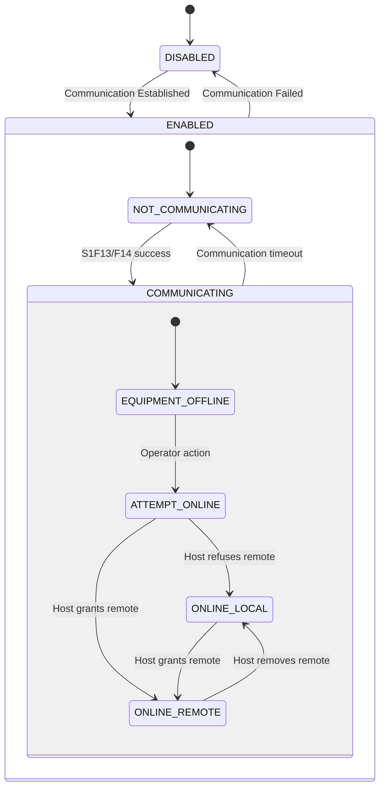
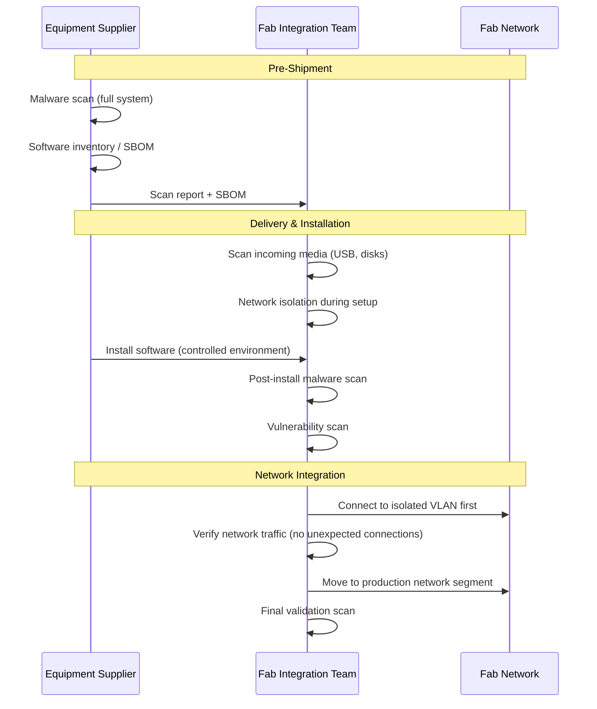

# Semiconductor Manufacturing Equipment Standards — Comprehensive Overview

**Category:** 39 — Semiconductor Manufacturing Equipment  
**Document:** 00 — Standards Landscape Overview  
**Scope:** SECS/GEM, SEMI E10 OEE, SEMI E187/E188 cybersecurity, cleanroom ISO 14644, advanced packaging  
**Key Standards:** SEMI E4/E5 (SECS-I/II), SEMI E30 (GEM), SEMI E40 (Process Job), SEMI E187/E188  
**Audience:** Fab automation engineers, equipment interface engineers, process control engineers  
**Prerequisites:** Semiconductor manufacturing basics, factory automation concepts

---

## Chapter 1 — Historical Context

### 1.1 SEMI Standards Evolution

| Year | Milestone | Impact |
|------|-----------|--------|
| 1970 | SEMI founded (Semiconductor Equipment & Materials International) | Industry standards body |
| 1978 | SECS-I (SEMI E4) — serial communication | First equipment-host protocol |
| 1987 | SECS-II (SEMI E5) — message content | Standard message format |
| 1992 | GEM (SEMI E30) — Generic Equipment Model | Equipment behavior standard |
| 1998 | SEMI E10 — Equipment Reliability, Availability, Maintainability | OEE standard |
| 2000 | SEMI E40 — Processing Management | Process job standard |
| 2003 | EDA (Equipment Data Acquisition) initiative | SEMI E120/E125/E132/E134 |
| 2004 | Interface A (SEMI E79) | 300mm standard interface |
| 2007 | SEMI E116 — Equipment Performance Tracking | Lot-level tracking |
| 2013 | SEMI E142/E148 — Substrate Tracking | Wafer-level tracking |
| 2018 | SEMI E187 — Cybersecurity for Fab Equipment | First fab cyber standard |
| 2022 | SEMI E188 — Malware-Free Equipment Integration | Delivery/installation security |
| 2024 | SEMI E192 — Fab Network Security | Network segmentation |

### 1.2 Standards Architecture

```mermaid
graph TB
    subgraph "Communication Layer"
        E4[SEMI E4<br/>SECS-I<br/>(RS-232 serial)]
        E37[SEMI E37<br/>HSMS<br/>(TCP/IP)]
        E5[SEMI E5<br/>SECS-II<br/>(Message content)]
    end
    
    subgraph "Behavior Layer (GEM)"
        E30[SEMI E30<br/>GEM<br/>Generic Equipment Model]
        E40[SEMI E40<br/>Process Job Mgmt]
        E87[SEMI E87<br/>Carrier Management<br/>(CMS)]
        E90[SEMI E90<br/>Substrate Tracking<br/>(STS)]
        E94[SEMI E94<br/>Control Job Mgmt]
        E116[SEMI E116<br/>Equipment Performance<br/>Tracking (EPT)]
    end
    
    subgraph "Data Layer (EDA)"
        E120[SEMI E120<br/>Common Equipment Model]
        E125[SEMI E125<br/>Equipment Self-Description]
        E132[SEMI E132<br/>EDA Specification]
        E134[SEMI E134<br/>Data Collection Mgmt]
    end
    
    subgraph "Performance"
        E10[SEMI E10<br/>OEE/RAM]
        E79[SEMI E79<br/>Standard Mechanical Interface]
    end
    
    subgraph "Cybersecurity"
        E187[SEMI E187<br/>Fab Equipment<br/>Cybersecurity]
        E188[SEMI E188<br/>Malware-Free<br/>Integration]
    end
    
    E4 --> E5
    E37 --> E5
    E5 --> E30
    E30 --> E40
    E30 --> E87
    E30 --> E90
    E30 --> E94
    E30 --> E116
```

---

## Chapter 2 — SECS/GEM Communication

### 2.1 Protocol Stack

| Layer | Standard | Function |
|-------|----------|----------|
| Physical/Transport | SEMI E4 (SECS-I) RS-232 | Serial point-to-point (legacy) |
| Physical/Transport | SEMI E37 (HSMS) TCP/IP | High-speed network (modern) |
| Message Format | SEMI E5 (SECS-II) | Binary message encoding |
| Behavior | SEMI E30 (GEM) | Equipment state model & scenarios |

### 2.2 SECS-II Message Structure

| Component | Description | Example |
|-----------|-------------|---------|
| Stream (S) | Functional category (0-127) | S1 = Equipment Status |
| Function (F) | Specific message within stream | S1F1 = Are You There |
| Direction | H→E (Host to Equipment) or E→H | S1F1 is H→E |
| Reply | Odd = Primary, Even = Reply | S1F2 is reply to S1F1 |

### 2.3 Key Streams

| Stream | Category | Important Functions |
|--------|----------|-------------------|
| S1 | Equipment Status | S1F1/F2 (Online), S1F3/F4 (SV request), S1F13/F14 (Establish Comm) |
| S2 | Equipment Control | S2F13/F14 (EC request), S2F15/F16 (EC change), S2F41/F42 (Remote Command) |
| S5 | Exception Handling | S5F1/F2 (Alarm report), S5F5/F6 (List alarms) |
| S6 | Data Collection | S6F11/F12 (Event report), S6F15/F16 (Event report request) |
| S7 | Process Program | S7F1/F2 (PP load inquire), S7F3/F4 (PP send), S7F5/F6 (PP request) |
| S10 | Terminal Services | S10F1/F2 (Terminal request), S10F3/F4 (Terminal display) |
| S14 | Object Services | S14F1/F2 (Get attribute), S14F9/F10 (Create object) |

### 2.4 GEM Fundamental Requirements (SEMI E30)

| Requirement | Description | Mandatory |
|-------------|-------------|-----------|
| State model | Communication + Control + Processing state machines | Yes |
| Equipment constants (EC) | Configurable parameters | Yes |
| Status variables (SV) | Current equipment state | Yes |
| Data variables (DV) | Transient process data | Yes |
| Collection events (CE) | Significant equipment occurrences | Yes |
| Alarms | Abnormal conditions | Yes |
| Remote command | Host-initiated actions | Yes |
| Process program management | Recipe management | No (but typical) |
| Spooling | Store-and-forward messaging | No |
| Control (Online/Offline/Local/Remote) | Host control authority | Yes |

### 2.5 GEM State Models



---

## Chapter 3 — SEMI E10 (Equipment Reliability/Availability/Maintainability)

### 3.1 Equipment States (Time Categories)

```mermaid
graph TB
    subgraph "E10 Equipment Time Categories"
        TOTAL[Total Time]
        TOTAL --> MFGTIME[Manufacturing Time<br/>(Available for production)]
        TOTAL --> NONSCHD[Non-Scheduled Time<br/>(Not needed)]
        
        MFGTIME --> UPTIME[Uptime<br/>(Equipment functional)]
        MFGTIME --> DOWNTIME[Downtime<br/>(Not functional)]
        
        UPTIME --> PROD[Productive Time<br/>(Processing wafers)]
        UPTIME --> STANDBY[Standby Time<br/>(Ready, no WIP)]
        UPTIME --> ENG[Engineering Time<br/>(Qual runs, tests)]
        
        DOWNTIME --> UNSCHED[Unscheduled Down<br/>(Failures)]
        DOWNTIME --> SCHED[Scheduled Down<br/>(PM, upgrades)]
    end
```

### 3.2 OEE Metrics

| Metric | Formula | Target (World-Class) |
|--------|---------|---------------------|
| **Availability** | Uptime / (Uptime + Downtime) | > 95% |
| **Performance** | (Ideal Cycle × Units) / Run Time | > 95% |
| **Quality** | Good Units / Total Units | > 99.9% |
| **OEE** | Availability × Performance × Quality | > 85% |
| **MTBF** | Productive Time / Number of Failures | > 200 hours (critical) |
| **MTTR** | Downtime / Number of Repairs | < 2 hours |
| **MTBA** | Uptime / Number of Assists | > 50 wafers |

---

## Chapter 4 — EDA (Equipment Data Acquisition)

### 4.1 EDA Standards Suite

| Standard | Title | Function |
|----------|-------|----------|
| SEMI E120 | Common Equipment Model (CEM) | Metadata model for equipment |
| SEMI E125 | Equipment Self-Description (EqSD) | Machine-readable capability description |
| SEMI E132 | EDA Common Metadata | Standard data semantics |
| SEMI E134 | Data Collection Management | Data collection plan configuration |
| SEMI E138 | Data Quality | Data accuracy specification |
| SEMI E164 | EDA — Performance | High-speed data streaming |

### 4.2 EDA vs. GEM Comparison

| Feature | GEM (SECS-II) | EDA |
|---------|--------------|-----|
| Communication | HSMS (binary) | SOAP/HTTP (XML) or REST |
| Data model | Stream/Function based | Object-oriented metadata |
| Data collection | Event-driven (CE + DVVAL) | Plan-based (configurable) |
| Sampling rate | Limited by protocol | High frequency (>1 kHz) |
| Self-description | Equipment constants list | Full metadata model (EqSD) |
| Parallel access | Single host (typically) | Multiple clients |
| Trace data | S6F1 (limited) | Full recipe-parameter trace |
| Use case | Equipment control | Advanced Process Control (APC), FDC |

---

## Chapter 5 — SEMI E187/E188 Cybersecurity

### 5.1 SEMI E187 — Cybersecurity for Fab Equipment

| Requirement Area | Key Requirements |
|-----------------|-----------------|
| **Operating System** | Supported OS (vendor patches available); no end-of-life OS |
| **Network Security** | No unnecessary open ports; encrypted communication where supported |
| **Endpoint Protection** | Anti-malware capability (or application whitelisting) |
| **Access Control** | Authentication for admin/service accounts; no shared generic accounts |
| **Logging** | Security event logging (login, config changes, network access) |
| **Documentation** | Security architecture document; network topology diagram |
| **Vulnerability Management** | Patch management plan; security update testing |
| **Data Security** | Encryption for sensitive data at rest and in transit |

### 5.2 SEMI E188 — Malware-Free Equipment Integration



### 5.3 SEMI E192 — Fab Network Security

| Zone | Purpose | Equipment | Security Controls |
|------|---------|-----------|------------------|
| Zone 1 (Enterprise) | Corporate IT | ERP, email, HR | Standard IT security |
| Zone 2 (Manufacturing DMZ) | Bridge IT/OT | MES, APC servers, historians | Firewalls, IDS/IPS |
| Zone 3 (Manufacturing) | Fab automation | Host, EDA, FDC | Network segmentation, ACLs |
| Zone 4 (Equipment) | Production tools | Process equipment, metrology | Isolated VLANs, E187 controls |
| Zone 5 (Safety) | Safety systems | Gas/chemical monitoring, fire | Air-gapped or one-way diode |

---

## Chapter 6 — Cleanroom Standards (ISO 14644)

### 6.1 ISO 14644-1 Classification

| ISO Class | Particles ≥ 0.1 μm/m³ | Particles ≥ 0.5 μm/m³ | Fab Area |
|-----------|----------------------|----------------------|---------|
| ISO 1 | 10 | — | EUV lithography (conceptual) |
| ISO 2 | 100 | — | Advanced lithography |
| ISO 3 | 1,000 | 35 | Photolithography, implant |
| ISO 4 | 10,000 | 352 | Wafer processing |
| ISO 5 | 100,000 | 3,520 | General fab floor |
| ISO 6 | 1,000,000 | 35,200 | Packaging, testing |
| ISO 7 | — | 352,000 | Assembly, backend |
| ISO 8 | — | 3,520,000 | Office, change room |

### 6.2 ISO 14644 Series

| Part | Title | Content |
|------|-------|---------|
| 14644-1 | Classification of air cleanliness by particle concentration | Classification system |
| 14644-2 | Monitoring to provide evidence of cleanroom performance | Monitoring requirements |
| 14644-3 | Test methods | Particle count, airflow, recovery |
| 14644-4 | Design, construction, start-up | Cleanroom design requirements |
| 14644-5 | Operations | Cleanroom operational protocols |
| 14644-7 | Separative devices | Mini-environments, isolators |
| 14644-8 | Molecular contamination classification | AMC (Airborne Molecular Contamination) |
| 14644-12 | Nano-particle classification | <100nm particle monitoring |

---

## Chapter 7 — Advanced Packaging Standards

### 7.1 SEMI Standards for Advanced Packaging

| Standard | Title | Application |
|----------|-------|-------------|
| SEMI G86 | Fan-Out Wafer Level Packaging (FOWLP) | RDL-first/chip-first process |
| SEMI 3D-IC | 3D IC Integration standards | TSV (Through-Silicon Via) processes |
| SEMI E142/E148 | Substrate/die tracking | Chiplet tracking in HVM |
| JEDEC JEP30 | Part model naming conventions | Package type identification |
| IPC-7093 | Design & Assembly for BGA (Bottom Termination) | Advanced package PCB design |

### 7.2 Chiplet-Era Interface Standards

| Standard | Organization | Application |
|----------|-------------|-------------|
| UCIe (Universal Chiplet Interconnect Express) | UCIe Consortium | Die-to-die interface |
| SEMI E142 | SEMI | Chiplet tracking/traceability |
| BoW (Bunch of Wires) | OCP | Open chiplet interface |
| ODSA (Open Domain-Specific Architecture) | OCP | Chiplet software model |
| SEMI 3D25 | SEMI | Wafer bonding quality |

---

## Chapter 8 — Interview Questions

### Tier 1: Entry-Level
1. What are SECS-I, SECS-II, and GEM? How do they relate?
2. Explain SEMI E10 equipment time categories (Uptime, Downtime, Standby).
3. What is the difference between HSMS (E37) and SECS-I (E4)?
4. What are the key GEM state models (Communication, Control)?

### Tier 2: Mid-Level
1. Walk through a typical GEM communication establishment sequence (S1F13 → Control States).
2. How does EDA (E132/E134) differ from traditional GEM data collection for APC applications?
3. Explain SEMI E187 cybersecurity requirements for new fab equipment.
4. Design an E10 OEE dashboard for a lithography tool cluster.

### Tier 3: Senior/Lead
1. Architect a SEMI E188 malware-free integration process for a greenfield fab bringing in 500 tools.
2. How do you implement high-frequency data collection (>10 kHz) using EDA for etch chamber FDC?
3. Design a fab network architecture meeting SEMI E192 zone requirements with equipment from 20 suppliers.
4. How do you handle GEM compliance testing for multi-chamber cluster tools (E40/E87/E90)?

### Tier 4: Principal
1. How should SECS/GEM evolve for chiplet-era manufacturing with heterogeneous integration?
2. Design a cybersecurity architecture for a fully autonomous fab (lights-out manufacturing).
3. Propose a standard for real-time digital twin integration connecting E30/EDA with ISO 23247.
4. How do you achieve supply chain security for fab equipment software (E188 + SLSA + SBOM)?

---

*Document Version: 1.0 | Last Updated: May 2026 | Author: Technology Standards Team*
