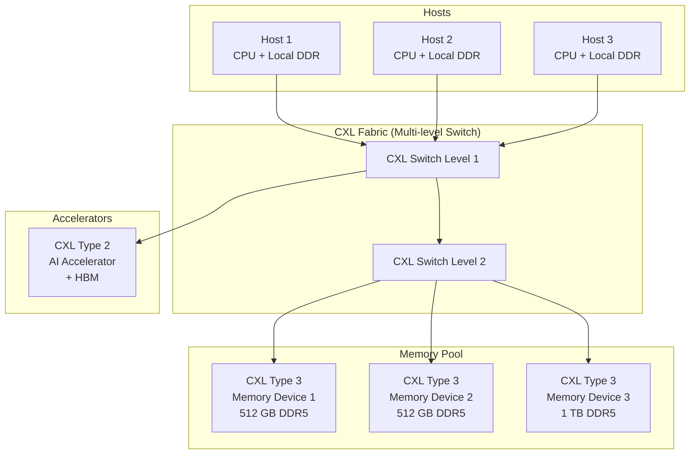

# AI Hardware & Chiplet Standards — Comprehensive Overview

**Category:** 40 — AI Hardware & Chiplets  
**Document:** 00 — Standards Landscape Overview  
**Scope:** UCIe, CXL, HBM3/4, MLPerf, NVLink/UALink, InfiniBand, power/thermal  
**Key Standards:** UCIe 1.1, CXL 3.1, JEDEC HBM3E, MLPerf, OCP/OAM  
**Audience:** AI accelerator architects, chiplet designers, datacenter hardware engineers  
**Prerequisites:** Computer architecture, high-speed interconnects, semiconductor packaging basics

---

## Chapter 1 — Historical Context

### 1.1 AI Hardware Milestones

| Year | Milestone | Impact |
|------|-----------|--------|
| 2012 | AlexNet (GPU-accelerated deep learning) | GPU for AI training established |
| 2016 | Google TPUv1 (inference ASIC) | Custom AI silicon justified |
| 2017 | NVIDIA V100 (Tensor Cores) | First dedicated DL hardware units |
| 2018 | MLPerf benchmark launched | Standardized AI hardware comparison |
| 2019 | CXL 1.0 specification | Memory-semantic interconnect |
| 2020 | AMD MI100 (CDNA architecture) | Chiplet-based AI accelerator |
| 2020 | HBM2E (3.6 Gbps/pin) | High bandwidth memory evolution |
| 2022 | UCIe 1.0 (Universal Chiplet Interconnect Express) | Open die-to-die standard |
| 2022 | CXL 3.0 (fabric, memory sharing) | Multi-host memory pooling |
| 2023 | NVIDIA H100 (Hopper) + NVLink 4.0 | 900 GB/s GPU interconnect |
| 2023 | HBM3 (8.4 Gbps/pin, 12-Hi stacks) | 1.2 TB/s per stack |
| 2024 | UCIe 1.1 (multi-protocol, 3D) | Enhanced chiplet standard |
| 2024 | CXL 3.1 specification | Refined fabric operations |
| 2024 | UALink 1.0 (Ultra Accelerator Link) | Open accelerator-to-accelerator interconnect |
| 2024 | HBM3E (9.6 Gbps/pin) | 1.5+ TB/s bandwidth |
| 2025 | HBM4 (specification in progress) | 2048-bit interface, >2 TB/s |

### 1.2 Standards Landscape

```mermaid
graph TB
    subgraph "Die-to-Die (Chiplet)"
        UCIE[UCIe 1.1<br/>Universal Chiplet<br/>Interconnect Express]
        BOW[BoW<br/>Bunch of Wires<br/>(OCP)]
    end
    
    subgraph "Chip-to-Chip"
        CXL[CXL 3.1<br/>Compute Express Link<br/>(memory-semantic)]
        NVLINK[NVLink / NVSwitch<br/>(NVIDIA proprietary)]
        UALINK[UALink 1.0<br/>Ultra Accelerator Link<br/>(open standard)]
    end
    
    subgraph "Memory"
        HBM[JEDEC HBM3E/4<br/>High Bandwidth Memory]
        GDDR[JEDEC GDDR7<br/>Graphics DDR]
        DDR5[JEDEC DDR5<br/>(with CXL)]
        LPDDR[JEDEC LPDDR5X<br/>Low Power]
    end
    
    subgraph "Network / Fabric"
        IB[InfiniBand NDR/XDR<br/>NVIDIA / OFA]
        ROCE[RoCEv2<br/>RDMA over Ethernet]
        UETH[Ultra Ethernet<br/>Consortium]
    end
    
    subgraph "Benchmarks & Form Factor"
        MLPERF[MLPerf<br/>(MLCommons)]
        OAM[OAM (OCP)<br/>Accelerator Module]
        OCP[OCP Server<br/>Form factors]
    end
    
    UCIE --> CXL
    UCIE --> HBM
    CXL --> DDR5
    NVLINK --> HBM
    UALINK --> HBM
```

---

## Chapter 2 — UCIe (Universal Chiplet Interconnect Express)

### 2.1 UCIe 1.1 Specification Overview

| Feature | UCIe 1.0 (2022) | UCIe 1.1 (2024) |
|---------|----------------|----------------|
| Signaling | NRZ (single-ended) | NRZ + PAM4 support |
| Data rate | 4, 8, 12, 16, 24, 32 GT/s | Up to 32 GT/s |
| Bump pitch | Standard: 100μm; Advanced: 25-55μm | Standard + Advanced (enhanced) |
| Protocols supported | PCIe, CXL | PCIe, CXL, streaming (raw) |
| Packaging | 2D/2.5D (silicon bridge, organic interposer) | 2D/2.5D + 3D stacking |
| Link width | 16x (standard), 64x (advanced) | Flexible configurations |
| Latency | 2-5 ns (die-to-die) | 2-5 ns |
| Retimer support | No | Yes (UCIe retimer spec) |

### 2.2 UCIe Protocol Stack

```mermaid
graph TB
    subgraph "UCIe Protocol Stack"
        PROT[Protocol Layer<br/>─ PCIe 5.0/6.0 flit<br/>─ CXL 2.0/3.0<br/>─ Streaming (raw data)]
        
        ADAPTER[Adapter Layer (Die-to-Die)<br/>─ Link state management<br/>─ Flit packing/unpacking<br/>─ Credit/retry<br/>─ CRC/parity]
        
        PHY[Physical Layer (D2D PHY)<br/>─ Electrical signaling<br/>─ Clock/data recovery<br/>─ Training & calibration<br/>─ Sideband channel]
        
        PKG[Packaging<br/>─ Standard (≥100μm pitch)<br/>─ Advanced (25-55μm pitch)<br/>─ Organic/silicon bridge/3D]
    end
    
    PROT --> ADAPTER
    ADAPTER --> PHY
    PHY --> PKG
```

### 2.3 UCIe Bandwidth Comparison

| Configuration | Bump Pitch | Data Rate | Bandwidth (per module) |
|--------------|-----------|----------|----------------------|
| Standard 16-lane, 4 GT/s | 100μm | 4 GT/s | 4 GB/s |
| Standard 16-lane, 32 GT/s | 100μm | 32 GT/s | 32 GB/s |
| Advanced 64-lane, 16 GT/s | 25μm | 16 GT/s | 128 GB/s |
| Advanced 64-lane, 32 GT/s | 25μm | 32 GT/s | 256 GB/s |

---

## Chapter 3 — CXL (Compute Express Link)

### 3.1 CXL Version Comparison

| Feature | CXL 1.1 | CXL 2.0 | CXL 3.0 | CXL 3.1 |
|---------|---------|---------|---------|---------|
| Base PHY | PCIe 5.0 (32 GT/s) | PCIe 5.0 | PCIe 6.0 (64 GT/s) | PCIe 6.0 |
| Switching | No | Single-level switch | Multi-level fabric | Enhanced fabric |
| Memory pooling | No | Yes (Type 3 devices) | Enhanced (shared memory) | Refined operations |
| Back-invalidate | No | No | Yes (BMC ↔ device) | Yes |
| Memory sharing | No | No | Yes (hardware coherent) | Enhanced |
| Global Fabric Attached Memory | No | No | Yes (GFAM) | Refined |
| Bandwidth (x16) | 64 GB/s | 64 GB/s | 128 GB/s | 128 GB/s |

### 3.2 CXL Device Types

| Type | Protocol | Description | Use Case |
|------|----------|-------------|----------|
| Type 1 | CXL.io + CXL.cache | Accelerator with no host-managed memory | SmartNIC, crypto accelerator |
| Type 2 | CXL.io + CXL.cache + CXL.mem | Accelerator with own memory (device-coherent) | GPU, AI accelerator, FPGA |
| Type 3 | CXL.io + CXL.mem | Memory expansion device | Memory expander, persistent memory |

### 3.3 CXL.mem Sub-Protocols

| Protocol | Direction | Function |
|----------|-----------|----------|
| M2S Req | Host → Device | Memory read/write requests |
| M2S RwD | Host → Device | Memory write data |
| S2M NDR | Device → Host | Completion without data |
| S2M DRS | Device → Host | Completion with data (read response) |
| S2M BISnp | Device → Host | Back-invalidate snoop (CXL 3.0+) |

### 3.4 CXL Memory Pooling Architecture (CXL 3.0)



---

## Chapter 4 — HBM (High Bandwidth Memory)

### 4.1 HBM Generation Comparison

| Feature | HBM2 | HBM2E | HBM3 | HBM3E | HBM4 (expected) |
|---------|-------|-------|------|-------|-----------------|
| JEDEC Standard | JESD235B | JESD235C | JESD238 | JESD238A | JESD238B (draft) |
| Year | 2018 | 2020 | 2022 | 2024 | 2025-2026 |
| Pin speed | 2.0 Gbps | 3.6 Gbps | 6.4-8.4 Gbps | 9.6 Gbps | 12+ Gbps |
| Interface width | 1024-bit | 1024-bit | 1024-bit | 1024-bit | 2048-bit |
| Bandwidth/stack | 256 GB/s | 460 GB/s | 819 GB/s | 1.2 TB/s | 2+ TB/s |
| Stack height | 4/8-Hi | 8-Hi | 8/12/16-Hi | 8/12/16-Hi | 12/16-Hi |
| Capacity/stack | 4-8 GB | 8-16 GB | 16-24 GB | 24-36 GB | 48+ GB |
| TSV pitch | 40-56 μm | 40-56 μm | 28-40 μm | 28-36 μm | ~20 μm |
| Power/bit | ~3.9 pJ/bit | ~3.9 pJ/bit | ~3.7 pJ/bit | ~3.5 pJ/bit | <3.0 pJ/bit |

### 4.2 HBM in AI Accelerators

| Product | HBM Type | Stacks | Total Bandwidth | Total Capacity |
|---------|----------|--------|----------------|---------------|
| NVIDIA A100 | HBM2E | 5 | 2.0 TB/s | 80 GB |
| NVIDIA H100 | HBM3 | 5 | 3.35 TB/s | 80 GB |
| NVIDIA H200 | HBM3E | 6 | 4.8 TB/s | 141 GB |
| NVIDIA B200 | HBM3E | 8 | 8.0 TB/s | 192 GB |
| AMD MI300X | HBM3 | 8 | 5.3 TB/s | 192 GB |
| Intel Gaudi 3 | HBM2E | 6 | 3.7 TB/s | 128 GB |

---

## Chapter 5 — MLPerf Benchmarks (MLCommons)

### 5.1 MLPerf Benchmark Suites

| Suite | Scope | Key Metrics |
|-------|-------|-------------|
| MLPerf Training | Time to train model to target quality | Time-to-train (minutes) |
| MLPerf Inference | Throughput & latency at quality target | Samples/sec, latency percentiles |
| MLPerf HPC | High-performance computing ML | Time-to-train at scale |
| MLPerf Tiny | Edge/embedded ML inference | Latency, energy per inference |
| MLPerf Storage | Storage I/O for ML workloads | Samples/sec (data loading) |

### 5.2 MLPerf Training Benchmarks (v4.0)

| Benchmark | Model | Dataset | Target Quality |
|-----------|-------|---------|---------------|
| Image Classification | ResNet-50 v1.5 | ImageNet (1.28M images) | 75.9% top-1 accuracy |
| Object Detection (lightweight) | RetinaNet | OpenImages (1.17M images) | 0.3757 mAP |
| Object Detection (heavyweight) | Mask R-CNN | COCO (118K images) | 0.377 Box mAP |
| Speech Recognition | RNN-T | LibriSpeech | 0.058 WER |
| NLP | BERT-Large | Wikipedia + BooksCorpus | 0.72 F1 (SQuAD) |
| Recommendation | DLRM-DCNv2 | Criteo 1TB (synthetic) | 0.8025 AUC |
| LLM Fine-tuning | GPT-3 175B | C4 dataset subset | Loss threshold |
| LLM Pre-training | LLaMA-2 70B | C4 + Wikipedia | Perplexity threshold |
| Stable Diffusion | Stable Diffusion v2 | LAION-400M | FID ≤ 90, CLIP ≥ 0.15 |

### 5.3 MLPerf Inference Scenarios

| Scenario | Description | Key Metric |
|----------|-------------|-----------|
| Offline | Batch processing (all samples available) | Samples/second |
| Server | Random arrival rate (Poisson) | Queries/second at latency constraint |
| Single Stream | One query at a time (mobile/edge) | 90th percentile latency |
| Multi-Stream | Multiple concurrent streams | Number of streams at latency target |

---

## Chapter 6 — Accelerator Interconnects

### 6.1 UALink (Ultra Accelerator Link)

| Feature | Specification |
|---------|--------------|
| Organization | UALink Consortium (AMD, Broadcom, Cisco, Google, HPE, Intel, Meta, Microsoft) |
| Purpose | Open standard for AI accelerator-to-accelerator communication |
| Version 1.0 | 2024 (initial specification) |
| Based on | AMD Infinity Fabric concepts |
| Bandwidth target | 200 GB/s per link (bidirectional) |
| Topology | Point-to-point, switched (UALink switch) |
| Protocol | Load/store with RDMA semantics |
| Scale | Pod-level (up to 1024 accelerators in spec) |
| Memory model | Coherent memory access across accelerators |

### 6.2 NVLink / NVSwitch

| Generation | NVLink 3.0 (A100) | NVLink 4.0 (H100) | NVLink 5.0 (B200) |
|-----------|-------------------|-------------------|-------------------|
| Bandwidth per link | 50 GB/s (bidirectional) | 50 GB/s | 100 GB/s |
| Links per GPU | 12 | 18 | 18 |
| Total GPU BW | 600 GB/s | 900 GB/s | 1.8 TB/s |
| NVSwitch | 3rd gen | 4th gen (L4 switch chip) | 5th gen |
| Scale (GPU cluster) | 8 GPUs (DGX A100) | 8 GPUs (DGX H100) + 256 via NVSwitch network | 72 GPUs (DGX B200 SuperPod) |
| All-reduce BW | 600 GB/s (8 GPU) | 900 GB/s (8 GPU); NVLink Network for larger | 1.8 TB/s (72 GPU) |

### 6.3 InfiniBand Roadmap

| Generation | Standard | Data Rate | Port BW | Year |
|-----------|----------|----------|---------|------|
| HDR | NDR-1 | 50 Gbps/lane | 200 Gbps (4×) | 2019 |
| NDR | NDR | 100 Gbps/lane | 400 Gbps (4×) | 2022 |
| XDR | XDR | 200 Gbps/lane | 800 Gbps (4×) | 2025 |
| GDR | GDR (planned) | 400 Gbps/lane | 1.6 Tbps (4×) | 2027+ |

---

## Chapter 7 — Power & Thermal Standards

### 7.1 AI Accelerator Power Challenges

| Component | Power Budget (H100) | Thermal Challenge |
|-----------|-------------------|-------------------|
| GPU die | ~500W | Direct liquid cooling required |
| HBM stacks (5×) | ~50-75W total | Heat spreading to interposer |
| Interconnect (NVLink) | ~50W | PCB thermal management |
| Memory controllers | ~25W | Die thermal distribution |
| **Total TDP** | **700W** | **DGX: 10.2 kW per system** |

### 7.2 Cooling Standards

| Standard | Scope | Relevance |
|----------|-------|-----------|
| ASHRAE TC 9.9 | Data center thermal guidelines | Inlet temp classes (A1-A4) |
| OCP Rack & Power | Open Compute Project rack specs | Liquid cooling specifications |
| JEDEC JESD51 | Thermal measurement methods | Junction temperature testing |
| SEMI G88 | Semiconductor thermal resistance | Die/package thermal characterization |
| IEC 62368-1 | A/V/IT equipment safety | Surface temperature limits |

### 7.3 OCP OAM (Open Accelerator Module)

| Feature | OAM Specification |
|---------|------------------|
| Form factor | Standardized baseboard mating | 
| Power delivery | Up to 700W per module |
| Cooling | Direct liquid cooling capable |
| Interconnect | 8× OAM on Universal Baseboard (UBB) |
| Electrical | High-speed SerDes (112 Gbps/lane) |
| Adopted by | AMD (MI300), Intel (Gaudi), others |

---

## Chapter 8 — Interview Questions

### Tier 1: Entry-Level
1. What is UCIe and how does it differ from PCIe?
2. Explain the three CXL device types (Type 1, 2, 3).
3. What is HBM and why is it preferred over GDDR for AI accelerators?
4. What does MLPerf measure and what are its main benchmark suites?

### Tier 2: Mid-Level
1. Walk through the UCIe protocol stack (Protocol → Adapter → PHY → Packaging).
2. How does CXL 3.0 memory pooling work and what are its use cases for AI inference?
3. Compare NVLink 4.0 vs. UALink 1.0 in terms of topology, bandwidth, and ecosystem.
4. Explain HBM3E specifications and its thermal integration challenges.

### Tier 3: Senior/Lead
1. Design a chiplet-based AI accelerator using UCIe for die-to-die and CXL for host attach.
2. How do you architect a 1024-GPU AI training cluster comparing InfiniBand NDR vs. RoCEv2?
3. Explain power delivery challenges for a 700W accelerator and liquid cooling requirements (OCP OAM).
4. How do you design an MLPerf-optimized inference system for 1ms latency at maximum throughput?

### Tier 4: Principal
1. Design a next-generation AI supercomputer architecture using UCIe chiplets + CXL 3.0 + UALink + HBM4.
2. How should UCIe evolve to support optical die-to-die interconnects for disaggregated computing?
3. Propose a standard for AI accelerator energy efficiency (performance per watt) that extends MLPerf.
4. How do you architect memory-centric computing for trillion-parameter models using CXL fabric + HBM pooling?

---

*Document Version: 1.0 | Last Updated: May 2026 | Author: Technology Standards Team*
